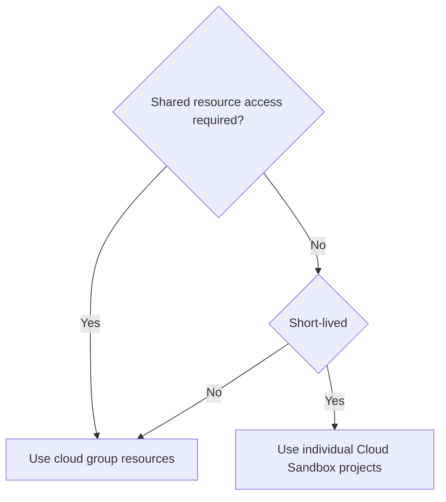

このページでは、GitLab の Developer Relations チームが利用しているクラウドリソースとワークフローを概説します。リソースを効果的に管理・割り当てるためのガイダンスを提供し、長期的な本番環境と短期的な個人リソースの双方でベストプラクティスを維持しながら、コミュニティアプリ、デモプロジェクト、コントリビューター支援ツール向けにクラウドインフラをチームメンバーが活用できるようにします。

## クラウドリソース

### Google Cloud リソース

Google Cloud プロジェクト `group-community-a29572` は次の用途に利用されています。

| 名称 | 種別 | スコープ | チーム | リソース | 備考 |
|------|-------|------|------|-----------|-------|
| デモプロジェクト | Demos | テスト/ステージング | Developer Advocacy | GKE クラスター、VM、DNS  | [ハンドブック](/handbook/marketing/developer-relations/developer-advocacy/projects/#project-resources) |
| Contributors Success | Storage/Traffic | 本番 | Contributors Success | Storage | [GDK-in-a-box 仮想イメージ](https://gitlab.com/gitlab-org/gitlab-development-kit/-/blob/main/doc/gdk_in_a_box.md) |

プロビジョニングされたら、[Google Cloud Console](https://console.cloud.google.com/) からプロジェクトにアクセスできます。クイックアクセス:

1. [Compute 概要](https://console.cloud.google.com/compute/overview)
1. [Kubernetes Engine](https://console.cloud.google.com/kubernetes/list/overview)
1. [Cloud Run](https://console.cloud.google.com/run)
1. [SQL](https://console.cloud.google.com/sql/instances)
1. [Cloud Storage](https://console.cloud.google.com/storage/browser)
1. [IAM & Admin](https://console.cloud.google.com/iam-admin/iam)

技術的オーナー: @johncoghlan @dnsmichi

## ワークフロー

1. Developer Relations チームのメンバー全員が、`Editor` ロールを使って Google Cloud の [community-group プロジェクト](https://console.cloud.google.com/kubernetes/list/overview?hl=en&project=group-community-a29572) でリソースを管理できます。
   - このアクセスはデフォルトでは付与されません。チームメンバーの追加・削除には[アクセスリクエスト](/handbook/security/corporate/end-user-services/access-requests/access-requests/)を作成してください（例: [グループ更新の AR](https://gitlab.com/gitlab-com/team-member-epics/access-requests/-/issues/13320)）。
1. Google Cloud / AWS では、[商標化されていないドメインを登録](https://internal.gitlab.com/handbook/it/it-self-service/it-guides/domains-dns/#non-trademark-domain-names)（社内）してデモ用途で利用することもできます。

### デモ環境

顧客向けのデモ環境については、新しい環境を作成する前に既存のリソースを確認してください。

1. [デモシステムのハンドブック](/handbook/customer-success/demo-systems/): [GitLab Learn Labs](https://gitlab.com/gitlab-learn-labs)。
1. [Developer Advocacy のコンテンツハンドブック](/handbook/marketing/developer-relations/developer-advocacy/content/): プロダクトツアー、クリックスルーデモ、ワークショップなど。

### 長期的な本番環境

デプロイメントのデバッグが必要なデモには、Google Cloud などの共有リソースを優先してください。

1. SSO ログインで利用できない場合は、1Password ボールトにアクセス情報をドキュメント化してください。
1. 必要のないリソースはシャットダウンしてください（例: 利用していない Kubernetes クラスター）。

### 個人の短期的リソース

ブログ記事のための個人的な短期チュートリアルやデモのセットアップには、AWS や GCP 用の [Cloud Sandbox Realm](/handbook/company/infrastructure-standards/realms/sandbox/#how-to-get-started) を優先してください。これは自動シャットダウンや、アクセスを容易にする生成ドメインなどを提供します。

### 意思決定のワークフロー

