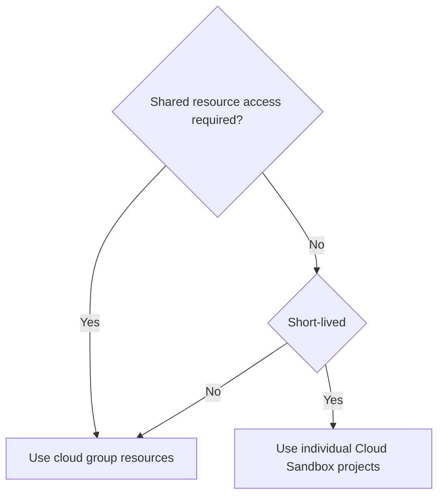

このページでは、GitLab の Developer Relations チームが使用するクラウドリソースとワークフローを概説します。リソースを効果的に管理・割り当てるためのガイダンスを提供し、長期的な本番環境と短期的な個人リソースの両方でベストプラクティスを維持しながら、チームメンバーがコミュニティアプリ、デモプロジェクト、コントリビューターの成功ツールにクラウドインフラを活用できるようにします。

## クラウドリソース

### Google Cloud リソース

Google Cloud プロジェクト `group-community-a29572` は、次の用途に使用します:

| 名前 | 種類 | 範囲 | チーム | リソース | 注記 |
|------|-------|------|------|-----------|-------|
| デモプロジェクト | デモ | テスト/ステージング | Developer Advocacy | GKE クラスター、VM、DNS  | [ハンドブック](/handbook/marketing/developer-relations/developer-advocacy/projects/#project-resources) |
| Contributors Success | ストレージ/トラフィック | 本番 | Contributors Success | ストレージ | [GDK-in-a-box 仮想イメージ](https://gitlab.com/gitlab-org/gitlab-development-kit/-/blob/main/doc/gdk_in_a_box.md) |

プロビジョニングされると、[Google Cloud Console](https://console.cloud.google.com/) でプロジェクトにアクセスできます。クイックアクセス:

1. [Compute の概要](https://console.cloud.google.com/compute/overview)
1. [Kubernetes Engine](https://console.cloud.google.com/kubernetes/list/overview)
1. [Cloud Run](https://console.cloud.google.com/run)
1. [SQL](https://console.cloud.google.com/sql/instances)
1. [Cloud Storage](https://console.cloud.google.com/storage/browser)
1. [IAM & Admin](https://console.cloud.google.com/iam-admin/iam)

技術的オーナー: @johncoghlan @dnsmichi

## ワークフロー

1. すべての Developer Relations チームメンバーは、`Editor` ロールを使用して Google Cloud の [community-group プロジェクト](https://console.cloud.google.com/kubernetes/list/overview?hl=en&project=group-community-a29572)でリソースを管理できます。
   - このアクセスはデフォルトではプロビジョニングされません。チームメンバーを追加・削除するには、[アクセスリクエスト](/handbook/eta/corporate-it/end-user-services/access-requests/access-requests/)を作成してください（例: [グループ更新 AR](https://gitlab.com/gitlab-com/team-member-epics/access-requests/-/issues/13320)）。
1. Google Cloud/AWS では、[商標登録されていないドメインを登録](https://internal.gitlab.com/handbook/security/product_security/infrastructure_security/guides/domains-dns/#non-trademark-domain-names)（社内）し、そのドメインをデモのセットアップに使用することもできます。

### デモ環境

顧客向けデモ環境の場合は、新しい環境を作成する前に既存のリソースを確認してください:

1. [デモシステムのハンドブック](/handbook/customer-success/demo-systems/): [GitLab Learn Labs](https://gitlab.com/gitlab-learn-labs)。
1. [Developer Advocacy コンテンツのハンドブック](/handbook/marketing/developer-relations/developer-advocacy/content/): プロダクトツアー、クリックスルーデモ、ワークショップなど。

### 長期的な本番環境

デプロイメントのデバッグが必要なデモには、たとえば Google Cloud の共有リソースを優先してください。

1. SSO ログインで利用できない場合は、1Password ボールトにアクセスを記録してください。
1. 必要ない場合はリソースをシャットダウンしてください（たとえば、アイドル状態の Kubernetes クラスター）。

### 個人の短期的なリソース

ブログ投稿用の個別の短期チュートリアルまたはデモのセットアップには、AWS または GCP 向けの [Cloud Sandbox Realm](/handbook/company/infrastructure-standards/realms/sandbox/#how-to-get-started)を優先してください。これにより、自動シャットダウン、アクセスしやすい生成ドメインなどが提供されます。

### 意思決定ワークフロー

```mermaid
flowchart TD;
  A{Shared resource access required?}
  A -->|Yes| B[Use cloud group resources]
  A -->|No| C{Short-lived}
  C --> |Yes| D[Use individual Cloud Sandbox projects]
  C --> |No| B
```
