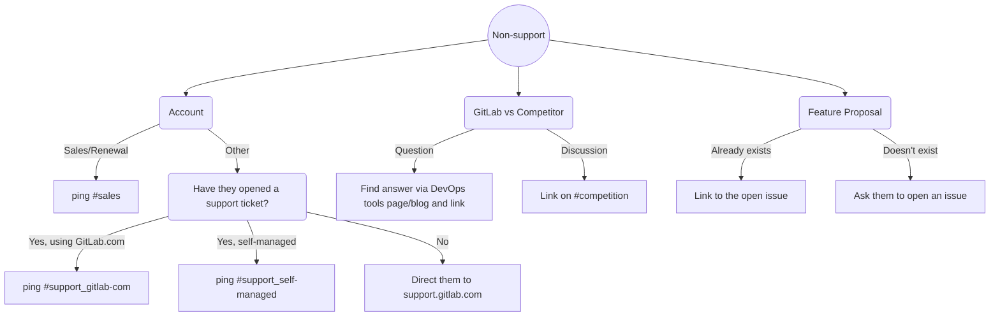
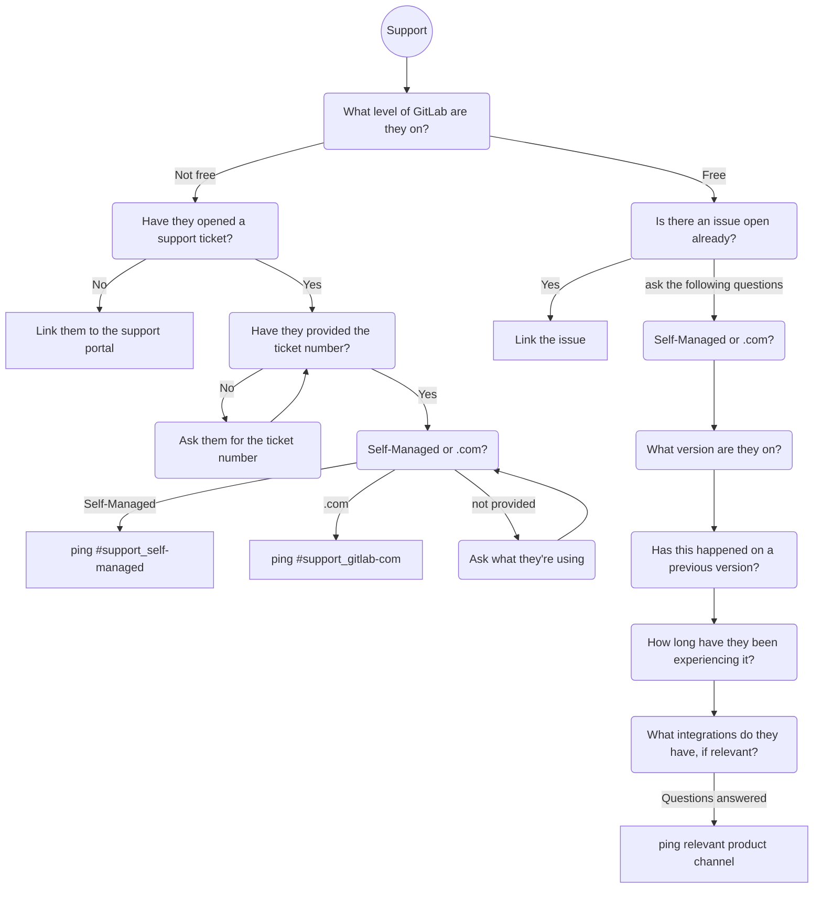

GitLab コミュニティフォーラム（forum.gitlab.com）は、ユーザーが登録し、質問し、協力し合うためのプラットフォームであり、GitLab の透明性とコミュニティへの貢献という価値観を体現しています。トラスト（信頼）レベルに基づくシステム、モデレーションのワークフロー、ディスカッションを整理するためのカテゴリーやタグなど、さまざまなツールが備わっています。フォーラムは、より広いコミュニティと GitLab チームメンバー双方からの参加を促し、行動規範と明確な管理プロセスを維持しながら、知識共有の環境を構築することを目指しています。

## ユーザー

### 登録とログイン

より広いコミュニティのメンバーは、[コミュニティフォーラム](https://forum.gitlab.com/)で `Sign up` ボタンを使用し、希望する方法（メール、oauth など）を選んでアカウント登録できます。

GitLab チームメンバーには `with GitLab` oauth 方式の利用が推奨されます。これは、GitLab.com を oauth プロバイダーとして認証し、作成されるプロフィールを事前入力し、その後の oauth ログインとして機能します。この方式は追加の権限も付与します。下記の[ユーザー](#users)管理セクションを参照してください。あるいは `gitlab.com` アドレスを使った手動サインアップと 2FA の設定でも問題ありません。

### 行動規範と FAQ

[コミュニティ行動規範](https://about.gitlab.com/community/contribute/code-of-conduct/)はフォーラムプラットフォームにも適用されます。判断に迷う場合は、行動規範に違反するか、その他の不適切な内容（スパム、広告など）の[投稿をフラグ](https://meta.discourse.org/t/flagging-a-post-for-moderator-attention/32783)してください。モデレーターは投稿が一般公開から隠された状態でレビューと対応を行えます。

Discourse はユーザー向けに一般的な [FAQ](https://forum.gitlab.com/faq) を提供しています。

### GitLab フォーラムでの応答方法

1. [フォーラム](https://forum.gitlab.com/)を訪問し、カテゴリーに移動してください。あるいは [New](https://forum.gitlab.com/new)、[Latest](https://forum.gitlab.com/latest)、[Unread](https://forum.gitlab.com/unread) の検索フィルターを使用してください。
2. 可能であれば返信を書き、対応や進め方が分からない場合はチームメンバーに支援を求めてください。トラブルシューティングの質問や詳細を尋ねることも返信としてカウントされます！ 一度ですべてに答えなくてもかまいません。

質問への回答を見つけるために、次のリソースを活用してみてください。

- 関連トピックをフォーラムで検索する — 似たことを既に解決したコミュニティメンバーが見つかるかもしれません。会話に呼び込んだり、参考になりそうなスレッドを案内したりできます。
- [GitLab のドキュメント](https://docs.gitlab.com)を検索し、トラブルシューティングに役立つ情報を探す。

### より広いコミュニティと協働する

GitLab Community Forum では、技術サポートやトラブルシューティングのほとんどは、自分の時間と知識を提供して他のユーザーを助けるコミュニティメンバーから提供されます。

コミュニティメンバーが時間を割いて他のメンバーを助けているのを見たら、その返信に :heart: を付けて、貢献への感謝を示しましょう。

### 不適切なコンテンツのフラグ

GitLab チームメンバーが不適切、虐待的、スパム、または行動規範違反のフォーラム投稿を見つけた場合、フラグアイコンをクリックして投稿にフラグを立ててください。投稿は自動的に一般公開から隠され、レビューのため[モデレーション](#moderation)キューに追加されます。フラグ操作にコンテキストや即時対応が必要な場合は、[#developer-relations](https://gitlab.slack.com/archives/C0R04UMT9) Slack チャンネルで[管理者](https://forum.gitlab.com/about)に連絡してください。

個人情報を即座に隠したり伏字にしたりする必要がある場合は、投稿にフラグを立てた上で、[#developer-relations](https://gitlab.slack.com/archives/C0R04UMT9) Slack チャンネルで[管理者](https://forum.gitlab.com/about)の誰かにメンションしてください。

## ベストプラクティス

- 特にユーザーがフォーラムに新しい場合は、常に礼儀正しく、寛大に接してください。新規ユーザー（および休眠ユーザー）は、投稿の上部にある青色の一時的なバナーで認識できます。
- 新規ユーザーへの返信時には歓迎メッセージを添えてください。投稿の冒頭に「Hi, and welcome to the forum! :smile:」のようなシンプルなものでもかまいません。
- ライクボタン（ハートアイコン）はできるだけ多く使用し、ユーザーの貢献に感謝し、他のユーザーにも同じことを促しましょう。
- 解決ボタン（チェックボックス）はできるだけ多く使用し、フォーラムトピックに回答があったことを他のユーザーに示しましょう。
- 質問への回答提供に対し、特に GitLab Staff グループに属さない方には、公の場で感謝を伝えましょう。

## モデレーション

モデレーション権限は、トピックの固定や（グローバル）アナウンスメントの作成のみに使うべきです。[モデレーター](https://forum.gitlab.com/g/moderators)は異なる責任とカテゴリーを分担しています。助けやガイダンスが必要な場合は、`#developer-relations` Slack チャンネルで連絡してください。

### レビュー

Discourse は高度なスパム防止システムを備えており、ユーザーや投稿がレビュー保留となります。同じワークフローはユーザーが手動で投稿にフラグを立てた場合にも適用されます。レビュー対象の項目は右上のメニューに赤いカウントで示され、[Review](https://forum.gitlab.com/review?sort_order=score) セクションから直接アクセスできます。

- GitLab、DevOps などに関連しないトピックや、外部 URL が多数含まれるテキストはしばしばスパムです。
  - `Delete User > Delete and Block User` で対応してください。これにより投稿も削除されます。
- 別のトピックや返信の本文をコピーし、新しい URL で独自の新トピックを作成するボットがあります。Discourse はこれらを `New user typed their first post suspiciously fast, suspected bot or spammer behavior.` として検出します。
  - `Delete User > Delete and Block User` で対応してください。
- 偽陽性
  - `Me too.` のような短い返信
  - 別のプラットフォームからコピー＆ペーストされた質問
  - 投稿はないがプロフィール画像と個人のバイオ／Web サイトを持つユーザー
  - 推奨アクション: 投稿/ユーザーを承認する。
- 投稿が CoC（行動規範）違反としてフラグされた。
  - 投稿をレビューしてください。判断に迷う場合は Slack の `#coc-violations` で相談してください。
  - 投稿を `Edit` し、[行動規範のテンプレート](/handbook/marketing/developer-relations/workflows-tools/code-of-conduct-enforcement/#templates)に従ってテキストを置き換えてください。

#### ユーザーレビューのヒント

ユーザーアカウントが疑わしい場合、これらのヒントが検証に役立ちます。

- ユーザーのアバター画像を検索し、ストック写真でないか確認しましょう。[TinEye](https://tineye.com/) は逆画像検索を提供しています。
- ユーザー名、本名、GitLab ユーザー名（提供されている場合）、メールアドレス、バイオを比較し、人間によるインプットか確認しましょう。
  - ボットやスパムユーザーはしばしばバイオに URL やテキストを追加します。
  - 異なる名前の使用は偽プロフィールを示している可能性があります。
- 管理者権限がある場合:
  - ユーザープロフィール上で管理者インターフェースを開きます。Discourse 組み込みの Whois 検索機能で、ユーザープロフィールの IP アドレスを地理的位置情報も含めて確認しましょう。判断に迷う場合は、`whois <IP address>` で検索エンジンを使い、ASN とその ISP も確認してください。Google 検索で詐欺に好意的な環境に属していることや、その他の有用な詳細が判明することもあります。

### モデレーター固有の権限

[Moderator Quick Start guide はこちらのリンクから参照できます。](https://forum.gitlab.com/t/read-me-moderator-quick-start-guide/39564)

このガイドは、モデレーターの権限、期待事項、ベストプラクティスを説明しています。

#### モデレーター固有の非技術的な貢献

- 新規メンバーを歓迎する
- 既存の回答がフォーラムスレッドにないか確認する。既に回答があれば、ライクや解決済みマークの付与を検討する。
- フォーラムでカテゴリーを再割り当てする
- 適切なタグを追加または作成する
- 既存のスレッドで既に提供されている回答がフォーラム内にないか探す
- Support Zendesk インスタンスに、Support からのチケットで既に提供されている回答がないか探す
- スクリーンショット、エラーメッセージなど、初期トラブルシューティング用の質問を投稿者に行う

#### モデレーターの一般的なベストプラクティス

- すべてのインタラクションと返信は、オープンエンドにしておきましょう。フォーラムユーザーが、いつでも戻ってきて会話を再開できると感じられるようにしたいからです。
- たくさん貢献しているフォーラムユーザーや特に優れた貢献をしているユーザーを、[Notable Contributors](https://contributors.gitlab.com/docs/notable-contributors) として推薦することを検討してください。

#### モデレーターのみのアクセス

以下は、Discourse プラットフォームでフォーラムモデレーターのみが行えるアクションのリストです。このため、現時点ではモデレーターステータスは GitLab スタッフメンバーにのみ付与されています。

##### 採用された解決策のマーキング

単一の返信で効果的にフォーラムスレッドが解決される場合に、回答を「accepted solution（採用された解決策）」としてマークします。回答をマークできるのは、元の投稿者とモデレーターのみです。どうぞ気軽にこれを行ってください！ SEO の助けになり、ユーザーがどの質問に答えがついたか分かりやすくなります。

**手順**

投稿の小さなグレーのツールバーにある省略記号をクリック > チェックボックスをクリック。

##### トピックと投稿の編集

ライセンスや API キー、メールアドレスなど、ユーザーが誤ってプライベート情報を投稿することがあります。一般から識別可能な個人情報はフォーラムから伏せ字にする必要があります。このツールは、不適切な言葉や行動規範違反の伏せ字にも使用できます。

**手順**

理由によらずユーザーの投稿を編集する必要がある場合は、フォーラムでそのユーザーにプライベートメッセージを送り、編集したことと理由を知らせてください。

投稿の小さなグレーのツールバーにある省略記号をクリック > 鉛筆アイコンをクリック。

**プライベートメッセージの送信手順**

1. ユーザーのアバターアイコンをクリックすると、ユーザーカードが表示されます。
2. ユーザーカードの `message` ボタンをクリックしてプライベートメッセージを下書きします。

編集履歴の差分はモデレーターにのみ表示されます。

##### メールアドレスの確認

匿名性のため、フォーラムモデレーターのみがフォーラムユーザーアカウントに紐づくメールアドレスを確認できます。

**手順**

1. ユーザーのアバターアイコンをクリックすると、ユーザーカードが表示されます。
2. ユーザーカードのアバターアイコンをクリックして、ユーザーのプロフィールに移動します。
3. ユーザープロフィールの `show` ボタンをクリックします。

##### プライベートな Staff Category の利用／下書き

これはモデレーター専用ではありませんが、Staff カテゴリーを使って新しい知識共有記事や取り組みなど、必要なものを下書きできます。プライベートカテゴリーには小さな鍵アイコンが付きます。

##### トピックと投稿の削除

私たちはフォーラムでトピックや投稿を削除しません。これは主に、削除という行為が信頼を損ないうるからです。このルールには常に例外があり、よい例はスパム投稿が紛れ込んだ場合です。何かを削除すべきと感じた場合は、いつでもプライベートまたは [#developer-relations](https://gitlab.slack.com/archives/C0R04UMT9) Slack チャンネルで[管理者](#administration)に連絡してください — 一緒に話し合えます！

**手順**

投稿の小さなグレーのツールバーにある省略記号をクリック > ゴミ箱アイコンをクリック。

##### 投稿を新しいスレッドへ移動する

モデレーターが、新しい投稿を古いスレッドから出したり、独立したトピックへ完全に移したりする必要を感じることはよくあります。1 年以上経った古いトピックをユーザーが復活させようとしているとき、新しい投稿を古いトピックから出してください。

**手順**

1. UI の右側のレンチアイコンをクリック
2. ドロップダウンの `select post` をクリック
3. 移動したい会話の量に応じて `select+below` または `select` を選択
4. `move` を選び、ポップオーバーを適切に入力
5. `move to new topic` をクリック

## ワークフロー

### モデレーターおよび管理者のワークフロー

**フォーラム投稿をいつ・どのように編集するか。**

一般的に、私たちは他人の投稿を編集しません。改善できる点を見つけたら、プライベートに連絡し変更を依頼すべきです。これは、コミュニティと GitLab チームに対し、フォーラムに好きなものを投稿できる創造的な自由と自律性があることを示すため、信頼を築くのに役立ちます。

とはいえ、モデレーターが直接投稿を編集できる場合もあります。例と方法を以下に示します。

- GitLab の[ビジネス行動および倫理規範](/handbook/legal/gitlab-code-of-business-conduct-and-ethics/)と[イベント行動規範](/handbook/company/culture/ecoc/)の違反（例: 罵り言葉の伏せ字、本人が編集できない／したくない場合）
- [GDPR リクエスト](#gdpr-requests)で報告された個人情報（例: ライセンスキー、アカウント情報、メールアドレスなど）の伏せ字
- 編集は、投稿のツールバーのグレーの鉛筆アイコン（... > 鉛筆）から行えます。

**スレッド内で解決をマークするタイミングと方法。**

- トピックや質問に対して明確な回答がある場合
- 解決のマーキングは、投稿のツールバーのグレーのチェックボックスアイコン（... > チェックボックス）から行えます。

**フォーラム投稿やトピックを削除するタイミングと方法。**

- 他人の投稿を削除しないでください。必要な場合は、まずユーザーにメッセージを送り、自分で削除する機会を与えてください。
- いかなる理由でもコンテンツを削除することは信頼を損なう行為であり、私たちはフォーラムコミュニティでこれを必死に築こうとしています。投稿を削除する必要があると感じた場合は、状況を相談できるように管理者に連絡してください。

質問の内容に応じて、関連するワークフローに従ってください。





### フォーラム コミュニティ対応ワークフロー

[コミュニティ対応の状況](/handbook/marketing/developer-relations/developer-advocacy/community-response/#forum-topic-preparation)には、[Internal](https://forum.gitlab.com/c/internal/) カテゴリーに下書きとしてフォーラムトピックを準備することが含まれます。

チームメンバーは、トピックを作成するために[フォーラムアカウント](/handbook/marketing/developer-relations/workflows-tools/forum/#registration-and-login)へのサインアップが必要です。Internal カテゴリーは、チームメンバーが下書きをレビュー・編集できる一方で、一般には公開されない状態を維持します。

Internal カテゴリーにフォーラムトピックが作成された後、チームメンバーはタイトル、タグ、説明、投稿タイムスタンプ、カテゴリーを編集できます。

- トピックのタイトル、カテゴリー、タグを編集するには、上部の鉛筆アイコンをクリックします。
- 説明を編集するには、トピック下部の `Reply` の隣の鉛筆アイコンを使用します。鉛筆アイコンは省略記号メニュー内に折りたたまれている場合があります。
- 説明のみの編集は、[トラスト レベル 4](/handbook/marketing/developer-relations/workflows-tools/forum/#user-trust-levels)とモデレーターのみに利用可能です。必要に応じて、管理者に[チームメンバーのトラスト レベル](/handbook/marketing/developer-relations/workflows-tools/forum/#team-member-trust-level)の更新を依頼してください。

編集をテストするためのサンドボックストピックは[こちら（社内）](https://forum.gitlab.com/t/draft-announcement-sandbox-test-for-everyone/71974)で利用可能です。

#### フォーラム バナーアナウンスメント

Discourse 上でバナーを設定するステップ:

1. デザインコンポーネントをコンピューターにダウンロード
2. Discourse で Admin Panel > Customize > Themes > Top Navbar に移動
3. uploads の下で、`Add+` ボタンをクリック
4. デザインを追加
5. `Edit CSS/HTML` をクリック
6. ミニバナー CSS を追加:

   ```css
   .mini-banner__image {
     height: 60.5px;
     width: 720px;
     background-image: url($mini-banner);
     background-size: 100% 100%;
     margin: 0 auto;
   }
   ```

7. `After Header` をクリックし、CSS を機能させるためにこの div を追加

   ```html
   <div class="main-banner">
     <a href="https://forum.gitlab.com">
       <div class="main-banner__image"></div>
     </a>

     <a href="https://forum.gitlab.com/t/ci-cd-minutes-for-free-tier/40241" target="__blank">
       <div class="mini-banner__image"></div>
     </a>
   </div>
   ```

8. 画像のサイズによってわずかな調整が必要な場合があります

## 管理

- Developer Relations DRI: @sugaroverflow @dnsmichi
- [Tech stack オーナー](https://gitlab.com/gitlab-com/www-gitlab-com/-/blob/master/data/tech_stack.yml): @sugaroverflow @dnsmichi
- [フォーラム スタッフメンバー](https://forum.gitlab.com/about)

### Discourse プラットフォーム

Discourse インスタンス `forum.gitlab.com` は Discourse チームによって[彼らの SaaS プラットフォーム](https://www.discourse.org/pricing)上で運用されています。Discourse プラットフォームは 2015 年にセルフホストインスタンスとして開始され、その後 [2020 年 2 月に Discourse SaaS に移行](https://gitlab.com/groups/gitlab-com/gl-infra/-/epics/139)されました。ドメインは GitLab インフラチームが管理しています。

更新と重要なセキュリティ修正は [Discourse ホスティングチーム](https://www.discourse.org/pricing)によって適用されます。技術的オーナーは彼らのサポートチームに連絡できます。ビジネス組織やサブスクリプションの更新については、[Developer Advocate Meta プロジェクトに機密 Issue](https://gitlab.com/gitlab-com/marketing/developer-relations/developer-advocacy/developer-advocacy-meta/-/issues) を作成してください。

2021 年 10 月に、Discourse フォーラムは月間 100 万ページビューを超えました。さらなるメトリクスレポートは[管理ダッシュボード](https://forum.gitlab.com/admin)を使用して作成できます。

#### ユーザー トラスト レベル

Discourse は[トラスト レベル](https://meta.discourse.org/t/trust-level-permissions-reference/224824)を使用して、ユーザーがフォーラムプラットフォームを使用・関与するにつれて、より多くの信頼権限を付与します。このトラストシステムはまた、スパムユーザーを遠ざけ、議論し合いお互いに助け合うための安全な場を確保するのに役立ちます。

- 新規ユーザーはレベル 0 から始まり、いくつかのトピックと返信のみ投稿でき、トピックを読むことで関与してトラスト レベル 1 を得る必要があります。
- トラスト レベル 1 は、基本ユーザーとして DM の送信、画像のアップロード、投稿のフラグ付けなどの権限を付与します。
- トラスト レベル 2 のメンバーは、フォーラムで時間を過ごし、回答でユーザーを助け、ライクを受け取り与え、GitLab トピックについてより多く読んでいる人です。
- トラスト レベル 3 はレギュラーユーザーであり、頻繁に訪問し、有益な回答で道を切り開き、ライクで関与し、活力を感じる GitLab コミュニティのエバンジェリストとなることを意味します。
- トラスト レベル 4 のリーダーは、スタッフチームメンバーの推薦により、質問への支援、ライクでの関与、モデレーターへの投稿フラグ付け、新規ユーザーへの手助け、そして全般的に GitLab チームメンバーと密接に協力することで、その信頼を獲得した人です。

##### トラスト レベル 4 への推薦

[Developer Advocate Meta プロジェクトで新しい Issue](https://gitlab.com/gitlab-com/marketing/developer-relations/developer-advocacy/developer-advocacy-meta/-/issues) を開き、ユーザープロフィール URL とトラスト レベル 4 に昇格すべき詳細な理由を共有してください。クイックアクション `/assign @dnsmichi @sugaroverflow` を使用して、技術的オーナーに Issue をアサインしてください。管理者がレビューし、推薦されたコミュニティメンバーに連絡します。

##### チームメンバーのトラスト レベル

GitLab チームメンバーが oauth でサインアップすると、自動的に `gitlab-team` グループに追加され、[トラスト レベル 3](/handbook/marketing/developer-relations/workflows-tools/forum/#user-trust-levels) が付与されます。このグループは、フォーラム投稿で @-メンション通知をトリガーしません。

管理者は、たとえば[コミュニティ対応ワークフロー](/handbook/marketing/developer-relations/workflows-tools/forum/#forum-community-response-workflow)に必要な場合に、チームメンバーを手動でトラスト レベル 4 に昇格できます。

##### Core team メンバーのトラスト レベル

Core team メンバーは、[Core team オンボーディングプロセス](/handbook/marketing/developer-relations/engineering/core-team/#becoming-a-core-team-member)を通じて [core-team](https://forum.gitlab.com/g/core-team) グループに追加できます。このアクションにより、[トラスト レベル 3](/handbook/marketing/developer-relations/workflows-tools/forum/#user-trust-levels) が付与されます。このグループは、フォーラム投稿で @-メンション通知をトリガーしません。

#### カテゴリー

[フォーラムカテゴリー](https://forum.gitlab.com/categories)を使うと、投稿をセクションとトピックでグループ化できます。ユーザーはカテゴリーの通知を購読することもできます。トップレベルカテゴリーは、DevSecOps ライフサイクル、GitLab 機能に関する一般的な質問、コミュニティ活動から着想を得ています。

カテゴリーは、ユーザーがフォーラムランディングページの `New topic` アクションをフォローしたときにドロップダウンにも表示されます。私たちはカテゴリーリストを短く簡潔に保つよう努めています。

特別な目的を果たす 2 つのカテゴリーがあり、削除してはいけません:

- [Internal](https://forum.gitlab.com/c/internal/) は、[コミュニティ対応ワークフロー](/handbook/marketing/developer-relations/workflows-tools/forum/#forum-community-response-workflow)に必要です。
- [Staff](https://forum.gitlab.com/c/staff/) は、Discourse がサイトコンテンツと権限を管理するために使用します（例: [FAQ](https://forum.gitlab.com/faq)）。

新しいカテゴリーをリクエストするには、次のステップを確認してください。

1. 特定のトピックをフィルタリングしたい、または通知を購読したいですか？ そうであれば、代わりに[タグ](#tags)の使用を検討してください。
1. 新しいカテゴリーは、既存のトップレベルカテゴリーのサブカテゴリーとして収まるべきです。コントリビューターのワークフローを壊すような大きなレイアウト変更は避けるよう努めています。
1. [Developer Advocate Meta プロジェクトで新しい Issue](https://gitlab.com/gitlab-com/marketing/developer-relations/developer-advocacy/developer-advocacy-meta/-/issues) を作成して議論し、フォーラム DRI、想定されるトピック数、影響について詳細を追加してください。クイックアクション `/assign @dnsmichi @sugaroverflow` を使用して、技術的オーナーに Issue をアサインしてください。

##### カテゴリー トピックテンプレート

Discourse は、Issue/Epic/MR の GitLab 説明テンプレートと同様の[カテゴリー トピックテンプレート](https://meta.discourse.org/t/using-topic-templates-for-categories/38295)をサポートしています。テンプレートは、質問のすべての詳細（設定、再現手順、バージョンなど）を提供するようユーザーをガイドし、フォーラムコントリビューターがより効率的に支援できるようにします。カテゴリーは、サポート（「How to use GitLab」など）、コミュニティのエンゲージメントとプログラム、GitLab University にフォーカスしています。一般的なキャッチオールカテゴリーは、ユーザーをデフォルトテンプレートとして特定のカテゴリーを選択するよう導きます。

管理者は各カテゴリーを編集し、`Templates` に移動してテンプレートを変更できます。サブカテゴリーはトップレベルテンプレートのコピーが必要であり、これによりすべてのカテゴリーがデフォルトでテンプレートを使用するようになります。過去に、テンプレートのないカテゴリーをユーザーが意図的に選び、間違った場所で新しいトピックを作成したことがありました。

すべてのテンプレートは [discourse-assets Git リポジトリ](https://gitlab.com/gitlab-da/projects/discourse-assets/-/tree/main/category_templates?ref_type=heads)に永続化されており、トップレベルカテゴリー用のテンプレートを提供しています。

カテゴリー トピックテンプレートを更新するステップ:

1. カテゴリー設定に移動し、`Templates` を選択します。
1. テンプレートを編集し、変更をプレビューします。
1. テンプレートを保存し、カテゴリーで新しいトピックを作成してテストします。
1. 変更を [discourse-assets Git リポジトリ](https://gitlab.com/gitlab-da/projects/discourse-assets/-/tree/main/category_templates?ref_type=heads)に永続化します。

#### タグ

ユーザーはトピックにタグを追加できます。より高いトラスト レベルではタグの作成も可能です。ユーザーはタグでトピックをフィルタリングしたり、タグの通知を購読したりできます。これは、docs およびブログチームの特定のワークフローに役立ちます。

タググループ [`feedback`](https://forum.gitlab.com/tag_groups/6) には、次のタグが含まれます:

- [`docs-feedback`](https://forum.gitlab.com/tag/docs-feedback) は、docs.gitlab.com のフィードバックを呼びかけるためにテクニカルライティングチームが使用します。
- [`blog-feedback`](https://forum.gitlab.com/tag/blog-feedback) は、フィードバックの CTA として GitLab ブログのフッターに埋め込まれています。

#### 設定

管理者は [Discourse の設定](https://forum.gitlab.com/admin/site_settings/category/all_results)を変更できます。提案、議論、変更のドキュメンテーションのため、[Developer Advocate Meta プロジェクトで新しい Issue](https://gitlab.com/gitlab-com/marketing/developer-relations/developer-advocacy/developer-advocacy-meta/-/issues) を作成してください。プラグインは Discourse Support に連絡することでインストールされます。

`Only show overridden` チェックボックスは、変更された設定を確認するのに役立ちます。最も重要な変更は以下にドキュメント化されています。

- 必須: タイトル、サイト説明、連絡先メール、会社名
- ブランディング: ロゴ、ファビコンなど
- 基本セットアップ: ユーザーロケールの許可、ga universal tracking code、トップメニュー、カテゴリーカラー、固定カテゴリー位置、whisper の有効化、短いタイトル
- ログイン: GH ログイン、oauth2 有効（[discourse-oauth2-basic](https://meta.discourse.org/t/discourse-oauth2-basic/33879) 経由の GitLab oauth）
- ユーザー: ユーザー名の逆順、停止理由の非表示、ユーザー名と名前の提案にメールを使用
- 投稿: 最小投稿/トピックタイトルの長さ、未分類トピックの不許可、投稿編集の時間制限、編集履歴を一般非表示、最大返信履歴、newuser のトピックあたりの最大返信/メンション、newuser の最大リンク数/埋め込みメディア/最大添付ファイル数
- メール: 代替返信メールアドレス
- ファイル: 許可された拡張子、リモート画像のローカルダウンロードなし、削除されたアップロードのパージ猶予期間日数
- セキュリティ: モデレーターによるカテゴリーとグループの管理を許可、許可された iframe、スタッフに対する 2 要素認証の強制
- スパム: 投稿の感度を非表示、newuser スパムホスト閾値、登録 IP あたりの最大新規アカウント数
- レート制限: 新規ユーザー作成投稿のレート制限
- ユーザー設定: メーリングリストモードを有効化
- プラグイン: すべてのトピックで solved を許可、グループでのアサイン許可、データエクスプローラー有効

#### ユーザー管理

管理者はユーザーを検索し、モデレーションキューをレビューする際にプロフィールを検証できます。

このセクションではグループも管理されます。トラスト レベルとスタッフのデフォルトグループに加えて、カスタムグループが作成されています。

#### バッジ

Discourse は、ユーザーがフォーラム活動、ライク、返信への関与からバッジを獲得できるゲーミフィケーションシステムを使用します。[disco bot tutorial](https://forum.gitlab.com/t/community-first-steps-explore-discourse-with-discobot/) は、新規にサインアップしたユーザーにダイレクトメッセージを送信することで自動的に開始されます。

[トラスト レベル](https://blog.discourse.org/2018/06/understanding-discourse-trust-levels/)もまた、より多くのフォーラム権限を付与し、新規ユーザーをインタラクションの限られたセットに制限することでスパムを防ぐのに役立ちます。

[Forum Spelunker](https://forum.gitlab.com/badges/104/forum-spelunker) は、2020 年 5 月に古いフォーラムトピックの回答と解決を支援したすべての人に付与されたカスタムバッジです。

#### カスタマイズ

管理者ログインが必要です。デザインを変更する前にモックアップデザインで Issue を作成してください。

- [テーマ](https://forum.gitlab.com/admin/config/customize/themes)
  - デフォルトテーマ: [Top Navbar](https://forum.gitlab.com/admin/customize/themes/2)、メニューナビゲーション
  - [テーマコンポーネント](https://forum.gitlab.com/admin/config/customize/components): OneTrust バナー、Mermaid チャート
- [カラー](https://forum.gitlab.com/admin/config/colors)
  - デフォルトカラー: [gitlab](https://forum.gitlab.com/admin/customize/colors/1)
- [ユーザーフィールド](https://forum.gitlab.com/admin/config/user-fields)
  - ユーザー登録時に質問: `GitLab Username`

カスタマイズを適用するワークフロー:

1. 変更案を提案するため、デザインモックアップやスクリーンショットなどを含めて[Developer Advocate Meta プロジェクトで新しい Issue](https://gitlab.com/gitlab-com/marketing/developer-relations/developer-advocacy/developer-advocacy-meta/-/issues) を作成します。
1. カスタムテーマ、カラーなどに変更を適用します。
1. カスタムテーマの変更を [discourse-assets](https://gitlab.com/gitlab-da/projects/discourse-assets) プロジェクトに永続化します。
1. ロードされるスクリプト URL の変更には、[Content-Security-Policy 設定](https://forum.gitlab.com/admin/site_settings/category/all_results?filter=csp)の更新が必要な場合があります。フォーラム管理者に依頼してください。

##### トップナビゲーション

トップナビゲーションは、`After header`、`Header`、`Head`、`CSS` セクションが更新された[カスタムテーマ](https://forum.gitlab.com/admin/customize/themes/2)で管理されます。

##### OneTrust

OneTrust の Cookie バナーは、`Head` セクションで[カスタム CSS/HTML を持つテーマコンポーネント](https://forum.gitlab.com/admin/customize/themes/7)として追加されています。

##### Google Analytics

Google Analytics は、[`Basic Setup` セクション](https://forum.gitlab.com/admin/site_settings/category/basic?filter=csp)の `GTM container ID` 設定を使って構成されています。GA4 のウォークスルーは[この Issue（社内）](https://gitlab.com/gitlab-com/marketing/marketing-strategy-performance/-/issues/1439#note_1697104119)を参照してください。

##### Mermaid チャート

[Discourse Mermaid](https://meta.discourse.org/t/discourse-mermaid/218242?tl=en) は、カスタム設定の[リモートテーマコンポーネント](https://forum.gitlab.com/admin/customize/themes/10)として追加されています。これにより、ユーザーは GitLab フレーバー Markdown と同じ UX で Mermaid チャート レンダリングをサポートしたコードブロックを記述できます。例は[フォーマット FAQ トピック](https://forum.gitlab.com/t/community-first-steps-code-config-log-block-formatting-in-topics-and-replies/72138#p-116262-mermaid-charts-10)に追加されています。

#### API

[GitLab Blog Bot](/handbook/marketing/developer-relations/workflows-tools/zapier/#gitlab-blog-forum-bot) などのインテグレーションで使用されます。

#### プラグイン

Discourse のサブスクリプションプランには、デフォルトで多くの[プラグイン](https://forum.gitlab.com/admin/plugins)が含まれます。最も一般的なワークフローは、回答付きの質問で、1 つを解決策として選択し、トピックを解決します（discourse-solved プラグイン）。

### 一般的な管理ワークフロー

ほとんどの管理タスクは、[Discourse 管理ダッシュボード](https://forum.gitlab.com/admin)から実行されます。ダッシュボードは、ページビュー、ユーザーエンゲージメント、コミュニティの健全性統計のメトリクスとダッシュボードを提供します。

設定の変更、虐待的行動への対処、その他の管理タスクをドキュメント化するため、[Developer Advocate Meta プロジェクトで新しい Issue](https://gitlab.com/gitlab-com/marketing/developer-relations/developer-advocacy/developer-advocacy-meta/-/issues) を作成してください。

[Logs セクション](https://forum.gitlab.com/admin/logs/staff_action_logs)は、すべてのアクションの監査ログを提供します。

### 管理者権限の付与方法

管理者を追加するには:

1. [フォーラムユーザー一覧](https://forum.gitlab.com/admin/users/list/active)に移動します。
1. 検索ボックスを使って管理者権限を付与したいユーザーを検索します。
1. ユーザーをクリックしてプロフィールを変更します。
1. ユーザーが `Two-Factor Authentication` を有効にしていることを確認します。有効でない場合、`Profile > Preferences > Security > Two-Factor Authentication` で有効化するよう依頼してください。これはすべての[スタッフメンバー](https://forum.gitlab.com/admin/users/list/staff)に必要な要件です。
1. `Permissions` セクションまでスクロールします。
1. `Grant Admin` ボタンをクリックします。
1. 権限を付与した管理者（つまりあなた）にメール確認が送信されます。受信ボックスに移動し、リンクをクリックしてユーザーへの管理者権限の付与を確認します。
1. すべてうまくいけば、ユーザーのプロフィール管理画面の `Permissions` > `Admin?` セクションに `Yes` と表示されます。

注: 既存の合計 15 のスタッフ枠のうち、フォーラム管理者用は 2〜3 枠のみを確保したいと考えています。

### モデレーター権限の付与方法

モデレーターを追加したい場合:

1. [フォーラムユーザー一覧](https://forum.gitlab.com/admin/users/list/active)に移動します。
1. 検索ボックスを使ってモデレーター権限を付与したいユーザーを検索します。
1. ユーザーをクリックしてプロフィールを変更します。
1. ユーザーが `Two-Factor Authentication` を有効にしていることを確認します。有効でない場合、`Profile > Preferences > Security > Two-Factor Authentication` で有効化するよう依頼してください。これはすべての[スタッフメンバー](https://forum.gitlab.com/admin/users/list/staff)に必要な要件です。
1. `Permissions` セクションまでスクロールします。
1. `Grant Moderation` ボタンをクリックします。
1. すぐにユーザーのプロフィール管理画面の `Permissions` > `Admin?` セクションに `Yes` と表示されます。

注: 現在の Discourse サブスクリプションでは合計 15 のスタッフ枠しかありません。モデレーターステータスの付与または受領を希望する場合は[管理者](https://forum.gitlab.com/about)に確認してください。

### デプロビジョニング

プロビジョナーとして、オフボーディングされる GitLab チームメンバーをデプロビジョニングするには次のステップに従ってください。

#### 権限の取り消しとユーザーの無効化

1. [フォーラムユーザー一覧](https://forum.gitlab.com/admin/users/list/active)に移動します。
1. 検索ボックスを使ってモデレーター権限を付与したいユーザーを検索します。
1. ユーザーをクリックしてプロフィールを変更します。
1. トラスト レベルを 0（新規ユーザー）にリセットします。
1. モデレーターまたは管理者権限を取り消します（該当する場合）。
1. カスタムスタッフタイトルを削除します（該当する場合）。
1. `gitlab-team` グループから削除します。
1. ユーザーアカウントが GitLab で認証されているか、gitlab.com のメールアドレスを使用している場合は、ユーザーを停止します。

#### 権限の取り消しとアカウントの保持

チームメンバーがより広いコミュニティのメンバーとしてアカウントを保持したい場合、次のステップに従ってください。

1. [フォーラムユーザー一覧](https://forum.gitlab.com/admin/users/list/active)に移動します。
1. 検索ボックスを使ってモデレーター権限を付与したいユーザーを検索します。
1. ユーザーをクリックしてプロフィールを変更します。
1. メールアドレスを個人のメールに変更するよう依頼します。
1. 彼らのユーザープロフィールに移動し、右側の `Admin` ボタンを選択します。
1. `Primary Email / Secondary Emails` に `@gitlab.com` メールアドレスが含まれていないことを確認します。
1. 管理者権限を取り消します（管理者だった場合）。
1. モデレーター権限を取り消します。
1. すべてのグループから削除します。
1. トラスト レベル: `2: member`。

#### Core team メンバーのオフボーディング

1. ユーザーを [core team](https://forum.gitlab.com/g/core-team) グループから削除します。

#### オフボーディングの自動化支援

社内の [`team-member-offboarding-discourse` プロジェクト](https://gitlab.com/gitlab-com/marketing/developer-relations/developer-advocacy/code/team-member-offboarding-discourse)の README に従ってください。

### GDPR リクエスト

個人データのリクエストがあるユーザーは、[法務ハンドブックの GDPR ワークフロー](/handbook/legal/privacy/gdpr/)に従う必要があります。このワークフローは[フォーラム FAQ](https://forum.gitlab.com/faq#resources) にもリンクされています。

個人データリクエストを処理するチームメンバーは、データやアカウント削除のリクエストについて[フォーラム管理者](#administration)に連絡できます。フォーラム管理者が対応します。

複数の投稿があるフォーラムユーザーは、自分でアカウントを削除することはできません。トラスト レベル 0 と 1 のユーザーは、猶予期間を過ぎた後は投稿を編集できません。フォーラム管理者は、これらのケースで投稿を手動で匿名化、伏せ字、削除する必要があります。これらの設定は、フォーラムとディスカッションの完全性を維持し、[Discourse でのスパム対策](#fighting-spam-on-discourse)のためです。

Discourse は GDPR リクエストを処理するためのさまざまなパスを提供します。

ユーザーアカウントの削除:

1. オプション 1、デフォルト: プロフィール投稿に個人データが含まれる場合があるため、管理者はすべての投稿を削除し、その後ユーザーアカウントも削除することを決定できます。
1. オプション 2、多くの投稿とトピックがある場合: 管理者ユーザープロフィールビューでアカウントを匿名化します。これにより、ユーザープロフィールがリセットされ、個人データ（メール、名前など）が削除されます。投稿内のすべての個人情報を伏せ字にし、トピックの履歴はそのまま保ちます。

トピックの削除または編集:

1. 依頼者からのトピックに移動し、編集ボタンを使用して投稿を変更します。
1. または、トピック全体を削除します。

## プロジェクト

### Discourse でのスパム対策

分析、戦略、アクションについては、[社内ハンドブック](https://internal.gitlab.com/handbook/marketing/developer-relations/workflow-tools/forum/#fighting-spam-on-discourse)を参照してください。

## Slack で私たちとつながる

[#developer-relations](https://gitlab.slack.com/archives/C0R04UMT9) に参加してください。
