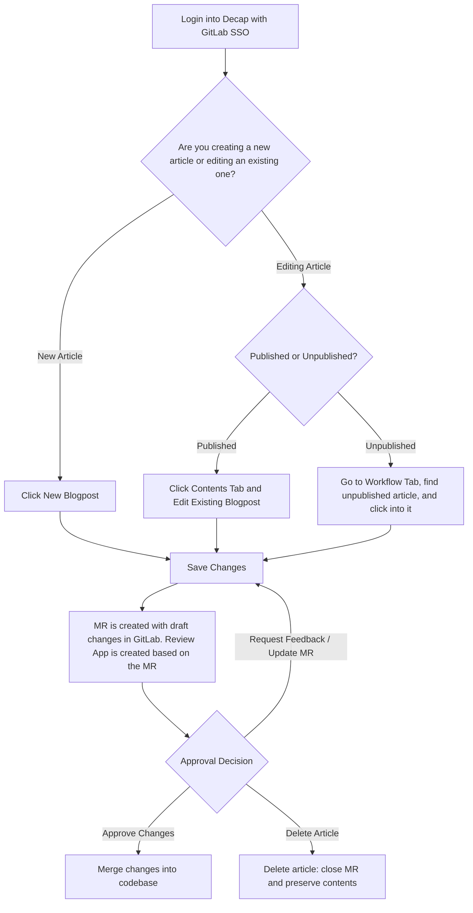
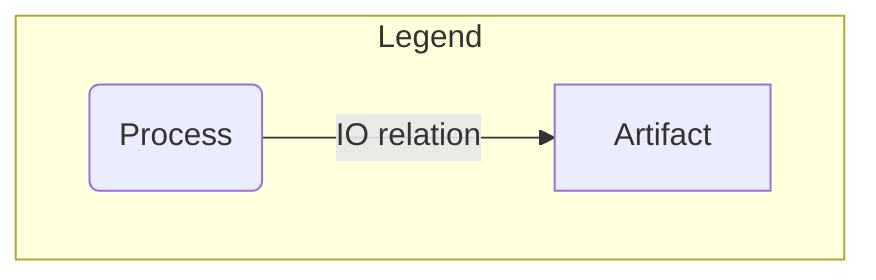

## ブログ (about.gitlab.com/blog/)

### ブログ記事はどこで見つけられますか？

ブログ記事は次の 2 か所にあります:

1. [about.gitlab.com リポジトリの YAML ファイル](https://gitlab.com/gitlab-com/marketing/digital-experience/about-gitlab-com/-/tree/main/content?ref_type=heads)
2. [Decap CMS](https://about.gitlab.com/admin/blog/)

### about.gitlab.com リポジトリでブログ記事を作成する

ブログ記事をゼロから作成するのは、[ブログ記事テンプレート](https://gitlab.com/gitlab-com/marketing/digital-experience/about-gitlab-com/-/blob/main/.gitlab/merge_request_templates/blog-post.md?ref_type=heads)を埋めるだけで簡単にできます。これは WebIDE で行うか、プロジェクトをローカルにセットアップして行うこともできます。

1. サンプルの YAML ドキュメントをコピーし、適切なロケール内の `/blog/` フォルダー配下に配置します。例えば英語のブログ記事は `/content/en-us/blog/` 配下になります。
2. 著者（名・姓）を追加します。著者がまだ[著者リスト](https://gitlab.com/gitlab-com/marketing/digital-experience/about-gitlab-com/-/tree/main/content/en-us/blog/authors?ref_type=heads)に存在しない場合は、既存著者のフォーマットをコピー&ペーストして新規作成できます。
3. YAML ファイルの残りのセクションを埋め、ブログ記事の本文には Markdown を使用し、レビュー担当者として `@Sgittlen` をマージリクエストにアサインします。

### Decap CMS を使ってブログ記事を作成する



1. https://about.gitlab.com/admin/ にアクセスし、GitLab の認証情報を入力して Decap にログインします。
1. 右側のナビゲーションパネルから、または https://about.gitlab.com/admin/blog/ に直接アクセスして Blog Dashboard へ移動します。
1. お好きな言語の `Blog - Post` コレクションを選択します。
1. `Content` 配下のフィールドを埋めます。特に明記されていない限り、ほとんどのフィールドは必須です。（`SEO` フィールドも入力できます。空のままにすると、`Content` セクションのタイトルと説明が自動的に入ります。最後の `Config` セクションでは、任意でスラグを変更したり、ブログのランディングページで Featured 設定にしたりできます。）
1. 右上の `Save` をクリックします。
1. about.gitlab.com リポジトリの最新の[マージリクエスト](https://gitlab.com/gitlab-com/marketing/digital-experience/about-gitlab-com/-/merge_requests)を確認します。「Create Blog - Post {title}」というタイトルの新しいマージリクエストが自動的に作成されています。
1. その MR の中でブログ記事のレビューアプリを確認でき、`@Sgittlen` にメンションして承認&マージを依頼できます。
1. Decap で未公開の投稿を削除すると、最終的に **MR がクローズ** されます。そのコンテンツを探したい場合は、GitLab UI 上に残っています。

動画チュートリアルは次の[プレイリスト](https://www.youtube.com/watch?v=91Ul69LrSb4&list=PL05JrBw4t0KoIEZXWugERwHAsR2cEalKl)にあります。サポートが必要な場合は Slack の `#digital-experience-team` または `#blog` までご連絡ください。

#### 補足

- Workflow タブのスイムレーン/ボードは、各 MR に付けられているラベルに対応しています。
- 著者・カテゴリー・タグを追加したい場合は、まず Decap でそれらを作成し、MR を `main` ブランチへマージする必要があります。それが完了すると、その著者・カテゴリー・タグは Decap で記事を作成・編集する際に選択できるようになります。

### ブログ記事にメディアを追加する

#### Mermaid チャート

````plaintext

````

#### 動画

```html
    <figure class="video_container">

    <iframe width="560" height="315"
    src="https://www.youtube.com/embed/pA5SfHwlq0s" frameborder="0"
    allowfullscreen="true">

    </iframe>

    </figure>
```

#### シンタックスハイライト付きコードブロック

````plaintext
```json
    {
        "Version": "2012-10-17",
        "Statement": [
            {
                "Effect": "Allow",
                "Action": [
                    "ecr:GetAuthorizationToken",
                    "ecr:BatchCheckLayerAvailability",
                    "ecr:GetDownloadUrlForLayer",
                    "ecr:DescribeRepositories",
                    "ecr:ListImages",
                    "ecr:DescribeImages",
                    "ecr:BatchGetImage"
                ],
                "Resource": "*"
            }
        ]
    }
```
````

### Web IDE を使ってブログ記事を作成する

1. プロジェクトリポジトリ https://gitlab.com/gitlab-com/marketing/digital-experience/about-gitlab-com にアクセスします。
1. `Edit` ボタンのドロップダウンをクリックし、`Open with Web IDE` を選択します。
1. 開いたら、ブログ記事を配置したいフォルダーへ移動します。
    - 多くの場合は `content -> en-us -> blog` です。
    - ローカライズされたブログ記事は `content/{{language-code}}` フォルダー配下にあります。例: `content -> fr-fr -> blog`
1. サイドバーペイン上部の `Add file` ボタンをクリックして新しいファイルを追加します。ファイル名はブログ記事の URL になるので、必ずそれに合わせて命名してください。
    - 既存の YAML ファイル（例: Argo からのもの）がある場合は、選択したフォルダーに直接ドラッグ&ドロップすることもできます。`right click -> rename` で英語版に合わせてファイル名を変更してください。
1. ここから、既存のブログ記事の YAML ファイルをコピー&ペーストして新しい値を入れるか、[ブログ MR テンプレート](https://gitlab.com/gitlab-com/marketing/digital-experience/about-gitlab-com/-/blob/main/.gitlab/merge_request_templates/blog-post.md?ref_type=heads)からゼロで始めることができます。
    - ブログ画像は [/public/images/blog/hero-images/](https://gitlab.com/gitlab-com/marketing/digital-experience/about-gitlab-com/-/tree/main/public/images/blog/hero-images?ref_type=heads) にアップロードするか、Cloudinary から URL をコピーしてください。
1. 投稿に問題がなければ、左サイドバーの `Source Control` アイコンを選択し、`Commit and push to main` ボタン横のドロップダウンから `Create a new branch and commit` を選択することで Web IDE 経由でマージリクエストを作成できます（`main` には直接コミット&プッシュできません）。
    - デフォルトのブランチ名を使う場合は `Enter` を押すだけです。
    - 右下に表示される `Create MR` ボタンをクリックします。
1. パイプラインが実行されるのを待ち、レビューアプリを確認します。

動画ウォークスルーは[こちら](https://youtu.be/dN1XZjZmJP0)です。

## イベント

### イベントランディングページにイベントを追加する

[about.gitlab.com/events/](https://about.gitlab.com/events/) にイベントを追加するには、Decap または Web IDE を使用できます:

#### Decap CMS

1. [about.gitlab.com/admin/](https://about.gitlab.com/admin/) にアクセスし、GitLab の認証情報でログインして Decap CMS にサインインします。
1. 左サイドバーから `Events -> Landing Page Card` を選択し、画面上部の `New Event Landing Page Card` ボタンをクリックします。
1. 以下のフィールドを入力します:
   - Name - イベント名
   - Type - イベントの種類（例: Conference、Webcast）
   - Description - イベントの簡単な説明。Markdown が使えます。
   - Start Date - 日付ピッカーでイベントの日付を選択します。このフィールドは必須です。
   - End Date - （任意）イベントが複数日にわたる場合、終了日を選択します。空のままにすることもできます。
   - Location - イベントの市と州を追加します。バーチャル開催の場合は `Virtual` と入力します。
   - Region - イベントに合った地域を選択します。
   - Industry - （任意）関連がある場合は業界を選択します。
   - Event URL - 登録 URL を追加します。
1. コンテンツに問題がなければ、画面上部の `Save` をクリックします。
1. これにより自動的にマージリクエストが作成され、レビューアプリで確認したり変更を加えたりできます。
   - マージリクエストを見つけるには、[未マージ MR の一覧](https://gitlab.com/gitlab-com/marketing/digital-experience/about-gitlab-com/-/merge_requests)から `Create Event - {{ Your Event Name }}` というタイトルの MR を探してください。
1. MR をレビュー、承認、マージすると、サイト上に反映されます。

動画チュートリアルは[こちら](https://youtu.be/j3z-smLIZbE)。

#### Web IDE

1. [about.gitlab.com](https://gitlab.com/gitlab-com/marketing/digital-experience/about-gitlab-com) で Web IDE を開きます。
1. [/content/shared/en-us/events/landing/cards](https://gitlab.com/gitlab-com/marketing/digital-experience/about-gitlab-com/-/tree/main/content/shared/en-us/events/landing/cards?ref_type=heads) に新しい `.yml` ファイルを作成し、イベント名（スペースなし）でファイル名を付けます。
   - 例: `connect-sydney-2025.yml`
1. 以下のフィールドを、日付の形式を保ったまま入力します:

    ```plaintext

    name: 
    type: 
    description: |
    Suports markdown, ex: Get together with the GitLab community to contribute, learn and win **exciting prizes**.
    startDate: YYYY-MM-DD
    endDate: YYYY-MM-DD (optional)
    location: 
    region: 
    industry: 
    eventURL: 

    ```

1. MR を作成し、レビュー&マージします。

## イベントランディングページ

カスタマーケーススタディにアクセスするには、about.gitlab.com/admin にアクセスし、GitLab の認証情報でログインしてください。

### 新しい Full Event Landing Page を作成する

1. メインダッシュボード :house: で、左サイドバーから `Event - Full Event Pages` を選択します。既存のイベントページが一覧表示されます。
1. ページ上部の `New Event - Full Event Pages` ボタンをクリックします。
1. フィールドを入力します:

- **Config**: URL はイベントのファイル名/スラグです。イベントを `about.gitlab.com/events/my-event-name` に置きたい場合、このフィールドは `my-event-name` になります。
- **SEO**: ページのメタデータです。Title と Description は必須で、各フィールドの下に文字数制限が記載されています。
- **Content**: カスタマイズ可能なブロックです。`Add content blocks` をクリックしてドロップダウンから異なる種類のコンテンツを選択できます。コンテンツブロックを削除したり、ドラッグ&ドロップで並べ替えたりもできます。各コンテンツブロックの詳細は以下を参照してください。

1. 上部の Save をクリックして変更を保存します。これは公開ではなく、レビュー用のマージリクエストを作成するだけです。
1. マージリクエストの一覧から、自分のイベントタイトルの MR を見つけます。
1. MR でパイプラインが実行されたら、レビューアプリで変更内容に問題がないか確認します。
1. 編集が必要な場合は Decap ファイルに戻って変更し、再度保存します。変更は既存のマージリクエストに反映されます。
1. MR をマージすると、約 15 分後にサイトに変更が反映されます。

### コンテンツブロック

#### Hero


- **Header**: メインの大きな太字テキスト。必須。
- **Description**: Markdown 対応。任意。
- **Primary & Secondary button**: いずれも任意。
- **Background image**: 背景画像のみサポートしており、コンテンツの横に画像を配置することはできません。ウィジェットを使用してヒーロー画像を Cloudinary にアップロードするか、Events フォルダー内の既存のヒーロー画像から選択します。

#### Agenda


- **Title**: 全体のタイトル（例: 'Agenda'）。任意。
- **Subtitle**: 任意。
- **Agenda**: `Add agenda +` を選択して、セッション名/時間/説明と任意の登録ボタンを追加します。任意のスピーカー情報や顔写真も追加できます。
- アジェンダ項目とスピーカーは必要なだけ追加できます。

#### Two Column Block

これは任意の数の半幅アイテムを含みます。右カラムに何を入れるか、次に左カラムに何を入れるかを選択します。

- **Config**: ページ内のセクションへスクロールするためのアンカー ID（例: #register）を入力したり、スクロール中もアイテムを画面の上部に固定するために sticky を true に設定したりできます。
- **Nested components**: カスタマイズ可能な個別コンポーネントです。EventsAccordionWrapper、EventsFormWrapper、EventsImageCard、EventsLightningTalk、EventsScheduleColumns が利用可能で、以下で詳しく説明します。

#### Events Accordion Wrapper


- **Title**: アコーディオンの上のタイトル。
- **Subtitle**: Markdown 対応。任意。
- Accordion: 個別のアコーディオン項目で、ヘッダーと Markdown 対応のコンテンツを含みます。
- Config: テーマサポート（例: `epic-conference` や `kubecon`）。

#### Events Form Wrapper


- **Title**: フォームの上のタイトル。
- **Description**: Markdown 対応。任意。
- Form ID: Marketo フォーム ID。これは Marketing Operations から提供されます。DEx はフォームを構築しません。
- Form Name: トラッキングと分析用。
- MultiStep: フォームがマルチステップフォームとして構築されている場合は true に設定します。

#### Events Image Card


- **Title**: カード上のタイトル（例: 'GitLab Booth 722'）。
- **Description**: Markdown 対応。任意。
- Image: Cloudinary から選択するか、新しい画像をアップロードします。
- Button: 任意。

#### Events Lightning Talks


- **Title**: イベントの上のタイトル。
- **Description**: Markdown 対応。任意。
- **Date**: 通常の文字列。任意。
- **Items**: 名前、説明、'Coming Soon' バッジの有無、リンク（JiffleNow トークン対応）などのアジェンダ項目を追加できます。

#### Events Schedule Columns


- **Header**: イベントの上のタイトル。
- **Description**: Markdown 対応。任意。
- **Date**: 通常の文字列。任意。
- **Items**: 名前、説明、'Coming Soon' バッジの有無、リンク（JiffleNow トークン対応）などのアジェンダ項目を追加できます。

#### Next Steps


ページ下部のデフォルト CTA。必須ではなく、カスタマイズ不可です。

## カスタマーケーススタディ

カスタマーケーススタディにアクセスするには、Decap [about.gitlab.com/admin](https://about.gitlab.com/admin/) にアクセスし、GitLab の認証情報でログインしてください。

### 新しいカスタマーケーススタディを作成する

1. メインダッシュボード :house: で、左サイドバーから `Customers Case Studies` を選択します。既存のカスタマーケーススタディがアルファベット順に一覧表示されます。
1. ページ上部の `New Customers Case Studies` ボタンをクリックします。
1. フィールドを入力します:

- **Config**: Size、Region、Industry のドロップダウンは [All Customers ページ](https://about.gitlab.com/customers/all/) でのフィルタリングに使用されます。
- **SEO**: ページのメタデータです。Title と Description は必須で、各フィールドの下に文字数制限が記載されています。
- **Content**: ウェブページに表示される内容です。
- **Name**: 会社名。これは会社名を小文字に変換し、スペースをハイフンに置き換えて URL も作成します。例: `/my-case-study/`
- **Logo**: `Choose an Image` を選択し、ロゴを Cloudinary にアップロードしてサイト全体で利用できるようにします。
- **Hero Heading**: ヒーロー画像の上に表示される大きなテキスト。
- **Hero image**: アップロードするか、Cloudinary から既存の画像を選択します。
- **Image Attribution**: ヒーロー画像が写真家からのソースやクレジットを必要とする場合、ここに記載できます。[例](https://about.gitlab.com/customers/deutsche-bahn-ag/)
- **3 Benefits**: ヒーロー画像の上に表示されます。`icon` は[こちら](https://slippers.gitlab.com/?path=/story/foundations-icons--icons)に列挙されているアイコンのいずれかを、正確なスペル/大文字小文字で指定する必要があります。
- **Industry/Location/Solution/Employee count**: ヒーロー画像の下に表示されます。
- **3 Stats**: これらはページの左側に表示され、スクロールに合わせて移動します。
- **Headline**: 記事の上部に太字で表示されます。
- **Summary**: ヘッドラインのすぐ下。
- **Quote**: 紫色の背景になります。
- **Content**: 必要なだけセクションを追加できます。

1. 上部の `Save` をクリックして変更を保存します。これは公開ではなく、レビュー用のマージリクエストを作成するだけです。
1. [マージリクエスト一覧](https://gitlab.com/gitlab-com/marketing/digital-experience/about-gitlab-com/-/merge_requests/?label_name%5B%5D=decap-cms%2Fdraft) から、自分のカスタマーケーススタディタイトルの MR を見つけます。
1. MR でパイプラインが実行されたら、レビューアプリで変更内容に問題がないか確認します。
1. 編集が必要な場合は Decap ファイルに戻って変更し、再度保存します。変更は既存のマージリクエストに反映されます。
1. MR をマージすると、約 15 分後にサイトに変更が反映されます。

### 既存のカスタマーケーススタディを編集する

1. メインダッシュボード :house: で、左サイドバーから `Customers Case Studies` を選択します。既存のカスタマーケーススタディがアルファベット順に一覧表示されます。
2. 編集したいカスタマーケーススタディを見つけ、クリックして開きます。
3. 編集を行います（どのフィールドがページ上のどのセクションに対応するかは上記を参照）。
4. 上部の `Save` をクリックして変更を保存します。これは公開ではなく、レビュー用のマージリクエストを作成するだけです。
5. [マージリクエスト一覧](https://gitlab.com/gitlab-com/marketing/digital-experience/about-gitlab-com/-/merge_requests/?label_name%5B%5D=decap-cms%2Fdraft) から、自分のカスタマーケーススタディタイトルの MR を見つけます。
6. MR でパイプラインが実行されたら、レビューアプリで変更内容に問題がないか確認します。
7. MR をマージすると、約 15 分後にサイトに変更が反映されます。

動画チュートリアル: https://youtu.be/TvUVW4X1Aco

## What's New

What's New ページを編集するには、Decap [about.gitlab.com/admin](https://about.gitlab.com/admin) にアクセスし、GitLab の認証情報でログインしてください。

### 新しいリリースバージョンページを作成する (18.10 以降)

1. メインダッシュボード 🏠 で、左サイドバーから `What's New - Version Content` を選択します。既存のリリースページが一覧表示されます。
2. ページ上部の `New What's New - Version Content` ボタンをクリックします。
3. フィールドを入力します:
   - **Release version**: `X.Y` 形式のバージョン番号（例: `18.11`）。これがファイルスラグになります。必須。
   - **Release Date**: `/whats-new/` でどのリリースを最新として表示するかを決定するために使用されます。
   - **SEO**: Title と Description はページのメタデータです。各フィールドの下に文字数制限が記載されています。
   - **Releases Container**: Header と Description がページ上のリリースサマリーの上に表示されます。
   - **Latest Release**: Version、Title、Description、表示用 Release Date（例: `April 16, 2026`）、Improvements Count を入力します。Hero Artwork 画像（最大 500 KB）をアップロードします。
   - **Video** *(任意)*: 展開して Vimeo の埋め込み URL（例: `https://player.vimeo.com/video/ID`）、サムネイル、alt テキスト、再生ボタンラベルを追加します。
   - **Headline Features**: 各カードについて `Add Headline Features` をクリックします。Type（Blog、Video、Demo、または Contributor）を選択し、Title、Description、サムネイル、リンク先 URL を追加します。
   - **Explore The Release**: 各カードについて `Add Explore Cards` をクリックします。1 つ以上の Badge（例: `ai`、`code`）を選択し、Title、Description、ボタンのリンクを追加します。
   - **Release Notes CTA** *(任意)*: 読者を完全なリリース投稿へ案内するリンク。
4. 上部の `Save` をクリックして変更を保存します。これは公開ではなく、レビュー用のマージリクエストを作成するだけです。
5. [マージリクエスト一覧](https://gitlab.com/gitlab-com/marketing/digital-experience/about-gitlab-com/-/merge_requests/?label_name%5B%5D=decap-cms%2Fdraft) から、自分のリリースバージョンの MR を見つけます。
6. MR でパイプラインが実行されたら、レビューアプリで変更内容に問題がないか確認します。
7. 編集が必要な場合は Decap ファイルに戻って変更し、再度保存します。変更は既存のマージリクエストに反映されます。
8. MR をマージすると、約 15 分後にサイトに変更が反映されます。

### What's New ランディングページを編集する

1. メインダッシュボード 🏠 で、左サイドバーから `What's New - Landing Page` を選択します。
2. 単一ファイルエントリーをクリックして開きます。
3. 関連セクションを編集します:
   - **Hero**: Heading（Markdown 対応）、本文テキスト、CTA ボタンのラベルと URL。カウントダウンがアクティブな場合は Timer のターゲット日時を更新します。
   - **What's Coming**: Title、Description、Accordion 項目。各アコーディオン項目にはタイトル、説明、アイコン、および任意のラベル（例: `ai`、`plan`）とリンクを持つ機能のリストがあります。このセクション内の CTA Bar には heading、tags、ボタンリンクがあります。
   - **What's Happening**: Blogs、News、Resources（各 3 項目）、Customer Stories（2 項目）を含みます。これらのリストには固定の最小/最大の制限があり — 超過または不足すると Decap がバリデーションエラーを表示します。
   - **Sign Up**: Heading、本文、FAQ アコーディオン、Form > Config 配下の Marketo フォーム設定（Form ID、Form Name など）。
4. 上部の `Save` をクリックして変更を保存します。これは公開ではなく、レビュー用のマージリクエストを作成するだけです。
5. [マージリクエスト一覧](https://gitlab.com/gitlab-com/marketing/digital-experience/about-gitlab-com/-/merge_requests/?label_name%5B%5D=decap-cms%2Fdraft) から、自分の変更が入った MR を見つけます。
6. MR でパイプラインが実行されたら、レビューアプリで変更内容に問題がないか確認します。
7. 編集が必要な場合は Decap ファイルに戻って変更し、再度保存します。変更は既存のマージリクエストに反映されます。
8. MR をマージすると、約 15 分後にサイトに変更が反映されます。

### 新しいレガシーリリースバージョンを作成する (18.10 以前)

1. メインダッシュボード 🏠 で、左サイドバーから `Legacy What's New (Pre-18.10)` を選択します。
2. ページ上部の `New Legacy What's New` ボタンをクリックします。
3. フィールドを入力します:
   - **Release version**: `X.Y` 形式である必要があります（例: `18.4`）。必須。
   - **Release Date**: 必須。
   - **SEO**: Title と Description はページのメタデータです。
   - **Components**: リストは 1 つの Hero Section と 1 つの Feature List ブロックで始まります — 各 1 つ以上を保持してください。必要に応じて Feature List ブロックを追加できます。
   - **Hero Section**: Title（デフォルトは "What's new in GitLab"）と Description（最大 200 文字、必須）を入力します。Video を展開して Vimeo 埋め込み URL、任意のサムネイル、heading、description、ボタンリンクを追加します。
   - **Feature List**: 各機能について `Add Features` をクリックします。各機能には Feature Title、Description、少なくとも 1 つの Label（例: `ai`、`deploy`）が必要で、任意のリンク URL も追加できます。機能の下にサブ箇条書きを追加するには **Bulleted List Items** を使用し、それぞれにテキストと任意のリンクを設定します。デモ動画カードを追加するには **Video Highlight Cards** を使用し、それぞれに Vimeo URL、任意のサムネイル、title、description を設定します。
4. 上部の `Save` をクリックして変更を保存します。これは公開ではなく、レビュー用のマージリクエストを作成するだけです。
5. [マージリクエスト一覧](https://gitlab.com/gitlab-com/marketing/digital-experience/about-gitlab-com/-/merge_requests/?label_name%5B%5D=decap-cms%2Fdraft) から、自分のリリースバージョンの MR を見つけます。
6. MR でパイプラインが実行されたら、レビューアプリで変更内容に問題がないか確認します。
7. 編集が必要な場合は Decap ファイルに戻って変更し、再度保存します。変更は既存のマージリクエストに反映されます。
8. MR をマージすると、約 15 分後にサイトに変更が反映されます。

動画チュートリアル: https://youtu.be/1VZWo_MCGxU
