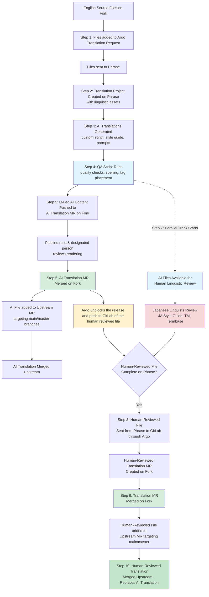

## 目次

- [概要](#overview)
  - [ローカライズ済みドキュメントの主要用語](#key-terms-for-localized-documentation)
  - [翻訳のスコープと除外](#translation-scope-and-exclusions)
    - [翻訳されるもの](#what-gets-translated)
    - [翻訳から除外されるコンテンツ](#content-excluded-from-translation)
- [フォーク型ローカリゼーションアーキテクチャ](#forked-localization-architecture)
  - [Argo-GitLab integration](#argo-gitlab-integration)
  - [ブランチ戦略](#branch-strategy)
  - [Translation MR](#translation-mrs)
  - [翻訳済みドキュメント Push MR レビュー](#translated-documentation-push-mr-reviews)
- [翻訳ワークフロー](#translation-workflow)
  - [AI 翻訳の生成](#ai-translation-generation)
  - [翻訳のための Markdown 処理](#markdown-processing-for-translation)
  - [AI 翻訳の QA](#qa-of-ai-translations)
  - [翻訳リクエスト管理](#translation-request-management)
- [Tech Docs 国際化 (i18n) アーキテクチャ](#tech-docs-internationalization-i18n-architecture)
  - [ロケールフォルダ構造](#locale-folder-structure)
  - [Hugo の多言語ドキュメント実装](#multilingual-hugo-docs-implementation)
  - [ローカライズ済みプロダクトドキュメントのパイプライン](#pipelines-for-localized-product-documentation)
  - [国際化ドキュメントにおけるリダイレクトの挙動](#redirect-behavior-in-internationalized-documentation)
- [ローカリゼーション UX 機能](#localization-ux-features)
  - [翻訳済みドキュメントへの貢献](#contributing-to-translated-documentation)
- [既知の制限と今後の作業](#known-limitations-and-future-work)

## 概要

GitLab Localization チームは、[docs.gitlab.com](http://docs.gitlab.com) を複数言語で提供できるようにする、エンタープライズグレードの AI 駆動ローカリゼーションインフラストラクチャを構築しました。日本語 (ja-JP) サポートでローンチし、すべてのプロダクトドキュメントコンテンツが翻訳され、トップナビゲーションバーの言語トグル、もしくは [docs.gitlab.com/ja-jp](http://docs.gitlab.com/ja-jp) のリンクからアクセスできるようになります。

このドキュメントは、GitLab の多言語ドキュメントサイトを動かす技術アーキテクチャ、ワークフロー、ツール、プロセスの包括的な概要を提供します。

Localization チームは、docs.gitlab.com を複数言語で提供できるようにするローカリゼーション・国際化インフラストラクチャを所有しています。これには以下が含まれます:

- 翻訳ワークフロー自動化
- AI 翻訳生成コード
- ローカリゼーションツール (Argo, Phrase TMS)
- 翻訳済みコンテンツに対する品質保証プロセス
- 言語担当者およびレビュアーとの調整

### ローカライズ済みドキュメントの主要用語

ローカリゼーションインフラストラクチャを理解するために、以下の主要用語に親しんでください:

| 用語 | 定義 |
|------|------------|
| ソース言語 | 翻訳の元となる言語。ドキュメントでは常に英語です。 |
| ターゲット言語 | 翻訳が作成される対象の言語。 |
| Translation MR | ローカリゼーションワークフローから GitLab プロジェクトへ翻訳ファイルのみを運ぶマージリクエスト。[詳細はこちら](#translation-mrs)。 |
| 翻訳リクエスト | フォークされたドキュメントプロジェクトからファイルを取得し、AI および人手のレビュー翻訳プロセス用にパッケージ化する翻訳プロジェクト。 |
| Target Update | 確立された翻訳ワークフローの外部で、英語のソースコンテンツの変更によってトリガーされずに翻訳ファイルに加えられた更新。 |
| TMS | 翻訳管理システム (Translation Management System)（私たちのコンテキストでは Phrase TMS を指します） |

### 翻訳のスコープと除外

#### 翻訳されるもの

docs.gitlab.com で利用可能なすべてのコンテンツが翻訳されます。これには以下が含まれます:

- 5 つすべての GitLab ドキュメントリポジトリにわたるプロダクトドキュメント:
  - [GitLab](https://gitlab.com/gitlab-org/gitlab)
  - [Runner](https://gitlab.com/gitlab-org/gitlab-runner)
  - [Omnibus](https://gitlab.com/gitlab-org/omnibus-gitlab)
  - [Charts](https://gitlab.com/gitlab-org/charts/gitlab)
  - [Operator](https://gitlab.com/gitlab-org/cloud-native/gitlab-operator)
- [GitLab Docs](https://gitlab.com/gitlab-org/technical-writing/docs-gitlab-com) におけるナビゲーション要素および UI 文字列

#### 翻訳から除外されるコンテンツ

##### Contribute セクション

「Contribute」セクション ([https://docs.gitlab.com/development/](https://docs.gitlab.com/development/)) のコンテンツは翻訳されず、ローカライズ済みサイトでは英語のまま提供されます。このセクションは、主に GitLab エンジニア向けの社内エンジニアリングドキュメントとして機能します。プロダクトドキュメントではなく、コードガイドラインや貢献情報を含みます。Technical Writing チームは、このセクションのリンティング遵守は確保しますが、コンテンツの管理は行いません。

##### ビジュアルアセット

- 初回ローンチでは画像はローカライズされません
- 初回ローンチでは図はローカライズされません

##### 旧バージョンの docs.gitlab.com サイト

当初、ローカライズ版 Tech Docs サイトは最新のドキュメントバージョンのみを提供します。追加のローカライズ版の展開には、英語サイトに適用されるバージョン区切り方針と同じ方針に従い、別途スコーピングおよびエンジニアリング作業が必要となります。[エピックの作業はこちら](https://gitlab.com/groups/gitlab-com/localization/-/epics/21)。

## フォーク型ローカリゼーションアーキテクチャ

本番に影響を与えたり大規模なグループに通知が送信されたりすることなく、ローカリゼーション作業のための安全なテスト環境を作成するために、フォーク型のリポジトリ構造を確立しました。

フォーク型アーキテクチャは [Prod](https://gitlab.com/gitlab-com/localization/tech-docs-forked-projects/prod) と [Test](https://gitlab.com/gitlab-com/localization/tech-docs-forked-projects/test) の両方のフォークから成ります。テストフォークは、ローカリゼーションワークフローの初期テスト、新機能の試験、ツール変更の検証のために作成されました。Argo GitLab Clone integration によって監視されています。

Prod フォークは Argo から直接 Translation MR を受け取り、実際の翻訳作業を行います。これは「Argo GitLab Production」 integration によって監視されています。

### Argo-GitLab integration

**Argo** は私たちの集中型ローカリゼーションリクエスト管理システムです。GitLab リポジトリと翻訳ワークフローの間のオーケストレーション層として機能します。翻訳リクエストを作成・管理し、フォークされた本番リポジトリからソースファイルを取得し、ファイルを翻訳ワークフロー用にパッケージ化し、翻訳ライフサイクルを通じて各ファイルのステータスを追跡します。[Argo-GitLab integration プロジェクトリンク](https://gitlab.com/gitlab-com/localization/argo-gitlab-integration)。

統合ポイント:

- [Argo-GitLab integration](https://gitlab.com/gitlab-com/localization/argo-gitlab-integration) はフォーク済みリポジトリを監視し、自動的に MR を作成します
- [Argo-Phrase integration](https://gitlab.com/groups/gitlab-com/localization/-/epics/95) は Phrase にファイルを送信して翻訳し、翻訳済みファイルを取得します
- [Argo Asset dashboard](https://gitlab.com/gitlab-com/localization/localization-team/-/issues/173) は翻訳アセットとそのステータスの追跡を支援します。GitLab ドキュメントプロジェクトと Argo の更新日を比較することで、翻訳履歴の追跡や、翻訳対象として新規・更新された英語アセットの特定を可能にします。

#### Translation MR の Slack 通知

[tech-docs-forked-projects/prod](https://gitlab.com/groups/gitlab-com/localization/tech-docs-forked-projects/prod) グループ内のすべてのプロジェクトで GitLab-Slack integration が有効化されており、チームの調整と翻訳作業のレスポンスタイムの改善に寄与しています。

**設定の詳細:**

- **Slack チャネル**: #localization-alerts
- **通知をトリガーするイベント**: ~"gitlab-translation-service" ラベルが付いたマージリクエストが作成、マージ、クローズ、再オープンされた場合
- **integration ステータス**: 6 つのローカリゼーションプロジェクト（GitLab Chart、GitLab Docs、GitLab Operator、GitLab、gitlab-runner、omnibus-gitlab）すべてでアクティブ
- **目的**: 新しい Translation MR が作成されたときにチームに通知し、チームメンバーがフォーク上の Translation MR のレビュー・マージのために自身をアサインできるようにし、その後アップストリームのドキュメントプロジェクトにできるだけ早くプッシュできるようにすること。

**現状の制限:**

- MR レビューのアサインは自動化されていません。チームメンバーは自身のキャパシティに応じて自発的に Translation MR をレビューします
- Translation MR のレビュー方法に関する明確な指示はまだありません。Localization チームは Translation MR をレビューし続け、考え抜かれた効率的なレビュー指示を整備していきます。
- 今後の作業: 明確な Translation MR レビュー指示と共にアサインプロセスを自動化することは、今後のイテレーションで計画されています

#### `argo_translation.yml` 設定ファイル

[`argo_translation.yml` 設定ファイル](https://gitlab.com/gitlab-com/localization/argo-gitlab-integration/-/blob/main/doc/en-US/argo_translation_yaml.md) は、翻訳可能なファイルを含むすべてのプロジェクトのルートに追加されます。これは、どのファイルおよびファイルタイプを翻訳すべきか、どのターゲット言語に翻訳すべきか、翻訳済みファイルをどこに配置すべきかを定義することで、Argo-GitLab integration を設定します。

ドキュメントの継続的ローカリゼーションのための [argo_translation.yml の設定実装](https://gitlab.com/groups/gitlab-com/localization/-/epics/111) のエピックがあります。

[argo_translation.yml とは何か、その設定可能性とオーナーシップ](https://gitlab.com/gitlab-com/localization/localization-team/-/issues/159#top) Issue。

#### ブランチ戦略

- `main-translation` は、本番フォークにおいて翻訳が最初にマージされる特別なブランチです
- `main-translation` から、本番プロジェクトの main/master ブランチをターゲットとするアップストリーム MR が作成されます
- この分離により、不完全な翻訳が本番に影響を及ぼすのを防ぐと同時に、並行作業を可能にします。また、より自由に試行錯誤し、迅速にターンアラウンドできるようになります。

関連 Issue: [GitLab Tech Docs 翻訳のためのブランチ保守プロセスを文書化する](https://gitlab.com/gitlab-com/localization/docs-site-localization/-/issues/112)

### Translation MR

[Translation MR](https://gitlab.com/gitlab-com/localization/argo-gitlab-integration/-/blob/main/doc/en-US/merge_requests.md) は翻訳ファイルのみを運びます。これらの翻訳は、対応する EN ファイルが翻訳元となるソースコミットを基準としています。[Product docs Translation MR - process and configuration enhancements](https://gitlab.com/groups/gitlab-com/localization/-/epics/114) エピックには、ワークフロー強化、Argo の設定、MR テンプレート更新など、Translation MR のさまざまな最適化が含まれています。

#### Translation MR ラベル

以下のテーブルは、Argo-GitLab integration によって自動的に、または Localization チームによって手動で Translation MR に追加されるラベルのリストを示します。

| ラベル | 用途 |
|-------|-------|
| [~"translation-MR-status:: AI complete"](https://gitlab.com/groups/gitlab-com/localization/-/merge_requests/?sort=updated_desc&state=opened&label_name%5B%5D=translationMR-status%3A%3AAI%20Complete&first_page_size=20) | この MR、または以前の Translation MR にすべての AI 翻訳がコミットされたことを示すために Argo が追加するラベル。 |
| [~"translation-MR-status:: in progress"](https://gitlab.com/groups/gitlab-com/localization/-/merge_requests/?sort=updated_desc&state=opened&label_name%5B%5D=translationMR-status%3A%3AIn%20Progress&first_page_size=20) | まだ翻訳中のファイルがあり、翻訳完了時にこの MR にコミットされることを示すために Argo が追加するラベル。 |
| [~translation-MR-status:: complete"](https://gitlab.com/groups/gitlab-com/localization/-/merge_requests/?sort=updated_desc&state=opened&label_name%5B%5D=translationMR-status%3A%3AComplete&first_page_size=20) | 言語担当者によってレビューされたファイルがすべて、この MR、または以前の Translation MR にコミットされたことを示すために Argo が追加するラベル。 |
| [~"gitlab-translation-service"](https://gitlab.com/groups/gitlab-com/localization/-/merge_requests/?sort=updated_desc&state=opened&label_name%5B%5D=gitlab-translation-service&first_page_size=20) | [Argo GitLab Integration](https://gitlab.com/gitlab-com/localization/argo-gitlab-integration) によって自動生成された変更であることを示すために Argo が追加するラベル |
| [~"L10n-target-update:: New"](https://gitlab.com/groups/gitlab-com/-/merge_requests/?sort=updated_desc&state=merged&label_name%5B%5D=L10n-target-update%3A%3A%20New&first_page_size=20) | ローカリゼーションワークフロー外でローカライズ済みファイルに編集が加えられたことを示すラベル。 |
| [~"L10n-target-update: Applied in TMS"](https://gitlab.com/groups/gitlab-com/-/merge_requests/?sort=updated_desc&state=merged&label_name%5B%5D=L10n-target-update%3A%3A%20Applied&first_page_size=20) | GitLab 上のローカライズ済みファイルへの編集がローカリゼーションワークフロー内で反映されたときに使用するラベル。 |
| [~"translation-upstream:: pending"](https://gitlab.com/groups/gitlab-com/localization/tech-docs-forked-projects/prod/-/merge_requests/?label_name%5B%5D=translation-upstream%3A%3A%20pending) | ローカリゼーションフォーク上で Argo が追加するラベルで、その MR の翻訳済みファイルが、master または main をターゲットとするアップストリーム MR にまだ含まれていないことを示します。 |
| [~"translation-upstream:: complete"](https://gitlab.com/groups/gitlab-com/localization/tech-docs-forked-projects/prod/-/merge_requests/?label_name%5B%5D=translation-upstream%3A%3A%20complete) | フォーク内の翻訳済みファイルがアップストリームの translation push MR に追加されたことを示すために Localization チームが追加するラベル。 |

> [!note]
> 広範なコミュニティからの貢献を追跡するための target updates ラベルは、[GitLab.org グループ内にも作成されています](https://gitlab.com/groups/gitlab-org/-/labels?subscribed=&archived=false&sort=relevance&search=target-update)。

#### Translation MR タイプ

ローカリゼーションワークフローで自動的に作成される Translation MR には、主に 2 種類があります:

**[AI Translation MR](https://gitlab.com/groups/gitlab-com/localization/-/merge_requests/?sort=updated_desc&state=opened&label_name%5B%5D=translationMR-status%3A%3AAI%20Complete&first_page_size=20)**

- いつ: Phrase TMS で QA 済みの AI 翻訳が完了した直後に作成されます
- どこで: 本番フォークプロジェクト上で作成され、main-translation ブランチをターゲットとします
- 内容: ファイル QA を経た AI 生成翻訳
- なぜ: 初期翻訳の迅速なデプロイを可能にし、JA サイトを可能な限り本番に追従させ続けるため
- ラベル: translation-MR-status:: AI complete は、QA 済みの AI 翻訳を含む MR であることを示します

**[Human-Reviewed Translation MR](https://gitlab.com/groups/gitlab-com/localization/-/merge_requests/?sort=updated_desc&state=opened&label_name%5B%5D=translationMR-status%3A%3AComplete&first_page_size=20)**

- いつ: 言語担当者が Phrase で AI 翻訳の言語的レビューを完了した後に作成されます
- どこで: 本番フォークプロジェクト上で作成され、main-translation ブランチをターゲットとします
- 内容: 言語担当者によって言語的にレビュー・洗練された翻訳を運びます
- なぜ: AI 翻訳をより高品質なレビュー済みコンテンツに置き換える目的
- ラベル: translation-MR-status:: complete は、言語担当者によって言語的にレビューされた翻訳ファイルを含む MR であることを示します。

main-translation ブランチへのマージ後、両 MR タイプは同じアップストリームマージプロセスに従います。

#### AI 翻訳 MR と人手翻訳 MR の連続マージ順序

翻訳リクエストが同じファイルに対して AI Translation MR と Human Translation MR の両方を生成した場合、これら 2 つの MR は特定の順序でマージされる必要があります: 先に AI、次に Human です。これは [Argo GitLab Integration](https://gitlab.com/gitlab-com/localization/argo-gitlab-integration)、特に [v0.8.0+ のこの機能強化](https://gitlab.com/gitlab-com/localization/argo-gitlab-integration/-/work_items/67) によって自動的に強制され、Human Translation MR をマージ済み AI Translation MR が作成したコミットにリベースします。

この連続パターンは、Git が変更を検出する仕組みによります。Git はコンテンツをファイルそのものではなく変更として保存します。AI 翻訳が TMS で作成された後、人手のレビュアーが元の人手翻訳に戻すと、Human Translation MR にはそれらのセグメントの差分が含まれません（レビュアーの視点ではコンテンツは変わっていない）。一方、AI Translation MR には差分が含まれます。2 つの MR が独立してマージされると、Git は AI の変更を最新の更新として扱い、マージコンフリクトもなく人手翻訳を静かに上書きしてしまいます。

AI のマージ後に Human Translation MR をリベースすることで、人手レビュアーが AI 翻訳を受け入れたか、修正したか、戻したかにかかわらず、すべての人手レビュー済みセグメントが AI のものを上書きすることが保証されます。

完全な技術的調査と解決策の詳細については、[Git の変更検出挙動により MR マージ中に AI 翻訳が人手翻訳を上書きする](https://gitlab.com/gitlab-com/localization/docs-site-localization/-/issues/370) を参照してください。

#### 定期的なアップストリームマージ

翻訳がレビューされ、フォークの main-translation ブランチにマージされた後、翻訳をアップストリームにマージするための新しい MR が自動的に作成されます。

ターゲットプロジェクト:

1. [gitlab-org/gitlab](https://gitlab.com/gitlab-org/gitlab)
2. [gitlab-org/gitlab-runner](https://gitlab.com/gitlab-org/gitlab-runner)
3. [gitlab-org/omnibus-gitlab](https://gitlab.com/gitlab-org/omnibus-gitlab)
4. [gitlab-org/charts/gitlab](https://gitlab.com/gitlab-org/charts/gitlab)
5. [gitlab-org/cloud-native/gitlab-operator](https://gitlab.com/gitlab-org/cloud-native/gitlab-operator)

### 翻訳済みドキュメント Push MR レビュー

翻訳済みドキュメント Push MR は、翻訳済みコンテンツを [本番フォーク](#forked-localization-architecture) からアップストリームの [本番プロジェクト](https://docs.gitlab.com/development/documentation/site_architecture/#source-files) に移動します。翻訳は [Tech Docs MR QA Checker](https://gitlab.com/gitlab-com/localization/tech-docs-mr-qa-checker) と Phrase の [Phrase QA](https://support.phrase.com/hc/en-us/articles/5709703799324-Quality-Assurance-QA-TMS) でチェック済みです。人手の言語担当者が両方のチェックの変更をレビュー・実装し、翻訳は [Argo GitLab Integration](https://gitlab.com/gitlab-com/localization/argo-gitlab-integration) によってフォークの main-translation ブランチにプッシュされています。次に、ローカリゼーションエンジニアが [スクリプト](https://gitlab.com/gitlab-com/localization/docs-site-localization/-/snippets/4889225) を使用して、完了した翻訳をアップストリームの翻訳済みドキュメント Push MR にバッチ化し、エンジニアがアップストリームプロジェクトで手動で MR を作成します。
Localization チームメンバーがマージリクエストのレビュー担当としてアサインされ、GitLab メンテナーが MR の承認・マージのためにアサインされます。

Localization チームメンバー:

- 自身を Assignee としてアサインします
- MR の説明をレビューし、MR にリンクされたすべてのコンテンツを読みます
- 対応するフォーク Translation MR のコメントスレッドを読むことで、フォーク上の翻訳履歴をレビューします
  - 未解決の懸念事項があればメモします
  - [Argo](https://gitlab.com/groups/gitlab-com/localization/-/epics/35) リクエストおよび Phrase プロジェクトを確認することで、未解決の懸念事項を検証します
- Changes タブを表示することで、翻訳済みファイルの構造とフォーマットをレビューします
- アップストリーム Translation MR で新しいパイプラインを実行します
  - パイプラインのステータスを確認します。フォーク上で問題が解決されているため、通常パイプラインは合格します。
  - **無視すべきパイプラインの警告（フォーク上）**: `gl-sbom-*.cdx.json` および `gl-container-scanning-report.json` ファイルの欠落に関する Container scanning ジョブの警告は想定内であり、**安全に無視できます**。フォークにはアップストリームの Docker アーカイブイメージがありませんが、ジョブは failure を許容するよう設定されており、翻訳品質には影響しません。
  - パイプラインが失敗した場合は根本原因を調査し、解決のためにローカリゼーションエンジニアに連絡します

- 常にコミュニケーションのベストプラクティスに従ってください:
  - コメントは具体的に
  - リンクとフルスクリーンのスクリーンショットを含めてください
  - @ を使用してコラボレーションを依頼してください
  - 可視性のために関連するベンダーチームメンバーを cc に入れてください
- パイプラインが合格したら、Maintainer ロールを持つユーザーに [レビューを依頼](https://docs.gitlab.com/user/project/merge_requests/reviews/#request-a-review) します

GitLab メンテナー:

Technical Writing チームのメンテナーとローカリゼーションエンジニアリングのメンテナーの両方がこれらの MR をマージできます。
翻訳済みドキュメント Push MR がアサインされたら:

- パイプラインが合格していることを検証します
- MR 構造が完全であることを確認します
- アップストリームの本番プロジェクトに承認・マージします

注意: メンテナーは言語コンテンツや翻訳品質をレビューしません。これは翻訳ワークフローの早い段階で、フォーク上および翻訳管理システム (Phrase) で行われるためです。

### フォークとアップストリームプロジェクトの同期

アップストリームプロジェクトとダウンストリームフォークの間のコンテンツ同期は、[Automate tech docs fork](https://gitlab.com/gitlab-com/localization/tech-docs-forked-projects/automate-tech-docs-fork) プロジェクトを使用して自動化されています。プロセスには 2 つの独立したステップがあります: [Pull Mirroring](https://docs.gitlab.com/user/project/repository/mirror/) は各フォークの `master`/`main` ブランチをアップストリームと同期し、別のパイプライン同期は 12 時間間隔で `master`/`main` から `main-translation` ブランチへ変更をマージします。これら 2 つのステップは意図的に分離されており、同期パイプラインがアップストリームプロジェクトに直接的な依存関係を持たない（アップストリームでのボットメンバーシップやアクセストークンが不要）ようになっています。

失敗レポートは、公開の [#localization-alerts](https://gitlab.enterprise.slack.com/archives/C095BS4NLE4) Slack チャネルに自動的に投稿されます。ミラーリング失敗、パイプラインエラー、アクセストークンの問題のトラブルシューティングについては、[Automate tech docs fork プロジェクトドキュメント](https://gitlab.com/gitlab-com/localization/tech-docs-forked-projects/automate-tech-docs-fork) を参照してください。

### 翻訳済みドキュメントサイトの有効化

本番で翻訳済みサイトを切り替えるには:

1. `config/_default/hugo.yaml` を編集します
2. 言語設定を変更します:

```yaml
languages.ja-jp.disabled: false
```

この単一の設定変更により、特定の言語の翻訳済みドキュメントサイトを有効化または無効化できます。

## 翻訳ワークフロー

私たちは、速度と品質のバランスをとる 2 階層の翻訳ワークフローを確立しました。AI 支援翻訳は、言語的な人手レビューが完了する前にドキュメントサイトに公開され、ユーザーが最新情報により早くアクセスできるようにします。これらの翻訳は、その後プロフェッショナルかつ専門的な人手の翻訳者によってレビューされ、必要に応じて精度と品質のために更新されます。このアプローチにより、翻訳品質を反復的に改善している間も、ローカライズ版ドキュメントサイトは英語版にできるだけ近い状態を保ちます。
以下に概要図を示します:



### AI 翻訳の生成

GitLab のプロダクトドキュメントが要求する技術的な精度を維持しつつ、効率的かつスケーラブルな翻訳を提供するため、Phrase TMS と Google の Vertex AI Gemini モデルを統合した AI 駆動システムを開発しました。このワークフローは両プラットフォームに対して認証を行い、Phrase TMS プロジェクトから MXLIFF ファイルをダウンロードし、翻訳メモリのマッチスコアに基づいて、各セグメントを完全翻訳またはポストエディットのいずれかに振り分けます。次に、自動的な品質修正を適用してから、完成した翻訳を Phrase TMS にアップロードして戻します。翻訳品質は、スタイルガイド、元のファイルコンテキスト、UI ラベル翻訳、[spaCy NLP](https://spacy.io/) で抽出した用語を用いてプロンプトをエンリッチすることで強化されます。

Python で構築された [翻訳スクリプト](https://gitlab.com/gitlab-com/localization/tech-docs-ai-powered-translation/-/blob/main/script.py) は、最大 5 回の反復修正サイクルを通じて XLIFF 構造を保持する高度なタグ処理機能を備えており、タグが欠落・破損していても XLIFF 1.2 標準への準拠を保証します。このシステムはデフォルトで 500 セグメント単位のバッチでコンテンツを処理し、最適なパフォーマンスのために並列処理を活用し、API レート制限とエラーを優雅に処理するためのリトライロジックを含みます。

AI 駆動の翻訳スクリプトの動作の詳細については、[Tech Docs AI-powered translation](https://gitlab.com/gitlab-com/localization/tech-docs-ai-powered-translation) プロジェクトを参照してください。

### 翻訳のための Markdown 処理

GitLab のドキュメントは、`%{placeholder}` 変数、`[!alert]` ブロック、`::include` ディレクティブ、GitLab 固有の参照といった標準的な翻訳システムのフィルターやパーサーではサポートされていないカスタム要素を含む、特殊な Markdown 構文 (GLFM) を採用しています。さらに、docs.gitlab.com ウェブサイトは [文書化された Hugo ショートコード](hhttps://docs.gitlab.com/development/documentation/styleguide/#shortcodes) を使用しています。これらの要素は、人手や機械の翻訳者による変更から保護する必要があり、Phrase TMS でカスタムの正規表現パターンとパーサー設定を必要としました。

Argos Multilingual のソリューションチームは、GitLab の多様なドキュメント要素を扱うため、Phrase TMS の 3 つのプロジェクトテンプレートにわたる包括的なパーサー設定を開発しました。これには以下が含まれます:

- コードブロック（トリプルバックティックおよびインラインコード）
- URL および GitLab 固有のアイコンプレースホルダー（例: `{check-circle}`、`{tanuki}`）
- アラートボックス
- タブ付きコンテンツの構文（`::Tabs`、`::TabTitle`、`::EndTabs`）
- YAML ヘッダー、フロントマター、混合コンテンツを含むナビゲーションファイル
- スタンドアロンの i18n YAML/JSON ファイル
- Markdownlint-disable コメント
- GitHub-flavored Markdown フォーマット

詳細については、以下のエピックを参照してください: [Phrase TMS configurations for product docs content](https://gitlab.com/groups/gitlab-com/localization/-/epics/93)。

#### Docs Markdown フィルター

Docs Markdown フィルターは、[markdown.md](https://gitlab.com/gitlab-org/gitlab/-/blob/master/doc/user/markdown.md) ファイルを除く、すべての GitLab ドキュメントの Markdown ファイルに使用されます。このフィルターで有効化されている主要な設定:

- Flavor: GitHub Flavored Markdown は Phrase TMS でサポートされている Markdown のうち最も近いバリアントです
- Preserve whitespaces: 無効化。さもなければ Phrase は英語の Markdown ファイルの構造（改行を含む）を再現しようとし、文が途中で分割されてしまいます。
- Process YAML header: この設定は Markdown ファイルの YAML ヘッダーを処理する機能を有効化します。
- Import code blocks: 無効化 - コードブロックを変更（翻訳）したくないため
- Exclude code elements: コード要素はインラインタグに変換され、保護されます。
- Convert to Phrase TMS tags: この正規表現は、以下の要素を Phrase のインラインタグに変換し、翻訳中に保護します: Hugo ショートコード（アイコンプレースホルダー、アラートボックス、タブ付きコンテンツ、折りたたみ可能なコンテンツ、ウォークスルースニペット）およびアンカー ID
- Don't escape characters: Phrase が翻訳済みファイル内で一部の文字をエスケープして保護しようとすることが分かりました。ここに `[` を追加することで、Phrase が翻訳済みファイル内に `\[` を挿入することを防ぎます。

#### Docs Markdown (markdown.md)

[markdown.md](https://gitlab.com/gitlab-org/gitlab/-/blob/master/doc/user/markdown.md) ファイルをパースするためのカスタム設定を持つ特別なテンプレート。

これは Docs Markdown 設定のコピーですが、いくつか例外があります:

- Import code blocks: この設定は markdown.md ファイルでは有効化されており、ファイル内で使用されているコードサンプルを翻訳する機会を提供します。
- Don't escape characters: # 文字がリストに追加されています。

#### Docs ナビゲーション

この翻訳プロジェクトテンプレートは、[navigation.yaml](https://gitlab.com/gitlab-org/technical-writing/docs-gitlab-com/-/blob/main/data/en-us/navigation.yaml) ファイルを扱うように設計されています。[walkthroughs](https://gitlab.com/gitlab-org/technical-writing/docs-gitlab-com/-/tree/main/data/en-us/walkthroughs) の .yaml ファイルでも動作します。

主要な設定:

- Import specific keys only: 特別に作成された正規表現により、（構造のどこにあっても）title および description 要素を翻訳のためにエクスポートします。

#### Docs i18n ファイル

追加のローカリゼーションファイル（en.json、en-us.json、en-us.yaml）を扱うように設計されています。

主要な設定:

- Convert to Phrase TMS tags: {0} や {1} のようなプレースホルダーは Phrase でインラインタグに変換されます
- Use Markdown subfilter: YAML 要素内の Markdown コンテンツは Markdown としてパースされます
- Use HTML subfilter: JSON 要素内の HTML コンテンツは HTML としてパースされます

### AI 翻訳の QA

AI 翻訳が Phrase TMS にアップロードされた後、カスタム [Tech Docs MR QA checker](https://gitlab.com/gitlab-com/localization/tech-docs-mr-qa-checker) を実行します。現在は Markdown ファイルのみをチェックし、人手の言語担当者が確認・修正するためのエラーリストを生成します。2 つ目の QA チェックセットは、Phrase TMS の [QA チェックリスト](https://support.phrase.com/hc/en-us/articles/5709703799324-Quality-Assurance-QA-TMS#list-of-qa-checks-0-4) を使って Phrase TMS で直接実施されます。Tech Docs MR QA checker と Phrase TMS QA がリストアップした問題は、QA 済みの Markdown ファイルが AI Translation MR の一部としてフォークにプッシュされる前に修正されます。包括的な QA チェックリストは [この Issue](https://gitlab.com/gitlab-com/localization/docs-site-localization/-/issues/372#note_2861022087) での調査を通じて開発されました。特定のエラーが発生しないようにする自動防止ロジックが AI 翻訳スクリプトに追加され、QA チェッカーは自動的に防止できないその他の項目を検証します。

Phrase TMS はパース中にソースファイルをセグメント化し、QA チェックを個別のセグメントに限定して周囲のコンテキストにアクセスできないようにします。コンテキスト依存の検証には [Tech Docs MR QA checker](https://gitlab.com/gitlab-com/localization/tech-docs-mr-qa-checker) スクリプトを使用しています。

そのために、私たちはカスタムの Tech Docs MR QA checker を作成しました。この QA チェッカーはソースとターゲットの Markdown ファイル全体を取り込み、[こちらのすべてのチェック](https://gitlab.com/gitlab-com/localization/tech-docs-mr-qa-checker#tech-docs-mr-qa-checker) を実施します。これらのチェックの一部はカスタムであり、Phrase TMS QA では実装できないものです。

自動化できないチェックがいくつかあり、Phrase TMS の Revision ステップで AI 翻訳をレビューする際に、人手の言語担当者がチェックすることに依存しています:

- **引用符**: [引用符が文中の正しい位置に追加されている](https://gitlab.com/gitlab-com/localization/docs-site-localization/-/issues/343)
- **リンク**:
  - [文または段落内のリンクの配置が正しいことを確認する](https://gitlab.com/gitlab-com/localization/docs-site-localization/-/issues/346)。誤った配置がないこと。
  - 角括弧で挟まれたテキスト表示リンクの中に正しい単語が配置されていることを確認する。

### 翻訳リクエスト管理

翻訳作業は、6 つのプロダクトドキュメントプロジェクト（GitLab、GitLab Runner、Omnibus GitLab、GitLab Chart、GitLab Operator、GitLab Docs）のローカリゼーションフォークで実施されます。これらのフォークは Localization チームによって管理されています。これらは本番プロジェクトでの問題のリスクを低減し、本番プロジェクトを保守する Technical Writing、Engineering、その他のチームへの中断を最小限に抑えます。ローカリゼーションフォークはアップストリームプロジェクトからの変更で定期的に更新されます。翻訳リクエストは、[Argo](https://gitlab.spartansoftwareinc.com/#login) と呼ばれるローカリゼーションリクエスト管理システムを通じてフォーク上で作成・管理されます。

Argo はローカリゼーションフォークを監視し、アップストリームプロジェクトとの同期後に新規・更新された英語ファイルを自動的に特定します。UI 内に監視中のすべてのファイルとその翻訳ステータスのリストを表示し、Localization チームがシステムから直接、新しい翻訳リクエストにどのファイルを含めるか選択できるようにします。Argo は、すでにアクティブな翻訳リクエストに含まれているファイルなど、リクエストに含めるべきでないファイルも示します。リクエスト作成プロセスは自動化することもできます。

各リクエストに対して、Argo は特定のコミット時点でローカリゼーションフォークから選択したファイルをエクスポートし、事前定義された基準に従って適切な AI 翻訳プロセスを通してルーティングし、事前定義されたテンプレートとコミットメッセージを使って 1 つ以上の Translation MR としてフォークに翻訳済みファイルを返します。プロセス全体は、Argo-GitLab integration や翻訳ベンダー固有の integration など、さまざまな統合によってサポートされています。

Translation MR は自動品質チェックによってレビューされ、Localization チームによってローカリゼーションフォーク上でマージされます。チームはその後、最新の翻訳をアップストリームプロジェクトに統合するためのアップストリーム MR を作成します。最後に、Technical Writing チームがこれらのアップストリーム MR をレビューし、master または main ブランチにマージします。

Argo はローカリゼーションリクエストのコマンドセンターとして機能するように設計されています。ワークフロー全体を通じて翻訳ステータスと進捗を追跡し、リクエスト内のソースコミットや Translation MR へのリンクなど関連情報を提供します。さらに、Argo はエクスポートされたソースファイルおよび翻訳済みファイルのコピーをすべて保持し、各リクエストで自動化されたすべてのステップの実行時間とレスポンスを記録に残し、トラブルシューティングを可能にします。Argo はまた、GitLab Issue のような Comments 機能も提供しており、リクエストに関わるすべてのユーザーがシステム内で直接コミュニケーションできます。

## Tech Docs 国際化 (i18n) アーキテクチャ

### ロケールフォルダ構造

翻訳は各ドキュメントプロジェクト内のロケール固有のフォルダに保存されます。現在、サポートされているロケールは日本語 (ja-jp) のみです。

**プロジェクトをまたぐロケールフォルダ**:

- [gitlab-org/gitlab/doc のロケールフォルダ](https://gitlab.com/gitlab-org/gitlab/-/tree/master/doc-locale/ja-jp)
- [gitlab-org/gitlab-runner/docs のロケールフォルダ](https://gitlab.com/gitlab-org/gitlab-runner/-/tree/main/docs-locale/ja-jp?ref_type=heads)
- [gitlab-org/omnibus-gitlab/doc のロケールフォルダ](https://gitlab.com/gitlab-org/omnibus-gitlab/-/tree/master/doc-locale/ja-jp?ref_type=heads)
- [gitlab-org/charts/gitlab/doc のロケールフォルダ](https://gitlab.com/gitlab-org/charts/gitlab/-/tree/master/doc-locale/ja-jp?ref_type=heads)
- [gitlab-org/cloud-native/gitlab-operator/doc のロケールフォルダ](https://gitlab.com/gitlab-org/cloud-native/gitlab-operator/-/tree/master/doc-locale/ja-jp?ref_type=heads)

**GitLab Docs プロジェクト - docs-gitlab-com**

翻訳済みコンテンツは異なるディレクトリに存在します:

- [gitlab-org/technical-writing/docs-gitlab-com の Data フォルダ](https://gitlab.com/gitlab-org/technical-writing/docs-gitlab-com/-/tree/main/data?ref_type=heads)
- [gitlab-org/technical-writing/docs-gitlab-com の Locales フォルダ](https://gitlab.com/gitlab-org/technical-writing/docs-gitlab-com/-/tree/main/locales?ref_type=heads)

### Hugo の多言語ドキュメント実装

Hugo の多言語コンテンツサポートを実現するため、以下の機能が開発されました:

1. [日本語ロケール設定](https://gitlab.com/gitlab-org/technical-writing/docs-gitlab-com/-/merge_requests/767) - すべてのドキュメントプロジェクト全体で適切なコンテンツマウントを伴い、Hugo の設定に ja-jp ロケールを追加
2. [言語セレクター](https://gitlab.com/gitlab-org/technical-writing/docs-gitlab-com/-/merge_requests/787) - 各ページからアクセス可能な、ユーザーフレンドリーな言語切り替え機能を実装
3. [国際化テスト](https://gitlab.com/groups/gitlab-com/localization/-/epics/109) - ナビゲーション、UI 文字列、さまざまなサイトコンポーネントを日本語翻訳で検証
4. [サイドバーナビゲーション](https://gitlab.com/gitlab-org/technical-writing/docs-gitlab-com/-/merge_requests/820) - ナビゲーション URL を言語相対に更新し、ユーザーが選択した言語に留まれるようにする
5. [テンプレートリンクのローカライゼーション](https://gitlab.com/gitlab-com/localization/docs-site-localization/-/issues/243) - 言語の永続化のために、内部リンクを relLangURL を使用するよう変換
6. [View Source/Edit リンク](https://gitlab.com/gitlab-com/localization/docs-site-localization/-/issues/28#note_2772393041) - 機能し、英語ソースを指す
7. ローカライズ済みコンテンツのための [CI/CD パイプライン](https://gitlab.com/gitlab-com/localization/docs-site-localization/-/issues/183#note_2621036727) 更新
8. [英語フォールバック](https://gitlab.com/gitlab-org/technical-writing/docs-gitlab-com/-/merge_requests/833) 機能
9. [Hreflang](https://gitlab.com/gitlab-com/localization/docs-site-localization/-/issues/313) タグの実装
10. 日本語コンテンツ向けの [免責事項バナー](https://gitlab.com/gitlab-com/localization/docs-site-localization/-/issues/255)
11. [画像ローカライゼーション](https://gitlab.com/gitlab-com/localization/docs-site-localization/-/issues/242) のサポート
12. 翻訳済みコンテンツのための [アンカー ID](https://gitlab.com/gitlab-com/localization/docs-site-localization/-/issues/155) の処理
13. 自動化された Tech Docs の [ブランチ保守](https://gitlab.com/gitlab-com/localization/pipeline-sync-test/automate-tech-docs-fork)
14. [Hugo フィーチャーフラグ設定](https://gitlab.com/gitlab-com/localization/docs-site-localization/-/issues/252) - 設定ベースのフィーチャーフラグを通じた i18n 機能の制御されたロールアウトを実現

### ローカライズ済み Tech Docs バージョンリリース

ローカライズ版 GitLab Docs サイトはプロダクトドキュメントの最新の未リリースバージョンのみを表示します。アーカイブされたバージョンは英語のみで構築されます。これは、アーカイブビルド中に日本語を無効にする別の config/archive/hugo.yaml を使用して実装されています。MR [Disable Japanese for archives with separate config](https://gitlab.com/gitlab-org/technical-writing/docs-gitlab-com/-/merge_requests/1557) を参照してください。ローカライズ済みコンテンツが英語と同等になり、アーカイブ可能な安定したバージョンが揃ったら、アーカイブバージョンにローカライズ済みコンテンツを含めるかどうかを再検討します。

詳細については、以下の Issue を参照してください:

- [ローカライズ済みプロダクトドキュメントのバージョン管理とリリースプロセスの設計](https://gitlab.com/gitlab-com/localization/docs-site-localization/-/issues/88)
- [アーカイブされたドキュメントバージョンに対する日本語翻訳の無効化](https://gitlab.com/gitlab-com/localization/docs-site-localization/-/issues/744)

### ローカライズ済みプロダクトドキュメントのパイプライン

ローカライズされたコンテンツ全体で一貫した品質を維持するため、ドキュメントの多言語テストを実装しました。これらのテストは英語ドキュメントと同じ品質チェックを使用しますが、対象は /doc-locale/ または /docs-locale/ ディレクトリ内の国際化されたコンテンツです。

私たちのパイプラインは、不正なショートコード、リンク内のスペース、裸の URL、孤立ファイル、壊れたリダイレクトといった重大な翻訳の問題を捕捉することに成功しています。パイプラインは、壊れた翻訳が本番に到達するのを防ぐ品質ゲートを提供します。詳細については、[Build pipelines for localized product documentation](https://gitlab.com/groups/gitlab-com/localization/-/epics/109) エピックおよび GitLab プロダクトドキュメント内の [Tests for translated documentation](https://docs.gitlab.com/development/documentation/testing/#tests-for-translated-documentation) ページを参照してください。

並行して、Translation MR は Markdown フォーマットの問題、特に CommonMark 仕様の CJK 言語に関するエッジケースによる太字・斜体の強調表現の破損が頻繁に発生していました（[issue #597](https://gitlab.com/gitlab-com/localization/docs-site-localization/-/issues/597) を参照）。私たちは markdownlint-cli2 を使用した自動 Markdown リンティングチェックを実装し、マージ前にフォーマットエラーを捕捉できるようにしました。

### 国際化ドキュメントにおけるリダイレクトの挙動

リダイレクトは、コンテンツが移動・名前変更・再編成された場合に、ユーザーをある URL から別の URL へ自動的に送ります。グローバル化されたドキュメントサイトでは、リダイレクトは重要です。ユーザーが言語に関わらずコンテンツにアクセスできるよう保証し、すべてのロケールで一貫したエクスペリエンスを維持するためです。

ユーザーが日本語 URL にアクセスする際、不足している翻訳を補うために英語コンテンツのフォールバックメカニズムを使用して、ターゲットページに自動的にリダイレクトされます。リダイレクトはユーザーに通知することなくシームレスに行われます。

#### リダイレクトの仕組み

`/doc/old_path/` に `/new_path/` を指すリダイレクトが存在する場合:

- `/doc-locale/ja-jp/old_path/` にアクセスする日本語ユーザーは `/doc-locale/ja-jp/new_path/` にリダイレクトされます
- 翻訳が存在すれば翻訳済みコンテンツが、存在しない場合は英語フォールバックが表示されます

#### QA 環境でのリダイレクトのテスト

この挙動は私たちの [アップストリーム QA 環境](https://gitlab.com/gitlab-org/technical-writing/docs-gitlab-com/-/merge_requests/1371) で確認できます:

- **元の URL:** `https://docs.gitlab.com/review-mr-1371/ja-jp/user/duo_workflow/risks`
- **リダイレクト先:** `https://docs.gitlab.com/review-mr-1371/ja-jp/user/duo_agent_platform/flows/software_development/`

これは、master 上の日本語ロケールフォルダ (`/doc-locale/ja-jp/user`) に `/duo-workflow` ディレクトリが存在しなくても動作します。システムは `/doc/user/duo_workflow/risks.md` の英語ドキュメントで定義されたリダイレクトを使用します。

#### 重要なエッジケース

リダイレクトソースの位置にすでに日本語ファイルが存在する場合（例: `/doc-locale/ja-jp/old_path/_index.md`）、それが優先され、ユーザーはリダイレクトされずにそのコンテンツが表示されます。この場合:

- 英語側: ユーザーを新しいページにリダイレクト
- 日本語側: 古いページのコンテンツを表示

英語のリダイレクトは、日本語側にファイルが全く無い場合（英語フォールバック）にのみ日本語サイトで効力を発揮します。

#### ローンチ後の考慮事項

ローンチ後の継続的なローカリゼーションのために、以下のいずれかを行う必要があります:

1. コンテンツが移動するときに日本語ロケールに対応するリダイレクトファイルを作成する
2. 古い日本語ファイルを削除して英語のリダイレクトが効くようにする

ユーザーがリンクをブックマークしているわけではないので、ローンチまでリダイレクトの対応は遅らせて構いませんが、日本語ドキュメントサイトのローンチ時には準備されたプロセスが必要です。

#### 月次保守 - リダイレクト

`argo_translation.yml` の Redirects コンポーネントには、すべての Redirects ファイルのリストが含まれています。Argo を翻訳に使用する各プロジェクトには、ルートにこのファイルがあります。これにより、GitLab Localization チームは Asset Dashboard でどのファイルを翻訳するかを判断する際に、Argo 上でこれらのファイルを区別できます。Redirects のリストは変更されるため、月次保守 Issue テンプレートで定義されているとおり、このファイルリストを定期的に更新する必要があります。

## ローカリゼーション UX 機能

ドキュメントサイトには、英語と他のロケールを切り替えるための言語ドロップダウンが含まれます。現時点では ja-jp のみ利用可能です。ローカライズ済みドキュメントは最新バージョンのみが利用可能な状態でローンチされます。それ以前のバージョンは翻訳のスコープ外です。サイト全体のバナーは、不一致が発生した場合に英語ドキュメントが正本であることを示します。

選択した言語は、ユーザーのセッション全体を通じて、すべてのナビゲーションで永続化されます。リンクは、翻訳が存在する場合はローカライズ済みページにユーザーを誘導します。翻訳されていないページの場合、ユーザーは /ja-jp/ URL にルーティングされ、ナビゲーションなどの翻訳済みグローバル要素が表示される一方、メインコンテンツは一時的に英語のままとなります。ユーザーは未翻訳コンテンツに遭遇しても、日本語サイトのコンテキスト内に留まり、引き続き翻訳済みページにアクセスできます。

**ローカライズ済みサイト上の英語コンテンツ**

英語サイトとローカライズ版サイトのペースが異なるため、日本語翻訳が利用できない場合に英語コンテンツを提供するよう [Hugo を設定](https://gitlab.com/gitlab-org/technical-writing/docs-gitlab-com/-/merge_requests/833) しています。これにより、未翻訳ページでの 404 エラーを防げます。したがって、ローカライズ済みサイトでは部分的に翻訳されたページや、完全に英語のページに遭遇する可能性があります。

スコープ外およびローンチ時点でのスコープ内のコンテンツについては、必ず「[翻訳から除外されるコンテンツ](#content-excluded-from-translation)」セクションをお読みください。

**免責事項バナー**

英語ドキュメントサイトは、最も最新かつ正確な情報の正本です。日本語ユーザーがこのことを認識できるよう、私たちは日本語サイトに以下を述べる固定バナーを実装しました（英語に逆翻訳した内容）:

*「英語版が正本ドキュメントとして機能し、AI 支援翻訳を使用して作成されたこの日本語翻訳は参考用です。日本語翻訳のコンテンツの一部はまだ人手によるレビューを受けていません。バージョン間の不一致は翻訳の遅延により存在する可能性があります。最も最新かつ正確な情報については、[英語ドキュメント] を参照してください。」*

私たちの目標は、AI 支援翻訳ワークフローを通じて非英語ユーザーにタイムリーな情報を提供することです。ただし、人手による言語的レビューを受けるまで、翻訳には不正確さが含まれる可能性があります。詳細については、[Use of generative AI](https://docs.gitlab.com/legal/use_generative_ai/) を参照してください。

**多言語検索**

現在、ローカライズ版ドキュメントサイトでの検索は英語のみで機能します。

Localization チームは、多言語検索機能を有効化するために必要な作業を分析・スコープしました。ドキュメントサイトは Elasticsearch を使用して [docs.gitlab.com](http://docs.gitlab.com) の検索を動かしています。これを日本語ドキュメントに対応するよう拡張することには、重大な技術的課題があります。日本語は非ラテン文字であり、専門的なテキスト解析ツールを必要とするためです。

この作業のスコープのため、多言語検索は初回ローンチから除外されました。この機能はフォローアップの優先事項として対処する予定です。

[docs.gitlab.com](http://docs.gitlab.com) での多言語検索の有効化に関する作業の詳細については、[Docs multilingual search](https://gitlab.com/groups/gitlab-com/localization/-/epics/108) エピックを参照してください。

### 翻訳済みドキュメントへの貢献

すべての GitLab コードへの貢献およびエンジニアリングプロセスは、レビューや公開された貢献を含めて、英語で実施する必要があります。[詳細はこちら](https://docs.gitlab.com/development/documentation/#translated-documentation)。

翻訳済みドキュメントについては、現在、外部からの貢献の受け入れに制限があります。翻訳は非常に詳細なワークフローに従うため、外部からの貢献はこのプロセスに慎重に統合し、将来の翻訳イテレーションで上書きされないようにする必要があります。現時点では、私たちはまだ、スケーラブルで持続可能な方法で翻訳貢献を可能にするために取り組んでいます。MR を通じて翻訳を提出する場合、GitLab の Localization チームによる評価の対象となり、受け入れられない可能性があることをご了承ください。

英語のソースコンテンツの変更とは独立して翻訳が更新される場合（「target updates」と呼ばれる）、これらの変更は私たちの言語アセット内で同期する必要があります。この追跡を容易にするため、私たちは特定のラベリングシステムを確立しました。

- [target-update:: New](https://gitlab.com/gitlab-org/gitlab/-/merge_requests/?label_name%5B%5D=L10n-target-update%3A%3A%20New)
- [target-update:: Applied in TMS](https://gitlab.com/gitlab-org/gitlab/-/labels?subscribed=&archived=&sort=relevance&search=target-update#)

## 既知の制限と今後の作業

私たちは、ローカライズ版 Tech Docs サイトのローンチ後に取り組む作業をラベル付けするため、Docs Site Localization プロジェクトで「docs-post-launch」ラベルを使用しています。Issue の概要は [こちら](https://gitlab.com/groups/gitlab-com/localization/-/issues?sort=created_date&state=opened&label_name%5B%5D=docs-post-launch&first_page_size=20) で確認できます。

### サードパーティ UI コンテンツ、GitLab UI、太字要素

太字に関する GitLab のスタイルガイドでは、その使用は UI ラベルとナビゲーションパスに限定すべきと説明されています。翻訳時には、私たちは 2 つのタイプを区別しています:

**GitLab UI ラベル:** 英語テキストを locale/ja/gitlab.po（Crowdin から取得）の日本語の同等表現に置き換えて翻訳します。

- 例: Select **Create group**. → **グループを作成**を選択します。

**サードパーティ UI ラベル:** **English**（Japanese）の形式でフォーマットし、英語の太字を保ち括弧内に日本語を追加します。

- 例: Select **Subnets** from the left menu. → 左側のメニューから**Subnet**（サブネット）を選択します。

実装中、英語コンテンツでスタイルガイドが一貫して守られていない箇所を発見しました。強調用に太字テキストが使われているケースなどです。これらの不整合により、翻訳の処理にバリエーションが生じています。これらの問題は、翻訳ワークフローの言語的人手レビュー段階で特定・解決する必要があります。

UI ラベルが GitLab のドキュメント翻訳ワークフローにどのように追加されるかについて、[より詳細な概要](https://gitlab.com/gitlab-com/localization/tech-docs-ai-powered-translation/-/blob/main/doc/ui_labels.md) があります。

### CJK 言語の Markdown レンダリングにおけるエッジケース

GitLab ドキュメントの日本語翻訳には、CJK（中国語、日本語、韓国語）言語に関する [CommonMark 仕様の制限](https://spec.commonmark.org/0.31.2/#emphasis-and-strong-emphasis) により、太字/斜体のフォーマットが破損している問題があります。この [Issue](https://gitlab.com/gitlab-com/localization/docs-site-localization/-/issues/597) で議論と発見の経緯を確認できます。

この問題は、GitLab のプロダクトインターフェースについては [MR !208734](https://gitlab.com/gitlab-org/gitlab/-/merge_requests/208734) によって部分的に解決されました。これは [comrak](https://crates.io/crates/comrak/) Markdown レンダラーをバージョン 0.41.0+ にアップグレードし、CJK フレンドリーな emphasis 拡張を有効化しました。これにより、太字と斜体のフォーマットは GitLab 自体の中（Issue、マージリクエスト、コメントなど）では正しくレンダリングされるようになりました。ただし、GitLab ドキュメントサイトは依然として影響を受けています。これは静的サイトジェネレータとして Hugo を使用しており、Goldmark Markdown レンダラーに依存しているためです。Goldmark のメンテナーは、CJK サポートをライブラリに直接追加する [PR を却下しました](https://github.com/yuin/goldmark/pull/529)。[goldmark-cjk-friendly](https://github.com/tats-u/goldmark-cjk-friendly) という外部 Go パッケージが独立した拡張として作成されていますが、Hugo をフォークするか（チームは保守の負担からこれを除外しました）、拡張を Hugo の公式 Goldmark Extensions リポジトリに追加してもらうかしないと使用できません。後者を実現すれば、すべての Hugo ユーザーの設定オプションとして利用できるようになります。

### オフラインヘルプページ

GitLab アプリケーションには、/help でアクセスできるページがあります（例: [https://gitlab.com/help](https://gitlab.com/help)）。デフォルトの GitLab インストールでは、/help ページのリンクはユーザーを [GitLab Docs](https://docs.gitlab.com) にリダイレクトします。ただし、インストールは GitLab アプリケーション内で /help ページをレンダリングするように設定でき、オフラインで読めるようにできます。

この初回ローカライズ版 Tech Docs サイトのローンチでは、[/help ページは変更されないままです](https://gitlab.com/gitlab-com/localization/docs-site-localization/-/issues/5) 。したがって、[コードや機能への変更はありません](https://gitlab.com/gitlab-com/localization/docs-site-localization/-/issues/5#note_2461165933)。/help にアクセスする非英語ユーザーは、部分的に翻訳されたインターフェースを目にしますが、ドキュメントコンテンツは英語で表示されます。ドキュメントリンクをクリックすると、ユーザーは [docs.gitlab.com](http://docs.gitlab.com) の英語ドキュメントにリダイレクトされます。
