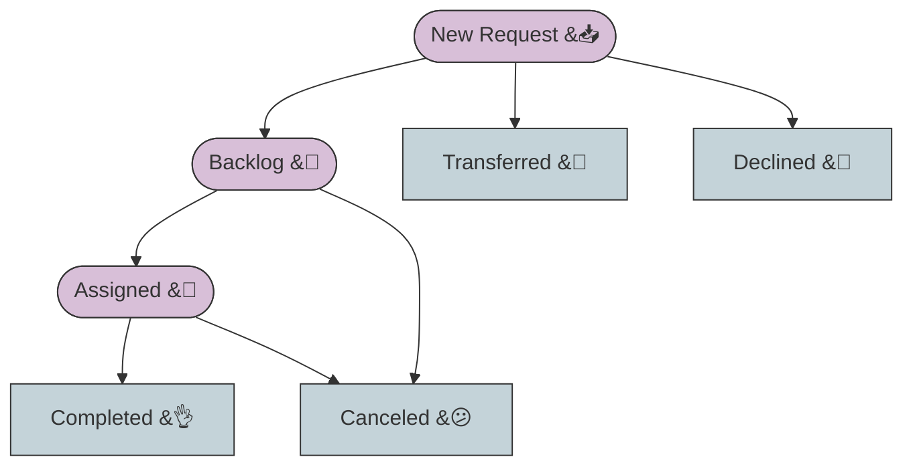
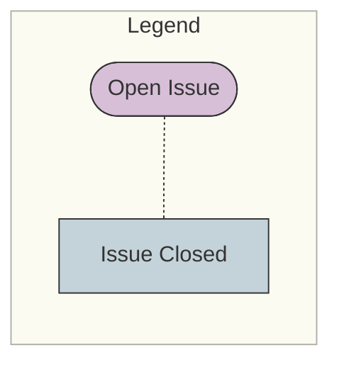
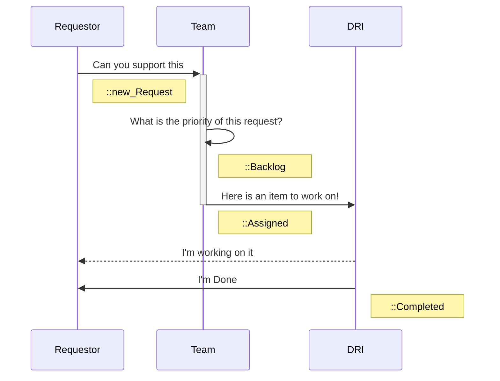

## 背景

チームや個人は、企業全体で複数の取り組みに対して作業を依頼/要求されることがよくあります。例えば:

- イベントには、ブースのブランディングやメッセージングが必要
- キャンペーンには、ポジショニング/メッセージングと、おそらくゲート付きのホワイトペーパーが必要
- 新しいホワイトペーパーやインフォグラフィックには、デザイン入力が必要
- キャンペーンには、顧客ケーススタディが必要
- チームがアナリストインクワイアリを希望する

`Issue 割り当て`や`ラベル`を使ってシンプルなタスクや割り当てを追跡することは可能ですが、規模のある組織では課題があります。

1. 任意の個人が Issue に `assigned` できます。Issue の作業に人を `assigned` することを管理または調整するための組み込みメカニズムはありません。

2. チームが Issue への貢献責任を持っていることを示すために `ラベル` が使用される場合、Issue へのチーム `ラベル` の追加を管理する現行のメカニズムやプロセスはありません。

これら 2 つの制限は、タスクや作業に対するチームのコミットメントの計画と管理を困難にしています。

## ソリューション - コミットメント管理

プロジェクト Issue とワークフローを使用して、**リクエスト**を一貫して捉え、**コミットメント**を管理します。実質的には、リクエストを行えるようにし、リクエストに応えるプロセスを実現するシンプルかつ効率的な `request-issue` です。

### コミットメント管理の概要

1. シンプルな `request` Issue（`issue template` で定義される）
1. 事前定義されたシンプルなワークフローステップのセット（GitLab スコープ `::` ラベルを使用）
1. `request` を受け取るチーム/リーダーシップがプロセスを管理しアクションを取る

### リクエストに対する典型的なアクション/レスポンス

- a. **Backlog** - リクエストは認識されたが、現時点では積極的に作業されていない
- b. **Assigned** - リクエストは受け入れられ、チームの誰かが作業の DRI である
- c. **Transferred** - リクエストは別のチームに移管された
- d. **Declined** - リクエストは受け入れられない
- e. **Canceled** - リクエストはキャンセルされた
- f. **Completed** - リクエストは完了し提供された

#### リクエストの典型的なワークフロー

### ラベルがプロセスを定義する

チームがプロセスを定義し管理することを可能にする 2 つの主要なラベルがあります:

1. プロセス内のすべての Issue にタグを付ける**プロジェクトラベル**。例:
`sm_request` - **すべての**リクエストに対する**プロダクト&ソリューションマーケティング**ラベル。これらが共通のグループレベルラベル（プロジェクト間で共有）になる可能性を探る必要があります。

2. ワークフローを定義するスコープラベルのセット。プロダクト&ソリューションマーケティングのワークフローからのラベル一覧:

- `sm_req::New`
- `sm_req::Backlog`
- `sm_req::Assigned`
- `sm_req::Completed`
- `sm_req::Declined`
- `sm_req::Transferred`
- `sm_req::Canceled`

通常は、**「sm_」**をチームのイニシャルに置き換えます。

*重要な注意: ラベルベースでこのようなプロセスを管理することは、すべてを正しいステータスに保つためのオーバーヘッドを生む可能性があります。全員にすべてのラベルと正しいステップを記憶することを期待するのは課題かもしれません。**自動的に Issue をクローズしたり、ラベルを追加したりする**ルール/ポリシーを**自動化することが可能**です。* [ラベルの衛生を自動化する方法を学ぶ](/handbook/marketing/brand-and-product-marketing/product-and-solution-marketing/getting-started/105/)

### Issue テンプレートがプロセスを開始する

[Issue テンプレート](https://docs.gitlab.com/ee/user/project/description_templates.html)を使用すると、プロセスを一貫して定義し、簡単に開始できます。

- Issue テンプレートはまた、**URL から直接リンク**できるため、ヘルプを依頼する人が Issue テンプレートを素早く開くことが容易になります。

例えば、この URL は[プロダクト&ソリューションマーケティングリクエスト](https://gitlab.com/gitlab-com/marketing/product-marketing/issues/new?issuable_template=A-SM-Support-Request)を開きます:

- `https://gitlab.com/gitlab-com/marketing/product-marketing/issues/new?issuable_template=A-SM-Support-Request`
キーは URL の末尾 `new?issuable_template=A-SM-Support-Request` であり、特定のテンプレートを開くよう GitLab に伝えています！

Issue テンプレートは、作業を理解し優先順位付けするために必要な情報を記述するだけでなく、特定のラベルを割り当てる[クイックアクション](https://docs.gitlab.com/ee/user/project/quick_actions.html)も含みます。ストラテジックマーケティングのテンプレートの下部には、ラベルを追加するための以下のクイックアクションがあります:

`/label ~"sm_request" ~"Product and Solution Marketing" ~"sm_req::new_request" ~"mktg-status::plan"`

### コミットメント管理の仕組み

1. プロジェクト、キャンペーン、イベント、その他をリードしている人が、チームからの助けを必要とします。
1. リクエスト Issue を開いて背景を提供します
1. **毎日の**プロセス - チーム（リーダーまたはチーム全般）が**`New Requests` をトリアージ**して対応方法を決定します。（`backlog`, `assigned`, `transferred`, `declined`）
1. リクエストが実際にチームメンバーに割り当てられると、ラベル `req::assigned` が適用され、**かつ**個人がリクエスト Issue に割り当てられます。
1. 割り当てられた個人が作業を行います。（*リクエスト Issue の中、またはリクエストが発生したプロジェクトの中、最も意味のある方で。*)
1. 作業が完了すると、Issue に `req::completed` のラベルが付けられます
（SM Triage Bot が完了した Issue を自動的にクローズします）

## ガイドライン

### コミットメントを管理するには、コミットメント追跡 Issue を使用する

**ラベルを追加するだけや、別の人にタグを付けるだけでは、コミットメントとは同じではありません！**

1. コミットメント追跡プロセスを作成する（スコープラベル、Issue テンプレート、チームプロセス）
2. プロセスを適用してチームの作業をキャプチャし管理する。原則として、**受け入れられ割り当てられた**リクエスト Issue がない場合、コミットメントはありません。
3. リクエストを管理し、バックログを構築・キュレーションし、作業を割り当てて提供する。
