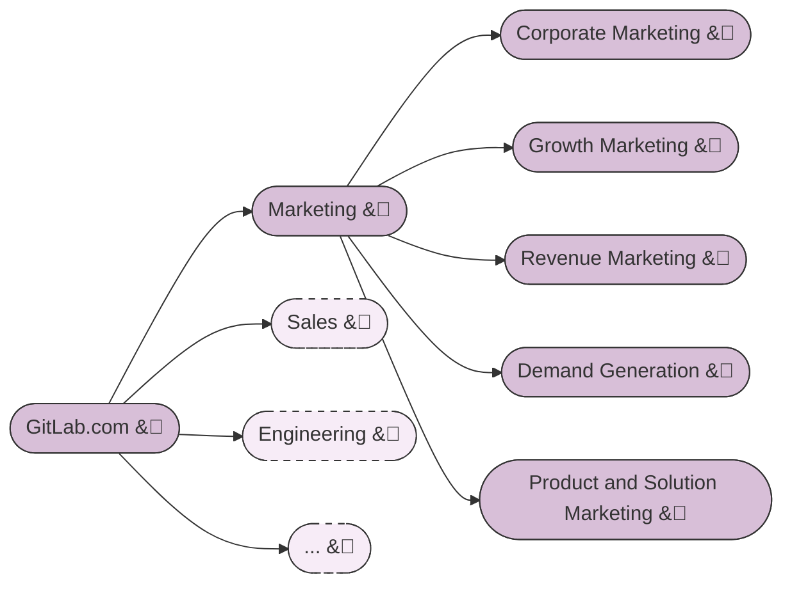

## 背景

GitLab は、[グループ](https://docs.gitlab.com/ee/user/group/)と[プロジェクト](https://docs.gitlab.com/ee/user/project/)の階層を通じて、チームと作業の組織化を支援します。

### 知っておくべき重要事項

グループは他のグループ（[サブグループ](https://docs.gitlab.com/ee/user/group/subgroups/index.html)）とプロジェクトを含むことができます。

グループとプロジェクトは似ていながら根本的に異なるため、GitLab を使うとき混乱することがあります

| 機能 | グループ | プロジェクト | コメント |
|---|---|---|---|
| Epic | X |  | 戦略的テーマで関連するサブ Epic と Issue のコレクション |
| ロードマップ | X |  | 時間経過に対する Epic のグラフィカルビュー |
| マイルストーン | X | X | タイムボックス化された期間のバーンダウンチャート |
| Issue インサイト | X | X | Issue とマージリクエストの分析ビュー |
| ラベル | X | X | Issue、Epic、マージリクエストにタグを付ける柔軟な機能 |
| Issue **リスト** | X | X | すべての Issue のリスト、一括更新を可能にする |
| Issue **ボード** |X | X | リストにグループ化された Issue のビジュアルボード |
| Issue |  | X | 作業項目、成果物、リクエスト、ディスカッション |
| リポジトリ |  | X | バージョン管理下にあるファイルのセット |
| マージリクエスト |  | X | バージョン管理下のファイルへの変更のディスカッション/管理 |
| CI パイプライン |  | X | 変更されているファイル/コードのビルドとテストの自動化 |

グラフィカルには、これがグループとプロジェクトの違いを示しています:

### 既知の制限

1. Epic はグループレベルでのみ作成でき、プロジェクトレベルでは作成できません。

## ガイドライン

### マーケティングの GitLab 構造

マーケティングには多様なチームがあり、デモやコードを開発する必要があるチームもあれば、キャンペーンや大規模イベントなど複雑なプロジェクトを管理する必要があるチームもあります。さまざまな活動を支援するために、私たちはサブグループを使用して柔軟性を提供し、チームが作業して生産的になれるエリアを持てるようにしています。

### マーケティングのサブグループとプロジェクト

- **作業して Issue を管理する**ためには、各マーケティングサブグループの下に**少なくとも 1 つの**プロジェクトが必要です。

```mermaid
graph LR
    A(["Marketing &#128101;"]):::GRP
  A --> B(["Corporate Marketing &#128101;"]):::GRP
  A --> C(["Growth Marketing &#128101;"]):::GRP
  A --> D(["Revenue Marketing &#128101;"]):::GRP
  A --> E(["Demand Generation &#128101;"]):::GRP
  A --> F(["Product and Solution Marketing &#128101;"]):::GRP
  B --> BA("Corporate Events &#9881;"):::PRJ
  B --> BB("Developer Relations &#9881;"):::PRJ
  B --> BC("Corporate Communications &#9881;"):::PRJ
  B --> BD("Developer Relations &#9881;"):::PRJ
  B --> BE("All-Remote &#9881;"):::PRJ
  C --> CA("Global Content &#9881;"):::PRJ
  C --> CB("Inbound Marketing &#9881;"):::PRJ
  C --> CC("Brand & Digital Design &#9881;"):::PRJ
  D --> DA("Sales Development &#9881;"):::PRJ
  D --> DB("Field Marketing &#9881;"):::PRJ
  D --> DC("Account Based Marketing &#9881;"):::PRJ
  D --> DD("Marketing Operations &#9881;"):::PRJ
  E --> EA("Marketing Programs &#9881;"):::PRJ
  E --> EB("Digital Marketing &#9881;"):::PRJ
  E --> EC("Partner & Channel Marketing &#9881;"):::PRJ
  F --> FA("Product Marketing &#9881;"):::PRJ
  F --> FB("Technical Marketing &#9881;"):::PRJ
  F --> FC("Market Research and Customer Insights &#9881;"):::PRJ
  F --> FD("Competitive Intelligence &#9881;"):::PRJ

classDef GRP fill:#D8BFD8, stroke: #333
classDef PRJ fill:#c4d3d9, stroke: #333
```

- 必要に応じて、マーケティングチームは作業を組織化し管理するために追加の**サブグループ**と**プロジェクト**を作成できます。
  - 例えば `Corporate Marketing` グループの下のマーケティングサブグループの例
    - Contribute グループと
    - Contribute-Workshops グループ
    - Tech. Evangelism グループ
    - **両方のサブグループにはプロジェクトがあり、コーポレートイベントの管理をサポートしています。**

```mermaid
graph LR
  A(["Marketing &#128101;"]):::GRP
  A --> B(["Corporate Marketing &#128101;"]):::GRP
  B --> BA("Corporate Marketing &#9881;"):::PRJ
  B --> BB(["Contribute &#128101;"]):::GRP
  B --> BC(["Contribute Workshops &#128101;"]):::GRP
  B --> BD(["Tech Evangelism &#128101;"]):::GRP

classDef GRP fill:#D8BFD8, stroke: #333
classDef PRJ fill:#c4d3d9, stroke: #333
```

```mermaid
graph LR
  subgraph legend["Legend"]
    GG(["Group &#128101;"]):::GRP -.- PP("Project &#9881;"):::PRJ
  end
classDef GRP fill:#D8BFD8, stroke: #333
classDef PRJ fill:#c4d3d9, stroke: #333
style legend fill:#FBFBF2, stroke: #b0b0a9
```

