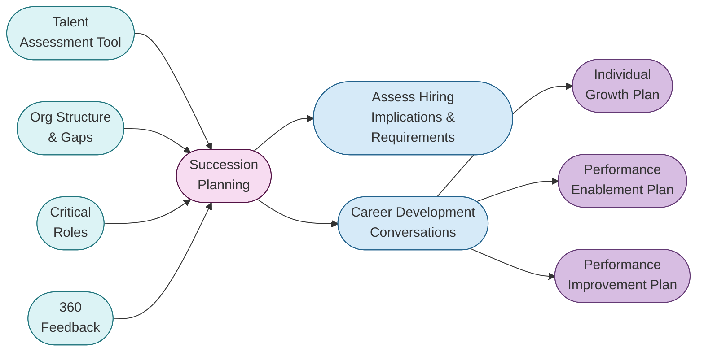

## なぜタレント開発プログラムが GitLab にとって不可欠なのか

私たちがスケールを続けるなかで、タレント開発に対しては意図的に取り組みたいと考えています。タレント開発プログラムへ投資することで、GitLab は多様で柔軟、かつ多才なチームを構築する機会を得られ、これは全チームにわたる継続的な成功にとって最も重要なことの一つでもあります。

GitLab のタレント開発プログラムには以下のイニシアチブが含まれます。

- [Talent Assessment Tool](/handbook/people-group/talent-assessment)
- [360 フィードバック](/handbook/people-group/360-feedback/)
- [組織構造とギャップ](/handbook/company/structure/)
- [パフォーマンスアセスメントとサクセッションプランニング](/handbook/people-group/talent-assessment)
- [キャリア開発に関する会話](/handbook/leadership/1-1/#career-development-discussion-at-the-1-1)
- [パフォーマンス改善プラン (PIP)](/handbook/leadership/underperformance/#options-for-remediation)
- [Performance Enablement Review](/handbook/people-group/learning-and-development/career-development#performance-enablement-review)
- [Individual Growth Plan](https://docs.google.com/document/d/1ZjdIuK5mNpljiHnFMK4dvqfTOzV9iSJj66OtoYbniFM/edit)
- [エンゲージメントサーベイ](/handbook/people-group/engagement/)
- [年次報酬レビュー](/handbook/total-rewards/compensation/compensation-review-cycle/#annual-compensation-review)

### タレント開発プログラムチャート

本ページとプログラム全体のコンテンツおよび計画は、この [タレント開発プログラム Issue](https://gitlab.com/gitlab-com/people-group/General/-/issues/719) で進めています。ぜひフォローし、貢献してください！
