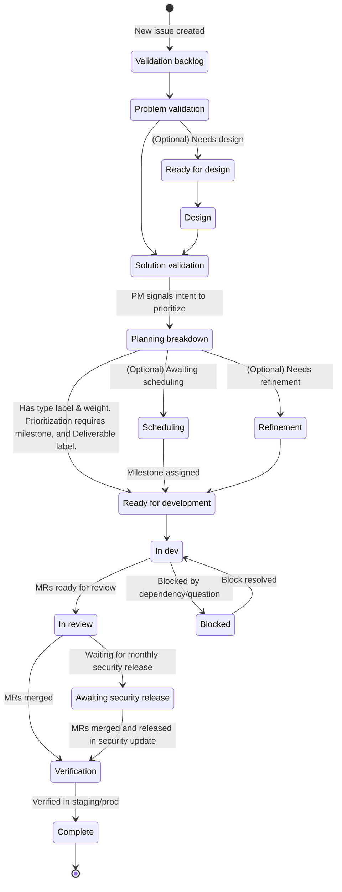

## 概要と哲学

GitLab のプロダクトミッションは、ユーザーが愛し価値を感じてくれるプロダクトと体験を一貫して作ることです。このミッションを果たすには、アイデアからカスタマーバリューを提供するものへと変えるための、明確に定義され繰り返し可能なフローを持つことが重要です。なお、より広範な GitLab コミュニティから、プロセスのあらゆる時点でオープンソースのコントリビューションを受け付けることも重要です - それらはこのプロセスには必ずしも従いません。

このページは、クロスファンクショナルな開発チームに私たちが期待する作業の進め方の進化的な説明であり、現在活用されているワークフローを反映しています。このページにおける必須のアクションやアウトカムはすべて、次のように示されます：

> <i class="fab fa-gitlab fa-fw" style="color:rgb(252,109,38); font-size:1.25em" aria-hidden="true"></i> プロダクト開発フローにおける必須の側面を示します。

機能開発は、指定されたアウトカムを達成するためにすべてのフェーズを通ることが期待されますが、残りのワークフローは、ベストプラクティス、ツール、推奨事項のセットと見なすべきです。私たちは、特定のプロダクト改善がすべてのフェーズを経る必要のないユニークなケースがあることを認識しています。デザインおよびエンジニアリングチームと整合しつつ、プロダクトマネージャーが最善の判断を使うことを信頼しています。このページの目標は、各フェーズで目標とすべき必須の **アウトカム**、およびこれらのアウトカムを達成するためにチームが採用できる戦略／戦術、**アクティビティ**を強調することで、ワークフローでチームをサポートすることです。さらに、このページは、追跡、検索、クロスファンクショナル協働の観点でプロダクトシステムを効率的に保つために、すべてのフェーズで必要な*最小*のアクション（ラベルなど）を明確にすることを目指しています。明確さを維持し混乱を避けるため、このページにはオプションのアクションを記載していませんが、ここに記載されていなくても、チームは計画用のラベルなどの追加のアクションを採用することを選択できます。

チームがプロダクト開発フローを活用するなかで、特定の戦略／戦術がチームの成功に役立っていることに気づくかもしれません。そのため、カスタマー向けの価値ある機能を構築するための選択肢の堅牢なプレイブックを作成できるよう、このページへの MR を歓迎します。すべてのチームメンバーは、ベストプラクティスを共有するために、このページの[変更プロセス](#contributing-to-this-page) に従うことを推奨されます。

## でも待って、これはウォーターフォールじゃないの？

いいえ。このページで説明されているフェーズは独立的で線形的に見えますが、そうではありません。簡略化とナビゲーションのしやすさのためにこのように提示されています。GitLab では、線形的な作業を推奨しません。プロダクト開発ライフサイクルにおけるフェーズは、重なり合ったり並行して発生したりすることがあります。

私たちは、後続のフェーズのリスクを下げるために、各フェーズで主要なアウトカムを達成することを目指します。ただし、プロダクト開発フローは、フェーズを通る順序や、各フェーズで費やす時間を指示しません。チームが自分たちの方向性に高い信頼度を持っているとき、信頼度の向上に寄与しないフェーズはスキップしたり短縮したりする権限を与えられていると感じるべきです。

例：

- エンジニアリングチームが、他のチームメンバーが検証フェーズのアクティビティを実行している間に、技術レビューを実施する。チームは、自分たちの改善がカスタマーにとって良く、技術的に実現可能であるという高い信頼度を持って、迅速に Build フェーズに進めます。

- GitLab カスタマーからバグが報告される。プロダクトマネージャーがバグをテストし、その存在を確認する（Problem Validation）。チームはソリューションに対して非常に高い信頼度を持っているため、Design と Solution Validation は不要です。バグはすぐに Build に移されます。

## ワークフローの概要

このページを通して、[DRI](/handbook/people-group/directly-responsible-individuals/) が言及される場合は常に、参照される人はフェーズによって異なる可能性があり、複数人いる場合もあります。
DRI が誰であるかについては、[Product Development Roles and Responsibilities ページ](../roles-and-responsibilities/)を参照してください。

<object data="/images/product-development/product-development-flow/PDF-Diagram.svg" style="width: 100%;" type="image/svg+xml">
  Product Development Flow diagram.
  Unable to load this content, check console for details.
</object>

> <i class="fab fa-gitlab fa-fw" style="color:rgb(252,109,38); font-size:1.25em" aria-hidden="true"></i> Issue のステータスを使用して、Issue の状態を効率的に伝えます。これらのステータスを使用することで、チーム間のコラボレーションを可能にし、Issue の現在の状態を伝えます。

次の図は、新しい Issue が各ステータスをどのように移動するかを示していますが、適切な場合は状態をスキップできます。このドキュメントの残りの部分では、各ワークフローステップを詳細に説明します。

### Single Source of Truth (SSOT) としての Issue の説明

> <i class="fab fa-gitlab fa-fw" style="color:rgb(252,109,38); font-size:1.25em" aria-hidden="true"></i> Issue の説明は常に Single Source of Truth として維持されるべきです。

コントリビューターが現在の状態を理解するために、Issue 内のすべてのコメントを読まなくてはならないのは [効率的](/handbook/values/#efficiency) ではありません。

- Issue 説明の正確性は、各フェーズで DRI によって維持されるべきです。ただし、すべてのコラボレーターも、不一致や必要な更新を見つけたら貢献でき、また貢献すべきです。

## ワークフローラベルからステータスへの移行

GitLab は、Product Development Flow を通じて進捗を追跡するために、スコープ付きワークフローラベル（`workflow::*`）の使用から Issue ステータスの使用に移行しました。次のマッピングは、各旧ワークフローラベルに対応するステータスを示しています：

| 旧ワークフローラベル | 現在のステータス |
|----------------------|----------------|
| `workflow::validation backlog` | `Validation backlog` |
| `workflow::problem validation` | `Problem validation` |
| `workflow::ready for design` | `Ready for design` |
| `workflow::design` | `Design` |
| `workflow::solution validation` | `Solution validation` |
| `workflow::planning breakdown` | `Planning breakdown` |
| `workflow::scheduling` | *削除済み* |
| `workflow::refinement` | `Refinement` |
| `workflow::ready for development` | `Ready for development` |
| `workflow::in dev` | `In dev` |
| `workflow::in review` | `In review` |
| `workflow::blocked` | `Blocked` |
| `workflow::verification` | `Verification` |
| `workflow::awaiting security release` | `Awaiting security release` |
| `workflow::complete` | `Complete` |
| *なし* | `Duplicate` |
| *なし* | `Won't do` |

ステータスは、バリューストリームを通じて Issue の進捗を追跡する、よりクリーンで統合された方法を提供します。

チームは、対応するワークフローラベルではなくステータスを使用するようにワークフローを更新すべきです。ワークフローラベルは 2026-02-27 以降はサポートされません。[フィードバック Issue](https://gitlab.com/gitlab-com/Product/-/work_items/14487) でヒントを共有し、フィードバックを残してください。

### 優先順位付け

何をどのように優先順位付けするかについてのガイダンスは、次で説明されています：

1. [R&D Interlock](/handbook/product-development/how-we-work/r-and-d-interlock/)
1. [Cross-functional Prioritization](/handbook/product/product-processes/cross-functional-prioritization/)
1. [Customer Issues Prioritization](/handbook/product/product-processes/customer-issues-prioritization-framework/)

## Validation トラック

[カスタマー課題が十分に理解されていない](/handbook/product/ux/experience-research/when-to-conduct-ux-research/#design-the-right-thingproblem-validation) 状況では、プロダクトマネージャー（PM）と User Experience 部門（UXer）は、Build トラックに移行する前に新しい機会を検証するために協働すべきです。**Validation** トラックは、常に動いている **Build** トラックから独立したトラックです。PM と UXer は、少なくとも 2 か月先行するように協働し、Build トラックが常に十分に検証されたプロダクトの機会を開始する準備ができている状態にすべきです。マイルストーン作業は、一部のマイルストーンが他のマイルストーンよりも多くの検証努力を含む可能性があることを理解した上で、[優先順位付け](/handbook/product/product-processes/) されるべきです。バグ修正、十分に理解された反復的改善、軽微な設計修正、技術的負債などには、Validation サイクルは必要ない場合があります。

### Validation スペクトラム

Validation トラックで必要となるアクティビティのタイプとリサーチの深さは、カスタマー課題とソリューションをどの程度よく理解しているかによって異なります。

### Validation の目標とアウトカム

**いつ：** 提案された問題またはソリューションに関する信頼度が高くない場合。たとえば、その問題が多数のユーザーにとって重要であるか、ソリューションが理解しやすく使いやすいかが合理的に確信できない場合。

**誰：** Product Manager、Product Designer、UX Researcher、Product Design Manager、Engineering Manager

**何を：**

✅ 解決しようとしているユーザー課題を **理解** する。

✅ 成功を判断するためのビジネス目標と主要メトリクスを **特定** する。

✅ 仮説を **生成** し、リサーチ／実験／ユーザーテストする。

✅ MVC と将来のイテレーションの候補を **定義** する。

✅ 定性的および定量的分析で、価値、ユーザビリティ、実現可能性、ビジネス的実現可能性へのリスクを **最小化** する。

**アウトカム：** 提案されたソリューションが 1 つまたは複数の [Product KPI](/handbook/company/kpis/#product-kpis) にポジティブな影響を与えるという信頼度を持つ。例外の理由がある場合もあるため、その場合チームは明確にし、KPI に紐付けずに重要であることを正当化できる必要があります。

MVC や成功の姿に関する信頼度がない場合は、Build トラックに移る前に検証サイクルを継続すべきです。

### Validation フェーズ 1：Validation バックログ

<i class="fab fa-gitlab fa-fw" style="color:rgb(252,109,38); font-size:1.25em" aria-hidden="true"></i> ステータス： `Validation backlog`

#### 説明

世界クラスのプロダクトの成長は、よく維持されたバックログから構築されます。プロダクトマネージャーは、検証の機会がカテゴリーの方向性、ステージ、および／またはセクションレベルの戦略に沿ってスコープ設定され [優先順位付け](/handbook/product/product-processes/#prioritization) されるよう、グループのバックログを洗練する責任があります。バックログはまた、[ステークホルダー](/handbook/product/product-processes/#what-is-a-stakeholder) がグループを理解し関わるための Single Source of Truth でもあります。バックログ内の Issue の位置、説明、議論、メタデータは、ステークホルダーを最新に保つために必要な主要なデータです。

#### アウトカムとアクティビティ

| アウトカム | アクティビティ |
|----------|------------|
| <i aria-hidden="true" style="color:rgb(252,109,38); font-size:1.25em" class="fab fa-gitlab fa-fw"></i>**最新の Issue とエピック**：GitLab では、Issue がプロダクトへのあらゆる変更に対する Single Source of Truth です。これらを最新に保つことで、すべてのチームメンバーが計画されている作業を理解できるようになり、効率と透明性が向上します。 | - [Sensing mechanism](/handbook/product/product-processes/sensing-mechanisms/) への対応として Issue を作成します。新機能には *Problem Validation* Issue テンプレートの使用を検討します。 - Issue の議論をレビューし、説明内の関連情報を更新します。 - メタデータ（ラベルなど）を最新に保ちます。 - ステークホルダーのコメントに積極的に応答します。 - 議論ノートや外部情報を Issue に転記します（リンクまたは議論／説明の詳細として）。 |
| <i class="fab fa-gitlab fa-fw" style="color:rgb(252,109,38); font-size:1.25em" aria-hidden="true"></i>[**優先順位付けされたバックログ**](/handbook/product-development/programs/backlog/)：Issue とエピックのバックログは、ステークホルダーがグループにとって「次は何か」を知るための主要なシグナルです。バックログはまた、機能がプロダクト開発フローのフェーズを進むにつれて、グループが作業を進めるためのキューでもあります。このキューは、Issue ボード上のマイルストーンとランクオーダリングで最新に保たれます。 | - Issue 優先順位付けの定期的なレビュー（Issue ボードの順序付けやマイルストーンの割り当てなど）。 - 優先順位付けされたバックログをカテゴリーの方向性と成熟度に整合させます。 - 優先順位のトレードオフ判断に役立つ [RICE 公式](https://www.productplan.com/glossary/rice-scoring-model/) の使用を検討します。 - [バグおよびメンテナンス作業には別の DRI](/handbook/product/product-processes/) がいるため、ステーブルカウンターパートから優先順位フィードバックを収集する [優先順位付けセッション](/handbook/product/product-processes/#prioritization-sessions) の開催を検討します。 |

### Validation フェーズ 2：Problem validation

<i class="fab fa-gitlab fa-fw" style="color:rgb(252,109,38); font-size:1.25em" aria-hidden="true"></i> ステータス： `Problem validation`

#### 説明

正しいソリューションが届けられることを担保するため、チームは [検証済みの問題](/handbook/product/ux/experience-research/problem-validation-and-methods) から作業を始めなければなりません。これは [さまざまな形](/handbook/product/ux/experience-research/problem-validation-and-methods/#foundational-research-methods) を取りえます。

問題が文書化されており十分に理解されている場合、ユーザー課題に関する既知のデータを文書化することで、このフェーズを迅速に通過できる場合があります。文書化された問題は、ユーザーからの直接のフィードバックによる既存の体験、または問題が複数のユーザーによって体験されていることを確認するユーザーエンゲージメントがある Issue として分類できます。十分に理解された問題とは、カスタマーインタビューからの一連の文書化された定性リサーチ、問題を確認する [異なる sensing mechanism](/handbook/product/product-processes/sensing-mechanisms/) の三角測量、または既知データを使ったものなどです。既知データの例には、[Customer Request Issue](https://10az.online.tableau.com/#/site/gitlab/workbooks/2015827/views) や、過去のリサーチからの既存の [`Actionable Insights`](/handbook/product/ux/experience-research/research-insights/#how-to-document-actionable-insights) が含まれます。問題が十分に理解されていることを文書化するには、既知データとカスタマーコールを関連する Issue やエピックにリンクしてください。

問題が微妙であるかまだ十分に理解されていない場合、ユーザーで適切に検証するのに時間がかかるでしょう。このフェーズの主要なアウトカムは、問題に対する明確な理解と、その問題をさまざまなステークホルダーに伝えるシンプルで明確な方法です。オプションですが、個人が問題をよりよく理解し、さまざまなステークホルダーに伝えるのに役立つツールとして、[Opportunity Canvas](/handbook/product/product-processes/#opportunity-canvas) を使用することを推奨します。Opportunity Canvas は、新規リソースの要求を含む新しいカテゴリーの作成を推奨するためにも使用できます。

#### アウトカムとアクティビティ

| アウトカム | アクティビティ |
|----------|------------|
| <i class="fab fa-gitlab fa-fw" style="color:rgb(252,109,38); font-size:1.25em" aria-hidden="true"></i> **問題の徹底的な理解**：チームは問題、それが誰に影響するか、いつなぜか、そして問題の解決がビジネスニーズとプロダクト戦略にどうマッピングされるかを理解します。 | - GitLab プロジェクトで [Problem Validation Template](https://gitlab.com/gitlab-org/gitlab/-/blob/master/.gitlab/issue_templates/Problem%20Validation.md) を使って Issue を作成します。 - [Opportunity Canvas](/handbook/product/product-processes/#opportunity-canvas) を完成させます。 - フィードバックを得るために Opportunity Canvas のレビューをスケジュールします。 - UX Research プロジェクトで [Problem Validation Research Template](https://gitlab.com/gitlab-org/ux-research/-/blob/master/.gitlab/issue_templates/Problem%20validation.md) を使って Issue を作成し、UX Researcher と協働してリサーチ調査を実施します。 - [提案された方法](/handbook/product/ux/experience-research/problem-validation-and-methods/) のいずれかを使ってユーザーで問題を検証し、[Dovetail で発見を文書化](/handbook/product/ux/dovetail/) します。 |
| <i class="fab fa-gitlab fa-fw" style="color:rgb(252,109,38); font-size:1.25em" aria-hidden="true"></i> **Issue／エピック説明の更新**：十分に理解され明確に表現されたカスタマー課題が Issue に追加され、成功的で効率的なデザインおよび開発フェーズにつながります。 | - 問題に関する最新の理解で Issue が最新であることを担保します。 - [Jobs to be Done (JTBD)](/handbook/product/ux/jobs-to-be-done/) フレームワークを使って、人々が達成したい目標を理解し（Issue 内で）文書化します。 - ユーザーが直面する問題について最新の状態を保つため、定期的なケイデンスでカスタマーとの [continuous interview](/handbook/product/product-processes/continuous-interviewing/) を実施します。 - [Opportunity Canvas](/handbook/product/product-processes/#opportunity-canvas) を活用して、問題をステーブルカウンターパートやグループのステークホルダーに伝えます。フィードバックを収集し、Product と UX のリーダーシップに発見を伝えるためのレビューをスケジュールすることを検討します。 - Product Designer が問題を十分に理解し、ソリューションをアイデア出しできることを確認します。 |
| Dogfooding プロセスの開始：問題を検証する際は、広範なコミュニティに加えて [社内カスタマー](/handbook/product/product-processes/#engage-with-internal-customers) からのフィードバックを集めることが重要です。プロダクト開発フローの早期に社内カスタマーのフィードバックを取得することで、機能が成熟するにつれて社内カスタマーのニーズが考慮されるようになり、主要な [Dogfooding](/handbook/product/product-processes/dogfooding-for-r-d/) のアウトカムが加速します。機能の社内利用を一貫して推進すると、[より大きなカスタマー採用につながります](https://about.gitlab.com/blog/2020/04/16/geo-is-available-on-staging-for-gitlab-com/)。 | - 検証フェーズの間に [Dogfooding Issue](/handbook/product/product-processes/dogfooding-for-r-d/) を開き、社内カスタマーのフィードバックを取得して、機能の初期および／または将来のイテレーションに情報を提供します。 |

### Validation フェーズ 3：Ready for Design

<i class="fab fa-gitlab fa-fw" style="color:rgb(252,109,38); font-size:1.25em" aria-hidden="true"></i> ステータス： `Ready for design`

#### 説明

Problem validation が完了したら、デザイン作業が必要な Issue は "Ready for Design" 状態に移すべきです。この状態はデザインチームのキューとして機能し、問題が適切に検証され文書化された後にのみデザイン作業が始まることを担保します。このフェーズは、プロダクトマネジメントチームとデザインチーム間のハンドオフの調整に役立ち、ソリューションのアイデア出しを始める前に、デザイナーが必要なすべてのコンテキストと検証済みの問題ステートメントを持つことを担保します。

Ready for Design フェーズを開始するには、Issue のステータスを `Ready for design` に設定します。

#### アウトカムとアクティビティ

| アウトカム | アクティビティ |
|----------|------------|
|<i class="fab fa-gitlab fa-fw" style="color:rgb(252,109,38); font-size:1.25em" aria-hidden="true"></i> **デザインの準備が整った明確な問題ステートメント**：Issue には、デザイン作業を始めるのに十分なコンテキストを提供する、十分に文書化され検証された問題ステートメントが含まれます。 | - Issue 説明に Problem Validation フェーズからの明確な問題ステートメントが含まれていることを担保します。 - ユーザーリサーチの発見とインサイトが文書化されアクセス可能であることを検証します。 - 関連するユーザーペルソナ、Jobs-to-be-done、またはユーザージャーニーの情報が利用可能であることを確認します。 - ビジネス目標と成功メトリクスが明確に定義されていることをレビューします。 |
|<i class="fab fa-gitlab fa-fw" style="color:rgb(252,109,38); font-size:1.25em" aria-hidden="true"></i> **デザインチームの認識とキャパシティ**：デザインチームは今後の作業を認識しており、デザインフェーズを始めるキャパシティがあります。 | - 担当の Product Designer に今後のデザイン作業についてコミュニケーションします。 - デザイナーが問題のコンテキストを理解し、関連するすべてのリサーチにアクセスできることを担保します。 - デザインチームのキャパシティとデザイン作業の予想タイムラインを確認します。 - 必要なハンドオフミーティングやデザインキックオフをスケジュールします。 |
|<i class="fab fa-gitlab fa-fw" style="color:rgb(252,109,38); font-size:1.25em" aria-hidden="true"></i> **技術的制約の文書化**：デザイン判断に影響を与える可能性のある既知の技術的制約や考慮事項が文書化され伝えられます。 | - デザイン判断に情報を提供すべき技術的限界や制約を文書化します。 - 関連する場合、実現可能性に関するエンジニアリングチームのインプットが取得されていることを担保します。 - デザインアプローチに影響を与える可能性のあるプラットフォーム固有の考慮事項（web、モバイル、API など）を記録します。 |

### Validation フェーズ 4：Design

<i class="fab fa-gitlab fa-fw" style="color:rgb(252,109,38); font-size:1.25em" aria-hidden="true"></i> ステータス： `Design`

#### 説明

問題を理解し検証した後、[diverge/converge](https://web.archive.org/web/20210119060603/https://web.stanford.edu/~rldavis/educ236/readings/doet/text/ch06_excerpt.html) プロセスを通じて、潜在的なソリューションのアイデア出しを始めるか継続できます。ただし、問題検証フェーズの結果が、既存ソリューションへの増分的な変更を自信を持って提案する場合は、前述の diverge/converge プロセスはスキップ可能です。

このフェーズでは、単一のソリューションに収束する（converge）前に、潜在的なソリューションをアイデア出しし、異なるアプローチを探求します（diverge）。ソリューションは、カスタマーとビジネスの目標を満たし、技術的に実現可能で、法的コンプライアンスの考慮事項に整合しているかを判断することで評価されます。チームはステークホルダーと関わって、潜在的な欠陥、見落とされたユースケース、潜在的なセキュリティリスク、ソリューションが意図したカスタマーインパクトを持つかどうかを判断することを推奨されます。

DRI は、[Legal Risk Checklist](https://internal.gitlab.com/handbook/legal-and-corporate-affairs/legal-and-compliance/legal-risk-checklist/)（チームメンバーのみアクセス可能）をレビューし、完成する必要のあるセクションがあるかを判断する責任があります。チームが提案ソリューションに収束するか、検証する小さなオプションセットを特定した後、Issue は Solution Validation フェーズに移ります。

Design フェーズを開始するには、Issue のステータスを `Design` に設定します。

#### アウトカムとアクティビティ

| アウトカム | アクティビティ |
|----------|------------|
|<i class="fab fa-gitlab fa-fw" style="color:rgb(252,109,38); font-size:1.25em" aria-hidden="true"></i> **提案ソリューションの特定と文書化**：DRI はチームと協働してソリューションを探求し、ユーザー体験、カスタマーバリュー、ビジネスバリュー、開発コストのバランスを最もよく取るアプローチを特定します。 | **Diverge**：チームとして複数の異なるアプローチを探求します。アクティビティ例： - [Think Big](/handbook/product/ux/thinkbig/) セッション。 社内インタビュー（必ず [Dovetail で発見を文書化](/handbook/product/ux/dovetail/)）。  - [ユーザーフロー](https://careerfoundry.com/en/blog/ux-design/what-are-user-flows/) を作成。    **Converge**：検証する小さなオプションセットを特定します。アクティビティ例：  - チームとの [Think Small](/handbook/product/ux/thinkbig/#think-small) セッション。  - チームとのデザインレビュー  - 低忠実度のデザインアイデア。  - 提案ソリューションで Issue／エピック説明を更新します。Figma デザインファイルへのリンクを追加するか、ソリューションアイデアを伝えるためにデザインを [GitLab の Design Management](https://docs.gitlab.com/ee/user/project/issues/design_management.html) に添付します。  - ステークホルダーの助けを借りてアプローチを検証します。[提案された方法](/handbook/product/ux/experience-research/solution-validation-and-methods/) のいずれかを使ってユーザー検証を実行し、[Dovetail で発見を文書化](/handbook/product/ux/dovetail/) し、適切な GitLab Issue にも記載します。  - 競合および隣接する製品からインスピレーションを引き出します。 |
|<i class="fab fa-gitlab fa-fw" style="color:rgb(252,109,38); font-size:1.25em" aria-hidden="true"></i> **提案ソリューションに関するチーム内での共通理解**：DRI は、より広範なチームを通して提案ソリューションのレビューを主導します。 | - 提案ソリューションをチームとしてレビューし、誰もが貢献し、質問し、懸念を提起し、代替案を提案する機会を持てるようにします。 - 提案ソリューションをリーダーシップとレビューします。 |
|<i class="fab fa-gitlab fa-fw" style="color:rgb(252,109,38); font-size:1.25em" aria-hidden="true"></i> **技術的実現可能性への信頼**：Build フェーズを始めるときに手戻りや大幅な変更を避けるため、Engineering がソリューションの技術的実現可能性を理解することが重要です。 | - Engineering と技術的影響を議論し、提案されているものが希望する時間枠内で可能であることを担保します。デザイン作業を共有するときは、Figma のコラボレーションツールと GitLab のデザイン管理機能の両方を使います。 - Slack メッセージ、Issue 上の ping、または提案を議論するためのセッションのスケジューリングを通じて、エンジニアリングのピアを早期かつ頻繁に関わらせます。 - ソリューションが大規模で複雑な場合、リスクを軽減し最適なイテレーションパスを発見するために [spike](/handbook/product/product-processes/#spikes) のスケジューリングを検討します。 |
|<i class="fab fa-gitlab fa-fw" style="color:rgb(252,109,38); font-size:1.25em" aria-hidden="true"></i> **Issue／エピック説明の更新**：DRI は Issue とエピックが最新であることを担保します。 | - 作業を効率的かつ非同期に続けられるよう、Issue とエピックが最新であることを担保します。 - [実験定義](/handbook/engineering/development/growth/#experimentation)。 |
|Dogfooding プロセスの継続 | - 機能に該当する場合、DRI は機能を GitLab で構築するか、プロダクトの外部に保つかを決定することで、Dogfooding プロセスを継続します（[build the feature in GitLab or keep outside](/handbook/product/product-processes/dogfooding-for-r-d/)）。 |

### Validation フェーズ 5：Solution Validation

<i class="fab fa-gitlab fa-fw" style="color:rgb(252,109,38); font-size:1.25em" aria-hidden="true"></i> ステータス： `Solution validation`

#### 説明

ビジネス要件を満たし技術的に実現可能な 1 つ以上の潜在的なソリューションを特定した後、DRI は、提案ソリューションがユーザーのニーズと期待を満たすという信頼度があることを担保しなければなりません。この信頼度は、デザインフェーズ中に行われた作業から得られ、追加のリサーチ（ユーザーインタビュー、ユーザビリティテスト、ソリューション検証など）で補完できます。必要に応じて、このフェーズは [GitLab UX Research プロジェクト](https://gitlab.com/gitlab-org/ux-research) 内で Solution Validation Issue を立ち上げ、提案ソリューションを検証するためのリサーチをチームに案内します。

加えて、機能の [non-functional requirement](/handbook/product/product-processes/#foundational-requirements) を考慮し文書化する必要があります。これには、[application limit](/handbook/product/product-processes/#introducing-application-limits) の導入が必要かどうかや、[データストレージに関する考慮事項](/handbook/product/product-processes/#considerations-around-data-storage) を評価することが含まれます。事前にこれらの non-functional requirement を定義することで、スケーラビリティと機能の長期的成功を考慮していることを担保します。機能の長期ビジョンに整合した適切なデフォルト値をこの段階で特定すべきです。

Solution Validation フェーズを開始するには、Issue のステータスを `Solution Validation` に設定します。

#### アウトカムとアクティビティ

| アウトカム | アクティビティ |
|----------|------------|
|<i class="fab fa-gitlab fa-fw" style="color:rgb(252,109,38); font-size:1.25em" aria-hidden="true"></i> **提案ソリューションへの高い信頼度**：問題ステートメント内で概説された Jobs to be Done が、提案ソリューションで満たせるという信頼度。 | - 関連するステークホルダーからフィードバックを収集します。 - [solution validation のガイダンス](/handbook/product/ux/experience-research/solution-validation-and-methods/) に従ってフィードバックを収集します。 |
|<i class="fab fa-gitlab fa-fw" style="color:rgb(252,109,38); font-size:1.25em" aria-hidden="true"></i> **文書化された Solution Validation の学び**：solution validation の結果がチームメンバーに伝えられ理解されます。 | - Solution Validation の発見を [Dovetail のインサイト](/handbook/product/ux/dovetail/) として文書化します。 - 関連するインサイトで [opportunity canvas](/handbook/product/product-processes/#opportunity-canvas)（使用している場合）を更新します。 - 発見を含むか、リンクするように Issue またはエピックの説明を更新します。 |

## Build トラック

Build トラックは、[MVC](/handbook/product/product-principles/#the-minimal-valuable-change-mvc) を構築し、欠陥を修正し、セキュリティ脆弱性にパッチを当て、ユーザー体験を強化し、パフォーマンスを改善することで、ユーザーに価値を計画、開発、提供する場所です。このトラックはまた、[ユーザーにとって正しいものを作っているかどうかについてのインサイトを得る](/handbook/product/ux/experience-research/when-to-conduct-ux-research/#design-things-rightsolution-validation) 時期でもあります。チームは MVC を実装するために緊密に協働します。課題が生じた場合、決定は迅速に行われます。私たちは [使用状況](https://internal.gitlab.com/handbook/company/performance-indicators/product/#instrument-tracking) を計装し、[プロダクトパフォーマンス](https://internal.gitlab.com/handbook/company/performance-indicators/product/) を追跡します。これにより、MVC がカスタマーに提供された後、[次のイテレーション](/handbook/product/product-processes/#iteration-strategies) を洗練するための学習として、フィードバックが迅速に取得されます。Build トラックを流れる焦点を絞った協働的なボードを作成するため、GitLab のさまざまな機能を活用する方法の例については、[このビデオをチェックしてください](https://youtu.be/rZW0ou4u-dw)。

### Build の目標とアウトカム

**いつ：** [プロダクト開発タイムライン](/handbook/engineering/workflow/#product-development-timeline) に従って MVC を構築するとき

**誰：** Product Manager、Product Designer、開発チーム、Software Engineer in Test

**何を：**

✅ 必要に応じて、カスタマーのサブセットまたは全セットに **リリース** します。

✅ UX、機能、技術的パフォーマンス、カスタマーインパクトを **評価** します。

✅ MVC を成功メトリクスに対して測定するデータを **収集** し、次のイテレーションに情報を提供します。

✅ 成功メトリクスが達成され、プロダクト体験が最適になるまで **イテレーション** します。

**アウトカム：** 1 つ以上の [Product KPI](https://internal.gitlab.com/handbook/company/performance-indicators/product/) および／または [Engineering KPI](/handbook/company/kpis/#engineering-kpis) を改善する、パフォーマンスの高い MVC を提供します。もしそれに失敗した場合は、私たちの Efficiency バリュー（低いレベルの恥を含む）を尊重し、それを放棄して、正しいソリューションを特定するために検証サイクルを再開します。

### Build フェーズ 1：Plan {#build-phase-1-plan}

#### 必須ステータス

| ステータス | 使い方 |
|--------|-------|
|<i class="fab fa-gitlab fa-fw" style="color:rgb(252,109,38); font-size:1.25em" aria-hidden="true"></i> `Planning breakdown` | DRI が [月の 4 日](/handbook/engineering/workflow/#product-development-timeline) 以前に設定し、次のマイルストーンに Issue を優先順位付けする意図を示す。 |
|<i class="fab fa-gitlab fa-fw" style="color:rgb(252,109,38); font-size:1.25em" aria-hidden="true"></i> `Ready for development` | Issue が分解され、開発に向けて優先順位付けされた。Issue はこの時点で [work type classification](/handbook/product/groups/product-analysis/engineering/metrics/#work-type-classification)（`type::`）ラベルと割り当てられたマイルストーンも持つ。 |

#### 必須ラベル

| ラベル | 使い方 |
|--------|-------|
|<i class="fab fa-gitlab fa-fw" style="color:rgb(252,109,38); font-size:1.25em" aria-hidden="true"></i> `Deliverable` | DRI が現在のマイルストーンに受け入れられたことを示すために Issue に適用する。 |

#### 説明

このフェーズでは、エンジニアリングが構築する準備が整うように機能を準備します。バグ、技術的負債、その他の機能ではない類似の変更は、このフェーズでプロセスに入ります（または、作業を行う意味があることを担保するために問題全体の検証を必要とする、作業を実施するコストに基づいて、より早期のフェーズで入ることが有益な場合もあります）。Validation フェーズ 4 の後、機能はユーザーのアウトカムを改善するための最も迅速な変更にすでに分解されており、エンジニアリングによるより詳細なレビューの準備が整っているはずです。このフェーズでは、DRI はステータスを `Planning breakdown` に設定することで、マイルストーンに優先順位付けする予定の Issue を浮上させます。この時点で、適切な DRI がエンジニアを割り当ててその作業をさらに分解し、ウェイトを適用します。トレードオフの決定が行われ、機能の Issue は、検証ソリューションから、単一のマイルストーンで提供できる明確な MVC へと進化します。Issue にすべての決定を文書化してください。

このフェーズでは、DRI は [Legal Risk Checklist](https://internal.gitlab.com/handbook/legal-and-corporate-affairs/legal-and-compliance/legal-risk-checklist/)（チームメンバーのみアクセス可能）を再訪し、Validation フェーズ 3：Design 中の過去の判断が修正を必要としないことを担保しなければなりません。

Build トラックの開始時に作業をレビューしウェイトを付けることで、DRI はより良い優先順位のトレードオフを行うことができ、エンジニアリングチームはマイルストーンに対して適切な量の作業をスコープ設定していることを担保できます。Issue が `Planning breakdown` 状態に入ったからといって、必ずしも次のマイルストーンで優先順位付けされるわけではなく、DRI はキャパシティと緊急性に応じてトレードオフ判断を行う場合があります。

作業が `Planning breakdown` ステップを通過したら、`Ready for development` ステータス、`type::` ラベル、今後のマイルストーンが Issue に適用されます。Issue が分解されたが、まだマイルストーンに引き込む準備ができていない場合、オプションでステータスを `Scheduling` に設定できますが、この状態では、マイルストーンのない `Ready for development` ステータスの Issue は、暗黙的に「スケジューリングを待っている」ステータスとなります。DRI は、マイルストーンを持ち `Ready for development` に設定された Issue に `Deliverable` ラベルを適用し、そのマイルストーンへの Issue の受け入れを示します。このプロセスは、[マイルストーン計画の開始時](/handbook/engineering/workflow/#product-development-timeline) に発生します。

このフェーズでは、Application Security Engineer に計画スケジュールの可視性があることを担保するため、Application Security Engineer に情報を共有することが重要です。これにより、動的テストの計画のための十分な時間を提供し、プロダクトマネージャーと開発チームに時間／リソース要件を伝えることができます。

#### アウトカムとアクティビティ

| アウトカム | アクティビティ |
|-         |---------------------------------------------------------------------------------------------------------------------------------------------------------------------------------------------------------------------------------------------------------------------------------------------------------------------------------------------------------------------------------------------------------------------------------------------------------------------------------------------------------------------------------------------------------------------------------------------------------------------------------------|
|<i class="fab fa-gitlab fa-fw" style="color:rgb(252,109,38); font-size:1.25em" aria-hidden="true"></i> **十分にスコープされた MVC Issue** - Issue はすべての機能開発に対する [SSOT](/handbook/values/#single-source-of-truth) です。 | - Issue を単一のマイルストーン内で提供できるものに洗練します - 優先度が下げられた作業を追跡するためにフォローオン Issue を開きます - 既存の Issue をエピックに昇格させ、今後のマイルストーン用の実装 Issue を開きます - コントリビューターと機能の Issue をレビューします - POC またはエンジニアリング調査 Issue のスケジューリングを検討します - [適切なサイズの MVC](/handbook/product/product-principles/#the-minimal-valuable-change-mvc) に到達するためにスコープのトレードオフを行います - コミュニケーションが明確であり、ソリューションを実行するための [正しいイテレーション計画](/handbook/product/product-processes/#iteration-strategies) を提案していることを担保するために、Issue レビューをリクエストします。 |
|<i class="fab fa-gitlab fa-fw" style="color:rgb(252,109,38); font-size:1.25em" aria-hidden="true"></i> **優先順位付けされたマイルストーン** - チームは、次のマイルストーン中に提供すべき Issue を理解すべきです | - DRI は `Ready for development` ステータス、`type::` ラベル、優先順位付けの意図を示すマイルストーンを設定します  - DRI は次のマイルストーンでの Issue の受け入れを示す `Deliverable` ラベルを適用します - DRI は計画 Issue を作成します |
|<i class="fab fa-gitlab fa-fw" style="color:rgb(252,109,38); font-size:1.25em" aria-hidden="true"></i> **定義された計画** - エンジニアリングが本当に着手する前に、DRI が自分のキャパシティを理解し効果的に計画できることを担保します。| 協調的な計画 |
|**実装 Issue の洗練** - 一部のチームは、Issue の洗練を計画分解とは別の反復的なタスクとして扱うのが有用だと気づいています。この分離により、最初に提供される元の機能の側面にバックログの洗練を集中できます。| - `Planning breakdown` ステップで特定された実装 Issue を、ステータスを `Refinement` に追加で設定することで、さらに洗練します。 |

### Build フェーズ 2：Develop & Test

#### 必須ステータス

| ステータス | 使い方 |
|--------|-------|
|<i class="fab fa-gitlab fa-fw" style="color:rgb(252,109,38); font-size:1.25em" aria-hidden="true"></i> `In dev` | Issue で作業（ドキュメントを含む）が始まった後に設定する。MR はこの時点で通常 Issue にリンクされる。 |
|<i class="fab fa-gitlab fa-fw" style="color:rgb(252,109,38); font-size:1.25em" aria-hidden="true"></i> `In review` | Issue をクローズするために必要なすべての MR がレビュー中であることを示すために設定する。 |
|<i class="fab fa-gitlab fa-fw" style="color:rgb(252,109,38); font-size:1.25em" aria-hidden="true"></i> `Blocked` | 開発中の任意の時点で Issue がブロックされている場合に設定する。例：技術的な Issue、PM または PD への未解決の質問、グループをまたぐ依存関係。 |
|<i class="fab fa-gitlab fa-fw" style="color:rgb(252,109,38); font-size:1.25em" aria-hidden="true"></i> `Verification` | Issue の MR がマージされた後、Issue がステージングまたはプロダクションで検証される必要があることを示すためにこのステータスを設定する。 |
|<i class="fab fa-gitlab fa-fw" style="color:rgb(252,109,38); font-size:1.25em" aria-hidden="true"></i> `Awaiting security release` | セキュリティ Issue が検証を通過した後に設定する。このステータスは、それが準備完了であるが、次の [月次セキュリティリリース](https://gitlab.com/gitlab-com/gl-infra/readiness/-/tree/master/library/security-releases-development) を待っていることを示す。 |

#### 説明

Develop & Test フェーズは、機能を構築し、バグや技術的負債に対処し、ローンチする前にソリューションをテストする場所です。DRI は、バグやメンテナンス作業を含むマイルストーンの [全体的な優先順位付け](/handbook/product/product-processes/) に直接責任を持ちますが、エンジニアリングチームは [エンジニアリングワークフロー](/handbook/engineering/workflow/#basics) を使った実装に責任を持ちます。Engineering は [definition of done](https://docs.gitlab.com/ee/development/contributing/merge_request_workflow.html#definition-of-done) を所有しており、これらの要件が満たされるまで Issue は次のフェーズには移されません。多くのチームメンバーが単一の Issue にコントリビュートする可能性が高く、コラボレーションが鍵であることを忘れないでください。

このフェーズは、フェーズ 1 で作業が分解され [優先順位付け](/handbook/product/product-processes/) された後に始まります。作業は、マイルストーンの開始時に設定された優先順位の順序で完了します。DRI は、機能を構築するか、バグまたはメンテナンス Issue に対処する責任を持つエンジニアに Issue を割り当てます。エンジニアはセルフサービスで、チームのボードの `Ready for development` キューから次の優先順位の Issue を取ることもできます。そのエンジニアは、[開発プロセス](/handbook/engineering/workflow/#basics) における Issue の位置を示すため、Issue のステータスを更新します。

Issue が `In review` 状態にあるとき、Application Security Engineer は、非ブロッキングな [application security レビュープロセス](/handbook/security/product-security/security-platforms-architecture/application-security/appsec-reviews/) を通じてリスク緩和の検証を支援します。

作業のドキュメントは、エンジニアとテクニカルライターが開発します（[Documentation with code as a workflow](https://docs.gitlab.com/development/documentation/workflow/#documentation-with-code-as-a-workflow) を参照）。テクニカルライターは、開発プロセスの一部としてドキュメントをレビューすべきです。ドキュメントレビュー中に発見された項目は、Issue が次のフェーズに移ることをブロックすべきではありません。これにより、リリース後にドキュメントのフォローオン改善 MR の作成が促進されることがあります。

機能コードがマージされた後、Issue は `Verification` ステータスに移されるべきです。
Issue が `Verification` 状態にあるとき、責任を持つエンジニアは、ステージングまたはプロダクション環境で [機能を手動でテスト](/handbook/engineering/#manual-verification) します。

*注：エンジニアリングによってスコープ外または不完全と見なされた作業は、洗練と完了のための再スケジューリングのために [plan フェーズ](#build-phase-1-plan) に戻されます。*

#### アウトカムとアクティビティ

| アウトカム | アクティビティ |
|----------|------------|
|<i class="fab fa-gitlab fa-fw" style="color:rgb(252,109,38); font-size:1.25em" aria-hidden="true"></i> **機能が構築される** | - DRI は [definition of done](https://gitlab.com/gitlab-org/gitlab-foss/-/blob/master/doc/development/contributing/merge_request_workflow.md#definition-of-done) が満たされていることを確認します - ステークホルダーに定期的なステータス更新を提供します - ステータスチェックインや同期スタンドアップを避けるために非同期更新を提供します  - エンジニアは、割り当てられた Issue を実装するために [エンジニアリングプロセス](/handbook/engineering/workflow/#basics) に従います。 |
|<i class="fab fa-gitlab fa-fw" style="color:rgb(252,109,38); font-size:1.25em" aria-hidden="true"></i> **機能がテストされる** | - エンジニアは実装した機能をテストします（[Definition of done](https://gitlab.com/gitlab-org/gitlab-foss/-/blob/master/doc/development/contributing/merge_request_workflow.md#definition-of-done) を参照）。 - DRI は Issue 上でテスト要件を設定します。 - DRI は Quad Planning のアウトカムとして必要な特定のテストカバレッジの変更をフォローアップします。 - テクニカルライターは、開発されたドキュメントの [レビュー](/handbook/product/ux/technical-writing/#reviews) を完了します。 - Application Security Engineer は、非ブロッキングな [application security レビュープロセス](/handbook/security/product-security/security-platforms-architecture/application-security/appsec-reviews/) を通じてリスク緩和を検証します。 |

### Build フェーズ 3：Launch

Issue ステータス： `Closed`

#### 必須ステータス

| ステータス | 使い方 |
|--------|-------|
|<i class="fab fa-gitlab fa-fw" style="color:rgb(252,109,38); font-size:1.25em" aria-hidden="true"></i> `Complete` | 機能がプロダクションにデプロイされ、必要な検証が完了した後に設定する。 |

#### 説明

変更がプロダクションで利用可能になり、必要な検証が完了したら、Issue は `Complete` ステータスに設定され、ステークホルダーが作業が完了したことを知れるようになります。その後、DRI は該当する場合、[リリース投稿](/handbook/marketing/blog/release-posts/) と [dogfooding プロセス](/handbook/product/product-processes/dogfooding-for-r-d/) を調整します。

#### アウトカムとアクティビティ

| アウトカム | アクティビティ |
|----------|------------|
|<i class="fab fa-gitlab fa-fw" style="color:rgb(252,109,38); font-size:1.25em" aria-hidden="true"></i> **GitLab.com ホスト型カスタマーで機能が利用可能になる**：プロダクションにデプロイされた後（およびフィーチャーフラグが有効化された後）、機能はローンチされ、GitLab.com ホスト型カスタマーで利用可能になります。 | - コードがプロダクションにデプロイされます。 - [フィーチャーフラグ](/handbook/product-development/how-we-work/product-development-flow/feature-flag-lifecycle/) が有効化されます。 |
|<i class="fab fa-gitlab fa-fw" style="color:rgb(252,109,38); font-size:1.25em" aria-hidden="true"></i> **Self-Managed カスタマーで機能が利用可能になる**：機能は、Self-Managed カスタマーがインストールできる次回スケジュールされたリリースで利用可能になります。 | - コードは Self-Managed リリースに含まれます（[締切時期に応じて](/handbook/engineering/releases/monthly-releases/#monthly-release-process)）。 |
|<i class="fab fa-gitlab fa-fw" style="color:rgb(252,109,38); font-size:1.25em" aria-hidden="true"></i> **機能のステークホルダーは、プロダクションで利用可能であることを知れる** | - 機能がプロダクションにデプロイされ、プロダクションで必要な検証が完了した後、開発チームはステータスを `Complete` に設定します。 - プロダクトマネージャーは、個々の [ステークホルダー](/handbook/product/product-processes/#what-is-a-stakeholder) に機能が利用可能であることを知らせるフォローアップを行えます。 |
|<i class="fab fa-gitlab fa-fw" style="color:rgb(252,109,38); font-size:1.25em" aria-hidden="true"></i> **カスタマーに主要な変更について通知する**：変更に適切な場合、リリース投稿アイテムが書かれ、プロダクトマネージャーによってマージされます。 | - プロダクトマネージャーは [テンプレート](https://gitlab.com/gitlab-com/www-gitlab-com/-/blob/master/.gitlab/merge_request_templates/Release-Post.md) の指示に従い、それが [GitLab.com リリースページ](https://about.gitlab.com/releases/gitlab-com/) に表示され、リリース投稿の一部となります。 |
|Dogfooding プロセスの継続 | - DRI が機能をドッグフードしたく、社内消費の準備ができている場合、DRI は [社内でそれを推進](/handbook/product/product-processes/dogfooding-for-r-d/) します。 |
| 実験結果とフォローアップ Issue の作成 | 実験については、テストの結果と次のステップが追跡される [フォローアップ Issue](/handbook/engineering/development/growth/experimentation/#experiment-status) を作成します。 |

### Build フェーズ 4：Improve

ラベル：なし

#### 説明

ローンチ後、DRI はプロダクト使用データに細心の注意を払うべきです。これは、[AMAU](https://internal.gitlab.com/handbook/company/performance-indicators/product/#action-monthly-active-users-amau) が計装され、期待通りに報告されることを担保することから始まります。そこから、機能が [GMAU](https://internal.gitlab.com/handbook/company/performance-indicators/product/#group-monthly-active-users-gmau) と [SMAU](https://internal.gitlab.com/handbook/company/performance-indicators/product/#stage-monthly-active-users-smau) にどう影響したかを考慮します。この時点で、成功メトリクスが達成／超過されるまでフォローオンの反復改善を導くためにカスタマーフィードバックを募り、プロダクト体験が十分であるという決定を下せるようにする必要もあります。組み合わせた継続的な定量・定性フィードバックループを作成するため、下記のアウトカムと潜在的なアクティビティを検討することを推奨します。

#### アウトカムとアクティビティ

| アウトカム | アクティビティ |
|----------|------------|
|<i class="fab fa-gitlab fa-fw" style="color:rgb(252,109,38); font-size:1.25em" aria-hidden="true"></i> **定性的フィードバックを理解する**：何かを改善する方法を知るには、ユーザーやチームメンバーから聞こえてくる定性的フィードバックを理解することが重要です。 | - 専用の [フィードバック Issue](/handbook/product/product-principles/#feedback-issues)（オプション）を作成します。 - [dogfooding プロセス](/handbook/product/product-processes/dogfooding-for-r-d/) を継続します。 - [Issue 内のユーザーフィードバック](/handbook/product/product-principles/#feedback-issues) をレビューします。 - 興味のあるカスタマーからフィードバックを集めるため、[CSM](/job-description-library/sales/customer-success-management/) や [SAE](/job-description-library/sales/enterprise-account-executive/) にフォローアップします。 - より具体的なフィードバックを集めるため、カスタマーとフォローアップコールを設定します。 - ユーザビリティに関するサーベイの実施を検討します。 |
|<i class="fab fa-gitlab fa-fw" style="color:rgb(252,109,38); font-size:1.25em" aria-hidden="true"></i> **定量的インパクトを測定する**：定性データは素晴らしいですが、それを定量データと組み合わせることで、何が起こっているかの完全な絵を描くのに役立ちます。[Tableau でダッシュボードを設定](/handbook/enterprise-data/platform/tableau/) し、変更のパフォーマンスとエンゲージメントをレビューします。 | - 該当する Tableau ダッシュボードを更新します。必要に応じて、より複雑なレポートのためにデータチームと協働します。 - 新機能または改善がコアメトリクスに影響したかを理解するため、[AMAU、GMAU、SMAU ダッシュボード](https://internal.gitlab.com/handbook/company/performance-indicators/product/#key-performance-indicators) をレビューします。 |
|<i class="fab fa-gitlab fa-fw" style="color:rgb(252,109,38); font-size:1.25em" aria-hidden="true"></i> **体験をベンチマークする**： | コアヒューリスティクスのセットに基づいてプロダクト内の体験のユーザビリティをスコアリングしベンチマークするため、[UX Scorecard](/handbook/product/ux/ux-scorecards/) を実行することを検討し、改善の機会を特定したときに新しい Issue を作成します。 |
|<i class="fab fa-gitlab fa-fw" style="color:rgb(252,109,38); font-size:1.25em" aria-hidden="true"></i> **学びに基づいてアクションを取る**：定性的および定量的インパクトを理解した後、学びに基づいて、新しい Issue を作成するか、既存のオープン Issue を更新してより多くの情報を加えることでアクションを取れます。 | - [フォローオンイテレーション](/handbook/product/product-processes/#iteration-strategies) と改善のために、新しい Issue を開くか既存のオープン Issue を修正します。 - Issue にフィードバックを取得したか、方向性ページに更新として取得したかを担保します。 - 学びをグループとステージで共有します。 - 学びを広いチームで共有することを検討します。 - [PMM](/job-description-library/marketing/product-marketing-manager/) と協調し、更新を検討すべき関連する Go-To-Market モーションがあるかを理解します。  - 結果と具体的な次のステップで実験のフォローアップ Issue を更新します。 - 学びに関連する潜在的なプロダクト更新に先んじて有用な情報を提供するため、ドキュメントサイトの更新のための Issue または MR を作成することがあります。 |

## リリースステージのガイドライン

チームは、最初から GA として機能をリリースすべきです。最初に Experiment、Beta、または Limited Availability としてリリースする強い理由がない限りです。

プロダクト開発チームは、GitLab ユーザーまたはプラットフォームに大きなリスクや摩擦を生むと考えられる変更を行うことは控えるべきです。例：

- ユーザーがアクセスする既存のプロダクションデータを損傷または流出させるリスク。
- アプリケーションの他の部分を不安定化させる。
- 高い Monthly Active User（MAU）エリアに摩擦を導入する。

### Experiment 機能

ユーザー向けの [experiment の詳細](https://docs.gitlab.com/policy/development_stages_support/#experiment) に加えて、experiment は：

- デフォルトで「スコープ」や機能セット、または「成熟度」レベルや品質バーではない。
- プロジェクトリードが機能を検証するために使用できるツールであり、最も一般的には **問題** を検証するために使用する。
- 必須ではなく、スキップできる。実際、問題がユーザーリサーチや他の方法ですでに検証されている場合は、スキップすべきである。
- 壊れているものに関するフィードバックを得る方法として使うべきではない。
- 機能を早期にリリースするために使うべきではない。
- すべての experiment が GA になることが期待されているわけではない。
- experiment は科学的方法に従い、テンプレート化された構造を使用すべきである。
- 明確な成功／失敗基準を事前に定義した上で、答えが必要なテスト可能な仮説を持つ。
  - その仮説をテストできる能力を持つ experiment をデザインする。
  - 可能な限り短い期間で experiment を実行する。
  - experiment の結果を報告する（数行だけでも）。
  - experiment が成功したかどうかと次のステップを決定する。
  - 理想的には 1〜2 マイルストーンのみの期間とする。
- TODO: [DRI が必要] Telemetry 要件をここに追加またはリンクすべき。
- TODO: [DRI が必要] experiment の UX 要件をここに追加またはリンクすべき。
- TODO: [DRI が必要] experiment のエンジニアリング要件をここに追加またはリンクすべき。
- 最小限の摩擦でオプトインする方法を提供する。
- オプトイン時に [GitLab Testing Agreement](/handbook/legal/testing-agreement/) にリンクする。
- 機能が [GitLab Testing Agreement](/handbook/legal/testing-agreement/) の対象であることを反映するドキュメントを持つ。
- [experiment ステータスを反映する UI](https://design.gitlab.com/usability/feature-management/#highlighting-feature-versions) を持つ。
- 内部および外部のユーザーと関わるためのフィードバック Issue を持つ。
- リリース投稿で告知されない。
- 必要に応じて、[discovery moment](https://design.gitlab.com/usability/feature-management/#discovery-moments) を通じてユーザーインターフェースで宣伝される。

[レビュー基準を満たす](/handbook/engineering/infrastructure-platforms/production/readiness.md#criteria-for-starting-a-production-readiness-review) すべての実験機能は、[プロダクションレディネスレビューを開始](/handbook/engineering/infrastructure-platforms/production/readiness.md#process) し、[レディネステンプレート内の experiment セクション](https://gitlab.com/gitlab-com/gl-infra/readiness/-/blob/master/.gitlab/issue_templates/production_readiness.md#experiment) を完了する必要があります。

### Beta 機能

ユーザー向けの [beta の詳細](https://docs.gitlab.com/policy/development_stages_support/#beta) に加えて、beta 機能は：

- デフォルトで「スコープ」や機能セット、または「成熟度」レベルや品質バーではない。
- プロジェクトリードが機能を検証するために使用できるツールであり、最も一般的にはソリューションを検証するために使用する。
- 問題がすでに検証されており、ソリューションに信頼があるがカスタマーで確認したい場合に使うべきである。
- 必須ではなく、スキップできる。
- 壊れているものに関するフィードバックを得る方法として使うべきではない。
- 機能を早期にリリースするために使うべきではない。
- GA になる可能性が高い。
- プロジェクトリードは、beta ユーザーを採用するために [Advisory and Executive customer プログラム](/handbook/marketing/brand-and-product-marketing/product-and-solution-marketing/customer-advocacy/#executive-advisory-board-eab-program) と EAP の使用を検討すべき。
- プロジェクトリードは、外部コントリビューターが beta にどのように参加できるかを検討すべき。
- beta を実行するプロジェクトリードは、理想的には作業開始前および UX とエンジニアリングとの議論の後に、beta 終了基準を定義すべき。
- TODO: [DRI が必要] Telemetry 要件をここに追加またはリンクすべき。
- TODO: [DRI が必要] beta の UX 要件をここに追加またはリンクすべき。
- TODO: [DRI が必要] beta のエンジニアリング要件をここに追加またはリンクすべき。
- beta ステータスを反映するドキュメントを持つ。
- [beta ステータスを反映する UI](https://design.gitlab.com/usability/feature-management/#highlighting-feature-versions) を持つ。
- 内部および外部のユーザーと関わるためのフィードバック Issue を持つ。
- 必要に応じて、beta ステータスを反映するリリース投稿で告知される。
- 必要に応じて、[discovery moment](https://design.gitlab.com/usability/feature-management/#discovery-moments) を通じてユーザーインターフェースで宣伝される。

[レビュー基準を満たす](/handbook/engineering/infrastructure-platforms/production/readiness.md#criteria-for-starting-a-production-readiness-review) すべての beta 機能は、[プロダクションレディネスレビュープロセス](/handbook/engineering/infrastructure-platforms/production/readiness.md#process) に従い、[レディネステンプレート内の beta セクション](https://gitlab.com/gitlab-com/gl-infra/readiness/-/blob/master/.gitlab/issue_templates/production_readiness.md#beta) までを含むすべてのセクションを完了する必要があります。

### 公開利用可能機能

公開利用可能機能は次を満たす必要があります：

1. [レビュー基準](/handbook/engineering/infrastructure-platforms/production/readiness.md#criteria-for-starting-a-production-readiness-review) を満たす。
1. [プロダクションレディネスレビュー](/handbook/engineering/infrastructure-platforms/production/readiness.md) を完了する。
1. [レディネステンプレート内の General availability セクション](https://gitlab.com/gitlab-com/gl-infra/readiness/-/blob/master/.gitlab/issue_templates/production_readiness.md#general-availability) までを含むすべてのセクションを完了する。
1. TODO: [DRI が必要] 利用規約（または他の合意および法的事項）をここに追加またはリンクする。
1. TODO: [DRI が必要] Telemetry 要件をここに追加またはリンクする。
1. TODO: [DRI が必要] 監査イベント要件をここに追加またはリンクする。
1. TODO: [DRI が必要] Geo（災害復旧）要件をここに追加またはリンクする。
1. TODO: [DRI が必要] SLA をここに追加またはリンクする。
1. TODO: [DRI が必要] カスタマーが期待できるサポートレベルをここに追加またはリンクする。
1. TODO: [DRI が必要] セキュリティ要件をここに追加またはリンクする。
1. TODO: [DRI が必要] 許容される既知のバグのレベルと数に関する情報をここに追加またはリンクする。
1. TODO: [DRI が必要] スケーラビリティ要件をここに追加またはリンクする。
1. TODO: [DRI が必要] 可用性要件をここに追加またはリンクする。
1. TODO: [DRI が必要] UX 要件をここに追加またはリンクする。
1. TODO: [DRI が必要] 将来の非推奨化のコミットメントをここに追加またはリンクする。
1. TODO: [DRI が必要] プラットフォームとしてのレディネス（API など）情報をここに追加またはリンクする。

#### Generally Available

上記の公開利用可能基準に加えて、GA 機能は：

1. すべての GitLab プラットフォーム（GitLab.com、GitLab Self-Managed、GitLab Dedicated、GitLab Dedicated for Government）で利用可能でなければならない。

### 早期アクセスの提供

私たちの [ミッションは "everyone can contribute"](/handbook/company/mission/) であり、これは社外の人々が機能を試せる場合にのみ可能です。さまざまな組織の人々が何かを試すと、より高品質（より多様）なフィードバックを得られるため、十分な価値がある場合は、ユーザーに experiment 機能へオプトインする能力を提供してください。

可能な限り、社内のみのテストや機能が beta 状態になるのを待つのではなく、experiment 機能を外部にリリースしてください。機能を長期間社内のみに保つことは、不要に私たちを遅らせることが分かっています。

experiment 機能は、人々／組織が experiment にオプトインしたときにのみ表示されるため、ここで間違いを犯し、文字通り experiment することが許可されています。

### Experiment と beta の終了基準

GA 前のフェーズができるだけ短くなるよう、experiment、beta、Limited Availability の各フェーズには終了基準を含めるべきです。これにより、迅速なイテレーションが推奨され、[サイクルタイムが減少](/handbook/values/#reduce-cycle-time) します。

GitLab Product Manager は、自分の experiment および beta 機能に適用する終了基準を決定する際に、以下を考慮しなければなりません：

- **時間**：機能が GA となる終了日を定義する。
  - GA への終了の準備状況を定義する時間制限のあるターゲットメトリクスを設定することを検討する。
    たとえば、experiment ローンチ後 6 か月にわたり MoM で維持される X 数のカスタマー、beta ローンチ以来 3 か月での無料および有料ユーザーの X% 成長など。
  - 市場投入時間、ユーザー体験、体験の豊富さのバランスに注意する。
    一部の beta プログラムは 1 マイルストーン続いたものもあれば、数年続いたものもある。
- **フィードバック**：オンボードされインタビューされたカスタマーの最小数を定義する。
  - フェーズを離れる終了基準としてユーザーフィードバックを使用する場合は、時間制限を設定することも検討する。
    一定期間が経過し、十分なユーザーからフィードバックを募ることができない場合、それ以降は GA 以前の状態を維持するよりも、今あるものを出荷し、GA としてイテレーションを行う方が良い。
- **限定的な機能完了**：GA に移る前に完了すべき機能性があるかを判断する。
  - 「もう一つだけ」機能を含めることに注意する。より多くのユーザーからのより多くのフィードバックでイテレーションがしやすく効果的であるため、GA に到達することが優先される。
- **システムパフォーマンスメトリクス**：プラットフォームが GA の準備が整っていることを示す基準を決定する。
  例には、応答時間や、特定の秒間リクエスト数を正常に処理することが含まれる。
- **成功基準**：すべての機能が GA になるわけではない。初期のフィードバックが、別の方向がより多くの価値またはより良いユーザー体験を提供することを示している場合、ピボットしても構わない。機能がプロダクトに入れる価値があるかを判断するために答える必要のある未解決の質問がある場合、それらをリストし、答える。

**AI 機能** の終了基準については、上記に加えて、[UX 成熟度要件](/handbook/product/ai/ux-maturity/) を参照してください。

## このページへのコントリビュート {#contributing-to-this-page}

このページへのすべてのマージリクエストは、Product と Engineering のリーダーシップ（ページの "maintainers" または codeowners を参照）に情報共有することを必要とします。
文法修正やタイプミスなどの更新については、誰でも承認者にレビューとマージを依頼できます。
