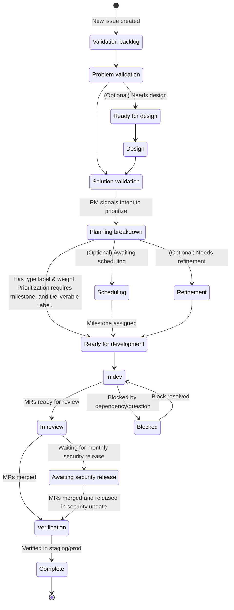

## 概要と哲学

GitLab のプロダクトミッションは、ユーザーが愛し、価値を見出す製品と体験を一貫して生み出すことです。このミッションを果たすには、アイデアを顧客価値を提供するものに変えるための、明確に定義され、再現可能なフローを持つことが重要です。なお、より広い GitLab コミュニティからのオープンソースのコントリビューションを、プロセスのどの時点でも許可することも重要です。これらは必ずしもこのプロセスに従うわけではありません。

このページは、私たちがクロスファンクショナルな開発チームにどのように働いてほしいと期待しているかについての進化し続ける記述であり、現在活用されているワークフローを反映しています。このページのすべての必須アクションまたは成果は、以下のように示されます。

> <i class="fab fa-gitlab fa-fw" style="color:rgb(252,109,38); font-size:1.25em" aria-hidden="true"></i> プロダクト開発フローの必須の側面を示します。

機能開発は、指定された成果を達成するためにすべてのフェーズを通過することが期待されますが、残りのワークフローはベストプラクティス、ツール、推奨事項のセットとみなすべきです。特定のプロダクト改善がすべてのフェーズを通過する必要がないユニークなケースがあることを認識しています。私たちは、プロダクトマネージャーがデザインおよびエンジニアリングチームとの足並みを揃えながら、最善の判断を使うことを信頼しています。このページの目標は、各フェーズで目指すべき必要な **成果** を明らかにするとともに、チームがこれらの成果を達成するために採用できる戦略/戦術、**活動** を共有することで、チームのワークフローを支援することです。さらに、このページは、トラッキング、検索、クロスファンクショナルなコラボレーションの面でプロダクトシステムを効率的に保つために、すべてのフェーズで必要となる、ラベルなどの *最小限の* 必須アクションのセットを明確にすることを目指しています。明確さを保ち混乱を避けるため、このページにはオプションのアクションは記載していませんが、このページで言及されていなくても、チームは計画用のラベルなどの追加のアクションを採用することを選んでもかまいません。

チームがプロダクト開発フローを活用する中で、特定の戦略/戦術が成功に向けてチームに役立っていることに気づくかもしれません。そのため、顧客にとって価値ある機能を構築するための選択肢の堅牢なプレイブックを作成できるよう、このページへの MR を歓迎します。すべてのチームメンバーは、ベストプラクティスを共有するために、このページの[変更プロセス](#contributing-to-this-page)に従うことが推奨されます。

## でも待って、これってウォーターフォールじゃないの？

いいえ。このページで説明されているフェーズは独立していて直線的に見えますが、そうではありません。簡潔さとナビゲーションのしやすさのためにこのように示されています。GitLab では、直線的に作業することを推奨していません。プロダクト開発ライフサイクルのフェーズは重なり合ったり、並行して発生したりすることがあります。

私たちは、後続のフェーズのリスクを減らすために、各フェーズで重要な成果を達成することを目指しています。しかし、プロダクト開発フローは、フェーズを通過する順序や、各フェーズに費やす時間を指示するものではありません。チームが自分たちの方向性に高い自信を持っているときは、確信の向上に寄与しないフェーズをスキップしたり短縮したりする力を持っていると感じるべきです。

例:

- エンジニアリングチームが技術レビューを実施する一方で、他のチームメンバーが Validation フェーズの活動を行います。チームはその後、自分たちの改善が顧客にとって良いものであり、技術的に実現可能であるという高い確信を持って、Build フェーズに迅速に移行できます。

- GitLab の顧客からバグが報告されます。プロダクトマネージャーがバグをテストし、その存在を確認します（Problem Validation）。チームはソリューションに非常に自信があるため、Design と Solution Validation は不要です。バグは即座に Build に移されます。

## ワークフローの概要

このページを通じて、[DRI](/handbook/people-group/directly-responsible-individuals/) が言及されるとき、参照される人物はフェーズによって異なる場合があり、また複数いる場合もあります。
DRI が誰であるかについては、[Product Development Roles and Responsibilities ページ](../roles-and-responsibilities/)を参照してください。

<object data="/images/product-development/product-development-flow/PDF-Diagram.svg" style="width: 100%;" type="image/svg+xml">
  Product Development Flow diagram.
  Unable to load this content, check console for details.
</object>

> <i class="fab fa-gitlab fa-fw" style="color:rgb(252,109,38); font-size:1.25em" aria-hidden="true"></i> 私たちは、Issue の状態を効率的に伝えるために Issue ステータスを使用します。これらのステータスを使用することで、チームを横断したコラボレーションが可能になり、Issue の現在の状態が伝わります。

以下の図は、新しい Issue が各ステータスをどのように移動するかを示していますが、適切な場合には状態をスキップできます。このドキュメントの残りの部分では、各ワークフローステップを詳細に説明します。

### 唯一の信頼できる情報源 (SSOT) としての Issue の説明

> <i class="fab fa-gitlab fa-fw" style="color:rgb(252,109,38); font-size:1.25em" aria-hidden="true"></i> Issue の説明は、常に唯一の信頼できる情報源として維持されなければなりません。

コントリビューターが現在の状態を理解するために Issue 内のすべてのコメントを読む必要があるのは、[効率的](/handbook/values/#efficiency)ではありません。

- Issue の説明の正確性は、各フェーズを通じて DRI によって維持されるべきです。しかし、すべてのコラボレーターは、不一致や必要な更新を見つけたときに、コントリビュートでき、すべきです。

## ワークフローラベルからステータスへの移行

GitLab は、プロダクト開発フローの進捗を追跡するために、スコープ付きワークフローラベル（`workflow::*`）の使用から Issue ステータスの使用へと移行しました。以下のマッピングは、各旧ワークフローラベルに相当するステータスを示しています。

| 旧ワークフローラベル | 現在のステータス |
|----------------------|----------------|
| `workflow::validation backlog` | `Validation backlog` |
| `workflow::problem validation` | `Problem validation` |
| `workflow::ready for design` | `Ready for design` |
| `workflow::design` | `Design` |
| `workflow::solution validation` | `Solution validation` |
| `workflow::planning breakdown` | `Planning breakdown` |
| `workflow::scheduling` | *削除済み* |
| `workflow::refinement` | `Refinement` |
| `workflow::ready for development` | `Ready for development` |
| `workflow::in dev` | `In dev` |
| `workflow::in review` | `In review` |
| `workflow::blocked` | `Blocked` |
| `workflow::verification` | `Verification` |
| `workflow::awaiting security release` | `Awaiting security release` |
| `workflow::complete` | `Complete` |
| *なし* | `Duplicate` |
| *なし* | `Won't do` |

ステータスは、バリューストリームを通じた Issue の進捗を追跡する、よりクリーンで統合された方法を提供します。

チームは、対応するワークフローラベルの代わりにステータスを使用するようにワークフローを更新すべきです。ワークフローラベルは 2026-02-27 以降サポートされなくなります。[フィードバック Issue](https://gitlab.com/gitlab-com/Product/-/work_items/14487) でヒントを共有し、フィードバックを残してください。

### 優先順位付け

何を、どのように優先順位付けするかに関するガイダンスは、以下で扱われています。

1. [R&D Interlock](/handbook/product-development/how-we-work/r-and-d-interlock/)
1. [Cross-functional Prioritization](/handbook/product/product-processes/cross-functional-prioritization/)
1. [Customer Issues Prioritization](/handbook/product/product-processes/customer-issues-prioritization-framework/)

## Validation トラック

[顧客の問題がよく理解されていない場合](/handbook/upstream-studios/experience-research/when-to-conduct-ux-research/#design-the-right-thingproblem-validation)のために、プロダクトマネージャー (PM) と User Experience Department (UXer) は、Build トラックに移行する前に、協力して新しい機会を検証すべきです。**Validation** トラックは、常に動き続ける **Build** トラックから独立したトラックです。PM と UXer は、Build トラックが常に十分に検証されたプロダクトの機会を着手できる状態にしておけるよう、協力して少なくとも 2 か月先行すべきです。マイルストーンの作業は、一部のマイルストーンが他のものよりも多くの検証努力を含むかもしれないという理解のもとで[優先順位付け](/handbook/product/product-processes/)すべきです。バグ修正、よく理解されたイテレーティブな改善、小さなデザイン修正、技術的負債のようなものには、Validation サイクルは不要かもしれません。

### Validation スペクトラム

Validation トラックで必要となる活動のタイプと調査の深さは、私たちが顧客の問題とソリューションをどれだけよく理解しているかによって異なります。

### Validation の目標と成果

**いつ:** 提案された問題またはソリューションに対する私たちの確信が高くないとき。例えば、問題がかなりの数のユーザーにとって重要であること、またはソリューションが理解しやすく使いやすいことを合理的に確信できていない場合。

**誰が:** Product Manager、Product Designer、UX Researcher、Product Design Manager、Engineering Manager

**何を:**

✅ 私たちが解決しようとしているユーザーの問題を **理解する**。

✅ ビジネス目標と、成功を判断するための主要指標を **特定する**。

✅ 仮説を **生成し**、調査/実験/ユーザーテストを行う。

✅ MVC と潜在的な将来のイテレーションを **定義する**。

✅ 定性的・定量的分析によって、価値、使いやすさ、実現可能性、ビジネスの実行可能性に対するリスクを **最小化する**。

**成果:** 提案されたソリューションが 1 つ以上の [Product KPI](/handbook/company/kpis/#product-kpis) にポジティブな影響を与えるという確信があります。例外には理由があり得るので、その場合チームは明確にし、私たちの KPI にマッピングし直さなくても依然として重要であることを正当化できる必要があります。

MVC や成功がどのようなものかに確信が持てない場合は、Build トラックに移行する前に Validation サイクルを続けるべきです。

### Validation フェーズ 1: Validation backlog

<i class="fab fa-gitlab fa-fw" style="color:rgb(252,109,38); font-size:1.25em" aria-hidden="true"></i> ステータス: `Validation backlog`

#### 説明

ワールドクラスの製品の成長は、よく維持されたバックログから構築されます。プロダクトマネージャーは、検証の機会がカテゴリの方向性、ステージ、および/またはセクションレベルの戦略に沿ってスコープ設定され[優先順位付け](/handbook/product/product-processes/#prioritization)されるよう、グループのバックログを洗練する責任があります。バックログは、[ステークホルダー](/handbook/product/product-processes/#what-is-a-stakeholder)があなたのグループを理解し関与するための唯一の信頼できる情報源でもあります。バックログ内の Issue の位置は、それらの Issue の説明、ディスカッション、メタデータとともに、ステークホルダーを最新の状態に保つために必要な重要なデータの一部です。

#### 成果と活動

| 成果 | 活動 |
|----------|------------|
| <i aria-hidden="true" style="color:rgb(252,109,38); font-size:1.25em" class="fab fa-gitlab fa-fw"></i>**最新の Issue とエピック**: GitLab では、Issue は製品へのあらゆる変更の唯一の信頼できる情報源です。これらを最新に保つことで、すべてのチームメンバーが計画された作業を理解できるようになり、効率と透明性が高まります。 | - [センシングメカニズム](/handbook/product/product-processes/sensing-mechanisms/)に応じて Issue を作成する。新機能には *Problem Validation* Issue テンプレートの使用を検討する。 - Issue のディスカッションをレビューし、関連情報を説明に更新する。 - メタデータ（ラベルなど）を最新に保つ。 - ステークホルダーのコメントに積極的に応答する。 - ディスカッションのノートや外部情報を Issue に転記する（リンクまたはディスカッション/説明の詳細として）。 |
| <i class="fab fa-gitlab fa-fw" style="color:rgb(252,109,38); font-size:1.25em" aria-hidden="true"></i>[**優先順位付けされたバックログ**](/handbook/product-development/programs/backlog/): Issue とエピックのバックログは、ステークホルダーがグループの「次に来るもの」を知るために使用する主要なシグナルです。バックログは、機能がプロダクト開発フローのフェーズを進むにつれて、グループが作業するためのキューでもあります。このキューは、Issue ボード上のマイルストーンとランク順序付けで最新に保たれます。 | - Issue の優先順位付け（Issue ボードの順序付けやマイルストーンの割り当てなど）を定期的にレビューする。 - 優先順位付けされたバックログを、カテゴリの方向性と成熟度に揃える。 - 優先順位付けのトレードオフを行うのに役立てるため、[RICE フォーミュラ](https://www.productplan.com/glossary/rice-scoring-model/)の使用を検討する。 - [バグとメンテナンス作業には別の DRI がいる](/handbook/product/product-processes/)ため、安定したカウンターパートから優先度のフィードバックを集めるための[優先順位付けセッション](/handbook/product/product-processes/#prioritization-sessions)の開催を検討する。 |

### Validation フェーズ 2: Problem validation

<i class="fab fa-gitlab fa-fw" style="color:rgb(252,109,38); font-size:1.25em" aria-hidden="true"></i> ステータス: `Problem validation`

#### 説明

正しいソリューションが提供されるよう、チームは[検証された問題](/handbook/upstream-studios/experience-research/problem-validation-and-methods)から作業を始めなければなりません。これは[多くの形](/handbook/upstream-studios/experience-research/problem-validation-and-methods/#foundational-research-methods)を取り得ます。

問題が文書化され、よく理解されている場合は、ユーザーの問題に関する既知のデータを文書化することで、このフェーズをすばやく通過できるかもしれません。文書化された問題は、ユーザーからの直接のフィードバックによる既存の体験、または複数のユーザーが問題を経験していることを確認するユーザーエンゲージメントを持つ Issue として分類できます。よく理解された問題とは、顧客インタビューからの一連の文書化された定性調査があるもの、問題を確認する[さまざまなセンシングメカニズム](/handbook/product/product-processes/sensing-mechanisms/)を三角測量するもの、または既知のデータを使用するものです。既知のデータの例には、[Customer Request Issues](https://10az.online.tableau.com/#/site/gitlab/workbooks/2015827/views) や、過去の調査からの既存の [`Actionable Insights`](/handbook/upstream-studios/experience-research/research-insights/#how-to-document-actionable-insights) が含まれます。問題がよく理解されていることを文書化するには、既知のデータと顧客コールを関連する Issue やエピックにリンクしてください。

問題が微妙であるか、まだよく理解されていない場合は、ユーザーと適切に検証するのにより長い時間がかかる可能性が高いです。このフェーズの主要な成果は、問題の明確な理解と、さまざまなステークホルダーに問題を伝えるためのシンプルで明確な方法です。オプションですが、個人が問題をよりよく理解し、さまざまなステークホルダーに伝えるのに役立つツールとして、[Opportunity Canvas](/handbook/product/product-processes/#opportunity-canvas) の使用を推奨します。Opportunity Canvas は、新しいリソースの要求を含む新しいカテゴリの作成を推奨するためにも使用できます。

#### 成果と活動

| 成果 | 活動 |
|----------|------------|
| <i class="fab fa-gitlab fa-fw" style="color:rgb(252,109,38); font-size:1.25em" aria-hidden="true"></i> **問題の徹底的な理解**: チームは、問題、それが誰に影響するか、いつ、なぜ影響するか、そして問題を解決することがビジネスニーズとプロダクト戦略にどのようにマッピングされるかを理解しています。 | - GitLab プロジェクトで [Problem Validation Template](https://gitlab.com/gitlab-org/gitlab/-/blob/master/.gitlab/issue_templates/Problem%20Validation.md) を使って Issue を作成する。 - [Opportunity Canvas](/handbook/product/product-processes/#opportunity-canvas) を完成させる。 - フィードバックのために opportunity canvas のレビューをスケジュールする。 - UX Research プロジェクトで [Problem Validation Research Template](https://gitlab.com/gitlab-org/ux-research/-/blob/master/.gitlab/issue_templates/Problem%20validation.md) を使って Issue を作成し、UX Researcher と協力して調査研究を実行する。 - [提案された方法](/handbook/upstream-studios/experience-research/problem-validation-and-methods/)のいずれかを使ってユーザーと問題を検証し、[Dovetail に発見を文書化する](/handbook/product/ux/dovetail/)。 |
| <i class="fab fa-gitlab fa-fw" style="color:rgb(252,109,38); font-size:1.25em" aria-hidden="true"></i> **Issue/エピックの説明を更新する**: よく理解され明確に表現された顧客の問題が Issue に追加され、成功し効率的なデザインと開発のフェーズにつながります。 | - Issue が問題の最新の理解で最新になっていることを確認する。 - [Jobs to be Done (JTBD)](/handbook/product/ux/jobs-to-be-done/) フレームワークを使って、人々が達成したい目標を理解し（Issue に）文書化する。 - ユーザーが直面する問題について最新でいられるよう、定期的なケイデンスで顧客との[継続的なインタビュー](/handbook/product/product-processes/continuous-interviewing/)を実施する。 - [opportunity canvas](/handbook/product/product-processes/#opportunity-canvas) を活用して、安定したカウンターパートやグループのステークホルダーに問題を伝える。フィードバックを集めて Product と UX のリーダーシップに発見を伝えるために、レビューのスケジュールを検討する。 - Product Designer がソリューションをアイデア出しするのに十分なほど問題を理解していることを確認する。 |
| Dogfooding プロセスを開始する: 問題を検証する際、より広いコミュニティに加えて、[社内顧客](/handbook/product/product-processes/#engage-with-internal-customers)からフィードバックを集めることが重要です。プロダクト開発フローの早い段階で社内顧客のフィードバックを捉えることは、機能が成熟するにつれて彼らのニーズが考慮されることを確実にするのに役立ち、主要な [Dogfooding](/handbook/product/product-processes/dogfooding-for-r-d/) の成果を加速させます。機能の社内利用を一貫して推進することは、[より大きな顧客採用につながります](https://about.gitlab.com/blog/2020/04/16/geo-is-available-on-staging-for-gitlab-com/)。 | - Validation フェーズ中に [Dogfooding Issue](/handbook/product/product-processes/dogfooding-for-r-d/) を開き、機能の初期および/または将来のイテレーションに情報を提供するのに役立つ社内顧客のフィードバックを捉える。 |

### Validation フェーズ 3: Ready for Design

<i class="fab fa-gitlab fa-fw" style="color:rgb(252,109,38); font-size:1.25em" aria-hidden="true"></i> ステータス: `Ready for design`

#### 説明

Problem validation を完了した後、デザイン作業が必要な Issue は「Ready for Design」状態に移すべきです。この状態はデザインチームのキューとして機能し、問題が適切に検証され文書化された後にのみデザイン作業が始まることを確実にします。このフェーズは、プロダクトマネジメントとデザインチームの間のハンドオフを調整するのに役立ち、デザイナーがソリューションのアイデア出しを始める前に、必要なすべての文脈と検証された問題ステートメントを持てるようにします。

Ready for Design フェーズを開始するには、Issue ステータスを `Ready for design` に設定します。

#### 成果と活動

| 成果 | 活動 |
|----------|------------|
|<i class="fab fa-gitlab fa-fw" style="color:rgb(252,109,38); font-size:1.25em" aria-hidden="true"></i> **デザインの準備が整った明確な問題ステートメント**: Issue には、デザイン作業を始めるのに十分な文脈を提供する、よく文書化され検証された問題ステートメントが含まれています。 | - Issue の説明に Problem Validation フェーズからの明確な問題ステートメントが含まれていることを確認する。 - ユーザー調査の発見とインサイトが文書化され、アクセス可能であることを検証する。 - 関連するユーザーペルソナ、jobs-to-be-done、またはユーザージャーニーの情報が利用可能であることを確認する。 - ビジネス目標と成功指標が明確に定義されていることをレビューする。 |
|<i class="fab fa-gitlab fa-fw" style="color:rgb(252,109,38); font-size:1.25em" aria-hidden="true"></i> **デザインチームの認識とキャパシティ**: デザインチームは今後の作業を認識しており、デザインフェーズを始めるキャパシティがあります。 | - 割り当てられた Product Designer に今後のデザイン作業について伝える。 - デザイナーが問題の文脈を理解し、関連するすべての調査にアクセスできることを確認する。 - デザインチームのキャパシティと、デザイン作業の予想されるタイムラインを確認する。 - 必要なハンドオフミーティングやデザインキックオフをスケジュールする。 |
|<i class="fab fa-gitlab fa-fw" style="color:rgb(252,109,38); font-size:1.25em" aria-hidden="true"></i> **技術的制約を文書化する**: デザインの決定に影響する可能性のある既知の技術的制約や考慮事項が文書化され、伝達されています。 | - デザインの決定に情報を提供すべき技術的制限や制約を文書化する。 - 該当する場合、実現可能性に関するエンジニアリングチームのインプットが捉えられていることを確認する。 - デザインアプローチに影響する可能性のあるプラットフォーム固有の考慮事項（Web、モバイル、API など）を記録する。 |

### Validation フェーズ 4: Design

<i class="fab fa-gitlab fa-fw" style="color:rgb(252,109,38); font-size:1.25em" aria-hidden="true"></i> ステータス: `Design`

#### 説明

問題を理解し検証した後、私たちは[ダイバージ/コンバージ](https://web.archive.org/web/20210119060603/https://web.stanford.edu/~rldavis/educ236/readings/doet/text/ch06_excerpt.html)プロセスを通じて、潜在的なソリューションのアイデア出しを開始または継続できます。ただし、Problem validation フェーズの成果が既存のソリューションへの漸進的な修正を自信を持って示唆する場合は、前述のダイバージ/コンバージプロセスをスキップできます。

このフェーズでは、潜在的なソリューションのアイデア出しを行い、単一のソリューションに収束する（コンバージ）前に、さまざまなアプローチを探る（ダイバージ）ことが含まれます。ソリューションは、顧客とビジネスの目標を満たすか、技術的に実現可能か、法的コンプライアンスの考慮事項に沿っているかを判断することで評価されます。チームは、潜在的な欠陥、見逃されたユースケース、潜在的なセキュリティリスク、そしてソリューションが意図した顧客への影響を持つかどうかを判断するために、ステークホルダーと関わることが推奨されます。

DRI は、[Legal Risk Checklist](https://internal.gitlab.com/handbook/legal-and-corporate-affairs/legal-and-compliance/legal-risk-checklist/)（チームメンバーのみアクセス可能）をレビューし、完了する必要があるセクションがあるかどうかを判断する責任があります。チームが提案されたソリューションに収束するか、検証するための少数のオプションを特定した後、Issue は Solution Validation フェーズに移ります。

Design フェーズを開始するには、Issue ステータスを `Design` に設定します。

#### 成果と活動

| 成果 | 活動 |
|----------|------------|
|<i class="fab fa-gitlab fa-fw" style="color:rgb(252,109,38); font-size:1.25em" aria-hidden="true"></i> **提案されたソリューションが特定され文書化される**: DRI はチームと協力してソリューションを探り、ユーザーエクスペリエンス、顧客価値、ビジネス価値、開発コストの最良のバランスを取るアプローチを特定します。 | **ダイバージ**: チームとして複数の異なるアプローチを探る。活動の例: - [Think Big](/handbook/product/ux/thinkbig/) セッション。 社内インタビュー（必ず [Dovetail に発見を文書化する](/handbook/product/ux/dovetail/)）。  - [ユーザーフロー](https://careerfoundry.com/en/blog/ux-design/what-are-user-flows/)の作成。    **コンバージ**: 検証するための少数のオプションを特定する。活動の例:  - チームとの [Think Small](/handbook/product/ux/thinkbig/#think-small) セッション。  - チームとのデザインレビュー  - 低忠実度のデザインアイデア。  - 提案されたソリューションで Issue/エピックの説明を更新する。Figma デザインファイルのリンクを追加するか、デザインを [GitLab の Design Management](https://docs.gitlab.com/ee/user/project/issues/design_management.html) に添付して、ソリューションのアイデアを伝える。  - ステークホルダーの助けを借りてアプローチを検証する。[提案された方法](/handbook/upstream-studios/experience-research/solution-validation-and-methods/)のいずれかを使ってユーザー検証を実行し、[Dovetail](/handbook/product/ux/dovetail/) と適切な GitLab Issue に発見を文書化する。  - 競合や隣接する提供物からインスピレーションを得る。 |
|<i class="fab fa-gitlab fa-fw" style="color:rgb(252,109,38); font-size:1.25em" aria-hidden="true"></i> **提案されたソリューションに関するチーム内の共通理解**: DRI は、提案されたソリューションのレビューを通じて、より広いチームを導きます。 | - 全員が貢献し、質問し、懸念を表明し、代替案を提案する機会を持てるよう、チームとして提案されたソリューションをレビューする。 - リーダーシップと提案されたソリューションをレビューする。 |
|<i class="fab fa-gitlab fa-fw" style="color:rgb(252,109,38); font-size:1.25em" aria-hidden="true"></i> **技術的実現可能性への確信**: Build フェーズを始めたときに手戻りや大幅な変更を避けるため、Engineering がソリューションの技術的実現可能性を理解していることが重要です。 | - 提案されているものが望ましい時間枠内で可能であることを確認するため、Engineering と技術的な意味合いについて話し合う。デザイン作業を共有する際は、Figma のコラボレーションツールと GitLab のデザイン管理機能の両方を使う。 - Slack メッセージ、Issue での ping、または提案を話し合うためのセッションのスケジュールを通じて、エンジニアリングの仲間を早期かつ頻繁に巻き込む。 - ソリューションが大きく複雑な場合は、リスクを軽減し最適なイテレーションパスを発見するために、[スパイク](/handbook/product/product-processes/#spikes)のスケジュールを検討する。 |
|<i class="fab fa-gitlab fa-fw" style="color:rgb(252,109,38); font-size:1.25em" aria-hidden="true"></i> **更新された Issue/エピックの説明**: DRI は Issue とエピックが最新であることを確認します。 | - 効率的かつ非同期に作業を続けられるよう、Issue とエピックが最新であることを確認する。 - [実験の定義](/handbook/engineering/development/growth/#experimentation)。 |
|Dogfooding プロセスを続ける | - 自分の機能に該当する場合、DRI は[機能を GitLab 内で構築するか、製品の外に置くか](/handbook/product/product-processes/dogfooding-for-r-d/)を決定することで Dogfooding プロセスを続ける。 |

### Validation フェーズ 5: Solution Validation

<i class="fab fa-gitlab fa-fw" style="color:rgb(252,109,38); font-size:1.25em" aria-hidden="true"></i> ステータス: `Solution validation`

#### 説明

ビジネス要件を満たし技術的に実現可能な 1 つ以上の潜在的なソリューションを特定した後、DRI は、提案されたソリューションがユーザーのニーズと期待を満たすという確信を私たちが持っていることを確実にしなければなりません。この確信は、Design フェーズ中に行われた作業から得られ、追加の調査（ユーザーインタビュー、ユーザビリティテスト、または solution validation を含む）で補完できます。必要に応じて、このフェーズでは [GitLab UX Research プロジェクト](https://gitlab.com/gitlab-org/ux-research)内に Solution Validation Issue を立ち上げ、チームが提案されたソリューションを検証するための調査をガイドします。

さらに、機能のあらゆる[非機能要件](/handbook/product/product-processes/#foundational-requirements)を考慮し文書化する必要があります。これには、[アプリケーション制限](/handbook/product/product-processes/#introducing-application-limits)を導入する必要があるかどうかの評価や、[データストレージに関する考慮事項](/handbook/product/product-processes/#considerations-around-data-storage)の評価などが含まれます。これらの非機能要件を前もって定義することで、機能のスケーラビリティと長期的な成功を考慮していることが確実になります。この段階で、機能の長期ビジョンに沿った妥当なデフォルト値を特定すべきです。

Solution Validation フェーズを開始するには、Issue ステータスを `Solution Validation` に設定します。

#### 成果と活動

| 成果 | 活動 |
|----------|------------|
|<i class="fab fa-gitlab fa-fw" style="color:rgb(252,109,38); font-size:1.25em" aria-hidden="true"></i> **提案されたソリューションへの高い確信**: 問題ステートメント内で概説された jobs to be done が、提案されたソリューションによって満たされ得るという確信。 | - 関連するステークホルダーからフィードバックを集める。 - フィードバックを集めるために [solution validation のガイダンス](/handbook/upstream-studios/experience-research/solution-validation-and-methods/)に従う。 |
|<i class="fab fa-gitlab fa-fw" style="color:rgb(252,109,38); font-size:1.25em" aria-hidden="true"></i> **文書化された Solution validation の学び**: solution validation の結果がチームメンバーに伝えられ、理解されています。 | - solution validation の発見を [Dovetail のインサイト](/handbook/product/ux/dovetail/)として文書化する。 - 関連するインサイトで [opportunity canvas](/handbook/product/product-processes/#opportunity-canvas)（使用している場合）を更新する。 - Issue またはエピックの説明を更新して、発見を含めるかリンクする。 |

## Build トラック

Build トラックは、[MVC](/handbook/product/product-principles/#the-minimal-valuable-change-mvc) を構築し、欠陥を修正し、セキュリティ脆弱性にパッチを当て、ユーザーエクスペリエンスを向上させ、パフォーマンスを改善することで、ユーザーに価値を計画、開発、提供する場所です。このトラックは、[私たちがユーザーのために正しいものを作っているかどうかについてのインサイトを得る](/handbook/upstream-studios/experience-research/when-to-conduct-ux-research/#design-things-rightsolution-validation)時間でもあります。チームは MVC を実装するために緊密に協力します。課題が生じた場合、決定はすばやく下されます。私たちは[利用状況](https://internal.gitlab.com/handbook/company/performance-indicators/product/#instrument-tracking)をインストルメントし、[プロダクトパフォーマンス](https://internal.gitlab.com/handbook/company/performance-indicators/product/)を追跡するので、MVC が顧客に提供された後、[次のイテレーションを洗練する](/handbook/product/product-processes/#iteration-strategies)ための学びのためにフィードバックがすばやく捉えられます。GitLab のさまざまな機能を活用して、Build トラックを流れる焦点を絞った協働的なボードを作成する方法の例については、[このビデオをチェックしてください](https://youtu.be/rZW0ou4u-dw)。

### Build の目標と成果

**いつ:** [プロダクト開発タイムライン](/handbook/engineering/workflow/#product-development-timeline)に従って MVC を構築するとき

**誰が:** Product Manager、Product Designer、Development チーム

**何を:**

✅ 適切に応じて、顧客のサブセットまたは全セットに **リリースする**。

✅ UX、機能、技術的パフォーマンス、顧客への影響を **評価する**。

✅ 次のイテレーションに情報を提供するため、成功指標に対して MVC を測定するデータを **収集する**。

✅ 成功指標が達成され、プロダクト体験が最適になるまで **イテレートする**。

**成果:** 私たちの [Product KPI](https://internal.gitlab.com/handbook/company/performance-indicators/product/) および/または [Engineering KPI](/handbook/company/kpis/#engineering-kpis) の 1 つ以上を改善する、パフォーマンスの高い MVC を提供します。そうできない場合は、私たちの Efficiency バリュー（低レベルの恥を含む）を尊重し、それを放棄し、正しいソリューションを特定するために Validation サイクルを再開します。

### Build フェーズ 1: Plan

#### 必須ステータス

| ステータス | 使い方 |
|--------|-------|
|<i class="fab fa-gitlab fa-fw" style="color:rgb(252,109,38); font-size:1.25em" aria-hidden="true"></i> `Planning breakdown` | DRI が[毎月 4 日](/handbook/engineering/workflow/#product-development-timeline)以前に設定し、次のマイルストーンで Issue を優先する意図を示します。 |
|<i class="fab fa-gitlab fa-fw" style="color:rgb(252,109,38); font-size:1.25em" aria-hidden="true"></i> `Ready for development` | Issue が分割され、開発のために優先順位付けされています。この時点で、Issue には[ワークタイプ分類](/handbook/product/groups/product-analysis/engineering/metrics/#work-type-classification)（`type::`）ラベルとマイルストーンも割り当てられています。 |

#### 必須ラベル

| ラベル | 使い方 |
|--------|-------|
|<i class="fab fa-gitlab fa-fw" style="color:rgb(252,109,38); font-size:1.25em" aria-hidden="true"></i> `Deliverable` | 現在のマイルストーンに受け入れられたことを示すために、DRI が Issue に適用します。 |

#### 説明

このフェーズは、エンジニアリングが構築できるよう機能を準備します。機能ではないバグ、技術的負債、その他同様の変更は、このフェーズでプロセスに入ることがあります（または、作業を行うコストが完全な問題の検証を必要とし、作業を行うことが理にかなっているかを確認するために、より早いフェーズで入ることで恩恵を受ける場合があります）。Validation フェーズ 4 に続いて、機能はすでにユーザーの成果を改善するための可能な限り迅速な変更に分割され、エンジニアリングによるより詳細なレビューの準備が整っているべきです。このフェーズ中、DRI はステータスを `Planning breakdown` に設定することで、マイルストーンで優先する意図のある Issue を浮上させます。この時点で、適切な DRI がエンジニアを割り当て、その作業をさらに分割してウェイトを適用します。トレードオフの決定が下され、機能の Issue は検証ソリューションから、単一のマイルストーンで提供できる明確な MVC へと進化します。すべての決定を必ず Issue に文書化してください。

このフェーズ中、DRI は [Legal Risk Checklist](https://internal.gitlab.com/handbook/legal-and-corporate-affairs/legal-and-compliance/legal-risk-checklist/)（チームメンバーのみアクセス可能）を再訪し、Validation フェーズ 3: Design 中の以前の判断のいずれも改訂が必要ないことを確認しなければなりません。

Build トラックの初めに作業をレビューしウェイトを付けることで、DRI はより良い優先順位付けのトレードオフを行うことができ、エンジニアリングチームはマイルストーンに対して適切な量の作業をスコープ設定したことを確実にできます。Issue が `Planning breakdown` 状態に入っても、必ずしも次のマイルストーンで優先順位付けされることを意味するわけではありません。DRI はキャパシティと緊急性に応じてトレードオフの決定を下すかもしれません。

作業が `Planning breakdown` ステップを通過すると、`Ready for development` ステータス、`type::` ラベル、そして今後のマイルストーンが Issue に適用されます。Issue が分割されているが、まだマイルストーンに引き込む準備ができていない場合は、オプションでステータスを `Scheduling` に設定できます。ただし、この状態では、マイルストーンなしで `Ready for development` ステータスを持つ Issue は、暗黙のうちに「スケジュール待ち」のステータスを持ちます。DRI は、マイルストーンを持ち `Ready for development` に設定された Issue に `Deliverable` ラベルを適用し、そのマイルストーンへの Issue の受け入れを示します。このプロセスは[マイルストーン計画の初め](/handbook/engineering/workflow/#product-development-timeline)に発生します。

このフェーズ中、Application Security Engineer に計画スケジュールへの可視性を持たせるため、彼らに情報を提供し続けることが重要です。これにより、動的テストの計画のための十分な時間が彼らに与えられ、時間/リソースの要件についてプロダクトマネージャーと開発チームに情報を提供し続けることができます。

#### 成果と活動

| 成果  | 活動                                                                                                                                                                                                                                                                                                                                                                                                                                                                                                                                                                                                                                                                                                                                              |
|-         |---------------------------------------------------------------------------------------------------------------------------------------------------------------------------------------------------------------------------------------------------------------------------------------------------------------------------------------------------------------------------------------------------------------------------------------------------------------------------------------------------------------------------------------------------------------------------------------------------------------------------------------------------------------------------------------------------------------------------------------------------------|
|<i class="fab fa-gitlab fa-fw" style="color:rgb(252,109,38); font-size:1.25em" aria-hidden="true"></i> **よくスコープ設定された MVC Issue** - Issue はすべての機能開発の [SSOT](/handbook/values/#single-source-of-truth) です。 | - Issue を単一のマイルストーン内で提供できるものに洗練する - 優先順位を下げた作業を追跡するためにフォローオン Issue を開く - 既存の Issue をエピックに昇格させ、今後のマイルストーンの実装 Issue を開く - コントリビューターと機能の Issue をレビューする - POC やエンジニアリング調査の Issue のスケジュールを検討する - [適切なサイズの MVC](/handbook/product/product-principles/#the-minimal-valuable-change-mvc) に到達するためにスコープのトレードオフを行う - コミュニケーションが明確であることを確認し、ソリューションを実行するための[正しいイテレーション計画](/handbook/product/product-processes/#iteration-strategies)を提案したことを確認するために、Issue レビューをリクエストする。 |
|<i class="fab fa-gitlab fa-fw" style="color:rgb(252,109,38); font-size:1.25em" aria-hidden="true"></i> **優先順位付けされたマイルストーン** - チームは、次のマイルストーン中にどの Issue を提供すべきかを理解すべきです  | - DRI が `Ready for development` ステータス、`type::` ラベル、マイルストーンを設定し、優先する意図を示す  - DRI が `Deliverable` ラベルを適用し、次のマイルストーンへの Issue の受け入れを示す - DRI が計画 Issue を作成する                                                                                                                                                                                                                                                                                                                                                                                                                                                             |
|<i class="fab fa-gitlab fa-fw" style="color:rgb(252,109,38); font-size:1.25em" aria-hidden="true"></i> **定義された計画** - DRI は、エンジニアリングが本格的に始まる前に、自分自身のキャパシティを理解し効果的に計画できることを確実にします。| 協調的な計画                                                                                                                                                                                                                                                                                                                                                                                                                                                                                                                                                                                                                        |
|**実装 Issue の洗練** - 一部のチームは、Issue の洗練を planning breakdown とは別のイテレーティブなタスクとして扱うことが有用だと気づきました。この分離により、最初に提供される元の機能の側面にバックログの洗練を集中させることができます。| - ステータスを `Refinement` にさらに設定することで、`Planning breakdown` ステップで特定された実装 Issue をさらに洗練する。                                                                                                                                                                                                                                                                                                                                                                                                                                                                                                                                                                                                          |

### Build フェーズ 2: Develop & Test

#### 必須ステータス

| ステータス | 使い方 |
|--------|-------|
|<i class="fab fa-gitlab fa-fw" style="color:rgb(252,109,38); font-size:1.25em" aria-hidden="true"></i> `In dev` | Issue の作業（ドキュメントを含む）が始まった後に設定されます。この時点で、通常 MR が Issue にリンクされます。 |
|<i class="fab fa-gitlab fa-fw" style="color:rgb(252,109,38); font-size:1.25em" aria-hidden="true"></i> `In review` | Issue をクローズするために必要なすべての MR がレビュー中であることを示すために設定されます。 |
|<i class="fab fa-gitlab fa-fw" style="color:rgb(252,109,38); font-size:1.25em" aria-hidden="true"></i> `Blocked` | 開発中のいずれかの時点で Issue がブロックされた場合に設定されます。例: 技術的な問題、PM や PD へのオープンな質問、グループをまたぐ依存関係。 |
|<i class="fab fa-gitlab fa-fw" style="color:rgb(252,109,38); font-size:1.25em" aria-hidden="true"></i> `Verification` | Issue 内の MR がマージされた後、このステータスが設定され、Issue を staging または production で検証する必要があることを示します。 |
|<i class="fab fa-gitlab fa-fw" style="color:rgb(252,109,38); font-size:1.25em" aria-hidden="true"></i> `Awaiting security release` | セキュリティ Issue が検証を通過した後に設定され、このステータスは準備ができているが次の[月次セキュリティリリース](https://gitlab.com/gitlab-com/gl-infra/readiness/-/tree/master/library/security-releases-development)を待っていることを示します。|

#### 説明

develop and test フェーズは、ソリューションをローンチする前に、機能を構築し、バグや技術的負債に対処し、ソリューションをテストする場所です。DRI は、バグやメンテナンス作業を含むマイルストーンの[全体的な優先順位付け](/handbook/product/product-processes/)に直接責任を持ちます。ただし、Engineering チームは[エンジニアリングワークフロー](/handbook/engineering/workflow/#basics)を使った実装に責任を持ちます。Engineering は[完了の定義](https://docs.gitlab.com/ee/development/contributing/merge_request_workflow.html#definition-of-done)を所有し、それらの要件が満たされるまで Issue は次のフェーズに移されません。多くのチームメンバーが単一の Issue にコントリビュートする可能性が高く、コラボレーションが鍵であることを覚えておいてください。

このフェーズは、フェーズ 1 で作業が分割され[優先順位付け](/handbook/product/product-processes/)された後に始まります。作業は、マイルストーンの初めに設定された優先順位順に完了されます。DRI は、機能の構築やバグまたはメンテナンス Issue への対処に責任を持つエンジニアに Issue を割り当てます。エンジニアは、チームのボードの `Ready for development` キューから次の優先順位順の Issue をセルフサービスで取り上げることもできます。そのエンジニアは、[開発プロセス](/handbook/engineering/workflow/#basics)におけるその位置を示すために Issue ステータスを更新します。

Issue が `In review` 状態にあるとき、Application Security Engineer はノンブロッキングの[アプリケーションセキュリティレビュープロセス](/handbook/security/product-security/security-platforms-architecture/application-security/appsec-reviews/)を通じてリスク軽減の検証を支援します。

作業のドキュメントは、エンジニアと Technical Writer によって作成されます（[Documentation with code as a workflow](https://docs.gitlab.com/development/documentation/workflow/#documentation-with-code-as-a-workflow) を参照）。Technical Writer は、開発プロセスの一環としてドキュメントをレビューすべきです。ドキュメントレビュー中に発見された項目は、Issue が次のフェーズに移ることをブロックすべきではありません。これにより、リリース後のドキュメントのフォローオン改善 MR の作成が促されることがあります。

機能コードがマージされた後、Issue は `Verification` ステータスに移すべきです。
Issue が `Verification` 状態にあるとき、担当エンジニアは Staging または Production 環境のいずれかで[機能を手動でテスト](/handbook/engineering/#manual-verification)します。

*注: エンジニアリングによって範囲外または不完全とみなされた作業は、洗練と完了のための再スケジュールのために[plan フェーズ](#build-phase-1-plan)に戻されます。*

#### 成果と活動

| 成果 | 活動 |
|----------|------------|
|<i class="fab fa-gitlab fa-fw" style="color:rgb(252,109,38); font-size:1.25em" aria-hidden="true"></i> **機能が構築される** | - DRI が[完了の定義](https://gitlab.com/gitlab-org/gitlab-foss/-/blob/master/doc/development/contributing/merge_request_workflow.md#definition-of-done)が満たされていることを確認する - ステークホルダーに定期的なステータス更新を提供する - ステータスチェックインや同期スタンドアップを避けるため、非同期の更新を提供する  - エンジニアが割り当てられた Issue を実装するために[エンジニアリングプロセス](/handbook/engineering/workflow/#basics)に従う。 |
|<i class="fab fa-gitlab fa-fw" style="color:rgb(252,109,38); font-size:1.25em" aria-hidden="true"></i> **機能がテストされる** | - エンジニアが実装する機能をテストする（[完了の定義](https://gitlab.com/gitlab-org/gitlab-foss/-/blob/master/doc/development/contributing/merge_request_workflow.md#definition-of-done)を参照）。 - DRI が Issue にテスト要件を設定する。 - DRI が Quad Planning の成果として必要な特定のテストカバレッジの変更をフォローアップする。 - Technical Writer が作成されたドキュメントの[レビュー](/handbook/product/ux/technical-writing/#reviews)を完了する。 - Application Security Engineer がノンブロッキングの[アプリケーションセキュリティレビュープロセス](/handbook/security/product-security/security-platforms-architecture/application-security/appsec-reviews/)を通じてリスク軽減を検証する。 |

### Build フェーズ 3: Launch

Issue ステータス: `Closed`

#### 必須ステータス

| ステータス | 使い方 |
|--------|-------|
|<i class="fab fa-gitlab fa-fw" style="color:rgb(252,109,38); font-size:1.25em" aria-hidden="true"></i> `Complete` | 機能が production にデプロイされ、必要な検証が完了した後に設定されます。 |

#### 説明

変更が production で利用可能になり、必要な検証が完了したとき、Issue は `Complete` ステータスに設定され、ステークホルダーがそれに対する作業が完了したことを知れるようにします。その後、DRI は該当する場合に[リリース投稿](https://docs.gitlab.com/development/documentation/release_notes/)と [dogfooding プロセス](/handbook/product/product-processes/dogfooding-for-r-d/)を調整します。

#### 成果と活動

| 成果 | 活動 |
|----------|------------|
|<i class="fab fa-gitlab fa-fw" style="color:rgb(252,109,38); font-size:1.25em" aria-hidden="true"></i> **機能が GitLab.com ホスト顧客に利用可能になる**: production にデプロイされた後（そしてそのためのフィーチャーフラグが有効化された後）、機能はローンチされ、GitLab.com ホスト顧客に利用可能になります。 | - コードが production にデプロイされる。 - [フィーチャーフラグ](/handbook/product-development/how-we-work/product-development-flow/feature-flag-lifecycle/)が有効化される。 |
|<i class="fab fa-gitlab fa-fw" style="color:rgb(252,109,38); font-size:1.25em" aria-hidden="true"></i> **機能が self-managed 顧客に利用可能になる**: 機能は、self-managed 顧客がインストールできるよう、次のスケジュールされたリリースで利用可能になります。 | - コードが self-managed リリースに含まれる（[カットオフに応じて](/handbook/engineering/releases/monthly-releases/#monthly-release-process)）。 |
|<i class="fab fa-gitlab fa-fw" style="color:rgb(252,109,38); font-size:1.25em" aria-hidden="true"></i> **機能のステークホルダーが、それが production で利用可能であることを知る** | - 機能が production にデプロイされ、production での必要な検証が完了した後、開発チームがステータスを `Complete` に設定する。 - プロダクトマネージャーは、機能が利用可能であることを知らせるために、個々の[ステークホルダー](/handbook/product/product-processes/#what-is-a-stakeholder)にフォローアップする場合があります。 |
|<i class="fab fa-gitlab fa-fw" style="color:rgb(252,109,38); font-size:1.25em" aria-hidden="true"></i> **顧客が主要な変更について知らされる**: 変更に適切な場合、リリース投稿項目がプロダクトマネージャーによって書かれ、マージされます。 | - プロダクトマネージャーが[テンプレート](https://gitlab.com/gitlab-com/www-gitlab-com/-/blob/master/.gitlab/merge_request_templates/Release-Post.md)の指示に従い、それにより [GitLab.com releases page](https://about.gitlab.com/releases/gitlab-com/) に表示され、リリース投稿の一部になります。 |
|Dogfooding プロセスを続ける | - DRI が機能をドッグフーディングしたく、社内利用の準備ができている場合、DRI は[それを社内で促進します](/handbook/product/product-processes/dogfooding-for-r-d/)。 |
| 実験結果とフォローアップ Issue が作成される | 実験については、テストの結果と次のステップを追跡する[フォローアップ Issue](/handbook/engineering/development/growth/experimentation/#experiment-status) を作成します。 |

### Build フェーズ 4: Improve

ラベル: n/a

#### 説明

ローンチ後、DRI はプロダクトの利用状況データに細心の注意を払うべきです。これは、[AMAU](https://internal.gitlab.com/handbook/company/performance-indicators/product/#action-monthly-active-users-amau) がインストルメントされ、期待どおりに報告されていることを確認することから始まります。そこから、機能が [GMAU](https://internal.gitlab.com/handbook/company/performance-indicators/product/#group-monthly-active-users-gmau) と [SMAU](https://internal.gitlab.com/handbook/company/performance-indicators/product/#stage-monthly-active-users-smau) にどのような影響を与えたかを検討します。この時点で、成功指標が達成/超過され、プロダクト体験が十分であるという決定を下せるまで、フォローオンのイテレーティブな改善を導くために顧客フィードバックも求めるべきです。組み合わされた継続的な定量・定性のフィードバックループを作成するため、以下の成果と潜在的な活動を考慮することが推奨されます。

#### 成果と活動

| 成果 | 活動 |
|----------|------------|
|<i class="fab fa-gitlab fa-fw" style="color:rgb(252,109,38); font-size:1.25em" aria-hidden="true"></i> **定性的フィードバックを理解する**: 何かを改善する方法を知るには、ユーザーやチームメンバーから聞いている定性的フィードバックを理解することが重要です。 | - 専用の[フィードバック Issue](/handbook/product/product-principles/#feedback-issues) を作成する（オプション）。 - [dogfooding プロセス](/handbook/product/product-processes/dogfooding-for-r-d/)を続ける。 - [Issue 内のユーザーフィードバック](/handbook/product/product-principles/#feedback-issues)をレビューする。 - 関心のある顧客からフィードバックを集めるために [CSM](/job-description-library/sales/customer-success-management/) や [SAE](/job-description-library/sales/enterprise-account-executive/) にフォローアップする。 - より具体的なフィードバックを集めるために顧客とのフォローアップコールを設定する。 - ユーザビリティのためのサーベイの実施を検討する。 |
|<i class="fab fa-gitlab fa-fw" style="color:rgb(252,109,38); font-size:1.25em" aria-hidden="true"></i> **定量的影響を測定する**: 定性的データは素晴らしいですが、定量的データと組み合わせることで、何が起こっているかの全体像を描くのに役立ちます。[Tableau でダッシュボードを設定し](/handbook/enterprise-data/platform/tableau/)、変更のパフォーマンスとエンゲージメントをレビューします。 | - Tableau の該当するダッシュボードを更新し、必要に応じてより複雑なレポートのためにデータチームと協力する。 - 新機能や改善がコア指標に影響したかを理解するために、[AMAU、GMAU、SMAU のダッシュボード](https://internal.gitlab.com/handbook/company/performance-indicators/product/#key-performance-indicators)をレビューする。 |
|<i class="fab fa-gitlab fa-fw" style="color:rgb(252,109,38); font-size:1.25em" aria-hidden="true"></i> **体験をベンチマークする**: | コアとなる一連のヒューリスティックに基づいて製品内の体験のユーザビリティをスコアリングしベンチマークするために [UX Scorecard](/handbook/product/ux/ux-scorecards/) の実施を検討し、改善の機会を特定したときに新しい Issue を作成します。 |
|<i class="fab fa-gitlab fa-fw" style="color:rgb(252,109,38); font-size:1.25em" aria-hidden="true"></i> **学びに基づいて行動する**: 定性的・定量的な影響を理解した後、新しい Issue を作成したり、既存のオープンな Issue をより多くの情報で更新したりすることで、学びに基づいて行動できます。 | - [フォローオンのイテレーション](/handbook/product/product-processes/#iteration-strategies)と改善のために新しい Issue を開くか、既存のオープンな Issue を修正する。 - フィードバックを Issue または direction ページの更新として捉えたことを確認する。 - 学びをグループとステージで共有する。 - より広いチームと学びを共有することを検討する。 - 更新を検討すべき関連する Go-To-Market モーションがあるかを理解するために、[PMM](/job-description-library/marketing/product-marketing-manager/) と調整する。  - 実験のフォローアップ Issue を結果と具体的な次のステップで更新する。 - 学びに関連する潜在的なプロダクト更新に先立って有用な情報を提供するため、ドキュメントサイトの更新のための Issue や MR を作成する可能性がある。 |

## リリースステージのガイドライン

チームは、最初に experimental、beta、limited availability としてリリースする強い理由がない限り、最初から generally available として機能をリリースすべきです。

プロダクト開発チームは、GitLab のユーザーやプラットフォームに重大なリスクや摩擦を生み出す可能性があると考えられる変更を行うことを控えるべきです。例えば、以下のようなものです。

- ユーザーがアクセスする既存の production データの損傷や流出のリスク。
- アプリケーションの他の部分を不安定にすること。
- 高い Monthly Active User (MAU) 領域に摩擦を導入すること。

### Experiment 機能

ユーザー向けの [experiment の詳細](https://docs.gitlab.com/policy/development_stages_support/#experiment)に加えて、experiment は:

- デフォルトで「スコープ」や機能セットではなく、「成熟度」レベルや品質基準でもありません。
- プロジェクトリードが自分の機能を検証するために使えるツールであり、最も一般的には **問題** を検証するためのものです。
- 必須ではなく、スキップでき、実際、問題がすでに（例えばユーザー調査や他の方法で）検証されている場合はスキップすべきです。
- 壊れているものに関するフィードバックを得る方法として使うべきではありません。
- 機能を早期にリリースするために使うべきではありません。
- すべての experiment が GA になることが期待されているわけではありません。
- experiment は科学的方法に従い、テンプレート化された構造を使うべきです。
- 事前に明確な成功/失敗の基準が定義された、答えを必要とするテスト可能な仮説を持ちます。
  - その仮説をテストできる experiment を設計する。
  - experiment を可能な限り短い期間実行する。
  - experiment の結果を報告する（たとえ数行でも）。
  - experiment が成功したかどうかと次のステップを決定する。
  - 理想的には 1 〜 2 マイルストーンのみ続けるべきです。
- TODO: [DRI が必要] テレメトリ要件をここに追加またはリンクすべきです。
- TODO: [DRI が必要] experiment の UX 要件をここに追加またはリンクすべきです。
- TODO: [DRI が必要] experiment のエンジニアリング要件をここに追加またはリンクすべきです。
- 最小限の摩擦でオプトインする方法を提供します。
- オプトインで [GitLab Testing Agreement](/handbook/legal/testing-agreement/) にリンクアウトします。
- 機能が [GitLab Testing Agreement](/handbook/legal/testing-agreement/) の対象であることを反映したドキュメントを持ちます。
- [experiment ステータスを反映した UI](https://design.gitlab.com/usability/feature-management/#highlighting-feature-versions) を持ちます。
- 社内外のユーザーと関わるためのフィードバック Issue を持ちます。
- リリース投稿でアナウンスされません。
- 必要に応じて、[discovery moments](https://design.gitlab.com/usability/feature-management/#discovery-moments) を通じてユーザーインターフェースで促進されます。

[レビュー基準を満たす](/handbook/engineering/infrastructure-platforms/production/prep/)すべての実験的機能は、[PREP Assessment を開始](/handbook/engineering/infrastructure-platforms/production/prep/)し、[readiness テンプレートの experiment セクション](https://gitlab.com/gitlab-com/gl-infra/readiness/-/blob/master/.gitlab/issue_templates/production_readiness.md#experiment)を完了しなければなりません。

### Beta 機能

ユーザー向けの [beta の詳細](https://docs.gitlab.com/policy/development_stages_support/#beta)に加えて、beta 機能は:

- デフォルトで「スコープ」や機能セットではなく、「成熟度」レベルや品質基準でもありません。
- プロジェクトリードが自分の機能を検証するために使えるツールであり、最も一般的にはソリューションを検証するためのものです。
- 問題がすでに検証され、ソリューションに自信があるが、顧客と検証したいときに使うべきです。
- 必須ではなく、スキップできます。
- 壊れているものに関するフィードバックを得る方法として使うべきではありません。
- 機能を早期にリリースするために使うべきではありません。
- GA になる可能性が高いです。
- プロジェクトリードは、beta ユーザーを募るために [Advisory and Executive customer programs](/handbook/marketing/brand-and-product-marketing/product-and-solution-marketing/customer-advocacy/#executive-advisory-board-eab-program) や EAP の使用を検討すべきです。
- プロジェクトリードは、外部コントリビューターが beta にどのように参加できるかを検討すべきです。
- beta を実行するプロジェクトリードは、理想的には作業が始まる前に、UX と Engineering との議論の後で、beta の終了基準を定義すべきです。
- TODO: [DRI が必要] テレメトリ要件をここに追加またはリンクすべきです。
- TODO: [DRI が必要] beta の UX 要件をここに追加またはリンクすべきです。
- TODO: [DRI が必要] beta のエンジニアリング要件をここに追加またはリンクすべきです。
- beta ステータスを反映したドキュメントを持ちます。
- [beta ステータスを反映した UI](https://design.gitlab.com/usability/feature-management/#highlighting-feature-versions) を持ちます。
- 社内外のユーザーと関わるためのフィードバック Issue を持ちます。
- 望む場合、beta ステータスを反映したリリース投稿でアナウンスされます。
- 必要に応じて、[discovery moments](https://design.gitlab.com/usability/feature-management/#discovery-moments) を通じてユーザーインターフェースで促進されます。

[レビュー基準を満たす](/handbook/engineering/infrastructure-platforms/production/prep/)すべての beta 機能は、[PREP プロセス](/handbook/engineering/infrastructure-platforms/production/prep/)に従って、[readiness テンプレートの beta セクション](https://gitlab.com/gitlab-com/gl-infra/readiness/-/blob/master/.gitlab/issue_templates/production_readiness.md#beta)までのすべてのセクションを完了しなければなりません。

### 公開された機能

公開された機能は以下を満たさなければなりません。

1. [レビュー基準](/handbook/engineering/infrastructure-platforms/production/prep/)を満たす。
1. [PREP プロセス](/handbook/engineering/infrastructure-platforms/production/prep/)を完了する。
1. [readiness テンプレートの General availability セクション](https://gitlab.com/gitlab-com/gl-infra/readiness/-/blob/master/.gitlab/issue_templates/production_readiness.md#general-availability)までのすべてのセクションを完了する。
1. TODO: [DRI が必要] 利用規約（または他の合意や法務）をここに追加またはリンクする。
1. TODO: [DRI が必要] テレメトリ要件をここに追加またはリンクする。
1. TODO: [DRI が必要] 監査イベント要件をここに追加またはリンクする。
1. TODO: [DRI が必要] Geo（ディザスタリカバリ）要件をここに追加またはリンクする。
1. TODO: [DRI が必要] SLA をここに追加またはリンクする。
1. TODO: [DRI が必要] 顧客が期待できるサポートレベルをここに追加またはリンクする。
1. TODO: [DRI が必要] セキュリティ要件をここに追加またはリンクする。
1. TODO: [DRI が必要] 許可される既知のバグのレベルと数に関する情報をここに追加またはリンクする。
1. TODO: [DRI が必要] スケーラビリティ要件をここに追加またはリンクする。
1. TODO: [DRI が必要] 可用性要件をここに追加またはリンクする。
1. TODO: [DRI が必要] UX 要件をここに追加またはリンクする。
1. TODO: [DRI が必要] 将来の廃止予定のコミットメントをここに追加またはリンクする。
1. TODO: [DRI が必要] プラットフォーム（API など）としての readiness 情報をここに追加またはリンクする。

#### Generally Available

上記の公開基準に加えて、GA 機能は:

1. すべての GitLab プラットフォーム（GitLab.com、GitLab Self-Managed、GitLab Dedicated、GitLab Dedicated for Government）で利用可能でなければなりません。

### より早期のアクセスを提供する

私たちの[ミッションは「everyone can contribute」](/handbook/company/mission/)であり、それは社外の人々が機能を試せる場合にのみ可能です。異なる組織の人々が何かを試すと、より質の高い（より多様な）フィードバックが得られるので、十分な価値があるときには、ユーザーが実験的機能にオプトインできるようにしてください。

可能な場合は、社内のみでテストしたり機能が beta 状態になるのを待ったりするのではなく、実験的機能を社外にリリースしてください。私たちは、機能を長期間社内のみに保つことは、不必要に私たちを遅くすることを学びました。

実験的機能は、人々/組織が experiment にオプトインしたときにのみ表示されるので、ここでは誤りを犯すことが許され、文字どおり実験できます。

### Experiment と beta の終了基準

general availability より前のフェーズを可能な限り短くするため、experiment、beta、limited availability の各フェーズには終了基準を含めるべきです。これにより、迅速なイテレーションが促され、[サイクルタイムが削減されます](/handbook/values/#reduce-cycle-time)。

GitLab のプロダクトマネージャーは、実験的機能と beta 機能にどの終了基準を適用するかを決めるとき、以下を考慮しなければなりません。

- **時間**: 機能が generally available になる終了日を定義します。
  - general availability への終了の準備状況を定義する、時間制限のある目標指標の設定を検討します。
    例えば、experiment のローンチ後 6 か月にわたって MoM で X 件の顧客を維持する、beta のローンチ以来 3 か月で無料および有料ユーザーが X% 成長する、または同様のものです。
  - 市場投入までの時間、ユーザーエクスペリエンス、体験の豊かさのバランスを取ることに留意してください。
    一部の beta プログラムは 1 マイルストーン続き、他のものは数年続きました。
- **フィードバック**: オンボーディングされインタビューされた顧客の最小数を定義します。
  - フェーズを離れる終了基準としてユーザーフィードバックを使う場合は、時間制限も設定することを検討します。
    一定の期間が経過しても十分なユーザーからフィードバックを募れない場合は、general availability より前の状態を維持するよりも、その時点で持っているものを出荷し、generally available としてイテレートするほうがよいです。
- **限定的な機能の完成**: general availability に移る前に完成させるべき機能があるかどうかを判断します。
  - 「あともう 1 つ」機能を含めることに注意してください。イテレーションは、より多くのユーザーからのより多くのフィードバックがあるほうが簡単で効果的なので、general availability に到達することが望ましいです。
- **システムパフォーマンス指標**: プラットフォームが general availability の準備ができる前に示した基準を判断します。
  例には、レスポンスタイムや、毎秒特定の数のリクエストを正常に処理することが含まれます。
- **成功基準**: すべての機能が generally available になるわけではありません。早期のフィードバックが、別の方向のほうがより多くの価値やより良いユーザーエクスペリエンスを提供すると示す場合、方向転換してもかまいません。機能を製品に入れる価値があるかを決めるために答えなければならないオープンな質問がある場合は、それらをリストアップして答えてください。

**AI 機能** の終了基準については、上記に加えて、[UX 成熟度要件](/handbook/product/ai/ux-maturity/)を参照してください。

## このページへのコントリビューション

このページへのすべてのマージリクエストは、Product と Engineering のリーダーシップ（ページの「maintainers」または codeowners を参照）に知らせる必要があります。
文法の修正やタイポなどの更新を行うには、任意の承認者にレビューしてもらいマージできます。
