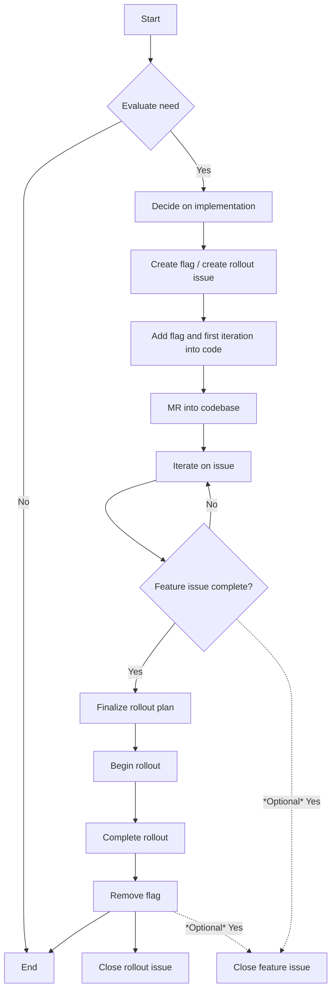

**注意**：
以下の内容は、GitLab が自身の機能をデプロイするために使用するフィーチャーフラグについて扱います。これは [プロダクトの一部として提供されるフィーチャーフラグ](https://docs.gitlab.com/ee/development/feature_flags/) **とは異なります**。

このページでは、GitLab におけるフィーチャーフラグのライフサイクルプロセスを定義しています。GitLab 開発者およびコードコントリビューター向けの技術情報は、[開発者ドキュメント](https://docs.gitlab.com/development/feature_flags/) にあります。

## フィーチャーフラグを使うべきとき {#when-to-use-feature-flags}

フィーチャーフラグの背後で機能をデプロイすることは、GitLab の既存機能の可用性に影響を与える可能性のある変更には必須です。変更が自分が作成している新しい機能のみに影響する場合、フィーチャーフラグが必要かは判断を使って決めてください。
そのような変更には次のものが含まれます：

1. 高トラフィックエリアの新機能（新しいマージリクエストウィジェット、Issue／エピックの新オプション、新しい CI 機能など）。
1. プロダクションでの追加テストが必要となる複雑なセキュリティまたはパフォーマンスの改善（複雑なクエリの書き直し、新しい方法での複雑な finder の再利用、破壊的なデータベース更新、頻繁に使用される API エンドポイントへの変更など）。
1. ユーザーインターフェースへの侵襲的な変更（新しいナビゲーションバーの導入、サイドバーの削除、Issue または MR インターフェースの大幅な UI 変更など）。
1. サードパーティサービスへの依存関係の導入（プロジェクトインポートのサポートを追加するなど）。
1. データ破損またはデータ損失を引き起こす可能性のある機能の変更（リポジトリデータやユーザーがアップロードしたコンテンツを処理する機能など）。
1. 制限を追加するパーミッションへの変更（Developer の代わりに Owner パーミッションを要求するなど）。

フィーチャーフラグの使用を検討しないかもしれない状況：

1. 新しい API エンドポイントの追加。
1. 低トラフィックエリアでの新機能の導入（管理エリア、グループ設定エリア、プロジェクト設定エリアでの新しいエクスポート機能の追加など）。
1. 非侵襲的なフロントエンド変更（ボタンの色をわずかに変更する、低トラフィックエリアの UI 要素を移動するなど）。

いずれの場合も、このような変更に取り組む際は、自問してください：

> なぜフィーチャーフラグを追加する必要があるのか？ 追加しない場合、アプリケーションの信頼性とユーザー体験への影響をコントロールするためにどのような選択肢があるのか？

なぜフィーチャーフラグの使用を制限するのかについての視点については、[必要な場合にのみフィーチャーフラグ](https://www.youtube.com/watch?v=DQaGqyolOd8) を使うビデオを参照してください。

フィーチャーフラグが必要かどうか不確かな場合は、マージリクエストレビュープロセスの早い段階で質問してください。レビュアーが回答を提供する可能性が高いです。

{}
[フィーチャーフラグは GitLab Dedicated ではサポートされていません](https://docs.gitlab.com/ee/development/enabling_features_on_dedicated.html#feature-flags)。
{}

## フィーチャーフラグのメリット

フィーチャーフラグは設定のように見え、私たちの [convention-over-configuration](/handbook/product/product-principles/#convention-over-configuration) 原則に反するように見えるかもしれません。ただし、設定は定義上ユーザーが管理可能なものです。
フィーチャーフラグはユーザーが編集可能であることを意図していません。代わりに、エンジニアと Site Reliability Engineer が変更のリスクを下げるために使うツールとして意図されています。フィーチャーフラグは、モノレポでの継続的デリバリーを実現する shim であり、変更ごとにコードベース全体をデプロイする必要がありません。
フィーチャーフラグは、自分たちの条件で安全に作業をロールアウトできるようにするために作成されています。
フィーチャーフラグを設定として使用している場合、それは間違った使い方をしており、実際私たちの原則に違反しています。何かを設定可能にする必要がある場合、最初から意図的に設定にすべきです。

[development-type](https://docs.gitlab.com/ee/development/feature_flags/#development-type) フィーチャーフラグを使うメリットには次のようなものがあります：

1. GitLab.com の継続的デリバリーを可能にする。
1. Mean-Time-To-Recovery を大幅に減らす。
1. エンジニアが変更の影響を、規模に関わらず段階的に監視・縮小できるようにし、よりメトリクス駆動で良い DevOps プラクティスを実行できるようにする。これは [一部の責任を "left" にシフト](https://devops.com/why-its-time-for-site-reliability-engineering-to-shift-left/) させる。
1. 機能ロールアウトのタイミングをコントロールする：フィーチャーフラグなしでは、特定のデプロイメントが完了するまで待つ必要がある（GitLab ではいつでも起こりうる）。
1. 心理的安全性の向上：フィーチャーフラグが使われると、エンジニアは何か問題が発生した場合にすぐにコードを無効化し、リスクのある変更の影響を最小化できるという信頼を持てる。
1. スループットの改善：フラグが存在することで変更のリスクが減少すると、スケーラビリティに関する理論的なテストが不要になる、または重要度が下がる可能性がある。これにより、エンジニアは小さなプロジェクトで機能をテストし、影響を監視して進めることができる。代替案はローカル、ステージング、または別の GitLab デプロイメントで複雑なベンチマークを構築することであり、これは機能を構築しリリースするのにかかる時間に大きな影響を与える。

## フィーチャーフラグのコスト

プロセスを読んでいると、フィーチャーフラグの背後で機能をデプロイすることは多くの作業を増やすように思えるかもしれません。幸い、これはそうではありません。理由を説明します。この例では、行う作業のコストを 0 から無限大までの数値として指定します。数値が大きいほど、作業のコストが高いです。コストは時間に変換されるものではなく、ある変更の複雑さを別の変更と比較する方法にすぎません。

新しい機能を構築しており、これのコストが 10 だと判断したとしましょう。さまざまな場所でフィーチャーフラグチェックを追加するコストが 1 だとも判断しました。フィーチャーフラグを使用せず、機能が意図通りに動作する場合、合計コストは 10 です。ただし、これはベストケースシナリオです。
ベストケースシナリオに最適化すると、トラブルにつながることが保証されます。一方、ワーストケースシナリオに最適化することはほぼ常により良いです。

これを示すため、機能がインシデントを引き起こし、即座に解決する方法がないとしましょう。これは、インシデントを解決するために以下の手順を取る必要があることを意味します：

1. リリースを差し戻します。
1. 行われた変更に応じて、必要なクリーンアップを実行します。
1. メインブランチが安定した状態を保つことを担保するため、コミットを差し戻します。問題の解決に数日または数週間かかる場合は、特に必要です。
1. 問題が解決されるまで将来のリリースをブロックしないよう、差し戻しコミットを適切な安定ブランチに Pick します。

過去にも示されているように、これらの手順は時間がかかり、複雑で、多くの開発者が関与することが多く、そして最悪なのは：問題が解決されるまで、ユーザーは GitLab.com の使用体験が悪くなることです。

そして、これらすべてに 10 のコストが関連付けられているとしましょう。これは、ワーストケースシナリオ（最適化すべきもの）では、合計コストが 20 になることを意味します。

フィーチャーフラグを使用していたら、状況は大きく異なっていたでしょう。リリースを差し戻す必要はなく、フィーチャーフラグはデフォルトで無効化されているため、Git コミットを差し戻したり Pick したりする必要もありません。実際、機能を無効化し、ワーストケースではクリーンアップを実行するだけです。このコストを 2 としましょう。この場合、ベストケースのコストは 11 です：機能を構築するのに 10、フィーチャーフラグを追加するのに 1。ワーストケースのコストは 13 になります：

- 機能の構築に 10。
- フィーチャーフラグの追加に 1。
- 無効化とクリーンアップに 2。

ここでわかるように、ベストケースシナリオでは、フィーチャーフラグを使用しない場合と比較して、Issue を解決するために必要な作業はわずかに大きいだけです。一方、変更を差し戻すプロセスは、はるかに、そして信頼性をもって、安価でした。

つまり、フィーチャーフラグは開発プロセスを遅らせるのではなく、インシデント管理がはるかに容易になることでプロセスを加速させます。継続的デプロイメントが容易になると、機能をイテレーションするまでの時間がさらに短縮され、変更が GitLab.com で利用可能になるまで数週間待つ必要がなくなります。

## フィーチャーフラグの使い方

GitLab 開発でフィーチャーフラグを始める概要については、[トレーニングテンプレート](https://gitlab.com/gitlab-com/www-gitlab-com/-/blob/master/.gitlab/issue_templates/feature-flag-training.md) に従ってください。

フィーチャーフラグを使用する前に、次のガイダンスを必ず読んでください：

1. [フィーチャーフラグを使った開発](https://docs.gitlab.com/ee/development/feature_flags/)：フィーチャーフラグのタイプ、その定義と検証、作成方法、フロントエンドとバックエンドの詳細、その他の情報について学びます。
1. [フィーチャーフラグの背後でデプロイされた機能のドキュメント化](https://docs.gitlab.com/ee/development/documentation/feature_flags.html)：状態に応じてフィーチャーフラグの背後にデプロイされた機能をドキュメント化する方法と、状態が変わったときにドキュメントを更新する方法。
1. [フィーチャーフラグの制御](https://docs.gitlab.com/ee/development/feature_flags/controls.html)：新機能のデプロイ、GitLab.com での有効化、変更のコミュニケーション、ロギング、クリーンアップのプロセスについて学びます。
1. [フィーチャーフラグと変更管理プロセス](/handbook/engineering/infrastructure-platforms/change-management/#feature-flags-and-the-change-management-process)：あなたのフラグが変更管理プロセスの使用を必要とするかどうかを学びます。
1. [チームのフィーチャーフラグのステータスを確認する](#dashboard--metrics)：チームがフィーチャーフラグを多く持ちすぎていないか、古いフィーチャーフラグがないかを確認します。時間の経過と共にフィーチャーフラグがどう切り替えられたかを確認します。
1. [フィーチャーフラグで実験を実施する](https://docs.gitlab.com/ee/development/experiment_guide/)：Growth 部門が実験フィーチャーフラグをどう使うかを学びます。

ユーザーがフラグの背後にある機能とどう対話するかについては、以下を参照してください：

1. [GitLab 管理者がフラグの背後にある機能をどう有効化／無効化できるか](https://docs.gitlab.com/ee/administration/feature_flags.html)：GitLab 管理者向けに、フィーチャーフラグの背後にある GitLab 機能をどう有効化／無効化できるかの説明。
1. [「フラグの背後にデプロイされた機能」が GitLab ユーザーにとって何を意味するか](https://docs.gitlab.com/ee/user/feature_flags.html)：GitLab ユーザー向けに、有効化されるまで利用できない特定の機能があることに関する説明。

## フィーチャーフラグのライフサイクル

### 計画 {#planning}

1. フィーチャーフラグが必要か評価する：
   1. [評価のプロセス](#when-to-use-feature-flags)。
   1. エンジニアとして、取り組んでいる Issue に対する提案ソリューションを考案し、フィーチャーフラグの背後で実装するかどうかを決定します。
1. 以下に従ってフィーチャーフラグの実装方法とそのロールアウトを決定する：
   1. フィーチャーフラグの [タイプ](https://docs.gitlab.com/ee/development/feature_flags/#types-of-feature-flags) を選択します。
   1. [定義](https://docs.gitlab.com/ee/development/feature_flags/#feature-flag-definition-and-validation) を決定し、YAML を計画します。
   1. フィーチャーフラグをどのタイプの [actor](https://docs.gitlab.com/ee/development/feature_flags/#feature-actors) に紐づけるかを決定します（必要な場合）。
   1. コード内のどこでフィーチャーフラグを切り替えるかを考えます。
1. コード内にフィーチャーフラグ定義を作成し、フォローアップのロールアウト Issue を作成する：
   1. [フィーチャーフラグを作成](https://docs.gitlab.com/ee/development/feature_flags/#create-a-new-feature-flag) します。
   1. [テンプレートを使ってフィーチャーフラグロールアウト Issue を作成](https://docs.gitlab.com/ee/development/feature_flags/#development-type) します（必要に応じて）。
   1. フィーチャーフラグロールアウト Issue で EM／PM を ping して、スケジュール／計画／洗練してもらいます。
   1. EM とエンジニアは協働してフィーチャーフラグのロールアウト計画を最終化します。フィーチャーフラグロールアウトテンプレートのすべての手順がすべてのフィーチャーフラグに必須というわけではありません。

### 開発

1. バックエンド、フロントエンド、テストのコードにフィーチャーフラグを追加する：
   1. 垂直スライスで [フィーチャーフラグを使って開発](https://docs.gitlab.com/ee/development/feature_flags/#develop-with-a-feature-flag) します。
   1. 有効化時と無効化時の動作を確認するため、[フィーチャーフラグをテストに含める](https://docs.gitlab.com/ee/development/feature_flags/#feature-flags-in-tests)。
   1. 動作することを担保するため、[フィーチャーフラグをローカルで反転させる](https://docs.gitlab.com/ee/development/feature_flags/#enabling-a-feature-flag-locally-in-development)。
1. [実装プロセス](https://docs.gitlab.com/ee/development/feature_flags/) に従い、フィーチャーフラグの背後にある機能を MR を通じてコードベースに追加します。
1. 論理的なスライスをテストするためにフィーチャーフラグを使用しつつ、Issue の完了に向けてイテレーションを続ける：
   1. フィーチャーフラグを複数の MR で使えます。Issue が完了するまでイテレーションを続けます。
1. [フィーチャーフラグのドキュメント作成ガイドライン](https://docs.gitlab.com/ee/development/documentation/feature_flags.html) に必ず従い、フィーチャーフラグの状態に応じてドキュメントを最新に保ちます。
1. スライスが十分に完了したと判断されたら（[low level of shame](/handbook/values/#low-level-of-shame-when-dogfooding) を念頭に）、ロールアウトプロセスに進みます。
   1. 一部のチームは、機能 Issue がここで完了するとクローズすることを選び、他のチームはロールアウトプロセスが完了するまで待つ場合があります。コードがデフォルトブランチに存在した後に機能 Issue をクローズする場合は、ここで Issue をクローズすべきです。

### ロールアウト {#rollout}

1. ロールアウト計画を最終化する：
   1. [ロールアウトガイドライン](https://docs.gitlab.com/ee/development/feature_flags/controls.html#rolling-out-changes) に従って、フィーチャーフラグのロールアウト計画を決定します。
1. ロールアウト計画を開始する：
   1. ロールアウト計画はフラグごとに異なります。[フィーチャーフラグロールアウト Issue](https://gitlab.com/gitlab-org/gitlab/-/blob/master/.gitlab/issue_templates/Feature%20Flag%20Roll%20Out.md) で概説した手順を実行します。
1. フラグの削除、クリーンアップ、機能告知：
   1. [フィーチャーフラグのクリーンアッププロセス](https://docs.gitlab.com/ee/development/feature_flags/controls.html#cleaning-up) に従います。
   1. [フィーチャーフラグのドキュメンテーションプロセス](https://docs.gitlab.com/ee/development/documentation/feature_flags.html) に従ったことを担保します。
   1. [chatops のフィーチャーフラグ削除コマンド](https://docs.gitlab.com/ee/development/feature_flags/controls.html#cleanup-chatops) を使ってフラグがコードとデータベースから削除されたことを担保します。
   1. チームがフィーチャーフラグの削除後に機能 Issue をクローズする場合、ここでクローズすべきです。
   1. 元の Issue がリリース投稿に含まれる場合、Engineering Manager、Product Manager、Product Designer、Product Marketing Manager、Technical Writer と協調して、リリース投稿アイテムを含めます。

### フローチャート

## フィーチャーフラグの背後にある機能を最終リリースに含める

最終リリースを構築し、Self-Managed ユーザーに機能を提示するためには、フィーチャーフラグは少なくとも **on** にデフォルト設定されている必要があります。機能が安定していると判断され、フィーチャーフラグを削除しても安全であるという信頼がある場合は、フィーチャーフラグの完全な削除を検討してください。この判断を下す前に、[プロダクションでフラグを **グローバル** に有効化](https://docs.gitlab.com/ee/development/feature_flags/controls.html#enabling-a-feature-for-gitlabcom) して **少なくとも 1 日** 経過させることを *強く* 推奨します。この期間中に予期しないバグが発見されることがあります。

デフォルトで無効化されている機能を有効化するプロセスは、マージリクエストが最初にレビューされてから GitLab.com に変更がデプロイされるまで 5〜6 日かかる場合があります。ただし、予期しない問題に備えて 10〜14 日を見込むことを推奨します。

フィーチャーフラグは [状態（有効化／無効化）に応じてドキュメント化](https://docs.gitlab.com/ee/development/documentation/feature_flags.html) する必要があり、状態が変わった場合は、ドキュメントを **必ず** それに応じて更新する必要があります。

デフォルトの状態を変更したりフィーチャーフラグを削除したりすることは、変更が Self-Managed の最終リリースに含まれるよう、[リリース日](/handbook/engineering/releases/) の *少なくとも* 3〜4 営業日前までに行わなければなりません。

**注：** フラグを削除すると、マージリクエストがマージされた後すぐに、機能が GitLab.com で利用可能になることを考慮してください。

これに加えて、フィーチャーフラグの背後にある機能は次を満たすべきです：

- すべての GitLab.com 環境で十分な期間実行されること。この期間はフィーチャーフラグの背後にある機能によって異なりますが、一般的なルールとして、十分なフィードバックを集めるには 2〜4 営業日が十分なはずです。
- 上記の期間中、GitLab.com プランのすべてのユーザーに機能が公開されること。より小さな割合またはユーザーのグループにのみ機能を公開すると、機能の安定性に関する判断を下すのに十分な情報を得られない可能性があります。

まれですが、フィーチャーフラグが使用されている場合でも、安定ブランチへの変更を Pick するのを拒否したり差し戻したりすることを、リリースマネージャーが決定する場合があります。これは、変更が問題があると判断された場合、侵襲的すぎる場合、または変更が GitLab.com でどう動作するかを適切に測定する十分な時間がない場合に必要となることがあります。

## コミュニティコントリビューション

フィーチャーフラグのロールアウトには、内部 GitLab システムへのアクセスが必要です。この制限のため、コミュニティコントリビューションには、フィーチャーフラグの [ロールアウト](#rollout) を行う GitLab チームメンバーからの支援が必要です。

[計画](#planning) フェーズの間、レビューを実行する MR Coach または GitLab チームメンバーが、フィーチャーフラグロールアウト Issue で EM と PM を ping して、スケジュール／計画／洗練してもらうことが不可欠です。また、フィーチャーフラグを使用する最終的な MR でフィーチャーフラグロールアウト Issue をタグ付けし、ロールアウトがまもなく必要になることを EM と PM が認識できるようにすべきです。

## ダッシュボードとメトリクス {#dashboard--metrics}

フィーチャーフラグのライフサイクル（リリースごとにいくつ導入されているか、アプリケーション内にどれくらい存在しているか、どれくらい有効化されているかなど）に関する詳細情報については、[このダッシュボード](https://10az.online.tableau.com/#/site/gitlab/views/Engineering-Featureflags/Engineering-FeatureFlags)（社内のみ）を参照してください。また、[Kibana で 7 日分のデータ](https://nonprod-log.gitlab.net/app/r/s/cXyLU)（社内のみ）を保持しており、無効化または有効化されたフィーチャーフラグについては、GitLab プロジェクト [feature-flag-log](https://gitlab.com/gitlab-com/gl-infra/feature-flag-log/-/issues/?state=closed) が同じものを無期限に保持しています。
