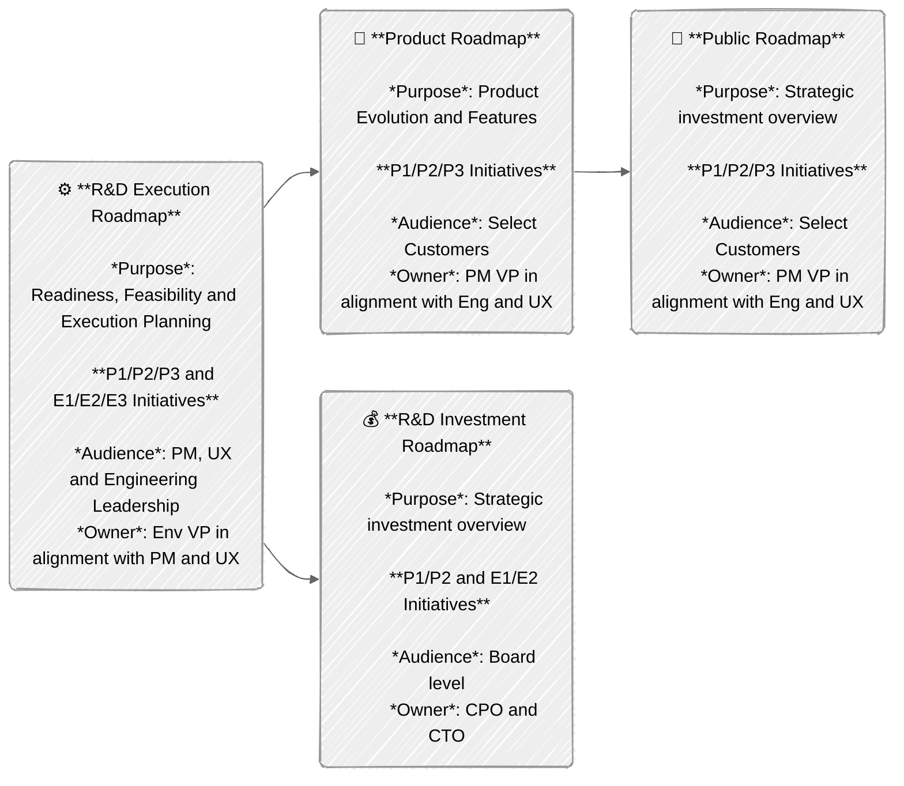
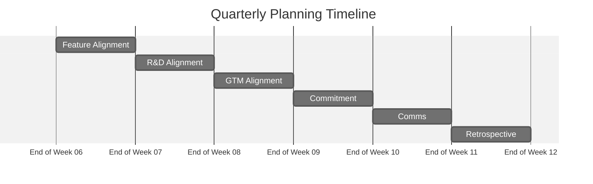

**R&D Interlock プロセス**は、Product Management、User Experience、Engineering の各チームをロードマップ計画と実行調整の上で整合させるために使われます。インターロックは 3 つの主要な要素から構成されます：

- [Resource Allocation Framework](#resource-allocation-framework) は、プロダクト主導およびエンジニアリング主導の取り組みを利用可能なエンジニアリングリソースにマッピングするための構造を提供します。
- [Roadmap Structure](#roadmap-structure) は、整合に使われる計画成果物（ロードマップ）を説明し、それらのオーナーシップ、目的、対象読者を定義します。
- [R&D Alignment Process](#rd-alignment-process) は、次の実行四半期に向けて整合を作り出すためのプロセスとタイムラインを提供します。

整合プロセスは、プロダクト主導とエンジニアリング主導のイニシアチブを横断する共同アプローチを概説し、さまざまなステークホルダーとの明確なコミュニケーションチャネルを担保します。

注：FY26 の残り（2026 年 1 月まで）、チームは 2 か月ごとに 1 四半期を計画する加速計画に参加します。私たちの目標は、業界全体のトレンドと GitLab に類似した成熟しつつある SaaS 企業に整合した 4 四半期のロードマップを提供することです。1 月末にこれを達成したら、3 か月ごとに 1 四半期を計画する通常の計画ケイデンスに移行します。

## Resource Allocation Framework

私たちは、カスタマーニーズ、品質基準、長期的なプロダクトの持続可能性を優先する、プロダクト主導とエンジニアリング主導のイニシアチブ間のバランスの取れたアプローチを確立しています。このバランスは、Product Management と Engineering チーム間の継続的な対話の基盤として機能し、各チームの特定のコンテキストに必要な比率を柔軟に調整できます。

イニシアチブは [R&D Interlock Dashboard](https://gitlab.com/groups/gitlab-org/-/wikis/CXO-Operational-Dashboards/R&D-Interlock-Dashboard) を通じて追跡されます。

- ### P1/P2/P3: プロダクト主導イニシアチブ

  - 優先順位レベル
    - P1: 完全なイニシアチブがコミット日に提供されることに 100% のエンジニアリング信頼度
    - P2: 完全なイニシアチブがコミット日に提供されることに 80% のエンジニアリング信頼度
    - P3: 50% のエンジニアリング信頼度。P1-2 または E1-2 がリスクにある場合、停止可能。
  - すべてではないが一部の P1/P2/P3 プロジェクトは、[Public Roadmap](#public-roadmap)（GTM 所有）に追加され、GTM ティア T1/T2/T3 でラベル付けされます（参考：[GTM ティアの定義](https://docs.google.com/spreadsheets/d/1Pis-VRUYTlitNjoKmDKNQMIf-4bWBo5XjPyWOYo0R54/edit?gid=838006198#gid=838006198&range=B20)）。
    - T と P の優先順位が厳密に一致しない場合があります。たとえば、契約上のカスタマーコミットメントは Product にとって P1 でも、GTM にとっては T3 になることがあります。同様に、競合ギャップは Product にとって P2 でも、GTM にとっては T3 になることがあります。この優先順位の乖離は頻繁に発生することが想定されています。
    - **GTM 優先順位 T1-3 は、Product 優先順位 P1-P3 より高くなることはありません（等しいか低いだけ）。そうしないと、優先順位の逆転が発生します。例外には PLT/ELT/MLT の承認が必要です。**
    - T 優先順位は [Public Roadmap](#public-roadmap) を通じてステークホルダーに外部的に伝えられます
    - P 優先順位は [Internal Roadmap](#internal-roadmap) を通じてステークホルダーに外部的に伝えられます

- ### E1/E2/E3: エンジニアリング主導イニシアチブ

  - 優先順位レベル：
    - E1: 完全なイニシアチブがコミット日に提供されることに 100% のエンジニアリング信頼度
    - E2: 完全なイニシアチブがコミット日に提供されることに 80% のエンジニアリング信頼度
    - E3: 50% のエンジニアリング信頼度。P1-2 または E1-2 がリスクにある場合、停止可能。
  - 内部可視性のみ
  - 外部には伝えられない
  - Engineering の外部に依存関係を持たない

各 Product または Engineering の VP の承認がない限り、エンジニア 20 人あたり最大 1 x（P1 または E1）と 2 x（P2 または E2）の制限があり、主要投資領域（SCM、CI、Security、Compliance、Planning、Duo など）ごとに最低 1 x P2 があります。

Product と Engineering の間にクリーンな整合（「インターロック」）を作るには、ユーザー要件と焦点を絞った品質改善および本質的な技術的取り組みを統合する、構造化された計画方法論が必要です。このフレームワークは、プロダクト主導イニシアチブ（P1/P2/P3）が明示的なリソース配分パラメータで動作するデュアルトラックシステムを確立します。P1 は計画されたスコープの 100% を 100% の確実性で提供するためのエンジニアリングキャパシティを受け取り、外部コミュニケーションでフルに可視化されます。P2 は計画されたスコープの 100% を 80% の確実性で提供するためのエンジニアリングリソースが配分され、両者には定義された受け入れ基準があります。P3 の取り組みは、キャパシティが許す場合に 50% の信頼度を目標として、反復的な開発サイクルを通じて実装されます。この体系的なアプローチは、コミットされた機能性と実行の間の追跡可能な関係を作りつつ、適切なリソース配分を担保します。

これらの要件主導の開発と並行して、フレームワークは技術的持続可能性トラック（E1/E2/E3）を実装します。これは同等のリソース配分メトリクスを持ちますが、外部依存関係およびリリースコミュニケーションから分離されています。この構造は、外部のスケジューリング制約なしに、適切な優先順位付けでクリティカルなリファクタリング、依存関係のアップグレード、テスト自動化の改善、インフラストラクチャ最適化を進めることを可能にします。

P-track と E-track の配分間の設定可能な比率は、システムコンポーネントやアーキテクチャレイヤーが異なる場合の実装の柔軟性を提供します。チームは技術的負債の蓄積、システムの安定性メトリクス、コンポーネントのライフサイクルフェーズに基づいてフレームワークを適応でき、最終的に機能要件を満たしつつアーキテクチャの完全性を維持するシステムを生み出します。

## Roadmap Structure

### R&D Execution Roadmap

- **コンテンツ：** すべての P1/P2/P3 および E1/E2/E3 イニシアチブ
- **ケイデンス：** 四半期ごとの更新、4 四半期ローリングウィンドウ
- **対象読者：** Product および Engineering リーダーシップ
- **オーナー：** Product と整合した Eng VP
- **目的：** 準備状況、実現可能性、実行計画
- **形式：** セクションごとに 1 つのデッキ
  ([テンプレート](https://docs.google.com/presentation/d/1UTjvJVl544gj9cYrmKeW8KI8dtXBZ6jzxywOuIxRHrI/edit))、ステージごとにカスタマー主導およびエンジニアリング主導イニシアチブのための 1 つのロードマップ概要、各イニシアチブの個別整合スライド

### R&D Investment Roadmap

- **コンテンツ**: P1/P2 および E1/E2 イニシアチブ（80%+ の信頼度）
- **ケイデンス**: 四半期ごとの更新、4 四半期ローリングウィンドウ
- **対象読者**: ボードレベル
- **オーナー: CPO と CTO 目的**: 戦略的投資概要

### Internal Roadmap

- **コンテンツ**: すべての P1/P2/P3 機能
- **ケイデンス**: 四半期ごとの更新、4 四半期ローリングウィンドウ
- **対象読者**: 選ばれたカスタマー
- **オーナー**: Eng および UX と整合した PM VP
- **目的**: プロダクトの進化と機能計画

### Public Roadmap

- **コンテンツ**: P1/P2/P3 プロダクト主導機能のサブセットが GTM 用に T1/T2/T3 とラベル付けされます。**注：GTM 優先順位 T1/T2 は、優先順位の逆転を避けるため、プロダクト優先順位より高くなることはありません。**
- **ケイデンス**: 四半期ごとの更新、4 四半期ローリングウィンドウ
- **対象読者**: カスタマー
- **オーナー**: Product と整合した GTM
- **目的**: 外部コミットメントトラッキング



## R&D Alignment Process

R&D Alignment プロセスは、計画ウィンドウの 1 四半期前に、概ね合意された [R&D Execution Roadmap](#rd-execution-roadmap)（およびすべての[派生ロードマップ](#roadmap-structure)）を作成します。Q<sub>n</sub> から Q<sub>n+3</sub> までの計画を立てる場合、計画四半期は実行前であり、明確な計画タイムラインを提供するために Q<sub>n-1</sub> としてマークされます。整合プロセスは Q<sub>n-1</sub> の 7〜12 週目に実行されます。



<table>
  <tr>
    <td>
      <h3 id="#feature-definition">Feature Definition</h3>
      <p>タイムライン: Q<sub>n-1</sub> 第 1 週</p>
    </td>
    <td>
      <ul>
        <li>目標：整合の準備状況を担保する
          <ul>
            <li>Phase 1: <a href="/handbook/product-development/how-we-work/roles-and-responsibilities/#who-what-why-how-and-when">Who、What、Why</a> を概説する
              <ul>
                <li>事業価値</li>
                <li>要件（ユースケースと対処すべき痛み）</li>
                <li>ターゲットユーザー</li>
              </ul>
            <li>
            <li>Phase 2: 整合の準備状況を評価する
              <ul>
                <li>問題の検証</li>
                <li>UX 成果物とソリューション検証スコープ</li>
                <li>UX の帯域とタイムライン<li>
              </ul>
            </li>
          </ul>
        </li>
        <li>オーナー：Phase 1：PLT、Phase 2：UXLT</li>
        <li>
          参加者：PM／PD／Eng リーダー
        </li>
      </ul>
    </td>
  </tr>
  <tr>
    <td>
      <h3 id="#feature-alignment">Feature Alignment</h3>
      <p>タイムライン: Q<sub>n-1</sub> 第 8 週</p>
    </td>
    <td>
      <ul>
        <li>目標：P1-3／E1-3 機能の全セットに関する PM／PD／EM の整合を作る</li>
        <li>
          内容：
          <ul>
            <li>P1/P2/P3 と E1/E2/E3 の初期ドラフトアイデアを議論する</li>
            <li>オーナーシップ、依存関係、コンフリクトを特定する</li>
            <li>
              以下の初期評価：
              <ul>
                <li>技術的実現可能性</li>
                <li>エンジニアリングの帯域とタイムライン</li>
                <li>リソース要件と依存関係</li>
                <li>戦略的整合</li>
                <li>Customer Zero の要件とイネーブルメント</li>
              </ul>
            </li>
            <li>
              改善（品質、安定性、セキュリティなど）は、P 主導または E 主導のイニシアチブとしてマッピングする必要があります
            </li>
          </ul>
        </li>
        <li>
          成果物：<a href="#rd-execution-roadmap">R&amp;D Execution Roadmap</a> 内のステージレベル整合スライド
        </li>
        <li>オーナー：PLT/ELT</li>
        <li>
          参加者：検討対象の各 capability の Group PM／PDM／EM
        </li>
        <li>形式：グループレベルチームの希望に応じて同期または非同期</li>
      </ul>
    </td>
  </tr>
  <tr>
    <td>
      <h3 id="#rd-alignment-discussion">R&amp;D Alignment Discussion</h3>
      <p>タイムライン: Q<sub>n-1</sub> 第 9 週</p>
    </td>
    <td>
      <ul>
        <li>
          目標：Product & Engineering リーダーシップを以下について整合させる：
          <ul>
            <li>
              capability のスコープと、カスタマー、品質、ニーズに対する重要度
            </li>
            <li>提案された E／P 優先順位ランキングへのコミット能力</li>
          </ul>
        </li>
        <li>
          内容：
          <ul>
            <li>
              以下についての整合議論：
              <ul>
                <li>カスタマー課題と事業価値</li>
                <li>
                  Definition of Good：明確なユーザー体験、成功とランディング基準
                </li>
                <li>提案された優先順位</li>
                <li>リソース要件</li>
                <li>初期 UX と Eng のタイムライン見積もり</li>
                <li>依存関係の特定</li>
                <li>リスク評価</li>
              </ul>
            </li>
          </ul>
        </li>
        <li>
          トピックの粒度：1 FTE 四半期の最低閾値
          <ul>
            <li>
              小規模なイニシアチブは、テーマ別機能内のマイルストーンとして集約されます
            </li>
          </ul>
        </li>
        <li>
          成果物：
          <a href="#rd-execution-roadmap">R&amp;D Execution Roadmap</a>、機能ごとに 1 つの共同整合スライド（<a
            href="https://www.google.com/url?q=https://docs.google.com/presentation/d/1UTjvJVl544gj9cYrmKeW8KI8dtXBZ6jzxywOuIxRHrI/edit"
            >テンプレート</a
          >）
        </li>
        <li>オーナー：PLT/ELT/UXLT</li>
        <li>
          参加者：
          <ul>
            <li>E-track：capability を担当する EM</li>
            <li>P-track：capability を担当する PM／PDM／EM</li>
          </ul>
        </li>
      </ul>
    </td>
  </tr>
  <tr>
    <td>
      <h3 id="#gtm-alignment-discussion">GTM Alignment Discussion</h3>
      <p>タイムライン: Q<sub>n-1</sub> 第 10 週</p>
    </td>
    <td>
      <ul>
        <li>
          目標：R&amp;D と GTM リーダーシップを以下について整合させる：
          <ul>
            <li>GTM の観点における capability のスコープと重要度</li>
            <li>提案された T 優先順位ランキングへのコミット能力</li>
          </ul>
        </li>
        <li>
          内容：
          <ul>
            <li>
              事前読み込み：<a href="#rd-execution-roadmap">R&amp;D Execution Roadmap</a> 内の R&amp;D 共同整合スライド
            </li>
            <li>議論成果物：GTM からの提案された T 優先順位</li>
          </ul>
        </li>
        <li>オーナー：MLT</li>
        <li>参加者：ELT、PLT & MLT</li>
      </ul>
    </td>
  </tr>
  <tr>
    <td>
      <h3 id="#final-prioritization-and-commitment">
        Final Prioritization and Commitment
      </h3>
      <p>タイムライン: Q<sub>n-1</sub> 第 11 週</p>
    </td>
    <td>
      <ul>
        <li>
          目標：整合議論の結果を <a href="#rd-execution-roadmap">R&amp;D Execution Roadmap</a> に文書化する
        </li>
        <li>
          内容：
          <ul>
            <li>最終的な T／P／E の割り当て</li>
            <li>デリバリータイムラインのコミットメント</li>
            <li>リソース配分の確認</li>
            <li>依存関係の特定</li>
            <li>リスクの文書化</li>
          </ul>
        </li>
        <li>
          オーナー：
          <ul>
            <li>E-track：capability を担当する EM、Eng VP の署名</li>
            <li>
              P-track：capability を担当する PM、PDM、EM、PM、UX、Eng VP の署名
            </li>
          </ul>
        </li>
        <li>形式：非同期</li>
      </ul>
    </td>
  </tr>
  <tr>
    <td>
      <h3 id="#upstream-communication">Upstream Communication</h3>
      <p>タイムライン: Q<sub>n-1</sub> 第 12 週</p>
    </td>
    <td>
      <ul>
        <li>
          整合された P1-3 イニシアチブが <a href="#internal-roadmap">Internal Roadmap</a> に統合される
        </li>
        <li>
          P1/P2 および E1/E2 イニシアチブが <a href="#rd-investment-roadmap">R&amp;D Investment Roadmap</a> に統合される
        </li>
        <li>
          選ばれた P1/P2 イニシアチブが T1/T2 として <a href="#public-roadmap">Public Roadmap</a> に統合される。注：GTM 優先順位 T1/T2 は、優先順位の逆転を避けるため、プロダクト優先順位より高くなることはありません。
        </li>
      </ul>
    </td>
  </tr>
  <tr>
    <td>
      <h3 id="#retrospective">Retrospective</h3>
      <p>タイムライン: Q<sub>n</sub> 第 1 週</p>
    </td>
    <td>
      <ul>
        <li>
          目標：前回の計画サイクルから学び、今後実装する必要がある変更を特定する。
        </li>
        <li>
          内容：前回の計画イテレーションからのフィードバックを収集、議論、組み込む
        </li>
        <li>成果物：Q<sub>n-2</sub> 計画振り返り。</li>
        <li>オーナー：PLT/ELT</li>
        <li>参加者：セクションおよびステージレベルの計画担当者</li>
      </ul>
    </td>
  </tr>
</table>

## 成功メトリクス

- 会社目標とのロードマップ整合
- 計画の効率（計画と整合に費やした時間、作業のサイジング、カスタマー／品質／持続可能性のバランス）
- 計画と実行の正確性（時間通りのコミットメント遂行）

## Commitment Change Request {#commitment-change-requests}

P1/E1 および P2/E2 の優先順位を持つコミット済み機能について、タイムライン、スコープ、コスト、優先順位、品質、リスクに関するあらゆる主要な変更は、それぞれの PLT および ELT メンバー、ならびに CPO と CTO に対して **Commitment Change Request** を通じて提起され、明示的な承認を得て、すべてのステークホルダーを把握させる必要があります：

1. プロジェクト DRI は、関連するインターロックエピックに新しいスレッドとして内部ノート（コメント）を追加し、そのコメントへのリンクを [\#r-and-d-roadmap-changes](https://gitlab.enterprise.slack.com/archives/C08G1GJLKN0) に投稿し、それぞれのステークホルダーをメンションします。意思決定者がすばやく対応／行動できるよう、エピックコメントは標準化された形式に従う必要があります：

   ```text
   ### Proposing change to feature

   - Change Type: [select: Timeline / Scope / Cost / Priority / Quality / Risk]
   - What’s changing: <Priority from XX to YY>, <Delivery Milestone from YY.Y to ZZ.Z>, …
   - Background: [2-3 sentences describing the decision]
   - Impact: [optional, further detail on impact to customers / cost / list of projects that are dependent on this project + @ mentions of DRIs for those projects]
   - Proposed by: [Name of Product and Engineering DRI]
   - Approvers: [specific PLT, ELT members], CPO, CTO

   <more narrative / details of change, motivation, impact>

   /label ~"Interlock status::Change requested" ~"Interlock changed"
   ```

   注：変更リクエストがキャンセルされた場合は、変更リクエストテンプレートの一部として追加されたラベルを元に戻すか削除してください。
2. エピックコメント上でのスレッドとしての自由形式の議論、オプションでミーティング。
3. CPO および CTO からの変更コミットへの承認。
4. 承認されたら、変更リクエストを開始したチームメンバー（PM、EM など）が "Interlock status::VP approved" ラベルを追加すべきです。

期限の遅延、スコープの大幅な縮小、またはカスタマー期待を裏切るその他のあらゆる変更は、主要な変更と見なされます。*疑わしい場合は、変更管理プロセスを経てください。*

## GitLab プロセス

一般的に、実装作業を公開可能な場所では、機密情報を扱う場合に [内部ノート](https://docs.gitlab.com/user/discussions/#add-an-internal-note) を使ってメモを取ったり議論したりしてください。例：カスタマー名、ARR インパクト、その他公開すべきでない事業詳細など。

実装作業が `gitlab-org/` グループにない場合、[提供されたテンプレート](https://gitlab.com/groups/gitlab-org/-/epics/new?description_template=interlock_template) を使用して別のインターロックエピックを作成すべきです。各インターロックエピックは、対応するワークストリームエピックにリンクされ、実際の実装作業へのナビゲーションとドリルダウンが容易になります。インターロックエピックは、インターロックプロセスに関連するあらゆる議論に使用され、その「ヘルス」と進捗のサマリーで定期的に更新されるべきです。

## R&D Interlock 計画タイムライン

- FY27Q2 2025 年 9 月 1 日 - 2025 年 9 月 30 日
- FY27Q3 2025 年 10 月 15 日 - 2025 年 11 月 15 日
- FY27Q4 2025 年 12 月 8 日 - 2026 年 1 月 30 日

## ベストプラクティス

1. **エピックの量ではなく事業目標との整合に集中する**
R&D Interlock 項目は、投資テーマに直接結びつく必要があります。各投資テーマには最大 8 件の R&D Interlock 項目を持たせるべきです。事業目標および目標と最も整合しているものに集中してください。整合を確認するため、直接リーダーシップと協働してください。
2. **インターロックキャパシティ**
インターロック項目は、最大でもチームのキャパシティの 70% をカバーするべきです。事業ニーズの変化、リソース、R&D 優先順位を完了するために追加の帯域を必要とする可能性のあるキャパシティの課題により、これより高くすることは推奨しません。チームに優先業務を遂行する余地があることを担保してください。
3. **コミットメントを念頭に置く**
チームがインターロック項目にコミットするとき、これはチームがこの作業を優先し、他のイニシアチブの優先度を下げる意思があることを意味します。
4. **クロスファンクショナルな優先順位の整合**
他チームのプロダクトおよび／またはデリバリーでインターロックしている場合、GitLab の事業目標を達成するために、自分の責任を前進させ、他の作業の優先度を下げることにコミットしていることになります。
5. **早めに計画する**
継続的計画プロセスを開始するにあたり、できるだけ早くチームと協働を始めることがクリティカルです。インターロック計画の中間に同期ミーティングを事前に予定し、適用可能なステークホルダーが整合のための専用時間を確保できるプレースホルダーを作ることが提案されています。

### GitLab のプロダクトロードマップ R&D Interlock プロセス

<table>
    <tr>
        <th>段階</th>
        <th>手順</th>
        <th>アウトカム</th>
    </tr>
    <tr>
        <td><strong>1. Feature Alignment</strong></td>
        <td>
            <ol>
                <li><strong>PM または EM：</strong>インターロックテンプレートを使用してエピックを作成する</li>
                <li><strong>PM：</strong>初期エピック説明、カスタマーインパクト、ARR 見積もりを追加する</li>
                <li><strong>PM：</strong>"Interlock status::New/Proposal in progress" ラベルを適用する</li>
                <li><strong>PM：</strong>セクション、ステージ、グループラベルを適用する</li>
                <li><strong>PM：</strong>エピックで EM と UX をメンションし、コラボレーションを開始する - 初期スコープ、実現可能性、UX リソースニーズについて合意する</li>
                <li><strong>UX：</strong>設計のスコープと実現可能性についてインプットを提供する</li>
            </ol>
        </td>
        <td>
            <ul>
                <li>初期情報付きでエピックが作成される</li>
                <li>P／E-track 整合の初期特定</li>
                <li>UX リソースニーズの特定</li>
                <li>ステージレベルの整合</li>
            </ul>
        </td>
    </tr>
    <tr>
        <td><strong>2. R&D Alignment Discussion</strong></td>
        <td>
            <ol>
                <li><strong>EM：</strong>技術的詳細、評価、スコーピング、資金情報、予測されるマイルストーンとデューデリジェンスを追加する</li>
                <li><strong>UX：</strong>設計の複雑さ評価とリソースニーズを追加する</li>
                <li><strong>PM + EM + UX：</strong>エピックで協働する（コメントまたは同期ミーティング）</li>
                <li><strong>PM、EM または UX：</strong>選択肢を確認し、"Interlock status::Ready for review with alignment across the PM, EM and UX" に更新する</li>
                <li><strong>PM または EM：</strong>適切な優先順位ラベル（P1/P2/P3 または E1/E2/E3）を追加する</li>
                <li><strong>PM：</strong>GPM／Director をメンションしてレビューを依頼する</li>
            </ol>
        </td>
        <td>
            <ul>
                <li>完全な技術と UX 評価付きエピック</li>
                <li>P／E 優先順位の指定</li>
                <li>リーダーシップレビューの準備完了</li>
            </ul>
        </td>
    </tr>
    <tr>
        <td><strong>3. GPM/Director Review</strong></td>
        <td>
            <ol>
                <li><strong>GPM + Eng Director + UX Director：</strong>エピックの詳細をレビューする</li>
                <li><strong>GPM + Eng Director + UX Director：</strong>コメントを使って質問する</li>
                <li><strong>GPM または Eng Director：</strong>双方が承認で整合している場合、"Interlock status::GPM/Director approved" に更新する</li>
                <li><strong>GPM または Director：</strong>双方が不承認で整合している場合、"Interlock status::Alternate proposed" に更新し、フィードバックを提供する</li>
                <li><strong>PM + EM + UX：</strong>代替案が提案された場合、フィードバックに対処してプロセスを再開する</li>
            </ol>
        </td>
        <td>
            <ul>
                <li>GPM／Director 承認付きエピック</li>
                <li>検証された優先順位レベル</li>
            </ul>
        </td>
    </tr>
    <tr>
        <td><strong>4. GTM Alignment Discussion</strong></td>
        <td>
            <ol>
                <li><strong>PM + PMM：</strong>P-track 項目を外部可視性のためにレビューする</li>
                <li><strong>PM + PMM：</strong>外部コミュニケーション戦略を議論する</li>
                <li><strong>PM + PMM：</strong>提案された GTM ティア（T1/T2/T3）に合意する</li>
                <li><strong>PM：</strong>該当する場合は適切な GTM ティアラベルを追加する</li>
                <li><strong>PM：</strong>最終レビューを依頼するため VP をメンションする</li>
            </ol>
        </td>
        <td>
            <ul>
                <li>提案された GTM ティアの割り当て（T1/T2/T3）</li>
                <li>適切なエピックに GTM ティアラベルが適用される</li>
            </ul>
        </td>
    </tr>
    <tr>
        <td><strong>5. VP Review</strong></td>
        <td>
            <ol>
                <li><strong>VP：</strong>エピックの詳細をレビューし、割り当てを優先順位付けする</li>
                <li><strong>VP：</strong>関連する投資テーマ配下のすべてのエピックをレビューする。コミットメントが 8 件以下であることを担保する。それより多い場合は、事業ニーズに対して再優先順位付けし、事業目標に対してそれほど重要ではない Issue にインターロック非必須ラベルを追加する。</li>
                <li><strong>VP：</strong>コメントを使って質問する。</li>
                <li><strong>VP：</strong>Issue が "Interlock status::Non-essential" ラベルでラベル付けされている場合、根拠を説明するコメントを残す。</li>
                <li><strong>VP：</strong>承認された場合、"Interlock status::VP approved" に更新する</li>
                <li><strong>VP：</strong>承認されない場合、"Interlock status::Alternate proposed" に更新し、フィードバックを提供する</li>
                <li><strong>PM + EM + UX：</strong>代替案が提案された場合、フィードバックに対処してプロセスを再開する</li>
                <li><strong>PM + EM + UX：</strong>エピックが非必須としてラベル付けされた場合（"Interlock status::Non-essential" ラベル）、成果物の次のステップと、キャパシティへの必要な調整（つまり、別の成果物に焦点を再配分する、または作業を続ける）があるかについてリーダーと連絡する</li>
            </ol>
        </td>
        <td>
            <ul>
                <li>VP 承認付きエピック</li>
                <li>最終コミットメントの確保</li>
            </ul>
        </td>
    </tr>
    <tr>
        <td><strong>6. Executing</strong></td>
        <td>
            <ol>
                <li><strong>EM：</strong>エピックのステータスラベルを "R&D roadmap status::Executing" に更新する</li>
                <li><strong>EM：</strong>毎週ヘルスステータスラベルでエピックを更新する</li>
                <li><strong>EM：</strong>新たに特定されたリスク、依存関係、タイミングの変化を文書化する</li>
                <li><strong>EM：</strong>作業が始まったら実装エピックにリンクする</li>
                <li><strong>EM/UX：</strong>リスクと依存関係を出てきた時点で文書化する</li>
            </ol>
        </td>
        <td>
            <ul>
                <li>毎週のヘルスステータスの更新</li>
                <li>透明性のあるデリバリーステータス</li>
                <li>早期のリスク特定</li>
            </ul>
        </td>
    </tr>
</table>

### R&D Interlock Process Review

次の 2 四半期にインターロックされたエピックについて、**PM + EM** は以下を行います：

- 項目をレビューし、デリバリーの信頼度を検証する
  主要な依存関係またはリスクがある場合、管理してレビューと再スケジュールのためにリーダーに懸念を提示する
- 適切なデリバリーマイルストーンが割り当てられていることを担保する
- ヘルスステータスラベルが更新されており正確であることを担保する

### このプロセスを使わない場合

すべての作業がこのインターロックプロセスを通る必要はありません。クロスファンクショナルな整合、重要なリソースのコミットメント、または市場参入の調整を必要としない通常の開発作業は、標準のワークストリームエピックと Issue を引き続き使えます。R&D Interlock プロセスは、GitLab プラットフォーム全体の投資領域ごとの高優先度の事業目標に専属するものです。

### メリット

R&D Interlock プロセス経由で提案された作業は、以下のメリットを得られます：

- **役員レベルの可視性**：このプロセスの項目は、組織の最高レベルで可視化されます
- **市場参入の調整**：カスタマー対面の項目は、`GTM tier` に応じて GTM 計画に含まれることがあり、セールスおよびマーケティングの整合を可能にします
- **リソースのコミットメント**：指定された信頼度レベルでの正式なエンジニアリングコミットメント。これは、これらのチームがこれらの投資の提供にコミットし、引き換えに他の作業の優先度を下げることを意味します
- **クロスファンクショナルな整合**：Product、Engineering、GTM チームが優先順位について整合していることを担保します
- **外部コミュニケーション**：選ばれた項目は、公開／カスタマー対面ロードマップに含まれる場合があります

### 提案の候補を作成する方法

1. 既存のエピックが `gitlab-org` の外部にある場合、**Epic を作成**する
   1. [`gitlab-org](https://gitlab.com/gitlab-org) グループ内で、新しいエピックを作成する（[ドキュメント](https://docs.gitlab.com/user/group/epics/manage_epics/#create-an-epic)）
   1. [内部ノート](https://docs.gitlab.com/user/discussions/#add-an-internal-note) にコピーする（既存の場合）、または選択する（新規の場合）、[interlock_template](https://gitlab.com/groups/gitlab-org/-/epics/new?description_template=interlock_template) という名前のエピックテンプレート
1. **必要な情報を完成させる**
   1. テンプレートのすべてのセクションを埋める
   1. DRI を割り当てる（PM、EM、UXPD & PDM）
   1. 適切なラベルを適用する（[ラベルガイド](https://gitlab.com/groups/gitlab-org/gitlab-rd-planning/-/wikis/R&D-Interlock-Process-Dashboard#labels-guide) を参照）
      - 注：候補がコミットされない場合、すべてのインターロック専属ラベルは削除すべきです。
   1. 対象マイルストーンを適用する
1. **プロセス全体でインターロックステータスを更新する**
   1. 議論の進行に応じてインターロックステータスを更新する
   1. 四半期が始まったら、ヘルスステータスを毎週更新する
   1. リスクと依存関係を出てきた時点で文書化する

### インターロックコミットメントを表示する

[R&D Interlock Dashboard](https://gitlab.com/groups/gitlab-org/-/wikis/CXO-Operational-Dashboards/R&D-Interlock-Dashboard) を活用して、四半期ごとにインターロックされたコミットメントを表示します。

グループ、ステージ、またはセクション用のカスタム GLQL ビュー作成にヘルプが必要な場合は、`@amandarueda` に連絡してください。

### コミットメント後の変更

インターロックでコミットされた項目が変更された場合は、エピックに[適切なラベル](#labels-guide) を保ってください。これには以下が含まれます：

1. インターロック項目を変更するには、[commitment change request](#commitment-change-requests) プロセスを使用します。
1. コミット済みインターロック項目をロードマップから削除するには、以下を行うべきです：
   1. なぜか説明する内部コメントを追加する（[commitment change request](#commitment-change-requests) テンプレートを使用している場合、変更ラベルを削除してください）。
   1.  ラベルを追加する。
   1. GTM ラベルを削除する。
   1. オプションで、investment ラベルを削除する。
   1. その他のすべてのインターロック関連ラベルは保持する。

### ラベルガイド {#labels-guide}

| ラベル | 値 | 目的 |
|--------------------------|--------------------|-------------------|
| Interlock candidate |  | エピックを R&D Interlock プロセスの一部として識別する。エピックテンプレートを通じて自動的に適用される |
| Section |  <br>  <br>  <br> *シリーズで他のラベルも利用可能....* | 作業が属する高レベルな組織セクションを示し、部門横断でフィルタリングできるようにする |
| Stage |  <br>  <br>  <br> *シリーズで他のラベルも利用可能....* | 作業を担当するプロダクトステージを指定する。ステージリーダーが自分のエリアのすべてのコミットメントを表示できるようにする |
| Group |  <br>  <br>  <br> *シリーズで他のラベルも利用可能....* | 実装を担当する特定のチームを識別する。チームが自分のコミットメントだけをフィルタリングできるようにする |
| Interlock priority |   <br>  <br>  <br>  <br>   <br>  | Interlock Priority ラベルは、プロダクト主導（P1/P2/P3）およびエンジニアリング主導（E1/E2/E3）両方のイニシアチブについて、信頼度とコミットメントレベルを示す。<br><br> - P1/E1 は、完全なリソースコミットメントでデリバリーへの 100% の信頼度を示す。 <br> - P2/E2 は、デリバリーへの 80% の信頼度を示す。 <br>- P3/E3 は、50% の信頼度を示し、P1/P2 または E1/E2 項目がリスクにある場合は優先度を下げられる可能性がある。 <br><br> プロダクト優先順位（P）ラベルはカスタマー対面機能に使用され、エンジニアリング優先順位（E）ラベルは内部可視性のみの技術改善に使用される。 |
| Go-to-market tier |  <br>   <br>   | GTM ティアラベルは、カスタマーやステークホルダーに外部的に伝えられるプロダクト主導イニシアチブのサブセットに適用される。Go-To-Market の優先順位と可視性を表す：<br><br> - Tier 1：capability の GA、カスタマーリファレンス、差別化のストーリーを必要とする。デリバリーの最高の信頼度が必要で、外部に伝えられるコミットメントである <br> - Tier 2：ストーリーを結びつけるのに役立つ主要機能の更新を含む。これらは戦略性は低いと見なされるが、ブログ記事やメディアインタビューに値する場合がある。正式な早期アクセスまたはベータプログラムを経る必要はないが、要件ではなく「より良い」としてカスタマーリファレンス付きで広く利用可能である必要がある。カスタマーに伝えられる高信頼度の項目が必要 <br> - Tier 3：外部に伝えられる可能性のある方向性項目。通常の月次リリース項目で、完全な GTM モーションは正当化されないが、月次リリースノートや潜在的にブログ記事などのコミュニケーションには含めるべきである。 <br><br> GTM ティアはコラボレーションフェーズで議論され、その後、第 10 週の GTM Alignment Discussion でマーケティングとセールスのリーダーシップによって最終化される。GTM 優先順位ティアは、優先順位の逆転を避けるため、対応するプロダクト優先順位（P1-P3）より高くなることはない。 |
| [Feature release state](https://docs.gitlab.com/development/documentation/experiment_beta/) |  <br>  <br>  | 該当する場合、リリース時の目標機能状態を示す。作業項目のタイトルと一致する。フィルタリングにクリティカル |
| Investment theme |  <br>   <br>  | FY26 の会社戦略で概説された会社の戦略的投資領域に作業をつなげる。主要な会社イニシアチブの進捗を追跡するためのフィルタリングを可能にする |
| Subscription tier |  <br>  <br>  | 機能を含む GitLab サブスクリプションティアを指定する。市場参入活動の計画に役立つ |
| Platform |  <br>  <br>  <br>  | 機能が利用可能になるデリバリープラットフォームを示す |
| Quarters |  <br>  <br>  <br> *シリーズで他のラベルも利用可能....* | 計画と追跡のための目標デリバリー四半期を示す。時間枠でフィルタリングするのにクリティカル |
| Interlock status labels |  <br>  <br>  <br>  <br>  <br>  <br>  <br>  <br>  <br>  | インターロックプロセス内のエピックの現在の状態を追跡する。レビューステージを通じてエピックが進むときに更新される。ボードビューとレポートを駆動する |
| Interlock changed |  | [commitment change request](#commitment-change-requests) の一部として、コミットされた項目に承認された変更があったエピックを識別する |
| Interlock committed |  | R&D Interlock プロセスの一部として確認・コミットされたエピックを識別する |
| Health |  <br>  <br>  | 実行フェーズ中のデリバリーリスクを示す。四半期が始まったら EM が毎週更新する。リーダーシップが介入が必要な項目を特定するのに役立つ <br><br> *（注：エピックボードが [ヘルスステータス](https://docs.gitlab.com/user/group/epics/manage_epics/#health-status) 機能を活用できるようになるまで、ヘルスステータスにラベルを使用しています）* |

### 将来の機能拡張

Plan ステージには、このインターロックプロセスを直接改善する多くの項目を含む素晴らしいプロダクトロードマップが今年あります。今後の機能を以下で確認し、追加の改善のアイデアがあればお知らせください！

- **エピックマイルストーン** - 四半期ラベルを適切なマイルストーン機能に置き換え、マイルストーンバーンダウンチャートを含めて、四半期の状況を一目で確認できるようにする
- **カスタムフィールド** - ラベルではなくフィールドを使用してラベルの過剰を減らす
- **強化されたボード機能** - 拡張されたスイムレーンオプション（水平グループ化）を使用して、フィルターと保存されたビューを減らす
- **カスタマイズ可能なメタデータ表示** - 表示するフィールドを制御して役員ビューからノイズを除去する

## FAQ

<summary>クリックして展開</summary>

1. **Q：** なぜ Issue ではなくエピックを使っているのですか？
   - **A：** 将来のイテレーションでは、Plan 機能が成熟するにつれて、このプロセスをロードマップビューに入れることを目標としており、最終的には、ドリルダウンと進捗情報を可能にするためにワークストリームを戦略（plan）に接続することを目標としています。

1. **Q：** なぜ `gitlab-org` とは別のグループでこれらのエピックを作成しないのですか？
   - **A：** SRE チームが安全に保つ必要のある数百の内部グループがあることを学びました。それを積み重ねるのではなく、Boring Solution として主要な `gitlab-org` グループを使うことにしました。これがノイズや懸念を引き起こす場合は、決定を再検討できます。

1. **Q：** ラベルの代わりにネイティブヘルスステータスウィジェットを使えない理由はありますか？
   - **A：** エピックボードが [ヘルスステータス](https://docs.gitlab.com/user/group/epics/manage_epics/#health-status) 機能を活用できるようになるまで、ヘルスステータスにラベルを使用しています

1. **Q：** このプロセス用に独自のビューを保存できますか？
   - **A：** もちろんです。フィルター基準やラベルの使用について質問があればお知らせください。

1. **Q：** カスタマー情報を言及しているので、エピックを機密にする必要がありますか？
   - **A：** インターロック議論にはデフォルトで [内部ノート](https://docs.gitlab.com/user/discussions/#add-an-internal-note) を使ってください。実装が非公開であるべき場合は、[エピックを機密にする](https://docs.gitlab.com/user/group/epics/manage_epics/#make-an-epic-confidential)。

1. **Q：** EM と PM のどちらがインターロック計画用のエピック作成を担当しますか？
   - **A：** インターロックエピックの作成は PM が主要 DRI であり、P 優先順位については EM、E 優先順位ではその逆と協働します。

1. **Q：** インターロック後にタイムラインを調整する方法が明確ではありません。どうすればいいですか？ デリバリータイムラインを前倒しまたは後ろ倒しできますか？
   - **A：** チームは、必要な調整について [変更リクエスト](#commitment-change-requests) を使うべきです。適切なリーダーシップの承認を得て、デリバリーを前倒しまたは後ろ倒しに更新できます。

1. **Q：** 現在、タイムラインの提供は困難です。チームとインターロックしていますが、インターロックする必要のあるチームに現在の曖昧さがあります - 明確さがなければインターロックすべきではないという意味ですか？
   - **A：** いいえ、チームは引き続き協働してインターロックすべきです。まだ定義する必要のあるプロセスの曖昧さがあります。チームは、開発の曖昧なエリアに関する追加の明確さが得られたら、パートナーシップと実行にコミットできます。今のところ、これらの日付に向けて作業を進めてください。100% の確実性がない可能性があり、さらなるインターロックには追加の情報が必要かもしれないという但し書き付きです。最終的に、期限は、各「フェーズ」が十分な時間を持てるようにプロセスをタイムリーに進めるためのガイドとなる目標ですが、将来の計画イテレーションのためにさらにレビューされます。

1. **Q：** 現在のプロセスに苦労していて、もっとガイダンスが必要です。どこにヘルプを求められますか？
   - **A：** インターロックプロセスに関する質問があれば、[`#r-and-d-planning-leads` Slack チャンネル](https://gitlab.enterprise.slack.com/archives/C08ESJBC0VB) にメッセージを送ってください。また、計画期間中は毎週、計画期間外は月に一度、R&D Interlock オフィスがあります。参加して質問を持参し、インターロックの最新ステータスを得られます。ノートに事前に記入された質問がないセッションはキャンセルされます。

</details>
