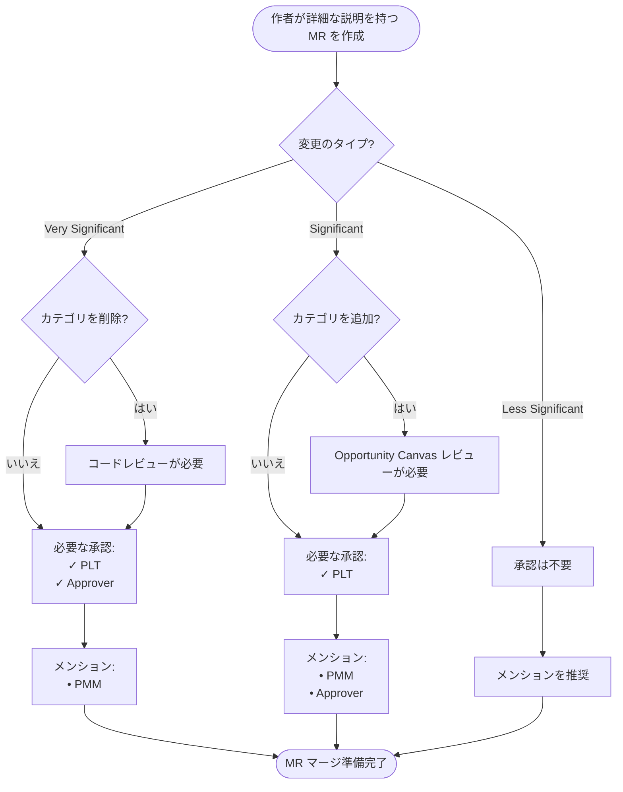
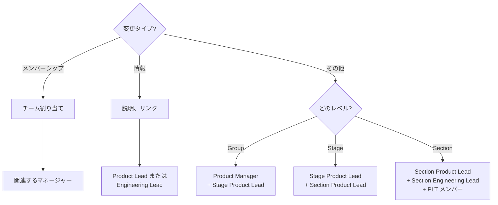

{}

## インターフェース {#interfaces}

私たちは、社内および幅広いコミュニティの双方で直感的なインターフェースを望んでいます。これにより、誰もが効率的に貢献したり質問に答えてもらったりできるようになります。したがって、以下のインターフェースは、本ページで定義する製品カテゴリに基づいています:

- [Home ページ](https://about.gitlab.com/)
- [Product ページ](https://about.gitlab.com/stages-devops-lifecycle/)
- [製品機能](https://about.gitlab.com/features/)
- [Pricing ページ](https://about.gitlab.com/pricing/)
- [DevOps ライフサイクル](https://about.gitlab.com/stages-devops-lifecycle/)
- [DevOps ツール](https://about.gitlab.com/why-gitlab/)
- [Product Direction](https://about.gitlab.com/direction/)
- [Stage Vision](https://about.gitlab.com/direction/#devops-stages)
- [ドキュメント](https://docs.gitlab.com/)
- [Engineering](/handbook/engineering/) Engineering Manager/Developer/Designer のタイトル、専門領域、部門、チーム名。
- [Product Manager](/handbook/product/) の責任。詳細は本ページに記載されています
- [私たちのピッチデック](https://gitlab.highspot.com/spots/615dd7e3911d70c4887812a7)。会社を説明するために使用するスライド
- [Strategic marketing](/handbook/marketing/brand-and-product-marketing/product-and-solution-marketing/) の専門分野

## 階層

カテゴリは階層を形成します:

1. **Section**: ステージの集合です。Dev、Sec、Ops のような共通のワークフローに沿って論理的に整合させようとしています。
Section は [`data/sections.yml`](https://gitlab.com/gitlab-com/www-gitlab-com/blob/master/data/sections.yml) で管理されています。
1. **Stage**: [`data/stages.yml`](https://gitlab.com/gitlab-com/www-gitlab-com/blob/master/data/stages.yml) で管理されています。
各ステージには、`gitlab-org` および `gitlab-com` グループ配下に対応する [`devops::<stage>` ラベル](https://docs.gitlab.com/development/labels/#stage-labels) があります。
1. **Group**: ステージは 1 つ以上の [グループ](/handbook/company/structure/#product-groups) を持ちます。
グループは [`data/stages.yml`](https://gitlab.com/gitlab-com/www-gitlab-com/blob/master/data/stages.yml) で管理されています。
各グループには、`gitlab-org` および `gitlab-com` グループ配下に対応する [`group::<group>` ラベル](https://docs.gitlab.com/development/labels/#group-labels) があります。
1. **Category**: グループは 1 つ以上のカテゴリを持ちます。カテゴリは、他社では単独の製品となりうるような高水準の機能群です。例えば
Portfolio Management のようなものです。可能な限り、私たちはカテゴリを [アナリスト](/handbook/marketing/brand-and-product-marketing/product-and-solution-marketing/analyst-relations/) が定義するベンダーカテゴリにマッピングすべきです。
カテゴリは [`data/categories.yml`](https://gitlab.com/gitlab-com/www-gitlab-com/blob/master/data/categories.yml) で管理されています。
各カテゴリには、`gitlab-org` グループ配下に対応する [`Category:<Category>` ラベル](https://docs.gitlab.com/development/labels/#category-labels) があります。
1. **Feature**: Issue の重みのような、小さく個別の機能です。一部の
共通機能は、責任者の PM をキーワードで見つけやすくするためにカッコ内に併記されています。
機能は [`data/features.yml`](https://gitlab.com/gitlab-com/www-gitlab-com/blob/master/data/features.yml) で管理されています。
[機能ラベル](https://docs.gitlab.com/development/labels/#feature-labels) を、[`data/categories.yml`](https://gitlab.com/gitlab-com/www-gitlab-com/-/blob/master/data/categories.yml?ref_type=heads) の `feature_labels` でカテゴリやグループに関連付けることが推奨されます。

注意:

- グループは、ステージ内のすべてのカテゴリと同じ大きさのスコープを持つこともあれば、1 つのカテゴリだけと同じ大きさのスコープを持つこともありますが、多くはステージの一部を形成し、そのなかにいくつかのカテゴリを持ちます。
- ステージ、グループ、カテゴリ、機能のラベルは、自動トリアージ
オペレーション [「カテゴリラベルからのステージおよびグループラベル推定」](/handbook/engineering/infrastructure-platforms/developer-experience/triage-operations/) で使用されています。
- 私たちはキャパシティに基づいてカテゴリを移動させません。顧客視点から論理的に適合するステージにカテゴリを置きます。何かが重要で、適切なグループにそのキャパシティがない場合は、そのグループの採用計画を調整するか、より早く到達するために [グローバル最適化](/handbook/values/#efficiency-for-the-right-group) を行います。
- 私たちにサイロはありません。あるグループが、別のグループが所有するカテゴリの中で何かを必要としている場合、進んで貢献してください。
- この階層は、有料機能と無料機能の両方を含みます。

### 命名

階層のある階層のスコープが、その上または下の階層と同じ場合、同じ名前を共有できます。

2 つ以上のカテゴリを持ち、かつステージ内の _すべて_ のカテゴリを持つわけではないグループの場合、グループ名は [固有の単語](/handbook/communication/#mecefu-terms) または、カバーするカテゴリの集約名でなければなりません。

ステージの文脈でグループを参照したい場合、「Stage:Group」と書けます。これはメール署名、職務名、その他のコミュニケーションで便利です。例えば、「Monitor Health」や「Monitor, Health」ではなく「Monitor:Health」とします。

新しいステージ、グループ、カテゴリに命名する際は、お客様や従業員を混乱させる可能性のある他の命名上の衝突がないか、ハンドブックとメインのマーケティングサイトを検索してください。明確さを推進し混乱を減らすため、可能であれば一意性が望ましいです。追加情報については [製品機能命名ガイドライン](/handbook/product/categories/gitlab-the-product/#factors-in-picking-a-name) も参照してください。

### より詳細な情報

このページにリストされるすべてのカテゴリは、ドキュメントページへのリンクを持つ必要があります。カテゴリは方向性ページとマーケティングページへのリンクを持つこともあります。カテゴリ名をアンカーテキストとして使用してカテゴリにリンクする場合 (例: ホームページのチャートから)、以下の階層に従って URL を使用するべきです:

マーケティングページにリンクします。マーケティングページがない場合、ドキュメントにリンクします。ドキュメントがない場合、方向性ページにリンクします。

### ソリューション

[ソリューション](/handbook/marketing/use-cases/) は複数のカテゴリで構成でき、通常はお客様の課題 (例えば、セキュリティとコンプライアンスのリスクを低減する必要性) や、アナリストが定義した市場セグメント (Software Composition Analysis (SCA) など) に合わせるために使用されます。ソリューションはまた、業界バーティカルに固有の課題 (例えば、金融サービス) や、セールスセグメント (例えば、SMB 対 Enterprise) に合わせるためにもよく使用されます。

ソリューションは通常、お客様の課題を表現し、GitLab の機能群がどのようにその課題に対応するために組み合わさるかを、私たちのソリューションを使用することのビジネス上のメリットとともに定義します。

アナリストが定義した市場セグメントは、必ずしも GitLab のステージやカテゴリと整合せず、しばしば複数のカテゴリを含みます。最も頻繁に出会うものを 2 つ挙げます:

1. Software Composition Analysis (SCA) = Dependency Scanning + License Compliance + Container Scanning
1. Enterprise Agile Planning (EAP) = Team Planning + Planning Analytics + Portfolio Management + Requirements Management

私たちは、一部のアナリストが SAST と Code Quality もこれらのカテゴリに含めるためにこの用語を使用しているにもかかわらず、[SCA を SAST および Code Quality を含むものとして定義しないことを意図的に決めています](https://gitlab.com/gitlab-com/www-gitlab-com/merge_requests/26897#note_198503054)。

### Capabilities

Capability は、ステージ、カテゴリ、または機能を指すことができますが、ソリューションは指しません。

### レイヤー

階層にレイヤーを追加することで詳細度は増しますが、以下の点でユーザビリティを損ねます:

1. [インターフェース](#interfaces) を最新に保つのが難しくなる。
1. 自動的に物事を更新するのが難しくなる。
1. 人を訓練・テストするのが難しくなる。
1. より多くのレベルを表示するのが難しくなる。
1. 推論し、反証し、議論するのが難しくなる。
1. ものをどのレベルに置くべきかを定義するのが難しくなる。
1. このページを最新に保つのが難しくなる。

私たちはこの階層を使って、Product および Engineering 組織内の組織構造を表現しています。
そうすることで、以下の目標に資します:

- 私たちのグループを DevOps ライフサイクルの一部として外部からも認識可能にすることで、ステークホルダーがどのチームがどのような作業を行うかを容易に理解できるようにする
- 内部的には、グループの数を妥当な数の安定したカウンターパートに保つことを確保する

その結果、カテゴリが利用可能なキャパシティを懸念してグループ間を移動することは、私たちのカテゴリへの編成のアンチパターンと見なされます。

階層を設計するとき、Section の数は小さく保つべきであり、[管理範囲](/handbook/company/structure/#management-group) の理由で会社が再編成する必要が生じたときにのみ増やすべきです。すなわち、各 Section はエンジニアリングディレクター 1 名とプロダクトディレクター 1 名に対応するため、追加は高コストです。ステージについては、DevOps ループの
ステージは [外部](https://en.wikipedia.org/wiki/DevOps_toolchain) のソースから決定されているため、まったく変更すべきではありません。いずれかの時点で
別の確立されたバケット分けに変更する、または独自に作成するかもしれませんが、それには真剣なクロスファンクショナルな議論が伴います。追加の価値
ステージは私たち独自の構造ですが、ループステージと価値ステージの組み合わせは、私たちがマーケティング、セールスなどで話す主要な
ステージであり、軽率に変更すべきではありません。他のステージは現時点ではマーケティングされていないため、より柔軟性があります。しかし、それでもできる限り
最小限に保つよう努めるべきです。多数のステージが乱立すると、製品のサーフェスエリア
について推論し、いつ/もしそのサーフェスエリアをマーケティングすると決めた場合に伝達するのが難しくなります。そのため、これらは Section と 1:1 に紐づけられ、私たちの組織構造に収まる最小限のステージ数になっています。例えば、
Growth は Enablement の単一グループでしたが、Growth のためにディレクター
層を追加することを決定したときに、専門グループを持つ Section に昇格しました。非 DevOps ステージ各々の下にあるさまざまなバケットは、
異なるグループとして表現されています。グループも非マーケティングの構造であるため、
組織的な目的に応じてグループの数を拡張します。各グループは通常、バックエンドエンジニアリングマネージャーとプロダクトマネージャーに対応するため、
追加は高コストでもあり、私たちはより整った階層のためだけにグループを作るのではなく、[管理範囲](/handbook/company/structure/#management-group) の観点から、または 1 人のプロダクトマネージャーが扱える範囲の限界から正当化される必要があります。

### カテゴリのステータス

カテゴリは、投資水準と開発作業のレベルが異なります。主に 4 つの投資ステータスがあります:

1. Accelerated - 翌年に追加投資を受ける、製品戦略のトップカテゴリ
1. Sustained - 翌年に新機能が追加されるカテゴリ
1. Reduced - スコープと野心が減らされるが、翌年も新機能は追加されるカテゴリ
1. Maintenance - 新機能が追加されないカテゴリ

通常、製品方向性ページは、年次の製品テーマと投資水準に基づいて、その会計年度におけるカテゴリの投資ステータスを透明性をもって示します。

## 変更

製品セクション、ステージ、グループ、カテゴリ、機能への変更は広範な影響を与えうるため、さまざまな承認と通知 (メンション) が必要です。

### 役割と責任 {#roles-and-responsibilities}

**MR 作者** は、説明に変更点の明確な [ローコンテキスト](/teamops/decision-velocity/#low-context-communication) な説明を含め、必要に応じて他の関連 Issue、ドキュメント、リソースへのリンクを含めることに責任を持ちます。
関連するチームメンバーからの明示的な承認は推奨されますが、関連する作業項目で承認していれば必須ではありません。
ただし、作者は MR 外で必要な承認を一覧化し、直接リンクする必要があります。
承認をリクエストする際、作者は必要な内容に基づいて承認者がマージも行うべきかを明確に述べる必要があります。

**Section、Stage、Group の承認者** は、関連するすべての変更が行われていることと、Section、Stage、または Group の決定が反映されていることを確認する必要があります。

**Category と Feature の承認者** は、製品全体、異なる Section、それらがお客様にどのように関連するかを一般的に理解している Product 内のチームで構成されるべきです。Pricing & Packaging チームは「Required Approver」としてこの責任を引き受けています。彼らは懸念があればフラグを立て、すべての [「Very significant」変更](#very-significant) が関連する PLT メンバーによって議論・承認されていることを確認することが期待されます。追加要件については、Required Approver はタスクが完了しているか、関連する Issue がリンクされているかを記述で確認する必要があります。

技術的な制約により、承認が [必須でない](#less-significant) 箇所には Strategy & Operations チームメンバーが追加のコードオーナーとして加えられています。

### 承認

承認に加えて、[通知](#notifications-of-changes) のリストも参照してください。

#### Category と Feature の変更

該当する部門/Section の PLT メンバーが承認し、[Category と Feature の必要な承認者](#roles-and-responsibilities) (上記セクション参照) のうち 1 名が、状況に応じて承認するか、または認識を持つ必要があります。

##### Very significant

**PLT + Required Approver の承認** が必要、認知のため PMM にメンション。

例:

1. カテゴリまたは機能の削除。コードレビューも完了する必要があります。[データ変更](https://gitlab.com/gitlab-com/www-gitlab-com/-/blob/master/.gitlab/issue_templates/Group-Stage-Category-Change.md#removing) と [コード変更](https://gitlab.com/gitlab-org/gitlab/-/blob/master/.gitlab/issue_templates/Group-Stage-Category-Change.md#categories-changes) のガイダンスを参照してください。
1. Tier-up (下位ティアから上位ティアへ移動)
1. Tier-down (上位ティアから下位ティアへ移動)

##### Significant

**PLT 承認** が必要、認知のため PMM と Required Approver にメンション。

例:

1. カテゴリの追加 ([opportunity canvas](/handbook/product/product-processes/#opportunity-canvas) レビューも経るべき)
1. 機能を別のカテゴリに移動

これらのケースでは、Strategy & Operations チームメンバーに承認を求めることもできます。

#### Less significant

承認は不要、メンションを推奨。

例:

1. 説明やリンクを更新
1. 機能ラベルを更新

これらのケースでは、Strategy & Operations チームメンバーに承認を求めることもできます。

#### Section、Stage、Group の変更

**メンバーシップ変更** (Section、Stage、または Group の一員が誰か) は、影響を受けるチームメンバーが直属する関連マネージャーが承認する必要があります。

**情報変更** (説明やリンクの更新など) は、関連する Product または Engineering Lead のいずれかから承認が必要です。

**Section、Stage、Group へのその他の変更** は、関連する Product Lead と 1 つ上のレベルが承認する必要があります:

1. Group: Product Manager、加えて Stage レベルの Product Lead
1. Stage: Stage レベルの Product Lead、加えて Section レベルの Product Lead
1. Section: Section レベルの Product Lead と Engineering Lead、加えて関連する Product Leadership Team (PLT) メンバー

Engineering 主導の Section、Stage、Group については、同様のことが Product Lead の代わりに Engineering Lead に対して当てはまります。

### 変更の通知 {#notifications-of-changes}

通知の一覧は [Group-Stage-Category-Change MR テンプレート](https://gitlab.com/gitlab-com/www-gitlab-com/-/blob/master/.gitlab/merge_request_templates/Group-Stage-Category-Change.md) に重複して記載されています。

{}
このセクションを更新する際は、テンプレートも更新してください。
{}

以下の人々を MR でメンションして認識してもらってください:

1. 影響を受ける Section の関連する Product Lead。すでに承認者になっていない場合
1. 影響を受ける Section の関連する Product Leadership Team (PLT) メンバー。すでに承認者になっていない場合
1. 関連する Engineering Lead、加えて「上の」Engineering Lead
   - 例えば、Group レベルの変更の場合、Group の Engineering Lead と Group が属する Stage の Engineering Lead をメンションします。
1. 影響を受ける Section の Engineering Lead
1. 関連する Product Marketing Manager
1. [テクニカルライティングのカウンターパート](/handbook/product/ux/technical-writing/#assignments-to-devops-stages-and-groups)
1. Technical Writing の Lead (Director)
1. UX Research の Lead
1. Product Design の Lead (Director)
1. Chief Design Officer
1. Chief Product and Marketing Officer
1. (Infrastructure) Platforms Engineering の Lead (VP)
1. Chief Technology Officer

影響を受けるすべての関連する Product _および_ Engineering リーダーをメンションすることが推奨されます。
例えば、Section の変更の場合、すべての Stage および Group レベルのリーダーをメンションします。
あるいは、他のコミュニケーションチャネルを通じてこれらの人々に認識してもらうことも選択できます。

### チームタグ

すべての Section、Stage、Group は、以下のものを表示するために 1 つ以上の `team_tags` を持つことができます:

1. 各グループのメンバーである IC
1. 一部のカウンターパート

`*_team_tag` の名前は [`data/sections.yml`](https://gitlab.com/gitlab-com/www-gitlab-com/blob/master/data/sections.yml) と [`data/stages.yml`](https://gitlab.com/gitlab-com/www-gitlab-com/blob/master/data/stages.yml) (Stage と Group の場合) に存在します。各チームメンバーの個別の `data/team_members/person/` YAML には、関連する `team_tags` エントリが含まれている必要があります。

命名を決定する際、各 team タグが一意であることを確認してください。例えば、`cs_team_tag` は `sre_team_tag` と異なる値である必要があります。これらが同じである場合、両方のタグを持つすべてのチームメンバーが表示され、リストが重複してしまいます。

例は [team members data README](https://gitlab.com/gitlab-com/www-gitlab-com/-/blob/master/data/team_members/person/README.md#team-tags) に示されています。

## DevOps Stage

{}

## 将来の Stage 候補

私たちは底のない [野心](/handbook/product/product-principles/#how-this-impacts-planning) を持っており、GitLab は DevOps ライフサイクルに新しい Stage を追加し続けると考えています。以下は、私たちが検討している将来の Stage の一覧です:

1. Data。[Meltano 製品](https://meltano.com/) を活用するかもしれません
1. Networking。[ネットワークのオープンソース標準](https://www.linux.com/news/5-open-source-software-defined-networking-projects-know/) の一部や、[Terraform networking provider](https://developer.hashicorp.com/terraform/language/providers) を活用するかもしれません
1. Design。私たちは今日すでに [Design Management](https://gitlab.com/groups/gitlab-org/-/epics/1445) を持っています

## その他の機能

このリストは、その他の機能を所有するチームを簡単に見つけられるようにするためのものです。
おそらく、以下のセクションを置き換えるために、機能をより簡単に検索できるようにすべきでしょう。

### Plan ステージのその他の機能

[Plan](/handbook/product/categories/#plan-stage) ステージ

#### Project Management グループ

[Project Management グループ](/handbook/product/categories/#project-management-group)

- 担当者 (assignees)
- マイルストーン
- 期限 (due dates)
- ラベル
- Issue の重み (issue weights)
- クイックアクション (quick actions)
- メール通知
- To-Do リスト
- リアルタイム機能

#### Knowledge グループ

[Knowledge グループ](/handbook/product/categories/#knowledge-group)

- Markdown 機能
- リッチテキストエディタ

### Create ステージのその他の機能

[Create](/handbook/product/categories/#create-stage) ステージ

#### Code Review グループ

[Code Review グループ](/handbook/product/categories/#code-review-group)

- [マージリクエスト](https://docs.gitlab.com/user/project/merge_requests/)
- [GitLab CLI](https://gitlab.com/gitlab-org/cli)

#### Remote Development グループ

[Remote Development グループ](/handbook/product/categories/#remote-development-group/)

- [Visual Studio Code 用 GitLab Workflow 拡張機能](https://docs.gitlab.com/editor_extensions/visual_studio_code/)

### Verify のその他の機能

#### CI グループ {#ci-group}

[CI グループ](#ci-group)

- [CI Abuse Response](https://gitlab.com/gitlab-com/www-gitlab-com/-/issues/11678)

#### Pipeline Authoring グループ {#pipeline-authoring-group}

[Pipeline Authoring グループ](#pipeline-authoring-group)

- [CI/CD テンプレート管理とコントリビューション](https://docs.gitlab.com/development/cicd/templates/)

### Analytics ステージのその他の機能

[Analytics ステージ](/handbook/product/categories/#monitor-stage)

### Developer Experience のその他の機能

[Developer Experience](/handbook/engineering/infrastructure-platforms/developer-experience/)

- [Reference Architecture](https://docs.gitlab.com/administration/reference_architectures/)
- [GitLab Environment Toolkit (GET)](https://gitlab.com/gitlab-org/gitlab-environment-toolkit)
- [GitLab Performance Tool (GPT)](https://gitlab.com/gitlab-org/quality/performance)
- [Performance Test Data](https://gitlab.com/gitlab-org/quality/performance-data)
- [Zero Downtime Testing Tool](https://gitlab.com/gitlab-org/quality/zero-downtime-testing-tool)
- [GitLab Development Kit (GDK)](https://gitlab.com/gitlab-org/gitlab-development-kit)

内部のお客様: [Gitaly](/handbook/engineering/infrastructure-platforms/tenant-scale/gitaly/)、[SaaS Platforms セクション](/handbook/engineering/infrastructure-platforms/)、[Infrastructure 部門](/handbook/engineering/infrastructure/)、[Support 部門](/handbook/support/)、[Customer Success](/handbook/customer-success/)

### Analytics のその他の機能

[Analytics](/handbook/product/categories/#analytics-stage)

#### Product Analytics グループ

[Product Analytics グループ](/handbook/product/categories/#product-analytics-group)

- [Analytics Dashboards](https://docs.gitlab.com/user/product_analytics/#product-analytics-dashboards) - 多くのグループが可視化を追加したり、ユーザーに事前構成済みのダッシュボードを提供するために使用しています

### Facilitated functionality

一部の製品領域は、複数のステージにまたがる広範な影響を持ちます。例として以下があります (他にもあります):

- [プロジェクト](https://docs.gitlab.com/user/project/#projects) の概要や設定ページのような、共有のプロジェクトビュー。
- 特定のステージに属する機能に紐付かない、[管理者エリア](https://docs.gitlab.com/administration/settings/) に固有の機能。
- 私たちのデザインシステム [Pajamas](https://design.gitlab.com/) を通じて利用可能な UI コンポーネント。
- Product Analytics、Value Stream Analytics などの分析を表示するためのダッシュボード。

これらの領域のメンタルモデルは特定のステージグループによって保守されていますが、それらのチームが確立したガイドラインの中で、誰もが貢献することが推奨されます。例えば、誰でも Settings の確立されたガイドラインに従って新しい設定を貢献できます。ガイドラインに沿わない貢献が提出された場合、私たちはマージして「フィックスフォワード」することでイノベーションを奨励します。

facilitated 領域に該当する Issue に遭遇した場合:

- ガイドラインの更新に関連する Issue については、facilitating グループの `group::category` ラベルを適用してください。
- facilitated 領域に関連するコンテンツの追加に関連する Issue については、最も近い関連グループの `group::category` ラベルを適用してください。例えば、マージリクエストに関連する新しい設定を追加するときは、`group::source code` ラベルを適用します。

### 共有責任機能

特定の製品能力には、その性質上、基盤的なものがあり、横断的にアーキテクチャのコンポーネントに影響したり関連するものがあり、機能グループとステージにまたがる影響を持ちます。

これらの能力は、メンタルモデルが特定のグループによって所有される一方で、誰でも貢献できる「Facilitated Functionality」(上記のセクションを参照) を指すこともあります。ただし、いずれの特定のグループの製品カテゴリの管掌にも明確に当てはまらないため、明確な所有者がいないものもあります。この最たる例は、組織全体の複数または全グループで使用される基礎的コンポーネント、フレームワーク、ライブラリの改善や進化に関連する Issue です。別の例としては、過去の特別タスクグループによって作成されたコンポーネントで、そのグループが解散し、それらを保守する専任の永続的なグループへの資金を正当化するための継続的な開発を必要としなかったものが考えられます。

機能の出所が何であれ、これらのコンポーネントを「所有者がいない」と考えるのではなく、共有責任のレンズを通して全員によって所有されていると考えることが重要です。「共有責任」とは、すべてのグループがそれらの継続的な保守、改善、イノベーションに **貢献** することにコミットし、責任を持つべきであるという意味です。

この文脈における **貢献** は、さまざまな形で現れることがあります:

- 異なる機能や異なる階層のステークホルダーとの会話を調整し、適切な所有者および/または適切な優先度を見つけるトリアージ。
- 要件文書および/またはモックアップで実装の詳細を肉付けする、プロダクト機能のスコープ設定と UX デザイン。
- 実装に向けた技術的・アーキテクチャ的アプローチの可能性に対する、技術スコープ設定と実現可能性分析。
- 実際の実装とリリース活動。

ただし、これは単一のグループがこれらすべての活動を必ずしも単独で担当すべきだという意味ではありません。複数のグループが実行で協業することもあり得ます。ただしこの調整には、単一の [DRI](/handbook/people-group/directly-responsible-individuals/) がこれらの活動を調整する Issue トラッカーにおける、共有責任 Issue の注意深いトリアージが必要です。

詳細については [Quality 部門ハンドブックのこのセクション](/handbook/product-development/how-we-work/issue-triage/#shared-responsibility-issues) をレビューして、これらのタイプの Issue をトリアージする分散型アプローチについて学んでください。

### カテゴリ A-Z

<!-- カテゴリインデックスの内容を編集するには、こちらを参照してください: https://gitlab.com/gitlab-com/www-gitlab-com/-/blob/master/data/stages.yml -->


