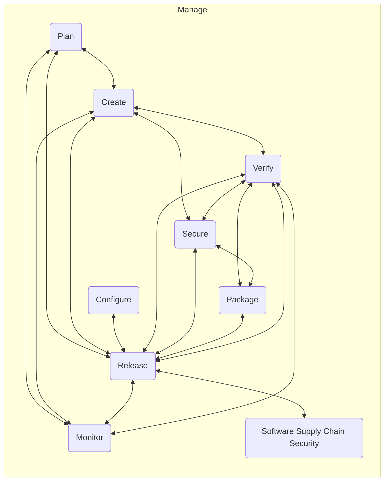

## シングルアプリケーション

GitLab は[完全な DevOps プラットフォーム](https://about.gitlab.com/solutions/devops-platform/)であり、プロジェクト計画やソースコード管理から CI/CD、モニタリング、セキュリティに至るまで、すべてを行うシングルアプリケーションとして提供されます。シングルアプリケーションの利点は、以下の段落に記載されています。

シングルアプリケーションを提供することで、サイクルタイムを短縮し、生産性を高め、顧客に価値を生み出します。

他のベンダーは、自分で組み立てなければならないキット飛行機を提供しますが、GitLab は型式証明された航空機です。

### シングルアプリケーション vs 複数アプリケーション

たとえば、複数の DevOps ツールから GitLab に転換したある企業顧客の経験は次のとおりでした。

- 開発者が変更に取り組むことを選択してから本番に反映されるまでの経過時間が 9 分の 1
- 購買が購入する、IT がインストールする、ユーザーが認証する必要のある個別のツールが 10 分の 1
- ハンズオンキーボードタイムが 4 分の 1、人々が行うタスクが 4 分の 1 となり、生産性が向上
- 関与する必要のある異なるチームが 5 分の 1、チーム間の引き渡しが 4 分の 1 となり、生産性が向上し、価値実現までの時間がより予測可能に

### 1 つのアプリケーションと多数のアプリケーションは、ワークフローにどのような影響を与えますか?

[データフローとソースデータ](dataflow.html)

### 単一認証

1 つのアプリケーションにログインするだけです。ユーザーはログインに時間を浪費しません。1 つのアカウントだけをセットアップすればよく、ユーザーはどのアカウントを使うべきかが明確です。混乱が少ないため、フィッシングが困難になります。

### 単一認可

GitLab では、各ツールの認可を管理する必要はありません。これは、一度権限を設定すれば、組織内の全員がすべてのコンポーネントに対して適切なアクセス権を持つことを意味します。

### 単一プロジェクト

ユーザーは複数のアプリケーションにまたがるプロジェクトをセットアップしたり、他の人にセットアップを依頼したりする必要がありません。これは大きな遅延の原因となり得ます。

### 単一セットアップ

[Auto DevOps](https://docs.gitlab.com/topics/autodevops/) を使えば、新しいプロジェクトには最初から必要なテストとデプロイメントがすべて備わっています。また、ロギングとセキュリティスキャンを自動的に実施することで、リスクを軽減できます。

### 単一インターフェース

すべてのツールに対する単一のインターフェースは、GitLab が常に関連するコンテキストを表示できることを意味します。関連して、機能は常に最も最適な場所にあります。
新しい機能を提供するために新しいページを作成する必要はありません。機能は、最も適切に設計された既存の場所に表示され、ナビゲーションが簡素化されます。

また、異なるインターフェース間で常にコンテキストスイッチを行うことで情報を失うこともありません。

ユーザーはアプリケーション間を常に切り替える必要がありません。
さらに、GitLab の一部に慣れていれば、すべて同じインターフェースコンポーネント上に構築されているため、GitLab のすべてに慣れていることになります。

### 単一インストール

GitLab を実行するということは、インストール、メンテナンス、スケール、バックアップ、ネットワーキング、セキュリティ確保するべき単一のアプリケーションだけがあることを意味します。

### 単一アップグレード

GitLab を更新するということは、すべてが以前と同じように動作することが保証されていることを意味します。
別々のコンポーネントをメンテナンスすると、アップグレードによって統合ポイントが変更または破壊され、本質的にソフトウェア配信パイプラインが壊れることがしばしば複雑化します。
GitLab ではこれが決して起こりません。なぜなら、すべてが統合された全体としてテストされているからです。

### 単一データストア

GitLab は単一のデータストアを使用しているため、ソフトウェア開発ライフサイクルの一部ではなく全体に関する情報を取得できます。複数のアプリケーションでは、複数のデータベースだけでなく、異なる定義やプロセスも持つことになります。複数のデータストアは、冗長で一貫性のないデータにつながります。データを重複させたり手動で入力したりする必要はありません。データウェアハウスを構築することなく、単一の信頼できる情報源があります。

### 単一概観

環境、コード、Issue、エピック間の自動リンクは、プロジェクトの状態と進捗のより良い概観を提供します。すべての情報はリアルタイムであり、概念と定義の一貫したセットがあります。

### 単一フロー

シングルアプリケーションを使用するということは、10 個の異なるプロダクトを統合する必要がないことを意味します。これにより、開発者の時間が節約され、リスクが軽減され、信頼性が向上し、外部統合者への請求が減ります。フローは、貢献して素晴らしいものにするために同じフローを使用する 10 万を超える組織と 2,000 人を超える GitLab を使用する人々にとって、より良いものとなります。開発者ツール部門がある場合、彼らは今、開発者をより効果的にするために他のタスクに集中できます。

### 単一ベンダー

互いを指し示す複数のベンダーではなく、1 つのベンダーと取引できます。

### 単一トレーニング

エンドユーザートレーニングはより複雑でなくなります。マルチベンダー環境は、管理するべき複数のトレーナーを意味します。

### 単一コードベース

私たちは、以下の理由からサービスのネットワークやプラグインの提供ではなく、シングルアプリケーションを提供することを好みます。

1. シングルアプリケーションは、[Stratechery のこの記事](https://stratechery.com/2013/clayton-christensen-got-wrong/)で詳述されているように、モジュラーアプローチよりも優れたユーザー体験を提供すると考えています。
1. GitLab のオープンソースの性質により、優れたオープンソースプロダクトを組み合わせることができます。
1. 誰もが、[他のツールよりも完全な](https://about.gitlab.com/why-gitlab/)機能セットを作成するために貢献できます。私たちは、より良いユーザー体験を作るために、すべてのパーツが上手く連携することに集中します。
1. GitLab はオープンソースであるため、機能拡張は外部にとどまることなく、[コードベースの一部](https://docs.gitlab.com/user/project/integrations/)になります。これにより、すべての機能の自動テストが継続的に実行され、追加が機能し続けることが保証されます。これは、更新されないかもしれない外部メンテナンスのプラグインとは対照的です。
1. 機能拡張がコードベースの一部であることはまた、変更が難しくリファクタリングに抵抗する API に縛られるのではなく、GitLab が追加とともに進化し続けることを保証します。リファクタリングは、貢献しやすいコードベースを維持するために不可欠です。
1. 多くの人が GitLab をオンプレミスで使用しており、そのような状況では、1 つのツールをインストールする方が、多くのツールをインストールして統合するよりもはるかに簡単です。
1. GitLab は、複雑な購買プロセスを持つ多くの大組織で使用されており、1 つのサブスクリプションだけを購入すればよいことで、彼らの購買が簡素化されます。

## シングルアプリケーションの創発的利点

DevOps ライフサイクル全体にわたるシングルアプリケーションには、独自の創発的な利点があります。

- 個別のツールごとにアクセスを要求する必要がなくなり、誰もがすべてのツールを使用できるようになります。エンジニアでない人々がデプロイをモニタリングし、開発プロセスをフォローし、調査結果を報告することで QA に直接貢献することを期待してください。
- 大幅に改善されたサイクルタイム。絶え間ないコンテキストスイッチ、再認証、情報の不足は、チームを大幅に遅らせます。当たり前のことのように聞こえますが、必要なすべてが常に利用可能であることは、より効率的な作業につながります。
- 変更が作業中であるか、環境でライブであるか、ブロックされているかを追跡することは、もはや探偵仕事を必要としません。これはどこでも利用可能であり、誰もがアクセスできます。

これは、GitLab が代表的なベンダーと考えられている、アナリストが指定した[Value Stream Delivery Platforms](https://about.gitlab.com/press/releases/2021-11-03-gitlab-inc-named-a-representative-vendor-in-new-gartner-market-guide/)の利点によって強調されています。

その他の例の利点には、以下が含まれます。

### CI とコンテナレジストリ

CI からコンテナレジストリへのプッシュ: GitLab 以前は、これには別のレジストリでプロジェクトとユーザーアカウントを作成する必要があり、各ジョブで CI とレジストリ間で認証情報を渡す必要がありました。GitLab では、これらは一切必要ありません。GitLab はあなたが誰で、そのプロジェクトで何を認可されているかを知っているからです。

### 問題のデバッグ

すべての決定、コード、変更、デプロイが同じ場所で行われ、Issue とマージリクエストにリンクされているため、GitLab はすべての決定、変更、デプロイの完全な監査ログを持っています。したがって、何かがうまくいかない場合、Issue の原因を発見することは簡単で、複数のアプリ、チーム、ログを確認する必要はありません。

### マージリクエストからのモニタリング

マージリクエストをマージすることで変更をデプロイします。GitLab にはモニタリングが組み込まれているため、たとえばエラー率が増加したことをマージリクエストで表示できます。担当の開発者は正しいコンテキストでこれを確認し、すぐに Issue の解決を開始できます。

## 複数のツールを統合する必要なし

複雑なツールチェーンを使用する企業は、しばしば[20 人がすべての相互接続を管理する必要がある](https://about.gitlab.com/customers/)のに対し、1 人で GitLab を管理する同じ作業を行うことができます。以下は、ツール間で必要なさまざまなインテグレーションのリストです。

1. Issue トラッキング <=> カンバンボード、同じ Issue を表示することが好ましい。
1. Issue トラッキング <=> バージョン管理、ブランチでコードをマージしたら Issue をクローズ。
1. Issue トラッキング <=> コードレビュー、コードレビューは関連する Issue へのリンクを持つ。
1. Issue トラッキング <=> CD/リリース自動化、どの変更がどのデプロイで実装されているか/ライブで、どこにあるかを確認。
1. Issue トラッキング <=> モニタリング、イニシアチブをメトリクスへの影響にリンク。
1. カンバンボード <=> バージョン管理、ブランチでコードをマージしたら Issue をクローズ。
1. バージョン管理 <=> コードレビュー、コードレビューは更新されたブランチで行われる。
1. バージョン管理 <=> 継続的インテグレーション、デフォルトブランチで CI を自動的に実行し、ブランチごとに CI ステータスを確認。
1. バージョン管理 <=> CD/リリース自動化、特定のコミットがどこかでライブかどうかを確認。
1. バージョン管理 <=> セキュリティテスト、コミットに脆弱性があるか/古い依存関係があるかを確認。
1. コードレビュー <=> 継続的インテグレーション、コードレビュー画面でテスト結果を確認。
1. コードレビュー <=> セキュリティテスト、コードレビュー画面でテスト結果を確認。
1. コードレビュー <=> CD/リリース自動化、コードレビュー画面で新しい環境へのプッシュを確認・制御。
1. コードレビュー <=> モニタリング、コード変更のメトリクスへの影響を確認。
1. 継続的インテグレーション <=> セキュリティテスト、CI の一部としてセキュリティテストを実行。
1. 継続的インテグレーション <=> コンテナレジストリ、ビルドされたコンテナをレジストリにプッシュ。
1. 継続的インテグレーション <=> CD/リリース自動化、グリーンならデプロイ、レッドならデプロイしない。
1. 継続的インテグレーション <=> 構成管理、テストを構成。
1. セキュリティテスト <=> CD/リリース自動化、安全でないコードのデプロイを防止。
1. セキュリティテスト <=> コンテナレジストリ、コンテナレジストリをスキャン。
1. コンテナレジストリ <=> CD/リリース自動化、コンテナをプル。
1. CD/リリース自動化 <=> 構成管理、デプロイメントを構成。
1. CD/リリース自動化 <=> モニタリング、モニタリングでリリースを確認。
1. 構成管理 <=> モニタリング、モニタリングを構成。

### フローチャート

以下は、上記で指定したツール間で必要なさまざまなインテグレーションのフローチャートの図です。

### セキュリティ上の利点

[集約ロギングを追加した](https://gitlab.com/gitlab-org/gitlab-ee/issues/3711)後、DevOps ライフサイクル全体のシングルアプリケーションだけが提供できるセキュリティ機能のいくつかに進むことができます。

1. Nginx から Elastic Search への完全なリクエスト (ヘッダー、ペイロード、cookie) をログ記録し、侵入検知システム (IDS) の基礎を形成し、完全なサイトマップを提供します。`client_body_in_file_only` のようなものを使えるでしょうし、SSL キーを使えるので [MITM プロキシ](https://mitmproxy.org/)のようなものは必要ありません。
1. ログインや、最終リクエストが可能になる前の新しいオブジェクトの作成など、時間の経過に伴う複数のリクエストを含む完全なセッションをログ記録します。
1. [wfuzz](https://github.com/xmendez/wfuzz) のようなものと [seclists](https://github.com/danielmiessler/SecLists) のようなコンテンツでペイロードまたはヘッダーを変更し、レビューアプリに対して実行し、どの http ステータスのリターンが 2xx から 5xx に変わるか、および/または [SQL 文字列エスケープ](https://github.com/thlorenz/sql-escape-string)を実施できる場所を確認します。最も可能性の高い脆弱性から始まるソート済みリストを表示します。
1. 上記のファジングペイロードを実行する際に、ランタイムアプリケーション自己保護でアプリケーションをインストルメントすることで、それらが新しいコードパスにヒットするかどうかを確認し、GitLab CI で実行されるユニットテストでカバーされているコードパスが最も少ないものでソートします。
1. すべての[エラートラッキング](https://gitlab.com/gitlab-org/gitlab-ee/issues/5686)レポートには、その状態を生成するためのそのユーザーセッションのすべてのリクエストが含まれます。
1. 誰かが脆弱性レポートを送信した場合、これを[エラートラッキング](https://gitlab.com/gitlab-org/gitlab-ee/issues/5686)に保存された 500 エラースタックトレースと組み合わせます。
1. ファジングまたは人間が脆弱性にヒットしたとき、リクエストを含む [pcap ファイル](https://en.wikipedia.org/wiki/Pcap)を生成し、本番トラフィックのスキャンを開始します。

### より低い運用費用 (OpEx)

複数の個別ポイントツール間の統合の構築とメンテナンスには、追加の明示的および隠れたコストが伴います。

#### 明示的コスト

[複数のツールのライセンスとサポート](https://about.gitlab.com/calculator/)に対する支払いの明示的なコストは、シングルアプリケーションよりも高いです。シングルアプリケーションは、固定費が機能全体に分配されるため、より低い料金を請求できます。一方、別々のベンダーはそれぞれのソリューションに対してこれらのコストを自分で支払う必要があります。

#### 隠れたコスト

ツールチェーンを管理する企業は、ツールチェーンの構築とメンテナンスに必要なエンジニアリング時間を、差別化された価値を提供するビジネスロジックを持つソフトウェアを書くために使う代わりに、隠れた運用コストとして支払います。大企業では、これは[20 人のエンジニアと 1 人のエンジニアの違い](/handbook/marketing/brand-and-product-marketing/product-and-solution-marketing/)を意味する可能性があり、あなたのツールをメンテナンスするためです。

### さらなる例

1. 計画 (コードマージは Issue をクローズしエピックを更新する) - 異なるプロジェクト間で常に最新
1. Issue ボードから Issue トラッカーへの移動 - カンバンボードは Issue トラッカーと一貫している
1. 新しい開発者のためにスタックを動作させる - セットアップ時間やヘルプなしで開発を始められる
1. マージリクエストにはモニタリング、セキュリティなどの情報が含まれる - MR でテスト、品質、パフォーマンス、ブラウザパフォーマンス、アーティファクト、議論、環境、ロールバックの概要を確認できる
1. セキュリティ (別々ではなく並行してセキュリティ) - セキュリティテストの結果を集約できる
1. 脆弱なアプリケーションを迅速に特定し、修復を自動化する
1. ビルドされたアプリケーションをコンテナレジストリに追加する - コンテナレジストリでプロジェクトをセットアップし認証情報を渡す必要がない
1. CI ビルドからアーティファクトを見つける必要がある - アーティファクトはどのマージリクエストからも直接アクセス可能
1. アプリケーションのレビュー - QA テストはすぐに作業を開始できる
1. 何も構成することなく CI/CD/セキュリティ/品質を実行する - 1 クリックで本番にデプロイ
1. コンテナ化されたアプリケーションをスケールアップする必要がある - スケールアップとダウンは、意思決定に必要なすべての関連データとともに、プロジェクト内のもう 1 つのボタンに過ぎない
1. プロジェクトがコンテナ化を採用する - 新しいサーバーは Kubernetes 経由で自動的にプロビジョニングされる
1. 人間の介入なしに失敗したデプロイメントを自動的にロールバックする
1. アクティビティフィードは、DevOps ライフサイクル全体にわたり、すべてのプロダクトカテゴリにまたがる
1. サイクルタイム (リアルタイムで統合) - DevOps ライフサイクル全体のアクティビティを表示できる
1. 権限レベルと設定 - ユーザー権限はすべてのアプリケーションで一貫している
1. 監査ログ - 監査ログで人がライフサイクル全体で何ができたか
1. Geo は SCM だけでなく、CI、CD、Issue トラッキングも行う - 他の場所にいる人々は、リポジトリだけでなく DevOps ライフサイクル全体に迅速にアクセスできる
1. 10 種類の異なるアプリケーションよりも管理しやすい - ライフサイクルの 1 つのステップへの更新のためにアクティビティ間のフローが壊れない
1. 新しいマイクロサービスプロジェクトを開始する - プロジェクトにはすべてのツールが含まれており、このプロジェクトが他のツールでどのように名付けられているかを調べる必要がない
1. 新しい人が組織に参加する - ユーザーは、チケットを作成して待つことなく、自分の役割に関連するすべてのツールに自動的にアクセスできる

### 会話型開発

会話型開発は、各ステップでゲートキーパーを巻き込みながら、DevOps ライフサイクルを通じて部門やチーム間で会話を運びます。GitLab のような統合ソリューションでのみ可能な機能である関連コンテキストを提供することで、サイクルタイムを短縮し、問題の診断と意思決定を容易にできます。

具体的には、GitLab における会話型開発は、変更が着想からパフォーマンスとビジネスメトリクスへの変更まで容易に追跡でき、この情報を *すべての* ステークホルダーに *即座に* フィードバックできることを意味します。

これにより、効果的にクロスファンクショナルチームがコラボレーションできます。

### Review Apps

Review Apps は変更レビューの未来です。コードだけでなく、ライブ環境での実際の変更をレビューできます。これは、開発環境で変更を検証するためにローカルでコードをチェックアウトする必要がなくなり、環境リンクをクリックするだけで試してみることができることを意味します。

コードレビューを CI/CD パイプラインおよびコンテナスケジューラー (Kubernetes) との統合と組み合わせたツールのみが、Review Apps を迅速に作成・シャットダウンし、レビュープロセスの一部にすることができます。

### Cycle Analytics

Cycle Analytics は、計画からモニタリングまでの価値実現までの時間がどうなっているかを教えてくれます。GitLab がソフトウェア開発ライフサイクルの各ステップに直接アクセスすることによってのみ、価値実現までの時間に関する実行可能なデータを提供できます。

これは、どこで遅れているかを確認し、より速く出荷するための有意義な変更を行うことができることを意味します。

### コンテナレジストリと CI の統合

すべての GitLab プロジェクトにはコンテナレジストリが付属しています。これは、CI でコンテナイメージを使用したりプッシュしたりするために、複雑な構成が必要ないことを意味します。むしろ、CI 構成ファイル (`.gitlab-ci.yml`) で[事前定義された](https://docs.gitlab.com/user/packages/container_registry/)変数を使用するだけです。

### ユースケース、モジュールではない

ユーザーは時々、GitLab に特定の機能セットを含む特定のモジュールがあるかどうか尋ねます。モジュール思考は、狭く焦点を絞ったソリューションや、冗長な機能と抽象化につながります。GitLab は、GitLab の多くの部分に関わる可能性のあるユースケース全体を、追加の不必要な複雑さを生み出すことなく解決するシングルアプリケーションです。

### 既存の機能とデータは時間とともに価値を蓄積する

GitLab の幅が広がっても、シングルアプリケーションとしてメンテナンスされるため、新しい機能は継続的に既存の機能にバックインテグレートされます。これは、既存の機能とそれらが時間とともに既に生成したデータが、新しい機能とそれらのユースケースのコンテキストで、非常に低いコストで新しい価値を蓄積することを意味します。

## DevOps プラットフォーム統合へのトレンド

Microsoft の 2018 年の [GitHub 買収](https://blogs.microsoft.com/blog/2018/10/26/microsoft-completes-github-acquisition/)に続いて速いペースで進む、DevOps 企業の統合トレンドは定着しているようです。2019 年 1 月、[Travis CI が Idera に買収](https://techcrunch.com/2019/01/23/idera-acquires-travis-ci/)され、2019 年 2 月には [Shippable が JFrog に買収](https://techcrunch.com/2019/02/21/jfrog-acquires-shippable-adding-continuous-integration-and-delivery-to-its-devops-platform/)されました。Atlassian と GitHub は今、両方とも SCM と CI/CD を一緒に提供しており、関連する製品の絶え間ない成長するスイートも提供しています。2020 年 1 月、[CollabNet が XebiaLabs を買収して、包括的な DevOps ソリューションのバージョンを構築](https://www.tpg.com/news-and-insights/collabnet-versionone-and-xebialabs-combine-create-integrated/)しました。

技術市場が成熟するにつれて段階を経るのは自然なことです: 若い技術が最初に普及しているとき、それをサポートするツールの爆発的増加があります。新しい技術には、使いにくい粗削りなところがあり、初期のツールは新しいパラダイムの採用を中心としがちです。技術が成熟すると、統合はライフサイクルの自然な部分です。GitLab はすでにこの[新しく定義された市場](https://about.gitlab.com/analysts/gartner-vsdp21/)の代表的なベンダーと考えられているため、統合の先を行く素晴らしいポジションにありますが、より多くの競合他社が正当に統合されたプロダクトを市場に出し始めるにつれて、積極的に守る必要があるポジションです。
