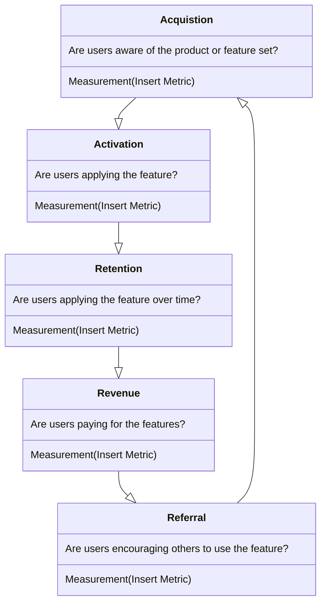
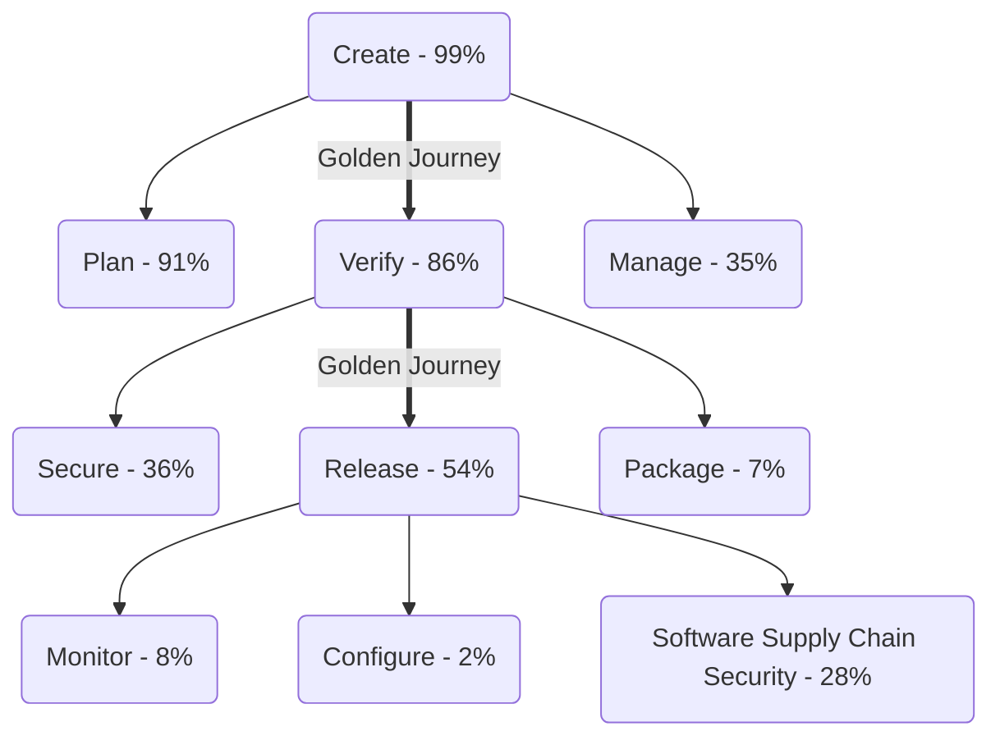

{}

## 私たちのプロダクト原則

これらは、カスタマー中心のイノベーションを通じて世界クラスのプロダクトを提供すると私たちが信じる中核的な原則です。私たちの目標は、カスタマーの声を中核に置きながらこれらの原則を育む実践を構築することです。私たちが行うすべてはカスタマーのためのものであり、カスタマーが安全なソフトウェアをより速くカスタマーや社内ユーザーに提供することに成功したときにのみ、私たちは成功します。

1. **私たちは customer zero であり、したがって自分たちのプロダクトを使う：** プロダクトに入れるものはすべて、自分や Engineering チームが日々の業務の一部として使う機能であるべきです。答えが No なら、「なぜ」を問い直しましょう。カスタマーにより大きなインパクトを与えるより良いソリューションがあるかもしれません。
1. **私たちは唯一のカスタマーではない：** 私たちが行うすべてはカスタマーのためのものなので、できるだけ多くカスタマーと会いましょう。自分たちの使用とドッグフーディングを通じてカスタマーを理解していると仮定するのは魅力的ですが、それでは限界があり、間違っているかもしれません。戦略的なユーザーリサーチ、カスタマーインタビュー、フィードバックセッションを通じて仮定を検証しましょう。
1. **私たちはデザイン主導：** Engineering と協力してどんなカスタマー痛点を解決しても、カスタマーに提供されるものが使いづらい（または使うのがほぼ不可能）であれば意味がありません。私たちは非常に技術的なプロダクトを持っているので、ユーザー体験は最優先事項です。しかし、DevSecOps に新しい人がすぐに始められる程度に簡単であるべきです。これには、オンボーディングから GitLab を活用した安全なソフトウェアの出荷までのすべてが含まれます。
1. **私たちはベロシティよりも品質を重視する：** チームが定義されたベロシティを達成することを担保するために、不完全な機能や capability をデリバリーすることは受け入れられません。カスタマーに出荷するものはすべて、ユーザー検証済みで、バグがなく、セキュリティ脆弱性を導入せず、GitLab.com 規模を達成でき、ドキュメントを含み、すべてのカスタマーデプロイメント選択肢で同時に利用可能でなければなりません。ベロシティを優先して追加の技術的負債を積むことも受け入れられません。これは、可用性、スケーラビリティ、信頼性、セキュリティに関する将来の品質問題につながるためです。
1. **私たちは直感や逸話よりもデータを重視する：** 私たちが構築するすべては、カスタマーに価値を提供していることを担保するために追跡できる成功メトリクスを持つ必要があります。ローンチではなくアウトカムを測定し、これは実験と適切な計装によってのみ可能です。すべての機能は計装される必要があり、成功メトリクスを追跡できるようにし、プロダクト使用を通じて計画の調整を行えるようにします。
1. **私たちは早く失敗し、意図を持ってイテレートする：** カスタマーのユースケースまたは痛点に対処する方法に関する仮説を定義し、問題検証を通じて素早く検証（または無効化）します。問題検証サイクルの結果を取り入れ、ユーザビリティと品質に焦点を当ててそれを提供するためのイテレーション戦略を構築します。各イテレーションでソリューション検証を通じて仮説を再検証し、必要に応じて計画を調整できるようにします。問題検証とソリューション検証は、カスタマーの声が意思決定の鍵であることを担保します。
1. **私たちは、ガイドされていない体験よりもプロダクト主導の成長を信じる：** 私たちのプロダクトは GitLab の最高のセールスチームメンバーであり、自身の最大のチャンピオンであるべきです。カスタマーが、使用、取ったアクション、または設定の選択に基づいて、より多くの価値があることを知れる機能発見の瞬間を可能にします。カスタマーがプロダクトの capability をより多く採用するほど、彼らが体験する投資収益が増え、より多くの社内 GitLab チャンピオンが生まれます。
1. **私たちは勝つことが好き…そして勝つのはチームとしてのみ：** 私たちは、カスタマーが GitLab で安全なソフトウェアをより速く正常に出荷できるときに勝ちます。これには、Product Management、UX Research、Product Design、Technical Writing チーム間で Product 内の実行とコラボレーションの最高レベルを自分たち自身に保つことが必要です。Product 内のチームワークは必要ですが、十分ではありません。R&D と GTM にわたるクロスファンクショナルなチームメンバーとの同じレベルの実行とコラボレーションも要求されます。グローバルな GitLab チームとして、私たちは Results for Customers を推進できます。

## 私たちが原則に従う方法

### コラボレーションの実現

開発チームからマーケティング組織まで、誰もがデジタルコンテンツでコラボレーションする必要があります。コンテンツは、多数の潜在的なコントリビューターからの提案にオープンであるべきです。オープンコントリビューションは、マージ可能なファイル形式と分散バージョン管理を使うことで達成できます。[GitLab のミッション](/handbook/company/mission/#mission) は、人々が効果的に協力し、より速くより良い結果を達成できるよう、**誰もがすべてのデジタルコンテンツでコラボレーションできるようにする** ことです。

### アイデアを現実にする

アイデアは、実現するまでに多くのステージを流れます。アイデアはチャット議論から生まれ、Issue が作成され、スプリントで計画され、IDE でコーディングされ、バージョン管理にコミットされ、CI でテストされ、コードレビューされ、デプロイされ、監視され、文書化されます。これらすべての DevOps ライフサイクルのステージをつなぎ合わせる方法はさまざまです。異なるベンダーのプロプライエタリアプリのマーケットプレイスを持つことも、隔離された状態で開発されたプロダクト群を使うこともできます。

DevOps ライフサイクル全体の単一アプリケーションとして、GitLab はアイデアを迅速にプロダクションに持っていけるようにすることを目指しています。私たちはそれを行いつつ、おもちゃアプリのデモやシンプルで些細な例で能力を示すことを避けます。なぜなら、[プロトタイプを構築するのは簡単だが、生産ラインを構築するのは難しい](https://www.businessinsider.com/elon-musk-says-building-factory-100-times-harder-than-making-car-2019-3) ことを理解しているからです。

### Minimal Valuable Change (MVC)

Minimal Valuable Change（MVC）は、私たちのユーザー、カスタマー、より広いコミュニティに最小の測定可能な改善を提供するための GitLab の道です。

私たちのアプローチには 4 つの柱が必要です：

- リサーチと検証を使って、カスタマーのワークフローを理解することへの飽くなき集中とコミットメント
- 採用、使用、その他のビジネス成果の追跡における成功のために確立されたメトリクスを使う測定可能なアウトカム
- [サポートレベル](https://docs.gitlab.com/policy/development_stages_support/) に記載されている GA 基準に従うプロダクト機能性
- 初期リリースを超えて MVC を拡張する将来のビジョン

リリースのために機能をスコープする方法を考える際、カスタマーに「不完全」な機能を出荷することは許容されないことを覚えておいてください（[definition of done](https://docs.gitlab.com/development/contributing/merge_request_workflow/#definition-of-done) を参照）。MVC で UI に Pajamas コンポーネントを使うことを検討してください。Pajamas にない新しいコンポーネントまたはパターンを導入する場合は、そのチームが私たちの [コンポーネントライフサイクルガイドライン](https://design.gitlab.com/get-started/lifecycle/) に従い、[追加すべきかを判断](https://design.gitlab.com/get-started/lifecycle/#determining-whether-a-component-should-be-included-in-pajamas) し、その場合は追加／更新を Pajamas に貢献して戻す責任があります。

MVC は、迅速に出荷できるようにスコープを縮小することを意味します。GitLab のユーザビリティを損なうものを出荷することを意味しません。第一印象は重要です。十分な価値を提供しないかユーザー体験を妨げる機能は、ユーザーがその機能を将来再び試すことを思いとどまらせる否定的な効果を持つ可能性があります。MVC に明らかなギャップがある、またはフォローアップリクエストを予想できる場合は、機能がユーザーにリリースされるのに十分完全かを検討してください。機能が MVC になるほど完全か不確かな場合（または、機能が MVC になるほど完全ではないことが分かっていて追加のフィードバックを集めたい場合）、ドッグフーディング、[ベータプログラム](https://docs.gitlab.com/policy/development_stages_support/)、機能フラグ、ユーザーリサーチなどのアプローチを使って判断への信頼を構築できます。機能について話す観点では、不完全な機能を告知するリリース投稿アイテムを追加する（早期イテレーションであることを明確にし、機能の方向性を指す）ことは問題なく、より多くの機能性を完成させたら、新しいアイテムで後のリリース投稿でフォローアップしてください。クッキーではなくクッキーの生地と呼ぶ限り、ユーザーの期待値を管理できます。

例：

- API で機能を出荷し、UI では出荷しない - [このリリース投稿](https://about.gitlab.com/releases/2022/09/22/gitlab-15-4-released/#graphql-api-endpoint-for-deleting-attachments-from-project) は、このアプローチがプロジェクトからの添付ファイルを削除する GraphQL エンドポイントを構築するために使われた素晴らしい例です。
- 最小の機能性のセットの公開 - [このリリース投稿](https://about.gitlab.com/releases/2022/11/22/gitlab-15-6-released/#admin-area-runners-job-queued-and-duration-times) では、キューに入れられたジョブを表示する基本的な読み取り専用ページが追加され、後続のリリースでさらに capability が追加されました。

MVC アプローチが推奨されないシナリオもあります。これには以下が含まれます：

- 体験の中核部分を変更するとき - 中核体験の例は [コメント](https://docs.gitlab.com/user/discussions/#comments-and-threads) です。Work item でこれを構築する際、Issue や MR のコメントと同等になるまで、新機能をエンドユーザーにリリースするのを待ちました。

### イテレーション

MVC アプローチは、私たちのイテレーション精神の副産物です。これは、問題を [可能な限り小さく分解](/handbook/values/#make-small-merge-requests) し、[サイクルタイムの短縮](/handbook/values/#reduce-cycle-time) に焦点を当てる [/handbook/product-development/how-we-work/product-development-flow/#build-phase-1-plan](/handbook/product-development/how-we-work/product-development-flow/#build-phase-1-plan) を意味します。イテレーティブに考えることは常に直感的ではなく、特定のトピックやプロジェクトを分解することは挑戦的になりえます。よりイテレーティブに考える方法に関する CEO の役立つ [ビデオ](https://www.youtube.com/watch?v=zwoFDSb__yM) があります。

イテレーションを使って MVC を構築する方法を示す [素晴らしいビデオ](https://www.youtube.com/watch?v=MwHHErfX9hI) があります。Lego が障害物を乗り越える様子を示しています。最初のデザインは失敗します。2 つ目は本を登れます、というように続きます。また、物事が複雑になるにつれて、モジュール性と良いインターフェースがイテレーションをどう助けるかも示しています。

#### イテレーション速度とプロダクトの卓越性

私たちの取り組みが一貫してユーザーに価値を提供することを担保するため、各イテレーションは次のガイドラインに従う必要があります：

  1. 期待されるインパクトを定義する：ユーザーリサーチに情報を得たビジョンに導かれ、プロダクト全体の方向性と整合させながら、イテレーションがユーザーに与えると期待される測定可能なポジティブなインパクトを明確に表現します。
  1. 成功のメトリクスを確立する：機能を GA またはイテレーションを出荷可能と宣言する前に、イテレーションの成功を評価するために使われる特定のメトリクスを特定します。これらは、イテレーションの意図したアウトカムに直接関連する、具体的で測定可能な指標であるべきです。
     - これらのメトリクスは、初期スコーピングの一部として測定可能な品質バーを定義するべきです。これにより、クロスファンクショナルなチームが構築を始める前に成功／品質基準を理解でき、開発とリリース後のライフサイクル全体でこれらのメトリクスを測定できるようにします。品質バーを定義する一環として、テスト計画を定義し、これらの成功メトリクスに対して測定できると合意すべきです。品質ターゲットには以下が含まれます：
     - カスタマーが機能を使うことを妨げる S1 または S2 ブロッカーの欠陥／バグがない
     - GitLab インスタンスの安定性に影響を与える、または著しく低下させない

イニシアチブの成功は、変更のデプロイメントやイテレーションの完了によって測定されません。真の成功は、有形のビジネスおよびプロダクトメトリクスによって示されるように、イテレーションが事前定義された目標を達成したかどうかによって決まります。

例：

- 取り組み：Service A のレイテンシーを減らす。
- イテレーション A：主要な場所で地域アップグレードを実装。
- 成功メトリクス：Service A の使用量増加とユーザー満足度の増加を測定して、イテレーションの成功を評価します。関連するメトリクスには、サービス使用率、ユーザー採用レベル、リピート使用統計、アップグレード後の収益増加などが含まれる場合があります。

イテレーションまたはローンチが、ユーザーに有形の価値をもたらしたことが明確に分かるとき、私たちは達成を祝います。

#### 引き算思考

人間は [機能を削除するソリューションよりも機能を追加するソリューションを好む傾向にあります。機能を削除する方が効率的な場合でも](https://www.nature.com/articles/d41586-021-00592-0) - 偉大な PM はこのバイアスを認識し、引き算思考を活用して優れたユーザー体験を作り出します。カスタマーは私たちが彼らが必要とするものを欠いているときには教えてくれますが、不要な機能で彼らを圧倒しているときは明示的に教えてくれることはあまりありません。ただし、これがすでに私たちの考慮事項であるという証拠はあり、[System Usability Scale verbatim](/handbook/product/ux/performance-indicators/system-usability-scale/) で一貫して反映されています。このバイアスをさらに探求する [Hidden Brain podcast のエピソード](https://hiddenbrain.org/podcast/do-less/) があります。

#### SaaS ファースト

私たちのカスタマーは、運用コストを削減し、アップグレードを実行することなく最新の capability を採用でき、高可用性の安心感を提供してくれるため、SaaS を選びます。この原則は次を意味します：

- ダウンタイムなしでリリースできるよう機能をデザインする。
- セルフマネージドの前または同時に SaaS で機能をリリースする。

この原則は SaaS のみを意味しません。SaaS とセルフマネージドの間のパリティに関する詳細は、私たちの [パリティ原則](#design-for-self-managed-for-feature-parity-between-deployments) を参照してください。

#### フィードバック Issue

MVC アプローチは、イテレーション中の最大のフィードバックを可能にします。そのフィードバックの収集を助けるため、プロダクトマネージャーは、ユーザーからの提案と体験を集約するフィードバック Issue（[example](https://gitlab.com/gitlab-org/manage/general-discussion/-/issues/15367)）を作成することを推奨します。認識のため、関連するリリース投稿アイテムと関連する実装 Issue でフィードバック Issue に言及することを検討してください。

- フィードバック Issue は、GitLab チームメンバーとより広い GitLab コミュニティが、将来のイテレーションに関する考えや提案を提供できるようにします。
- フィードバック Issue は、主要な新しいカスタマー対面機能に特に推奨されます。
- これらの Issue は、導入されたマイルストーンの翌マイルストーンの終了時にクローズできます。

### 失敗を祝い、そこから学ぶ

GitLab が成長し、会社が大きくなっても、チームメンバーが E-group から速いペースを続けるよう推奨されていることを知っていることが重要です。これには、リスクと複雑さに直面しても素早く動くことが含まれます。私たちの [透明性のバリュー](/handbook/values/#transparency) に整合する形で、素早く動く中で犯した失敗や間違いの例を祝いたいと考えています。それらから最終的に学び、先に進んだものです。

プロダクトチームから提供された次の失敗は、洞察を得る、学びを共有する、追加の知識をもって進むための機会として祝われます：

1. 当初、Jenkins のリフト＆シフトトランスレーターを作成すべきだと信じていましたが、ユーザーと技術専門家から、それは技術的に実現可能ではなく、より詳細なドキュメントとガイダンスに投資する方が良いと学びました。
1. Auto DevOps で、構成可能性への要望と、DevOps プラットフォームを反復する必要があることで、すべてに合うワンパイプラインの capability では、そのユーザーの痛みに対処する目的を果たせないと発見しました。
1. 監視および可観測性ツールの一部（Jaeger）を MVC として統合しましたが、それらの成功に関するデータポイントを得るには MVC すぎました。
1. 「MVC」はデフォルトでオンであることやデフォルトで使用可能であることを含まないと頼っていた結果、新しい情報を得られると思っていた多くの MVC が、得られませんでした。
1. マーケットプレイス製品の提供に時間を費やし、ほとんど成果がありませんでした。マーケットプレイス製品単体では採用のための手段ではなく、成功にはマーケットプレイスベンダーとのセールス整合が必要であることを学びました。
1. Quality と Distribution の間で作業の重複がありました。これを長期間認識／解決できませんでした。Quality を計画プロセスにより良く統合することを学びました。
1. 一般的なデータテレメトリは私たちの失敗の 1 つでした。テレメトリに本気で、または十分早期に投資しておらず、サードパーティを通じて加速しようとしましたが、コミュニティとの最善のロールアウト方法に関する話し合いを十分にできませんでした。
1. APM で重要なユーザーをキャプチャするのに失敗しました。[参考用の内部デッキ](https://docs.google.com/presentation/d/1Iw79oaSZg1OVAmubIhXQZOAsKd_snxKUXrLCjSsawzs/edit#slide=id.g29a70c6c35_0_68)
1. 歴史的に、デザイナーは問題検証に時間を費やさないよう指示されてきましたが、自分のグループが成功するためには、デザインのカウンターパートが検証作業に深く関与する必要があると気づいた PM がいました。
1. GitLab の元の Serverless 戦略が未成熟な技術に依存しており、市場勝者の Lambda と必ずしも整合していなかったことを学びました。これにより、GitLab は Serverless への投資を停止しました。
1. GitLab マネージドクラスターのセキュリティ懸念に大きなギャップがあることを認識し、これがこの機能のカスタマー採用を妨げていました。この「失敗」から学んだ後、代わりに Kubernetes agent を導入しました。

_学習機会となる失敗があれば、このページに MR を作成してください_

### "Not Invented Here" 症候群を避ける

何かが [ここで発明されていない](https://en.wikipedia.org/wiki/Not_invented_here) からといって、それが私たちのソリューション内で完璧な場所を持たないわけではありません。GitLab はオープンコアプロダクトであり、市場のオープンソースツールの広範なエコシステムの一部です。日々、現実世界のカスタマー課題を解決する新しい革新的なオープンソースツールが出てきます。私たちはこれらのツールを自分たちのプロダクトに組み込み、カスタマーの同じ問題を解決することを恐れるべきではありません。既存技術を活用することで、市場により迅速に到達でき、オープンソースに貢献でき（オープンソース全体を強化する手助けにもなる）、自分たちの人々を GitLab 自体をより良くすることに集中させられます。これらのツール作者との専門的な関係を築くことも、彼らが自分のカテゴリーに関する重要なユーザー視点を持っているかもしれないため、GitLab にとってプラスです。

このアプローチで多くの成功を達成してきました：

- [CodeClimate](https://codeclimate.com/) を組み込むことによる CI/CD パイプラインでの [Code Quality](https://docs.gitlab.com/ci/testing/code_quality/)
- [Unleash](https://github.com/Unleash/unleash) クライアントライブラリを使った [Feature Flags](https://docs.gitlab.com/operations/feature_flags/)
- [FastLane](https://fastlane.tools/) を GitLab とどう活用するかを書くことによる [モバイル公開](https://about.gitlab.com/blog/2019/03/06/ios-publishing-with-gitlab-and-fastlane/)

このアプローチが成功した例は、会社全体にも数多くあります。
プロダクトマネージャーとして、自分の領域に関連するオープンソースの世界を監視し、新しい革新的なツールが開発されている場所を見て、それらを統合することを恐れるべきではありません。1 つ注意すべき点として、統合とは、ツールが GitLab とどう連携するかを説明するブログ投稿から、自分たちのインストール内にバンドルすることまで何でも可能であり、これは反復的に進化させられます。

### 設定よりも規約

私たちは、アプリケーション開発ツールを使う際の自然な傾向は、押すボタンや回すノブの配列を作ることだと理解しています。ただし、アプリケーションにオプションを追加することは、必ずしもアプリケーションのユーザー体験を改善するわけではないと信じています。ユーザーに最善のサービスを提供する方法は、複雑さを減らしつつ、必要な機能を提供するアプリケーションを作ることです。

#### インスピレーション

私たちは、[Ruby on Rails](https://rubyonrails.org/)（ドクトリンは [統合システムの価値](https://rubyonrails.org/doctrine#integrated-systems) を完璧に説明している）、[Ember](https://emberjs.com/)、[Heroku](https://www.heroku.com/) などの他の「設定よりも規約」ツールを賞賛し、ソフトウェアの継続的デリバリーに同じ利点を提供することを目指しています。

さらに、Ruby on Rails は Ruby コミュニティに大きくプラスの影響を与え、ツールを向上させ、これまで以上に強力で有用にしました。Ruby に対する Rails のように、Kubernetes に対する GitLab になりたいと考えています。

現在のベストプラクティスに基づいてよく考えられた選択を優先すべきです。不要な設定を避け、脆弱なワークフローをサポートする設定を避けてください。

#### 設定の原則

新しい設定の追加を検討する際は、次の原則に従います：

- **デフォルトで素晴らしい体験を担保する** - GitLab は、ほとんどのユーザーにとって箱から出してすぐに完璧に動作すべきです。抵抗すべきですが、設定が避けられないか、好ましい場合もあります。あなたの設定は、その [体験を悪化](https://gitlab.com/gitlab-org/gitlab/issues/14432) させてはならず、常に_ユーザーの邪魔にならないように_ すべきです。
  - **GitLab.com の値をデフォルトとする** - GitLab.com で使われる設定は、セルフマネージドのデフォルトとすべきです。これは、ユーザーに一貫した体験を提供するだけでなく、GitLab.com を通じて最高忠実度のフィードバックを得られます。GitLab.com の設定が間違っていることが分かれば、通常セルフマネージドでも間違っています。GitLab.com でカスタム（非デフォルト）設定を使う強い根拠があると信じる場合は、Product Section Lead と整合して根拠を文書化してください。GitLab.com のカスタム（非デフォルト）設定は、[ここで追跡](https://docs.gitlab.com/user/gitlab_com/) する必要があります。
- **設定を制限することで好ましい振る舞いを推奨する** - 規約はまた、特定の方法で物事を行うようカスタマーに推奨していることも示します。これの非常に具体的な例は、パイプラインを無効化する能力です。私たちは、統合ソリューションが優れたユーザー体験を提供すると信じており、この振る舞いを推奨する動機があります。このため、これを永続的に無効化できる設定を追加すること（テンプレート内またはインスタンス全体で）は避けるべきです。
- **中間者ではなくユーザー向けにデザインする** - GitLab は、設定可能であるため GitLab の管理者は愛するが、過度に複雑で混乱するため GitLab の開発者やその他のユーザーは嫌う、という [Blackboard の罠](https://twitter.com/random_walker/status/1182637292869115904) に陥ることを避けるべきです。
- **デフォルトで動作する** - GitLab を使う人の観点から、機能はデフォルトで動作するまで存在しません。これは、例外を除き、機能はセットアップ、機能フラグの切り替え、GitLab Omnibus（`gitlab.rb`）または Charts 設定の修正、追加コンポーネントのインストールなしで、GitLab.com とセルフマネージドインストールで単純に動作すべきだということを意味します。これは「デフォルトで有効化」よりも難しく、それは機能がデフォルトで利用可能でも、セットアップに追加の労力を必要とする可能性があることを意味します。デフォルトで動作することは、追加の思慮深さと労力に値します。なぜなら、これは非常に重要なアウトカムを可能にするからです：カスタマーが私たちのプラットフォーム全体を簡単に採用し、DevOps ライフサイクル全体のための単一アプリケーションのメリットを体験できるようにします。デフォルトで適切に動作するには、機能には 2 つのことが必要です：
  - **デフォルトで有効化** - GitLab Omnibus（`gitlab.rb`）または Charts 設定の修正、ホストマシンへの追加コンポーネントのインストール、機能フラグの背後にあることを必要としてはいけません。機能がデフォルトで有効でない場合、ほとんどの人は GitLab アプリケーションまたはホストマシンへの管理者アクセスが必要となるため、その恩恵を受けることはありません。機能フラグは、可能な限り GitLab.com とセルフマネージドユーザーの両方で一貫して ON であるべきです。
  - デフォルトで有効化は段階的にロールアウトできます。機能は、[GitLab.com](https://gitlab.com) 上の機能フラグを介して数日で有効化されることもあります。他の場合、機能がエンタープライズに必要なパフォーマンスと可視性を持つことを証明するのに数か月かかる場合もあります。
  - **デフォルトでセットアップ** - 機能が使えるようになる前にセットアップを必要としてはいけません。すべての機能に合理的なデフォルトがあることを担保し、セキュリティとインフラストラクチャコストが大幅に影響を受けないことを担保しつつ、既存のユーザー／グループ／プロジェクトを新機能がデフォルトでセットアップされた状態に自動的に移行すべきです。ほとんどの人は新機能をセットアップするための追加の労力を取らない可能性が高く、機能が追加されたことに気づかないこともあることを忘れないことが重要です。プロダクトマネージャーがやりとりするかもしれない Issue の声の大きい支持者は機能のセットアップに追加の労力を取る傾向があるかもしれませんが、ほとんどの人はそうしません。
- **制限を避ける** - 制限は [システムを保護](https://gitlab.com/gitlab-com/www-gitlab-com/issues/5617) するためにあるべきですが、機能を「ゆっくり試す」ためにあるべきではありません。機能の有用性を最初から制限することで、達成できるのは採用と有用性を制限することだけです。OFF または制限にデフォルト設定する場合は、これについて適切で文書化された理由がなければなりません。
- **可能な限り完全に設定を避ける** - 設定への要求は、脆弱なワークフローをサポートしようとするプロキシである場合があります。悪い習慣を可能にし、プロダクト負債を発生させるのではなく、カスタマーがベストプラクティスを採用するのを助けるために労力を費やすべきです。
  - **設定は時間とともに蓄積される** - GitLab のすべての設定オプションはその複雑さを倍増させ、つまりアプリケーションは使いにくく、開発しにくく、ユーザーにとってフレンドリーでなくなります。
  - **設定は削除しにくい** - 出荷後使用されている設定を削除することは、最初から導入しないよりもはるかに多くの作業です。これは、より人気のないオプションを選んだカスタマーの振る舞いを変更することになるためです。
  - **設定は高価なテスト機構** - 大きな変更を設定可能にすることを提案するのは自然な反応です。特定のユーザーに悪影響を与えるのではないかと心配するからです。ただし、機能を設定可能にすることで、今度は将来維持する [2 つの問題](https://xkcd.com/927/) を作ることになります。設定の追加は [一方通行のドア](/handbook/values/#make-two-way-door-decisions) であり、可能な限り避けるべきです。結果として、設定の代わりに機能フラグを使うことを検討してください。

#### 常にプロダクションへのデプロイを許可する

ビジネスにコストと評判を失わせるサービスまたはアプリケーションの障害を修正するために、迅速なデプロイメントが必要な場合があります。これらの状況では時間が重要であることを理解しています。だからこそ、開発ライフサイクルの重要な瞬間に、チームがこれをコントロールできることが重要だと考えています。プロダクションへの変更を防ぐコントロールは、セーフガードとしては問題ありませんが、必要に応じてすばやく削除または無効化できる必要があります。コントロールがこのように変更された場合、ポストモーテム分析をサポートし、なぜコントロールを削除または無効化する必要があったかを理解できるよう、ログまたは記録を作成すべきです。
<figure class="video_container"><iframe src="https://www.youtube.com/embed/03ODv1cEO6E"></iframe></figure>

#### デプロイメント間の機能パリティのためにセルフマネージド向けにデザインする

ユーザーが GitLab を使う方法（GitLab SaaS、Dedicated、Self-managed）に関係なく、エンドユーザーに同じ capability を提供したいと考えています。すべての GitLab SaaS 環境は、ライセンス構造が異なるだけで、セルフマネージドユーザーが利用可能な同じインストール方法を活用しています。セルフマネージド用に機能を設計・実装することで、さまざまなインストール間で最大限のパリティを実現します。

いくつかの例：

- SaaS でもセルフマネージドユーザーでも受け入れられないため、ダウンタイムを避けるように機能をデザインする。
- ソリューションがセルフマネージドにも適用可能である限り、SaaS に最初に機能性をリリースしても問題ない。
- 機能は最初に SaaS で [機能フラグ](/handbook/product-development/how-we-work/product-development-flow/feature-flag-lifecycle/) または設定を介して有効化される場合があるが、無効化されているとしても、基礎となる実装はセルフマネージドにも存在しなければならない。

[SaaS ファースト](#saas-first) 原則と整合して、運用経験を得て学びを適用してから、それを使うカスタマーに推奨・サポートする前に、SaaS でリリースされる機能もあります。機能はセルフマネージドコードベースに存在しますが、Generally Available まで無効化されます。

クラウドサービスなしでは実装が特に困難な機能（AI など）については、セルフマネージドの機能性が、基盤となる SaaS サービスに依存する場合があります。これにより、デプロイメントタイプに関係なくエンドユーザーに同じ capability を提供でき、機能セットを過度に制限したり、各デプロイメントに重要な運用上の複雑さを課したりすることなくできます。プロダクトマネージャーは、すべてのカスタマーが基盤となる SaaS サービス（エアギャップデプロイメントなど）を活用する意思または能力があるとは限らないため、これがこれらの機能の採用に影響を与える可能性があることに注意する必要があります。

#### 確立された知識アーキテクチャへの原則的遵守

**このプロダクト原則の例外には CEO の承認が必要です。VP, Product Management と協働して、状況と例外への要望を Product Scale アジェンダに追加し、CEO の承認を得てください。**

私たちの [シンプルさ](#user-experience) と [SaaS／セルフマネージドのパリティ](/handbook/product/product-principles/#design-for-self-managed-for-feature-parity-between-deployments) の原則は、確立された知識アーキテクチャへの遵守を要求します。確立されたアーキテクチャは、[Organization](https://gitlab.com/groups/gitlab-org/-/epics/4257#proposal)、[Group](https://docs.gitlab.com/user/group/)、[Project](https://docs.gitlab.com/user/project/) です。

- 組織全体に管理者が適用する必要のある capability を追加する場合は、組織レベルで提供します。
- グループ内のすべてのプロジェクトに適用する必要があるが、組織内のすべてのグループには適用しない capability を追加する場合は、グループレベルで提供します。
- 特定のプロジェクトに適用する必要があるが、グループ内のすべてのプロジェクトには適用しない capability を追加する場合は、プロジェクトレベルで提供します。
- ユーザーが一連のグループに適用したい capability については、「一連のグループ」のための別の集約コンセプトを作成したくなることがあります。プロジェクトとグループレベルで数か月利用可能になるまで、これは検討しません。ソリューションは、組織レベルですべてのグループに対して、または一連の中の各グループに対して個別に実装することです。
- ユーザーが一連のプロジェクトに適用したい capability については、「一連のプロジェクト」のための別の集約コンセプトを作成したくなることがあります。プロジェクトとグループレベルで数か月利用可能になるまで、これは検討しません。ソリューションは、グループレベルですべてのプロジェクトに対して、または一連の中の各プロジェクトに対して個別に実装することです。

注：これは、時間の経過とともにすべての capability をインスタンスから組織に移すことを期待しているため、インスタンスレベル機能を避けることに苦労することを意味します。

### インスタンスレベル機能を避けることに苦労する

新機能に関するティアの決定を行った後、それを使えるユーザーの数を最大化することを目指すべきです。

この目標の一環として、可能な場合はインスタンスレベル機能の構築を避けるべきです。インスタンスレベル（[管理エリア](https://docs.gitlab.com/administration/)）で構築すると、[GitLab.com とセルフマネージドの間の分離](https://gitlab.com/gitlab-com/customer-success/tam/-/issues/324#note_394401193) につながり、対象がセルフマネージドカスタマーのみに制限されます：

> 歴史的に（および新規に提案された機能でも）、「インスタンス全体」のマインドセットで開始することが多く、その後グループレベルで動作するように機能を反復・調整する必要があります。これにより、SaaS カスタマーへの機能性が遅延することが多く、GitLab.COM が二級市民のように感じられます。

[エンジニアリング効率](https://gitlab.com/groups/gitlab-org/-/epics/4147#note_415603249) や [高いインフラストラクチャコスト](https://gitlab.com/gitlab-org/gitlab/-/issues/276583#note_473354281) など、インスタンスレベル機能を正当化する可能性のある要因がありますが、GitLab.com に機能をどう持ってくるかについて常に明確な視点を持ち、なぜインスタンスレベルで開始したかを Issue で明確に文書化すべきです。

#### 設定を追加するかどうかの決定

##### `gitlab.yml` での GitLab インスタンス用

GitLab のプロダクトマネージャーは、新しい設定を追加するかどうかという選択に頻繁に直面します。

新しい設定を追加するかどうかを検討する方法の例を示します。機能のダイアログボックスにチェックボックスを 1 つまたは 2 つのラジオボックスを追加することを提案しているとしましょう。ユーザーが本当に望んでいるものについてよく考えてください。ほとんどの場合、実際には 1 つのソリューションだけが必要だと分かるので、もう 1 つのオプションは削除してください。2 つの選択肢が本当に必要な場合、最良または最も一般的なものをデフォルトとし、もう一方を利用可能にすべきです。非デフォルトの選択肢が大幅に少ない場合は、たとえば Advanced 設定タブの背後に配置することで、判断のメインワークフローから除外することを検討してください。

設定を避けることは常に可能ではありません。選択肢がないとき、次の優先順位は、GitLab インターフェース内に設定を行うことです。

設定はファイル（`gitlab.rb` または `gitlab.yml`）にのみ最後の手段として現れるべきです。

- [`gitlab.yml`](https://gitlab.com/gitlab-org/gitlab/blob/master/config/gitlab.yml.example) は Rails アプリケーションが使用する設定ファイルです。これはドメインが設定される場所です。他の設定は可能な限り UI に移動すべきで、ここに新しい設定を追加すべきではありません。
- [`gitlab.rb`](https://gitlab.com/gitlab-org/omnibus-gitlab/blob/master/files/gitlab-config-template/gitlab.rb.template) は Omnibus-GitLab の設定ファイルです。GitLab-Rails 用の `gitlab.yml` の設定の抽象化として機能するだけでなく、Omnibus-GitLab に含まれ管理されるすべてのサービスの_すべての設定_のソースとしても機能します。新しく導入されたサービスはおそらくここで設定する必要があります。

新しい設定を追加する必要がある場合は、機能とサービスがデフォルトで有効になっていることを確認してください。機能またはサービスが管理 UI から完全に無効化できない場合にのみ、これらの設定ファイルのいずれかに設定行を追加してください。

##### `.gitlab-ci.yml` での GitLab CI 設定用

設定を追加する決定が上記の原則に従う場合は、リポジトリ固有の CI 設定オプションに追加し、最高のユーザー体験になるオプションにデフォルト設定することを確認してください。CI 設定の追加には、インスタンス設定よりもはるかに寛容です。

#### すべての機能はグループによって所有される

機能は、そのグループのそれぞれの DRI を含む 1 つのグループによって所有されるべきです。チームのドキュメントメタデータと `features.yml` を最新の状態に保ち、他のチームが正しいオーナーを見つけやすくなるようにします。

この原則は重要です。なぜなら、所有者のないプロダクト機能は監督されず、時間とともに技術的負債を積み上げ続けるからです。これにより、パフォーマンスとメンテナンスの問題のリスクが増加し、状況が深刻になるまで解決されない傾向があります。さらに、私たちの表面領域全体に明確な DRI があることで、チームは機能の投資および／または削除を主張できます。所有または文書化されていない機能に遭遇した場合は、元々機能性を導入したチームと協力してオーナーシップを決定してください。機能が大きく分解する必要がある場合は、どの要素がどのチームによって所有されているかを文書化してください。誰が機能を所有すべきか決定できない場合は、関与するチーム間の最低共通レポートラインに決定をエスカレーションしてください。所有したくない、またはこれ以上所有したくない機能がある場合、その機能は非推奨化と削除を検討すべきです。

### ユーザー体験

統合されたワークフローと包括的なドキュメントを伴う高度に使いやすいインターフェースは、最高クラスの競合相手の先を行くために必要不可欠です。私たちのユーザー体験の目標を達成するために、[UX](/handbook/product/ux/) の個人と緊密に協力してください。UX チームは、Product Design、Technical Writing、UX Research において高い専門知識を持っています。彼らは複雑さを単純化または回避する方法を解読または決定するのに役立ちます。Product Designer は [マージリクエストでのユーザーインターフェースの変更をレビュー](https://docs.gitlab.com/development/contributing/design/) しますが、UI に限定されません。ユーザージャーニーに影響を与えるものは、彼らに関連します。

これらの一般的なユーザー体験の原則を念頭に置いてください。

- **シンプルさを目指す：** GitLab の使用は簡単であるべきです。ユーザーは、アプリを動作させる方法ではなく、構築しているアプリケーションと協働しているチームについて考えるべきです。["Don't make users think!"](https://www.goodreads.com/book/show/18197267-don-t-make-me-think-revisited?) は素晴らしい読み物です。
- **幅よりも深さ：** 世界クラスの体験には、深く、強力で、有用な機能が必要です。バランスを保つために、深さを追加しつつ [引き算思考](/handbook/product/product-principles/#subtractive-thinking) を推奨できるよう、非推奨化できる capability も特定する必要があります。
- **以前より良い：** 私たちの [MVC 原則](/handbook/product/product-principles/#the-minimal-valuable-change-mvc) は、何かが何もないよりも優れていなければならないという考えに反対します。代わりに、その価値を考慮することで、ユーザー体験が以前より良いかを評価します。Product Designer と協力してトレードオフを評価し、[deferred UX](/handbook/engineering/workflow/#deferred-ux) を最小化してください。
- **時を超えたデザイン：** ユーザー体験は、今日も今から数年後も関連性があるべきです。そのため、各リリースは可能な限り最高の体験をカプセル化すべきです。「これがチームが触る最後の機会だと知っていたら、どう構築するか？」と自問してください。

さらに、[GitLab の Pajamas デザインシステムの原則](https://design.gitlab.com/get-started/principles/) に親しんでください。

### 野心的であれ

多くのクレイジーで過度に野心的なアイデアは、他の誰もそれを行っていないという理由だけで、不可能に聞こえます。

私たちは素晴らしいエンジニアと、最小の価値ある変更を出荷する文化を持っているので、他の組織よりも多くの「不可能」を達成できます。

これが、マージコンフリクト解決を出荷している理由、他の誰よりも先にビルトイン CI を出荷した理由、より良い静的ページソリューションを構築した理由、そして競争できる理由です。

#### これが計画に与える影響

ここ GitLab では、私たちは [野心的](#be-ambitious) な会社であり、これはすべてのリリースで大きなことを目指すことを意味します。チャンスを取り、野心的に計画する現実は、すべてのリリースで試したかったすべてを提供できるわけではないことを意味し、これは良いことだと信じています。私たちは、自分たちに挑戦することから尻込みしたくなく、常に緊急感を保ちたいと考えており、より多くを目指すことはそれを行うのに役立ちます。また、[ベロシティの重要性](/handbook/engineering/development/principles/#velocity) も参照してください。

野心的に計画したかスラックを提供するために計画したかに関係なく、ベロシティが変わらないことを発見した後、ベロシティを測定して野心的計画の好みに到達しました。

### 邪魔にならない発見可能性

新機能の発見は、体験を強化し、ユーザーに大きな価値をもたらします。そして、ユーザーが私たちの機能を見て試すほど、改善のためのフィードバックを早く得られます。

ただし、過剰な機能発見の取り組みはユーザーにとって不快になりえます。これは信頼を侵食し、将来の他の UI 要素へのエンゲージメントを減らします。さらに悪いことに、この体験の悪化のために GitLab を離れることがあります。コンテキストは、ユーザーが新しい機能性とどう関わるかに重要な役割を果たします。ユーザーの現在の状況とニーズに共鳴する方法で機能を提示することで、彼らがこの新しい機能性を使う可能性を高めます。

機能の発見可能性を改善するためにプロダクトデザイナーと協力してください。Pajamas Design System には、[機能の発見可能性](https://design.gitlab.com/usability/feature-discovery/) をサポートするベストプラクティスと例があります。新しいパターンをデザインすることもできます。Growth チームもこれを手助けできます。彼らは、新しいユーザーをオンボーディングし、アプリ内で機能の使用を促進する一方で、ユーザーをサポートしながら邪魔しないことについて考えています。

### Product Qualified Leads (PQL)

GitLab ユーザーベースと GitLab で働くチームメンバーが成長し続けるなか、私たちのユーザーとチームメンバーの両方をサポートするために、セールスチームのメンバーと話したい可能性のあるユーザーをその特定の人物につなげるサポートが必要です。これを Product Qualified Lead または PQL と呼びます。

#### PQL は、usage と hand-raise の 2 つのタイプに分解できます

- Usage：使用ベースの PQL は、残りのユーザーベースと比較して、サブスクリプションへのアップグレードの可能性が統計的により高いことをデータで裏付けるレベルにプロダクトを採用したユーザーまたはチーム（グループまたはインスタンス）です。このレベルのプロダクト採用がユーザーまたはチームによって達成されると、セールスチームがユーザーおよび／またはチームにフォローアップするためのアラートがトリガーされます。使用ベースの PQL をトリガーする使用レベルは、セールスチームに質の高いリードを生成することが目標であるため、Product、Marketing、Sales 間で決定・合意されるものです。使用ベースの定義が合意されると、ここに追加されます。
- Hand-Raise：hand-raise PQL は、プロダクト内からセールスと話したいと要求するユーザーです。私たちの目標は、機能発見の瞬間、またはユーザーが価値があると感じる GitLab の有料機能またはティアについて学ぶ瞬間に、これらの hand-raise の瞬間をプロダクト全体に導入することです。これらの瞬間は、彼らの使用に文脈的に関連し、非侵襲的であるべきです [Discoverability Without Being Annoying](/handbook/product/product-principles/#discoverability-without-being-annoying) を参照。プロダクト内の hand-raise の瞬間には、トライアル CTA、タッチレスアップグレード CTA、またはその両方が伴われるべきです。ユーザーがニーズに最適なパスを決定したいので、常にオプションを提供したいと考えています。

#### PQL ではないものを明確にする

- PQL は、プロダクトにサインアップしただけのユーザーではありません。彼らは適格ステータスを達成していません。
- PQL はトライアルではありません。トライアルは別のユーザー採用パスです。ユーザーがトライアルを開始してから PQL になることも、その逆も可能であることに注意することが重要です。

#### GitLab プロダクト内の PQL の将来ビジョン

私たちの目標は、プロダクト使用を監視して使用ベースの PQL を構成するものを理解し、絶えず反復し、ユーザーが hand-raise を送信、トライアルを開始、またはタッチレスでアップグレードできる、プロダクト内の統合されたインテリジェントなインターフェースを提供する、世界クラスの PQL システムを開発することです。

プロダクト使用、使用 PQL ボリューム、SAO 率、ASP を監視することで、マーケティングおよびセールスとのパートナーシップで、高品質なリードをセールスチームに送信することを担保できます。

プロダクト体験では、機能発見の瞬間のインテリジェントモジュールを開発します。プロダクトの使用と人口統計および企業統計データに基づいてデフォルト CTA を更新することで、ユーザーにとって望ましいオプションが hand-raise、トライアル、タッチレスアップグレードのいずれであるべきかを推奨します。この体験は、SaaS とセルフマネージドインスタンスの両方に存在します。エアギャップインスタンスの場合、CTA は関連する手順を完了するために訪問する外部 URL をユーザーに提供します。この体験は、有料採用率をさらに高めるためにどのステージでもデプロイできるべきです。

### プロダクト使用を推進する

ユーザーがプロダクト機能を積極的に使うときにのみ、GitLab の価値を体験できます。したがって、Product チームのミッションは機能の出荷とプロダクトの構築だけでなく、使用を推進し価値を提供することにもあります。

GitLab のプロダクト使用を推進することについて考えるために使う 2 つのフレームワークがあります：単一の機能の使用を推進する方法について考えるために AARRR フレームワークを使い、プロダクト機能の交差採用について考えるために Customer Adoption Journey を使います。これら 2 つのフレームワークは、互いに相互接続されています。

#### 単一機能の使用：AARRR フレームワーク

AARRR は、_Acquisition_、_Activation_、_Retention_、_Revenue_、_Referral_ の略で、しばしば ["Pirate Metrics"](https://amplitude.com/blog/actionable-pirate-metrics) と呼ばれます。これら 5 つの単語は、カスタマージャーニーと、プロダクトマネージャーがファネル内で望ましい振る舞いを推進するために Product Performance Indicator を適用するさまざまな手段を表します。

AARRR フレームワークは、全体的なアクティブユーザーを推進するために一般的に使われますが、PM が機能使用を推進する方法について考える素晴らしい方法でもあります。

- Acquisition は、機能の認識を示すユーザーアクションを測定する
- Activation は、ユーザーが機能の適用を開始したことを示す
- Retention は、時間とともに機能を継続使用すること
- Revenue は、機能使用から得られる金銭的価値をキャプチャする
- Referral は、ユーザーが他の人に機能を使うよう促す振る舞いを測定することに焦点を当てる

このステージまたはグループの Product Performance Indicator のための AARRR ファネルを、mermaid markdown で直接追加してください。この [ライブエディタ](https://mermaid-js.github.io/mermaid-live-editor/#/edit/eyJjb2RlIjoiY2xhc3NEaWFncmFtXG4gIEFjcXVpc3Rpb24gLS18PiBBY3RpdmF0aW9uXG5cdEFjcXVpc3Rpb24gOiBBcmUgdXNlcnMgYXdhcmUgb2YgdGhlIHByb2R1Y3Qgb3IgZmVhdHVyZSBzZXQ_ICAgIFxuXHRBY3F1aXN0aW9uOiBNZWFzdXJlbWVudCAoSW5zZXJ0IE1ldHJpYykgXG4gIEFjdGl2YXRpb24gLS18PiBSZXRlbnRpb25cblx0QWN0aXZhdGlvbiA6IEFyZSB1c2VycyBhcHBseWluZyB0aGUgZmVhdHVyZT9cblx0QWN0aXZhdGlvbjogTWVhc3VyZW1lbnQgKEluc2VydCBNZXRyaWMpIFx0XHRcdFx0XG4gIFJldGVudGlvbiAtLXw-IFJldmVudWVcblx0UmV0ZW50aW9uIDogQXJlIHVzZXJzIGFwcGx5aW5nIHRoZSBmZWF0dXJlIG92ZXIgdGltZT9cblx0UmV0ZW50aW9uOiBNZWFzdXJlbWVudCAoSW5zZXJ0IE1ldHJpYykgXG4gIFJldmVudWUgLS18PiBSZWZlcnJhbFxuXHRSZXZlbnVlIDogQXJlIHVzZXJzIHBheWluZyBmb3IgdGhlIGZlYXR1cmVzP1xuXHRSZXZlbnVlOiBNZWFzdXJlbWVudCAoSW5zZXJ0IE1ldHJpYykgXG4gIFJlZmVycmFsIC0tfD4gQWNxdWlzdGlvblxuXHRSZWZlcnJhbCA6IEFyZSB1c2VycyBlbmNvdXJhZ2luZyBvdGhlcnMgdG8gdXNlIHRoZSBmZWF0dXJlP1xuXHRSZWZlcnJhbDogTWVhc3VyZW1lbnQgKEluc2VydCBNZXRyaWMpICIsIm1lcm1haWQiOnsidGhlbWUiOiJkZWZhdWx0In0sInVwZGF0ZUVkaXRvciI6ZmFsc2V9) を使えば簡単です。

プロダクトマネージャーは、これらのさまざまな状態を使って望ましいアクションを推進する機能を優先順位付けできます。これは、認識を推進し、より多くの `top of funnel` リードを生成するために Activation メトリクスに焦点を当てることを意味する可能性があります。例として、[Release ステージ](https://about.gitlab.com/direction/ops/#release) では、Release Management グループが GitLab の Release ページのアクションを追跡しています。Release ページを見るユーザーは `acquired` され、Release ページでリリースを作成するユーザーは `activated` ユーザーです。プロダクトマネージャーは、Release ページをより多く見るようにユーザーを推進する機能をターゲットにすることを選択でき、これにより、アクティブ化されて自分のリリースを作成するユーザー数への興味が高まります。

#### マルチ機能使用：Adoption Journey

GitLab は完全な DevOps プラットフォームです。私たちのカスタマーは、複数の機能を一緒に使うときに GitLab プロダクトから最大の価値を得ます。以下は、GitLab のプロダクトステージを採用するためにカスタマーがたどる最も一般的なパスです。

PM として、個々の機能の使用を推進するだけでなく、ユーザーがより多くのステージと機能を採用し、したがって GitLab を使うことから利益を得るのを助けるためのプロダクトおよびユーザー体験をどうデザインするかについても積極的に考えるべきです。

- ここでのパーセンテージは、そのステージを採用した有料 Ultimate ティアセルフマネージドインスタンスの月次アクティブの % として定義されます。データは Golden Journey Paths チャート（非推奨）で直接キャプチャされます。
- The Golden Journey：太字のパスは、有料カスタマーが採用する最も一般的なステージとして観察される「Golden Journey」であり、他のステージを採用するための基盤として機能します：Create から始まり、Verify と Release に進みます。Golden Journey が完了すると、GitLab のすべてのステージが使用可能になります。私たちの最大の機会は、Verify から Release への採用率を改善することです。

注：この採用ジャーニーには多数の潜在的なバリアントがありますが、この表現をシンプルで一貫したものに保つことが重要です。採用ジャーニーの画像に変更を加える前に、まず David DeSanto に確認してください。

### Flow One

MVC のみを出荷すると、必ずしも単一の優れたユーザー体験に組み合わさらない、緩やかに接続された一連のピースが結果として生じる可能性があります。

これに対する明白なソリューションは、長期的な詳細な計画を作成して将来を詳細に計画することです。ただし、これは、変化するニーズやフィードバックへの柔軟性と対応能力を制限する可能性があるため、望ましくありません。

Flow One は代替案を提供します。MVC（個別に出荷できる）で構成されるワークフローを描きます。ワークフローは特定の狭いユースケースのみをカバーするべきであり、それ以上はカバーすべきではありません。

これは、次のことを意味します：

- 柔軟性のない長期計画の作成を避ける
- 完全な機能／capability をより簡単に構築でき、よりマーケティングしやすい
- 各個別の変更にコンテキストを提供できる（「これを X の一部として必要」）
- MVC を継続的に出荷できる
- 複数の項目に並行して取り組み、いずれもブロックしない

Flow One は、特定のワークフローの最初のイテレーションをカバーすべきです。
これ以降、ユースケースを拡張したり、仮定を緩和したりするために、個々の MVC を導入できます（たとえば、機能ブランチを使用している場合のみ使える機能から、他の Git 戦略でも動作するものへ）。

### データ駆動の作業

ユーザーから学ぶためにデータを使うことは重要です。私たちのユーザーは GitLab.com とセルフマネージドインスタンスに広がっているので、より多くのデータを収集する、または追加の分析ツールを構築・使うことを決定したら、両方の学びと利益の提供に取り組みを集中する必要があります。これを行えば、会社の残りも成功させる手助けができます。これは次を意味します：

- GitLab.com とセルフマネージドの両方で動作するツールを構築・使用する。
- 質問から始め、その質問に答えるのに必要なものを構築／収集する。これは、必要のないデータで時間を無駄にすることを避けます。
- 既製品の製品に傾く前に、GitLab 内の既存のツールを使用・改善する。
- 私たちのカスタマー、セールスチーム、Customer Success チームは、プロダクトチームと同様、自分たちの使用に関する似たようなインサイトから大きな利益を得ます。これらの人々全員を助けるものを作りましょう。

### Core での人為的な制限なし

[GitLab Stewardship](/handbook/company/stewardship/#promises) によれば、Core には_人為的な_制限を導入しません。人為的とは、特定の GitLab オブジェクトカテゴリーに対する制限として、より大きな数を選択していれば_追加の_労力やコストが発生しなかったであろうにもかかわらず、恣意的に小さな数（1 など）を設定することを意味します。追加の労力には、最初に機能を作成し、時間とともにメンテナンスするためのプロダクト、デザイン、エンジニアリングの労力が含まれます。

たとえば、GitLab Core にはすべてのプロジェクトに [Issue ボード機能](https://docs.gitlab.com/user/project/issue_board/) があります。
GitLab EE では、各プロジェクトが [複数のボード](https://docs.gitlab.com/user/project/issue_board/#multiple-issue-boards) をサポートします。
これは、Core にプロジェクトあたり 1 ボードの人為的な制限があるという意味では_ありません_。なぜなら、ナビゲーションインターフェースのサポートやすべての関連するエンジニアリング作業など、複数のボードを管理する追加の労力があるからです。

この原則は SaaS 提供には適用されません。なぜなら、ホスティングコストを制限し、潜在的な悪用から他のユーザーを保護するために、時折制限が導入されるからです。例として、[shared runner](https://docs.gitlab.com/user/gitlab_com/#shared-runners) の minute クォータと [rate limiting](https://docs.gitlab.com/user/gitlab_com/#rate-limits-on-gitlabcom) の実装があります。

### 強制ワークフローを避けるが、エンタープライズの柔軟性を許可する

強制ワークフローについては [この Issue](https://gitlab.com/gitlab-org/gitlab/-/issues/2059) で議論しています。

GitLab では強制ワークフローを避けるべきです。たとえば、3 つの Issue 状態（`Open`、`In Progress`（10.2 以降）、`Closed`）があり、どの Issue も、ワークフローの制限なしに、ある状態から他の状態に遷移できるはずです。（ロールとパーミッションは別の懸念です。）

- 強制ワークフローは GitLab をより少ないユースケースに制限し、GitLab の価値を減らします。
- 強制ワークフローはプロダクトでメンテナンスするためのオーバーヘッドを必要とします。すべての新機能は、既存の強制ワークフローを考慮しなければなりません。
- 私たちは、デザインと実装の時点で意味があると思った強制ワークフローを課すのではなく、ユーザーが責任を持って GitLab を使うことを信頼し、自由を与えるべきです。

[Hacker News のコメント](https://news.ycombinator.com/item?id=16056678) は、ワークフローを強制するときに何が間違いうるかを完璧に詳しく述べています：

「日々ソフトウェアを実際に使う真のエンドユーザーにとってのデメリットは、ほとんどのビジネスプロセスがひどいことです。JIRA が出てくるスレッドをぶらぶらしている地獄のような存在を体験しているなら……：

1. 管理者がそれを一度セットアップしただけで、それらのワークフローを反復することを気にしていない。
1. ビジネスは、彼らの自律性を奪うプロセスを意図的に JIRA にマッピングした。
あなたの仕事体験のほとんどが同様だと推測します。プロセスに窒息したナンセンス。」

しかし、そのコメントは利点も指定しています：

「JIRA の最も強力な機能は、ビジネスプロセスをソフトウェアにマッピングできることを提供することです。
これはエンタープライズカスタマーに非常に魅力的です。ワークフロー、手順、要件を強制するソフトウェアは、信じられないほどの梃子になりえ、JIRA の価格設定により、build vs. buy の決定は絶対的な no-brainer になります。」

GitLab がエンタープライズワークフローを助けやすくなるようにすべきです：

- Issue（番号）でブランチを開始すると、それをブランチにリンクします。
- MR をマージすると、それが修正する Issue が自動的にクローズされます。
- GitLab CI では、手動承認を含むデプロイメントステージの進行（ステージング、プリプロダクション、プロダクション）を定義できます。
- 品質とセキュリティツールを自動的に実行し、プロセスのステップにする代わりに、ステータスを確認するダッシュボードを提供します。
- 段階的ロールアウトと自動ロールバックで間違いの影響を制限します。

カスタマーが強制または制限を求めている場合：

- 基礎となるカスタマー課題を深く理解し、文書化してください。コントロールを課すことを検討する前に、対処しているニーズを理解することが私たちの責任です。
- 最初に個々のユースケースを解決します。特定の問題を非特定的なソリューションで解決しようとすることはリスクが高く、[イテレーション](/handbook/product/product-principles/#iteration) ではありません。代わりに、単一のユースケースから始めて、GitLab で特定の、強制されないソリューションを構築します。
- 最小のユーザーグループを最初に検討します。インスタンス全体のコントロールに手を伸ばすのではなく、可能な限り最小のセグメント（プロジェクトのサブセットなど）から反復します。
- シンプルな回避策とオーバーライドを提供します。SEV-1 インシデントからの復旧などの極端なシナリオを考慮してください。常にシンプルで素早いエスケープハッチがあるべきです。

例として、カスタマーは required CI ジョブを通じてインスタンス全体の強制を要求しました。これを行うことは間違いだったでしょう。代わりに：

- 彼らの問題をより深く理解し、これらのチェックを既存のプリミティブ（MR 承認の [外部ルール](https://gitlab.com/groups/gitlab-org/-/epics/3869) など）で実行する capability を構築できることに気づきました。
- 問題のスコープを制限し、インスタンスレベルでのいかなる制限も避けました。代わりに、特定の [compliance framework](https://docs.gitlab.com/user/project/settings/#compliance-framework) のあるプロジェクトのみにこの機能をスコープすることをカスタマーに要求することで、影響を可能な限り小さく保つことを計画しました。
- 回避策を意図的に計画しました。開発者は、[two-person approval](https://gitlab.com/gitlab-org/gitlab/-/issues/219386) などのマージリクエスト内のこれらの制限をオーバーライドできるはずです。また、これらのコントロールの対象とならないサブグループを作成できるべきです。

<figure class="video_container"><iframe src="https://www.youtube.com/embed/QCfOQs8S4OQ"></iframe></figure>ワークフロー強制はほとんどの場合避けるべきですが、さまざまな理由で強制ワークフローに頼る組織があります。これらの組織は、GitLab に移行する際に既存ワークフローを適応させる問題を抱えているため、チームの効率と組織のポリシーのバランスを取るために、グループレベルでいくらかの強制を許可することを検討すべきです。[Accelerate](https://www.amazon.com/Accelerate-Software-Performing-Technology-Organizations/dp/1942788339) の 79 ページでは、「承認プロセスがないと報告したチームやピアレビューを使ったチームは、より高いソフトウェアデリバリーパフォーマンスを達成した」と概説されています。組織がワークフローを強制できる機能を実装する際、グループレベルで行い、デフォルトでオフにすべきです。GitLab は、チームがプロダクト開発を加速するために使うプロダクトでありながら、あらゆる規模の組織の要件を解決する柔軟性を持つべきです。

### 小さなプリミティブを優先する

小さなプリミティブは、GitLab の構築ブロックです。技術レベルではなく、真にプロダクトレベルでの抽象化です。小さなプリミティブは、新しい機能性を作るために、組み合わせたり、さらに構築したり、そうでなければ活用したりできます。
たとえば、[Issue ボード](https://docs.gitlab.com/user/project/issue_board/) のラベルリストは、[ラベル](https://docs.gitlab.com/user/project/labels/) というより小さなプリミティブを使います。

これらは、通常、より「完全」だが独立した機能よりも、労力_および_レバレッジが高いため、特に強力です。
シンプルな Unix コマンドラインユーティリティが、より複雑なことを行うために連鎖できるかを考えてみてください。専用ツールよりもはるかに簡単（そして確実により柔軟）です。

GitLab を反復する際、新しい抽象化を作るのではなく、特にさらなる改善の基盤を提供する MVC 機能を検討するときは、小さなプリミティブを使うことを強く検討してください。これを行うには、中級から上級ユーザーのニーズを満たす、適用しやすいコンセプトから始められます。ここから、使い方を明確に文書化し、発見可能性について考えてください。UX は多くの場合、洗練の実証済みのニーズ、より洗練されていないユーザーのオンボーディング、または現実世界の使用から特定された他の新しい抽象化が必要になったときに、後でリファクタリングまたは強化できます。

### コンポーネントの原則

GitLab というプロダクトでは、オプションのソフトウェアまたはインフラストラクチャが、新しい capability を可能にするために必要な場合があります。例には次のものがあります：

- Runner の形のインフラストラクチャが、GitLab CI/CD の使用を可能にするために必要
- Elasticsearch の形のインフラストラクチャとソフトウェアが、Advanced Search を可能にするために必要
- Kubernetes Agent の形のソフトウェアが、GitOps プルベースのワークフローを可能にするために必要

以下は、そのようなコンポーネントを構築するときに考慮するベストプラクティスです。

#### 開発者を可能にすることから始める

GitLab CI/CD で学んだように、開発者が必要な Runner をすばやくアタッチして GitLab CI/CD の使用を可能にする能力は、組織内での GitLab CI/CD の迅速な採用を可能にしました。追加の capability を可能にするワークフローを検討するときは、最初に開発者を可能にすることから始めてください。導きの原則は **低摩擦** の開発者の有効化であるべきで、これは採用にプラスの影響を与えます。

#### デモ用ではなくプロダクション使用のために構築する

certificate ベースの Kubernetes Integration から学んだように、デモのスタートプロセスをサポートする開始体験を構築しても、必ずしも実際の使用に変換されるわけではありません。たとえば、certificate ベースの統合は、強力なセキュリティプリミティブと、継続的に統合を管理する能力に欠けていました。結果として、MVC の一部としてでも、最初に現実世界のプロダクション使用をターゲットとする capability を構築すべきです。

### 他のアプリケーションを慎重に統合する

GitLab のビジョンは、DevOps ツールチェーンのすべての部分にとって最高の単一アプリケーションになることです。ただし、含まれている機能以外のツールを使うカスタマーもいて、私たちはそれらの決定を尊重します。これを念頭に、サードパーティのサービスや製品と統合して、ツールチェーンの_ギャップを埋める_ ことが価値ある場合があります。単一アプリケーションが最良のアプローチですが、うまく連携する複数のアプリケーションは、連携しないものよりも優れています。

これを念頭に、以下は考慮するプロダクトガイドラインです：

- **すべてをクローンしない**
  - 統合された製品の_すべての機能をクローン_する必要があるとは感じないでください。最終的に、このアプローチは私たちに最大限のリソースをかけ、他のアプリケーションが提供するネイティブのものと比較して常に劣る体験を生み出します。私たちは、2 つのアプリケーション間のギャップを埋めることで価値を提供できる場所に取り組みを集中すべきです。
  - クローンと橋渡しの違いを強調する潜在的な（完全に理論的な）例：
    - イベントログでは、最近のアクティビティのみを表面化し、GitLab 内ですべての記録を表示しようとする代わりに、他のシステムの完全なログにリンクします。
    - Issue／チケットでは、すべての可能なアクションを複製しようとする代わりに、コメントやステータス変更などの最も使われる機能性のみを提供します。
- **無料で壊れたワークフローを防ぐ**
  - 上記の引用に基づき：_「単一アプリケーションが最良のアプローチですが、うまく連携する複数のアプリケーションは、連携しないものよりも優れています。」_
  - カスタマーのワークフローを壊す可能性のある機能や UX は、無料で提供すべきです。特に、複数のソースオブトゥルース（複数のウィキ）の許可や作業の重複（Issue でアクティビティを表示しない）などの生産性アンチパターンをカスタマーが避けるのを助ける機能を提供すべきです。
- **対話への価値追加に対して料金を取る**
  - そのような信じられないほどの幅を持つことで、GitLab には_GitLab と統合されていなければ持てなかった外部機能に価値を追加する機会_があります。たとえば、私たちの優れた **To Dos** 機能は、開発者の指先に実行可能な仕事を置きます。これは GitLab に多少独特の機能です。他の多くのツールは、即座のアクションが必要な仕事の特定を難しくするので、これらのツールを GitLab のこの部分と統合することで、**それらを単独よりもさらに強力にできます**。
- **価格設定のために正しい buyer を考慮する**
  - 通常、_機能性を使用している_ 人を buyer の指標として考えますが、これは統合には適切ではないかもしれません。
  - 統合が組織要件（会社のすべてのチームが Jira を使うなど）によって駆動される場合、[Buyer Based Tiering](/handbook/company/pricing/#buyer-based-tiering-clarification) は、その統合が_複数のチーム_（Premium）または_戦略的な組織_（Ultimate）使用のためのものであることを示す可能性が高いです。
  - 統合が_GitLab の capability を拡張する_ 場合、buyer はエンドユーザーである可能性が高く、他の GitLab 機能性の価格設定について考えるのと同様です。
- **低い恥のレベルがここでも適用される**
  - 別のプロダクトとの統合を開始するとき、それは全く新しい作業カテゴリーを開くようなものです。これを念頭に、[low level of shame](/handbook/values/#low-level-of-shame-when-dogfooding) はどこでも適用されるのと同様に、ここでも適用されるという友好的なリマインダーです。統合は_今日_はあまり価値がないかもしれませんが、これは単なる出発地点であり、最初のイテレーションを使って次に属するものを検証すべきです。
- **統合の成熟度を追跡する**
  - 他の作業カテゴリーと同様、可視である場所で統合の成熟度を追跡すべきです。高優先度の統合とその成熟度レベルを追跡するテーブルを含む Ecosystem Integrations の方向性ページに統合を追加することを検討してください。
- **セキュリティとパーミッションを尊重する**
  - 外部アプリケーションには、私たちのアプリケーションにはないセキュリティとパーミッションの懸念があるかもしれません。これらを無視すると、ユーザーにとって致命的になる可能性があるため、慎重に考慮すべきです。たとえば、ユーザーに完全アクセスを持つ管理トークンを要求し、その特権に基づいて UI にコンテンツを表示すると、そのアプリケーションを離れるべきでない機密データを表示する可能性があります。
- **ナビゲーション**
  - 統合は、有効化されている場合、ネイティブの GitLab 機能と同じくらい発見可能であるべきです。2 つの機能が相互に排他的な場合、混乱を防ぐためにユーザーがネイティブ機能性を非表示にできるようにすべきです。たとえば、2 つのプロジェクト管理ツールを持つことは（一般的に）_悪い_ 考えです。コラボレーターは間違ったツールで Issue を提出することになり、彼らのベロシティを遅らせ、全体的な体験を悪化させます。ベロシティを減らすことは、GitLab が提供する価値に反します。
  - 機能が_相互に排他的でない_ 場合（たとえば、_複数の_ セキュリティスキャンサービスを使うことに問題はありません）、私たち自身のナビゲーションを統合のナビゲーションの近くにグループ化すべきです。
- **機能発見のために空の状態を使う**
  - この統合の利用可能性を強調する [_空の状態_](https://design.gitlab.com/patterns/empty-states/) を追加することを検討してください。誰かが GitLab 機能を使っておらず、_かつ_ 選択したツールも統合していない場合、これは可能な限り最悪の体験です。ユーザーの選択を尊重すべきであり、彼らが私たちが統合するサードパーティツールを使うことを決定した場合、そのオプションを暗い隅に隠すべきではありません。
  - これは、他の製品に対して GitLab が何を提供できるかについてユーザーを教育する素晴らしい機会でもあります。これは両方の良いところを取る：自分の機能を宣伝しつつ、選択に関係なく現在の体験の改善を助けます。
- **自分のデザイン言語を使う**
  - サードパーティサービスから_機能性_を活用しているからといって、そのサービスの UI が私たちのものをどう見えるかを決めるべきではありません。GitLab には独自の [デザイン言語](https://design.gitlab.com/) があり、アプリケーション全体で結合的に保つことで、ユーザーにとってはるかに良い体験を作ります。
- **データソースに関して透明であれ**
  - データが外部ソースから populate された場合、それが他の場所から来ていることを明確にします。これにより混乱を防ぎ、認知負荷を減らし、アプリケーションと対話する際の選択に関してユーザーが十分な情報を持つことを担保します。

#### プラグインと商用マーケットプレイスを避ける

_注記_ - 私たちは、[コードスニペット](https://gitlab.com/gitlab-examples)、[プロジェクトテンプレート](https://docs.gitlab.com/development/project_templates/)、[CI/CD カタログ](https://docs.gitlab.com/ci/components/#cicd-catalog) 内の CI コンポーネントなど、誰もが貢献できる場所を提供することを意図しています。マーケットプレイスは伝統的にトランザクションベースで、ユーザーがソリューションを購入する場所です。一方、GitLab CI/CD コンポーネントは、[GitLab メンテナンスのコンポーネント](https://gitlab.com/components) のライブラリから YAML 設定用のコンポーネントを消費するためのインプロダクト体験を提供します。

クローズドソースソフトウェアベンダーは、一般的にプラグインと商用マーケットプレイスに依存します。なぜなら：

1. これらにより、サードパーティが基盤となるコードベースへのアクセスなしに機能性を追加できる能力を持ちます。
1. サードパーティはプラグインに料金を課すことができ、これがプラグインを構築するインセンティブを与えます。

GitLab は [open core プロダクト](https://en.wikipedia.org/wiki/Open-core_model) なので、サードパーティは機能性を直接 GitLab に追加できます。GitLab コードベースに直接追加する（プラグインを構築するのではなく）と、彼らにとって_より多くの作業_になる可能性があり、その機能性に料金を課せる方法が制限されます。

ただし、**GitLab のユーザー** にとって、これには大きな利点があります：

1. デフォルトですべてのユーザーに配布されるので、この機能性を使う可能性が高くなります。
1. 機能性は常に箱から出してすぐに動作し、[追加のソフトウェアを必要としません](/handbook/product/product-principles/#convention-over-configuration)。
1. ユーザーは利用可能なプラグインを検索したり、どれが最適か複数のオプションをテストしたりする必要がありません。
1. インストールにプラグインのさまざまな組み合わせがあることはなく、プロダクトの使用とサポートが簡単になります。
1. すべてのコードが一緒にテストされるため、重要なプラグインが壊れることを恐れて管理者がアップグレードを避ける必要は決してありません。

そして、**GitLab の開発者** にとっても、サードパーティを含め、これには大きな利点があります：

1. プロダクト自体のコードを変更しているので、彼らの作業の機能性に制限はありません。
1. 物事が変化するにつれてリファクタリングが容易になり、何かが変更しにくいために [ソフトウェア萎縮](https://vijay.tech/articles/wiki/SoftwareEngineering/SoftwareAtrophyAnExample) に苦しむ可能性が減少します。
1. 同じことを行い、最終的に使用について互いに競合する複数のプラグインの開発にコミュニティの労力が無駄にされません。
1. プラグイン API を壊すことを心配する必要がないので、開発者は [予測可能性を支持してベロシティを犠牲にする](/handbook/engineering/development/principles/#velocity) 必要がありません。

全体として、このアプローチが GitLab のユーザーとコントリビューターの両方にとって可能な限り最高の体験を作ると信じており、その目的のために、人々が [GitLab に直接機能性を貢献](https://about.gitlab.com/community/contribute/) することを推奨しています。

GitLab に直接コードを追加することがオプションでない場合、サードパーティが [API](https://docs.gitlab.com/api/) を通じて統合することを推奨します。

_注：GitLab は [システムフックに応答するプラグイン](https://docs.gitlab.com/administration/file_hooks/) をサポートしており、これはアプリケーションイベントに直接結びつき、主に監査、ロギング、その他の管理タスクなどの管理目的に使われます。_

### プロダクトと機能の命名ガイドライン

#### プロダクトと機能には、特徴的ではなく説明的な名前を付ける

GitLab は DevOps プラットフォームであり、DevOps ポイントソリューションの集まりではありません。GitLab のプロダクトと機能の命名はこれを反映すべきです。説明的な名前を採用することには、他の利点もあります：

- [効率的](/handbook/values/#efficiency) です。説明的な名前は、一般的に商標登録の対象にならず、商標登録のクリアランス、申請、維持の時間、労力、費用を避けられます。
- [包括的](/handbook/values/#diversity-inclusion) です。説明的な名前は、他の言語に直接翻訳できるため、グローバルな観客に最もアクセス可能であり、抽象的、比喩的、口語的な名前を翻訳する固有の意味の喪失リスクを減らします。

[例](https://gitlab.com/gitlab-com/legal-and-compliance/-/issues/815) として、`CI/CD Components Library` は説明的な名前で、`CI/CD ATOM` は特徴的な名前です。

この原則への例外は限定的な状況で検討されます。プロダクトまたは機能が市場で差別化要因である場合、説明的な名前を採用すると_同じものの海_で失われるリスクがあります。ここでは、特徴的な名前が正当化される場合があります。例外について議論するには、Slack の [#marketing](https://app.slack.com/client/T02592416/C0AKZRSQ5) に連絡してください。

#### 名前内でサードパーティ製品とサービスを参照する際は前置詞を使う

サードパーティ製品またはサービス（「ツール」）用の GitLab 拡張機能、プラグイン、アプリ、または統合に名前を付ける際は、`for` のような前置詞でサードパーティサービス名を含めるか、まったく含めないでください。前置詞は、サードパーティがそのツールと公式に提携していないことを示すため、重要です。たとえば、[Jira Cloud との統合](https://docs.gitlab.com/integration/jira/connect-app/) は `GitLab.com for Jira Cloud` と呼ばれます。

マーケティング資料と技術ドキュメントでツールの完全な名前を使う限り、この一般原則の例外として：(1) プロダクト内で GitLab のツールをリストする場所では、サードパーティサービス名のみでツールを参照でき、(2) サードパーティ製品のアプリディレクトリでは「GitLab」のみでツールを参照できます。たとえば、GitLab for Slack アプリを、GitLab 統合のリストでは「Slack」、[Slack App Directory](https://gitlab.slack.com/apps/A676ADMV5-gitlab?tab=more_info) では「GitLab」と参照します。

機能命名プロセスのさらなるガイダンスについては、[機能の命名](/handbook/product/categories/gitlab-the-product/#naming-features) を参照してください。

### 次世代

私たちの [BHAG](https://www.jimcollins.com/concepts/bhag.html) はすべての開発プロセス、ペルソナ、ユースケースにわたりますが、これらの場面のそれぞれに主要なターゲットがあります。
優先順位付けを検討するときは、まずクラウドネイティブアプリケーションをモダンな方法で構築する開発者向けの完全な成熟度を提供することを目指し、その後で他の開発方法論、ペルソナ、アプリケーションタイプに移るべきです。

#### モダンファースト

既存の競合相手と競争する機能を開発するときは、最初にモダンな開発チーム向けの問題を解決し、_その後_ レガシーチームに不足しているものを確認してください。たとえばプロジェクト管理では、Scaled Agile Framework（SAFe）やウォーターフォールを行う前に、会話的開発、リーン、またはアジャイル開発を行うチーム向けの素晴らしいプロジェクト管理 capability を作ります。

モダンファーストは、非モダンを決して行わないという意味ではないことに注意することが重要です。これは、まずチームが機能をモダンな方法でどう使っているかを学び、その後不足しているものを確認すべきだということを意味します。モダンな方法は前進の道を提供し、その後、まだそこに到達していないチームのために、カスタマイズ性やモダンへの道を追加できます。

#### 開発者ファースト

私たちの戦略には、開発者からオペレーション、セキュリティ、プロダクトマネージャー、デザイナーなど、多くの新しいペルソナを追いかけることが含まれます。ただし、これらの新しい領域で機能を開発するときは、開発者から始めることを忘れないことが重要です。開発者向けのセキュリティを素晴らしくし、_その後_ セキュリティプロフェッショナル向けにも素晴らしくできれば、はるかに成功するでしょう。

#### クラウドネイティブファースト

開発チームは、ベアメタルからクラウド VM、クラウドネイティブの Kubernetes クラスターまで、多くの異なるプラットフォームにデプロイします。クラウドネイティブ向けに最初に機能を構築し、_その後_ 残りをサポートします。これにより、開発が向かっている場所に焦点を当て、すべての企業が最終的に使用したいと願うソリューションを提供できます。今日それを使う準備ができていなくても。

#### 現在の採用者を優先する

次世代の開発フロー、ペルソナ、ユースケースに焦点を当てることで、私たちの初期ユーザーが比較的小さな早期採用者の人口にいる機能と体験を構築します。今日彼らをサポートする体験を構築する場合がありますが、これらの体験の将来のユーザーのはるかに大きな人口が常に存在すると推定します。したがって、私たちは、次世代の原則の現在および将来の採用者のより多くの数をサポートするように GitLab を最適化します。これらは、私たちがサポートするワークフロー（モダン）、チームセットアップ（開発者ファースト）、またはアプリケーションアーキテクチャ（クラウドネイティブ）で運用を開始している人々です。私たちは、現在の採用者を最もよくサポートする最もモダンなワークフローに投資を集中します。これは、早期採用者向けの初期ワークフローへの持続的な投資のコストで来ます。それを行うとき、ユーザーに優先パスが何かを明確にコミュニケーションすることを担保します。

たとえば、最初は Certificate メソッドを介して Kubernetes クラスターをアタッチする能力を提供しました。これがプロダクションユースケースに最適ではないことに気づいた後、クラスターアタッチメントの GitLab Agent for Kubernetes メソッドを追加しました。certificate メソッドがもはや優先メソッドではないことを確信した瞬間、ドキュメントとプロダクト内で、Agent が現在の採用者の優先パスであることをコミュニケートしました。これは即座の [非推奨化](https://docs.gitlab.com/development/deprecation_guidelines/) を意味しないはずですが、代替アプローチが置き換えられるようになったら、レガシーメソッドが非推奨になるという明確なシグナルです。

#### すべての機能に対するカスタマーサポート {#support-all-features}

私たちは、有料カスタマーに対して、彼らの有料ライセンスのティアと、それより低いすべてのティアのすべての機能でカスタマーサポートを提供します。
これは、Core の機能はすべての有料ティアでカスタマーサポートを得るべきだということを意味します。
たとえば、最低有料ティアで利用可能だが、より高いティアでのみカスタマーサポートを持つ機能がある場合、その機能はその最低有料ティアから削除されるべきです。
私たちの [stewardship ポリシー](/handbook/company/stewardship/) に従い、機能を Core から有料ティアに削除することは決してできませんが、有料カスタマーのみが利用可能な追加機能をその周囲に構築できます。
