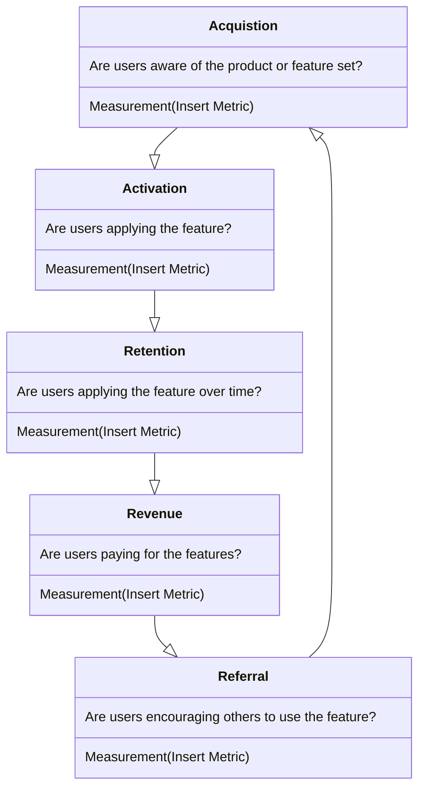
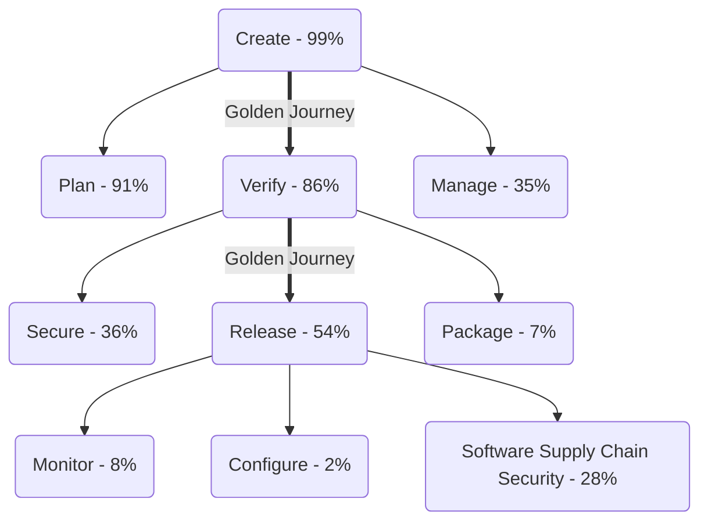

{}

## 私たちのプロダクト原則

これらは、顧客中心のイノベーションを通じて世界クラスのプロダクトを届けると私たちが信じる中核的な原則です。私たちの目標は、顧客の声を中心に据えてこれらの原則を育む実践を築くことです。私たちが行うすべては顧客のためであり、顧客がより速く安全なソフトウェアを自分たちの顧客や社内ユーザーに届けることに成功して初めて、私たちも成功するのです。

1. **私たちはカスタマーゼロであり、ゆえに自社のプロダクトを使います:** プロダクトに組み込むものはすべて、あなたや私たちの Engineering チームが日々の業務の一環として使う機能であるべきです。もし答えが「ノー」なら、あなたの「なぜ」を問い直してください。顧客にとってより大きなインパクトをもたらす、より良いソリューションがあるかもしれません。
1. **私たちは唯一の顧客ではありません:** 私たちが行うすべては顧客のためなので、できる限り顧客と会ってください。自分たちの利用やドッグフーディングを通じて顧客を理解していると思い込みたくなりますが、それでは限界があり、私たちが間違っていることもあります。戦略的なユーザーリサーチ、顧客インタビュー、フィードバックセッションを通じて前提を検証してください。
1. **私たちはデザイン主導です:** Engineering と協力して解決した顧客のペインポイントが何であれ、顧客に提供されるものが使いにくい（あるいはほぼ使えない）のであれば意味がありません。私たちは非常に技術的なプロダクトを扱っているため、ユーザーエクスペリエンスは最優先事項です。とはいえ、DevSecOps に不慣れな人でもすぐに使い始められるくらい簡単であるべきです。これには、オンボーディングから GitLab を活用した安全なソフトウェアの出荷まで、すべてが含まれます。
1. **私たちはベロシティより品質を重視します:** チームが定められたベロシティを達成するために、不完全な機能やケイパビリティを届けることは許容されません。私たちが顧客に出荷するものはすべて、ユーザーによる検証を経て、バグがなく、セキュリティ脆弱性を持ち込まず、GitLab.com のスケールを達成でき、ドキュメントを含み、すべての顧客のデプロイ選択肢で同時に利用できる必要があります。ベロシティのために追加の技術的負債を積み上げることも、可用性、スケーラビリティ、信頼性、セキュリティに関する将来の品質問題につながるため、許容されません。
1. **私たちは直感や逸話よりデータを重視します:** 私たちが構築するものはすべて、顧客に価値を提供できているかを確かめるために追跡できる成功指標を持つ必要があります。私たちはローンチではなく成果を測定します。これは実験と適切な計測があって初めて可能になります。成功指標を追跡し、プロダクト利用を通じて計画を調整できるよう、すべての機能は計測される必要があります。
1. **私たちは早く失敗し、意図を持ってイテレーションします:** 顧客のユースケースやペインポイントへの対処方法について仮説を定義し、課題検証を通じてそれを素早く検証（または反証）します。課題検証サイクルの結果を踏まえ、使いやすさと品質に焦点を当ててそれを届けるイテレーション戦略を立てます。各イテレーションでソリューション検証を通じて仮説を再検証し、必要に応じて計画を調整できるようにします。課題検証とソリューション検証によって、意思決定において顧客の声が鍵となることを確かなものにします。
1. **私たちは、ガイドのないエクスペリエンスよりもプロダクト主導の成長を信じます:** 私たちのプロダクトは GitLab で最高の Sales チームメンバーであり、それ自身の最大のチャンピオンであるべきです。機能の発見の瞬間を可能にし、顧客の利用状況、取られたアクション、設定の選択に基づいて、さらなる価値があることを顧客に知らせてください。顧客が私たちのプロダクトのケイパビリティを採用すればするほど、より多くの投資対効果を実感し、それが社内の GitLab チャンピオンをさらに増やします。
1. **私たちは勝つのが好きです…そして私たちはチームとしてのみ勝ちます:** 顧客が GitLab を使ってより速く安全なソフトウェアの出荷に成功したとき、私たちは勝ちます。これには、Product Management、UX Research、Product Design、Technical Writing の各チームにわたる Product 内で、最高水準の実行とコラボレーションを自らに課すことが求められます。Product 内のチームワークは必要ですが、それだけでは十分ではありません。私たちは、R&D と GTM にわたるクロスファンクショナルなチームメンバーとの間でも、同じ水準の実行とコラボレーションを求めます。グローバルな GitLab チームとして力を合わせれば、私たちは Results for Customers を推進できます。

## 私たちが原則に従う方法

### コラボレーションを可能にする

開発チームからマーケティング組織まで、誰もがデジタルコンテンツについてコラボレーションする必要があります。コンテンツは、数多くの潜在的な貢献者からの提案に開かれているべきです。オープンな貢献は、マージ可能なファイル形式と分散型バージョン管理を使うことで実現できます。[GitLab のミッション](/handbook/company/mission/#mission)は、**誰もがすべてのデジタルコンテンツについてコラボレーションできるようにすること**であり、それによって人々が効果的に協力し、より良い結果をより速く達成できるようにします。

### アイデアを現実にする

アイデアは、実現されるまでに多くの段階を経て流れていきます。アイデアはチャットでの議論から生まれ、Issue が作成され、スプリントで計画され、IDE でコーディングされ、バージョン管理にコミットされ、CI でテストされ、コードレビューされ、デプロイされ、モニタリングされ、ドキュメント化されます。DevOps ライフサイクルのこれらすべての段階をつなぎ合わせるには、さまざまな方法があります。異なるサプライヤーから提供されるプロプライエタリなアプリのマーケットプレイスを使うこともできれば、孤立して開発された一連のプロダクトを使うこともできます。

DevOps ライフサイクル全体のためのシングルアプリケーションとして、GitLab はアイデアを素早く本番環境へ持っていけるようにすることを目指します。私たちはそれを実現しつつ、おもちゃのようなアプリのデモや単純で些細な例で自分たちのケイパビリティを誇示することは避けます。なぜなら、[プロトタイプを作るのは簡単だが、本番のラインを作るのは難しい](https://www.businessinsider.com/elon-musk-says-building-factory-100-times-harder-than-making-car-2019-3)ことを理解しているからです。

### Minimal Valuable Change (MVC)

Minimal Valuable Change（MVC）は、ユーザー、顧客、そしてより広いコミュニティにとって、測定可能な最小の改善を届けるための GitLab のアプローチです。

私たちのアプローチには 4 つの柱が必要です。

- リサーチと検証を用いて、顧客のワークフローを理解することへの絶え間ない顧客フォーカスとコミットメント
- 採用、利用、その他のビジネス成果を追跡する際に、確立された成功指標を用いる測定可能な成果
- [the levels of support](https://docs.gitlab.com/policy/development_stages_support/) に記載された GA 基準に準拠したプロダクト機能
- 初回リリースを超えて MVC を拡張する将来のビジョン

リリースに向けて機能のスコープをどう定めるかを検討する際は、顧客に「不完全な」機能を出荷することは許容されないことを覚えておいてください（[definition of done](https://docs.gitlab.com/development/contributing/merge_request_workflow/#definition-of-done) を参照）。MVC では UI に Pajamas コンポーネントを使うことを検討してください。Pajamas に見当たらない新しいコンポーネントやパターンを導入する場合は、私たちの[コンポーネントライフサイクルガイドライン](https://design.gitlab.com/get-started/lifecycle/)に従って[それを追加すべきかを判断](https://design.gitlab.com/get-started/lifecycle/#determining-whether-a-component-should-be-included-in-pajamas)し、追加すべきなら、その追加/更新を Pajamas に還元するのが、そのチームの責任です。

MVC とは、素早く出荷できるようスコープを減らすことを意味します。それは GitLab のユーザビリティを損なうものを出荷することを意味しません。第一印象は重要です。十分な価値を提供しない、あるいはユーザーエクスペリエンスを妨げる機能は、将来その機能を再び試すのをユーザーに思いとどまらせるネガティブな効果をもたらしかねません。MVC に明らかなギャップがある場合や、フォローアップのリクエストが予想できる場合は、その機能がユーザーにリリースできるほど十分に完成しているかを検討してください。自分の機能が MVC として十分に完成しているか確信が持てない場合（あるいは MVC として十分に完成していないことが分かっていて、追加のフィードバックを集めたい場合）は、ドッグフーディング、[ベータプログラム](https://docs.gitlab.com/policy/development_stages_support/)、フィーチャーフラグ、ユーザーリサーチなどのアプローチを使って、判断への自信を高めることができます。自分の機能について話す際には、不完全な機能を告知するリリースポストの項目を追加するのは構いません（それが初期のイテレーションであることを明確にし、機能の方向性を指し示しつつ）。そして、機能をさらに完成させたときに新しい項目で後続のリリースポストでフォローアップします。クッキーではなくクッキー生地だと呼んでいる限り、ユーザーの期待をうまくマネジメントできます。

例:

- UI ではなく API を通じて機能を出荷する - このアプローチが、プロジェクトから添付ファイルを削除する GraphQL エンドポイントを構築するために使われた素晴らしい例として[このリリースポスト](https://about.gitlab.com/releases/2022/09/22/gitlab-15-4-released/#graphql-api-endpoint-for-deleting-attachments-from-project)を参照してください。
- 最小限の機能セットを公開する - キューに入ったジョブを表示する基本的な読み取り専用ページが追加され、その後のリリースでさらにケイパビリティが追加された[このリリースポスト](https://about.gitlab.com/releases/2022/11/22/gitlab-15-6-released/#admin-area-runners-job-queued-and-duration-times)を参照してください。

MVC アプローチが推奨されないシナリオもあります。これには次が含まれます。

- エクスペリエンスの中核部分を変更する場合 - 中核的なエクスペリエンスの一例が[コメント](https://docs.gitlab.com/user/discussions/#comments-and-threads)です。ワークアイテム向けにこれを構築したとき、私たちは Issue や MR のコメントと同等になるまで、新機能のエンドユーザーへのリリースを待ちました。

### イテレーション

MVC アプローチは、私たちのイテレーションの精神の副産物です。それは、私たちが課題を[できる限り小さく](/handbook/values/#make-small-merge-requests)[分解](/handbook/product-development/how-we-work/product-development-flow/#build-phase-1-plan)し、[サイクルタイムの短縮](/handbook/values/#reduce-cycle-time)に焦点を当てることを意味します。イテレーティブに考えるのは常に直感的とは限らず、特定のトピックやプロジェクトを分解するのは難しいことがあります。よりイテレーティブに考える方法についての私たちの CEO によるガイダンスが詰まった役立つ[動画](https://www.youtube.com/watch?v=zwoFDSb__yM)があります。

イテレーションを使って MVC を構築する方法を示した[素晴らしい動画](https://www.youtube.com/watch?v=MwHHErfX9hI)があります。レゴが障害物を登る様子を示しています。最初のデザインは失敗します。2 つ目は本を登ることができ、以下同様です。また、物事が複雑になるにつれて、モジュール性と優れたインターフェースがイテレーションにどう役立つかも示しています。

#### イテレーションの速度とプロダクトの卓越性

私たちの努力が一貫してユーザーに価値を届けることを確かなものにするため、各イテレーションは次のガイドラインに従う必要があります。

  1. 期待されるインパクトを定義する: イテレーションがユーザーにもたらす、期待される測定可能なポジティブインパクトを明確に表現し、私たちの全体的なプロダクトの方向性との整合を確かなものにし、ユーザーリサーチに基づいて形作られたビジョンによって導かれるようにします。
  1. 成功の指標を確立する: 機能を GA と宣言する、またはイテレーションを出荷可能と宣言する前に、イテレーションの成功を評価するために使う具体的な指標を特定します。これらは、イテレーションが意図する成果に直接関連する、具体的で測定可能な指標であるべきです。
     - これらの指標は、初期のスコーピングの一環として測定可能な品質基準を定義すべきです。それによって、クロスファンクショナルなチームが構築を始める前に成功/品質の基準が何であるかを理解でき、同時にこれらの指標を開発全体とリリース後のライフサイクルを通じて測定できるようになるからです。品質基準を定義する一環として、これらの成功の指標に照らして測定できることを確認・合意したテスト計画を定義すべきです。品質目標には次が含まれます。
     - 顧客が機能を使えなくなる S1 またはブロッキングの S2 の欠陥/バグがないこと
     - GitLab インスタンスの安定性に影響したり、ひどく低下させたりしないこと

取り組みの成功は、変更のデプロイやイテレーションの完了によって測られるものではありません。真の成功は、具体的なビジネスおよびプロダクトの指標によって示されるとおり、イテレーションが事前に定義した目標を達成したかどうかで決まります。

例:

- 取り組み: Service A のレイテンシを削減する。
- イテレーション A: 主要なロケーションでリージョナルなアップグレードを実装する。
- 成功指標: Service A の利用増加とユーザー満足度を測定することで、イテレーションの成功を評価する。関連する指標には、サービスの利用率、ユーザーの採用レベル、リピート利用の統計、アップグレード後の収益増加などが含まれる場合があります。

イテレーションやローンチがユーザーに具体的な価値をもたらしたことが明確に分かるとき、私たちは成果を祝います。

#### 引き算の思考

人間は、[機能を取り除くほうが効率的であっても、機能を取り除くソリューションより追加するソリューションを好む](https://www.nature.com/articles/d41586-021-00592-0)傾向があります。優れた PM はこのバイアスを認識し、引き算の思考を活用して優れたユーザーエクスペリエンスを生み出します。顧客は、自分たちが必要とするものが欠けているときには教えてくれますが、望まない機能で圧倒しているときに、それを明示的に教えてくれることはまずありません。とはいえ、この課題がすでに私たちにとって考慮事項であることを示す証拠はあります。それは、私たちの [System Usability Scale のコメント](/handbook/product/ux/performance-indicators/system-usability-scale/)に一貫して反映されています。このバイアスをさらに掘り下げた [Hidden Brain ポッドキャストのエピソード](https://hiddenbrain.org/podcast/do-less/)があります。

#### SaaS ファースト {#saas-first}

私たちの顧客が SaaS を選ぶのは、運用コストを削減でき、アップグレードを行わずに最新のケイパビリティを採用でき、高可用性という安心感を得られるからです。この原則は次を意味します。

- ダウンタイムなしでリリースできるよう機能をデザインする。
- セルフマネージドより先に、あるいはそれと並行して、SaaS で機能をリリースする。

この原則は SaaS のみを意味するわけではありません。SaaS とセルフマネージドの間の同等性に関する詳細は、私たちの[パリティ原則](#design-for-self-managed-for-feature-parity-between-deployments)を参照してください。

#### フィードバック Issue

MVC アプローチは、イテレーションしながら最大限のフィードバックを得ることを可能にします。そのフィードバックを集めやすくするために、Product Manager はフィードバック Issue（[例](https://gitlab.com/gitlab-org/manage/general-discussion/-/issues/15367)）を作成して、ユーザーからの提案や体験を集約することが推奨されます。認知のために、リリースポストの項目や関連する実装 Issue でフィードバック Issue に言及することを検討してください。

- フィードバック Issue により、GitLab チームメンバーやより広い GitLab コミュニティが、将来のイテレーションに向けた考えや提案を提供できます。
- フィードバック Issue は、特に顧客向けの主要な新機能で推奨されます。
- これらの Issue は、導入されたマイルストーンの次のマイルストーンの終わりにクローズできます。

### 失敗を祝い、そこから学ぶ

GitLab が企業として成長し大きくなるなかでも、速く動き続けるよう E-group がチームメンバーを後押ししていることを、チームメンバーが知っていることは重要です。これには、リスクや複雑さに直面しても素早く動くことが含まれます。私たちの[トランスペアレンシーのバリュー](/handbook/values/#transparency)に沿って、速く動くなかで生じた失敗やミスのうち、最終的にそこから学んで前に進んだ例を祝いたいと思います。

プロダクトチームから提供された以下の失敗は、インサイトを得て、学びを共有し、さらなる知識を持って前に進む機会として祝われています。

1. 当初は Jenkins 用のリフト＆シフトのトランスレーターを作るべきだと考えていましたが、ユーザーや技術エキスパートから、それは技術的に実現可能ではなく、より詳細なドキュメントとガイダンスに投資するほうが良いと学びました。
1. Auto DevOps で、コンポーザビリティへの欲求と、自分の DevOps プラットフォームをイテレーションする必要があることから、すべてに合う 1 つのパイプラインというケイパビリティでは、そのユーザーのペインに対処する的を外してしまうことを発見しました。
1. いくつかのモニタリングおよびオブザーバビリティのツール（Jaeger）を MVC として統合しましたが、それらの成功についてのデータポイントを得るには MVC すぎました。
1. デフォルトでオンであることやデフォルトで使えることを含めない「MVC」に頼った結果、新しい情報を得られると思っていたものの、得られなかった MVC が数多く生まれました。
1. マーケットプレイスの提供物を届けるのに時間を費やしましたが、ほとんど反応がありませんでした。マーケットプレイスの提供物だけでは採用の手段にはならず、成功するにはマーケットプレイスのベンダーとのセールスの足並みを揃える必要があることを学びました。
1. Quality と Distribution の間で作業の重複がありました。私たちはこれを長く認識/解決できませんでした。Quality を計画プロセスにより良く統合することを学びました。
1. データテレメトリは全般的に私たちの失敗の 1 つでした。私たちはテレメトリに真剣に、あるいは早期に投資せず、サードパーティを通じて加速しようとしましたが、それを展開する最善の方法についてコミュニティと話すのが十分ではありませんでした。
1. APM で重要なユーザーを取り込むことに失敗しました。[参考用の社内デック](https://docs.google.com/presentation/d/1Iw79oaSZg1OVAmubIhXQZOAsKd_snxKUXrLCjSsawzs/edit#slide=id.g29a70c6c35_0_68)
1. 歴史的に、デザイナーは課題検証に時間を費やさないよう指示されていましたが、自分のグループが成功するためにはデザインのカウンターパートが検証作業に深く関わる必要があると気づいた PM がいました。
1. GitLab のもともとの Serverless 戦略は、未成熟なテクノロジーに依存しており、市場の勝者である Lambda と必ずしも足並みが揃っていなかったことを学びました。その結果、GitLab は Serverless への投資を停止しました。
1. GitLab マネージドクラスタにおけるセキュリティ上の懸念に大きなギャップがあることを認識し、それがこの機能の顧客による採用を妨げていました。この「失敗」から学んだ後、私たちは代わりに Kubernetes agent を導入しました。

_学びの機会となりうる失敗があれば、このページに MR を作成してください_

### 「Not Invented Here」症候群を避ける

何かが[ここで発明されたものではない](https://en.wikipedia.org/wiki/Not_invented_here)というだけで、それが私たちのソリューション内に完璧な居場所を持たないわけではありません。GitLab はオープンコアのプロダクトであり、市場におけるオープンソースツールのより広いエコシステムの一部です。毎日、現実世界の顧客の課題を解決する革新的な新しいオープンソースツールが登場しています。私たちは、自分たちの顧客のために同じ課題を解決するために、これらのツールを自社のプロダクトに組み込むことを恐れるべきではありません。既存のテクノロジーを活用することで、はるかに早く市場に出ることができ、オープンソースに貢献でき（そしてオープンソース全体を強化するのに役立ち）、自社の人材を GitLab そのものをより良くすることに集中させることができます。これらのツールの作成者と専門的な関係を築くことも、GitLab にとってプラスです。彼らはあなたのカテゴリに関する重要なユーザー視点を持っているかもしれないからです。

私たちはこのアプローチに従って多くの成功を収めてきました。

- [CodeClimate](https://codeclimate.com/) を組み込むことで、CI/CD パイプラインにおける [Code Quality](https://docs.gitlab.com/ci/testing/code_quality/)
- [Unleash](https://github.com/Unleash/unleash) クライアントライブラリを使うことで、[Feature Flags](https://docs.gitlab.com/operations/feature_flags/)
- GitLab で [FastLane](https://fastlane.tools/) を活用する方法について書くことで、[モバイルパブリッシング](https://about.gitlab.com/blog/2019/03/06/ios-publishing-with-gitlab-and-fastlane/)

社内全体には、これが成功した例が他にも数多くあります。Product Manager として、あなたは自分の領域に関連するオープンソースの世界をモニタリングし、新しい革新的なツールがどこで開発されているかを確認し、それらを統合することを恐れるべきではありません。1 つ覚えておくべきことは、統合とは、ツールが GitLab とどのように連携するかを説明するブログ記事から、自社のインストールの中にバンドルすることまで、何でもあり得るということで、これはイテレーティブに発展できます。

### Convention over Configuration（設定より規約）

アプリケーション開発ツールを使うときの自然な傾向は、押すボタンや回すつまみの数々を作りたくなることだと私たちは理解しています。しかし私たちは、アプリケーションにオプションを追加することが、必ずしもそのアプリケーションのユーザーエクスペリエンスを向上させるわけではないと信じています。ユーザーに最善のサービスを提供する最良の方法は、必要とする機能を提供しつつ、複雑さを減らすアプリケーションを作ることです。

#### インスピレーション

私たちは、[Ruby on Rails](https://rubyonrails.org/)（その教義は[統合システムの価値](https://rubyonrails.org/doctrine#integrated-systems)を完璧に表現しています）、[Ember](https://emberjs.com/)、[Heroku](https://www.heroku.com/) といった他の「convention over configuration」のツールを称賛しており、ソフトウェアの継続的デリバリーに対して同じ利点を提供することを目指しています。

さらに、Ruby on Rails は Ruby コミュニティに大きくポジティブな影響を与え、ツールを引き上げ、これまで以上に強力で有用なものにしました。私たちは、Rails が Ruby に対してそうであるように、GitLab が Kubernetes に対してそうありたいと考えています。

あなたは、現在のベストプラクティスに基づくよく考えられた選択を優先すべきです。不必要な設定を避けてください。脆弱なワークフローをサポートするための設定を避けてください。

#### 設定の原則

新しい設定の追加を検討する際、私たちは次の原則に従います。

- **デフォルトで素晴らしい体験を確保する** - GitLab はほとんどのユーザーにとって、箱から出してすぐに完璧に動くべきです。抵抗すべきではありますが、設定が避けられない、あるいは望ましい場合もあります。あなたの設定は、その[体験を悪化させてはならず](https://gitlab.com/gitlab-org/gitlab/issues/14432)、常に_ユーザーの邪魔をしない_べきです。
  - **GitLab.com の値がデフォルトであるべき** - GitLab.com で使われる設定が、セルフマネージドのデフォルトであるべきです。これはユーザーに一貫した体験を提供するだけでなく、GitLab.com を通じて最も忠実度の高いフィードバックを得られます。GitLab.com の設定が間違っていると分かった場合、それはたいていセルフマネージドでも間違っています。GitLab.com にカスタム（非デフォルト）の設定を使う強い根拠があると考える場合は、その正当性を Product Section Lead と足並みを揃えてドキュメント化してください。GitLab.com のカスタム（非デフォルト）設定は[ここで追跡](https://docs.gitlab.com/user/gitlab_com/)する必要があります。
- **設定を制限することで好ましい行動を促す** - 規約はまた、私たちが顧客に特定の方法で物事を行うよう促していることも意味します。これの非常に具体的な例が、パイプラインを無効化する機能です。私たちは、統合されたソリューションが優れたユーザーエクスペリエンスを提供すると信じており、この行動を促す動機があります。このため、これを恒久的に（テンプレートでもインスタンス全体でも）無効化できる設定を追加することは避けるべきです。
- **仲介者ではなくユーザーのためにデザインする** - GitLab は、設定可能だからという理由で GitLab の管理者には愛されるが、過度に複雑で混乱を招くという理由で GitLab の開発者やその他のユーザーには嫌われるプロダクトを作るという[Blackboard の罠](https://twitter.com/random_walker/status/1182637292869115904)に陥らないようにすべきです。
- **デフォルトで動く** - GitLab を使う人の視点からすると、機能はデフォルトで動くまで存在しないのと同じです。これは、わずかな例外を除いて、機能はセットアップ、フィーチャーフラグの切り替え、GitLab Omnibus（`gitlab.rb`）や Charts の設定の変更、追加コンポーネントのインストールなしに、GitLab.com とセルフマネージドのインストールで単純に動くべきだということを意味します。これは「デフォルトで有効」よりも難しいことです。「デフォルトで有効」は、機能がデフォルトで利用できても、セットアップに追加の労力が必要な場合があることを示唆します。デフォルトで動くことは、余分な思慮深さと労力に値します。なぜなら、それは非常に重要な成果を可能にするからです。それは、顧客が私たちのプラットフォーム全体を簡単に採用し、DevOps ライフサイクル全体のためのシングルアプリの恩恵を体験できるようにすることです。適切にデフォルトで動くためには、機能は 2 つのことを必要とします。
  - **デフォルトで有効** - GitLab Omnibus（`gitlab.rb`）や Charts の設定の変更、ホストマシンへの追加コンポーネントのインストールを必要とせず、フィーチャーフラグの背後にあってもなりません。機能がデフォルトで有効でない場合、GitLab アプリケーションやホストマシンへの管理者アクセスが必要になるため、ほとんどの人はそれから恩恵を受けることがありません。フィーチャーフラグは、可能な限り常に GitLab.com とセルフマネージドのユーザーの双方でオンであるべきです。
  - デフォルトで有効は段階的にロールアウトできます。機能は、[GitLab.com](https://gitlab.com) でフィーチャーフラグを介して数日のうちに有効化できることもあります。また、エンタープライズが必要とするパフォーマンスと可視性を備えていることを証明するのに数ヶ月かかることもあります。
  - **デフォルトでセットアップ済み** - 機能を使う前にセットアップを必要とすべきではありません。私たちは、すべての機能に妥当なデフォルトを持たせ、セキュリティとインフラのコストが大きく影響を受けないことを確かめつつ、既存のユーザー/グループ/プロジェクトを自動的に移行して新機能がデフォルトでセットアップされるようにすべきです。重要なのは、ほとんどの人は新機能のセットアップに余分な労力をかけそうにないし、その機能が追加されたことに気づきもしないだろうということを覚えておくことです。Product Manager がやり取りするような Issue の声高な支持者は、機能のセットアップに余分な労力をかける傾向があるでしょうが、ほとんどの人はそうしません。
- **制限を避ける** - 制限は[システムを保護する](https://gitlab.com/gitlab-com/www-gitlab-com/issues/5617)ためにあるべきで、機能を「ゆっくり試す」ためにあるべきではありません。最初から機能の有用性を制限することで、あなたが達成しているのはその採用と有用性を制限することだけです。デフォルトでオフまたは制限付きにするつもりなら、これには十分な、ドキュメント化された理由が必要です。
- **可能な限り設定を完全に避ける** - 設定のリクエストは、脆弱なワークフローをサポートしようとする代理であることがあります。悪い習慣を可能にしてプロダクトの負債を負うのではなく、顧客がベストプラクティスを採用するのを助けることに労力を費やすべきです。
  - **設定は時間とともに積み上がる** - GitLab のすべての設定オプションはその複雑さを掛け算します。つまり、アプリケーションは使いにくく、開発しにくく、ユーザーに優しくなくなります。
  - **設定は取り除くのが難しい** - 出荷されて使われている設定を後から取り除くことは、そもそも導入しないことよりはるかに多くの作業になります。なぜなら、あまり人気のないオプションを選んだ顧客の挙動を変えることになるからです。
  - **設定は高コストなテストの仕組みである** - 大きな変更を設定可能にしようと提案するのは自然な反応です。特定のユーザーに悪影響を与えるのではと心配するからです。しかし、機能を設定可能にすることで、あなたは今や将来にわたって維持すべき[2 つの問題](https://xkcd.com/927/)を作り出してしまいました。設定の追加は、可能なら避けるべき[一方通行のドア](/handbook/values/#make-two-way-door-decisions)です。その結果、設定の代わりにフィーチャーフラグを使うことを検討してください。

#### 常に本番環境へのデプロイを許可する

ときには、ビジネスに金銭と評判の損失をもたらしかねないサービスやアプリケーションの障害を修正するために、迅速なデプロイが必要になります。私たちは、こうした状況では時間が極めて重要であることを理解しています。だからこそ、開発ライフサイクルの重要な局面で、チームにこれをコントロールする力を与えることが重要だと信じています。変更が本番環境に到達するのを防ぐコントロールは、セーフガードとしては問題ありませんが、必要なら素早く取り除いたり無効化したりできるべきです。コントロールがこのように変更されたときは、事後分析を支え、なぜそのコントロールを取り除いたり無効化したりする必要があったのかを理解できるよう、ログや記録を作成すべきです。
<figure class="video_container"><iframe src="https://www.youtube.com/embed/03ODv1cEO6E"></iframe></figure>

#### デプロイ間の機能パリティのためにセルフマネージド向けにデザインする {#design-for-self-managed-for-feature-parity-between-deployments}

私たちは、ユーザーが GitLab を使うために選ぶ方法（GitLab SaaS、Dedicated、セルフマネージド）にかかわらず、エンドユーザーに同じケイパビリティを提供したいと考えています。すべての GitLab SaaS 環境は、セルフマネージドのユーザーが利用できるのと同じインストール方法を、異なるライセンス体系で活用しています。セルフマネージド向けに機能をデザインし実装することで、さまざまなインストール間で最大限のパリティを達成します。

いくつかの例:

- ダウンタイムは SaaS のユーザーにもセルフマネージドのユーザーにも許容されないため、ダウンタイムを避けるように機能をデザインする。
- ソリューションがセルフマネージドにも適用できる限り、まず SaaS に機能をリリースするのは構いません。
- 機能を[フィーチャーフラグ](/handbook/product-development/how-we-work/product-development-flow/feature-flag-lifecycle/)や設定を介して最初に SaaS で有効化できる一方で、その根底にある実装は、無効化された状態であっても、セルフマネージドにも存在する必要があります。

私たちの [SaaS-first](#saas-first) 原則に沿って、一部の機能は、運用上の経験を得て学びを適用してから顧客に推奨・サポートするために、先に SaaS でリリースされることがあります。機能はセルフマネージドのコードベースには存在しますが、General Availability になるまで無効化されます。

たとえば AI のように、クラウドサービスなしでは実装が特に困難な機能については、セルフマネージドの機能が根底にある SaaS サービスに依存することがあります。これにより、デプロイの種類にかかわらずエンドユーザーに同じケイパビリティを提供でき、機能セットを過度に制約したり、各デプロイに大きな運用上の複雑さを課したりすることを避けられます。Product Manager は、すべての顧客が、たとえばエアギャップのデプロイのように、根底にある SaaS サービスを活用できる、あるいは活用したいとは限らないため、これがこれらの機能の採用に影響を与えうることを認識しておく必要があります。

#### 確立されたナレッジアーキテクチャへの原則的な準拠

**このプロダクト原則の例外には CEO の承認が必要です。VP, Product Management と協力して、状況と例外のリクエストを説明する内容を Product Scale のアジェンダに追加し、CEO の承認を得てください。**

私たちの[シンプルさ](#user-experience)と [SaaS/セルフマネージドのパリティ](/handbook/product/product-principles/#design-for-self-managed-for-feature-parity-between-deployments)の原則は、私たちが確立されたナレッジアーキテクチャに準拠することを求めます。私たちの確立されたアーキテクチャは、[Organization](https://gitlab.com/groups/gitlab-org/-/epics/4257#proposal)、[Group](https://docs.gitlab.com/user/group/)、[Project](https://docs.gitlab.com/user/project/) です。

- 管理者が組織全体に適用する必要があるケイパビリティを追加する必要がある場合は、organization レベルで提供します。
- グループ内のすべてのプロジェクトに適用する必要があるが、組織内のすべてのグループには適用されないケイパビリティを追加する必要がある場合は、group レベルで提供します。
- 特定のプロジェクトに適用する必要があるが、グループ内のすべてのプロジェクトには適用されないケイパビリティを追加する必要がある場合は、project レベルで提供します。
- ユーザーが「グループの集合」に適用したいケイパビリティについては、別の「グループの集合」という集約の概念を作りたくなります。私たちは、それが project レベルと group レベルの両方で数ヶ月間利用可能になるまでは、それを検討しません。ソリューションは、organization レベルですべてのグループに対して実装するか、集合内の各グループに対して個別に実装することです。
- ユーザーが「プロジェクトの集合」に適用したいケイパビリティについては、別の「プロジェクトの集合」という集約の概念を作りたくなります。私たちは、それが project レベルと group レベルの両方で数ヶ月間利用可能になるまでは、それを検討しません。ソリューションは、group レベルですべてのプロジェクトに対して実装するか、集合内の各プロジェクトに対して個別に実装することです。

注: これは、時間をかけてすべてのケイパビリティをインスタンスから organization へ移していくことを見込んでいるため、私たちがインスタンスレベルの機能を避けるよう苦心することを意味します。

### インスタンスレベルの機能を避けるよう苦心する

新しい機能のティアを決定した後、私たちはそれを使えるユーザーの数を最大化するよう努めるべきです。

この目的の一環として、私たちは可能な限りインスタンスレベルの機能を構築することを避けるべきです。インスタンスレベル（[admin area](https://docs.gitlab.com/administration/)）で構築すると、[GitLab.com とセルフマネージドの間の分断](https://gitlab.com/gitlab-com/customer-success/tam/-/issues/324#note_394401193)につながり、あなたのオーディエンスをセルフマネージドの顧客のみに制限してしまいます。

> 歴史的に（そして提案される真に新しい機能でさえ）、私たちはしばしば「インスタンス全体」のマインドセットから始めてきました。それはつまり、グループレベルで動くように機能をイテレーションして調整する必要があるということです。これはしばしば SaaS の顧客への機能提供を遅らせ、GitLab.COM を二級市民のように感じさせます。

[エンジニアリングの効率](https://gitlab.com/groups/gitlab-org/-/epics/4147#note_415603249)や[高いインフラコスト](https://gitlab.com/gitlab-org/gitlab/-/issues/276583#note_473354281)のように、インスタンスレベルの機能を正当化しうる要因はありますが、私たちは常にその機能をどのように GitLab.com にもたらしうるかについて明確な見通しを持ち、なぜインスタンスレベルから始めたのかを Issue に明確にドキュメント化すべきです。

#### 設定を追加するかどうかの判断

##### `gitlab.yml` の GitLab インスタンスについて

GitLab の Product Manager は、新しい設定を追加するかどうかという選択にしばしば直面します。

新しい設定を追加するかどうかをどう考えるかの例を示します。機能のダイアログボックスにチェックボックスを 1 つ、あるいはラジオボタンを 2 つ追加することを提案しているとしましょう。ユーザーが本当に求めているものを慎重に考えてください。ほとんどの場合、本当に必要なソリューションは 1 つだけだと分かるので、もう一方のオプションを取り除いてください。2 つの選択肢が本当に必要な場合は、最良または最も一般的なものをデフォルトにし、もう一方を利用可能にすべきです。デフォルトでない選択肢が著しく一般的でない場合は、たとえば Advanced 設定タブの背後に置くなどして、意思決定のためのメインのワークフローから取り除くことを検討してください。

設定を避けることが常に可能とは限りません。選択の余地がない場合、次の優先事項は GitLab のインターフェースで何かを設定することです。

設定がファイル（`gitlab.rb` または `gitlab.yml`）に現れるのは、最後の手段としてのみであるべきです。

- [`gitlab.yml`](https://gitlab.com/gitlab-org/gitlab/blob/master/config/gitlab.yml.example) は Rails アプリケーションが使う設定ファイルです。ここでドメインが設定されます。他の設定は可能な限り UI に移すべきで、ここに新しい設定を追加すべきではありません。
- [`gitlab.rb`](https://gitlab.com/gitlab-org/omnibus-gitlab/blob/master/files/gitlab-config-template/gitlab.rb.template) は Omnibus-GitLab の設定ファイルです。これは GitLab-Rails のための `gitlab.yml` の設定の抽象化として機能するだけでなく、Omnibus-GitLab 内に含まれ管理されるサービスの_すべての設定_のソースとしても機能します。新しく導入されたサービスは、おそらくここで設定する必要があります。

新しい設定を追加しなければならない場合は、機能やサービスがデフォルトでオンになっていることを確かめてください。機能やサービスを admin UI から完全に無効化できない場合にのみ、これらの設定ファイルのいずれかに設定の行を追加してください。

##### `.gitlab-ci.yml` の GitLab CI 設定について

設定を追加する判断が上記の原則に従う場合は、リポジトリ固有の CI 設定オプションに追加し、最良のユーザーエクスペリエンスをもたらすオプションをデフォルトにするようにしてください。私たちは、インスタンスの設定よりも CI の設定への追加にはるかに寛容です。

#### すべての機能はグループが所有する

機能は、そのグループのそれぞれの DRI を含め、1 つのグループが所有すべきです。他のチームが正しいオーナーを見つけやすくするため、あなたのチームのドキュメントメタデータと `features.yml` を最新に保つようにしてください。

この原則が重要なのは、所有者のいないプロダクト機能は監督されておらず、時間とともに技術的負債を積み上げ続けるからです。これはパフォーマンスや保守の問題のリスクを高め、それらは状況が深刻になって初めて解決される傾向があります。さらに、私たちのサーフェスエリア全体に明確な DRI を持つことで、チームは機能への投資や削除を訴えることができます。所有も文書化もされていないように見える機能に出会ったら、その機能をもともと導入したチームと協力してオーナーシップを決めてください。機能が大きく、分解する必要がある場合は、どの要素をどのチームが所有するかをドキュメント化してください。誰がその機能を所有すべきか決められない場合は、その判断を関係するチーム間の最も低い共通のレポートラインにエスカレーションしてください。どのグループも所有したくない機能や、あるグループがもはや所有したくない機能がある場合、その機能は廃止と削除の対象として検討すべきです。

### ユーザーエクスペリエンス {#user-experience}

まとまりのあるワークフローと包括的なドキュメントを備えた、非常に使いやすいインターフェースは、私たちのクラス最高の競合に先んじ続けるために不可欠です。私たちのユーザーエクスペリエンスの目標を達成するために、[Upstream Studios](/handbook/upstream-studios/) の個々のメンバーと緊密に協力してください。UX チームは Product Design、Technical Writing、UX Research に高度な専門性を持っています。彼らは、どのように複雑さをシンプルにするか、あるいは避けるかを読み解いたり決めたりするのを手伝えます。私たちの Product Designer は[マージリクエストにおけるユーザーインターフェースの変更をレビュー](https://docs.gitlab.com/development/contributing/design/)しますが、彼らは UI だけに限定されません。ユーザーのジャーニーに影響するものは何でも彼らに関係します。

これらの一般的なユーザーエクスペリエンスの原則を念頭に置いてください。

- **シンプルさを追求する:** GitLab を使うのは簡単であるべきです。ユーザーは、自分たちが構築しているアプリケーションやコラボレーションしているチームについて考えるべきで、私たちのアプリをどう動かすかについて考えるべきではありません。["Don't make users think!"](https://www.goodreads.com/book/show/18197267-don-t-make-me-think-revisited?) という素晴らしい読み物があります。
- **幅より深さ:** 世界クラスの体験には、深く、強力で、有用な機能が必要です。バランスを保つために、私たちは廃止できるケイパビリティも特定する必要があります。そうすることで、[引き算の思考](/handbook/product/product-principles/#subtractive-thinking)を促しながら深さを加えていきます。
- **以前より良い:** 私たちの [MVC 原則](/handbook/product/product-principles/#the-minimal-valuable-change-mvc)は、何もないよりは何かがあるほうが良いという考えに異を唱えます。代わりに、私たちはその価値を考慮することで、ユーザーエクスペリエンスが以前より良いかどうかを評価します。Product Designer と協力してトレードオフを評価し、[deferred UX](/handbook/engineering/workflow/#deferred-ux) を最小化してください。
- **時代を超えたデザイン:** ユーザーエクスペリエンスは、今日も数年後も関連性があるべきなので、各リリースは可能な限り最高の体験を凝縮すべきです。「もしこれがチームがこれに触れる最後の機会だと分かっていたら、どう作るだろうか」と自問してください。

さらに、[GitLab の Pajamas デザインシステムの原則](https://design.gitlab.com/get-started/principles/)に親しんでおくこともできます。

### 野心的であれ {#be-ambitious}

多くのクレイジーで過度に野心的なアイデアは、他の誰もやっていないというだけで不可能に聞こえます。

私たちには素晴らしいエンジニアと、Minimal Valuable Change を出荷する文化があるため、他の組織よりもはるかに多くの「不可能な」ことを成し遂げられます。

だからこそ私たちはマージコンフリクトの解決を出荷しており、だからこそ誰よりも先に組み込みの CI を出荷し、だからこそより優れた静的ページのソリューションを構築し、だからこそ競争できるのです。

#### これが計画に与える影響

ここ GitLab では、私たちは[野心的](#be-ambitious)な企業であり、これは私たちがリリースごとに大きなことを目指すことを意味します。チャンスを取り、野心的に計画するという現実は、私たちがリリースごとに試したかったすべてを常に届けられるとは限らないことを意味します。そして私たちはこれを良いことだと信じています。私たちは自分自身に挑戦することから尻込みしたくないし、常に切迫感を保ちたいと考えており、より多くを目指すことがそれを助けます。[ベロシティの重要性](/handbook/engineering/development/principles/#velocity)も参照してください。

私たちは、ベロシティを測定し、野心的にスケジュールしてもスラックを設けてスケジュールしても、ベロシティは変わらないことを見つけて、野心的な計画を好むようになりました。

### 煩わしくないディスカバラビリティ

新機能を発見することは、体験を高め、ユーザーにとって大きな価値を解き放つことができます。そして、ユーザーが私たちの機能をより多く見て試すほど、私たちはそれを改善するためのフィードバックをより速く得られます。

しかし、過度な機能発見の取り組みは、ユーザーにとって煩わしくなることがあります。これは信頼を損ない、将来の他の UI 要素とのエンゲージメントを減らします。さらに悪いことに、この悪化した体験のために GitLab を去ってしまうかもしれません。ユーザーが新しい機能とどう関わるかには、コンテキストが大きな役割を果たします。ユーザーの現在の状況やニーズに響く形で機能を提示することで、ユーザーがその新機能を使う可能性を高められます。

Product Designer と協力して、あなたの機能のディスカバラビリティを改善してください。Pajamas Design System には、[機能のディスカバラビリティ](https://design.gitlab.com/usability/feature-discovery/)を支えるベストプラクティスと例があります。新しいパターンをデザインすることもできます。Growth チームもこれを手伝えます。彼らは、ユーザーをサポートしつつ煩わせない形で、新しいユーザーのオンボーディングやアプリ内での機能利用の促進といったことを考えているからです。

### Product Qualified Leads (PQLs)

GitLab のユーザーベースと GitLab に取り組むチームメンバーが成長し続けるなかで、私たちはユーザーとチームメンバーの双方を支える必要があります。セールスチームのメンバーと話したいと思っているかもしれないユーザーを、その特定の人につなぐのを助けるのです。これを Product Qualified Lead、すなわち PQL と呼べます。

#### PQL はさらに、利用ベースと挙手の 2 種類に分けられる

- 利用: 利用ベースの PQL とは、残りのユーザーベースと比べて、サブスクリプションにアップグレードする統計的な可能性が高いことを裏付けるデータが得られるレベルまでプロダクトを採用したユーザーまたはチーム（グループまたはインスタンス）です。このレベルのプロダクト採用がユーザーまたはチームによって達成されると、セールスチームがそのユーザーやチームにフォローアップするためのアラートがトリガーされます。利用ベースの PQL をトリガーする利用レベルは、セールスチームに質の高いリードを生み出すことが目標であるため、Product、Marketing、Sales の間で決定・合意されるものです。利用ベースの定義が合意されたら、ここに追加されます。
- 挙手: 挙手の PQL とは、プロダクト内からセールスと話すことをリクエストするユーザーです。私たちの目標は、機能発見の瞬間や、ユーザーが価値を感じるかもしれない GitLab の有料機能やティアについてもっと学んでいる瞬間に、こうした挙手の瞬間をプロダクト全体に導入することです。これらの瞬間は、ユーザーの利用に文脈的に関連し、邪魔をしないものであるべきです（[煩わしくないディスカバラビリティ](/handbook/product/product-principles/#discoverability-without-being-annoying)を参照）。プロダクト内の挙手の瞬間には、トライアルの CTA かタッチレスのアップグレードの CTA、あるいはその両方が伴うべきです。私たちは常にユーザーに選択肢を提供したいと考えています。自分のニーズに最も合った道を彼ら自身に決めてほしいからです。

#### PQL ではないものを明確にする

- PQL は、プロダクトにサインアップしただけのユーザーではありません。彼らは適格な状態には達していません。
- PQL はトライアルではありません。トライアルは別のユーザー採用の道です。ユーザーがトライアルを始めてから PQL になることも、その逆もありうることに注意することが重要です。

#### GitLab プロダクト内における PQL の将来のビジョン

私たちの目標は、プロダクトの利用をモニタリングして、利用ベースの PQL を構成するものを理解し絶えずイテレーションし、ユーザーが挙手したり、トライアルを始めたり、タッチレスでアップグレードしたりできる統一されたインテリジェントなインターフェースをプロダクト内に提供する、世界クラスの PQL システムを開発することです。

プロダクトの利用、利用 PQL のボリューム、SAO レート、ASP をモニタリングすることで、私たちはマーケティングおよびセールスとパートナーシップを組んで、質の高いリードをセールスチームに送っていることを確かなものにできます。

プロダクト体験において、私たちは機能発見の瞬間のためのインテリジェントなモジュールを開発します。それは、プロダクトの利用状況に加えてデモグラフィックおよびファーモグラフィックのデータに基づいてデフォルトの CTA を更新することで、挙手、トライアル、タッチレスのアップグレードのうち、どれがユーザーにとって望ましい選択肢だと私たちが考えるかを推奨するのを助けます。この体験は SaaS とセルフマネージドのインスタンスの双方に存在します。エアギャップのインスタンスでは、CTA はユーザーに、関連するステップを完了するために訪れる外部 URL を提供します。この体験は、どのステージでも有料採用率を高めるためにデプロイできるべきです。

### プロダクトの利用を促進する

ユーザーは、プロダクトの機能を積極的に使うことでのみ GitLab の価値を体験できます。したがって、Product チームのミッションは、機能を出荷しプロダクトを構築することだけでなく、利用を促進し価値を届けることでもあります。

GitLab のプロダクト利用の促進について考えるために私たちが使うフレームワークは 2 つあります。1 つの機能の利用を促進する方法を考えるために AARRR フレームワークを使い、プロダクト機能の横断的採用を考えるために Customer Adoption Journey を使います。これら 2 つのフレームワークは互いに関連し合ってもいます。

#### 単一機能の利用: AARRR フレームワーク

AARRR は、_Acquisition_、_Activation_、_Retention_、_Revenue_、_Referral_ の頭文字で、しばしば["パイレートメトリクス"](https://amplitude.com/blog/actionable-pirate-metrics)と呼ばれます。これら 5 つの言葉は顧客のジャーニーを表し、Product Manager がファネル内の望ましい行動を促すために Product Performance Indicators を適用しうるさまざまな手段を表します。

AARRR フレームワークは全体的なアクティブユーザーを増やすために一般的に使われますが、PM が機能の利用を促進する方法を考えるための優れた方法でもあります。

- Acquisition は、機能の認知を示すユーザーのアクションを測定する
- Activation は、ユーザーが機能を使い始めたことを示す
- Retention は、時間をかけて機能を使い続けることを表す
- Revenue は、機能の利用から得られる金銭的価値を捉える
- Referral は、ユーザーが他の人に機能を使うよう促す行動を測定することに焦点を当てる

あなたのステージやグループの Product Performance Indicators の AARRR ファネルを、mermaid markdown で直接追加してください。この[ライブエディタ](https://mermaid-js.github.io/mermaid-live-editor/#/edit/eyJjb2RlIjoiY2xhc3NEaWFncmFtXG4gIEFjcXVpc3Rpb24gLS18PiBBY3RpdmF0aW9uXG5cdEFjcXVpc3Rpb24gOiBBcmUgdXNlcnMgYXdhcmUgb2YgdGhlIHByb2R1Y3Qgb3IgZmVhdHVyZSBzZXQ_ICAgIFxuXHRBY3F1aXN0aW9uOiBNZWFzdXJlbWVudCAoSW5zZXJ0IE1ldHJpYykgXG4gIEFjdGl2YXRpb24gLS18PiBSZXRlbnRpb25cblx0QWN0aXZhdGlvbiA6IEFyZSB1c2VycyBhcHBseWluZyB0aGUgZmVhdHVyZT9cblx0QWN0aXZhdGlvbjogTWVhc3VyZW1lbnQgKEluc2VydCBNZXRyaWMpIFx0XHRcdFx0XG4gIFJldGVudGlvbiAtLXw-IFJldmVudWVcblx0UmV0ZW50aW9uIDogQXJlIHVzZXJzIGFwcGx5aW5nIHRoZSBmZWF0dXJlIG92ZXIgdGltZT9cblx0UmV0ZW50aW9uOiBNZWFzdXJlbWVudCAoSW5zZXJ0IE1ldHJpYykgXG4gIFJldmVudWUgLS18PiBSZWZlcnJhbFxuXHRSZXZlbnVlIDogQXJlIHVzZXJzIHBheWluZyBmb3IgdGhlIGZlYXR1cmVzP1xuXHRSZXZlbnVlOiBNZWFzdXJlbWVudCAoSW5zZXJ0IE1ldHJpYykgXG4gIFJlZmVycmFsIC0tfD4gQWNxdWlzdGlvblxuXHRSZWZlcnJhbCA6IEFyZSB1c2VycyBlbmNvdXJhZ2luZyBvdGhlcnMgdG8gdXNlIHRoZSBmZWF0dXJlP1xuXHRSZWZlcnJhbDogTWVhc3VyZW1lbnQgKEluc2VydCBNZXRyaWMpICIsIm1lcm1haWQiOnsidGhlbWUiOiJkZWZhdWx0In0sInVwZGF0ZUVkaXRvciI6ZmFsc2V9)を使えば簡単です。

Product Manager はこれらのさまざまな状態を使って、望ましいアクションを促す機能の優先順位をつけられます。これは、認知を促してより多くの `top of funnel` のリードを生み出すために Activation 指標に焦点を当てることを意味するかもしれません。例として、[Release ステージ](https://about.gitlab.com/direction/ops/#release)では、Release Management グループが GitLab の Release Page 上のアクションを追跡しています。Release Page を見たユーザーは `acquired`（獲得済み）で、Release Page でリリースを作成したユーザーは `activated`（アクティベート済み）のユーザーです。Product Manager は、ユーザーが Release Page をより多く見るよう促す機能を狙うことを選べます。その結果、アクティベートされて自分自身のリリースを作成するユーザー数への関心が高まります。

#### 複数機能の利用: Adoption Journey

GitLab は完全な DevOps プラットフォームです。私たちの顧客は、複数の機能を組み合わせて使うときに GitLab プロダクトから最も多くの価値を得ます。以下は、私たちの顧客が GitLab のプロダクトステージを採用するために最もよくたどる道です。

PM として、個々の機能の利用を促進することに加えて、私たちはユーザーがより多くのステージや機能を採用するのを助け、GitLab を使うことからより多くの恩恵を受けられるよう、プロダクトとユーザーエクスペリエンスをどうデザインするかを能動的に考えるべきです。

- ここでの割合は、そのステージを採用した月次アクティブの有料 ultimate ティアのセルフマネージドインスタンスの割合として定義されます。データは Golden Journey Paths チャート（廃止されました）で直接取得されます。
- Golden Journey: 太字の道が「Golden Journey」であり、有料の顧客が採用する最も一般的なステージとして観察され、他のステージを採用するための土台となります。それは Create から始まり、Verify、Release へと進みます。Golden Journey が完了すると、GitLab のすべてのステージが利用可能になります。私たちの最大の機会は、Verify から Release への採用率を改善することです。

注: この adoption journey には多数の潜在的なバリエーションがありますが、この表現をシンプルで一貫したものに保つことが重要です。adoption journey の画像に変更を加える前に、まず David DeSanto に確認してください。

### Flow One

MVC のみを出荷すると、必ずしも 1 つの優れたユーザーエクスペリエンスにまとまるわけではない、ゆるくつながった多数の断片ができてしまうことがあります。

これに対する明白なソリューションは、将来を詳細に計画し、長期の詳細な計画を作ることでしょう。しかし、これは望ましくありません。あなたの柔軟性と、変化するニーズやフィードバックに応じる能力を制限しかねないからです。

Flow One は別の選択肢を提供します。あなたは（個別に出荷できる）MVC で構成されるワークフローを描き出します。そのワークフローは、特定の狭いユースケースのみをカバーし、それ以上はカバーすべきではありません。

これは次を意味します。

- 柔軟性のない長期計画を作るのを避けられる
- 完全な機能/ケイパビリティをより簡単に構築でき、それはより簡単にマーケティングできる
- 個々の変更にコンテキストを提供できる（「X の一部としてこれが必要です」）
- MVC を出荷し続けられる
- 複数の項目を同時並行で進められ、そのどれもブロッキングにならない

Flow One は、特定のワークフローの最初のイテレーションをカバーすべきです。その後、個々の MVC を導入して、ユースケースを拡張したり、前提を緩めたり（たとえば、フィーチャーブランチを使っている場合にのみ使える機能から、他の git 戦略でも動く機能へ）できます。

### データ駆動の作業

ユーザーから学ぶためにデータを使うことは重要です。私たちのユーザーは GitLab.com とセルフマネージドのインスタンスに広がっているので、より多くのデータを収集する、あるいは追加の分析ツールを構築・使用することを決めるときには、両方から学び、両方に恩恵を提供することに私たちの努力を集中させる必要があります。これができれば、私たちは社内の他の部分の成功も助けられます。これは、私たちが次のことをすべきだということを意味します。

- GitLab.com とセルフマネージドの両方で動くツールを構築・使用する。
- 問いから始め、その問いに答えるために必要なものを構築/収集する。これにより、必要のないデータで時間を無駄にするのを避けられます。
- 既製品に傾く前に、GitLab 内部にある既存のツールを使い、改善する。
- 私たちの顧客、セールスチーム、カスタマーサクセスチームはみな、プロダクトチームと同様に、自分たちの利用に関する似たインサイトから大きな恩恵を受けます。これらすべての人々に役立つものを作りましょう。

### Core に人為的な制限を設けない

[GitLab Stewardship](/handbook/company/stewardship/#promises) に従い、私たちは Core に_人為的な_制限を導入しません。人為的とは、より大きな数を選んでいたとしても_追加の_労力やコストが発生しなかったであろうのに、特定の GitLab オブジェクトのカテゴリに対して恣意的に小さな数（たとえば 1）を制限として設定することを意味します。追加の労力には、そもそも機能を作るためのプロダクト、デザイン、エンジニアリングの労力と、それを時間をかけて維持する労力が含まれます。

たとえば、GitLab Core はすべてのプロジェクトで [issue board 機能](https://docs.gitlab.com/user/project/issue_board/)を持っています。GitLab EE では、各プロジェクトが[複数のボード](https://docs.gitlab.com/user/project/issue_board/#multiple-issue-boards)をサポートします。これは、Core がプロジェクトあたり 1 つのボードという人為的な制限を持っていることを_意味しません_。なぜなら、ナビゲーションインターフェースのサポートや関連するすべてのエンジニアリング作業など、複数のボードを管理するための追加の労力があるからです。

この原則は私たちの SaaS の提供には適用されません。ホスティングコストを制限し、潜在的な乱用から他のユーザーを保護するために、制限が時折導入されるからです。例として、私たちは[共有 runner](https://docs.gitlab.com/user/gitlab_com/#shared-runners) の分単位のクオータを設け、[レート制限](https://docs.gitlab.com/user/gitlab_com/#rate-limits-on-gitlabcom)を実装しています。

### 強制的なワークフローを避けつつ、エンタープライズの柔軟性は許容する

私たちは[この Issue](https://gitlab.com/gitlab-org/gitlab/-/issues/2059) で強制的なワークフローについて議論しています。

GitLab では強制的なワークフローを避けるべきです。たとえば、3 つの Issue の状態（`Open`、`In Progress`（10.2 から）、`Closed`）があり、どの Issue も、ワークフローの制限なしに、ある状態から他のどの状態にも遷移できるべきです（ロールと権限は別の関心事です）。

- 強制的なワークフローは GitLab をより少数のユースケースに制限し、ゆえに GitLab の価値を減らします。
- 強制的なワークフローは、プロダクトで維持するためのオーバーヘッドを必要とします。新しい機能はすべて、既存の強制的なワークフローを考慮する必要があります。
- 私たちは、デザインと実装の時点で理にかなっていると考えた強制的なワークフローを押しつけるのではなく、ユーザーが GitLab を責任を持って使うことを信頼し、彼らに自由を与えるべきです。

[Hacker News のあるコメント](https://news.ycombinator.com/item?id=16056678)は、ワークフローを強制するときに何がうまくいかなくなるかを完璧に詳述しています。

「実際にソフトウェアを日々使う本当のエンドユーザーにとっての欠点は、ほとんどのビジネスプロセスがひどいということです。もしあなたの体験が、JIRA が話題に上るスレッドで見かける地獄のような存在であるなら…:

1. あなたの管理者がそれを一度設定したきり、それらのワークフローをイテレーションすることに煩わされていない。
1. ビジネスが、自律性を奪うプロセスを意図的に JIRA にマッピングした。
あなたの仕事の経験の大半も似たようなものだろうと推測します。プロセスに窒息させられたナンセンスです。」

しかしそのコメントは利点も指摘しています。

「JIRA の最も強力な機能は、ビジネスプロセスをソフトウェアにマッピングできることです。これはエンタープライズの顧客にとって非常に魅力的です。ワークフロー、手順、要件を強制するソフトウェアは信じられないほどのてことなりえ、JIRA の価格設定は build vs buy の意思決定を完全に考えるまでもないものにします。」

私たちは、GitLab がエンタープライズのワークフローを助けやすくすることを確かなものにすべきです。

- Issue（番号）でブランチを始めるとき、それをブランチにリンクします。
- MR をマージするとき、それが修正する Issue を自動的にクローズします。
- GitLab CI では、手動承認を含むデプロイステージの進行（staging、pre-production、production）を定義できます。
- 私たちは品質ツールとセキュリティツールを自動的に実行し、それをプロセスのステップにする代わりに、ステータスを確認するダッシュボードを提供します。
- 私たちは段階的なロールアウトと自動ロールバックでミスの影響を制限します。

強制や制限に対する顧客のニーズを検討する際は、

- 根底にある顧客の課題を深く理解し、ドキュメント化する。コントロールを課すことを検討する前に、私たちが解決しようとしているニーズを理解するのが私たちの責任です。
- まず個々のユースケースを解決する。特定の課題を非特定的なソリューションで解決しようとするのはリスクが高く、[イテレーティブ](/handbook/product/product-principles/#iteration)ではありません。代わりに、単一のユースケースから始め、GitLab で特定の、強制されないソリューションを構築します。
- まず最小のユーザーグループを考える。インスタンス全体のコントロールに手を伸ばすのではなく、可能な限り最小のセグメント（たとえばプロジェクトのサブセット）からイテレーションします。
- シンプルな回避策とオーバーライドを提供する。SEV-1 インシデントからの回復のような極端なシナリオを考えてください。常にシンプルで素早い脱出ハッチがあるべきです。

例として、顧客は必須の CI ジョブを通じたインスタンス全体の強制をリクエストしました。これを行うのは誤りだったでしょう。代わりに、

- 私たちは彼らの課題をより深く理解し、既存のプリミティブ（MR 承認における[外部ルール](https://gitlab.com/groups/gitlab-org/-/epics/3869)など）でこれらのチェックを実行するケイパビリティを構築できると気づきました。
- 私たちは課題のスコープを制限し、インスタンスレベルでのいかなる制限も避けました。代わりに、特定の[コンプライアンスフレームワーク](https://docs.gitlab.com/user/project/settings/#compliance-framework)を持つプロジェクトにのみこの機能をスコープするよう顧客に求めることで、影響を可能な限り小さく保つ計画を立てました。
- 私たちは意図的に回避策を計画しました。開発者は、[2 人承認](https://gitlab.com/gitlab-org/gitlab/-/issues/219386)のように、マージリクエスト内でこれらの制限をオーバーライドできるべきです。また、これらのコントロールの対象とならないサブグループを作成できるべきです。

<figure class="video_container"><iframe src="https://www.youtube.com/embed/QCfOQs8S4OQ"></iframe></figure>ほとんどの場合ワークフローの強制は避けるべきですが、さまざまな理由で強制的なワークフローに依存している組織もあります。これらの組織は、GitLab に移行する際に既存のワークフローを適応させることに課題を抱えています。その結果、私たちはチームの効率性と組織のポリシーのバランスをとるために、group レベルでの一部の強制を許容することを検討すべきです。[Accelerate](https://www.amazon.com/Accelerate-Software-Performing-Technology-Organizations/dp/1942788339) の 79 ページは、「承認プロセスがない、またはピアレビューを使ったと報告したチームは、より高いソフトウェアデリバリーパフォーマンスを達成した」と概説しています。組織がワークフローを強制できるようにする機能を実装する際は、group レベルで行い、デフォルトをオフにすべきです。GitLab は、チームがプロダクト開発を加速するために使うプロダクトであるべきですが、あらゆる規模の組織の要件を解決できるほど柔軟であるべきです。

### 小さなプリミティブを好む

小さなプリミティブは GitLab における構成要素です。それらは技術レベル_ではなく_、真にプロダクトレベルでの抽象化です。小さなプリミティブは、組み合わせたり、さらにその上に構築したり、その他の方法で活用したりして、GitLab に新しい機能を生み出せます。たとえば、[issue boards](https://docs.gitlab.com/user/project/issue_board/) のラベルリストは、より小さなプリミティブである[ラベル](https://docs.gitlab.com/user/project/labels/)を使っています。

それらが特に強力なのは、より「完全」だが単体の機能から得られるものよりも、たいてい少ない労力_で_高いてこを提供するからです。シンプルな Unix のコマンドラインユーティリティをどう連鎖させれば、専用のツールでできたことよりもはるかに簡単に（そして確実により柔軟に）本当に複雑なことができるかを考えてみてください。

GitLab をイテレーションする際は、特にさらなる改善の土台を提供する MVC 機能を検討する際には、新しい抽象化を作る代わりに小さなプリミティブを使うことを強く検討してください。これを行うには、中級から上級のユーザーのニーズを満たす、適用しやすい概念から始められます。そこから使い方を明確にドキュメント化し、ディスカバラビリティについて考えるようにしてください。洗練の必要性が示されたとき、あまり洗練されていないユーザーのオンボーディング、あるいは実世界の利用を通じて特定された他の新しい抽象化が必要になったときに、UX は後でリファクタリングしたり強化したりできることがよくあります。

### コンポーネントの原則

GitLab というプロダクトでは、新しいケイパビリティを有効にするためにオプションのソフトウェアやインフラが必要になる場合があります。いくつかの例:

- GitLab CI/CD の利用を有効にするには、Runner という形のインフラが必要
- Advanced Search を有効にするには、Elasticsearch という形のインフラとソフトウェアが必要
- GitOps のプルベースのワークフローを有効にするには、Kubernetes Agent という形のソフトウェアが必要

以下は、そのようなコンポーネントを構築する際に私たちが考慮するベストプラクティスです。

#### 開発者を有効にすることから始める

GitLab CI/CD で学んだように、開発者が必要な Runner を素早く接続して自分自身の GitLab CI/CD の利用を有効にできることが、組織内での GitLab CI/CD の急速な採用を可能にしました。追加のケイパビリティを有効にするワークフローを検討する際は、まず開発者を有効にすることから始めてください。指針となる原則は、**摩擦の少ない**開発者の有効化であるべきで、これは採用にポジティブな影響を与えます。

#### デモ用ではなく本番利用のために構築する

証明書ベースの Kubernetes インテグレーションから学んだように、getting-started のプロセスのデモをサポートする開始時の体験を構築しても、それが必ずしも実際の利用につながるわけではありません。たとえば、証明書ベースのインテグレーションには、強力なセキュリティのプリミティブと、インテグレーションを継続的に管理する能力が欠けていました。その結果、私たちは MVC の一環であっても、実世界の本番利用を狙ったケイパビリティをまず構築すべきです。

### 他のアプリケーションを思慮深く統合する

GitLab のビジョンは、DevOps ツールチェーンのあらゆる部分にとって最高のシングルアプリケーションになることです。しかし、一部の顧客は私たちの含まれる機能以外のツールを使っており、私たちはそうした決定を尊重します。これを念頭に置くと、彼らのツールチェーンの_ギャップを埋める_のを助けるために、サードパーティのサービスやプロダクトと統合することが価値を持つことがあります。シングルアプリケーションが最良のアプローチですが、うまく連携する複数のアプリケーションは、そうでないものよりは良いのです。

これを念頭に置いて、以下は考慮すべきいくつかのプロダクトガイドラインです。

- **すべてをクローンしない**
  - 統合されたプロダクトの_すべての機能をクローンする_必要があると感じないでください。最終的に、このアプローチは私たちに可能な限り最大のリソースを費やさせる一方で、他のアプリケーションが提供するネイティブなものと比べて常に劣る体験を生み出します。私たちは、2 つのアプリケーションの間のギャップを埋めることで価値を届けられる場所に努力を集中させるべきです。
  - クローンとブリッジの違いを強調する、潜在的な（完全に理論上の）例をいくつか挙げます。
    - イベントログでは、GitLab 内部にすべての記録を表示しようとするのではなく、最近のアクティビティのみを表示し、他のシステムの完全なログにリンクする。
    - Issue/チケットでは、可能なすべてのアクションを再現しようとするのではなく、コメントやステータス変更のように最もよく使われる機能のみを提供する。
- **無料で壊れたワークフローを防ぐ**
  - 上記の引用に基づくと: _「シングルアプリケーションが最良のアプローチですが、うまく連携する複数のアプリケーションは、そうでないものよりは良いのです。」_
  - 顧客のワークフローを壊しかねない機能や UX は、無料で提供すべきです。特に、複数の信頼できる情報源（複数の wiki）を許容したり、作業を重複させたり（Issue 上に作業のアクティビティを表示しなかったり）といった生産性のアンチパターンを顧客が避けるのを助ける機能を提供すべきです。
- **インタラクションに価値を加えることに課金する**
  - これほど信じられないほどの幅広さを持つことで、GitLab は、GitLab と統合されていなければ決して持ちえなかった_外部の機能に価値を加える機会_を持っています。たとえば、私たちの優れた **To Dos** 機能は、対応すべき作業を開発者の手元に届けるもので、GitLab にやや独特な機能です。他の多くのツールは、即座のアクションが必要な作業を特定しにくくしているので、それらのツールを GitLab のこの部分と統合することで、**私たちはそれらを単体よりさらに強力にできます。**
- **価格設定にあたって適切な購入者を考える**
  - 私たちは通常、誰が_その機能を使っているか_を購入者の指標として考えますが、あなたのインテグレーションにはこれが適切でないかもしれません。
  - インテグレーションが組織の要件（社内のすべてのチームに Jira を使わせるなど）によって駆動される場合、Buyer Based Tiering は、そのインテグレーションが_複数チーム_（Premium）または_戦略的組織_（Ultimate）の利用のためのものであることを示している可能性が高いです。
  - インテグレーションが _GitLab のケイパビリティを拡張する_ものである場合、購入者はエンドユーザーである可能性が高く、これは他の GitLab の機能の価格設定を考えるのと同様です。
- **低い恥のレベルはここでも適用される**
  - 別のプロダクトとの統合を始めるとき、それはほとんど全く新しい作業のカテゴリを開くようなものです。これを念頭に、[ドッグフーディングにおける低い恥のレベル](/handbook/values/#low-level-of-shame-when-dogfooding)が、他のどこでもそうであるのと同じようにここでも適用されることを、優しくお知らせします。そのインテグレーションは_今日_はあまり価値がないかもしれませんが、それは単なる出発点であり、私たちは最初のイテレーションを使って、次のイテレーションに何が属すべきかを検証すべきです。
- **インテグレーションの成熟度を追跡する**
  - 他のどの作業のカテゴリとも同じように、私たちはインテグレーションの成熟度を、目に見える場所で追跡すべきです。高優先度のインテグレーションとその成熟度レベルを追跡する表を含む Ecosystem Integrations の direction ページに、あなたのインテグレーションを追加することを検討してください。
- **セキュリティと権限を尊重する**
  - 外部アプリケーションには、私たちのアプリケーションにはないセキュリティと権限の懸念があるかもしれません。私たちはこれらを慎重に考慮すべきです。それらを無視することは、ユーザーにとって潜在的に壊滅的になりうるからです。たとえば、フルアクセスを持つ管理者トークンをユーザーに求め、それらの権限に基づいて UI にコンテンツを表示すると、そのアプリケーションから出るべきでない機密データを表示してしまう可能性があります。
- **ナビゲーション**
  - インテグレーションは、有効化されていれば、どのネイティブな GitLab 機能とも同じくらい発見しやすくあるべきです。2 つの機能が互いに排他的な場合は、混乱を防ぐためにユーザーが私たちのネイティブな機能を隠せるようにすべきです。たとえば、2 つのプロジェクト管理ツールを持つことは（一般的に）_悪い_アイデアです。協力者が間違ったツールに Issue を提出してしまい、彼らのベロシティを下げ、全体的な体験を悪化させかねません。ベロシティを下げることは、GitLab が提供する価値に反します。
  - 機能が_互いに排他的でない_場合（たとえば、_複数_のセキュリティスキャンサービスを使うことに何の問題もありません）、私たちはそれらのインテグレーションへのナビゲーションを私たち自身のものの近くにグループ化すべきです。
- **機能発見のために空の状態を使う**
  - このインテグレーションが利用可能であることを強調する[_空の状態_](https://design.gitlab.com/patterns/empty-states/)を追加することを検討してください。もし誰かが GitLab の機能を使っておらず_かつ_、選んだツールを統合してもいないなら、それは可能な限り最悪の体験です。私たちはユーザーの選択を尊重すべきで、もし彼らが私たちが統合するサードパーティのツールを使うことを決めたなら、私たちはそのオプションを暗い隅に隠すべきではありません。
  - これはまた、他のプロダクトと比べて GitLab が何を提供できるかをユーザーに教える絶好の機会でもあります。それは両方の世界のいいとこ取りです。私たちは自分自身の機能を宣伝しながら、選択にかかわらず彼らの現在の体験を改善するのを助けます。
- **私たち自身のデザイン言語を使う**
  - サードパーティのサービスから_機能_を活用しているからといって、そのサービスの UI に私たちの見た目を決めさせるべきではありません。GitLab には独自の[デザイン言語](https://design.gitlab.com/)があり、それをアプリケーション全体でまとまりのあるものに保つことで、私たちはユーザーにとって著しく優れた体験を生み出します。
- **データソースについて透明であれ**
  - データが外部ソースから取り込まれるときは、それが他の場所から来ていることを明確にしてください。これは混乱を防ぎ、認知負荷を減らし、ユーザーがアプリケーションとやり取りする際に行っている選択について十分に情報を得ていることを確かなものにします。

#### プラグインと商業マーケットプレイスを避ける

_注_ - 私たちは、[コードスニペット](https://gitlab.com/gitlab-examples)、[プロジェクトテンプレート](https://docs.gitlab.com/development/project_templates/)、[CI/CD Catalog](https://docs.gitlab.com/ci/components/#cicd-catalog) の CI コンポーネントのように、誰もが貢献できる場所を提供するつもりです。マーケットプレイスは伝統的にトランザクションベースで、ユーザーがソリューションを購入します。一方で GitLab CI/CD コンポーネントは、[GitLab が保守するコンポーネント](https://gitlab.com/components)のライブラリから YAML 設定用のコンポーネントを利用する、プロダクト内の体験を提供します。

クローズドソースのソフトウェアベンダーは、一般にプラグインと商業マーケットプレイスに依存しています。なぜなら、

1. これらは、根底にあるコードベースにアクセスする必要なく、サードパーティが機能を追加する能力を可能にします。
1. サードパーティはプラグインに課金でき、それが彼らがプラグインを作るインセンティブになります。

GitLab は[オープンコアのプロダクト](https://en.wikipedia.org/wiki/Open-core_model)なので、サードパーティは GitLab に直接機能を追加できます。（プラグインを作るのとは対照的に）GitLab のコードベースに直接追加することは、彼らにとってより多くの作業を意味するかもしれず_、_その機能に課金できる方法を制限します。

しかし、**GitLab のユーザー**にとって、これは大きな利点があります。

1. デフォルトですべてのユーザーに配布されるため、彼らはこの機能を使う可能性が高くなります。
1. 機能は常に箱から出してすぐ動き、[追加のソフトウェアを必要としません](/handbook/product/product-principles/#convention-over-configuration)。
1. ユーザーは、どんなプラグインが利用可能かを探したり、どれが最もうまく動くかを確かめるために複数のオプションをテストしたりする必要がありません。
1. インストールがプラグインのさまざまな組み合わせを持つことがなくなり、プロダクトを使い、サポートするのが簡単になります。
1. すべてのコードが一緒にテストされるため、管理者は重要なプラグインを壊すのを恐れてアップグレードを避ける必要が決してありません。

そして、サードパーティを含む **GitLab の開発者**にとっても、これは大きな利点があります。

1. プロダクトそのもののコードを変更しているので、彼らの作業は機能において制限されません。
1. 物事が変わってもコードはプロダクトの残りと一緒にテストされ、リファクタリングがより簡単になり、何かが変更しにくいために[ソフトウェアの萎縮](https://vijay.tech/articles/wiki/SoftwareEngineering/SoftwareAtrophyAnExample)に苦しむ可能性が減ります。
1. コミュニティの努力が、最終的にすべて同じことをして利用を競い合う複数のプラグインの開発に無駄遣いされません。
1. 開発者はプラグインの API を壊すことを心配する必要がないので、[予測可能性のためにベロシティ](/handbook/engineering/development/principles/#velocity)を犠牲にする必要がありません。

総じて、私たちはこのアプローチが GitLab のユーザーと貢献者の双方にとって可能な限り最良の体験を生み出すと信じており、そのために私たちは人々に [GitLab に直接機能を貢献する](https://about.gitlab.com/community/contribute/)よう促します。

GitLab に直接コードを追加することが選択肢でない場合は、私たちはサードパーティに私たちの [API](https://docs.gitlab.com/api/) を通じて統合するよう促します。

_注: GitLab は、アプリケーションのイベントに直接結びつき、主に監査、ロギング、その他の管理タスクといった管理目的に使われる[システムフックに応答するプラグイン](https://docs.gitlab.com/administration/file_hooks/)をサポートしています。_

### プロダクトと機能の命名ガイドライン

#### プロダクトと機能には、独特な名前ではなく説明的な名前を付ける

GitLab は DevOps プラットフォームであり、DevOps のポイントソリューションの寄せ集めではありません。GitLab のプロダクトと機能の命名はこれを反映すべきです。説明的な名前を採用することには、他の利点もあります。

- それは[効率的](/handbook/values/#efficiency)です。説明的な名前は一般に商標登録の対象にならないため、商標登録をクリアし、出願し、維持する時間、労力、費用を避けられます。
- それは[インクルーシブ](/handbook/values/#diversity-inclusion)です。説明的な名前は、他の言語に直接翻訳できるため、グローバルなオーディエンスにとって最もアクセスしやすく、抽象的、比喩的、口語的な名前を翻訳する際に内在する意味の喪失のリスクを減らします。

[例](https://gitlab.com/gitlab-com/legal-and-compliance/-/issues/815)として、`CI/CD Components Library` は説明的な名前で、`CI/CD ATOM` は独特な名前です。

この原則の例外は、限られた状況で検討されます。プロダクトや機能が市場での差別化要因である場合、説明的な名前を採用すると_同じものの海_に埋もれてしまうリスクがあります。この場合、独特な名前が正当化されることがあります。例外について議論するには、Slack の [#marketing](https://app.slack.com/client/T02592416/C0AKZRSQ5) に連絡してください。

#### 名前の中でサードパーティのプロダクトやサービスに言及するときは前置詞を使う

GitLab の拡張機能、プラグイン、アプリ、またはサードパーティのプロダクトやサービス（「ツール」）のインテグレーションに名前を付ける際は、`for` のような前置詞とともにサードパーティのサービス名を含めるか、まったく含めないかのどちらかにしてください。前置詞は、サードパーティがそのツールと公式に提携していないことを示すため重要です。たとえば、私たちの [Jira Cloud とのインテグレーション](https://docs.gitlab.com/integration/jira/connect-app/)は `GitLab.com for Jira Cloud` と呼ばれています。

マーケティング資料と技術ドキュメントでツールのフルネームを使う限り、この一般原則の例外として私たちは次のことができます: (1) プロダクト内で GitLab のツールを列挙する場所では、ツールをサードパーティのサービス名のみで参照する; (2) サードパーティのプロダクトのアプリディレクトリでは、ツールを「GitLab」のみとして参照する。たとえば、私たちは GitLab for Slack アプリを、GitLab のインテグレーションの一覧では「Slack」として、[Slack App Directory](https://gitlab.slack.com/apps/A676ADMV5-gitlab?tab=more_info) では「GitLab」として参照します。

機能の命名プロセスに関するさらなるガイダンスについては、[naming features](/handbook/product/categories/gitlab-the-product/#naming-features) を参照してください。

### 次世代

私たちの[大きく、無謀で、大胆な目標](https://www.jimcollins.com/concepts/bhag.html)はすべての開発プロセス、ペルソナ、ユースケースにまたがりますが、これらのそれぞれの場には主要なターゲットがあります。優先順位を検討する際、私たちはまず、他の開発方法論、ペルソナ、アプリケーションタイプに移る前に、クラウドネイティブなアプリケーションをモダンな方法で構築する開発者に対して完全な成熟度を提供することを目指すべきです。

#### モダンファースト

既存の競合と競争する機能を開発する際は、まずモダンな開発チームの課題を解決し、_それから_レガシーなチームに何が欠けているかを確認するようにしてください。たとえばプロジェクト管理では、Scaled Agile Framework（SAFe）やウォーターフォールを行う前に、まず conversational development、リーン、あるいはアジャイル開発を行うチームのために優れたプロジェクト管理のケイパビリティを作ります。

モダンファーストはモダンでないものを決してやらないという意味ではないことが重要です。それは、まずチームがモダンな方法で機能をどう使っているかを学び、それから何が欠けているかを確認すべきだという意味です。モダンな方法が前進の道を提供し、それから私たちはまだそこに至っていないチームのために、カスタマイズ性やモダンへの道を追加できます。

#### 開発者ファースト

私たちの戦略には、開発者から運用、セキュリティ、プロダクトマネージャー、デザイナーなど、多くの新しいペルソナを追求することが含まれます。しかし、これらの新しい領域で機能を開発する際は、開発者から始めることを覚えておくことが重要です。もし私たちが開発者にとってセキュリティを素晴らしいものにし、_それから_セキュリティの専門家にとって素晴らしいものにできれば、私たちははるかに成功するでしょう。

#### クラウドネイティブファースト

開発チームは、ベアメタルからクラウド VM、クラウドネイティブな Kubernetes クラスタまで、非常に多くの異なるプラットフォームにデプロイします。私たちはまずクラウドネイティブのために機能を構築し、_それから_残りをサポートします。これにより、私たちは開発が向かう先に集中でき、たとえ今日は準備ができていなくても、あらゆる企業がいずれ使うことを目指すソリューションを届けられます。

#### 現在のアダプターを優先する

次世代の開発フロー、ペルソナ、ユースケースに焦点を当てることで、私たちは、最初のユーザーが比較的少数のアーリーアダプターの集団にいる機能と体験を構築します。私たちは今日彼らをサポートする体験を構築しているかもしれませんが、これらの体験の将来のユーザーは常にはるかに大きな集団になると想定しています。したがって、私たちは、私たちがサポートするワークフロー（モダン）、チーム編成（開発者ファースト）、あるいはアプリケーションアーキテクチャ（クラウドネイティブ）で活動し始めている、次世代の原則の現在および将来のより多くのアダプターをサポートするように GitLab を最適化します。私たちは、これらの現在のアダプターを最もよくサポートする、最もモダンなワークフローに投資を集中させます。これは、アーリーアダプター向けの初期のワークフローへの持続的な投資を犠牲にすることになります。そうする際、私たちは望ましい道が何であるかをユーザーに明確に伝えることを確かなものにします。

たとえば - 私たちはまず Certificate の方法を介して Kubernetes Clusters を接続する能力を提供しました。これが本番のユースケースに最適でないと気づいた後、私たちはクラスタ接続の GitLab Agent for Kubernetes の方法を追加しました。証明書の方法がもはや望ましい方法でないことが確実になるとすぐ、私たちはドキュメントとプロダクト内で、Agent が現在のアダプターにとって望ましい道であることを伝えました。これは即座の[廃止](https://docs.gitlab.com/development/deprecation_guidelines/)を意味すべきではなく、代替のアプローチがそれを置き換えられるようになったらレガシーの方法が廃止されるという明確なシグナルを意味すべきです。

#### すべての機能に対するカスタマーサポート {#support-all-features}

私たちは、有料の顧客の有料ライセンスのティア、およびそれより下位のすべてのティアにあるすべての機能について、有料の顧客にカスタマーサポートを提供します。これは、Core にある機能が、すべての有料ティアでカスタマーサポートを受けるべきだということを意味します。たとえば、最も低い有料ティアで利用できるが、より上位のティアでのみカスタマーサポートがある機能がある場合、その機能はその最も低い有料ティアから取り除くべきです。私たちの[stewardship ポリシー](/handbook/company/stewardship/)に従い、私たちは Core から有料ティアへ機能を取り除くことは決してできませんが、有料の顧客のみが利用できる追加の機能をその周りに構築することはできます。
