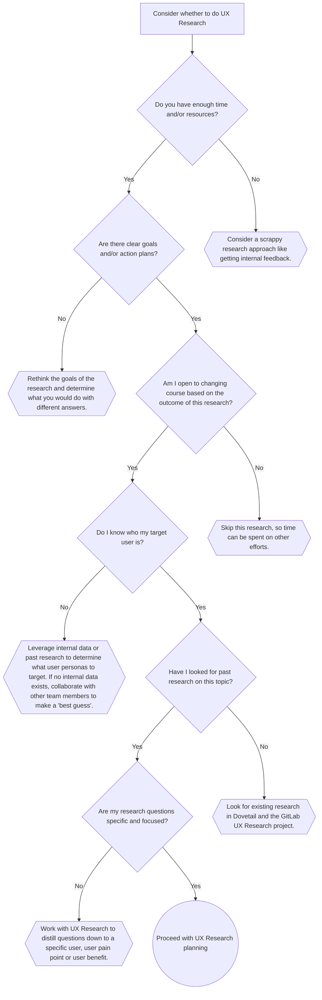

UXリサーチは、ユーザーの真のニーズに応え、期待に合致する製品を開発するうえで重要な役割を果たします。リサーチを行うことが**最も**効果的になるのはいつなのか、そして製品開発のどの時点でどのような質問に答える必要があるのかを知ることが重要です。

UXリサーチを実施する**理想的な**タイミングはいつでしょうか？簡単に答えると、UXリサーチは製品開発プロセスのなかで可能な限りいつでも適用できますし、適用すべきです。

以下のセクションで取り上げる内容は、20分の自己ペース型の[LevelUpコース（社内リンク）](https://levelup.csod.com/ui/lms-learning-details/app/course/2297b41c-3b7c-450a-913e-71f11f6da947)でより詳しく扱っています。

## 製品ライフサイクルにおけるUXリサーチの位置付け

一般的に、UXリサーチは製品開発ライフサイクルの**どの段階**にも挿入できます。ただし、リサーチの種類はチームがライフサイクルのどこにいるかによって変わってきます。このページを読み進めるなかで、どのようなリサーチが可能であり、**いつそれが適切（または不適切）**なのかについてさらに学んでいきます。

### ダブルダイヤモンドモデルとGitLabの製品開発フロー

British Design Councilは、UXデザインのためのプロセスモデルである[ダブルダイヤモンドモデル](https://www.designcouncil.org.uk/our-resources/the-double-diamond/)を開発しました。これは2つの異なるフェーズを表す2つのダイヤモンドで構成されています。

- フェーズ1: 正しいものをデザインする
- フェーズ2: ものを正しくデザインする

出典: [Wikipedia](https://en.wikipedia.org/wiki/Double_Diamond_(design_process_model))

これら2つのフェーズは、[GitLabの製品開発フロー、特にValidationトラック](/handbook/product-development/how-we-work/product-development-flow/#workflow-summary)にマッピングされ、「フェーズ1: 正しいものをデザインする」は「[問題検証](/handbook/product/ux/experience-research/problem-validation-and-methods/)」に、「フェーズ2: ものを正しくデザインする」は「[ソリューション検証](/handbook/product/ux/experience-research/solution-validation-and-methods/)」に対応します。

- 理論上は、製品開発ワークフローのどこにいるかに合わせてリサーチを実施すべきです。しかし実際には、すでにソリューションが用意されていてリサーチを行っていない場合でも、ユーザーから学ぶ時間はまだあります。
- リサーチを活用するたびに製品を何度も改善できるため、リサーチは頻繁に実施しましょう。製品が形になっていくにつれて、リサーチの目的も進化していきます。

### 正しいものをデザインする/問題検証

通常、このフェーズは、私たちが解決を目指すユーザーに関する初期の問題提起から始まります。たとえば、お客様との通話で何かを聞いたり、これらの初期の問題提起を形作る顧客フィードバックを見たりすることがあります。また、ユーザーが直接共有していないにもかかわらず、彼らが経験している可能性のあることについての推定や仮説があることも一般的です。

いずれにせよ、次に続くのは、ユーザーの体験を深く理解することを目指す発見的リサーチのフェーズです。これは、ニュアンスや詳細を徹底的に理解するために、できるだけ多くのデータを収集するタイミングです。広く展開し、発散し、それに伴う複雑さを受け入れることがポイントです。このフェーズは「Discover（発見）」と呼ばれます。

十分なデータが集まると、最初のダイヤモンドの後半である収束のフェーズが始まります。これは、学びを集約して初期の問題提起を見直したり、発見的リサーチが仮説や推定から始まった場合には新たに問題提起を作成したりするタイミングです。このフェーズは「Define（定義）」と呼ばれます。

問題検証リサーチについては、いずれも同じゴールがあります: *「**問題の徹底的な理解**: チームが、問題、それが誰に、いつ、なぜ影響を与えるのか、そしてその問題を解決することがビジネスニーズと製品戦略にどうマッピングされるかを理解している。」*

### ものを正しくデザインする/ソリューション検証

ソリューション検証フェーズは、問題提起が明確に定義されると始まります。最初は再び発散フェーズで、プロダクトデザイナーが多くの異なるソリューションを探索しイテレーションします。このタイミングでソリューション検証を実施し、さまざまなデザインのイテレーションに情報を与え、影響を及ぼすことが役立ちます。フェーズの最後には、実装に進めるための1つのデザインソリューションがあります。

ソリューション検証のゴールは次に沿っています: *「**提案されたソリューションに対する高い確信**: 問題提起のなかで概説されたjobs to be doneが提案されたソリューションによって満たされるという確信。」*

### ここで止まらないでください - まだ実施すべきUXリサーチがあります

機能がユーザーにリリースされたあとも、体験を継続的に改善するためにユーザーから定性的および定量的なフィードバックを引き続き収集することが重要です。これはGitLabの開発ワークフローの「改善フェーズ」、特に[Buildトラック](/handbook/product-development/how-we-work/product-development-flow/#build-track)に包含されています。

改善フェーズのゴール:

1. **定性的フィードバックを理解する**: 何かを改善する方法を知るためには、ユーザーやチームメンバーから聞こえてくる定性的フィードバックを理解することが重要です。ユーザーインタビュー、アンケートの自由記述、GitLabのIssue内に残されたお客様のコメントは、新しい機能がどれだけうまく受け入れられているかをチームに伝えるのに役立ちます。
1. **定量的な影響を測定する**: 定性的データは、[ユーザーの行動の理由、方法、または内容](/handbook/product/ux/experience-research/problem-validation-and-methods/#descriptive-and-informative-research-methods)を詳細に理解するのに優れています。さらに一歩進んで、定量的データと組み合わせることで、規模感のなかで何が起きているかの全体像を描くのに役立ちます。実装中には、変更のパフォーマンスとエンゲージメントをレビューできるよう、Tableauでダッシュボードを設定しましょう。

改善フェーズからの洞察は、新たな問題検証またはソリューション検証のラウンドを開始するきっかけになることがあります。

### リサーチを実施するタイミング

リサーチはダブルダイヤモンドの初期に最も有用となる傾向がありますが、各段階でリサーチを実施することは有益です。

#### 追加の検討事項: 確信度とリスクの天秤

ソリューションや基礎的リサーチに対する確信度を検討する際には、リスクも考慮に入れる必要があります。それを助けるために、それぞれがどのように定義されるかを確認し、考えるべきいくつかの質問を投げかけてみましょう。

**確信度** - *自分のデザインがUXに悪影響を与えないという確信がどれくらいあるか?*

確信度のレベルを測るために自分に問いかけるべき質問の例:

- 高い確信度を持っている理由を示せますか?（例: ソリューション検証研究の結果、過去の関連リサーチの参照などの結果かもしれません。主に、勘ではなく具体的な根拠を特定したいところです。競合のソリューションを根拠として参照することは魅力的ですが、競合がソリューションを情報源にするためにどの程度自らリサーチを行ったかは不明なため、リスクがあります。）
- あなたのデザインはデザイン[ガイドライン](https://design.gitlab.com/)や[基本理念](/handbook/product/ux/product-designer/#product-design-process)に従っていますか? [デザインとUI変更のチェックリスト](https://docs.gitlab.com/development/contributing/design/#checklist)をレビューしましたか?
- [UXスコアカード](/handbook/product/ux/ux-scorecards/)を実施しましたか? もしそうなら、結果は何で、それを踏まえて何を行いましたか?
- なぜあなたのデザインがネガティブなユーザー体験を引き起こさないと考えていますか?

**リスク** - *デザインがUXに悪影響を与えた場合、何が起こるか?*

リスクを天秤にかけるために自分に問いかけるべき質問の例:

- そのデザインまたはリサーチは、ワークフロー/JTBDにとってクリティカルな体験に関連していますか?
- このワークフローは高トラフィックなワークフロー/JTBDとみなされていますか?
- ユーザーがそのワークフロー/JTBDの最中にユーザビリティの問題に遭遇した場合、何が起こりますか?（例: それは彼らにとってどれほど深刻ですか?）
- もしデザインが世に出てユーザーがネガティブなUXだと感じた場合、UXがタイムリーに対処される可能性はどれくらいですか?（例: チームが計画している他の優先事項を考慮して、戻ってデザイン問題に対処するのはどれほど実現可能ですか?）
- 確信度を高めるためにリサーチを実施するのに追加でどれくらいの時間がかかりますか?（例: それはプロジェクトのタイムラインに対するリスクですか?）

上記の質問に対する回答を得ることは厳密な要件ではありませんが、特定のトピックに関してリサーチが必要かを判断する際に確信度とリスクを天秤にかけるベストプラクティスです。この演習は問題検証とソリューション検証の両方に適用できることに注意してください。

## UXリサーチをすべきでないとき

リサーチが適切な場合は多くありますが、リサーチを**しない**理由を考慮し損ねることもよくあります。

- **時間またはリソースの制約**: 研究の納期が非常に厳しい、リサーチの質問に答えるための十分な資金がない、チームメンバーがキャパシティに達している、といった状況です。とはいえ、こうした制約があるときの簡易的なリサーチ（例: 望ましい数より少ない参加者/データ、ユーザーをリクルートする代わりにチームメンバーからフィードバックを得る）は、リサーチを行わないよりも常に良いものです。
- **リサーチの質問が広すぎる**: 場合によっては、リサーチの質問が引き受けるには複雑すぎることがあります（例: 顧客がDevOpsプラットフォームに求めているものは何か）。UXリサーチャーは、質問が実現可能なかたちに絞り込めるかどうかを判断する必要があります。
- **目標やアクションプランが不明確**: ユーザーフィードバックに応えて製品に有意義な変更を加えたり、製品の方向性に関する決定をしたりする計画がない場合です。リサーチの発見事項には、プロジェクト開始前に何らかの特定された影響への道筋があるべきです。「このリサーチの期待される成果は何か?」という質問に明確に答えられるべきです。
- **形式的にリサーチを使う**: すでに決定が下されたあとにUXリサーチャーが呼ばれ、決定を裏付けるためにリサーチを実施するよう依頼されるケースです。このような状況では、リサーチに基づいて変更を加える機会はほとんどありません。
- **そのトピックに関する過去のリサーチや内部データがすでに存在するとき**: チームが内部データが利用可能であることに気づいていないか、特定のトピックでリサーチを実施することを依頼する前に探そうとしていない場合です。
- **ターゲットユーザーが誰か、またはどうやって見つけるかが混乱している**: 問題が、どの種類のユーザーが影響を受け得るかを知るのに十分理解されていないか、求められるユーザーのタイプが狭すぎてリクルートできない状況です。
