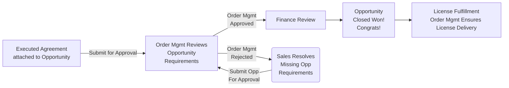
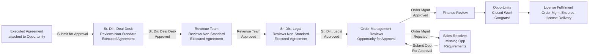

**Sales Order Processing ページへようこそ！**

このページは Quote to Cash プロセスを概説します。トピックには、アカウントとオポチュニティの作成、クォート構成と承認、オポチュニティのブッキング要件、オポチュニティのクローズが含まれます。このページではまた、オポチュニティがクローズされた後に発生する一般的な質問もカバーします。

### 役立つリンク

- **Salesforce レポートとダッシュボード**

  - [Current Quarter WW Sales Dashboard](https://gitlab.my.salesforce.com/01Z4M0000007H7W)
  - [Monthly Bookings Report](https://gitlab.my.salesforce.com/00O61000004Ik27)
  - [Deal Desk Pending Opportunity Approvals Report](https://gitlab.my.salesforce.com/00O4M000004e0Dp)

- **頻繁に使用されるハンドブックページ**

  - [Sales Order Processing](/handbook/sales/field-operations/order-processing/)
  - [How to Work with Legal](/handbook/legal/customer-negotiations/)
  - [Deal Desk Opportunity Approval Process](/handbook/sales/field-operations/order-processing/#submit-an-opportunity-for-booking)
  - [Bookings Policy](/handbook/sales/field-operations/order-processing/#bookings-policy)
  - [Useful Company Information](https://gitlab.com/gitlab-com/finance/wikis/company-information)
  - [Account Ownership Rules of Engagement](/handbook/sales/field-operations/gtm-resources/rules-of-engagement/#account-ownership-rules-of-engagement)
  - [ARR Calculation Guide](/handbook/sales/sales-term-glossary/arr-in-practice/)
  - [Vendor Setup Form Process](/handbook/sales/field-operations/order-processing/#how-to-process-customer-requested-vendor-setup-forms)
  - [Security Questionnaire Process](/handbook/security/#process)
  - [Troubleshooting: True Ups, Licenses + EULAS](/handbook/support/internal-support/#regarding-licensing-and-subscriptions)
  - [Licensing FAQ](https://about.gitlab.com/pricing/licensing-faq/)
  - [Legal Authorization Matrix](/handbook/finance/authorization-matrix/)
  - [Trade Compliance](/handbook/legal/trade-compliance/)

- **その他のリソース**

  - [Sales Territory Spreadsheet](https://docs.google.com/spreadsheets/d/1PYU8oQJQEPpi8K-SHuqSgPeSpLcWeSQd9FuwKtgD048/edit?ts=5d6ea274#gid=0)
  - [Quote Approval Matrix](https://docs.google.com/document/d/1-CH-uH_zr0qaVaV1QbmVZ1rF669DsaUeq9w-q1QiKPE/edit?ts=5d6ea430#heading=h.ag75fqu12pf0)
  - [Billing FAQs and Useful Tips](https://gitlab.com/gitlab-com/finance/-/wikis/Billing-Team-FAQs-&-Useful-Tips)
  - [Sample Order Form (Blank)](https://drive.google.com/open?id=1NB5KH7U4cucjiOjUdZrq94mYGzH6jG4f)

### **アカウントとコンタクトの作成**

#### アカウントを作成する方法

1. Salesforce の Accounts タブをクリックします。
2. 「New」ボタンをクリックします。
3. レコードタイプとして「Standard」または「Partner」のいずれかを選択します。レコードタイプごとに異なるアカウントレイアウトがあります。
    - 「Standard」 = すべての非リセラー/ディストリビューターアカウント
    - 「Partner」 - リセラー/ディストリビューター/MSP アカウントのみ（注: sales はパートナーアカウントを作成すべきではありません。ポイント 6 を参照）
    - 注: 顧客でもあるパートナーは、2 つの別々のアカウント（1 つのパートナータイプアカウントと 1 つのスタンダードタイプアカウント）を持つ必要があります。
4. アカウント作成画面で、以下を行います:
    - 必須フィールドをすべて入力します。
    - 「Domain」の下に正しい URL を入力するように注意してください。これは顧客と関連するセールスセグメントの識別に影響します。
    - Save をクリックします。
5. 顧客またはパートナーに関する詳細情報（完全な法的名前、完全な請求先住所、その他の関連詳細を含む）を必ず入力してください。
6. アカウントが `Partner` アカウントの場合、Impartner でアカウントを作成するパートナー、または Partner Operations 経由で手動で作成する必要があります。Sales はパートナーアカウントを作成すべきではなく、[#partner-programs-ops](https://gitlab.slack.com/archives/CTM4T5BPF) で Slack する必要があります。

#### コンタクトを作成/編集する方法

1. 「New Contact」ボタンをクリックします。
2. すべてのコンタクトについて、フルネーム（名）、姓、役職、電話番号、メールアドレス、完全な住所を追加します。
    - Salesforce では、クォートに「Sold To」「Bill To」または「Invoice Owner Contact」として入力されたすべてのコンタクトに、完全な住所が必要です。完全な住所のないコンタクトを含むクォートオブジェクトは保存されません。

### **クォート構成**

以下は、注文を処理する前に注意すべきクォートタイプと重要なクォート情報のハイレベルなガイドです。オポチュニティ作成手順とオポチュニティ管理ガイドラインについては、[**Go To Market Handbook**](/handbook/sales/field-operations/gtm-resources/) を確認してください。各クォートタイプに固有の文書化された手順とビデオチュートリアルについては、[**Deal Desk Quote Configuration Guide**](/handbook/sales/field-operations/sales-operations/deal-desk/#zuora-quote-configuration-guide---standard-quotes) を確認してください。

**参照リンク: [Starter/Bronze End of Availability + Tier Re-naming](/handbook/sales/field-operations/sales-operations/deal-desk/#quoting-guide-starterbronze-end-of-availability--silvergold-re-naming) Quoting ガイド**

#### 標準クォートタイプ

クォートには 4 つの異なるタイプがあります - New Subscription、Amend Existing、Renew Existing、Cancel Existing。クォートタイプは通常、オポチュニティタイプと整合します。各オポチュニティに対して正しいクォートタイプを使用する必要があります。

| **Quote Type** | **When to Use** |
|-----------------|:-------------|
| [New Subscription](/handbook/sales/field-operations/sales-operations/deal-desk/#new-subscription-quote) | 任意の新しいサブスクリプション期間、または顧客が期間長さを変更している Renewal |
| [Amend Subscription](/handbook/sales/field-operations/sales-operations/deal-desk/#amend-subscription-quote)     | このクォートタイプを使用して、**現在のサブスクリプション期間中に**ユーザーを追加、true up、または製品ティアを変更します。（注: 更新日前に追加された True-up は、同じ期間の true-up 要件を排除しません。これは更新時に課金されます。True-up は、常に更新時に認識される後ろ向きの一回限りの料金です。期間中のライセンスアドオンは、更新時に課金される将来の true-up を排除します。） |
| [Renew Existing Subscription](/handbook/sales/field-operations/sales-operations/deal-desk/#renew-subscription-quote)      | 顧客が現在の期間の終わりにあり、同じ期間長さで更新したい場合      |
| [Cancel Existing Subcription](/handbook/sales/field-operations/sales-operations/deal-desk/#contract-reset)      | これは Contract Reset に使用されます - contract resets のサポートについてはオポチュニティボタン経由でサポートケースを開いてください      |

#### クォートテンプレートタイプ

GitLab は各タイプのトランザクションをサポートするために 5 つのクォートテンプレートを使用します。以下のクォートテンプレートはすべてのクォート（New Subscription、Amendment、Renewal）で利用可能です。各 route to market に固有の受諾言語があるため、取引に正しいクォートテンプレートを使用する必要があります。

| Template                            | Use For                                                                                                  |
|-------------------------------------|----------------------------------------------------------------------------------------------------------|
| Standard Order Form                 | ほとんどのクォート（アライアンスマーケットプレイストランザクション、EDU/OSS/YC、または既存契約 (MSA) のある顧客を含む） |
| Standard Order Form (Hide Discount) | Direct Deal の Discount と List Price 列を非表示にします。それ以外は Standard Order Form と同じ |
| Authorized Reseller Order Form      | Authorized Reseller トランザクション                                                                         |
| MSP Order Form                      | Managed Service Provider トランザクション                                                                    |
| Distributor Order Form              | Distributor トランザクション                                                                                 |

事前承認された Legal Language を各クォートに追加できます。選択肢はクォートオブジェクトの Toggle Field としてリストされています。

| Toggle Field                   | Output                                                                                   |
|--------------------------------|------------------------------------------------------------------------------------------|
| Annual Payments                | Annual Payment Language が Order Form PDF の Payment Details に入力されます           |
| Customer Reference Language    | Customer Reference Language が order form の Notes セクションに入力されます             |
| Add Quarterly True Up Language | 標準の Quarterly True Up Language が Order Form の Notes セクションに入力されます *この言語は手動の四半期アドオンを許可し、SuperSonics Quarterly Reconciliations が適用されない場合のみ使用できます |
| Remove Signature Block         | Signature Block が削除されます。既存契約 (MSA) のある顧客に使用します        |

クォートは、選択された Legal Language が order form に追加できることを保証する自動ロジックチェックを通過します。このロジックチェックは、入力されたフィールド、route to market、販売されている製品など、クォートの特性をレビューして、追加された言語が取引構造と矛盾しないことを保証します。

場合によっては、order form を送信する前に追加のレビューと承認を必要とする選択を行います。これは通常、複雑/非標準の取引のためです。対応できない選択をした場合は、エラーメッセージが表示されます。選択を削除し、クォートを進めてください。混乱した場合、または支援が必要な場合は、Deal Desk サポートケースを開き、発生しているエラーのスクリーンショットを提供してください。

#### クォート支援

クォートに特別な非標準の編集が必要な場合、または標準クォートに関する質問がある場合は、SFDC オポチュニティレコード経由で Deal Desk サポートケースを開いて支援を求めることをお勧めします。

関連レコードへのリンク、日付、ユーザー数、その他の該当する情報を含む、できるだけ詳細な情報を提供してください。**標準クォートを除き、複雑なカスタム取引または以下にリストされているシナリオの 1 つでない限り、すべての標準クォートを作成するのは Opportunity Owner の責任です。**

#### Deal Desk はどのクォートを支援できますか？

Deal Desk は、正確性と完全性を確保するためにあらゆるクォートをレビューします。**[Standard Quotes](/handbook/sales/field-operations/order-processing/) は、オポチュニティオーナーまたは ISR によって作成および管理されることが期待されます。**

**Non-Standard/Complex Quote のリクエスト**については、Deal Desk チームがオポチュニティオーナーがクォートを正しく作成するのを支援します。これらの複雑なシナリオの例には次のようなものがあります:

- **Contract Resets:** 顧客が期間中にサブスクリプション期間をリセットしたい場合（例: アップグレードしたいが、アップグレード日から 12 ヶ月の期間をリセットしたい）、新しいサブスクリプションを作成する必要があります。この場合、Subscription Type は 'New' になり、Opportunity Type は 'Renewal' になります。Deal Desk が、この場合キャンセルされる既存サブスクリプションの残りのクレジット部分を支援します。
- **複数サブスクリプションの Co-term:** 顧客が複数のグループを持ち、サブスクリプションを統合したい場合、「Renewal Business」オポチュニティに対して「Amendment」が作成される場合があります。
- **単一サブスクリプションの分割**。逆に、顧客が単一サブスクリプションを複数のサブスクリプションに分割する必要がある場合があります。これが発生した場合、Subscription Type と Opportunity Type は 'Renewal' になります。
- **Ramped Pricing:** 見込み客や顧客が、時間の経過とともにユーザー数を増やしたい場合に、ramped pricing スケジュールを採用したい場合。ramped スケジュールの 2 つの例は次のとおりです:
  - 1 年目は 100 ユーザー、2 年目は 200 ユーザー。
  - 1 年目はユーザー 1 人あたり年間 $45、2 年目はユーザー 1 人あたり年間 $48

詳細については、[Deal Desk Quote Configuration Guide](/handbook/sales/field-operations/sales-operations/deal-desk/#zuora-quote-configuration-guide---standard-quotes) を確認してください。上記の非標準クォート要素のリストは網羅的ではないことに注意してください。このページにリストされていない非標準のニーズに遭遇した場合は、評価と支援のために、問題の SFDC オポチュニティで Deal Desk のケースを作成するための社内サポートをリクエストしてください。

#### クォート税情報

顧客がクォートからの税の削除を要求した場合、有効な Tax Exemption Certificate を提供する必要があります。これをオポチュニティに添付してください。

1. Tax Exempt - クライアントが税免除されているか確認し、SFDC のアカウントに tax exempt 証明書を読み込む必要があります。
1. Tax Exempt - 税免除の場合、ドロップダウンメニューで yes をクリックし、必要に応じて追加のメモを追加します。
1. Tax/VAT ID フィールド - 有効な VAT ID を追加することは、欧州連合諸国へのクロスカントリートランザクションの税コンプライアンスに必要です。これらは、GitLab Inc から任意の EU 国、GitLab BV からオランダを除く他の任意の EU 国、GitLab Ltd から英国を除く他の任意の EU 国、GitLab GmbH からドイツを除く他の任意の EU 国に請求する場合です。**Salesforce には[自動化ルール](https://gitlab.my.salesforce.com/01Q4M000000oVDi)があり、クォートの `VAT ID` の内容をクォートの `VAT/Tax ID` から自動的に入力します - VAT ID を更新しようとして上書きされた場合は、関連するオポチュニティで[サポートのケースを開いてください](/handbook/sales/field-operations/sales-operations/)**
1. Special Terms and Notes - 上記の設定で指定されていない追加のメモを入力します。

#### Draft Proposal を作成する方法

[クォート作成](/handbook/sales/field-operations/sales-operations/deal-desk/#zuora-quote-configuration-guide---standard-quotes)の標準プロセスに従います。Draft proposal を生成する前に、Quote Object を承認する必要は**ありません**。

1. Edit Quote をクリックします。
2. Draft Quote Template を選択します。Save します。
3. Generate PDF をクリックします。Draft Proposal PDF が、オポチュニティの Notes & Attachments セクションに添付されます。

**重要な注意事項**

- Draft Proposal PDF は Order Form ではありません。Order Form を生成する前に、すべてのクォートは適用される承認プロセスを通過する必要があります。Draft Proposals は承認が保証されていません。
- Draft Proposal PDF は、いかなる状況下でも Order Form の代わりとして受け入れられません。

### **請求とサブスクリプション管理 ("SuperSonics")**

GitLab の Cloud Licensing エクスペリエンスは、Quarterly Subscription Reconciliation と Auto-Renewals のアクティベーションとプロビジョニングを可能にし、これは SaaS と Self-Managed Subscription プランの両方に適用されます。さらに、Cloud Licensing エクスペリエンスは Operational Data を導入します。

#### Auto-Renewal、Quarterly Subscription Reconciliation、Operational Data: 適格性

SuperSonics Billing and Subscription Management Experience は、すべての適格な新規顧客と、適格な既存顧客が次回の更新時に、GitLab 14.1 を実行しており、新しい条件にオプトインしている場合、適用されます。顧客が Auto-Renewal、Quarterly Subscription Reconciliation、Operational Data の対象となるかどうかを判断するには、[Availability Matrix](https://internal.gitlab.com/handbook/product/fulfillment/#feature-availability-matrix) を確認し、[Field Team FAQ](https://docs.google.com/document/d/1XmaIDggCYespisg1MTXHMVDUnWtdRsDw_brz-ir9RrI/edit#) の [Customer Availability Summary Table](https://docs.google.com/document/d/1XmaIDggCYespisg1MTXHMVDUnWtdRsDw_brz-ir9RrI/edit#bookmark=id.jb012t7kd93k) セクションを読んでください。SuperSonics 適格性に関する質問は、#pnp-changes-field-questions Slack チャネルに送信してください。

#### Auto-Renewal、Quarterly Subscription Reconciliation、Operational Data: Sales-Assisted Transactions

SuperSonics 機能をサポートするために、特定のフィールドが Quote オブジェクトに追加されました。これらのフィールドは、クォートオブジェクトの 2 つのセクションに表示されます。

##### Zuora フィールド

このセクションには、各 SuperSonics 機能（Auto-Renewal、Quarterly Subscription Reconciliation、Operational Data）の現在の状態を示す多くのフィールドが含まれています。「Contract」フィールドは、顧客が関連機能に契約上適格かどうかを示します。「Turn On」フィールドは、その機能がサブスクリプションで実際に有効になっているかどうかを示します。

免除されていない顧客の場合、デフォルト値はすべてのフィールドで "Yes" になります。[Availability Matrix](https://internal.gitlab.com/handbook/product/fulfillment/#feature-availability-matrix) に基づいて免除されている顧客の場合、デフォルト値はすべてのフィールドで "No" になります。

- 注: 顧客が SuperSonics から免除されているか、オプトアウトしている場合、SuperSonics が適用されないことを示す Legal Language が Order Form に入力されます。これらの場合、そのような言語は GitLab Legal Team によってのみ削除または編集できます。
  - MSAs またはパートナー取引に関連する免除の場合、legal opt-out 言語は Order Form に入力されません。

| Field Name | Field Description |
|-|-|
| Contract Auto-Renewal | (Yes/No) 顧客が Auto-Renewal に契約上適格かどうかを示します  |
| Contract Quarterly Reconciliation | (Yes/No) 顧客が Quarterly Subscription Reconciliation に契約上適格かどうかを示します |
| Contract Operational Data | (Yes/No) 顧客が Operational Data に契約上適格かどうかを示します |
| Turn On Auto-Renewal | (Yes/No) サブスクリプションで Auto-Renewal が有効になっているかどうかを示します |
| Turn On Quarterly Reconciliation | (Yes/No) サブスクリプションで Quarterly Subscription Reconciliation が有効になっているかどうかを示します |
| Turn On Operational Data | (Yes/No) サブスクリプションで Operational Data が有効になっているかどうかを示します |
| Turn On Cloud Licensing | (Yes/Offline/No) 顧客が Cloud Licensing、Offline Cloud Licensing、または Legacy License File でアクティベートしたかどうかを示します |

注: Cloud License [Subscription Data](/handbook/legal/privacy/customer-product-usage-information/#subscription-data) を送信することは GitLab の標準 Subscription Agreement の一部であるため、Cloud Licensing には契約上のフィールドはありません。

##### Cloud Licensing フィールド

このセクションのフィールドは、各 SuperSonics 機能の契約上のオプトアウトを可能にします。Auto-Renewal、Quarterly Subscription Reconciliation、または Operational Data のオプトアウトをリクエストしたい場合は、クォートオブジェクトの該当ボックスにチェックを入れる必要があります。これらのボックスにチェックを入れると承認ワークフローがトリガーされ、最終的に Order Form に顧客を関連機能からオプトアウトする legal 言語が挿入されます。これらのボックスのいずれかがチェックされ、オプトアウトが承認された場合、関連する Zuora Fields は "No" にリセットされます。

| Field Name | Field Description |
|-|-|
| [Cloud Lic] Add Reconciliation Opt Out | (Checkbox) 顧客を Quarterly Subscription Reconciliation からオプトアウトします  |
| [Cloud Lic] Add Auto-Renewal Opt-Out | (Checkbox) 顧客を Auto-Renewal からオプトアウトします |
| [Cloud Lic] Add Operational Data Opt Out | (Checkbox) 顧客を Operational Data からオプトアウトします |
| License Type | (Picklist) SaaS: Default = Cloud License; Self-Managed: 選択が必要。`Offline Cloud License` または `Legacy License` を選択すると、[Deal Approval Matrix](https://docs.google.com/document/d/1-CH-uH_zr0qaVaV1QbmVZ1rF669DsaUeq9w-q1QiKPE/edit#bookmark=kix.iqw46t1jxax1) に従って承認がトリガーされます。 |

#### Quarterly Subscription Reconciliation (QSR): 仕組み

以下のプロセスは、QSR が有効になっているアクティブなサブスクリプションを持つ既存顧客で、サブスクリプション期間中に課金可能ユーザー数を超えた場合に適用されます。

##### 基準

- 既存顧客が QSR が有効になっているアクティブなサブスクリプションを持っています。
- 顧客が四半期中の任意の時点でサブスクリプション量（Max Users > Seats in Subscription）を超えています。この量は、四半期の超過数として「ロックイン」され、Zuora で請求金額として「プレビュー」され、CustomersDot データベースに保存されます。

##### タイムライン

- リコンサイレーションは、顧客のサブスクリプションの第 1、第 2、第 3 四半期の終わりに発生します。
  - SaaS の場合、グループオーナーはリコンサイレーション日にメールを受け取ります。メールは超過シート数と予想請求金額を伝えます。
  - Self-Managed の場合、管理者はリコンサイレーション日から 6 日後にメールを受け取ります。このメールは超過シート数と予想請求金額を伝えます。

##### オポチュニティ作成

- 顧客に予定されている QSR を警告するリコンサイレーションメールが送信される日に、Salesforce で次のタイトルでオープンオポチュニティが作成されます: 「[Account Name] - QSR - [Effective Date]」
  - Amount = Invoice Amount
  - Net ARR = Estimated Based on Invoice Amount
  - Stage = 6-Awaiting Signature
  - Close Date = 計画されたクロージャ日（オポチュニティ作成から 7 日後）

##### オポチュニティクロージャ

- オポチュニティ作成から 7 日後、Zuora でサブスクリプションへの修正をコミットし、顧客に送信される請求書を生成することにより、リコンサイレーションを実行します。この時点で、Salesforce で:
  - オポチュニティは自動的に Closed Won になります
  - オポチュニティが Closed Won になった夜、夜間ジョブが実行され、基礎となるクォートが作成され、オポチュニティデータフィールドが正確に入力されます。

- 注: クロージング日後にオポチュニティが Closed Won にならない場合は、オポチュニティを Closed Lost としてクローズしてください。

**重要:** QSR が払い戻された場合、Support でチケットを開くことにより max user 数をリセットする必要があります。Deal Desk がこのプロセスをサポートします。[内部プロセスガイドはこちら](https://gitlab.com/gitlab-com/sales-team/field-operations/deal-desk/-/wikis/Web-Direct-Quarterly-Seat-Reconciliation-(QSR)-Refunds)。

#### Auto-Renewal、QSR、Cloud Licensing、Operational Data からオプトアウトする方法

Sales プロセス中、Auto-Renewal、Quarterly Subscription Reconciliation、Cloud Licensing、および/または Operational Data から免除されない顧客が、これらの機能の 1 つ以上を無効にするようリクエストする場合があります。すべてのオプトアウトには [Deal Approval Matrix](https://docs.google.com/document/d/1-CH-uH_zr0qaVaV1QbmVZ1rF669DsaUeq9w-q1QiKPE/edit#bookmark=id.6ae1zz9525h7) に記載されている承認が必要です。オプトアウトがリクエストされ承認された場合、Closed Won 時に問題のサブスクリプションについて関連機能が無効になります。

##### オプトアウトをリクエストするステップ

1. クォートの Cloud Licensing Fields セクションに移動し、該当する SuperSonics Feature（例: Add Auto-Renewal Opt-Out）の横のボックスにチェックを入れます。Save をクリックします。

   - このアクションは、関連する Zuora フィールドを "No" に更新します。クォートには赤い "Approvals Required" メッセージが表示されるようになります。

2. オプトアウトに必要な承認をリクエストするには、「Submit for Approval」をクリックします。
3. 承認されたら、PDF を生成します。その PDF には、適用される SuperSonics Feature から顧客をオプトアウトする legal 言語が「Notes」セクションに含まれます。

   - 後続のアドオンは契約上のオプトアウトを維持します。

#### Auto-Renewal、Quarterly Subscription Reconciliation、Operational Data を一時的に一時停止する方法

Sales プロセス中、Sales が顧客と交渉している間、来るべき Auto-Renewal または Quarterly Subscription Reconciliation を「一時停止」する必要がある場合があります。すべての一時停止には [Deal Approval Matrix](https://docs.google.com/document/d/1-CH-uH_zr0qaVaV1QbmVZ1rF669DsaUeq9w-q1QiKPE/edit#bookmark=id.6ae1zz9525h7) に記載されている承認が必要です。一時停止がリクエストされ承認された場合、その機能は次の更新が発生するまで問題のサブスクリプションで一時的に無効になります。Cloud Licensing には一時停止はできません。

##### 一時停止をリクエストするステップ

1. SFDC で該当オポチュニティに移動します。
2. Deal Desk サポートケースを開き、なぜサブスクリプションの Auto-Renewal または Quarterly Reconciliation を一時停止したいかを説明します。Deal Desk のケースを作成するための社内サポートをリクエストします。正当化が必要であることに注意してください。

   - 例: Deal Desk のケースを作成するための社内サポートをリクエストします: 「このサブスクリプションについて Auto-Renewal を一時停止するようリクエストしたいです。顧客とアップセルに取り組んでおり、更新日前に交渉が終わらない場合、現在のユーザー数でサブスクリプションを自動更新しないことを保証したいです。質問があればお知らせください。よろしくお願いします！」

3. 承認されると、Deal Desk は SFDC の Customer Subscription オブジェクトに移動して、関連機能を一時的に無効にします。auto-renewal を一時停止するには、Deal Desk は「Pause Auto-Renewal」ボックスにチェックを入れます。QSR を一時停止するには、Deal Desk は「Pause Seat Reconciliation」ボックスにチェックを入れます。機能は次の更新が発生するまで無効のままで、その時点で以前の状態に戻ります。

#### Auto-Renewal、Quarterly Subscription Reconciliation、Operational Data: よくある質問

1. **取引に取り組んでいます。SuperSonics 機能がその取引に適用されるかどうかをどのように知ることができますか？**

   - まず、クォートを作成します。クォートを保存した後、[Zuora Fields](/handbook/sales/field-operations/order-processing/#supersonics-and-sales-assisted-transactions) を確認します。「Turn On Auto-Renewal」、「Turn On Quarterly Reconciliation」、または「Turn On Operational Data」の横に "Yes" が表示されている場合、その機能は顧客に適用されます。これらのフィールドの横に "No" が表示されている場合、SuperSonics 機能は顧客に適用されず、Legal opt-out 言語が Order Form に自動的に入力されます。

1. **クォートを作成し、Order Form の Notes セクションに legal 言語が自動的に入力されました。なぜそれが起こったのですか？**

   - これは、顧客が 1 つ以上の SuperSonics 機能から免除されていることを意味します。これらの SuperSonics 機能は取引には利用できず、これらの機能が適用されないことを明確にするために、Order Form に legal opt-out 言語を配置する必要があります。免除に関する詳細については、[Availability Matrix](https://internal.gitlab.com/handbook/product/fulfillment/#feature-availability-matrix) を確認してください。
   - 注: この言語はオプションではなく、顧客が SuperSonics にオプトインしない限り削除できません。そのようなシナリオについて議論したい場合は、Deal Desk のケースを作成するための社内サポートをリクエストしてください。

1. **顧客は SuperSonics から免除されており、Order Form の opt-out 言語の編集をリクエストしました。どうすればよいですか？**

   - Legal Team と言語の潜在的な編集について議論するために、[Legal Request](/handbook/sales/field-operations/order-processing/#contact-legal) ケースを開いてください。

1. **サブスクリプションで Auto-Renewal または Quarterly Subscription Reconciliation が有効になっているかどうかをどのように知ることができますか？**

   - SFDC アカウントに移動し、「Subscriptions」関連リストをクリックします。問題のサブスクリプションを選択し、「Auto-Renewal」と「Quarterly Reconciliation」フィールドを確認します。これらが "Yes" とマークされている場合、これらのプロセスはサブスクリプションに適用されます。これらのフィールドが "No" とマークされているか空白の場合、これらのプロセスはこのサブスクリプションでは発生しません。

1. **QSR オポチュニティが自動的に開かれましたが、顧客には課金されず、オポチュニティはクローズされませんでした。どうすればよいですか？**

   - ほとんどの場合、QSR オポチュニティが開かれたが作成後 14 日以内にクローズされない場合、それは QSR が失敗し、オポチュニティを Closed Lost としてクローズすべきことを意味します。

1. **顧客は sales プロセス中に Cloud Licensing からオプトアウトしませんでしたが、現在 Legacy/Offline ライセンスファイルが必要です。顧客に Legacy/Offline ライセンスを提供するにはどうすればよいですか？**

   - 顧客に legacy または offline ライセンスファイルを提供するには、Sales はまず [Deal Approval Matrix](https://docs.google.com/document/d/1-CH-uH_zr0qaVaV1QbmVZ1rF669DsaUeq9w-q1QiKPE/edit#bookmark=id.6ae1zz9525h7) に記載されている必要な承認を収集する必要があります。Sales はその後、Support Engineering と協力して legacy または offline ライセンスを顧客に送信するようリクエストする必要があります。
   - Support チケットを開くには、[ここをクリック](/handbook/support/internal-support/#internal-requests)してください。
   - Support プロセスをレビューするには、[ここをクリック](/handbook/support/license-and-renewals/workflows/self-managed/cloud-licensing/#post-sale-exemptions-support)してください。

#### リソース

SuperSonics Billing and Subscription Management Experience に関する以下のリソースは、社内目的のみです。

- [Availability Matrix](https://internal.gitlab.com/handbook/product/fulfillment/#feature-availability-matrix)
- [Licensing Private Handbook](https://gitlab-com.gitlab.io/licensing/)
- [Field Team FAQ](https://docs.google.com/document/d/1XmaIDggCYespisg1MTXHMVDUnWtdRsDw_brz-ir9RrI/edit#)
- [Deal Approval Matrix](https://docs.google.com/document/d/1-CH-uH_zr0qaVaV1QbmVZ1rF669DsaUeq9w-q1QiKPE/edit#bookmark=id.6ae1zz9525h7)

### **Legal との作業**

オポチュニティで Legal の支援が必要なシナリオがいくつかあります。以下の情報をよくレビューしてください。チームとそのスコープについての詳細は、[ハンドブックページを訪問する](/handbook/legal/)か、これらの [Legal とのコラボレーションのベストプラクティス](/handbook/legal/customer-negotiations/)を確認することで学ぶことができます。

#### Legal への連絡

顧客に関する一般的な質問については、legal でケースを開いてください。

Customer Opportunity 内で:

1. 「Legal Request」をクリック（オポチュニティ SFDC レイアウトの上部にあります）
1. 「NOTES」セクションに質問を提供し、「SAVE」をヒット
1. 提供された情報により「Case」が開かれ、自動的に Contract Manager / Legal Member に割り当てられます
1. Contract Manager / Legal Member は質問をレビューし、ケースコメントで回答を提供し、SFDC Chatter 経由でリクエスト元の Sales Team Member をタグ付けします
1. 質問が対処されたら、Contract Manager によってケースがクローズされます。
1. **注:** Opportunity がまだ存在しない場合は、Legal Request を開くために $0 を作成してください。

<details>
<summary markdown="span"><b>Customer Vendor Setup Form と署名の取得</b></summary>

#### Customer がリクエストした「Vendor Setup Forms」を処理する方法

- 時々、顧客は GitLab に Vendor Setup ドキュメントの完了をリクエストすることがあります。これは通常、調達グループが新しいベンダーをシステムに追加するために必要です。
- Sales Team メンバーは、以下のステップに従ってそのようなフォームを完了する責任があります:

1. フォームのできるだけ多くを完了します。この情報の多くは、GitLab ハンドブックで公開されています。役立つ情報は、[Company Information](https://gitlab.com/gitlab-com/finance/wikis/company-information) ページと、Zuora クォートを介して生成された任意の direct order form の最終ページで見つけることができます;
1. GitLab ハンドブックで利用できない情報についてのみ、deal desk（SFDC のサポートケース経由）に相談します。Deal Desk チームは、関連するハンドブック情報や、質問を支援できるチームを指し示すのに役立ちます。ただし、これらのフォームを最初から最後まで入力および管理することは sales 担当者の責任であることに注意してください。
1. 法的条項や質問については、レビューと承認のために [legal ケースを開いてください](/handbook/sales/field-operations/order-processing/#contact-legal);
注: GitLab は Vendor Setup Form の追加条項に同意しません。当事者は、(a) 当事者間で合意された Order Form、および/または (b) GitLab と見込み客/顧客によって締結された確定的な契約に、提供する製品とサービスに関連するすべての適用条件を持つことになります。
1. 署名が必要な Vendor Setup Form は、標準の Signature Process（以下の [Obtain Signature](/handbook/sales/field-operations/order-processing/) プロセスを参照）に従う必要があります。
注: Sales Team Member は、いかなる文書、契約、および/または合意にも署名する権限が**ありません**。

#### 任意の外部 Contract または Agreement（Vendor Forms を含む）の署名を取得する方法

GitLab の連署が必要なすべての契約 / Agreement は、GitLab Contract Manager または法的代表者によってデジタル的にスタンプされます。これは、文書が GitLab legal によってレビューされ、精査され、署名される可能性があることを保証および示すために行われます。

**スタンプされた contract / Agreement を受け取る**

- GitLab と顧客 / 見込み客が実行可能な条件に達したら、Contract Manager または法的代表者が最終的な「Clean」バージョンを提供します。これは PDF 形式で、GitLab 署名行 / ブロックの下にデジタルスタンプが含まれており、(i) 承認した GitLab legal メンバーの名前、(ii) 承認日を示します。
- 最終契約に達した場合、Sales Team Member は契約 / Agreement にスタンプ（前述）が含まれていることを確認する必要があります。スタンプが含まれていない場合は、交渉に関与した contract manger または法的代表者に連絡してください。デジタルスタンプの必要性が通知されると、Contract Manager または法的代表者が応答し、迅速に添付します。
- GitLab Contract Manager または法的代表者による承認を示すデジタルスタンプのない Contract / Agreement は拒否され、署名されません。

注: 非常に少ないケースで、顧客は電子署名ツールのために、署名のために GitLab Legal スタンプ付きの PDF を使用することを拒否する場合があります。これが該当する場合、署名される Agreement を提供し、署名権限を持つ個人に以下の情報を通知してください: (I) 顧客のツールセットが GitLab Legal スタンプの使用を禁止していることの概要、および (II) Contract / Agreement が交渉された SFDC ケースへのリンク。この情報があれば、署名権限を持つ GitLab 個人は、実行のためにリクエストされたバージョンと、ケースで Legal によって承認された最新バージョンを比較できます。

署名 Authorization Matrix はこちらで見つけることができます: /handbook/finance/authorization-matrix/

**Signature のプロセス**
交渉が完了し、デジタルスタンプが contract / Agreement の最終バージョンに付与されたら:

1. SFDC で contract のステータスを 'Approved to Sign' に変更します; そして
1. DocuSign で署名のために [contract をステージング](https://support.docusign.com/s/document-item?language=en_US&rsc_301=&bundleId=ulp1643236876813&topicId=lak1578456412477.html&_LANG=enus)します;
1. Customer に送信し、CFO（Brian Robins）に cc します。

</details>

<details>
<summary markdown="span"><b>SaaS SLA Addendum を Order Form に追加</b></summary>

SaaS SLA Addendum を order form に追加するには、クォートのすべての承認が確保された後で Legal ケースを開いてください。

</details>

<details>
<summary markdown="span"><b>輸出コンプライアンス</b></summary>

#### Trade Compliance（Export / Import）と SalesForce の Visual Compliance Tool

1. なぜ Trade Compliance（Export / Import）が重要なのか
    1. 遵守しないことは、米国および GitLab が運営する他の国にとって有害になる可能性があります
    1. それは法律です！
    1. 遵守しないことは、GitLab および/または GitLab チームメンバーへの罰金または刑罰につながる可能性があります
    1. 非遵守は、連邦顧客への販売不能、顧客、パートナー、投資家の信頼喪失、および幹部および違反者への罰金または刑罰につながる可能性があります
1. 詳細については、[Trade Compliance](/handbook/legal/trade-compliance/) ハンドブックページと [Code of Business Conduct & Ethics](https://ir.gitlab.com/governance/governance-documents/default.aspx) ページを参照してください。
1. GitLab は GitLab SalesForce アカウントに接続された「Visual Compliance」と呼ばれるサードパーティツールを使用しています
1. このツールは、一致がないことを保証するために、さまざまなデータベースに対してアカウント情報をチェックします。アカウントは、GitLab の継続的なコンプライアンスを保証するために繰り返しチェックされます

1. VISUAL COMPLIANCE STEPS
    1. アカウント情報は、Opportunity または他のアクションがそのアカウントに対してリクエストされたときに Visual Compliance に取り込まれます。
    1. 情報は、非遵守 / アカウントの問題について自動的にレビューされます
    1. アカウント情報が NO MATCHES を提供する場合、Visual Compliance はアカウントを CLEAR します
        1. 注: Visual Compliance は 15 分ごとに SFDC を更新します
    1. アカウント情報が「hit」を提供する場合（規制または制限からの情報の一部の要素と一致することを意味）、GitLab legal メンバーがアカウントを手動でレビューします
        *注: GitLab legal はこれらのアカウントを 09:00、12:00、5:00（CENTRAL TIME）にレビューします
    1. アカウントが承認された場合、GitLab legal メンバーがアカウントを CLEAR し、Visual Compliance が更新します（15 分ごと）
        *注: GitLab legal がアカウントに問題を見つけた場合、アカウントが「ロック」されていることを Sales Team に警告し、次のステップを検証する作業を行います。

1. 私のアカウントが Export Compliance Review のためにフラグ付けされました！
    1. 関連するアカウントの chatter で Legal をタグ付けしてください。アカウントは 1 日中定期的にレビューおよび検証されます。EC レビューのためにフラグ付けされたアカウントをアンロックできるのは Legal チームのみです！！

1. SALES は何をすべきか？
    1. アカウントの情報が正確であればあるほど良いです！つまり、完全な会社名、会社住所、コンタクト名を提供してください。部分的な情報は「hits」となり、プロセスを遅延させます
    1. アカウントを更新しようとして以下のエラーが表示された場合:
        *(i) アカウントの Visual Compliance セクションが「Pending」と表示されているかチェックします - システムが初期チェックを実行して更新するまで 15-30 分待ちます。ただし、Visual Compliance が潜在的な「hit」を見つけた場合、以下に従ってクリアされます
        *(ii) アカウントの Visual Compliance セクションが「Yellow」または「Red」と表示されている場合 - legal チームがコンプライアンスを保証するためにアカウントを手動でレビューしています。これは 1 日に 3 回行われ、アカウントを自動的に更新します - 同じ日にアカウントを再度確認してください
        *(iii) アカウントが即座のアクションを必要とする場合（例: 取引のクロージング）、アカウントで Chatter メッセージを開き、「@legal」とメッセージします - 受信時に Legal チームが即座にレビューし、Visual Compliance で更新します - 変更は 15-30 分で更新されるはずです
    1. Visual Compliance セクションが更新されたら、すべてのアカウント機能が戻り、進めることができます

</details>

<details>
<summary markdown="span"><b>カスタム契約の作成またはクォートへのカスタム条項の追加</b></summary>

#### Agreement Terms の交渉プロセス（該当する場合）と Legal への連絡

オポチュニティが金額の閾値を満たす場合:

- $25,000 ARR (USD) より大きい Opportunity で、GitLab Agreement テンプレートの編集をレビュー
- $100,000 ARR (USD) より大きい Opportunity で、Customer テンプレート / 合意バージョンをレビュー

Sales Team Member は、(i) GitLab Templates の編集可能なバージョン、(ii) 契約交渉のエンゲージメント、(iii) Customer / Opportunity に関連する一般的な質問の支援のリクエストを行うために、以下のワークフローに従います。

GitLab Legal をエンゲージするプロセスのプレゼンテーション概要は、[**こちら**](https://docs.google.com/presentation/d/1lesWNvPAFd1B3RuCgKsqQlE85ZEwLuE01QpVAKPhQKw/edit#slide=id.g5d6196cc9d_2_0) で見つけることができます

ビデオチュートリアルは [**こちら**](https://www.youtube.com/watch?v=CIWdsqRX7E0&amp=&feature=youtu.be) で見つけることができます

Slack で #Legal を介して直接 Legal に連絡できます

#### GitLab Template の編集可能なバージョンをリクエスト

Customer Opportunity 内で:

1. 「Legal Request」をクリック（Opportunity SFDC レイアウトの上部にあります）
1. 「**Type of Legal Request**」で「**Request for GitLab Agreement Template**」を選択
1. 「**Type of Contract**」で希望のテンプレートを選択。例えば、Non-Disclosure Agreement リクエストの場合は「NDA」を選択
1. 「**Contract Source**」で「**GitLab Contract Template**」を選択
1. GitLab Contract Manager / Legal に役立つ追加のメモを追加し、「SAVE」をヒット
1. 提供された情報により「Case」が開かれ、自動的に Contract Manager / Legal Member に割り当てられます
1. Contract Manager / Legal Member はリクエストされたテンプレートを添付し、リクエスト元の Sales Team Member をタグ付けします
1. Sales Team Member はテンプレートバージョンを取り、Customer に提供します

   - 注: Sales Team Member は Customer とのコミュニケーションに責任があります。これには、GitLab テンプレートと交渉された条件の返却が含まれます。

1. **注:** Opportunity がまだ存在しない場合は、Legal Request を開くために $0 を作成してください。

**この時点で、Contract Request Case は「Closed」とマークされます。Customer の編集の「Contract Review」を開始するには、以下のステップに従ってください。**

#### GitLab レビューのリクエスト: GitLab Template への Customer の編集または Customer Agreement Template

Customer Opportunity 内で:

1. 「Legal Request」をクリック（Opportunity SFDC レイアウトの上部にあります）
1. 「**Type of Legal Request**」で「Contract Review」を選択
1. 「**Type of Contract**」で交渉中の Agreement / Template のタイプを選択。例えば、Non-Disclosure Agreement リクエストの場合は「NDA」を選択
1. 「**Contract Source**」で適用される Agreement / Template Source を選択

   - GitLab Agreement / Template への編集の場合、「**GitLab Contract Template**」を選択。注: Opportunity サイズが $25,000 (USD) を超えていることを確認してください
   - Customer Agreement / Template を GitLab に編集するようリクエストするには、「**Customer Contract Template**」を選択。注: Opportunity サイズが $100,000 (USD) を超えていることを確認してください

1. GitLab Contract Manager / Legal に役立つ追加のメモを追加し、「SAVE」をヒット
1. 提供された情報により「Case」が開かれ、自動的に Contract Manager / Legal Member に割り当てられます
1. Contract Manager / Legal Member は Agreement / Template をレビューし、更新された red-lines を添付します

   - Sales Team メンバーは（SFDC Chatter 経由で）Agreement が更新され、顧客に送信する準備ができたことを警告されます

1. 別の編集ラウンドが必要な場合、Sales Team メンバーは Customer 提供の red-lines を添付し、割り当てられた Contract Manager / Legal Member を（SFDC Chatter 経由で）タグ付けします
1. 実行可能なバージョンに達するまで同じステップが繰り返されます。その時点で、Contract Request Case はクローズされます。
1. Sales Team Member は [「Obtain Signatures」](/handbook/sales/field-operations/order-processing/#how-to-obtain-signatures-for-any-external-contract-or-agreement-including-vendor-forms) のステップに従い、完全に実行されたバージョンを Customer Account に添付します。
注: 上記のプロセスは、Order Forms に非標準言語を追加するために Contract Managers / Legal Members をエンゲージするためにも使用できます
1. **注:** Opportunity がまだ存在しない場合は、Legal Request を開くために $0 を作成してください。

**すべてのコミュニケーションと Agreement のバージョンは、Contract Request Case で保管する必要があります**

#### GitLab Partner Agreement のリクエスト

Customer Opportunity 内で:

1. 「Legal Request」をクリック（Opportunity SFDC レイアウトの上部にあります）
1. 「**Type of Legal Request**」で「**Request for GitLab Agreement Template**」を選択
1. 「**Type of Contract**」で「**Other Agreement**」を選択
1. 「**Contract Source**」で「**GitLab Contract Template**」を選択
1. Notes セクションに (i) Partner 名、(ii) Partner のタイプ（Referral、Reseller、または Distributor）を追加し、「SAVE」をヒット
1. 提供された情報により「Case」が開かれ、自動的に Contract Manager / Legal Member に割り当てられます
1. Contract Manager / Legal Member はリクエストされたテンプレートを添付し、リクエスト元の Sales Team Member をタグ付けします
1. Sales Team Member は Partner Agreement のカバーページを更新して、Partner 情報（つまり、Territory、Partner Address など）を含めます
1. Sales Team Member は Agreement を Partner に（PDF として）送信する必要があります。編集可能なバージョンが必要な場合は、もともと提供された「WORD」フォームを送信できます。

   - 注: Sales Team Member は Partner とのコミュニケーションに責任があります。これには、GitLab テンプレートと交渉された条件の返却が含まれます。

1. **注:** Opportunity がまだ存在しない場合は、Legal Request を開くために $0 を作成してください。

**この時点で、Contract Request Case は「Closed」とマークされます。Partner の編集の「Contract Review」を開始するには、以下のステップに従ってください。GITLAB の署名が必要な文書には GITLAB LEGAL STAMP が必要であることに注意してください（OBTAIN SIGNATURE を参照）**

</details>

<details>
<summary markdown="span"><b>Legal ダッシュボードの作成または実行された契約のファイリング</b></summary>

#### 自分の Legal Request Dashboard の作成

1. 自分の Legal Request Dashboard を作成すると、作成されたすべての Open および Closed Legal Requests を確認できます。
1. その手順は以下に強調されており、[こちら](https://gitlab.zoom.us/rec/share/--dWJbirp39Lf8_fyU7lY_E4D7zvX6a823IY8vtYyk4ReS25B7mI3HrdLUM8PXat) にある録音にも記載されています

- Step 1: ダッシュボードを検索し、「Sales Rep_Legal Requests Data Template」を開いて「Clone」をクリック
- Step 2: 「Dashboard Properties」をクリックし、「Your Name_Legal Request Dashboard」を使用してこのダッシュボードにタイトルを付け、SAVE と CLOSE をヒット
- Step 3: ダッシュボードを表示している間、「Open Legal Request」レポートをクリック
- Step 4: レポート内で、「Customize」をクリック
- Step 5: 3 番目のフィルターをあなたの名前のみを含むように変更
- Step 6: 「Save As」をクリックし、レポート名を「Your Name_Open Legal Requests」に変更し、SAVE AND CLOSE をクリック
- Step 7: ダッシュボードに戻るために「Dashboards」をクリック
- Step 8: ダッシュボードを表示している間、「Closed Legal Request」レポートをクリック
- Step 9: レポート内で、「Customize」をクリック
- Step 10: 3 番目のフィルターをあなたの名前のみを含むように変更
- Step 11: 「Save As」をクリックし、レポート名を「Your Name_Closed Legal Requests」に変更し、SAVE AND CLOSE をクリック
- Step 12: ダッシュボードに戻るために「Dashboards」をクリック
- Step 13: 「Edit Dashboard」をクリック
- Step 14: Data Sources をクリックし、「Your Name_Open Legal Requests」を検索
- Step 15: このレポートを「Open Legal Request」コンポーネントにクリック＆ドラッグ
- Step 16: Data Sources をクリックし、「Your Name_Closed Legal Requests」を検索
- Step 17: このレポートを「Closed Legal Request」コンポーネントにクリック＆ドラッグ
- Step 18: 「Save」をクリックして閉じる
- Step 19: SFDC とブラウザを更新したら完了です！

#### 実行された契約のファイリング

両当事者が契約に署名した後、これらのステップを完了します:

1. 完全に実行された pdf を contract page にアップロード;
1. `Contract Status` フィールドを「Active」に編集;
1. `Contract Start Date` を入力し、該当する場合は `Contract Term (months)` フィールドに記入。入力した数に基づいて End Date が自動入力されます。Termination Date フィールドに end date を入れないでください。
1. 実行された契約から capture フィールドを持つ条項をフィールドにコピー＆ペースト。次に、「Term Capture」というドロップダウンを「Complete」に変更します。問題が発生した場合は、フィールドを「Started」に変更し、@Contracts に chatter メッセージを送信してヘルプをリクエストできます。

</details>

<details>
<summary markdown="span"><b>カスタム Agreement と GitLab の Standard Agreement の交渉</b></summary>

#### Customer Form Agreement の使用と GitLab の Standard Agreement の交渉

私たちの経験から、見込み客のフォーム合意を使用することは高価で、より重要なことに、時間がかかります。顧客合意を使用する取引は、顧客カウンセルがリクエストした変更を加えた標準サブスクリプション合意を使用して完了する場合よりも、平均してクローズに 60 日長くかかります。私たちの合意を使用することへの賛成論は次のとおりです:

1. 私たちの合意は true-up 付きの年間サブスクリプション合意であり、顧客フォーム合意は通常、ペイドアップライセンスに基づいています。
1. 私たちはオープンソース企業であり、私たちの合意は製品の CE バージョンと EE バージョンの両方のライセンスを提供し、顧客からのコードの貢献も扱います。
1. 私たちは非標準だが顧客に有利な保証および受諾条項を持っています。

GitLab フォームを使用することへの圧倒的な賛成論にもかかわらず、一部の見込み客は彼らのフォーム合意を使用することを主張します。GitLab は以下の前提でそのようなリクエストに対応します:

1. GitLab が顧客によって選択肢のソリューションとして選択されている必要があります。
1. 取引が $100,000 を超える必要があります。
1. 主要な意思決定者は、交渉から 30 日以内に問題をクロージャに導く方法で内部プロセスを促進する意欲を示す必要があります。意思決定者はまた、フォーム合意が上記のセクションで説明されているように大幅な改訂を必要とする可能性があることを理解していることを認める必要があります。
上記の項目 1 と 3 は、契約の markup を進める前に書面で認められる必要があります。

GitLab は $25,000 未満の取引に対して、私たちの標準フォームへの変更には対応しません。

#### Quote でのカスタマイズされた Customer Agreement の参照

GitLab が顧客とカスタマイズされたサブスクリプション条項に同意した場合、すべてのクォート、SOW、PO などは、当社のウェブサイトにリストされている GitLab 標準条項ではなく、それらのカスタマイズされた条項を参照する必要があります。

クォートの条項を更新するには、以下のステップに従います:

1. クォートの GitLab の URL 条項への参照を削除します。
1. 参照を以下の言語に置き換えます - 「By accepting this Quote, you and the entity that you represent (collectively, "Customer") unconditionally agree to be bound by and a party to the GitLab Subscription Agreement signed by Customer and GitLab with an effective date of mm/dd/yyyy.」
1. 両当事者によって署名されたカスタマイズされた合意の発効日を挿入します。発効日は合意に明記されているはずですが、明確に明記されていない場合は、最後の当事者が署名した日付を使用します。

#### Quote へのカスタム条項の追加

クォートにカスタム条項を追加する必要がある場合は、Deal Desk チームに通知してください。チームはレビューし、リクエストを満たせるか、または Legal と協力する必要があるかを判断します。Legal ケースを開く方法、Vendor Set Up フォームへの対応、または GitLab の Standard Agreement に関する質問の詳細については、[Legal handbook ページ](/handbook/legal/) をご覧ください。

</details>

<details>
<summary markdown="span"><b>Subscription Transfer Agreement</b></summary>

Subscription Transfer Agreement の支援については、Legal Request を開いてください。サブスクリプションを購入したアカウントの詳細（元の Opportunity を含む）と、所有権を割り当てるよう要求している更新されたアカウントの詳細を提供してください。

</details>

### Open Source、Education、Startup Application の Opportunity

GitLab は、[Developer Relations Programs](/handbook/marketing/developer-relations/programs/) を通じて、適格なエンティティに無料ライセンスを提供します: [GitLab for Education Program](https://about.gitlab.com/solutions/education/) と [GitLab for Open Source Program](https://about.gitlab.com/solutions/open-source/)、および [GitLab for Startups Program](https://about.gitlab.com/solutions/startups/) を通じて。これらのプログラムへのすべての申請は、[Developer Relations Programs applications automated workflows](/handbook/marketing/developer-relations/programs/program-resources/#automated-application-workflow) を通じて経路指定されます。**Developer Relations チームメンバーのみ**が、これらの申請とオポチュニティを処理する必要があります。チームは、ライセンスの発行/更新前にプログラム要件を検証し、これらのオポチュニティは無料であるため、異なる方法で扱われるためです。

#### 問い合わせと申請プロセス（Lead または Contact）

1. 既存のコンタクトまたは新しいリードがプログラムの 1 つに申請することに興味がある場合は、[Developer Relations Programs](/handbook/marketing/developer-relations/programs/#active-programs) のリソースを使用して適切に案内します。リードに具体的な質問がある場合は、`education@gitlab.com`、`startups@gitlab.com`、または `opensource@gitlab.com` にメールを送信するよう案内します。次に、リードを適切なプログラムマネージャー（DRI）に再割り当てします。
1. リード/コンタクトと直接的な支援が必要な状況では、リクエストされたアクションに関するメモを Salesforce で 'Community Program Owner' に chatter します。

#### Opportunity と Renewal Opportunity の割り当て

1. プログラムに関連するすべてのオポチュニティは、[Developer Relations Programs](/handbook/marketing/developer-relations/programs/#active-programs) ハンドブックに示されている対応するプログラムの Program Manager によって所有される必要があります。
1. オポチュニティまたは更新オポチュニティを割り当てる必要がある場合は、#developer-relations-programs Slack チャネルに連絡してください。

### **Discount と Payment Term Approval のための Quote を提出する方法**

以下は、discount または payment terms の承認のためにクォートを提出する必要がある Opportunity Owner のためのガイドです。クォートが顧客に送信される前に承認が必要な場合、<span style="color:red">**赤い停止標識**</span>に「**Additional Approvals Required**」とフラグが立てられます。

#### Standard Quote Approval

PDF 形式でクライアントまたは見込み客に提供する standard（非ドラフト）クォートを生成する前に、非標準の取引要素（割引、独自の支払条件、マトリックスで見つかったその他の項目）を承認する必要があります。以下のステップは、クォートを承認のために正しく提出するプロセスを概説します。この承認フローは、承認者の[私たちの承認マトリックス](https://docs.google.com/document/d/1-CH-uH_zr0qaVaV1QbmVZ1rF669DsaUeq9w-q1QiKPE/edit#heading=h.ag75fqu12pf0) の基準に従います。

1. 承認のために提出したいクォートに移動します。クォートにすべての関連情報が入力されていることを確認します。
1. 提出前に、クォートに `Submitter Comments` を入力します。承認が必要なクォートには、このフィールドを入力する必要があります。以下のフォーマットに従って、なぜ割引または承認が必要なその他の条項をリクエストしているかについての詳細を提供してください:

```text
Executive Summary
Deal Summary (including compelling event to transact) (1-2 bullets)
Previous discount (if renewal/add-on)
Ramp details (if applicable)
Rationale for Discount Request (1-2 bullets) (ex. Services included)
Strategy to increase price over time
What are we getting in return?
Is this deal competitive? (Y/N)
  If Yes, against whom?
Logo Rights? (Y/N)
```

1. **CRO/Finance Deal Approval:** 現在の [Deal Approval Matrix](https://docs.google.com/document/d/1-CH-uH_zr0qaVaV1QbmVZ1rF669DsaUeq9w-q1QiKPE/edit?tab=t.0#bookmark=kix.h86b3ktlqijh) に従って CRO および/または Finance の承認が必要な割引を適用しており、取引が >= $500k Booked ARR (Net ARR + ARR Basis) の場合、**[CRO/CFO Deal Approval Template](https://docs.google.com/document/d/1sBDE26cGC4-BXfFjicNNn7OVYhJ8jnRRpfTLpM6O6hE/edit?tab=t.0)** に記入し、承認提出前に `Submitter Comments` クォートフィールドにリンクを提供する必要があります。クォートを承認のために提出する前に、CRO と CFO がドキュメントにアクセスする権限を持っていることを確認してください。
1. 承認プロセスを開始するには「Submit for Approval」をクリックします。クォートは、承認マトリックスに基づいて適切な承認者にルーティングされます。クォートの「Approval History」関連リストで承認リクエストのステータスを追跡できます。
1. 必要なすべての承認が取得されると、通知を受け、クォートステータスは「Approved」に変更されます。これで PDF を生成し、承認されたクォートを顧客に送信できます。

注: 承認後にクォートに変更を加えた場合、新しい PDF を生成する前に再提出する必要があります。

**Contractual Discounts**

GitLab と顧客の間の署名された合意に従ってクォートに割引が適用された場合、追加の承認は必要ありません。[このプロセス](/handbook/sales/field-operations/requesting-internal-support/#salesforce-workflow)に従って Deal Desk のケースを作成し、クォート承認のオーバーライドをリクエストするために署名された合意へのリンクを提供してください。

#### Channel Quote Approval

[**GitLab Partner Program**](/handbook/resellers/#gitlab-partner-program-overview) の下、署名された Channel Partner には、製品、Partner Deal Type、Partner Engagement タイプに応じて、特定の契約上の割引が付与されます。この情報はオポチュニティレベルで自動的にキャプチャされます。詳細については、[SFDC Field Definitions](/handbook/sales/field-operations/channel-operations/#sfdc-field-definitions) と [Partner Program Discount Tables](/handbook/sales/field-operations/channel-operations/#partner-program-discounts) をレビューしてください。

**1 つの sales 認証を完了した GitLab 認可パートナーのみが GitLab 注文をトランザクションできます。**

**Discounting and Approvals** - 新しい「(Ecosystem)」SKU を使用する間、トップ製品ラインに割引を追加することで顧客割引を提供できます。この完全な割引パーセンテージは、標準の割引承認の対象となります。2 行目では、Ecosystem rate discount charge は、選択されたパートナーと SKU に基づいて動的に自動入力されます - 適切な割引が何かを把握する必要はもうありません！この値を減らすには Ecosystem チームの承認が必要です。この値を増やすことはできません。

**Reviewing the Ecosystem Discount** - Ecosystem 割引をダブルチェックしたい場合は、[この計算機](https://docs.google.com/spreadsheets/d/1b5oH9LyoGZbAKGkocqx1O7OJdsjGDx3s22XcJLxR2l4/edit?gid=1383050192#gid=1383050192) のコピーを作成し、クォートの詳細を入力できます。この計算機は社内のみに保管してください。パートナーは、Assets Library タブの下にあるパートナーポータルにログインするか、[このリンク](https://partners.gitlab.com/px/digital-asset-management/admin/media-library?renderMode=Collection&id=838659) を訪問することで、価格ファイルと計算機にアクセスできます。

**クォートの承認をリクエストするには、上記のステップに従ってください: [Standard Quote Approval](/handbook/sales/field-operations/order-processing/#standard-quote-approval)**

**Channel Approvers:** 地域 Channel Approvers に関する詳細は[こちら](/handbook/sales/field-operations/channel-operations/#channel-approvals) で見つけることができます。

承認リクエストのエスカレーションが必要な場合は、[Deal Desk に連絡してください](/handbook/sales/field-operations/sales-operations/#how-to-communicate-with-us)。Deal Desk は該当する承認をオーバーライドするか、必要な当事者から承認を求めるのを支援します。

### その他のサービスのクォート承認

#### Consulting Block クォートでの EM 承認

Professional Services SKU [consulting block](https://about.gitlab.com/services/skus/consulting-block/) を含むクォートには、Professional Services チームの Engagement Manager からの承認が必要です。割り当てられた engagement manager が誰か分からない場合は、[PS to Sales Mapping doc](https://docs.google.com/document/d/1sdehii3Eqp_CiYsGT3dDb0nKbbtwpxKQlni7t3ZgfCs/edit?tab=t.0#heading=h.1er41qhhpoj5)（社内チームメンバーのみ）をチェックしてください。

### Waived True-Ups: ポリシーと承認要件

**10 シート未満の Waived True-Ups の場合**

Sales は True-Up 承認プロセスをバイパスし、`L&R internal requests option` オプションを使用して、その後 `Gitlab.com Subscription Related > Reset max seats for QSR` を使用して、[Zendesk Form](https://gitlab-internal.zendesk.com/hc/en-us/requests/new?ticket_form_id=22783840298780) に直接チケットを提出できます。waived するシート数が 10 以下であることを指定すると、フォームフィールド `What is the link to the chatter in SFDC where this was approved?` が自動的に削除され、事前承認なしでチケットを提出できます。

**10 シート以上の Waived True-Ups の場合、エグゼクティブの承認が必要です**

1. Waived True-Ups は、[approval matrix](https://docs.google.com/document/d/1-CH-uH_zr0qaVaV1QbmVZ1rF669DsaUeq9w-q1QiKPE/edit?ts=5d6ea430#heading=h.dccvx02huo2y) に従って書面による承認が必要です。承認は SFDC の[クォート承認自動化](/handbook/sales/field-operations/order-processing/#standard-quote-approval) 経由で求める必要があります。
1. 承認が取得されたら、Sales は適切なオポチュニティとクォートを作成する必要があります。通常、true up waivers は更新後に必要であるため、amend サブスクリプションクォートを伴う Add-On オポチュニティが必要です。true up SKU は、超過が発生したのと同じサブスクリプションに追加する必要があります。クォートで、Sales は適切な true up SKU と waived するために承認された数量を、100% 割引で適用する必要があります。クォートを保存した後、Sales はクォート承認要件をオーバーライドするために Deal Desk のケースを作成するための社内サポートをリクエストする必要があります。
1. すべての GitLab 取引と同様に、waived true up 注文は[ここ](/handbook/sales/field-operations/order-processing/#opportunity-booking-requirements) で説明されているブッキング要件を満たす必要があります。ほとんどの場合、これは顧客が $0 Order Form に署名するか、$0 PO を発行する必要があることを意味します。
1. true up waiver オポチュニティをブッキングする際、Order Management が SFDC chatter で waiver について @Revenue に通知します。
1. 通知後、Revenue チームはケースをレビューし、ARR allocation の額を計算します。Revenue チームはその後、ARR Allocations Tracker に追加します。
1. ARR allocation を計算した後、Revenue チームは Chatter で影響を伝達します。この ARR allocation は、Revenue Team への最初の通知から 3-5 日以内に伝達されます。
1. ARR allocation が Chatter で伝達されると、Deal Desk は Revenue Team が提供する ARR allocation に従って、オポチュニティの Net ARR と Booked ARR を調整します。
1. 注: L&R Support は True-Ups を waive する能力を持っていません。True-Ups に関する L&R Support の責任の詳細については、[working with sales support handbook ページ](/handbook/support/license-and-renewals/workflows/working_with_sales/#support-responsibilities-regarding-true-up-waiver-requests) で見つけることができます

### Chatter 経由でクォート承認をリクエストする方法

まれに、特定の緊急または複雑な取引が chatter 経由で迅速な承認を必要とする場合があります。承認をリクエストするために以下の該当するテンプレートを使用してください。[Deal Approval Matrix](https://docs.google.com/document/d/1-CH-uH_zr0qaVaV1QbmVZ1rF669DsaUeq9w-q1QiKPE/edit#heading=h.ag75fqu12pf0) に概説されている承認者をタグ付けする必要があります。**標準クォート**については[クォートを承認のために提出してください](/handbook/sales/field-operations/order-processing/#standard-quote-approval)。chatter で追加の承認をリクエストしないでください。

**新しいサブスクリプションの承認をリクエストしている場合:**

```text
Proposed Subscription Terms:

Product Tier:
Quantity:
List Price/User/Year:
Discount:
Effective Price/User/Year:
TCV:
Contract Start Date:
Contract End Date:
Payment Terms:
Non-Standard Contract Terms:
Route to Market (Direct/Channel):
```

**Add-Ons/Upgrades/Amendments/Renewals の承認をリクエストしている場合:**

```text
Existing Subscription Terms:

Product Tier:
Quantity:
List Price/User/Year:
Discount:
Effective Price/User/Year:
TCV:
Contract Start Date:
Contract End Date:
Payment Terms:
Non-Standard Contract Terms:
Route to Market (Direct/Channel):

Proposed Subscription Terms:

Product Tier:
Quantity:
List Price/User/Year:
Discount:
Effective Price/User/Year:
TCV:
Contract Start Date:
Contract End Date:
Payment Terms:
Non-Standard Contract Terms:
Route to Market (Direct/Channel):
```

### **クォートを承認する方法**

以下は、[Deal Approval Matrix](https://docs.google.com/document/d/1-CH-uH_zr0qaVaV1QbmVZ1rF669DsaUeq9w-q1QiKPE/edit) に従って承認リクエストを受け取るクォート承認者のためのガイドです

#### どこで承認するか？

クォート承認リクエストは 2 つのソースのいずれかから発生します: [クォート](/handbook/sales/field-operations/order-processing/#standard-quote-approval)、または [Salesforce Chatter](/handbook/sales/field-operations/order-processing/#how-to-request-quote-approval-via-chatter)。

リクエストがクォートから発生した場合、メールアラートと Slack アラートを受け取ります。リクエストが SFDC Chatter から発生した場合、メールアラートを受け取ります。クォートと SFDC Chatter のどちらを通すべきリクエストかについて詳しく知るには、[こちら](https://docs.google.com/document/d/1-CH-uH_zr0qaVaV1QbmVZ1rF669DsaUeq9w-q1QiKPE/edit#bookmark=kix.1p0vwiqmoq15) をクリックしてください。

#### Quote「Submit for Approval」ボタン経由で提出された承認リクエスト

[このプロセス](/handbook/sales/field-operations/order-processing/#standard-quote-approval) 経由で提出された承認リクエストは、3 つの方法で承認できます: (1) メールアラート経由、(2) Slack アラート経由、または (3) Salesforce で直接。

ユーザーが承認のためにクォートを提出すると、クォートと [Deal Approval Matrix](https://docs.google.com/document/d/1-CH-uH_zr0qaVaV1QbmVZ1rF669DsaUeq9w-q1QiKPE/edit) で述べられている承認者の順序に従います。リクエストに関する情報とクォートへのリンクを含むメールと Slack アラートで通知されます。

##### Salesforce で直接承認

- メールまたは Salesforce で直接クォートを承認または拒否する方法をレビューするには、GitLab Unfiltered YouTube アカウントにサインインし、この[ビデオ](https://youtu.be/T47h4VNTRWU) を視聴してください。
- クォートにアクセスし、`Approval History` の下のページの一番下にスクロールすることで、Salesforce 内で直接クォートを承認または拒否できます。アクションを取るには、あなたの名前の隣の `Approve` または `Reject` をクリックします。

##### メール経由で承認

- メールまたは Salesforce で直接クォートを承認または拒否する方法をレビューするには、GitLab Unfiltered YouTube アカウントにサインインし、この[ビデオ](https://youtu.be/T47h4VNTRWU) を視聴してください。
- クォートをレビューしたら、メールに直接返信できます。有効な応答は次のとおりです:
  - `APPROVE`
  - `APPROVED`
  - `YES`
  - `REJECT`
  - `REJECTED`
  - `NO`

##### Slack 経由で承認

###### 仕組み

- Slack Approvals は、「Quote Approval Bot」を介して、Salesforce からのクォート承認リクエストを Slack に直接送信します。提出者がクォートオブジェクトの「Submit for Approval」をクリックするとすぐに、最初の承認者がリクエストを受け取ります。承認者がそのステップでアクションを取ると、後続の承認者がクォートが完全に承認されるか、ユーザーがクォートを拒否するまで、順番にリクエストを受け取ります。あなたの番が来たら、Slack で承認、拒否、コメントの追加、進行状況の監視ができます。各アクションは Salesforce に書き戻され、タイムスタンプが残されます - 私たちが慣れているのと同じです。
- Quote Approval Bot の Approval Dashboard は、すべての保留中の承認リクエストを 1 つの場所に便利にリストします。もうメールを見逃したかどうか心配する必要はありません！
  - ダッシュボードで、「Slack Approval Request Link」をクリックして元の承認リクエスト（Slack 内で承認または拒否できる）に移動するか、Quote URL をクリックして Salesforce を開いてそこでクォートをレビューできます。
  - このダッシュボードは 15 分ごとに更新されます。

###### アラートタイプ

提出者と承認者の両方が、各クォートが承認ワークフローを進む際に Quote Approval Bot 経由でアラートを受け取ります。

**承認者**は、opp とクォートに関する重要情報、Salesforce へのリンク、Salesforce に書き戻すコメント機能を持つ Approve/Reject ボタンを含む Approval Request を受け取ります。承認者はまた、承認したことを確認する Approval Alerts、拒否したことを確認する Rejection Alerts、Salesforce で承認待ちのクォートが取り消された場合に通知する Recall アラートを受け取ります。

**提出者**は、各承認者が承認したときに通知する Approval Alerts、クォートが拒否されたことを通知する Rejection Alerts、クォートが*完全に承認された*ときに通知し、Order Form を生成できることを通知する Final Approval Alerts を受け取ります。

###### FAQ

1. クォート承認のメール通知はまだ受け取りますか？

   はい、引き続きメール通知を受け取ります。メールまたは Slack のいずれかを使用できます。

2. これは chatter 承認リクエストで動作しますか？

   いいえ、chatter 承認リクエストは Slack 経由でルーティングされません。FY25 Q4 から、すべてのクォートレベルの承認はクォート承認ツール経由でルーティングする必要があります。

3. Salesforce で直接クォートを承認できますか？

   はい！Salesforce で直接承認するか、別のユーザーがあなたの代わりに承認すると、元の Slack 承認リクエストが「approved」ステータスを反映するように更新され、何もアクションを取る必要がないことが明確になります。

4. これは担当者の行動の変化を必要としますか？

   いいえ！提出者は、今日と同じようにクォートオブジェクトの Submit for Approval をクリックします。

5. これはデスクトップアプリとモバイルアプリの両方で動作しますか？

   はい！

6. セットアップのために何かする必要がありますか？新規採用者はアクセスをリクエストする必要がありますか？

   いいえ！すべての Salesforce ユーザーは go-live 時に自動的にこの機能を受け取ります。これには、将来的に Salesforce に追加される新しいユーザーも含まれます。

7. Slack で取引固有のディスカッションを直接可能にする機能はありますか？

   現時点では、Quote Approval Bot 内で取引固有のディスカッションを直接可能にする機能はありません。私たちはこの統合をカスタムビルドしており、将来のイテレーションのためにそのような機能を検討します。

###### 詳細

追加のリソースは Highspot で利用可能です。ステップバイステップの手順については [Slack Approvals slide deck](https://gitlab.highspot.com/items/6644d40fe832298666f32013) をレビューするか、Slack Approvals の動作を見るためにこの[ビデオアナウンス](https://gitlab.highspot.com/items/6644cf1179be967698ca92e2) をチェックしてください！

#### Salesforce Chatter 経由で提出された承認リクエスト

Salesforce Chatter 経由でクォートを承認するためにタグ付けされた場合は、承認が求められたのと同じ Chatter スレッドで、承認または拒否、および正確に承認または拒否しているものを明確に伝達してください。

#### クォート承認の再割り当て

クォート承認者であり、不在になる場合は、不在の間にクォート承認を委任するアクションを取ってください。承認を再ルーティングするには、以下のステップに従ってください:

1. Salesforce で、Profile feed に移動します。画面の右上にある Your Name > My Profile をクリックします。
1. Deal Desk サポートケースを開いて、不在になることを Deal Desk チームに通知し、承認が再ルーティングされる個人と、不在期間をタグ付けします。
1. SFDC で個人設定に移動します。画面の右上にある名前をクリックします。ドロップダウンで「My Settings」をクリックします。
1. Quick Find ボックスに Approver Settings を入力し、Approver Settings を選択します。結果がない場合は、Quick Find ボックスに Personal Information を入力し、Personal Information を選択します。
     1. Delegated Approver（クォートが再ルーティングされる個人）を割り当てます。
     1. Delegated Approver が [SFDC Approval Settings](https://help.salesforce.com/s/articleView?id=platform.approvals_change_approval_user_pref.htm&type=5) を「If I am an approver」または「Delegated Approver」に設定していることを確認します。

注: Delegated Approver で、承認アラートを受け取っていない場合は、支援のために sales-support に連絡してください。

#### 1 つのクォートで複数の Product Tier を承認

クォートに複数の product tier SKU（例: Premium AND Ultimate）がある場合、**[私たちのマトリックス](https://docs.google.com/document/d/1-CH-uH_zr0qaVaV1QbmVZ1rF669DsaUeq9w-q1QiKPE/edit#heading=h.ag75fqu12pf0) に従って追加の承認が必要です**。

1. fair value が請求書に表示されるものと異なる方法で配分される必要がある場合、その値は order form に割り当てられ、Zuora にプッシュされるエントリに使用されます。fair value は、ブッキング値（つまり、ARR、iACV、PCV など）を割り当てるためにも使用されます。

### **顧客に Order Form を送信する方法**

クォートのページの上部に <span style="color:green">**緑の円**</span> があり、「**Approved**」とフラグが立てられている場合、顧客に送信する準備ができています！注、クォートが承認されるまで、クォートの PDF を**生成できません**。

#### Order Form を PDF として生成する方法

1. [クォートが承認された](/handbook/sales/field-operations/order-processing/#how-to-submit-a-quote-for-discount-and-payment-term-approval) 後、Quote Template をレビューして、トランザクションに正しいフォームを選択していることを確認します。すべてのトランザクションタイプ（new、amendment、または renewal）のデフォルトテンプレートは Standard Order Form です。別のテンプレートを選択したい場合は、Order Form Template フィールドの隣の検索アイコンをクリックして、希望のテンプレートを選択します。各テンプレートの説明が、各テンプレートの隣に表示されます。
1. クォートで `Generate PDF Doc` をクリックします。ドキュメントは、オポチュニティレコードの Notes and Attachments セクションに添付として保存されます。
1. クォートオブジェクトで利用可能な Toggle Field 選択を通じて、いくつかの order form に事前承認された Legal Language を追加できます。これらのフィールドを編集するには、「Edit Quote Details」をクリックします。
1. 非標準の Legal Language は、Legal によってレビュー、承認、手動で追加される必要があります。Order Form に含める非標準の契約条項が必要な場合は、Legal Request ケースを開いてください。

#### 初めて DocuSign を設定する

SFDC から DocuSign に初めてログインする場合、アクセスを承認してログインする必要があります。プロンプトが表示されたら、これらのステップに従ってください:

1. 「Send with DocuSign」ボタンをクリックした後、この画面が表示されます。続行するには「Authorize」を選択します。

      

2. 次の画面で、DocuSign アカウントにログインします。GitLab メールアドレスを入力し、続行をクリックします。これは OKTA で自動的にログインします。

      

3. ログインしたら、DocuSign へのアクセスを許可するために「Accept」をクリックします。
4. 次の画面で、DocuSign が Salesforce にアクセスすることを許可するために「Allow」をクリックします。
5. 最終画面で、再度 Salesforce にログインするよう求められる場合があります。これ以降、アクセスが付与されます。

#### DocuSign 経由で署名のために顧客に Order Form を送信する方法


DocuSign 経由で顧客に Order Form のデジタルコピーを送信するには:

1. 承認されたクォートで、ページの上部付近の「Generate Quote PDF」をクリックします。
1. 関連するオポチュニティに進みます。
1. オポチュニティの「Google Docs, Notes & Attachments」セクションの下に PDF が生成されたことを確認します。
1. オポチュニティから、「Send with DocuSign」ボタンを選択します。

      

1. ここで、デフォルトで**最新の**ファイルが選択された DocuSign ウィンドウが表示されます。

- ドキュメント名をクリックしてドキュメントをプレビューします。
- これが正しいドキュメントの場合、**Next** をクリックします。
- これが正しいドキュメントで**ない**場合、ドキュメントの隣のボックスのチェックを外し、正しいファイルを追加します。

1. 1 つまたは複数のファイルを追加するには、「Add from Salesforce」または「Upload」（コンピュータから）を選択します:

- 「Add from Salesforce」では、オポチュニティに添付されている任意の Order Form PDF を選択できます。
  - 「Add from Salesforce」からドキュメントを選択する場合、エンベロープに追加されるように、ドキュメントの左側のボックスがチェックされていることを確認してください。
- 「Upload」では、コンピュータから任意の PDF を選択できます。注、クォートから生成されていないドキュメントは、署名タグを手動で配置する必要があります。
  - 注: 2021-06-03 より前に生成された Order Form PDF は、署名タグの手動配置が必要です。
- すべてのドキュメントが選択されたら、必ず「Next」をヒットしてください！

1. ここで **Recipient** を追加する必要があります:

- 最低限、以下を追加する必要があります:
  - Signer
- 追加の Recipient オプション:
  - Viewer
  - Receives a Copy
  - Needs to View

1. Recipient を追加するための 2 つの推奨方法のいずれかを使用します:

- 「From Salesforce」 - Salesforce のコンタクト名を入力するだけです。Select をクリックします。
  - 注: 関連する SFDC オポチュニティのコンタクトに「DocuSign Signer」コンタクトロールが選択されている場合、そのコンタクトはこのステップに到着すると自動的に signer として表示されます。
- 「By Name & Email」 - フルネームとメールアドレスを入力します。Select をクリックします。
  - 注: signer を追加するためにこのオプションを使用する場合、**「Role」を空白のままにします。**

1. 第 2 の signer を追加するには、**第 2 の recipient** を追加します。第 2 の signer が「Signer 2」とマークされていることを確認します。
1. Recipient メッセージング

- エンベロープの recipient を指定した後、**メールの件名行を変更し、オプションのメールメッセージを入力します。**
  - デフォルトでは、メールの件名行には「Please DocuSign:」という単語が接頭辞として付けられ、エンベロープにアップロードしたファイルの名前が自動的に含まれます。
  - 例えば、「Confidentiality Agreement.docx」という名前のファイルをアップロードすると、件名行はデフォルトで「Please DocuSign: Confidentiality Agreement.docx」になります。
  - 件名行は好きなものに変更できます。件名行は、Manage ページで送信されたエンベロープを表示する際に表示されるエンベロープのタイトルでもあることに注意してください。
  - エンベロープにメールメッセージを追加することもできます
  - エンベロープが開かれていない、署名されていない、または表示されていない場合のリマインダーオプションを追加できます。
  - 必要に応じてエンベロープの有効期限を設定できます

1. Next をクリックします。
1. Send Page

- **1 名の signer にドキュメントを送信する場合:** ドキュメントをレビューして、Signer 1 の署名タグが署名ブロックに表示されていることを確認します。これらのタグは、SFDC クォートから生成された任意の Order Form PDF（2021-06-03 以降に生成）に自動的に適用されます。準備ができたら、「Send」をクリックします。
  - 注: 2021-06-03 より前に生成された Order Form は、レガシー署名タグを持ち、DocuSign ツール経由で署名タグの手動配置が必要です。新しい DocuSign テンプレート（2021-06-03 から利用可能）で生成された Order Form のみが署名タグを自動的に配置します。
  - DocuSign ツール内の PDF に署名タグを手動で追加するには、画面の左上のドロップダウンメニューで適切な signer を選択します。「Standard Fields」セクションから order form の署名ブロックに適切な署名タグをドラッグ＆ドロップします。
  - 各 signer について、GitLab は以下を必要とします:
    - Signature
    - Date Signed
    - Full Name
    - Title
  - 注: 署名フィールドは、ドキュメントでアクションを取る必要がある recipients にのみ追加できます。
- **2 名の signer にドキュメントを送信する場合:** 画面の左上のドロップダウンメニューで適切な signer を選択します。「Standard Fields」セクションから order form の署名ブロックに適切な署名タグをドラッグ＆ドロップします。第 2 の signer に対しても繰り返します。
  - 各 signer について、GitLab は以下を必要とします:
    - Signature
    - Date Signed
    - Full Name
    - Title
  - 注: 署名フィールドは、ドキュメントでアクションを取る必要がある recipients にのみ追加できます。フィールドは、ドキュメントを表示またはコピーを受け取るだけの recipients には追加されません。

1. 完了したら、「Send」をクリックします。

#### DocuSign 経由で顧客が Order Form に署名したかどうかを確認する方法

1. 私たちの Salesforce インスタンスのオポチュニティレベルから、「DocuSign Envelope Status」にホバーすることでドキュメントのステータスを表示できます。

    

    - ドキュメントが送信されると、ステータスは「Sent」と表示されます。
    - ドキュメントが署名されると、ステータスは「Completed」に更新されます。
    - ドキュメントが表示されたとき、および署名されたときに、GitLab メールアドレスにメール通知を受け取ります。

2. **ドキュメントが完全に署名されると、自動的にオポチュニティに添付されます。**

#### 学習リソース

**社内リソース:**

- GitLab の DocuSign インスタンスのビジュアルデモについては、この [LevelUP Webinar from 2021-05-13](https://youtu.be/Dch4zaUQOeg) をレビューしてください
- 注: ビデオを表示できない場合は、GitLab Unfiltered にログインしていることを確認してください。[GitLab Unfiltered へのログインまたはアクセスのリクエスト方法について詳しく学べます！](/handbook/marketing/marketing-operations/youtube/#unable-to-view-a-video-on-youtube)

**DocuSign University:**

- [Send Your First Envelope](https://dsu.docebosaas.com/learn/course/620)
- [Configure Envelopes for Sending](https://dsu.docebosaas.com/learn/course/687/play/1849:2112/configure-envelopes-for-sending)
- [DocuSign Support Page](https://support.docusign.com/s/?language=en_US)

注: これらの教育リソースにアクセスするには、DocuSign の認証情報でログインする必要があります。

#### PO Remittance

すべての Purchase Order は、Sales Rep / Opportunity Owner / ISR に送付する必要があります。

このプロセスの例外は、Ariba などの調達ソフトウェアに PO を送付する顧客向けです。Ariba 経由で送信された PO は、Billing チームによってオポチュニティに添付されます。

PO が受領されたら、ブッキングのためにオポチュニティを提出する前に、オポチュニティの Google、Notes and Attachment セクションにアップロードしてください。

### **ブッキングのためにオポチュニティを提出する**

クォートを作成し、必要なすべての承認を受け、顧客が Order Form に署名しました。素晴らしい！ブッキングのためにオポチュニティを提出する時間です。待ってください！承認のためにオポチュニティを提出する**前に**、以下にリストされているすべての必須フィールドを必ずレビューしてください。

すべてのオポチュニティは、処理されるために以下に概説されている*すべての*要件を満たす必要があります。**例外はまれであり、軽々しく行われません**、しばしばいくつかの承認が必要です。ブッキング要件を満たさない場合、オポチュニティは拒否されます。

#### Opportunity Booking Requirements

GitLab を販売する異なる方法には独自の要件があります。
私たちのブッキング要件の一般的なサマリープレゼンテーションを[こちら](https://docs.google.com/presentation/d/1Di6aPQQmu3pRFUeX1Qk_Ky52856T0weRTti1AwBZvNU/edit#slide=id.g123a13deda8_0_405) で見てください。

**重要な注意**: 現時点では、インドを通じた Direct Deal を受け入れることはできません。インドに拠点を置く顧客とのすべての sales-assisted オポチュニティは、reseller または partner を通じて行う必要があります。インドに拠点を置く顧客は、引き続き Customer Portal 経由でオンラインで直接購入できます。

注文タイプに関連する以下のドロップダウンをレビューしてください。

<details>
<summary markdown="span"><b>Direct Opportunity の Booking Requirements 概要<b></summary>
<table class="tg">
<thead>
  <tr>
    <th class="tg-c3ow" colspan="3"><span style="font-weight:700;font-style:normal;text-decoration:none">DIRECT Subscription Purchase Requirements</span></th>
  </tr>
</thead>
<tbody>
  <tr>
    <td class="tg-fymr"><span style="font-style:normal;text-decoration:none">Signed Order Form</span></td>
    <td class="tg-0pky"><span style="font-style:normal">必須</span></td>
    <td class="tg-0pky"><span style="font-weight:bold;font-style:normal;text-decoration:underline">例外</span><span style="font-weight:bold">: </span><br><br><span style="font-style:normal;text-decoration:none">a)</span><span style="font-weight:700;font-style:normal;text-decoration:none"> 署名済み</span><span style="font-weight:700">MSA </span>(Subscription Agreement) が締結されている。<br><br><span style="font-weight:400;font-style:normal;text-decoration:none">b) </span><span style="font-weight:700">顧客が MSA を持っておらず、当社の Order Form への署名を拒否する場合</span>、以下が必要です:<br><span style="font-weight:400;font-style:normal;text-decoration:none">  - </span><span style="font-weight:700;font-style:normal;text-decoration:none">PAO と Legal の承認</span>により、署名済み Order Form なしで正しく発行された PO を受け入れる、AND 以下の確認:<br><span style="font-weight:700;font-style:normal;text-decoration:none">  </span><span style="font-style:normal;text-decoration:none">- </span><span style="font-weight:700;font-style:normal;text-decoration:none">理由</span> 顧客が Order Form の実行を拒否する; そして<br><span style="font-weight:700;font-style:normal;text-decoration:none">  </span><span style="font-style:normal;text-decoration:none">-</span><span style="font-weight:700;font-style:normal;text-decoration:none"> 文書化</span>(つまり、メールスレッド) 顧客拒否の。<br><br><span style="font-weight:400;font-style:normal;text-decoration:none">上記の場合、Order Form と矛盾する条項を含まない正しく発行された PO 文書（詳細は以下を参照）が必要です</span></td>
  </tr>
  <tr>
    <td class="tg-fymr">Signature</td>
    <td class="tg-0pky">必須</td>
    <td class="tg-0pky"><span style="font-weight:400;font-style:normal;text-decoration:none">フルネームと署名日付付きの署名</span></td>
  </tr>
  <tr>
    <td class="tg-fymr"><span style="font-style:normal;text-decoration:none">正しい Order Form 添付フォーマット</span></td>
    <td class="tg-0pky"><span style="font-weight:400;font-style:normal;text-decoration:none">必須</span></td>
    <td class="tg-0pky">手動編集なしのすべてのページを含む完全な pdf 文書（PO nr、VAT ID の手動編集のみ受け入れ可能）</td>
  </tr>
  <tr>
    <td class="tg-fymr">PO</td>
    <td class="tg-0pky"><span style="font-weight:400;font-style:normal;text-decoration:none">場合により必須</span></td>
    <td class="tg-0pky"><span style="font-weight:700;font-style:normal;text-decoration:none">PDF の PO 文書 </span>は、顧客が以前に任意の購入のために PO 文書を提供した場合に必要です。<br><br><span style="font-weight:400;font-style:normal;text-decoration:none">顧客が署名済み Order Form を提供しない場合（詳細は上記を参照）、PO には以下の詳細が含まれている必要があり、署名ブロックなしの Order Form を生成する必要があります:</span><br><span style="font-weight:400;font-style:normal;text-decoration:none"> - 正しい GitLab エンティティ、</span><br> - 該当する Order Form 内に見つかる Quote No.、<br><span style="font-weight:400;font-style:normal;text-decoration:none"> - Order Form と一致する支払条件、</span><br><span style="font-weight:400;font-style:normal;text-decoration:none"> - 通貨: USD、</span><br><span style="font-weight:400;font-style:normal;text-decoration:none"> - Order Form と一致する line item 説明（署名ブロックなし）</span><br><span style="font-weight:400;font-style:normal;text-decoration:none">- 可視 PO 番号</span><br><span style="font-weight:400;font-style:normal;text-decoration:none">- 一致するサブスクリプション期間</span><br><br><span style="font-weight:400;font-style:normal;text-decoration:none">顧客が当社の Order Form に署名するが、以前にも PO 文書を提供しており、現在は PO 文書を発行したくない場合、PO 番号なしで請求書を受け入れることをメールで確認する必要もあります。</span></td>
  </tr>
</tbody>
</table>

Direct Deal は、GitLab と Customer の間の取引です。プロセスのどの段階でも Distributors/Partners/Resellers が関与しません。**重要な注意**: 現時点では、インドを通じた Direct Deal を受け入れることはできません。インドに拠点を置く顧客とのすべてのオポチュニティは、reseller または partner を通じて行う必要があります。

すべての Direct Deal（Sales Assisted Opportunities）について、顧客は Approved Order Form に署名する必要があります。完全な顧客署名（Name、Title、Company、Date）のない Order Form は、Deal Desk によって拒否されます。

**GITLAB は、ORDER FORM が完全に実行されることを強く要求します。顧客が ORDER FORM への署名を拒否した場合は、ここをクリック**

1. Prospect/Client がウェブポータル経由でクレジットカードで支払った場合 - このシナリオでは、適用される GitLab 条件は購入時に合意されます。

1. 購入された製品、シート数、期間、価格を確認するために、Order Form（Quote No. を含む）が必要です。Order Form は、Prospect/Client が Order Form で参照される条件と条項に同意することを確認するためにも必要です。

   - 最初から、署名が必要であることを顧客 / 見込み客と話し合います。

   - 当事者が非標準の交渉された条件に同意した場合、私たちの標準条件とプライバシーポリシーへの URL を削除し、以下に置き換える必要があります: 「This Order Form is governed by the terms and conditions of the [NAME OF AGREEMENT] dated [MM/DD/YYYY] between the parties ("Agreement"). Customer has been deemed to have "Accepted" the terms of this Agreement upon the earlier of, (i) executing this Order Form, (ii) reference of this Order Form Quote No within a purchase order or similar document, or (iii) the use of any GitLab software.

   - Order Form が Customer によって実行された場合、提出された purchase order の GitLab レビューは最小限になります。purchase order には以下を含める必要があります: a) 正しい GitLab エンティティ、b) 該当する Order Form 内に見つかる Quote No.、c) Order Form と一致する支払条件、d) Order Form と一致する line item 説明。

1. まれな状況で、Prospect/Client が Order Form への署名を望まない場合、Legal と PAO からの承認が必要であり、Sales Team Member は Opportunity に以下を添付する必要があります:
   - 顧客が Order Form の実行を拒否する理由; そして
   - 顧客拒否の文書化（つまり、メールスレッド）

1. Customer の purchase order に GitLab finance および legal によって決定および承認された legal または finance 条項が**含まれていない**場合、a) 正しい GitLab エンティティ、b) 該当する Order Form 内に見つかる Quote No.、c) Order Form と一致する支払条件、d) Order Form と一致する line item 説明（署名ブロックなし）を含み、GitLab は変更なしに Order Form と purchase order を受け入れる場合があります。

1. Customer の purchase order に GitLab finance および legal によって決定および承認された legal または finance 条項が**含まれている**場合、Sales Team Member は顧客に以下のいずれかを指示するように案内されます:

   - purchase order 内に見つかるそのような条項へのすべての参照を削除する; および/または

   - 提供された PO に以下の言語を挿入する: 「Notwithstanding any of purchaser's standard terms and conditions set forth or referenced herein, this PO is governed by the GitLab Subscription Agreement, GitLab Professional Services Terms (as applicable) or other such software license and/or services agreement negotiated by the parties」

   - いずれの場合（3&4）でも、purchase order には以下を含める必要があります: a) 正しい GitLab エンティティ、b) 該当する Order Form 内に見つかる Quote No.、c) Order Form と一致する支払条件、d) Order Form と一致する line item 説明（署名ブロックなし）

1. 上記（セクション 2-4）の基準を満たさない実行された Order Form のない Direct Deal は拒否されます。

</details>

<details>
<summary markdown="span"><b>Authorized Reseller、Authorized Distributor、Managed Service Provider (MSP) オポチュニティの Booking Requirements 概要</b></summary>
<table class="tg">
<thead>
  <tr>
    <th class="tg-baqh" colspan="3"><span style="font-weight:700;font-style:normal;text-decoration:none">RESELLER Subscription Purchase Requirements</span></th>
  </tr>
</thead>
<tbody>
  <tr>
    <td class="tg-0lax"><span style="font-weight:700;font-style:normal;text-decoration:none">Signed Order Form</span></td>
    <td class="tg-0lax"><span style="font-weight:400;font-style:normal;text-decoration:none">不要</span></td>
    <td class="tg-0lax"><span style="font-weight:bold;font-style:normal;text-decoration:underline">例外: reseller が PO 文書を提供できず、当社の Order Form に署名したい場合、署名ブロック付きの reseller Order Form をクォートオブジェクトのクォートテンプレートセクションで選択できます。</span></td>
  </tr>
  <tr>
    <td class="tg-0lax"><span style="font-weight:700;font-style:normal;text-decoration:none">Signature</span></td>
    <td class="tg-0lax"><span style="font-weight:400;font-style:normal;text-decoration:none">不要</span></td>
    <td class="tg-0lax"><span style="font-weight:400;font-style:normal;text-decoration:none">reseller が当社の reseller Order Form に署名することを選択した場合、フルネームと署名日付付きの署名が必要です。</span></td>
  </tr>
  <tr>
    <td class="tg-0lax"><span style="font-weight:700;font-style:normal;text-decoration:none">正しい Order Form 添付フォーマット</span></td>
    <td class="tg-0lax"><span style="font-weight:400;font-style:normal;text-decoration:none">不要</span></td>
    <td class="tg-0lax"><span style="font-weight:400;font-style:normal;text-decoration:none">手動編集なしのすべてのページを含む完全な pdf 文書（PO nr、VAT ID の手動編集のみ受け入れ可能）</span></td>
  </tr>
  <tr>
    <td class="tg-0lax"><span style="font-weight:700;font-style:normal;text-decoration:none">PO</span></td>
    <td class="tg-0lax"><span style="font-weight:700;font-style:normal;text-decoration:none">必須 </span><br><span style="font-weight:400;font-style:normal;text-decoration:none">（ただし、reseller が Order Form に署名でき、その場合 PO 文書は不要です）</span></td>
    <td class="tg-0lax"><span style="font-weight:400;font-style:normal;text-decoration:none">reseller が署名済み Order Form を提供しない場合、</span><br><span style="font-weight:700;font-style:normal;text-decoration:none">PDF の PO 文書 </span><span style="font-weight:400;font-style:normal;text-decoration:none">には以下の詳細が含まれている必要があり、署名ブロックなしの reseller Order Form を生成する必要があります:</span><br><span style="font-weight:400;font-style:normal;text-decoration:none"> - 正しい GitLab エンティティ、</span><br><span style="font-weight:400;font-style:normal;text-decoration:none"> - 該当する Order Form 内に見つかる Quote No.、</span><br><span style="font-weight:400;font-style:normal;text-decoration:none"> - 通貨: USD、</span><br><span style="font-weight:400;font-style:normal;text-decoration:none"> - Order Form と一致する支払条件、</span><br><span style="font-weight:400;font-style:normal;text-decoration:none"> - Order Form と一致する line item 説明（署名ブロックなし）、</span><br><span style="font-weight:400;font-style:normal;text-decoration:none"> - 一致するサブスクリプション期間、</span><br><span style="font-weight:400;font-style:normal;text-decoration:none"> - 可視 PO 番号</span></td>
  </tr>
</tbody>
</table>

Authorized Reseller、Distributor、または MSP は、GitLab とのアクティブな契約を持つ承認されたパートナーです。これらのパートナーのいずれかが購入してエンドユーザーに再販するオポチュニティの場合:

1. Authorized Reseller または Distributor は、GitLab Order Form Quote No. を参照する PO を発行する必要があります。Authorized Reseller Order Form テンプレートまたは Distributor Order Form テンプレートをオポチュニティに添付する必要があり、reseller からの署名は**不要**です。テンプレートには、当事者間で実行された Agreement への参照が含まれており、実行された Agreement がない場合は、[Fulfillment Reseller Agreement](https://about.gitlab.com/terms/#reseller) が支配します。
1. GitLab は署名なしの Authorized Reseller または Distributor Order Form と Reseller PO を受け入れます。ただし、以下を条件とします:
   - Order Form に Master Partner Agreement または Authorized Reseller Agreement、その他の条件への正しい参照が含まれている; そして
   - 受領した PO が正しい GitLab エンティティに発行され、サブスクリプションの Quote ID、製品、ユーザー数、期間、価格を含む該当する Order Form Quote No. を参照している。
1. クリックスルー EULA はエンドユーザーに配信され、受け入れられる必要があります。確認リンクまたはメールを Notes and Attachments セクションに Note として添付してください。
1. 関連する route to market に対して正しいクォートテンプレートを選択する必要があります。Authorized Reseller、Authorized Distributor、Managed Service Provider (MSP) テンプレート。
1. エンドユーザーが以前に EULA を受け入れた場合は、この購入に関するエンドユーザーに関する支配条件として使用できます。そのような場合、[EULA Request Server](https://customers.gitlab.com/admin/eula_request) に行き、顧客の以前の EULA から `Token` と `Accepted At` を見つけます。次に、クォートに以下を挿入します: *「By accepting this quote, you, and the entity that you represent (collectively, "Customer") unconditionally agree to be bound by the terms agreed to in EULA `Token` previously accepted on `Accepted At`.」*

</details>

<details>
<summary markdown="span"><b>Amazon Web Services (AWS) Private Offer 経由で販売されるオポチュニティの Booking Requirements</b></summary>

AWS Private Offer Transaction には、quoting からオポチュニティ承認までの独自のプロセスフローがあります。顧客が AWS 経由でトランザクションすることを選んだ場合、以下に注意してください:

Quoting:

1. 標準的な慣行に従ってクォートオブジェクトを作成し、**Invoice Owner として "Amazon Web Services, Inc." を入力します。Invoice Owner Contact フィールドは "Accounts Payable (AWS)" を反映する必要があります**。「Resale Partner」は "Amazon Web Services" です。Sold To コンタクトはライセンスを受け取る個人である必要があります。Standard Order Form クォートテンプレートを使用します。
1. 追加の割引、非標準の支払条件、またはその他の標準条件からの逸脱には、承認マトリックスに従って承認が必要です。そのような承認は、適用される条件が顧客に伝達される前に取得する必要があります。
1. Order Form PDF が生成されたら、Private Offer を作成するための Deal Desk のケースを作成するための社内サポートをリクエストします。
   すべての Private offer リクエストには、以下の詳細を含める必要があります:

   - AWS Billing ID
   - Customer 詳細 - private offer を受け入れることができる Contact 名とメール
   - AWS Margin

1. AWS 取引の場合、Order Form は顧客によって署名される必要はありません。private offer を受け入れることで、顧客は GitLab のサブスクリプション条件に同意します。
1. Net ARR は、ブッキング時に AWS への margin が考慮された後、オポチュニティの net price を反映することに注意してください。AWS 取引の補償は、AWS への margin について特にチャネルニュートラルになります。
1. Deal desk は作成後 private offer を送信し、オポチュニティオーナーと ABDM が通知されます。

取引クロージング要件:

1. Private Offer が作成され、顧客に受け入れられ、SFDC クォートオブジェクト / Order Form で承認された取引要素と一致する必要があります。Private Offer には AWS Private Offer Order Form と標準 GitLab Subscription Agreement（Legal によって提供）が含まれます。Order Form の目的は何が販売されているかを強調することであり、エンドカスタマーによって署名されないことに注意してください。
1. Private Offer が顧客によって受け入れられたら、Deal Desk はオポチュニティに chatter してオファー受諾メールを添付することで処理のために提出します。次に、sales rep はオポチュニティを承認のために提出する必要があります。

取引のクロージング:

1. 取引クロージャ時に、Order Management は、新しいサブスクリプションに適用される [Bookings Policy](/handbook/sales/field-operations/order-processing/#bookings-policy) に従って、Quote と Opportunity の Start Date を調整します。**Order Management は、AWS による margin を反映するように価格も更新します。これにより、最終的な Net ARR が削減されます。この margin に関する詳細情報は[こちら](https://docs.google.com/document/d/1-CH-uH_zr0qaVaV1QbmVZ1rF669DsaUeq9w-q1QiKPE/edit?ts=5d6ea430#heading=h.f8920bj8v6l9) で見つけることができます。**
1. AWS アカウントは永久に silent に設定されており、作成された請求書は AWS に送信されないことに注意してください。
1. 顧客が Self-Managed を購入した場合、ライセンスキーファイルは自動的にクォートの 'Sold To' コンタクトに送信されます。顧客が SaaS を購入した場合、サブスクリプションは自動的にブッキング時に使用のために送信/更新されます。注: AWS（または任意の reseller）を通じて購入された SaaS サブスクリプションは、エンドユーザーが Customer Portal にアクセスできないため、通常、サポート介入が必要です。GitLab support は、サポート経由でチケットでサポートに連絡するようユーザーに指示する購入メールにメッセージを含みます。
ACTION: Opportunity Owner: oppty closed-won から 2 日以内に顧客がライセンスを受け取ることを確認します。顧客がライセンスの詳細を受け取っていない場合は、issue を開いてください: [GitLab Support Request](https://support-super-form-gitlab-com-support-support-op-651f22e90ce6d7.gitlab.io/) で、**GitLab Support Internal Requests for Global customers** または **GitLab Support Internal Requests for Federal customers** リクエストオプションのいずれかを使用し、SaaS または Self-Managed のいずれかの適切な internal request type を選択してください。
1. Billing は Zuora で請求書を作成し、受領後 cash を適用します。

</details>

<details>
<summary markdown="span"><b>Google Cloud Marketplace (GCP) Private Offer 経由で販売されるオポチュニティの Booking Requirements</b></summary>

GCP Private Offer Transaction には、quoting からオポチュニティ承認までの独自のプロセスフローがあります。顧客が GCP 経由でトランザクションすることを選んだ場合、以下に注意してください:

Quoting:

1. 標準的な慣行に従ってクォートオブジェクトを作成し、**Invoice Owner として "Google Cloud Marketplace" を、Invoice Owner Contact として "Cloud Marketplace Payments" を入力します**。「Resale Partner」は "Google Cloud (Partner)" です。Sold To コンタクトはライセンスを受け取る個人である必要があります。Standard Order Form クォートテンプレートを使用します。
1. 追加の割引、非標準の支払条件、またはその他の標準条件からの逸脱には、承認マトリックスに従って承認が必要です。そのような承認は、適用される条件が顧客に伝達される前に取得する必要があります。
1. order form が生成されたら、private offer 作成のために Deal Desk のケースを作成するための社内サポートをリクエストします
1. すべての Private offer リクエストには、以下の詳細を含める必要があります:
   GCP Billing ID
   Customer 詳細 - private offer を受け入れることができる Contat 名とメール
   GCP Margin
   支払方法 - Prepy または PostPay
1. Net ARR は、ブッキング時に GCP への margin が考慮された後、オポチュニティの net price を反映することに注意してください。GCP 取引の補償は、GCP への margin について特にチャネルニュートラルになります。
1. GCP を通じた Add on は、prepaid と post pay deal の両方の amendment として行うことができます。GCP Add on の start date は常に future でなければならず、acceptance deadline はその前でなければなりません。
   例: start date は 6/26、offer acceptance deadline は 6/25。GCP を通じて amendments を backdate することはできません
1. 期間中の更新には contract reset と、既存のオファーを置き換えるための新しい Private Offer の作成が必要です。
1. Multi Year / Annual Payment GCP Opportunites にはカスタム order form が必要です。製品ラインは年ごとに分けられる必要があります。order form は Legal によってレビューされる必要があります。**これらの GCP シナリオでのみ、Order Form は署名されなければなりません**

取引クロージング要件:

1. Private Offer が顧客に受け入れられた後、Deal Desk はオポチュニティに chatter してオファー受諾メールを添付することで処理のために提出します。次に、sales rep はオポチュニティを承認のために提出する必要があります。
1. Order Form の目的は何が販売されているかを強調することであり、エンドカスタマーによって署名されません。Private Offer は SFDC クォートオブジェクト / Order Form で承認された取引要素と一致する必要があります。Customer の Private Offer 受諾は、GitLab のサブスクリプション条件への受諾を意味します。

取引のクロージング:

1. 取引クロージャ時に、Order Management は、Quote と Opportunity の Start Date をトランザクション日（トランザクションメール受信日）と一致するように調整します。**Order Management は、GCP による margin を反映するように価格も更新します。これにより、最終的な Net ARR が削減されます。この margin に関する詳細情報は[こちら](https://docs.google.com/document/d/1-CH-uH_zr0qaVaV1QbmVZ1rF669DsaUeq9w-q1QiKPE/edit?ts=5d6ea430#heading=h.f8920bj8v6l9) で見つけることができます。**
1. GCP アカウントは永久に silent に設定されており、作成された請求書は GCP に送信されないことに注意してください。
1. 顧客が Self-Managed を購入した場合、ライセンスキーファイルは自動的にクォートの 'Sold To' コンタクトに送信されます。顧客が SaaS を購入した場合、サブスクリプションは自動的にブッキング時に使用のために送信/更新されます。注: GCP（または任意の reseller）を通じて購入された SaaS サブスクリプションは、エンドユーザーが Customer Portal にアクセスできないため、通常、サポート介入が必要です。GitLab support は、サポート経由でチケットでサポートに連絡するようユーザーに指示する購入メールにメッセージを含みます。
ACTION: Opportunity Owner: oppty closed-won から 2 日以内に顧客がライセンスを受け取ることを確認します。顧客がライセンスの詳細を受け取っていない場合は、issue を開いてください: [GitLab Support Request](https://support-super-form-gitlab-com-support-support-op-651f22e90ce6d7.gitlab.io/) で、**GitLab Support Internal Requests for Global customers** または **GitLab Support Internal Requests for Federal customers** リクエストオプションのいずれかを使用し、SaaS または Self-Managed のいずれかの適切な internal request type を選択してください。
1. Billing は Zuora で請求書を作成し、受領後 cash を適用します。

</details>

<details>
<summary markdown="span"><b>IBM OEM Opportunity の Booking Requirements</b></summary>

IBM OEM Transaction には、quoting からオポチュニティ承認までの独自のプロセスフローがあります。顧客が IBM 経由でトランザクションすることを選んだ場合、以下に注意してください:

**Opportunity Management (DRI = Sales):**

1. IBM から潜在的な取引について通知されたら、Sales は SFDC で顧客アカウントの下にオポチュニティを作成する必要があります。

   - **オポチュニティ名には「(IBM OEM)」を含める必要があります。**
   - DR - Partner フィールドに "IBM (OEM)" を追加します。Partner Track = Technology、DR - Partner Deal Type = Resale、DR - Partner Engagement = Partner Sourced。

[Example Opportunity](https://gitlab.my.salesforce.com/0064M00000ZFzVI)

**通知、Quoting、取引クロージング要件 (DRI = Alliance Operations):**

1. IBM が取引をクローズしたとき、IBM のコンタクトは注文確認と詳細を Partnersupport@gitlab に送信します。Alliance Operations チームはこのメールエイリアスを監視します。
2. ステップバイステップのプロセスについては、[IBM (OEM) Partner Requests & QTC Process](https://docs.google.com/document/d/1m9oh62xnJrPCoYBfz_V3Z5eBttUlXXQw7lqS2BOIHwY/edit#heading=h.kek4euuezf2y) に従ってください。

**取引のクロージング:**

1. 取引クロージャ時に、Deal Desk は IBM メール通知の日付で証明されるトランザクション日と一致するように、Quote と Opportunity の Start Date を調整します。
2. IBM (OEM) アカウントは永久に silent に設定されており、作成された請求書は IBM に送信されないことに注意してください。
3. ライセンスキーは取引クロージャ時に自動的に送信され**ません**。代わりに、取引クロージャ直後に IBM Ecosystem Project Office に取引のライセンスが配信されることを保証するために、Customer Support Issue を開く必要があります。

   - Closed Won 通知は ibm-oem-closed-won Slack channel で行われます。
   - Closed Won 通知を受け取った後、Alliance Operations は、ライセンスキー配信を保証するために、[GitLab Support Request](https://support-super-form-gitlab-com-support-support-op-651f22e90ce6d7.gitlab.io/) を開き、**GitLab Support Internal Requests for Global customers** または **GitLab Support Internal Requests for Federal customers** リクエストオプションのいずれかを使用し、SaaS または Self-Managed のいずれかの適切な internal request type を選択する必要があります。

4. Billing は Zuora で請求書を作成し、受領後 cash を適用します。

</details>

<details>
<summary markdown="span"><b>Public Sector オポチュニティの Booking Requirements</b></summary>

Public Sector オポチュニティには、標準のオポチュニティブッキングプロセス外の特定の要件があります。

GitLab への Distributor PO のコピーをオポチュニティに添付する必要があります。Account Manager または ISR は、Opportunity を承認のために提出する前に、PO のすべての詳細が Quote と一致することを確認します。

1. Distributor PO は署名されている必要があります。
2. Period of Performance (POP) 日付は、（該当する場合）既存のサブスクリプションと整合する必要があります。
3. Distributor PO は GITLAB QUOTE NUMBER を参照する必要は**ありません**。
4. Distributor Sold To コンタクトは、オポチュニティの Quote Object で使用されたコンタクトと一致する必要があります。Sold To Contact は PO の上部 **OR** Additional Information Section にリストできます。必要に応じて、ISR は正しい Sold To を確認します。
5. Distributor は事前承認された支払条件を持っており、PO が標準契約条件から逸脱しない限り、追加の承認は必要ありません。

ISR または Account manager が Distributor PO が正しいことを確認した後、GitLab への Distributor PO と一致するクォートオブジェクトがオポチュニティに作成されます。

1. GitLab への Distributor PO と一致するクォートオブジェクトが作成されます。ほとんどの public sector クォートは、[標準クォート作成プロセス](/handbook/sales/field-operations/sales-operations/deal-desk/#zuora-quote-configuration-guide---standard-quotes) に従います。
2. Distributor PO Number は、承認のために提出する前にクォートオブジェクトに入力する必要があります。
3. クォートオブジェクトの Sold To と Bill To Contact は、GitLab への Distributor PO で使用された住所と一致する完全な住所を持つ必要があります。
4. GitLab への Distributor PO は、受け入れられるためにクォートオブジェクトの $1.00 (USD) 以内である必要があります。
5. Distributor Template を選択します。

</details>

<details>
<summary markdown="span"><b>Professional Services オポチュニティの Booking Requirements</b></summary>

Professional Services と PS クォート作成の詳細については、[Professional Services handbook ページ](/handbook/customer-success/professional-services-engineering/) と [Deal Desk handbook ページ](/handbook/sales/field-operations/sales-operations/deal-desk/#quoting-professional-services) をレビューしてください。

1. Professional Services Opportunity がこれらの off-the-shelf SKU のいずれかのみを含む場合
   - 注: Professional Services は、***Opportunity Record Type*** が ***Professional Services Only*** に設定されたスタンドアロンオポチュニティで販売される必要があります。サブスクリプション製品と同じオポチュニティで販売してはなりません。オポチュニティは、Open または Closed Won ライセンスオポチュニティに移動して New PS Opportunity ボタンをクリックすることで作成する必要があります。これにより、関連する PS opp が生成されます。
   - 標準 SOW の署名済みコピーは必要ありませんが、顧客が主張する場合は受け入れることができます（私たちはサインが大好きです！）。顧客は Order Form のみに署名する必要があります。
   - オポチュニティをブッキングする**前**に、顧客と標準 SOW をレビューしたことを確認してください。SOW にリストされているすべては、提供されるものであり、それ以上でも以下でもなく、カスタマイゼーションはありません。

1. Professional Services Opportunity がカスタム Statement of Work (SOW) または独自の deliverables を持つ Change Order (CO) を含む場合
   - 注: Professional Services は、***Opportunity Record Type*** が ***Professional Services Only*** に設定されたスタンドアロンオポチュニティで販売される必要があります。サブスクリプション製品と同じオポチュニティで販売してはなりません。オポチュニティは、Open または Closed Won ライセンスオポチュニティに移動して New PS Opportunity ボタンをクリックすることで作成する必要があります。これにより、関連する PS opp が生成されます。
   - SOW または CO の完全に署名されたコピーは**必須**です。SOW は GitLab の認可された signer によって連署される必要もあるため、署名取得のプロセスをレビューしてください。
   - アカウントオーナーは承認された signer ではありません！**すべての**署名は Legal および/または Finance を通過する必要があります。
   - クォートを生成する必要がありますが、バックエンドの請求自動化目的のみです。**クォートを顧客またはリセラーパートナーと共有しないでください！**
     - Time and Material (T&M) サービスの場合、**GitLab Service Package** を SOW の T&M Value とクォート line item の値が一致するように追加する必要があります。
     - SOW の Fixed Price (FP) サービスの場合、クォートに一致する SKU（通常はトレーニングまたは認定）が必要です。クォートと SOW で価格が一致するか価格をレビューします。
     - SOW に T&M と FP サービスが含まれている場合、2 つのクォートを作成する必要があります。T&M は **GitLab Service Package** SKU を使用し、SOW の T&M 値と一致する必要があります。FP Quote はカタログの一致する SKU を使用する必要があります。
     - 任意の DISCOUNT 承認要件を無視してください。PROFESSIONAL SERVICES のすべての DISCOUNT リクエストは SFDC CHATTER で行われます。
   - 生成された order form には顧客の署名は**必要ありません**。顧客は CO/SOW のみに署名します。
   - ブッキングするためには、Cost of Goods Sold (COGS) スプレッドシートをオポチュニティに添付する必要があります。これは、プロジェクトコストと予想 margin を概説します。

**Professional Services オポチュニティのみ** - SOW が分割支払いスケジュールを概説する場合、**注文をブッキングするには 1 つの opp のみが必要です**。別々の支払いを必要とする PS opp で複数の opps は使用しません。

</details>

### Opportunity 承認プロセス

取引が[すべてのオポチュニティブッキング要件](/handbook/sales/field-operations/order-processing/#opportunity-booking-requirements)を満たしている場合、オポチュニティを承認のために提出してください。

1. **オポチュニティを承認とクロージャのために提出するには、まず Stage = 6-Awaiting Signature を確認し、次にオポチュニティの「Submit for Approval」ボタンをクリックします。**
1. 「Submit for Approval」をクリックした後、一連の必須フィールドを持つポップアップページが表示されます。まず、Closed Won Reason と Closed Won Details を入力し、次に Next をクリックします。次に、Competitors を選択します。3 番目に、Executed Agreement Type を選択します。

- 「Executed Agreement Type」は、取引をサポートするために提出している文書を指します。オプションは次のとおりです:
  - Signed Order Form
  - Purchase Order
  - Signed Order Form + Purchase Order
  - Client/Prospect Form
  - AWS Private Offer
  - GCP Private Offer
  - IBM OEM
  - SOW
  - Other

- 注: Client/Prospect Form は、署名された文書（Order Form または MSA）が、標準の GitLab Order Form または Subscription Agreement テンプレートではなく、顧客のペーパーにあることを意味します。

- 注: Client/Prospect Form または Other が選択された場合、その後、次のページ（「Executed Agreement Link」）でドキュメントへのリンクを貼り付けることが要求されます

1. 上記のステップが完了すると、Account Team からのさらなるアクションは不要です。さらに情報が必要な場合、またはオポチュニティに必要な情報が不足している場合は、Order Management チームから通知されます。

**注** - クォート開始日が提出日から 30 日以内である限り、注文は処理されます。クォート開始日が将来 30 日以上ある場合、Order Management は承認し、オポチュニティをブッキングできる最も早い日にクローズ日を更新します。その日以降のみ、Billing チームが最終ブッキングのためにオポチュニティをレビューします。詳細については、[Bookings Policy](/handbook/sales/field-operations/order-processing/#bookings-policy) をレビューしてください。

#### 承認のために Opportunity を提出すると何が起こりますか？

##### Scenario A: 標準ドキュメンテーション

Executed Agreement Type = Signed Order Form、Purchase Order、Signed Order Form + Purchase Order、AWS Private Offer、GCP Private Offer、IBM OEM、または SOW の場合、以下のプロセスが適用されます:



##### Scenario B: 非標準ドキュメンテーション

Executed Agreement Type = Client/Prospect Form または Other の場合、Deal Desk と Billing チームがオポチュニティをブッキングできる前に、以下のユーザーによる追加のレビューが必要です:

1. Senior Director, Deal Desk
2. Revenue (Manager レベル以上)
3. Senior Director, Legal (Commercial)

[Deal Approval Matrix](https://docs.google.com/document/d/1-CH-uH_zr0qaVaV1QbmVZ1rF669DsaUeq9w-q1QiKPE/edit#bookmark=kix.n3wzwlv9dv7v) に従い、これらのレビューワーは、GitLab の社内 Legal および Revenue Recognition 要件に従って取引をブッキングできることを保証するために、非標準ドキュメンテーションをレビューします。彼らの承認は、オポチュニティをブッキングするための最終承認を構成しません。オポチュニティは、Deal Desk と Billing の両方が承認した後にのみブッキングできます。



承認のために提出された後のオポチュニティのステータスを表示するには、**[7-Closing Stage Dashboard](https://gitlab.my.salesforce.com/01Z4M000000xeww) をレビューしてください。**

#### 承認のために Opportunity を提出する際の一般的なエラー

- 必ずクォートレベルではなく、*オポチュニティ*レベルでオポチュニティを承認のために提出してください。
- 提出後、オポチュニティのステージは「7- Closing,」に更新され、オポチュニティレコードはロックされ、Approval Status は「In Progress」と読まれます。この時点では、フィールドからオポチュニティへのさらなる編集はできません。
- Recalling Approval: オポチュニティをアンロックして変更するには、Approval History まで下にスクロールして「Recall Approval Request」をクリックすることで、承認提出を取り消します。変更を加えたら、オポチュニティを承認のために再提出します。オポチュニティが承認のために提出されたら、確認メールを受け取ります。

#### Bookings Policy

このポリシーは、すべての sales-assisted 取引のオポチュニティクロージャのタイミングを規定します。このポリシーの目的は、予測予測可能性と適切な収益認識を確保することです。

##### New Business/Add-On Opportunities

- <ins>New Business と Add-On オポチュニティ</ins>は、オポチュニティに反映されている*クォート開始日の 30 日以内*に Closed Won となります。
  - クォート開始日後に承認のために提出された New Business と Add-On オポチュニティは、承認提出日に Closed Won となります。
    - *New Business 例: 顧客が 2026 年 5 月 1 日に始まる新しいサブスクリプションを購入したいとします。取引は早めにまとまり、2026 年 3 月 1 日にすべての必要なブッキング文書が受領されます。Sales は 2026 年 3 月 2 日にオポチュニティを承認のために提出します。取引はその後 Deal Desk によってレビューされますが、Deal Desk 承認時にクローズ日が 2026 年 4 月 16 日に更新されます。オポチュニティは 2026 年 4 月 16 日まで stage 7-Closing に保持され、その時点で Billing がオポチュニティを承認し、顧客に請求書を送信します。*
  - Ramp Deals: すべての将来年 ramp オポチュニティは、初年度 ramp オポチュニティと同時に承認のために提出されます。Deal Desk 承認時、すべての ramp オポチュニティのクローズ日（Year 1 を含む）は、それぞれの ramp 年の開始日マイナス 30 日に設定されます。オポチュニティは、Billing が Year 1 クローズ日に顧客に承認して請求書を発行するまで、Stage 7-Closing に保持されます。参照: [ARR in Practice](https://internal.gitlab.com/handbook/sales/annual-recurring-revenue-arr/)
    - *Ramp Deal 例: 顧客が 2026 年 5 月 1 日に始まる新しい 3 年 ramp サブスクリプションを購入したいとします。この取引のために 3 つのオポチュニティが構築されます - 1 つは Year 1 (2026-05-01 から 2027-04-30)、1 つは Year 2 (2027-05-01 から 2028-04-30)、1 つは Year 3 (2028-05-01 から 2029-04-30)。取引は早めにまとまり、2026 年 3 月 1 日にすべての必要なブッキング文書が受領されます。Sales は 2026 年 3 月 2 日に 3 つのオポチュニティすべてを承認のために提出します。Deal Desk 承認時、Year 1 クローズ日は 2026 年 4 月 1 日（2026 年 5 月 1 日開始日の 30 日前）に更新されます。Year 2 クローズ日は 2027 年 4 月 1 日（2027 年 5 月 1 日開始日の 30 日前）に更新されます。Year 3 クローズ日は 2028 年 4 月 1 日（2028 年 5 月 1 日開始日の 30 日前）に更新されます。3 つのオポチュニティすべては、2026 年 4 月 1 日まで Stage 7-Closing に保持され、その時点で Billing がオポチュニティを承認し、顧客に請求書を送信します。*

##### Renewal Opportunities

- <ins>Renewal オポチュニティ</ins>は、オポチュニティに反映されている*クォート開始日（つまり、Renewal Date）の 30 日以内*に Closed Won となります。
  - クォート開始日（つまり、Renewal Date）後に承認のために提出された Renewal オポチュニティは、承認提出日に Closed Won となります。
    - *Renewal 例: 顧客のサブスクリプションは 2026 年 5 月 1 日に renewal date を持っています。renewal は早めにまとまり、2026 年 3 月 1 日にすべての必要なブッキング文書が受領されます。Sales は 2026 年 3 月 2 日にオポチュニティを承認のために提出します。取引はその後 Deal Desk によってレビューされますが、Deal Desk 承認時にクローズ日が 2026 年 4 月 16 日に更新されます。オポチュニティは 2026 年 4 月 16 日まで stage 7-Closing に保持され、その時点で Billing がオポチュニティを承認し、顧客に請求書を送信します。*
  - Ramp Deals: すべての将来年 ramp オポチュニティは、初年度 ramp オポチュニティと同じ日に Closed Won となりますが、クローズ日はクロージャ後に Quote Start Date と一致するように更新されます。参照: [ARR in Practice](https://internal.gitlab.com/handbook/sales/annual-recurring-revenue-arr/)

##### Late Renewals

- renewal が *Subscription Renewal Date (Renewal Date) から 15 日以内*に達成された場合、オポチュニティは承認提出日に Closed Won となります。
- **renewal が Subscription Renewal Date (Renewal Date) から 15 日以内に達成されない場合、Renewal オポチュニティは Closed Lost にする必要があります。**
  - 15 日 late renewal ポリシーをシステムが自動的にサポートする方法の詳細については、handbook の [Late Renewal Notification & Auto Close Processes](https://internal.gitlab.com/handbook/sales/go-to-market/renewals/#late-renewal-notification--auto-close-process) セクションを参照してください。
- renewal が *Renewal Date から 15 日より後、ただし Renewal Date から 180 日未満*で達成された場合:
  - renewal は新しく作成された renewal オポチュニティに記録されるべきです。renewal は [New Subscription quote](/handbook/sales/field-operations/sales-operations/deal-desk/#new-subscription-quote) を使用してクォートされるべきです。
  - 元の Closed Lost オポチュニティはそのまま残ります。元の値の逆の値で 2 番目の Closed Lost オポチュニティが作成およびクローズされ、元の Closed Lost オポチュニティを効果的にキャンセルします。この新しい Closed Lost オポチュニティは、新しい Closed Won renewal オポチュニティと同じクローズ日を持ちます。
- renewal が *Renewal Date から 180 日より後*に達成された場合:
  - トランザクションは [New Subscription quote](/handbook/sales/field-operations/sales-operations/deal-desk/#new-subscription-quote) を使用して、New Business オポチュニティとして記録されるべきです。元の Closed Lost オポチュニティは reverse されません。

**例外:**

- **Late Renewal Policy** への例外は、**SFDC Chatter で文書化され、以下の詳細を含める必要があります**:
  - late renewal 拡張 / 早期ブッキングを求めているアカウント/opp に関する関連詳細
  - なぜ例外が必要か（正当化）
  - ビジネスへの影響（Net ARR または Renewal ARR 損失）
  - [Deal Approval Matrix](https://docs.google.com/document/d/1-CH-uH_zr0qaVaV1QbmVZ1rF669DsaUeq9w-q1QiKPE/edit?tab=t.0#bookmark=kix.ra5sw4kbvcct) に従う **Sales VP からの承認**
  - 予想される（修正された）Renewal Close Date

- 上記のすべてが文書化されたら、[Sales Operations が適切なアクションを取る](https://internal.gitlab.com/handbook/sales/sales-operations/#late-renewal-exception-process) ように、関連オポチュニティで Deal Desk のケースを作成するための社内サポートをリクエストして、オポチュニティを auto closure から除外してください。

- システムが late renewal exceptions を自動的にサポートする方法の詳細については、handbook の [Late Renewal Notification & Auto Close Processes](https://internal.gitlab.com/handbook/sales/go-to-market/renewals/#steps-to-request-an-exception) セクションを参照してください。

- **booking policy** への例外は、**SFDC Chatter で文書化され、以下の詳細を含める必要があります**:
  - 早期ブッキングを求めているアカウント/opp に関する関連詳細
  - なぜ例外が必要か（正当化）
  - ビジネスへの影響（Net ARR または Renewal ARR 損失）
  - **CRO と CFO の両方からの承認**（CFO が利用できない場合は Chief Accounting Officer）
  - 予想される（修正された）Renewal Close Date
  - 可視性のために Sr. Dir.、Deal Desk をタグ付けして、Deal Desk のケースを作成するための社内サポートをリクエスト

- 注: ブッキングポリシー外の請求書発行を承認されたオポチュニティは、承認された通りにブッキングおよび請求書発行されますが、ブッキングはその後、クローズ日がブッキングポリシー内に収まるように移動されます。明確にするために、quota credit と commission は、トランザクションに Quote Start Date の 30 日前より早く請求書発行する承認が取得されたとしても、ブッキングポリシーに整合します。

**承認のためにオポチュニティを提出するのを待つ必要がありますか？**

- 上記にリストされている [Opportunity Booking Requirements](/handbook/sales/field-operations/order-processing/#opportunity-booking-requirements) を満たすすべてのオポチュニティは、要件が満たされた時点で承認のために提出する必要があります。承認のためにオポチュニティを提出するには、オポチュニティステージを 6 - Awaiting Signatures に変更する必要があり、その後 Submit for Approval ボタンをクリックする必要があります。その後、オポチュニティステージは自動的に 7 - Closing に変更され、Order Management と Billing Ops Teams の両方がオポチュニティを承認した時点で Closed Won に変更されます。

**顧客がライセンスキー（self-managed）またはプロビジョニングメール（SaaS）を待っています。彼らはいつ entitlements を受け取りますか？**

- 以下の [How do I know if a License Key was sent to the Customer?](/handbook/sales/field-operations/order-processing/#how-do-i-know-if-a-license-key-was-sent-to-the-customer) を参照してください。

#### End of Quarter Bookings

Bookings Policy の下では、オポチュニティは、その同じ四半期内にブッキングされるためには、会計四半期の最終暦日の太平洋時間 11:59 PM までに承認のために提出される必要があります。オポチュニティ承認提出時に、そのようなオポチュニティは、四半期内にブッキングされるためにすべての文書化されたブッキング要件（執行可能な合意を含む）を満たす必要があります。オポチュニティが会計四半期の最終暦日の太平洋時間 11:59 までに承認のために提出されたが、レビュー時に Order Management および/または Billing Teams が、そのオポチュニティがすべてのブッキング要件を満たしておらず拒否されたと結論付けた場合、そのオポチュニティはちょうど終わった四半期内にブッキングされません。

取引がすべてのブッキング要件を満たし、会計四半期の最終暦日の太平洋時間 11:59 までに承認のために提出されたが、Order Management および Billing Teams が翌日までレビューしない場合、そのオポチュニティのクローズ日は、最終承認時に前の四半期に backdate されます。

#### Subscription Start Date

Deal Desk は、ブッキング時にすべてのオポチュニティの開始日をレビューします。以下のシナリオは、Subscription Start Date が過去にある注文を受け入れるための確固たるガイドラインです。

**New Business Opportunity**
顧客の調達サイクルには時間がかかる場合があります。調達サイクルが予想より長くかかった場合、クォートの開始日が過去にある可能性があります。

1. 開始日が過去にある場合、Deal Desk はクォートオブジェクトの開始日を処理日に更新します。これは新しく署名された order form を必要と*しません*。
2. オポチュニティはすべてのブッキング要件を満たす必要があり、引き続き Bookings Policy の対象となります。

**Add-On Opportunity**

1. Add-On の開始日が過去 < 2 週間の場合、注文はそのままブッキングされます。
2. 開始日が過去 > 2 週間ある add on オポチュニティは、開始日以降に顧客がこれらのユーザーへのサポート/アクセスを持っていたことを確認する sales チームからの chatter 確認が必要です。Deal Desk は、ブッキング前に開始日を確認するためにオポチュニティオーナーを直接タグ付けします。
3. オポチュニティはすべてのブッキング要件を満たす必要があり、引き続き Bookings Policy の対象となります。
4. Add On Opportunities は開始日に基づいて順番に処理する必要があります。add on opp は、将来の amendments または renewal opportunities を承認のために提出する前に「Closed-Won」する必要があります。

**Renewal Opportunity**

1. 開始日が過去 < 2 週間ある renewal オポチュニティは、sales チームからの追加の確認や介入なしに、そのままブッキングされます。
2. 開始日が過去 > 2 週間ある renewal オポチュニティでは、Order Management チームは、トライアルライセンス（self-managed 取引）について customer portal をチェックするか、SFDC Chatter でオポチュニティオーナーに、トライアルサブスクリプションがリクエストされた ZenDesk サポートチケットへのリンクを提供するよう依頼します（SaaS 取引）。
顧客が renewal 期間の終わり後に何らかの理由 / 期間でアクセスを失った場合、オポチュニティオーナー/ISR は late renewal オポチュニティに新しいサブスクリプションクォートオブジェクトを作成する必要があります。
3. オポチュニティはすべてのブッキング要件を満たす必要があり、引き続き Bookings Policy の対象となります。

#### Locked Bookings

特定の月にクローズされたすべての Closed Won と Closed Lost オポチュニティは、翌月の 5 日に編集のためにロックされます。ロックされた会計期間にクローズされたオポチュニティへの編集要求は、Manager と Sr. Manager、Sales Operations、Sr. Manager of Deal Desk、または Senior Director、Sales Operations によるレビューとアクションが必要です。

#### Purchase Order (PO) Policy

特定の顧客は、彼らに送信される請求書に Purchase Order (PO) 番号を含めることを要求します。これらの顧客の場合、限られた例外を除いて、オポチュニティクロージャに PO が必要です。このポリシーは、このページにリストされている他のブッキング要件を補完するものです。他のブッキング要件を置き換えるものではありません。

PO 文書があり、顧客が GitLab に PO nr を請求書に追加することを望む場合、PO 文書をレビューせずにそれを行うことはできません（PO 文書が発行されていない場合を除く）

Customer PO は `PO @ gitlab.com` (Direct Deals のみ) に送付する必要があります

**顧客が PO を必要とするかどうかをどのように判断できますか？**

**新規顧客の場合:**

新規顧客の new business トランザクションには、顧客からの検証が必要です。new business 取引をクローズする前に、Sales は、トランザクションのために PO を発行するかどうかを顧客と検証し、オポチュニティを承認のために提出する際にこの情報を提供する必要があります。さらに、Sales は取引クロージャ前に関連する特別な請求要件があるかどうかを顧客と確認する必要があります。

**既存顧客の場合:**

この情報は、Salesforce 内のいくつかの場所で確認できます:

1. Salesforce の Billing Account オブジェクトをレビューします。最初に、顧客の Salesforce Account に移動します。次に、Billing Accounts をクリックします。適切な Billing Account Name をクリックし、「PO Required」フィールドをレビューします。フィールドが「YES」とマークされている場合、顧客は PO を必要とします。フィールドが「NO」とマークされているか、フィールドが空白の場合、顧客は PO を必要としません。
2. 関連するクォートオブジェクトをレビューします。既存の billing accounts に作成および結び付けられた一意のクォートには、その関連 billing account から「PO Required?」フィールドが表示されます。
3. オポチュニティをレビューします。クォートが作成および primary としてマークされている場合、primary クォートの billing account からの「PO Required」フィールドは、オポチュニティに「PO Required (Quote Billing Account)」として表示されます。

**GitLab はどのようにして顧客が PO を必要とすることを知りますか？**

ブッキングプロセス中に PO が提供されない場合、PO を必要とする顧客は通常、請求書が発行されると Billing チームに彼らの要件を通知します。これらの場合の多くで、請求書は拒否され、Billing は顧客と協力して PO を取得し、PO 番号を含めて請求書を手動で再発行します。Billing チームはその後、顧客の PO 要件を示すために Zuora を更新します。

**なぜ顧客の PO 要件が重要ですか？**

顧客が PO を必要とする場合、彼らは通常、PO 番号を含まない彼らに送信された任意の請求書を拒否します。顧客とエンゲージするため、PO を取得するため、PO が最終的に受領された後に請求書を手動で発行するために、追加の請求と回収の取り組みが必要となります。さらに、このシナリオはしばしば cash 回収に重大な遅延を生じます。

**「PO Required」=「YES」だが、顧客が PO を必要としないと述べた場合は？**

1. 顧客が*特定のトランザクション*のために PO を必要としない場合、彼らが PO 番号参照なしで請求書を受け入れることを述べる顧客の書面確認をオポチュニティに添付してください。他のすべてのブッキング要件が満たされている場合、PO を添付せずにオポチュニティがクローズされ、請求書には顧客の PO 番号が含まれません。

2. 顧客が*任意のトランザクション*のために PO を必要としない場合、顧客の書面確認をオポチュニティに添付してください。他のすべてのブッキング要件が満たされている場合、PO を添付せずにオポチュニティがクローズされます。さらに、Billing チームが「PO Required」を「NO」に更新します。

**「PO Required」=「YES」で、顧客が PO 番号を提供したが PO 文書を提供していない場合は？**

1. 顧客が PO 番号を提供したが PO 文書を提供しない場合は、確認メール（PO 番号を含み、PO 文書が発行されないことを述べる）をオポチュニティに添付してください。他のすべてのブッキング要件が満たされている場合、オポチュニティはクローズされます。顧客が PO 文書を発行する予定の場合は、以下の質問と回答を参照してください。

**顧客が PO を必要とし、PO が遅延しているが、他のすべてのブッキング要件が満たされている場合は？**

「PO Required」=「YES」で、顧客の PO が将来の日付に GitLab に提供される場合、オポチュニティは顧客から PO が提供されるまでブッキングのために保留されます。例外は四半期末でのみ行われます（以下を参照）。

**顧客が PO を必要とし、PO が遅延しているが、他のすべてのブッキング要件が満たされており、顧客のライセンス期間がまもなく終了する場合は？**

顧客のライセンスが期限切れになっている場合は、関連ライセンスのライセンス拡張をリクエストするために Issue を開いてください。ライセンス拡張により、PO が遅延しているためにオポチュニティが承認待ちの間、顧客が機能を失うのを防ぎます。

**End of Quarter Exceptions**

「PO Required」=「YES」で、顧客の PO が将来の日付に GitLab に提供される場合、以下の要件が満たされている場合に四半期末で例外が考慮されます:

1. オポチュニティは四半期の最終日の 5 日前以内に承認のために提出され、他のすべてのブッキング要件が満たされている。
2. 顧客が、PO が 10 日以内に GitLab に発行されることを書面で確認する。この書面確認はオポチュニティに添付されます。
3. Senior Director、Deal Desk と Senior Manager、Billing & AR の両方から chatter で承認を取得する。

注: 例外が認められ、PO が 10 日以内に受領されない場合、11 日目にオポチュニティは廃止され、ブッキングのために与えられたすべてのクレジットが reverse されます。

### **Post Sale Information**

オポチュニティがクローズしました！おめでとうございます！待ってください... 顧客にまだ質問があります！オポチュニティがクローズした後に出てくる最も一般的な質問とその解決方法をいくつか紹介します。

**[CustomersDot Access and Use handbook ページ](/handbook/product/groups/fulfillment/#customersdot-admin-panel)**

#### License Key が顧客に送信されたかどうかをどのように知ることができますか？

ライセンス（Self-Managed）と Provisioning Details (SaaS) は、クォートに入力された Sold To コンタクトに自動的にメール送信されます。

ライセンスタイミングに関するメモ:

- Self-Managed:
  - self-managed 取引の場合、ライセンスはオポチュニティクロージャ時にすぐに顧客に送信されますが、システムは Quote Start Date まではアクティベートされません。
- SaaS:
  - SaaS 取引の場合、entitlement は Quote Start Date にプロビジョニングされ、顧客が利用できるようになります。

顧客に送信されるライセンスメールは、Salesforce で Contact レコードに対する Activity としてキャプチャおよび保存されます。このアクティビティは Account レコードにも関連付けられ、Account レベルの「Activity History」リストの下で見つけることができます。

タスクタイトルを探してください: `Email: Your GitLab License File` または `Email: Your GitLab Activation Code`

#### 顧客が License File または Activation Code を受け取らなかった！助けて

私たちの [License & Renewal Workflows ページ](/handbook/support/license-and-renewals/workflows/) をチェックしてください

このページで、最も一般的な質問/エラーのいくつかへの回答を見つけることができます:

- License file が間違ったコンタクトに送信された - これについては[こちら](https://support-super-form-gitlab-com-support-support-op-651f22e90ce6d7.gitlab.io/) で issue を開く必要があり、**GitLab Support Internal Requests for Global customers** または **GitLab Support Internal Requests for Federal customers** リクエストオプションのいずれかを使用し、SaaS または Self-Managed のいずれかの適切な internal request type を選択してください
- license file が正しいユーザー数をカバーしていないか、考慮されていない trueups があった
- License File を再送信する方法

#### Invoice はどこにありますか？

請求書が生成されるとすぐに、sales rep は Salesforce の Account ページで PDF として表示およびダウンロードできます。「Invoices」セクションに移動します。関連する invoice 番号をクリックします。invoice ビューの下部で、「Invoice PDF」をクリックします。

chatter フィードの下にあるアカウントページの上部の「Invoices」タブも表示できます。支払済み請求書には、ゼロの Balance とプラスの Payment Amount があります。

オポチュニティが channel または MSP を通じて販売された場合、Invoice は Customer Account ページではなく、Partner または MSP Account ページにあります。顧客がリクエストした場合、この invoice PDF のコピーを送信できます。

#### Web Direct Purchase からの重複した Account と Opportunity を扱う方法

場合によっては、現在 AE と取引中の見込み客または顧客が積極的に行動し、ウェブポータル経由でオンラインで sign up することがあります。これが発生した場合、重複した Account、Opportunity、Contact が作成される可能性があります。重複したレコードが作成された場合、元のオポチュニティの元のリードソース、アクティビティ履歴、その他の情報を保持したいので、解決するために以下を行ってください:

1. sales rep が所有する元のオポチュニティに移動します。
1. Chatter で SDR Manager と @sales-ops に、このオポチュニティを Closed Won に更新する必要があるというメモを送信します。また、web direct オポチュニティへのリンクを提供します。
1. Sales Ops または SDR Manager は、web direct オポチュニティで以下を行います:
   - `Sales Accepted Date` と `Sales Qualified Date` を削除します。ただし、これらの日付が現在の月の場合のみです。**過去の場合は更新しないでください、このオポチュニティは前期に SAO または SQO としてすでにカウントされています。** Close Date、Sales Accepted Date、Sales Qualified Date のいずれかが前月のものである場合、refund オポチュニティを作成する必要があります（以下に説明）。
   - Stage を `Closed Won` から `10-Duplicate` に変更します（最初のステップを実行しないと、検証ルールに引っかかります）。
1. 次に、Sales Rep が取り組んだ元のオポチュニティに移動します。
   - Stage を `Closed Won` に変更します。
   - `Start Date`、`End Date`、`Opportunity Term` を web direct オポチュニティの値と一致するように変更します。
   - `Net ARR`、`IACV`、`ACV`、`Amount` の値が同じであることを確認します。
   - レコードを保存します。
1. web direct オポチュニティが重複したアカウントをもたらした場合は、以下を行ってください:
   - 両方のアカウントを複数のタブで開きます。
   - 両方の opps でアカウント名が同じであることを確認します。
   - Salesforce の Account Home タブに移動して、アカウントをマージします。
   - 最終アカウントの値を選択する際は、MRR、active subscriptions の数、support level、その他のサブスクリプション関連値について、web direct オポチュニティに関連付けられたアカウントからの値を必ず選択してください。この情報は、web direct opp のアカウントにのみ存在する Subscriptions から取得されています。
   - アカウントをマージします。
   - これらのシステム間の接続が壊れないように、Zuora の CRM ID を更新するために Deal Desk サポートケースを開きます。

見込み客がまだ Account に変換されていない Lead レコードの場合は、以下のステップを完了してください:

1. Lead レコードに移動し、通常の qualified opportunity と同じように account、contact、opportunity に変換します。

1. その後、前のセクションのステップ 1-4 に従ってください。

#### Renewal Notification Emails

Customer は、active であるすべてのサブスクリプションについて Renewal notification email を受け取ります - これには定期的な料金のサブスクリプションだけでなく、一回限りの料金のみのサブスクリプション（Professional Services や compute minutes など）も含まれます。これは顧客にとって非常に混乱を招く可能性があるため、このタイプのサブスクリプションは更新されず、彼らの定期的な GitLab plan サブスクリプションに影響を与えないことを彼らに保証してください。これらのメールの[現在のリストはこちら](https://gitlab.com/gitlab-org/fulfillment-meta/-/issues/1019) で見ることができます。

これは現在のシステム制限です。Renewal メールは Zuora によって送信されます - それらは非常に汎用的で、サブスクリプションの状態、購入された製品、または顧客アカウント設定に基づいてカスタマイズできません。理想的には、更新不可能な製品のサブスクリプションについて renewal email を送信しないでしょう。これらのメールを改善する作業は、[この Epic](https://gitlab.com/groups/gitlab-org/-/epics/9303) で探求されています。

### Post-Booking Issues

取引はクローズしましたが、顧客に質問があります、またはもっと悪いことに、*問題*があります。誰に行けばよいか分からず、手のひらが汗ばんでいます。これを読んでもおそらく助けにはなりません。

リクエストをサポートできる適切なチームに行ってください。**注** 正しいチームに直接行くことが非常に重要です、彼らはしばしば issue を解決できる唯一の人々です！

#### Sales-Support に連絡するとき

[取引がクローズした後の一般的な質問](### Post Sale Information) セクションを必ずレビューしてください。まだ質問がある場合は、関連する Closed Won オポチュニティで Sales-Support をタグ付けしてください。

##### Sales-Support の対象範囲外

私たちは助けるのが大好きですが、私たちのパワーにも限界があります。

Sales-support には以下の能力はありません:
    *Zendesk チケットの解決または Support issues のオープン
    * LicenseApp へのアクセス - **私たちはトライアル、新しいライセンス、または activation codes を送信できません**

#### Customer Support に連絡するとき

customer support チームは、顧客のサブスクリプションに関連する技術的エラーを解決するためにここにいます。[**ライセンス issue について CUSTOMER SUPPORT に行かないでください**、このページを読むまでは](/handbook/support/internal-support/#should-i-contact-gitlab-support)

チームへの連絡方法の詳細については、サポートページ[/handbook/support/#gitlab-support-service-levels] をチェックしてください。ネタバレ警告、issue を開くか、顧客が Support ticket を開く必要があります。

##### Customer Support の対象範囲外

サポートチームは以下を支援できません:

- Salesforce 更新/Account/Opportunity Management
- Quoting - 新しいクォートか true up エラーの修正かに関わらず、彼らはクォートを構築できません
- LicenseApp に関する質問
