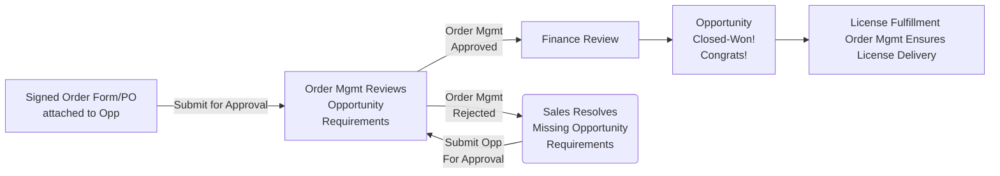

## Order Management ハンドブックへようこそ

Order Management のページでは、各リージョンチームの目標、タスク、標準的な運用ガイドラインを説明します。KPI、SLA、当チームと連携する際のベストプラクティスについての詳細をここで確認できます。

商談承認のブッキング要件の詳細な概要については、[Sales Order Processing ページ](/handbook/sales/field-operations/order-processing/) を参照してください。

### 私たちの業務

GitLab の **Order Management** チームは、**Deal Desk**、**Billing**、**Fulfillment** といった複数の主要な社内チームによって支えられています。

- **Deal Desk** は *商談承認* と *ブッキングプロセス* を担当します。
- **Fulfillment** は *初回ライセンス配信* プロセスを管理します。
- **Billing** と **Deal Desk** は *Order* および *Subscription の reconciliation* で協働します。

このクロスファンクショナルなチームが、商談ブッキング要件、ブッキングポリシー、注文を履行するためのプロセスに関するあらゆる問い合わせの一次窓口となります。

**日次タスク:**

- リージョン内商談のブッキング承認（Stage 7 - Closing）
- 注文の課題を解決し、ディールが正しく正確にブッキングされるようにする
- 新規クローズ商談のライセンス配信状況をモニタリング
  - 自動化が失敗した場合は、Support Engineering と直接連携してライセンスを顧客に送付
  - システム的な失敗をカタログ化・詳細化し、長期的な解決のために Product と協働

**週次タスク:**

- 更新/サブスクリプション不整合のレビュー
  - 重複した更新商談の reconciliation
  - 不足している更新商談の作成
  - 更新商談の ARR Basis が正しいことを確認

**月次タスク:**

- 必要に応じたブッキング reconciliation

**アドホック/継続タスク:**

- Deal Desk と協働して Quote to Cash プロセスを改善・合理化
- Billing Operations と協働して Booking <> Billing プロセスを改善・合理化
- Product + Support Engineering と協働してライセンスフルフィルメントを改善・合理化
- クロスファンクショナルチームと協働して新しい Route to Market を実装

**主要なプロセスとドキュメント**

- [Bookings ポリシー](/handbook/sales/field-operations/order-processing/#bookings-policy)
- [商談承認/ブッキング要件](/handbook/sales/field-operations/order-processing/#submit-an-opportunity-for-booking)
- [初回ライセンスフルフィルメントと配信](/handbook/sales/field-operations/sales-operations/order-management/#license-delivery-review-process)
- [Subscription Management](/handbook/sales/field-operations/sales-operations/order-management/#subscriptionrenewal-management-process)
- [Sales Order Processing ハンドブック](/handbook/sales/field-operations/order-processing/)

**主要なレポート:**

- [DD + OM ケース / 平均初回応答](https://gitlab.my.salesforce.com/00O4M000004edoT)
- [Closed Won 商談（リージョン別）](https://gitlab.my.salesforce.com/00O4M000004edoJ)
- [Closed Won 商談（チームメンバー別）](https://gitlab.my.salesforce.com/00O4M000004edoO)
- [商談リジェクト](https://gitlab.my.salesforce.com/00O4M000004edos)

#### 対象外

Order Management は商談承認、ライセンスフルフィルメント、Subscription Management に注力しています。以下のタスクは当チームの役割と責任の対象外です。次の事項については Deal Desk に連絡してください。

- 非標準のクォート構築支援
- クォート構成のトラブルシューティング
- 複雑/非標準のディール構造
- ディール構造の承認ガイダンス
- 月末/四半期末の reconciliation
- 割引/支払条件の承認ガイダンス
- Stage-5 未満の商談

このチームのスコープに関する詳細は、[Job Family](/job-description-library/sales/order-management/) を参照してください。

### 私たちの所在

#### リージョンサポート

Order Management チームは世界中に拠点があり、ほとんどのリージョンで標準的なビジネスアワー内に対応可能です。私たちはリージョナルサポートモデルで運営しており、各リージョン（EMEA/APAC/AMER）は、専任のリージョナル Order Management Specialists によるサポートを受けます。

休日やチームメンバーが PTO 中の場合、別のリージョンのメンバーが対応をカバーすることがあります。これは月末/四半期末や、チームが人手不足になっているときに限定されます。

サポートは、各リージョンの以下のビジネスアワーに基づいて提供されます。ただし、複雑/非標準の商談が現地時間 16:30 以降に提出された場合は、翌営業日に回ることがあります。

|     リージョン    | 標準サポート時間 |
|:-------------:|------------------------|
| APAC          | 9:00 〜 18:00（PST - Philippine Standard Time）   |
| EMEA          | 8:00 〜 17:00（GMT）   |
| AMER / LATAM  | 7:00 〜 17:00（PT）    |

リージョナルチームは 24/7 のサポートモデルでは運営していません。リクエストが現地時間 16:30 以降、または標準サポート時間外に提出された場合、翌営業日まで対応されないことがあります。例外は月末/四半期末のみです。サポート時間と稼働状況は、ハイボリューム期間に先立って #field-fyi で共有されます。

#### リージョン構成

前述のとおり、GitLab の **Order Management** チームは **Deal Desk**、**Billing**、**Fulfillment** といった複数の主要社内チームによって支えられています。各チームのリージョン構成については、それぞれのハンドブックページを参照してください。

### Order Management チームとのコミュニケーション

- 商談またはクォートに対するサポートが承認提出 *前* に必要な場合は、必ず Opportunity オブジェクト上の「Request Support」ワークフローを使用して、必要なチーム（例: Deal Desk、Billing Ops など）向けのケースを作成してください。一般的な質問については、`#sales-support` Slack チャンネルをご利用ください。
- 商談またはクォートを承認に提出する際には、ケースの作成は *不要* です。提出されると、承認チームに通知が届き、承認キューが管理されて承認処理が進みます。
- クォートまたは商談が承認に提出され、Order Management チームが追加情報やアクションを必要とする場合、サポートチームは商談上で担当者を Chatter でメンションし、必要なメモを Approval Comment に残します。

商談またはクォートに対するサポートが承認提出 *前* に必要な場合は、SFDC の Opportunity オブジェクト上の右上にある「Request Support」ボタンをクリックすることでリクエストできます。詳しい手順については、ハンドブックの [Requesting Internal Support](https:/handbook.gitlab.com/handbook/sales/field-operations/requesting-internal-support) セクションを参照してください。

Deal Desk または Billing 向けに SFDC ケースを作成してサポートを依頼する方法のイネーブルメントについては、HighSpot の [New Internal Support Request + Quote Approval Processes - 2024-11-21](https://gitlab.highspot.com/items/673f8c8deaa0ddae6c0b99f8) を参照してください。

## コミュニケーションのベストプラクティス

- 担当者を SFDC ケース上で直接 @mention するのは、その人がケースのオーナーである場合のみにしてください。これにより、私たちのチームは効率的に作業でき、最初に返信した DD メンバーが不在になった場合にもケースがカバーされます。
- アカウントや商談で担当者に直接 Chatter しても、Order Management チームのキューにケースが作成されないため、優先されません。応答が大幅に遅れたり、全く返ってこないこともあります。ケースが必要な場合は、必ず Opportunity オブジェクト上の「Request Support」ワークフローを使用してケースを作成してください。
- 誰かがケースに対応している場合、その人はケースがクローズされるまで対応を継続します。ケースが解決済みだがサポートチームによるさらなる対応が必要な場合は、Opportunity オブジェクト上の「Request Support」ワークフローを使って新しいケースを作成してください。所有チームは、解決済みケースを再オープンするか、新しく作成したケースを使うかを判断します。
- 既存の Chatter 投稿に @ メンションタグを編集で追加した場合、その操作では通知が生成されないことがあります。コメントで誰かを @ メンションし忘れた場合は、コメントを編集するのではなく、スレッドで @ メンションしてください。既存のオープンケースに関係しないリクエストの場合は、必ず Opportunity オブジェクト上の「Request Support」ワークフローを使用して新しいケースを作成してください。
- Order Management のチームメンバーは、それぞれのケースキューを日中監視しています。

### Key Performance Indicators

#### 1. 標準商談承認 SLA

商談は、Submitted for Approval（Stage 7 - Closing）になってから 12 ビジネス時間以内に、すべてのブッキング要件についてレビューされます。商談は提出から 12 ビジネス時間以内に Order Management によって承認または却下されます。注意: ディールの最終クローズは Billing チームが担当します。

ブッキング要件に不足がある場合、または Sales チームからのさらなる確認が必要な場合、Order Management Specialist は Chatter で担当者を直接タグし、未解決の問題を解消します。

商談ブッキング要件については、Sales Order Processing ページを参照してください。

#### 2. リージョンサポート満足度

すべてのリージョンは、毎四半期の冒頭に四半期 CSAT サーベイを受け取ります。当チームは、サポート対象リージョンに対して 92% の満足度を目指しています。このサーベイは、Quote to Cash ライフサイクルに関連する改善領域についてのフィードバックを提供する貴重なツールです。

サーベイの結果は、チームメンバーのパフォーマンス評価と改善領域の特定に使用されます。

**リージョンサポート満足度の測定:**

- ポジティブな満足度評価は、「Q1 において Deal Desk から受けたサポートのレベルをどう評価しますか?」という質問へのポジティブな回答の比率で測定されます。
- 選択肢は以下のとおりです:
  - Excellent
  - Good
  - Neutral
  - Poor
  - Very Poor
- 満足度評価は、Excellent、Good、Neutral の回答数を、全回答数に対する割合として算出します。パーセンテージで表した結果が、リージョンサポート満足度評価です。

#### 3. 商談承認の正確性と効率性

当チームは、95% 以上の承認正確性を目指しています。つまり、Billing に最終レビュー/承認のために提出する全商談のうち、ブッキング要件不足で却下される割合は 5% 以下です。

Order Management Specialist は、四半期 CSAT サーベイで受け取ったフィードバックに対するアクション、および一般的な商談リジェクトに関連するプロセスの改善（ドキュメント化、トレーニング、システム改善などを通じて）に責任を負います。目標は、承認までの時間を短縮し、効率を改善し、すべての承認において高い正確性を維持することです。

### Key Performance Indicators: 結果

四半期 KPI 結果については、[Deal Desk & Order Management KPI - 結果](/handbook/sales/field-operations/sales-operations/deal-desk-order-mgmt-kpis/) を参照してください。

### 商談承認プロセス

Order Management は、ブッキング前にすべての Sales Assisted 商談をレビューします。すべての商談は標準的な商談ブッキング要件を満たす必要があります。ブッキングに必要な要素が不足している商談は却下されます。

#### 商談の優先順位付け

承認キュー内のすべての商談は、以下に基づいて優先順位付けされます。

1. Start Date
2. Revenue Generation
3. 提出順

Order Management チームは、月末・四半期末に提出されたすべての商談が同月中にレビューおよび承認されるよう最大限努めます。月末や四半期末に緊急レビューのためのタグ付けは控えてください。

#### 商談レビューのエスカレーションパス

緊急、顧客に影響、またはビジネスに重大な承認案件は、リクエストに応じて優先される場合があります。商談が標準サポート時間外に提出された場合は、#sales-support Slack チャンネルで別のリージョンチームによるレビューのためにエスカレーションできます。リージョンの Deal Desk Manager をタグして、レビューやケースのデリゲートを支援してもらうこともできます。

緊急レビューのために挙げられる商談は、ビジネスクリティカルなものでなければなりません。正当な緊急性ではなく個人的な都合からルーチン的にエスカレーションされる商談は、Sales Management と対応します。

#### 商談承認ワークフロー

### ライセンス配信レビュープロセス

FY23 以降、Order Management チームは新たに Closed Won となったすべての Self-Managed ディールでライセンス配信を確認しています。

#### 背景

ライセンス配信レビュープロセスは、すべての Self-Managed ディールでライセンスフルフィルメントが行われることを確実にするために作成された新しいプロセスです。このプロセスの目標は (1) ライセンスがタイムリーに配信されるようにして顧客満足度を改善すること、(2) ライセンス配信を追跡する Sales の時間を削減し Sales の効率を改善すること、(3) 顧客へのライセンス配信遅延による Revenue Recognition の問題を防ぐことです。

**対象範囲:**

- Order Management チームは、Closed Won となった Sales-Assisted の各 Self-Managed ディールをレビューし、商談クローズ後の初回ライセンス配信を確認します。
- Order Management チームが、商談クローズ後にライセンスが配信されなかったと判断した場合、Support Engineering にチケットを開き、顧客へのライセンス手動配信を依頼します。

**対象外:**

- Order Management チームは顧客対応の役割ではなく、注文やライセンス問題に関して顧客と直接対話することはありません。
- このレビューの目標は初回配信が正しいことを確認することです。Order Management チームは以下に関するリクエストは扱いません:
  - SaaS エンタイトルメント
  - 顧客のインスタンスに適用したときに失敗する Self-Managed ライセンス
  - 配信されたが GitLab インスタンスで受け付けられない Self-Managed ライセンス
  - Self-Managed ライセンスの分割リクエスト
  - Self-Managed ライセンスの再送リクエスト
  - Self-Managed の追加ライセンス送信リクエスト

対象外のライセンスリクエストについては、Support Engineering チームに [Issue を開いて](/handbook/support/internal-support/#regarding-licensing-and-subscriptions) ください。

#### プロセスのワークフロー

1. Order Management チームメンバーが商談を承認
2. Billing チームメンバーが商談を承認し、Closed Won ステージとなる
3. Order Management チームメンバーは毎日、リージョン別の Self-Managed 商談レポートをレビュー。新たにクローズした各 Self-Managed 商談について、Order Management はライセンス受信箱を確認し、自動配信されたかを判断
4. ライセンスが配信されていれば、Order Management は配信日を「License Delivery Date」商談フィールドに入力
5. ライセンスが配信されていなければ、Order Management は Support Engineering にチケットを開き、商談のプライマリクォートにある Sold To 連絡先へのライセンス手動配信を依頼

（プロセス全体のドキュメントについては、社内の [License Delivery Review Wiki](https://gitlab.com/gitlab-com/sales-team/field-operations/deal-desk/-/wikis/Ongoing-Reconciliations/License-Delivery-Review) を参照してください）

### Subscription/Renewal Management プロセス

FY23 以降、Order Management チームは不正な更新データを能動的にレビューし、修正しています。

#### 背景

予測目的、ATR（Available to Renew、別名 ARR Basis）分析、一般的なデータクレンジングなど、更新データをクリーンかつ正しく保つことは重要です。

私たちの目標は、Renewal Opportunity と Customer Subscription を 1:1 で保つことです:

- すべての Customer Subscription は、1 つの open または closed の Renewal Opportunity にリンクしているべき
  - 当てはまらないケース: レガシー/不正なデータ、自動化失敗、手動の更新商談作成など
- すべての Renewal Opportunity は Customer Subscription オブジェクトにリンクしているべき
  - 当てはまらないケース: レガシー/不正なデータ、この自動化が作成される前に作られた商談、手動の更新商談作成など
- すべての Renewal opportunity の ARR Basis は、リンクされた Customer Subscription の Current Subscription CARR と一致しているべき（既知の例外、例: Contract Reset を除く）
- すべての Renewal opportunity の Start Date は、リンクされた Customer Subscription の Current Term End Date と一致しているべき（既知の例外、例: Contract Reset を除く）
重複した更新商談はそのようにマークし、Customer Subscription から切り離す必要があります。

#### プロセス概要

継続的に、Order Management チームは不一致レポートをレビューし、上記のとおり不正データを修正します。（プロセス全体のドキュメントについては、社内の [Subscription Management Wiki](https://gitlab.com/gitlab-com/sales-team/field-operations/deal-desk/-/wikis/Ongoing-Reconciliations/Subscription-Management) を参照してください）
