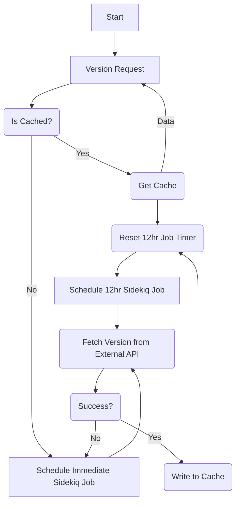

[Version check に関するブログ記事](https://about.gitlab.com/blog/2015/05/07/version-check/)

## GitLab Version Check の機能とは何ですか？

GitLab Version Check は、インスタンス管理者に現在のインスタンスバージョンのステータスを伝えることに焦点を当てた UI 要素のスイートです。ステータスは、遅れているバージョンの重要度に応じて、さまざまな要素を通じて伝達されます。

## GitLab Version Check UI スイート

### GitLab Version バッジ

**説明**

このバッジ要素は常に表示され、利用可能なアップグレードに対する GitLab インスタンスのバージョンを伝達します。

- Up to date: GitLab インスタンスは現在の GitLab バージョンと完全に最新です。
- Update available: GitLab インスタンスはセキュリティ関連でない GitLab バージョンに対して古くなっています。
- Update ASAP: GitLab インスタンスはセキュリティ関連の GitLab バージョンに対して古くなっています。

**UI 表現**

| Up to date | Update available | Update ASAP |
| ------ | ------ | ------ |
|  |  |  |

**UI 表示場所**

- 管理ダッシュボード（コンポーネントセクション）
- ヘルプページ
- ヘルプドロップダウン（トップナビゲーションの ? アイコン）

**表示タイミング**

- **常に**

### GitLab クリティカルセキュリティアップグレードモーダル

**説明**

このモーダル要素は、GitLab インスタンスがインスタンスを脆弱にする可能性のあるセキュリティアップグレードに遅れている場合にのみ表示されます。このモーダルは表示され、消える前にインタラクションを強制します。アップグレードノートの詳細度に応じて、モーダルはさまざまなレベルの詳細で表示されます。さらに、表示されると、管理者は選択を迫られます。どの選択をしても、モーダルは非表示となり、3 日後に再表示されるよう設定されます。

- Upgrade now: 管理者はアップグレードドキュメントに移動します
- Remind me in 3 days: モーダルは非表示になります

**UI 表現**

| 安定版または詳細なし | 安定版あり、詳細なし | 安定版と詳細の両方 |
| ------ | ------ | ------ |
|  |  |  |

**UI 表示場所**

- どこでも

**表示タイミング**

- `danger` レベルのアップグレードに遅れている場合、**常に表示され、3 日間は閉じることが可能**

## GitLab Version Check はどのように機能しますか？

過去には、Network タブで確認できる API コールを通じて UI に Version Check を提供していました。**これは変更され**、現在は [Rails を通じて](https://gitlab.com/gitlab-org/gitlab/-/merge_requests/103248) UI に提供されています。

現在のアーキテクチャは、私たちが使用している [`ReactiveCaching`](https://docs.gitlab.com/ee/development/reactive_caching.html) メカニズムの性質によって少し複雑になっています。このキャッシュは [Sidekiq](https://github.com/sidekiq/sidekiq) によって駆動され、バックグラウンドジョブ（`/admin/background_jobs`）を通じて実行され、インスタンスのバージョンステータスを保持・再水和することを目的としています。このデータが外部エンドポイントから取得され、GitLab アプリケーション全体で必要とされる性質のため、私たちは積極的なキャッシュメカニズムを持っています。

より伝統的な [キャッシュアプローチ](https://gitlab.com/gitlab-org/gitlab/-/issues/385017) で [Cron](https://en.wikipedia.org/wiki/Cron) への移行を検討する探索を開始しています。

以下は Version Check がバックグラウンドでどのように管理されているかの視覚的表現です:

## ブラウザリクエストにはどのような情報が含まれていますか？

リクエストには、ブラウザ、GitLab バージョン、HTTP リファラーに関する情報が含まれます。HTTP リファラーは、リクエストが送信された URL です。つまり、管理者の GitLab インスタンスのヘルプページや管理エリアページの URL です。例えば、gitlab.com のヘルプページにアクセスすると、HTTP リファラーは https://gitlab.com/help になります。さらに、ブラウザはレスポンスを受け取るために、リクエストと組み合わせてインスタンスの IP アドレスを送信する必要があります。これらの情報はいずれも保存されません。

## version.gitlab.com とは何ですか？

Version.gitlab.com は、上記のリクエストに対して最新のバージョン情報で応答します。提供されたデータは保存されません。

## HTTP リファラーから何の情報が導き出せますか？

HTTP リファラーには、GitLab インスタンスのローカルまたはパブリックホスト名や IP アドレスが含まれる可能性があります。これは、管理者が GitLab Web インターフェースにどのようにアクセスしたかによって異なります。ローカルホスト名とローカル IP アドレスは、インスタンスが実行されているローカルネットワーク内でのみ関連性を持ち、到達可能です。したがって、ローカルホスト名は 'myownGitLab' のように何でも名前を付けることができます。パブリックホスト名や IP アドレスには、ホストネットワークの所有者に関する情報が含まれる可能性があります。例えば、HTTP リファラーに 'dev.gitlab.org' が含まれている場合、このインスタンスは GitLab が所有していると想定できます。

## トラブルシューティング

### 内部 API を使用してキャッシュをチェックする {#use-the-internal-api-to-check-the-cache}

`/admin/version_check.json` エンドポイントにアクセスすることで、キャッシュデータがあるかどうか、また Rails を通じて UI に何が提供されているかを確認できます。

レスポンスが `null` の場合、いくつかのステップを取ることができます:

- ネットワークが `version.gitlab.com` への外部 API リクエストを許可／ホワイトリスト登録していることを確認します。
- Sidekiq でバックグラウンドジョブがスケジュールされていて、何かの後ろで [スタックしていない](#ensure-sidekiq-jobs-are-in-healthy-state) ことを確認します。

### Sidekiq ジョブが健全な状態にあることを確認する {#ensure-sidekiq-jobs-are-in-healthy-state}

`/admin/background_jobs` にアクセスすることで、インスタンスでスケジュール／実行／保留中のジョブを調べることができます。
探すべきジョブは `external_service_reactive_caching` と呼ばれています。

[内部 API](#use-the-internal-api-to-check-the-cache) が `null` を返している場合、またはアップグレードバッジが欠けている場合:

- ASAP でジョブがスケジュールされていることを確認し、実行をブロックしないように対処する方法を判断します。
- ジョブが遠い将来にスケジュールされている場合、Sidekiq で何かが誤ってキューイングされた可能性があるため、強制的に実行させます。

## GitLab Version Check を無効化するにはどうすればよいですか

GitLab Version Check は GitLab 管理者設定の Metrics and Profiling タブから無効化できます。

"/admin/application_settings/metrics_and_profiling" の Usage Statistics セクションに「Enable version check」というラベルのチェックボックスがあります。
