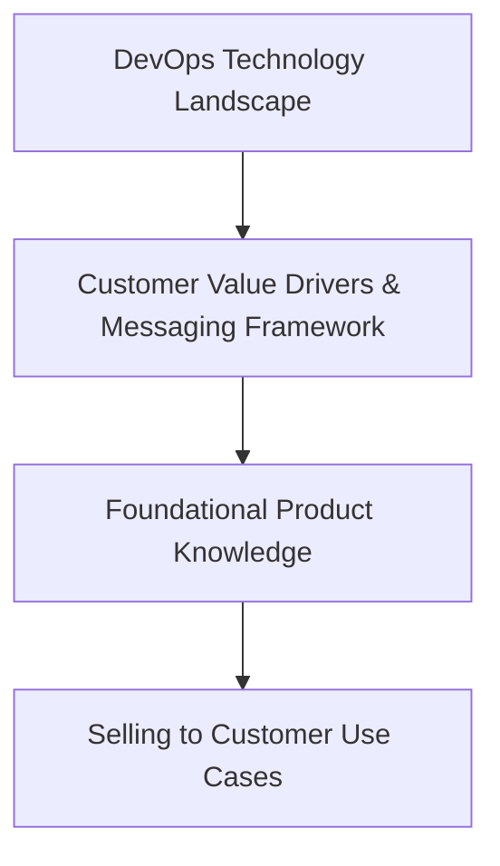

## 概要

[Field Certification Program](/handbook/sales/training/field-certification/)の一環として、本プログラムの目的は、フィールドチームメンバーが顧客、見込み顧客、パートナーに対する信頼されるアドバイザーとして、顧客や見込み顧客から表明されたニーズや課題に基づき適切な GitLab ソリューションを正しくポジショニングするために必要な知識を確実に身に付けることです。

注意：この GitLab 製品トレーニングおよび認定プログラムは、以下のような *GitLab の使い方* に焦点を当てたリソースとは異なります（ただし、フィールドチームメンバーがこれらも受講することは推奨します！）。

- [GitLab Certifications](https://university.gitlab.com/certifications/public/)
- [GitLab Technical Certifications](/handbook/customer-success/professional-services-engineering/gitlab-technical-certifications/)

## アーキテクチャとアプローチ

1. フィールドチームメンバーはまず、[Sales & Customer Success Onboarding](/handbook/sales/onboarding/) 中に [DevOps テクノロジーランドスケープ](https://gitlabfieldenablement.s3.us-east-2.amazonaws.com/DevOps+Technology+Landscape+-+Storyline+output/story.html)についてトレーニングを受けます
1. 次に、新規フィールドチームメンバーは[顧客のバリュードライバー](/handbook/sales/command-of-the-message/#customer-value-drivers)と [GitLab の価値ベースのメッセージングフレームワーク](/handbook/sales/command-of-the-message/)についてトレーニングを受けます（これもオンボーディング中）
1. オンボーディング後、フィールドチームメンバーは軽量なロールベースの製品トレーニング学習パス（下記参照）の完了を促されます
1. 次に、フィールドチームメンバーは GitLab の販売方法に焦点を当てた[顧客ユースケースコース](/handbook/sales/training/field-certification/#gitlab-use-cases-overview)の完了を促されます

### フィールドが知る必要があること

製品トレーニングと認定の学習目標は、各顧客ユースケースについて、優先順位付けされた[市場要件](/handbook/marketing/brand-and-product-marketing/product-and-solution-marketing/usecase-gtm/#market-requirements)に対して、主要な GitLab の機能とケイパビリティが何をどのように提供するかに基づいて、[顧客ユースケース](/handbook/marketing/brand-and-product-marketing/product-and-solution-marketing/usecase-gtm/)ごとに定義されています。

学習目標は、フィールドが GitLab の[製品ティア](/handbook/marketing/brand-and-product-marketing/product-and-solution-marketing/tiers/)について知る必要のある事項についても定義されています。優先順位付けされた製品の学習目標は 2 セット維持されており、1 つは Sales のロール、もう 1 つは Customer Success のロール向けです。

### トレーニング

上記の学習目標を支援するために、軽量なロールベースの製品トレーニング学習パス（Sales のロール用と Customer Success のロール用）が開発中で、FY22 初頭またはそれ以前の開始を目指しています。それまでは、チームメンバーとパートナーは既存のハンドブックリソースを活用し消費することと、既存の非公式な継続教育プログラムへの参加が推奨されます。新規フィールドチームメンバーは、上記のとおり [Sales Quick Start フィールドオンボーディング](/handbook/sales/onboarding/sales-learning-path/#sales--customer-success-quick-start-learning-path---core-curriculum)トレーニングプログラムを正常に完了した後の、ロールに就いて最初の数か月間にこのトレーニングを完了することが推奨されます。

### 認定

新規チームメンバーは、上記の学習パスを完了し、適切なロールベースの製品知識評価で 80% 以上のスコアを取得することで、GitLab 製品認定を取得します。

GitLab は[毎月](/handbook/engineering/releases/)新しいリリースをローンチするため、ロールベースの製品知識学習目標、評価、学習パスは、Use Case Activation、Product Marketing、Field Enablement の各チームによって定期的なケイデンス（6 か月ごと）で更新されます。同様に、フィールドチームメンバーは 6 か月ごと（Q1 初頭に再度 Q3 初頭に）に再認定を受ける必要があります。再認定を受けるには、フィールドチームメンバーは適切なロールベースの製品知識評価で 80% 以上のスコアを取得しなければなりません。チームメンバーが 80% 未満のスコアだった場合、適切なロールベースの製品トレーニング学習パスを完了しなければならず、その後 80% 以上のスコアを取得するまで知識評価を再受験するチャンスがあります。GitLab パートナー認定は同じトレーニングおよび評価コンテンツを活用します（詳細は未定）。

現在の製品知識評価：

- [Q3FY21 GitLab 製品知識評価（Sales のロール向け）](https://forms.gle/pWvmdo8Sqo9bTaui7)
- [Q3FY21 GitLab 製品知識評価（SA および CSM 向け）](https://forms.gle/NjsCYAfgFkrCBQvd9)
