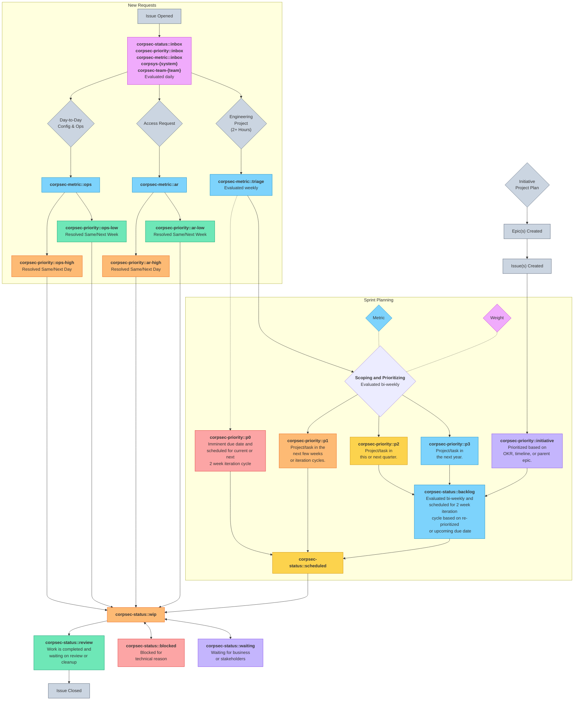

私たちには 4 つの働き方のアプローチがあります：

1. **[サポートヘルプデスクサービス](/handbook/security/corporate/support)** - チームメンバーと一時的なサービスプロバイダー（コントラクター）に対して 24x5 のテクニカルサポートとアクセスリクエストを提供しています。アクセスリクエストの優先順位付けには、`corpsec-priority::ar-high`（同日／翌日）または `corpsec-priority::ar-low`（同週／翌週）ラベルでご協力ください。

2. **構成オペレーション** - CorpSec が責任を持つ [SaaS システム](/handbook/security/corporate/systems) の設定に関する日常的な小さな構成および変更リクエスト（1 時間未満）に対応します。これにはヘルプデスクアナリストからのエスカレーションも含まれます。リクエストは [Issue トラッカー](#issue-tracker) に Issue を作成し、`corpsec-priority::ops-high`（同日／翌日）または `corpsec-priority::ops-low`（同週／翌週）ラベルを追加してください。事前のガイダンスは [#it_help](https://gitlab.slack.com/archives/CK4EQH50E) で求めることができ、オンコールチームメンバーが応答したり、適切なエンジニアにタグを付けたりします。

3. **[エンジニアリングイテレーション](#iteration-cadences)** - 大きなリクエスト（1 時間以上）に対しては、チームのキャパシティと優先順位の競合に基づいてキューに入れられた、2 週間のアジャイルイテレーションスプリントサイクルがあります。これには他のチームのプロジェクトに関連する事前計画された実装作業も含まれます。Issue が作成されると、期日要件に基づいて優先順位を割り当て、バックログに追加するか、今後のイテレーション中にスケジュールします。Issue がイテレーションに追加されると、Issue 内で別途連絡されない限り、または担当エンジニアとの議論で別途連絡されない限り、2 週間サイクルの最終日までに完了することが期待できます。

    > **可能な限り早く（理想的には 3〜6 週間前、ドラフトでも構いません）** Issue を作成してください。これによってキューに入り、土壇場のリクエストでチームメンバーが危機モードでバタバタすることを避けられます。あなたのチームが数か月前から知っていたのに、土壇場で 1〜2 日で何かを処理するように求めるような状況は避けようとしています。期日は数週間前に伝えられたはずです。

4. **エンジニアリングイニシアチブ** - 私たちの長期的な[方向性](https://internal.gitlab.com/handbook/security/corporate/direction/)の一部である、[ロードマップ](https://internal.gitlab.com/handbook/security/corporate/roadmap/)上のプログラム管理された大規模な戦略的イニシアチブです。新しいプロセス、サービス、システムへのリサーチ、ディスカバリー、実装、移行に整合した目標および主要結果（OKR）があります。現在のイニシアチブと進捗を確認するには、[エピック](#epics)を参照してください。

## エピック {#epics}

大規模イニシアチブと OKR のすべてのエピックは、[CorpSec グループ](https://gitlab.com/groups/gitlab-com/gl-security/corp/-/epics?state=opened&page=1&sort=start_date_desc) で作成されます。

[ガントチャートロードマップ](https://gitlab.com/groups/gitlab-com/gl-security/corp/-/roadmap?state=opened&sort=START_DATE_ASC&layout=QUARTERS&timeframe_range_type=THREE_YEARS&progress=WEIGHT&show_progress=true&show_milestones=false&milestones_type=ALL&show_labels=true) もご覧ください。

## Issue トラッカー {#issue-tracker}

すべての Issue は、私たちが多くの時間をかけて実行する作業、または容易に発見可能な監査証跡が必要な構成およびプロビジョニング作業のために、[CorpSec Issue トラッカー](https://gitlab.com/gitlab-com/gl-security/corp/issue-tracker/-/issues) で作成されます。コンサルティングの質問やサポートのために、他のチームの Issue トラッカーでタグ付けされることもあります。

## ワークフロー {#workflow}

### イテレーションのケイデンス {#iteration-cadences}

私たちは（システム／チームに応じて）週次または隔週でスプリント計画を実施し、`corpsec-status::inbox` と `corpsec-status::backlog` ラベルが付いた Issue を評価します。

完全な Issue のフローを確認するには、[ワークフロー](#workflow) を参照してください。

- [ケイデンススケジュール](https://gitlab.com/groups/gitlab-com/gl-security/corp/-/cadences)

### 期日

期日は依頼者によって設定された日付です。

イテレーションサイクルは CorpSec チームが内部的に使用するものです。

期日に関する期待値は、Issue の説明やコメントで言及することで、期日前に終わるイテレーションサイクルで作業が完了するようにします。

## Issue ボードとリスト

### ヘルプデスクアナリスト

- (List) [アクセスリクエスト](https://gitlab.com/gitlab-com/team-member-epics/access-requests/-/issues)
  - (List) [プロビジョニングするベースラインエンタイトルメント](https://gitlab.com/gitlab-com/team-member-epics/access-requests/-/issues/?sort=created_date&state=opened&label_name%5B%5D=BaselineEntitlementAR&label_name%5B%5D=IT%20System%3A%3ABaseline%20Entitlement&first_page_size=100)
  - (List) [チームメンバーアクセスリクエスト](https://gitlab.com/gitlab-com/team-member-epics/access-requests/-/issues/?sort=created_date&state=opened&label_name%5B%5D=AR-Approval%3A%3AManager%20Approved&label_name%5B%5D=IT%3A%3Ato%20do&first_page_size=100)
  - (List) [一時的なサービスプロバイダーのアクセスリクエスト](https://gitlab.com/gitlab-com/temporary-service-providers/lifecycle/-/issues/)

### エンジニアリング

- (Report) [マネジメントステータスレポート（毎日更新）](https://gitlab.com/gitlab-com/gl-security/corp/issue-tracker/-/blob/main/status_report.md?ref_type=heads)
- かんばんボード
  - (Board) All Teams - [現在のイテレーション](https://gitlab.com/groups/gitlab-com/gl-security/corp/-/boards/7606111?iteration_id=Current&iteration_cadence_id=1053644) - [イテレーションスプリント Issue（ステータス別）](https://gitlab.com/groups/gitlab-com/gl-security/corp/-/boards/7606111)
  - (Board) Code - [現在のイテレーション](https://gitlab.com/groups/gitlab-com/gl-security/corp/-/boards/7606111?label_name[]=corpsec-team-code&iteration_id=Current&iteration_cadence_id=1053644) - [全オープン Issue](https://gitlab.com/groups/gitlab-com/gl-security/corp/-/boards/7606111?label_name[]=corpsec-team-code)
  - (Board) Device Trust - [現在のイテレーション](https://gitlab.com/groups/gitlab-com/gl-security/corp/-/boards/7606111?label_name[]=corpsec-team-device&iteration_id=Current&iteration_cadence_id=1053644) - [全オープン Issue](https://gitlab.com/groups/gitlab-com/gl-security/corp/-/boards/7606111?label_name[]=corpsec-team-device)
  - (Board) Helpdesk - [全オープン Issue](https://gitlab.com/groups/gitlab-com/gl-security/corp/-/boards/7606111?label_name[]=corpsec-team-helpdesk)
  - (Board) Identity - [現在のイテレーション](https://gitlab.com/groups/gitlab-com/gl-security/corp/-/boards/7606111?label_name[]=corpsec-team-identity&iteration_id=Current&iteration_cadence_id=1053644) - [全オープン Issue](https://gitlab.com/groups/gitlab-com/gl-security/corp/-/boards/7606111?label_name[]=corpsec-team-identity)
  - (Board) Infrastructure - [現在のイテレーション](https://gitlab.com/groups/gitlab-com/gl-security/corp/-/boards/7606111?label_name[]=corpsec-team-infra&iteration_id=Current&iteration_cadence_id=1053644) - [全オープン Issue](https://gitlab.com/groups/gitlab-com/gl-security/corp/-/boards/7606111?label_name[]=corpsec-team-infra)
  - (Board) SaaS - [現在のイテレーション](https://gitlab.com/groups/gitlab-com/gl-security/corp/-/boards/7606111?label_name[]=corpsec-team-saas&iteration_id=Current&iteration_cadence_id=1053644) - [全オープン Issue](https://gitlab.com/groups/gitlab-com/gl-security/corp/-/boards/7606111?label_name[]=corpsec-team-saas)
- チーム別 Issue リスト
  - (List) [小規模な日常運用リクエスト](https://gitlab.com/gitlab-com/gl-security/corp/issue-tracker/-/issues/?sort=created_date&state=opened&or%5Blabel_name%5D%5B%5D=corpsec-metric%3A%3Aar&or%5Blabel_name%5D%5B%5D=corpsec-metric%3A%3Aops&first_page_size=20)
  - (List) [大規模なプロジェクト作業（Device Trust、Identity、SaaS エンジニアリング）](https://gitlab.com/gitlab-com/gl-security/corp/issue-tracker/-/issues/?sort=created_date&state=opened&or%5Blabel_name%5D%5B%5D=corpsec-team-saas&or%5Blabel_name%5D%5B%5D=corpsec-team-identity&or%5Blabel_name%5D%5B%5D=corpsec-team-device&first_page_size=20)
  - (List) [Code Platform Engineering の社内 Issue](https://gitlab.com/gitlab-com/gl-security/corp/issue-tracker/-/issues/?sort=created_date&state=opened&label_name%5B%5D=corpsec-team-code&first_page_size=20) / [オープンソース Issue](https://gitlab.com/groups/provisionesta/-/issues)
  - (List) [Device Trust Engineering の Issue](https://gitlab.com/gitlab-com/gl-security/corp/issue-tracker/-/issues/?sort=created_date&state=opened&label_name%5B%5D=corpsec-team-device&first_page_size=20)
  - (List) [Helpdesk Services の Issue](https://gitlab.com/gitlab-com/gl-security/corp/issue-tracker/-/issues/?sort=created_date&state=opened&label_name%5B%5D=corpsec-team-helpdesk&first_page_size=20)
  - (List) [Infrastructure Engineering の Issue](https://gitlab.com/gitlab-com/gl-security/corp/issue-tracker/-/issues/?sort=created_date&state=opened&label_name%5B%5D=corpsec-team-infra&first_page_size=20)
  - (List) [SaaS Engineering の Issue](https://gitlab.com/gitlab-com/gl-security/corp/issue-tracker/-/issues/?sort=created_date&state=opened&label_name%5B%5D=corpsec-team-saas&first_page_size=20)
- ステータス別 Issue リスト
  - (List) [Inbox リクエスト（毎日レビュー）](https://gitlab.com/gitlab-com/gl-security/corp/issue-tracker/-/issues/?sort=created_date&state=opened&label_name%5B%5D=corpsec-status%3A%3Ainbox&label_name%5B%5D=corpsec-metric%3A%3Ainbox&first_page_size=20)
  - (List) [トリアージ進行中（隔週でレビュー）](https://gitlab.com/gitlab-com/gl-security/corp/issue-tracker/-/issues/?sort=created_date&state=opened&label_name%5B%5D=corpsec-metric%3A%3Atriage&first_page_size=20)
  - (List) [バックログ](https://gitlab.com/gitlab-com/gl-security/corp/issue-tracker/-/issues/?sort=created_date&state=opened&label_name%5B%5D=corpsec-status%3A%3Abacklog&first_page_size=20)
  - (List) [スケジュール済み](https://gitlab.com/gitlab-com/gl-security/corp/issue-tracker/-/issues/?sort=created_date&state=opened&label_name%5B%5D=corpsec-status%3A%3Ascheduled&first_page_size=20)
  - (List) [作業中（WIP）](https://gitlab.com/gitlab-com/gl-security/corp/issue-tracker/-/issues/?sort=created_date&state=opened&label_name%5B%5D=corpsec-status%3A%3Awip&first_page_size=20)
  - (List) [ビジネス待ち](https://gitlab.com/gitlab-com/gl-security/corp/issue-tracker/-/issues/?sort=created_date&state=opened&label_name%5B%5D=corpsec-status%3A%3Awaiting&first_page_size=20)
  - (List) [技術的ブロック中](https://gitlab.com/gitlab-com/gl-security/corp/issue-tracker/-/issues/?sort=created_date&state=opened&label_name%5B%5D=corpsec-status%3A%3Ablocked&first_page_size=20)
  - (List) [最終レビュー](https://gitlab.com/gitlab-com/gl-security/corp/issue-tracker/-/issues/?sort=created_date&state=opened&label_name%5B%5D=corpsec-status%3A%3Areview&first_page_size=20)
- (List) 特定のシステム向けの Issue へのリンクは、[CorpSec Systems](/handbook/security/corporate/systems) ハンドブックページを参照してください。

### エンジニアリングチームメンバー

<table>
<thead>
<tr>
<th>チームメンバー</th>
<th>CorpSec Issues</th>
<th>担当 AR</th>
<th>ハンドブック MR</th>
</tr>
</thead>
<tbody>
<tr>
<td><a href="https://gitlab.com/cshankgitlab">Clayton Shank</a></td>
<td><a target="_blank" href="https://gitlab.com/gitlab-com/gl-security/corp/issue-tracker/-/issues/?assignee_username%5B%5D=cshankgitlab">Issues</a> - <a target="_blank" href="https://gitlab.com/groups/gitlab-com/gl-security/corp/-/boards/7606111?assignee_username=cshankgitlab">Kanban</a> - <a target="_blank" href="https://gitlab.com/groups/gitlab-com/gl-security/corp/-/boards/7606111?assignee_username=cshankgitlab&iteration_id=Current&iteration_cadence_id=1053644">Current Iteration</a></td>
<td><a target="_blank" href="https://gitlab.com/gitlab-com/team-member-epics/access-requests/-/issues/?assignee_username%5B%5D=cshankgitlab">ARs</a></td>
<td><a target="_blank" href="https://gitlab.com/gitlab-com/content-sites/handbook/-/merge_requests?scope=all&state=all&author_username=cshankgitlab">Public</a> - <a target="_blank" href="https://gitlab.com/gitlab-com/content-sites/internal-handbook/-/merge_requests?scope=all&state=all&author_username=cshankgitlab">Internal</a></td>
</tr>
<tr>
<td><a href="https://gitlab.com/dzhu-gl">David Zhu</a></td>
<td><a target="_blank" href="https://gitlab.com/gitlab-com/gl-security/corp/issue-tracker/-/issues/?assignee_username%5B%5D=dzhu-gl">Issues</a> - <a target="_blank" href="https://gitlab.com/groups/gitlab-com/gl-security/corp/-/boards/7606111?assignee_username=dzhu-gl">Kanban</a> - <a target="_blank" href="https://gitlab.com/groups/gitlab-com/gl-security/corp/-/boards/7606111?assignee_username=dzhu-gl&iteration_id=Current&iteration_cadence_id=1053644">Current Iteration</a></td>
<td><a target="_blank" href="https://gitlab.com/gitlab-com/team-member-epics/access-requests/-/issues/?assignee_username%5B%5D=dzhu-gl">ARs</a></td>
<td><a target="_blank" href="https://gitlab.com/gitlab-com/content-sites/handbook/-/merge_requests?scope=all&state=all&author_username=dzhu-gl">Public</a> - <a target="_blank" href="https://gitlab.com/gitlab-com/content-sites/internal-handbook/-/merge_requests?scope=all&state=all&author_username=dzhu-gl">Internal</a></td>
</tr>
<tr>
<td><a href="https://gitlab.com/ericrubin">Eric Rubin</a></td>
<td><a target="_blank" href="https://gitlab.com/gitlab-com/gl-security/corp/issue-tracker/-/issues/?assignee_username%5B%5D=ericrubin">Issues</a> - <a target="_blank" href="https://gitlab.com/groups/gitlab-com/gl-security/corp/-/boards/7606111?assignee_username=ericrubin">Kanban</a> - <a target="_blank" href="https://gitlab.com/groups/gitlab-com/gl-security/corp/-/boards/7606111?assignee_username=ericrubin&iteration_id=Current&iteration_cadence_id=1053644">Current Iteration</a></td>
<td><a target="_blank" href="https://gitlab.com/gitlab-com/team-member-epics/access-requests/-/issues/?assignee_username%5B%5D=ericrubin">ARs</a></td>
<td><a target="_blank" href="https://gitlab.com/gitlab-com/content-sites/handbook/-/merge_requests?scope=all&state=all&author_username=ericrubin">Public</a> - <a target="_blank" href="https://gitlab.com/gitlab-com/content-sites/internal-handbook/-/merge_requests?scope=all&state=all&author_username=ericrubin">Internal</a></td>
</tr>
<tr>
<td><a href="https://gitlab.com/eriklentz">Erik Lentz</a></td>
<td><a target="_blank" href="https://gitlab.com/gitlab-com/gl-security/corp/issue-tracker/-/issues/?assignee_username%5B%5D=eriklentz">Issues</a> - <a target="_blank" href="https://gitlab.com/groups/gitlab-com/gl-security/corp/-/boards/7606111?assignee_username=eriklentz">Kanban</a> - <a target="_blank" href="https://gitlab.com/groups/gitlab-com/gl-security/corp/-/boards/7606111?assignee_username=eriklentz&iteration_id=Current&iteration_cadence_id=1053644">Current Iteration</a></td>
<td><a target="_blank" href="https://gitlab.com/gitlab-com/team-member-epics/access-requests/-/issues/?assignee_username%5B%5D=eriklentz">ARs</a></td>
<td><a target="_blank" href="https://gitlab.com/gitlab-com/content-sites/handbook/-/merge_requests?scope=all&state=all&author_username=eriklentz">Public</a> - <a target="_blank" href="https://gitlab.com/gitlab-com/content-sites/internal-handbook/-/merge_requests?scope=all&state=all&author_username=eriklentz">Internal</a></td>
</tr>
<tr>
<td><a href="https://gitlab.com/jacobdwaters">Jacob Waters</a></td>
<td><a target="_blank" href="https://gitlab.com/gitlab-com/gl-security/corp/issue-tracker/-/issues/?assignee_username%5B%5D=jacobdwaters">Issues</a> - <a target="_blank" href="https://gitlab.com/groups/gitlab-com/gl-security/corp/-/boards/7606111?assignee_username=jacobdwaters">Kanban</a> - <a target="_blank" href="https://gitlab.com/groups/gitlab-com/gl-security/corp/-/boards/7606111?assignee_username=jacobdwaters&iteration_id=Current&iteration_cadence_id=1053644">Current Iteration</a></td>
<td><a target="_blank" href="https://gitlab.com/gitlab-com/team-member-epics/access-requests/-/issues/?assignee_username%5B%5D=jacobdwaters">ARs</a></td>
<td><a target="_blank" href="https://gitlab.com/gitlab-com/content-sites/handbook/-/merge_requests?scope=all&state=all&author_username=jacobdwaters">Public</a> - <a target="_blank" href="https://gitlab.com/gitlab-com/content-sites/internal-handbook/-/merge_requests?scope=all&state=all&author_username=jacobdwaters">Internal</a></td>
</tr>
<tr>
<td><a href="https://gitlab.com/jeffersonmartin">Jeff Martin</a></td>
<td><a target="_blank" href="https://gitlab.com/gitlab-com/gl-security/corp/issue-tracker/-/issues/?assignee_username%5B%5D=jeffersonmartin">Issues</a> - <a target="_blank" href="https://gitlab.com/groups/gitlab-com/gl-security/corp/-/boards/7606111?assignee_username=jeffersonmartin">Kanban</a> - <a target="_blank" href="https://gitlab.com/groups/gitlab-com/gl-security/corp/-/boards/7606111?assignee_username=jeffersonmartin&iteration_id=Current&iteration_cadence_id=1053644">Current Iteration</a></td>
<td><a target="_blank" href="https://gitlab.com/gitlab-com/team-member-epics/access-requests/-/issues/?assignee_username%5B%5D=jeffersonmartin">ARs</a></td>
<td><a target="_blank" href="https://gitlab.com/gitlab-com/content-sites/handbook/-/merge_requests?scope=all&state=all&author_username=jeffersonmartin">Public</a> - <a target="_blank" href="https://gitlab.com/gitlab-com/content-sites/internal-handbook/-/merge_requests?scope=all&state=all&author_username=jeffersonmartin">Internal</a></td>
</tr>
<tr>
<td><a href="https://gitlab.com/jbisutti-gl">Justin Bisutti</a></td>
<td><a target="_blank" href="https://gitlab.com/gitlab-com/gl-security/corp/issue-tracker/-/issues/?assignee_username%5B%5D=jbisutti-gl">Issues</a> - <a target="_blank" href="https://gitlab.com/groups/gitlab-com/gl-security/corp/-/boards/7606111?assignee_username=jbisutti-gl">Kanban</a> - <a target="_blank" href="https://gitlab.com/groups/gitlab-com/gl-security/corp/-/boards/7606111?assignee_username=jbisutti-gl&iteration_id=Current&iteration_cadence_id=1053644">Current Iteration</a></td>
<td><a target="_blank" href="https://gitlab.com/gitlab-com/team-member-epics/access-requests/-/issues/?assignee_username%5B%5D=jbisutti-gl">ARs</a></td>
<td><a target="_blank" href="https://gitlab.com/gitlab-com/content-sites/handbook/-/merge_requests?scope=all&state=all&author_username=jbisutti-gl">Public</a> - <a target="_blank" href="https://gitlab.com/gitlab-com/content-sites/internal-handbook/-/merge_requests?scope=all&state=all&author_username=jbisutti-gl">Internal</a></td>
</tr>
<tr>
<td><a href="https://gitlab.com/kimwaters">Kim Waters</a></td>
<td><a target="_blank" href="https://gitlab.com/gitlab-com/gl-security/corp/issue-tracker/-/issues/?assignee_username%5B%5D=kimwaters">Issues</a> - <a target="_blank" href="https://gitlab.com/groups/gitlab-com/gl-security/corp/-/boards/7606111?assignee_username=kimwaters">Kanban</a> - <a target="_blank" href="https://gitlab.com/groups/gitlab-com/gl-security/corp/-/boards/7606111?assignee_username=kimwaters&iteration_id=Current&iteration_cadence_id=1053644">Current Iteration</a></td>
<td><a target="_blank" href="https://gitlab.com/gitlab-com/team-member-epics/access-requests/-/issues/?assignee_username%5B%5D=kimwaters">ARs</a></td>
<td><a target="_blank" href="https://gitlab.com/gitlab-com/content-sites/handbook/-/merge_requests?scope=all&state=all&author_username=kimwaters">Public</a> - <a target="_blank" href="https://gitlab.com/gitlab-com/content-sites/internal-handbook/-/merge_requests?scope=all&state=all&author_username=kimwaters">Internal</a></td>
</tr>
<tr>
<td><a href="https://gitlab.com/mloveless">Mark Loveless</a></td>
<td><a target="_blank" href="https://gitlab.com/gitlab-com/gl-security/corp/issue-tracker/-/issues/?assignee_username%5B%5D=mloveless">Issues</a> - <a target="_blank" href="https://gitlab.com/groups/gitlab-com/gl-security/corp/-/boards/7606111?assignee_username=mloveless">Kanban</a> - <a target="_blank" href="https://gitlab.com/groups/gitlab-com/gl-security/corp/-/boards/7606111?assignee_username=mloveless&iteration_id=Current&iteration_cadence_id=1053644">Current Iteration</a></td>
<td><a target="_blank" href="https://gitlab.com/gitlab-com/team-member-epics/access-requests/-/issues/?assignee_username%5B%5D=mloveless">ARs</a></td>
<td><a target="_blank" href="https://gitlab.com/gitlab-com/content-sites/handbook/-/merge_requests?scope=all&state=all&author_username=mloveless">Public</a> - <a target="_blank" href="https://gitlab.com/gitlab-com/content-sites/internal-handbook/-/merge_requests?scope=all&state=all&author_username=mloveless">Internal</a></td>
</tr>
<tr>
<td><a href="https://gitlab.com/malkobaisy">Mohammed Al Kobaisy</a></td>
<td><a target="_blank" href="https://gitlab.com/gitlab-com/gl-security/corp/issue-tracker/-/issues/?assignee_username%5B%5D=malkobaisy">Issues</a> - <a target="_blank" href="https://gitlab.com/groups/gitlab-com/gl-security/corp/-/boards/7606111?assignee_username=malkobaisy">Kanban</a> - <a target="_blank" href="https://gitlab.com/groups/gitlab-com/gl-security/corp/-/boards/7606111?assignee_username=malkobaisy&iteration_id=Current&iteration_cadence_id=1053644">Current Iteration</a></td>
<td><a target="_blank" href="https://gitlab.com/gitlab-com/team-member-epics/access-requests/-/issues/?assignee_username%5B%5D=malkobaisy">ARs</a></td>
<td><a target="_blank" href="https://gitlab.com/gitlab-com/content-sites/handbook/-/merge_requests?scope=all&state=all&author_username=malkobaisy">Public</a> - <a target="_blank" href="https://gitlab.com/gitlab-com/content-sites/internal-handbook/-/merge_requests?scope=all&state=all&author_username=malkobaisy">Internal</a></td>
</tr>
<tr>
<td><a href="https://gitlab.com/p_han">Peter Hansen</a></td>
<td><a target="_blank" href="https://gitlab.com/gitlab-com/gl-security/corp/issue-tracker/-/issues/?assignee_username%5B%5D=p_han">Issues</a> - <a target="_blank" href="https://gitlab.com/groups/gitlab-com/gl-security/corp/-/boards/7606111?assignee_username=p_han">Kanban</a> - <a target="_blank" href="https://gitlab.com/groups/gitlab-com/gl-security/corp/-/boards/7606111?assignee_username=p_han&iteration_id=Current&iteration_cadence_id=1053644">Current Iteration</a></td>
<td><a target="_blank" href="https://gitlab.com/gitlab-com/team-member-epics/access-requests/-/issues/?assignee_username%5B%5D=p_han">ARs</a></td>
<td><a target="_blank" href="https://gitlab.com/gitlab-com/content-sites/handbook/-/merge_requests?scope=all&state=all&author_username=p_han">Public</a> - <a target="_blank" href="https://gitlab.com/gitlab-com/content-sites/internal-handbook/-/merge_requests?scope=all&state=all&author_username=p_han">Internal</a></td>
</tr>
<tr>
<td><a href="https://gitlab.com/stevesagan">Steve Sagan</a></td>
<td><a target="_blank" href="https://gitlab.com/gitlab-com/gl-security/corp/issue-tracker/-/issues/?assignee_username%5B%5D=stevesagan">Issues</a> - <a target="_blank" href="https://gitlab.com/groups/gitlab-com/gl-security/corp/-/boards/7606111?assignee_username=stevesagan">Kanban</a> - <a target="_blank" href="https://gitlab.com/groups/gitlab-com/gl-security/corp/-/boards/7606111?assignee_username=stevesagan&iteration_id=Current&iteration_cadence_id=1053644">Current Iteration</a></td>
<td><a target="_blank" href="https://gitlab.com/gitlab-com/team-member-epics/access-requests/-/issues/?assignee_username%5B%5D=stevesagan">ARs</a></td>
<td><a target="_blank" href="https://gitlab.com/gitlab-com/content-sites/handbook/-/merge_requests?scope=all&state=all&author_username=stevesagan">Public</a> - <a target="_blank" href="https://gitlab.com/gitlab-com/content-sites/internal-handbook/-/merge_requests?scope=all&state=all&author_username=stevesagan">Internal</a></td>
</tr>
<tr>
<td><a href="https://gitlab.com/vlad">Vlad Stoianovici</a></td>
<td><a target="_blank" href="https://gitlab.com/gitlab-com/gl-security/corp/issue-tracker/-/issues/?assignee_username%5B%5D=vlad">Issues</a> - <a target="_blank" href="https://gitlab.com/groups/gitlab-com/gl-security/corp/-/boards/7606111?assignee_username=vlad">Kanban</a> - <a target="_blank" href="https://gitlab.com/groups/gitlab-com/gl-security/corp/-/boards/7606111?assignee_username=vlad&iteration_id=Current&iteration_cadence_id=1053644">Current Iteration</a></td>
<td><a target="_blank" href="https://gitlab.com/gitlab-com/team-member-epics/access-requests/-/issues/?assignee_username%5B%5D=vlad">ARs</a></td>
<td><a target="_blank" href="https://gitlab.com/gitlab-com/content-sites/handbook/-/merge_requests?scope=all&state=all&author_username=vlad">Public</a> - <a target="_blank" href="https://gitlab.com/gitlab-com/content-sites/internal-handbook/-/merge_requests?scope=all&state=all&author_username=vlad">Internal</a></td>
</tr>
<tr>
<td><a href="https://gitlab.com/zhardie1">Zack Hardie</a></td>
<td><a target="_blank" href="https://gitlab.com/gitlab-com/gl-security/corp/issue-tracker/-/issues/?assignee_username%5B%5D=zhardie1">Issues</a> - <a target="_blank" href="https://gitlab.com/groups/gitlab-com/gl-security/corp/-/boards/7606111?assignee_username=zhardie1">Kanban</a> - <a target="_blank" href="https://gitlab.com/groups/gitlab-com/gl-security/corp/-/boards/7606111?assignee_username=zhardie1&iteration_id=Current&iteration_cadence_id=1053644">Current Iteration</a></td>
<td><a target="_blank" href="https://gitlab.com/gitlab-com/team-member-epics/access-requests/-/issues/?assignee_username%5B%5D=zhardie1">ARs</a></td>
<td><a target="_blank" href="https://gitlab.com/gitlab-com/content-sites/handbook/-/merge_requests?scope=all&state=all&author_username=zhardie1">Public</a> - <a target="_blank" href="https://gitlab.com/gitlab-com/content-sites/internal-handbook/-/merge_requests?scope=all&state=all&author_username=zhardie1">Internal</a></td>
</tr>
</tbody>
</table>

### 時間トラッキング

Issue が優先順位付けされ、作業がスケジュールされたとき、`/estimate {##}h` を使用して時間見積（時間単位）を任意に追加できます。これにより、エンジニアは自身を一人のマネージャーとして、イテレーション終了日までに自分が思うように Issue に取り組むことができます。

エンジニアが Issue に取り組むときに、`/spent {1.5}h` を任意で追加して進捗を追跡できます。これは任意ですが、2 つのメリットがあります：

1. 時間見積が正確だったかどうかをエンジニアが検証できます。
2. Issue にどれだけの作業が投入されたかをマネジメントチームに可視化します。

エンジニアが時間消費を追加した Issue は、タイトルと消費時間とともに自動的にマネジメントチームステータスレポートに表示されます。時間消費のない Issue は、特定のプロジェクトで作業された Issue の数とともにステータスレポートに表示されます。ベストプラクティスとして、30〜60 分以上かかる場合は、時間消費の追加を検討してください。何かが重要でステータスレポートに表示されるべきものなら、5 分の時間消費でも追加できます。

時間トラッキングの代替手段として、[ウェイト](#weight) を参照してください。

### ウェイト {#weight}

エンジニアの中には時間を追跡することを好まず、作業する Issue のリストだけを見たい人もいます。

時間トラッキングの代わりに、作業の難易度を共有するためにウェイトを追加できます。ウェイトはスプリント計画でも使用されます。

ウェイト 1 はおおよそ半日の作業（例：3〜4 時間のフォーカスブロック）に相当します。

エンジニアがウェイトを追加した Issue は、タイトルとウェイト（時間見積が設定されている場合は時間見積も）とともに自動的にマネジメントチームステータスレポートに表示されます。ウェイトのない Issue は、特定のプロジェクトで作業された Issue の数とともにステータスレポートに表示されます。ベストプラクティスとして、1〜2 時間以上かかる場合は、ウェイトの追加を検討してください。

## ラベル

### ステータスラベル

- [corpsec-status::inbox](https://gitlab.com/groups/gitlab-com/-/issues?label_name%5B%5D=corpsec-status%3A%3Ainbox) - この Issue は新規でまだ評価されていません。**（新規 Issue のデフォルト）**。
- [corpsec-status::wishlist](https://gitlab.com/groups/gitlab-com/-/issues?label_name%5B%5D=corpsec-status%3A%3Awishlist) - 来年中に作業が予定されていない、または休眠状態になった Issue 用。古い Issue はクローズされる場合があり、優先度が変わった場合に再オープンできます。
- [corpsec-status::backlog](https://gitlab.com/groups/gitlab-com/-/issues?label_name%5B%5D=corpsec-status%3A%3Abacklog) - この Issue は 1 年以内に完了するバックログにあります（優先度を参照）。
- [corpsec-status::waiting](https://gitlab.com/groups/gitlab-com/-/issues?label_name%5B%5D=corpsec-status%3A%3Awaiting) - この Issue は開始されましたが、ビジネス上の理由またはレビューを待って保留中です。
- [corpsec-status::blocked](https://gitlab.com/groups/gitlab-com/-/issues?label_name%5B%5D=corpsec-status%3A%3Ablocked) - この Issue は開始されましたが、このイテレーション中に解決される見込みのない技術的な理由でブロックされています。
- [corpsec-status::scheduled](https://gitlab.com/groups/gitlab-com/-/issues?label_name%5B%5D=corpsec-status%3A%3Ascheduled) - この Issue は今後のイテレーションマイルストーンで作業されるようにスケジュールされました。
- [corpsec-status::wip](https://gitlab.com/groups/gitlab-com/-/issues?label_name%5B%5D=corpsec-status%3A%3Awip) - この Issue は作業中です。チームメンバーは作業を引き受けたときにこのステータスを割り当てます。
- [corpsec-status::review](https://gitlab.com/groups/gitlab-com/-/issues?label_name%5B%5D=corpsec-status%3A%3Areview) - 作業はほぼ完了しており、最終レビューまたはクリーンアップ作業を待っています。

### 優先度ラベル

- [corpsec-priority::inbox](https://gitlab.com/groups/gitlab-com/-/issues?label_name%5B%5D=corpsec-priority%3A%3Ainbox) - 判断のためのトリアージが必要 **（新規 Issue のデフォルト）**。
- **通常の日常リクエスト**
  - [corpsec-priority::ar-high](https://gitlab.com/groups/gitlab-com/-/issues?label_name%5B%5D=corpsec-priority%3A%3Aar-high) - 高優先度（同日）アクセスリクエスト。
  - [corpsec-priority::ar-low](https://gitlab.com/groups/gitlab-com/-/issues?label_name%5B%5D=corpsec-priority%3A%3Aar-low) - 低優先度（同週）アクセスリクエスト。
  - [corpsec-priority::ops-high](https://gitlab.com/groups/gitlab-com/-/issues?label_name%5B%5D=corpsec-priority%3A%3Aops-high) - 高優先度（同日／翌日）の日常的な小さなリクエスト。
  - [corpsec-priority::ops-low](https://gitlab.com/groups/gitlab-com/-/issues?label_name%5B%5D=corpsec-priority%3A%3Aops-low) - 低優先度（同週／翌週）の日常的な小さなリクエスト。
  - [corpsec-priority::research](https://gitlab.com/groups/gitlab-com/-/issues?label_name%5B%5D=corpsec-priority%3A%3Aresearch) - 非優先のリサーチおよびディスカバリー。
- **エンジニアリングリクエスト**
  - [corpsec-priority::p0](https://gitlab.com/groups/gitlab-com/-/issues?label_name%5B%5D=corpsec-priority%3A%3Ap0) - プロジェクトファイアドリル（危機、インシデント、緊急の期日）。小さなリクエストには `corpsec-priority::ops-high` も参照。
  - [corpsec-priority::p1](https://gitlab.com/groups/gitlab-com/-/issues?label_name%5B%5D=corpsec-priority%3A%3Ap1) - 0〜2 週間以内のプロジェクト／タスク（現在のイテレーションでなければ次のイテレーション開始時）
  - [corpsec-priority::p2](https://gitlab.com/groups/gitlab-com/-/issues?label_name%5B%5D=corpsec-priority%3A%3Ap2) - 次の四半期内のプロジェクト／タスク
  - [corpsec-priority::p3](https://gitlab.com/groups/gitlab-com/-/issues?label_name%5B%5D=corpsec-priority%3A%3Ap3) - 次の四半期以降のプロジェクト／タスク
- **計画されたプロジェクトとイニシアチブ**
  - [corpsec-priority::initiative](https://gitlab.com/groups/gitlab-com/-/issues?label_name%5B%5D=corpsec-priority%3A%3Ainitiative) - OKR タイムラインまたは親エピックに基づいて優先順位付けされます。
  - [corpsec-priority::wishlist](https://gitlab.com/groups/gitlab-com/-/issues?label_name%5B%5D=corpsec-priority%3A%3Awishlist) - コミットされていないウィッシュリスト上の大規模プロジェクト。

### メトリック

同じ Issue トラッカーとエピックを共有しているため、Issue が何に関連しているかのレポートに役立つように、作業のタイプを分類するためのラベルを追加できます。

- 通常業務
  - [corpsec-metric::inbox](https://gitlab.com/groups/gitlab-com/-/issues?label_name%5B%5D=corpsec-metric::inbox) - 評価される新規リクエスト
  - [corpsec-metric::triage](https://gitlab.com/groups/gitlab-com/-/issues?label_name%5B%5D=corpsec-metric::triage) - エンジニアリングスプリント計画トリアージ
  - [corpsec-metric::ar](https://gitlab.com/groups/gitlab-com/-/issues?label_name%5B%5D=corpsec-metric::ar) - アクセスリクエスト
  - [corpsec-metric::ops](https://gitlab.com/groups/gitlab-com/-/issues?label_name%5B%5D=corpsec-metric::ops) - 小規模な日常リクエスト
- エンジニアリング
  - [corpsec-metric::automation](https://gitlab.com/groups/gitlab-com/-/issues?label_name%5B%5D=corpsec-metric::automation) - 自動化エンジニアリング（CI/CD、コード、ノーコード、ワークフロー）
  - [corpsec-metric::build](https://gitlab.com/groups/gitlab-com/-/issues?label_name%5B%5D=corpsec-metric::build) - ビルドおよび実装エンジニアリング作業。
  - [corpsec-metric::change](https://gitlab.com/groups/gitlab-com/-/issues?label_name%5B%5D=corpsec-metric::change) - 標準化された変更管理
  - [corpsec-metric::config](https://gitlab.com/groups/gitlab-com/-/issues?label_name%5B%5D=corpsec-metric::config) - 非標準化された構成管理
  - [corpsec-metric::consult](https://gitlab.com/groups/gitlab-com/-/issues?label_name%5B%5D=corpsec-metric::consult) - コンサルティングの質問とステークホルダーサポート
  - [corpsec-metric::crisis](https://gitlab.com/groups/gitlab-com/-/issues?label_name%5B%5D=corpsec-metric::crisis) - 緊急の対応が必要な計画外のイニシアチブ
  - [corpsec-metric::docs](https://gitlab.com/groups/gitlab-com/-/issues?label_name%5B%5D=corpsec-metric::docs) - ドキュメント、ハンドブックページ、ランブック
  - [corpsec-metric::initiative](https://gitlab.com/groups/gitlab-com/-/issues?label_name%5B%5D=corpsec-metric::initiative) - 計画されたイニシアチブまたは OKR。エピックおよびメタ Issue に適用。子 Issue は他のメトリックを使用。
  - [corpsec-metric::research](https://gitlab.com/groups/gitlab-com/-/issues?label_name%5B%5D=corpsec-metric::research) - リサーチおよびディスカバリー（イニシアチブまたはサイドプロジェクト用）
  - [corpsec-metric::testing](https://gitlab.com/groups/gitlab-com/-/issues?label_name%5B%5D=corpsec-metric::testing) - イニシアチブのテスト作業
  - [corpsec-metric::announcement](https://gitlab.com/groups/gitlab-com/-/issues?label_name%5B%5D=corpsec-metric::announcement) - アナウンスメントの承認の追跡

### チームラベル {#team-label}

私たちのチームと、各チームが管理するサービスやシステムについて詳しくは、[機能組織図](/handbook/security/corporate/team/#functional-org-chart) を参照してください。

これらのラベルは、Issue 内でチームメンバーを CC（カーボンコピー）またはメンションする代わりに通知を受けるために、それぞれのチームメンバーに購読されます。また、Issue がどのチームによって作業されているかを識別するためにも使用されます。これらのラベルは多くの Issue テンプレートに含まれています。これらのラベルは `gitlab.com/gitlab-com` 内のどのエピックや Issue にも追加できます。複数のチームが同じ Issue で作業する必要があるかもしれないため、私たちはスコープラベルは使用しません。

これらは広範なチーム用であり、特定のシステム用ではありません。システムオーナーに直接通知するために、システムラベルが適切かどうかを確認してください。

- [corpsec-team-code](https://gitlab.com/groups/gitlab-com/-/issues?label_name%5B%5D=corpsec-team-code) - Code Platform Engineering チーム
- [corpsec-team-device](https://gitlab.com/groups/gitlab-com/-/issues?label_name%5B%5D=corpsec-team-device) - Device Trust Engineering チーム
- [corpsec-team-helpdesk](https://gitlab.com/groups/gitlab-com/-/issues?label_name%5B%5D=corpsec-team-helpdesk) - Helpdesk Services チーム
- [corpsec-team-identity](https://gitlab.com/groups/gitlab-com/-/issues?label_name%5B%5D=corpsec-team-identity) - Identity Engineering チーム（多くの Issue は代わりに `corpsec-team-saas` を使用）
- [corpsec-team-infra](https://gitlab.com/groups/gitlab-com/-/issues?label_name%5B%5D=corpsec-team-infra) - Infrastructure チーム（AWS および GCP）
- [corpsec-team-logistics](https://gitlab.com/groups/gitlab-com/-/issues?label_name%5B%5D=corpsec-team-logistics) - Laptop および Logistics Services チーム
- [corpsec-team-saas](https://gitlab.com/groups/gitlab-com/-/issues?label_name%5B%5D=corpsec-team-saas) - SaaS Applications Engineering チーム。ほとんどのエンジニアリング Issue にこのラベルが付きます。

### システムラベル

これらのラベルは、Issue 内でチームメンバーを CC（カーボンコピー）またはメンションする代わりに通知を受けるために、それぞれのチームメンバーに購読されます。また、Issue がどのシステムに関連するかを識別するためにも使用されます。これらのラベルは `gitlab.com/gitlab-com` 内のどのエピックや Issue にも追加できます。複数のシステムが同じ Issue で作業されるかもしれないため、私たちはスコープラベルは使用しません。

より広範なニーズについては、[チーム](#team-label) ラベルを参照してください。

- [corpsys-1password](https://gitlab.com/groups/gitlab-com/-/issues?label_name%5B%5D=corpsys-1password)
- [corpsys-accessctl](https://gitlab.com/groups/gitlab-com/-/issues?label_name%5B%5D=corpsys-accessctl)
- [corpsys-aws-billing](https://gitlab.com/groups/gitlab-com/-/issues?label_name%5B%5D=corpsys-aws-billing)
- [corpsys-aws-marketplace](https://gitlab.com/groups/gitlab-com/-/issues?label_name%5B%5D=corpsys-aws-marketplace)
- [corpsys-aws-services](https://gitlab.com/groups/gitlab-com/-/issues?label_name%5B%5D=corpsys-aws-services)
- [corpsys-aws-sandbox](https://gitlab.com/groups/gitlab-com/-/issues?label_name%5B%5D=corpsys-aws-sandbox)
- [corpsys-aws-systems](https://gitlab.com/groups/gitlab-com/-/issues?label_name%5B%5D=corpsys-aws-systems)
- [corpsys-aws-dedicated-dev](https://gitlab.com/groups/gitlab-com/-/issues?label_name%5B%5D=corpsys-aws-dedicated-dev)
- [corpsys-aws-dedicated-prd](https://gitlab.com/groups/gitlab-com/-/issues?label_name%5B%5D=corpsys-aws-dedicated-prd)
- [corpsys-aws-dedicated-pubsec](https://gitlab.com/groups/gitlab-com/-/issues?label_name%5B%5D=corpsys-aws-dedicated-pubsec)
- [corpsys-azure](https://gitlab.com/groups/gitlab-com/-/issues?label_name%5B%5D=corpsys-azure)
- [corpsys-domains](https://gitlab.com/groups/gitlab-com/-/issues?label_name%5B%5D=corpsys-domains)
- [corpsys-dns](https://gitlab.com/groups/gitlab-com/-/issues?label_name%5B%5D=corpsys-dns)
- [corpsys-drivestrike](https://gitlab.com/groups/gitlab-com/-/issues?label_name%5B%5D=corpsys-drivestrike)
- [corpsys-gcp-billing](https://gitlab.com/groups/gitlab-com/-/issues?label_name%5B%5D=corpsys-gcp-billing)
- [corpsys-gcp-com](https://gitlab.com/groups/gitlab-com/-/issues?label_name%5B%5D=corpsys-gcp-com) - gitlab.com 組織用の Google Cloud Platform (GCP)
- [corpsys-gcp-marketplace](https://gitlab.com/groups/gitlab-com/-/issues?label_name%5B%5D=corpsys-gcp-marketplace) - Google Cloud Platform (GCP) Marketplace
- [corpsys-gcp-sandbox](https://gitlab.com/groups/gitlab-com/-/issues?label_name%5B%5D=corpsys-gcp-sandbox) - gitlabsandbox.cloud 組織用の Google Cloud Platform (GCP)
- [corpsys-gcp-systems](https://gitlab.com/groups/gitlab-com/-/issues?label_name%5B%5D=corpsys-gcp-systems) - gitlab.systems 組織用の Google Cloud Platform (GCP)
- [corpsys-gcp-cells-dev](https://gitlab.com/groups/gitlab-com/-/issues?label_name%5B%5D=corpsys-gcp-cells-dev) - gitlab-cells.dev 組織用の Google Cloud Platform (GCP)
- [corpsys-gcp-cells-prd](https://gitlab.com/groups/gitlab-com/-/issues?label_name%5B%5D=corpsys-gcp-cells-prd) - gitlab-cells.com 組織用の Google Cloud Platform (GCP)
- [corpsys-gcp-dedicated-dev](https://gitlab.com/groups/gitlab-com/-/issues?label_name%5B%5D=corpsys-gcp-dedicated-dev) - gitlab-private.org 組織用の Google Cloud Platform (GCP)
- [corpsys-gcp-dedicated-prd](https://gitlab.com/groups/gitlab-com/-/issues?label_name%5B%5D=corpsys-gcp-dedicated-prd) - gitlab-dedicated.com 組織用の Google Cloud Platform (GCP)
- [corpsys-gitlab-com](https://gitlab.com/groups/gitlab-com/-/issues?label_name%5B%5D=corpsys-gitlab-com) - gitlab.com
- [corpsys-gitlab-ops](https://gitlab.com/groups/gitlab-com/-/issues?label_name%5B%5D=corpsys-gitlb-ops) - ops.gitlab.net
- [corpsys-gitlab-dev](https://gitlab.com/groups/gitlab-com/-/issues?label_name%5B%5D=corpsys-gitlab-dev) - dev.gitlab.org
- [corpsys-gitlab-stg](https://gitlab.com/groups/gitlab-com/-/issues?label_name%5B%5D=corpsys-gitlab-stg) - staging.gitlab.com
- [corpsys-gitlab-cfg](https://gitlab.com/groups/gitlab-com/-/issues?label_name%5B%5D=corpsys-gitlab-cfg) - cfg.gitlab.systems
- [corpsys-google-app](https://gitlab.com/groups/gitlab-com/-/issues?label_name%5B%5D=corpsys-google-app) - Google Apps
- [corpsys-google-cal](https://gitlab.com/groups/gitlab-com/-/issues?label_name%5B%5D=corpsys-google-cal) - Google Calendar
- [corpsys-google-drive](https://gitlab.com/groups/gitlab-com/-/issues?label_name%5B%5D=corpsys-google-drive) - Google Drive
- [corpsys-google-group](https://gitlab.com/groups/gitlab-com/-/issues?label_name%5B%5D=corpsys-google-group) - Google Groups
- [corpsys-google-org](https://gitlab.com/groups/gitlab-com/-/issues?label_name%5B%5D=corpsys-google-org) - Google Workspace 組織設定
- [corpsys-handbook-int](https://gitlab.com/groups/gitlab-com/-/issues?label_name%5B%5D=handbook-int)
- [corpsys-handbook-pub](https://gitlab.com/groups/gitlab-com/-/issues?label_name%5B%5D=handbook-pub)
- [corpsys-handbook-sys](https://gitlab.com/groups/gitlab-com/-/issues?label_name%5B%5D=handbook-sys)
- [corpsys-jamf](https://gitlab.com/groups/gitlab-com/-/issues?label_name%5B%5D=corpsys-jamf)
- [corpsys-linux](https://gitlab.com/groups/gitlab-com/-/issues?label_name%5B%5D=corpsys-linux)
- [corpsys-lumos](https://gitlab.com/groups/gitlab-com/-/issues?label_name%5B%5D=corpsys-lumos)
- [corpsys-macos](https://gitlab.com/groups/gitlab-com/-/issues?label_name%5B%5D=corpsys-macos)
- [corpsys-nira](https://gitlab.com/groups/gitlab-com/-/issues?label_name%5B%5D=corpsys-nira)
- [corpsys-okta-app](https://gitlab.com/groups/gitlab-com/-/issues?label_name%5B%5D=corpsys-okta-app)
- [corpsys-okta-group](https://gitlab.com/groups/gitlab-com/-/issues?label_name%5B%5D=corpsys-okta-group)
- [corpsys-okta-org](https://gitlab.com/groups/gitlab-com/-/issues?label_name%5B%5D=corpsys-okta-org)
- [corpsys-okta-user](https://gitlab.com/groups/gitlab-com/-/issues?label_name%5B%5D=corpsys-okta-user)
- [corpsys-okta-workflow](https://gitlab.com/groups/gitlab-com/-/issues?label_name%5B%5D=corpsys-okta-workflow)
- [corpsys-sandbox-cloud](https://gitlab.com/groups/gitlab-com/-/issues?label_name%5B%5D=corpsys-sandbox-cloud)
- [corpsys-sentinelone](https://gitlab.com/groups/gitlab-com/-/issues?label_name%5B%5D=corpsys-sentinelone)
- [corpsys-slack](https://gitlab.com/groups/gitlab-com/-/issues?label_name%5B%5D=corpsys-slack)
- [corpsys-yubikey](https://gitlab.com/groups/gitlab-com/-/issues?label_name%5B%5D=corpsys-yubikey)
- [corpsys-zoom](https://gitlab.com/groups/gitlab-com/-/issues?label_name%5B%5D=corpsys-zoom)

### 承認

- ビジネスまたは技術オーナー
  - [corpsys-owner::not-ready](https://gitlab.com/groups/gitlab-com/-/issues?label_name%5B%5D=corpsys-owner::not-ready)
  - [corpsys-owner::waiting](https://gitlab.com/groups/gitlab-com/-/issues?label_name%5B%5D=corpsys-owner::waiting)
  - [corpsys-owner::approved](https://gitlab.com/groups/gitlab-com/-/issues?label_name%5B%5D=corpsys-owner::approved)
- エンジニアピアレビュー
  - [corpsec-peer::not-ready](https://gitlab.com/groups/gitlab-com/-/issues?label_name%5B%5D=corpsec-peer::not-ready)
  - [corpsec-peer::waiting](https://gitlab.com/groups/gitlab-com/-/issues?label_name%5B%5D=corpsec-peer::waiting)
  - [corpsec-peer::approved](https://gitlab.com/groups/gitlab-com/-/issues?label_name%5B%5D=corpsec-peer::approved)
- 実装後レビュー
  - [corpsec-post::not-ready](https://gitlab.com/groups/gitlab-com/-/issues?label_name%5B%5D=corpsec-post::not-ready)
  - [corpsec-post::waiting](https://gitlab.com/groups/gitlab-com/-/issues?label_name%5B%5D=corpsec-post::waiting)
  - [corpsec-post::approved](https://gitlab.com/groups/gitlab-com/-/issues?label_name%5B%5D=corpsec-post::approved)
- マネジメント承認
  - [corpsec-mgmt::not-ready](https://gitlab.com/groups/gitlab-com/-/issues?label_name%5B%5D=corpsec-mgmt::not-ready)
  - [corpsec-mgmt::waiting](https://gitlab.com/groups/gitlab-com/-/issues?label_name%5B%5D=corpsec-mgmt::waiting)
  - [corpsec-mgmt::approved](https://gitlab.com/groups/gitlab-com/-/issues?label_name%5B%5D=corpsec-mgmt::approved)

### コミュニケーション

- ユーザー影響、新ツールデプロイ、または重要な構成変更によりコミュニケーションが必要な変更
  - [corpsec-communicate::yes](https://gitlab.com/groups/gitlab-com/-/issues?label_name%5B%5D=corpsec-communicate::yes)
  - [corpsec-communicate::no](https://gitlab.com/groups/gitlab-com/-/issues?label_name%5B%5D=corpsec-communicate::no)
