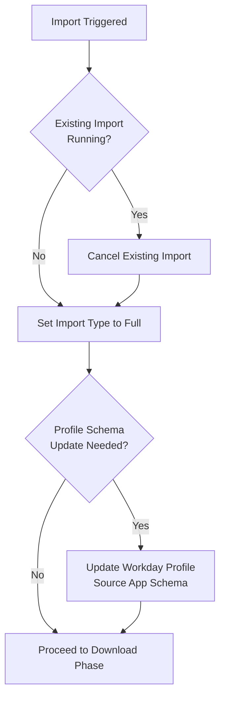
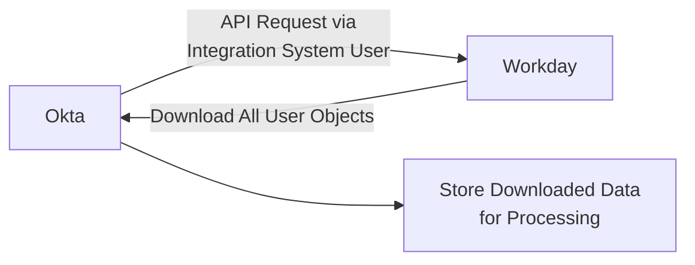
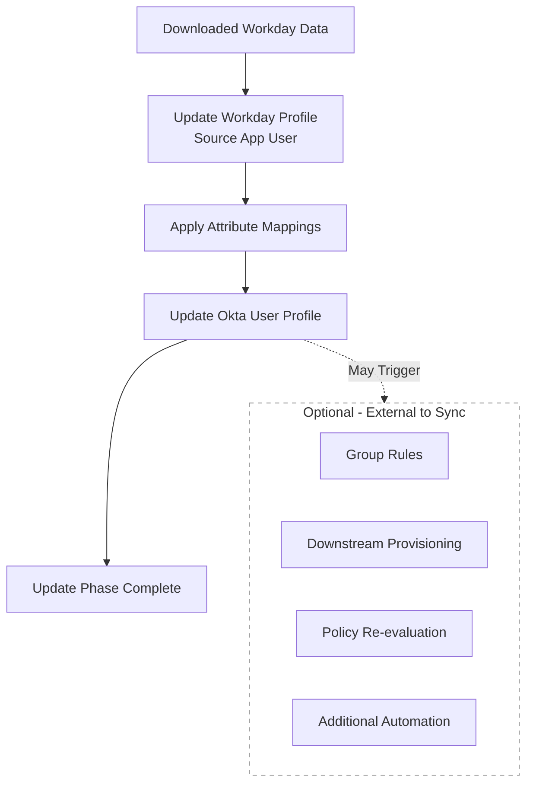
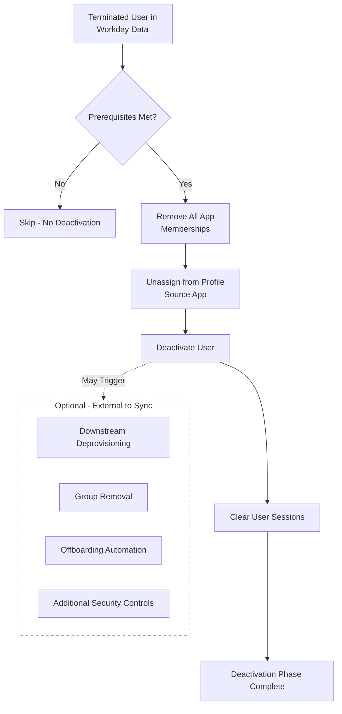
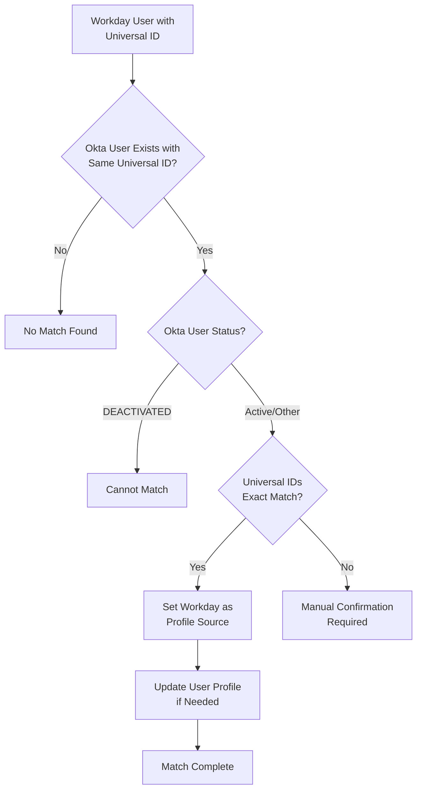
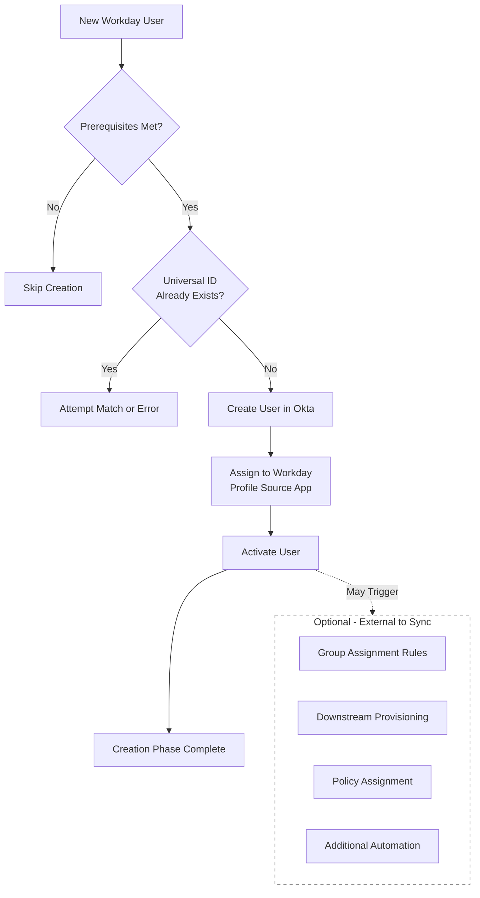
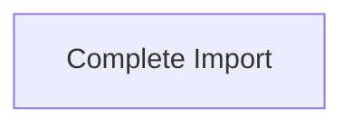
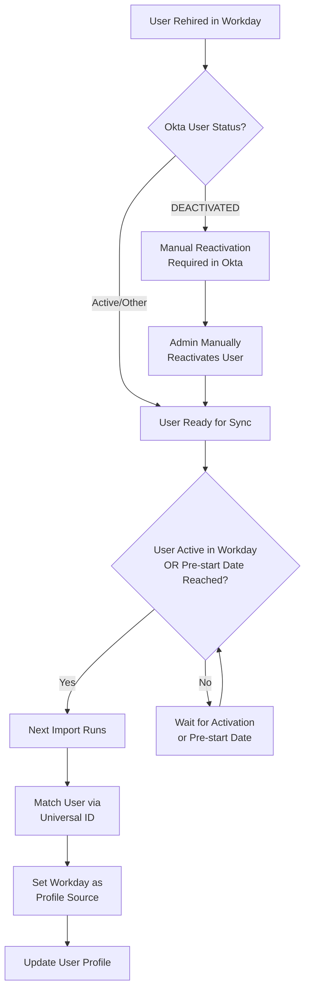
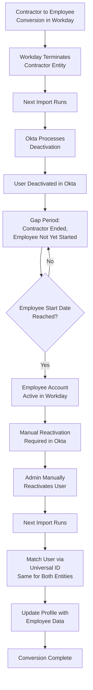

## 概要

Okta-Workday 統合は、Workday がユーザー ID の信頼できる情報源 (プロファイルソース) として機能し、Okta がダウンストリームの ID プラットフォーム (IdP) として機能する単方向の同期です。

GitLab はネイティブの事前構築済み Workday 統合を使用しており、Workday と Okta の間でユーザーライフサイクルおよび ID 管理を標準でサポートしています。

**対象集団:**
Okta-Workday 統合は、Okta で以下のユーザー集団を管理します:

- 従業員
- 契約労働者
- プロフェッショナルサービスパートナー

その他のすべてのユーザータイプは、Okta で直接管理されます。

**用語:**

- **Workday**:
  - ユーザー ID を含む HR システム。
- **Okta**:
  - GitLab でユーザーアクセスとライフサイクルを管理する ID およびアクセス管理プラットフォーム。
- **Workday Profile Source アプリ**:
  - プロファイルソースとして機能する Okta のアプリ。
  - Okta は、Workday からダウンロードしたデータを使用して Okta ユーザープロファイルを直接更新するわけではありません。代わりに、プロファイルソースアプリを Workday データで更新し、その後プロファイルソースアプリと Okta ユーザープロファイル間の属性マッピングを使用してどのフィールドを同期するかを決定します。
  - 「Workday によって管理される」と見なされるには、ユーザーがプロファイルソースアプリに割り当てられている必要があります。
- **Integration System User**:
  - Okta が Workday API にアクセスするために使用する Workday のサービスアカウント。
  - Okta が利用できるデータは、Integration System User にアクセス可能となっているものによって決まります。
- **Imports (インポート)**:
  - 1 時間ごとまたは手動でトリガーされる同期。
  - インポートは単方向で、フルまたは差分のいずれかとなります。
  - Okta は Workday からユーザーをインポートし、ユーザープロファイルとステータスを管理します。
- **Attribute Mappings (属性マッピング)**:
  - どのプロファイルソースアプリ属性がどの Okta ユーザープロファイル属性に反映されるかを決定するカスタムマッピング。
- **Workday Universal ID**:
  - Workday の各ユーザーに対する一意の永続的な識別子。
  - Universal ID により、Okta は Workday ユーザーを Okta ユーザーと照合および同期できます。
  - その他のすべてのプロファイル属性 (メール、名前、従業員番号など) は、両システムでユーザー ID 間の照合を維持しながら Okta で更新できます。

## インポート

インポートは Workday のユーザーとそのプロファイル属性を Okta に取り込み、両システム間でユーザープロファイルとステータスを照合します。

インポートには、ベース属性とカスタム属性、および非将来および将来発効日付の属性を含めることができます。インポートされるプロファイルデータは以下によって決まります:

- どのフィールドが Workday の Integration System User に利用可能になっているか。
- Workday のフィールドに適用された条件付きルール。
- Workday Profile Source アプリと Okta ユーザープロファイル間の属性マッピング。

インポートは 1 時間ごとに実行されるか、適切な権限を持つ Okta 管理者によって手動でトリガーされます。

```type:mermaid
gantt
    title Import Example
    dateFormat HH:mm:ss
    axisFormat %H:%M:%S
    section Start Import
    Start import process                                    :milestone, m1, 14:00:00, 0s
    Update "Workday Profile Source" app config            :14:00:00, 1s
    section Download Data
    Downloading data from Workday                           :14:00:01, 60s
    section Update Users
    Update profile source app user                          :14:01:01, 10s
    Update user profile                                     :14:01:01, 10s
    section Deactivate Users
    Deactivate user                                         :14:01:15, 30s
    Clear user session                                      :14:01:15, 30s
    Unassign user from apps                                 :14:01:15, 30s
    section Match Users
    Match imported users to existing Okta users             :14:01:45, 15s
    section Create Users
    Create profile source app user                          :14:02:00, 15s
    Create user                                             :14:02:00, 15s
    Activate user                                           :14:02:00, 15s
    section Complete Import
    Complete import process                                 :milestone, m2, 14:02:15, 0s
```

**追加情報**: Okta は特定のフェーズを並行して実行する場合があります。どのフェーズおよびイベントが発生するかは、提供された Workday データによって異なります。たとえば、ダウンロードされたデータに無効化されたユーザーが含まれていない場合、Okta は無効化フェーズをスキップする場合があります。

## インポートフェーズ

### インポート開始

**イベント**

- インポートがトリガーされます。同時に有効なインポートは 1 つだけのため、Okta は既存のインポートをすべてキャンセルします。
- Okta はインポートタイプを Full に設定します。前回のインポート以降に変更されたデータのみを取り込む差分インポートとは異なり、**フルインポート** は Workday のすべてのユーザーと Integration System User に利用可能な属性を取り込みます。
- 必要に応じて、Okta は Workday Profile Source アプリのプロファイルスキーマを更新します。スキーマは、アプリのユーザープロファイルを構成する属性を定義します。

{}



{}

**イベントタイプ**

- [`system.import.start`](https://developer.okta.com/docs/reference/api/event-types/?q=system.import.start)
- [`system.import.full_import_required`](https://developer.okta.com/docs/reference/api/event-types/?q=system.import.full_import_required)
- [`application.lifecycle.update`](https://developer.okta.com/docs/reference/api/event-types/?q=application.lifecycle.update)
- [`system.import.incremental_converted_to_full`](https://developer.okta.com/docs/reference/api/event-types/?q=system.import.incremental_converted_to_full)

### データのダウンロード

- Okta は Workday からすべての「オブジェクト」(ユーザー) をダウンロードします。

{}



{}

**イベントタイプ**

- [`system.import.download.start`](https://developer.okta.com/docs/reference/api/event-types/?q=system.import.download.start)
- [`system.import.download.complete`](https://developer.okta.com/docs/reference/api/event-types/?q=system.import.download.complete)

### ユーザーの更新

**イベント**

- Okta は、Workday Profile Source アプリに割り当てられたユーザーを Workday からダウンロードしたデータで更新します。
- Okta は、属性マッピングを使用してどの属性をどのように更新するかを決定し、ユーザーの Okta プロファイルを Workday Profile Source アプリのデータと一致するように更新します。
- 一般的な更新には以下が含まれます:
  - 名前の変更
  - 部門/部署/役職の変更
  - マネージャーの変更
  - ユーザータイプの変更
- 更新は以下もトリガーする場合があります:
  - グループ割り当てルール
  - 管理対象アプリでのダウンストリームプロビジョニング
  - セキュリティポリシーの割り当て
  - 追加の自動化

{}



{}

**追加情報:**

- プロファイルソースアプリ > Okta マッピングで `Create and Update` が設定されているマッピング済み属性のみが更新され、それ以外は変更されません。
- 一部のマッピング済み属性には、Workday の値を Okta 固有の値に変換する追加のルールがあります (例: Workday の雇用タイプを Okta のユーザータイプに変換)。
- 一部の Okta プロファイルフィールドは、他のシステムまたは自動化によって管理されます。
- Okta システムログはすべてのプロファイル属性変更を記録しますが、値が変更されたことだけを示し、以前の値が何であったかは示しません。

**イベントタイプ**

- [`system.import.object_creation.start`](https://developer.okta.com/docs/reference/api/event-types/?q=system.import.object_creation.start)
- [`application.user_membership.update`](https://developer.okta.com/docs/reference/api/event-types/?q=application.user_membership.update)
- [`system.import.user.update`](https://developer.okta.com/docs/reference/api/event-types/?q=system.import.user.update)
- [`user.account.update_profile`](https://developer.okta.com/docs/reference/api/event-types/?q=user.account.update_profile)
- [`system.import.object_creation.complete`](https://developer.okta.com/docs/reference/api/event-types/?q=system.import.object_creation.complete)

### ユーザーの無効化

**前提条件:**

- ユーザーは Workday で退職している必要があります。
- ユーザーは Okta のプロファイルソースアプリによってプロファイルソースが設定されている必要があります。
- ユーザーは既に Okta で DEACTIVATED であってはなりません。

**イベント**

- Okta は、ダウンロードした Workday データを使用して、どのユーザーを無効化するかを決定します。
- Okta はユーザーのプロファイルソースアプリへの割り当てを解除します。
- Okta はユーザーを無効化し、セッションをクリアします。
- 無効化は以下もトリガーする場合があります:
  - アプリの割り当て解除
  - グループからの削除
  - 管理対象アプリでのダウンストリームのプロビジョニング解除
  - オフボーディング自動化
  - 追加のセキュリティ制御
  - 追加の自動化

{}



{}

**追加情報:**

- 無効化されたユーザーのプロファイルは Okta で凍結され、プロファイル属性は変更できません。
- Okta はプロファイル更新の前に無効化を処理します。同じインポートに同じユーザーのプロファイル更新と無効化の両方が含まれている場合、プロファイルの変更は適用されません。これにより、重要なプロファイル値が更新されない可能性があります。
- Okta ユーザーが Workday によってプロファイルソースが設定されていない場合、Workday での退職は影響を与えません — Okta アカウントはアクティブのままになります。
- Workday でユーザーが遡及的に退職処理された場合、次回の 1 時間ごとの同期で Okta で無効化されます。
- Okta は、ユーザーを無効化すべきかを判断する際にプロファイルフィールド (例: `terminationDate`、`lastDayWorked`) を使用しません。

**イベントタイプ**

- [`system.import.implicit_deletion.start`](https://developer.okta.com/docs/reference/api/event-types/?q=system.import.implicit_deletion.start)
- [`application.user_membership.remove`](https://developer.okta.com/docs/reference/api/event-types/?q=application.user_membership.remove)
- [`user.lifecycle.deactivate`](https://developer.okta.com/docs/reference/api/event-types/?q=user.lifecycle.deactivate)
- [`user.session.clear`](https://developer.okta.com/docs/reference/api/event-types/?q=user.session.clear)
- [`system.import.user.delete`](https://developer.okta.com/docs/reference/api/event-types/?q=system.import.user.delete)
- [`system.import.user.complete`](https://developer.okta.com/docs/reference/api/event-types/?q=system.import.user.complete)
- [`system.import.implicit_deletion.complete`](https://developer.okta.com/docs/reference/api/event-types/?q=system.import.implicit_deletion.complete)

### ユーザーの照合

**前提条件:**

- ユーザーを照合するには Workday Universal ID が存在する必要があります。
- 完全一致のみが自動的に確認され、その他はすべて手動確認が必要です。
- ユーザーは Okta で DEACTIVATED であってはなりません。

**イベント**

- Okta は、ダウンロードした各 Workday ユーザーの Universal ID を、各 Okta ユーザープロファイルの `workdayUniversalID` フィールドと比較します。完全一致した場合、Okta はそのユーザーのプロファイルソースとして Workday を設定します。
- Okta はユーザー更新フェーズの追加アクションを実行する場合があります。

{}



{}

**イベントタイプ**

- [`system.import.user_matching.start`](https://developer.okta.com/docs/reference/api/event-types/?q=system.import.user_matching.start)
- [`system.import.user_matching.complete`](https://developer.okta.com/docs/reference/api/event-types/?q=system.import.user_matching.complete)

### ユーザーの作成

**前提条件:**

- Okta でユーザーが作成されるのは A) Workday でアクティブな場合、または B) プレスタート日に達したプレハイヤーの場合のみです。プレスタート日は、入社日の **1 日前** として Okta で設定されています。
- Okta は退職または非アクティブな Workday ユーザーに対してユーザーを作成しません。
- 新しい Workday ユーザーが既存の Okta ユーザーと同じ Universal ID を持っている場合、Okta はユーザーを **照合** しようとするか、エラーを返します。

**イベント**

- Okta は Workday データを使用してユーザーを作成します。
- Okta はユーザーをプロファイルソースアプリに割り当てます。
- Okta はユーザーをアクティブ化します。
- 作成は以下もトリガーする場合があります:
  - グループ割り当てルール
  - 管理対象アプリでのダウンストリームプロビジョニング
  - セキュリティポリシーの割り当て
  - 追加の自動化

{}



{}

**イベントタイプ**

- [`application.user_membership.add`](https://developer.okta.com/docs/reference/api/event-types/?q=application.user_membership.add)
- [`user.lifecycle.create`](https://developer.okta.com/docs/reference/api/event-types/?q=user.lifecycle.create)
- [`user.lifecycle.activate`](https://developer.okta.com/docs/reference/api/event-types/?q=user.lifecycle.activate)

### インポートの完了

- インポートが完了します。



**イベントタイプ**

- [`system.import.custom_object.complete`](https://developer.okta.com/docs/reference/api/event-types/?q=system.import.custom_object.complete)
- [`system.import.user.complete`](https://developer.okta.com/docs/reference/api/event-types/?q=system.import.user.complete)
- [`system.import.complete`](https://developer.okta.com/docs/reference/api/event-types/?q=system.import.complete)

## 追加のシナリオ

### 再雇用 / 再アクティブ化

Workday には Okta でユーザーを自動的に再アクティブ化する権限はありません。これは GitLab の特定のオフボーディングシナリオに起因します — Workday で退職処理が行われる前に Okta で無効化が発生する場合があり、その場合 Workday はアカウントをアクティブと見なし続けるため、次回の同期で誤って再アクティブ化してしまいます。これを防ぐため、Workday はユーザーの無効化のみを行えます。

再雇用が Okta で Workday によってプロファイルソース化されるためには、まずユーザーが `Okta で手動で再アクティブ化される必要があります`。ユーザーが Workday でアクティブになるか、プレスタート日に達した時点で、同期は既存のアクティブな Okta ユーザーを Workday ユーザーと照合します。

ユーザーは、誤った早期アクセスを防ぐため、開始日の 24 時間以上前に再アクティブ化すべきではありません。

{}



{}

### 変換

Workday では、契約者と従業員は別々のエンティティであり、別々の Workday ID を持っています。Universal ID はこれらのエンティティを連結し、変換 (例: 契約者から FTE) によって Okta で重複アカウントが作成されるのを防ぎます。

Workday が変換を処理すると、契約者アカウントは技術的に退職処理されるため、Workday は無効化イベントを Okta に送信します。Okta はこれを標準的な無効化と同様に処理します。これは、契約者が退職するが従業員の開始日が同じ日でない場合 — たとえば、契約者から従業員ロールに変換されるが、もう 1 週間先まで開始しない場合 — に対応します。

Workday は Okta でユーザーを再アクティブ化できないため、ユーザーは `まず Okta で手動で再アクティブ化される必要があります`。Okta ユーザーが `DEACTIVATED` でなくなると、同期は新しい従業員データでアカウントを照合および更新できます。ユーザーを再アクティブ化しないと、オフボーディング状態のままになります。

ユーザーは、誤った早期アクセスを防ぐため、開始日の 24 時間以上前に再アクティブ化すべきではありません。

{}



{}
