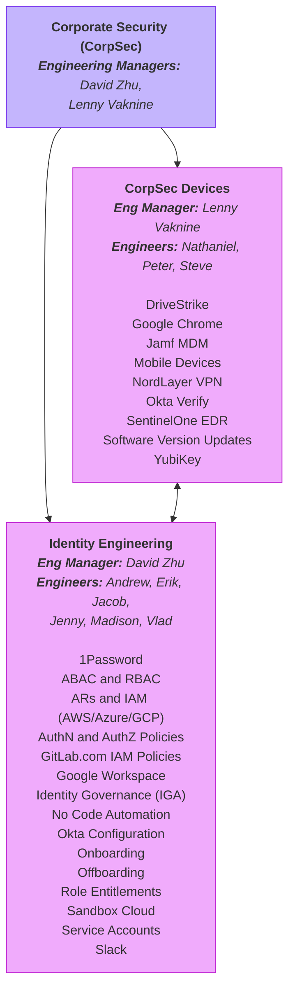
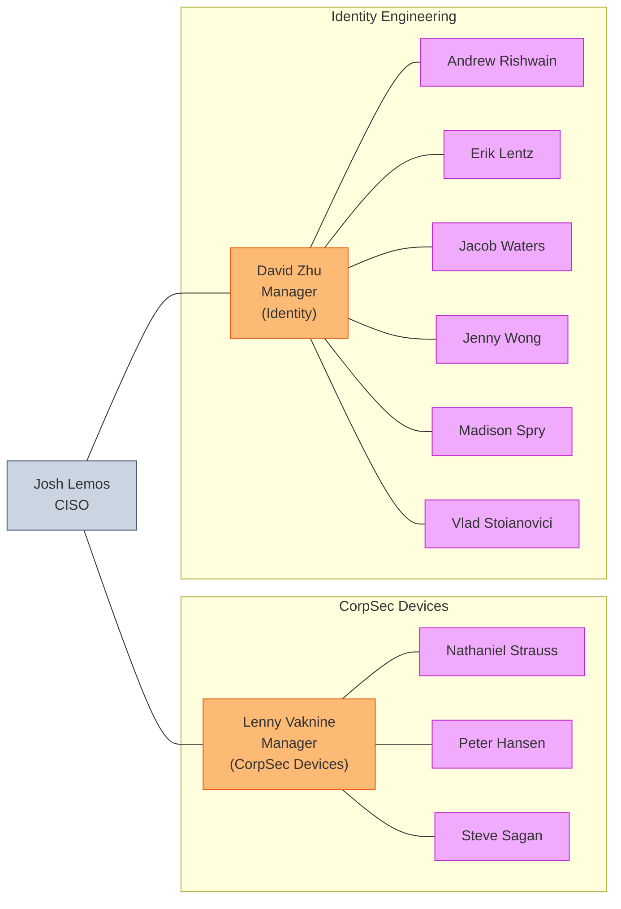

コーポレートセキュリティ部門は、チームメンバーと一時的なサービスプロバイダー (契約社員、ベンダーなど) 向けのテックサポート[ヘルプデスクサービス](/handbook/eta/corporate-it/end-user-services)と、私たちが管理する社内システムの構成管理[エンジニアリング](/handbook/security/corporate/engineering/)を提供します。

## チームディレクトリ

<table style="display: table;">
<thead>
<!-- Team Member -->
<tr>
<th>チームメンバー</th>
<th>Identity ロール</th>
<th>グループタグ</th>
</tr>
</thead>
<tbody>
<!-- Team Member -->
<tr>
<td>
<a href="https://gitlab.com/arishwain">

Andrew Rishwain</a> 
<small>
<i class="fas fa-earth-americas" style="padding-right: 5px;"></i>AMER 
<i class="fas fa-address-card" style="padding-right: 5px;"></i><code>arishwain</code> 
<i class="fa-brands fa-gitlab" style="padding-right: 5px;"></i><a target="_blank" href="https://gitlab.com/arishwain">@arishwain</a>
</small>
</td>
<td><small>
<i class="fas fa-address-card" style="padding-right: 5px;"></i><code>corpsec_eng_identity</code>
</small></td>
<td><small>
<i class="fa-brands fa-gitlab" style="padding-right: 5px;"></i><a target="_blank" href="https://gitlab.com/groups/gitlab-com/gl-security/corp/identity">@gitlab-com/gl-security/corp/identity</a> 
</small></td>
</tr>
<!-- Team Member -->
<tr>
<td>
<a href="https://gitlab.com/dzhu-gl">

David Zhu</a> 
<small>
<i class="fas fa-earth-americas" style="padding-right: 5px;"></i>AMER 
<i class="fas fa-address-card" style="padding-right: 5px;"></i><code>dzhu</code> 
<i class="fa-brands fa-gitlab" style="padding-right: 5px;"></i><a target="_blank" href="https://gitlab.com/dzhu-gl">@dzhu-gl</a>
</small>
</td>
<td><small>
<i class="fas fa-address-card" style="padding-right: 5px;"></i><code>corpsec_eng_identity</code> 
<i class="fas fa-address-card" style="padding-right: 5px;"></i><code>corpsec_mgr_eng</code>
</small></td>
<td><small>
<i class="fa-brands fa-gitlab" style="padding-right: 5px;"></i><a target="_blank" href="https://gitlab.com/groups/gitlab-com/gl-security/corp/identity">@gitlab-com/gl-security/corp/identity</a> 
<i class="fa-brands fa-gitlab" style="padding-right: 5px;"></i><a target="_blank" href="https://gitlab.com/groups/gitlab-com/gl-security/corp/managers">@gitlab-com/gl-security/corp/managers</a> 
</small></td>
</tr>
<!-- Team Member -->
<tr>
<td>
<a href="https://gitlab.com/eriklentz-gl">

Erik Lentz</a> 
<small>
<i class="fas fa-earth-americas" style="padding-right: 5px;"></i>AMER 
<i class="fas fa-address-card" style="padding-right: 5px;"></i><code>elentz</code> 
<i class="fa-brands fa-gitlab" style="padding-right: 5px;"></i><a target="_blank" href="https://gitlab.com/eriklentz-gl">@eriklentz-gl</a>
</small>
</td>
<td><small>
<i class="fas fa-address-card" style="padding-right: 5px;"></i><code>corpsec_eng_identity</code>
</small></td>
<td><small>
<i class="fa-brands fa-gitlab" style="padding-right: 5px;"></i><a target="_blank" href="https://gitlab.com/groups/gitlab-com/gl-security/corp/identity">@gitlab-com/gl-security/corp/identity</a> 
</small></td>
</tr>
<!-- Team Member -->
<tr>
<td>
<a href="https://gitlab.com/jacobdwaters">

Jacob Waters</a> 
<small>
<i class="fas fa-earth-americas" style="padding-right: 5px;"></i>AMER 
<i class="fas fa-address-card" style="padding-right: 5px;"></i><code>jwaters</code> 
<i class="fa-brands fa-gitlab" style="padding-right: 5px;"></i><a target="_blank" href="https://gitlab.com/jacobdwaters">@jacobdwaters</a>
</small>
</td>
<td><small>
<i class="fas fa-address-card" style="padding-right: 5px;"></i><code>corpsec_eng_identity</code>
</small></td>
<td><small>
<i class="fa-brands fa-gitlab" style="padding-right: 5px;"></i><a target="_blank" href="https://gitlab.com/groups/gitlab-com/gl-security/corp/identity">@gitlab-com/gl-security/corp/identity</a> 
</small></td>
</tr>
<!-- Team Member -->
<tr>
<td>
<a href="https://gitlab.com/jwong6">

Jenny Wong</a> 
<small>
<i class="fas fa-earth-americas" style="padding-right: 5px;"></i>AMER 
<i class="fas fa-address-card" style="padding-right: 5px;"></i><code>jwong</code> 
<i class="fa-brands fa-gitlab" style="padding-right: 5px;"></i><a target="_blank" href="https://gitlab.com/jwong6">@jwong6</a>
</small>
</td>
<td><small>
<i class="fas fa-address-card" style="padding-right: 5px;"></i><code>corpsec_eng_identity</code>
</small></td>
<td><small>
<i class="fa-brands fa-gitlab" style="padding-right: 5px;"></i><a target="_blank" href="https://gitlab.com/groups/gitlab-com/gl-security/corp/identity">@gitlab-com/gl-security/corp/identity</a> 
</small></td>
</tr>
<!-- Team Member -->
<tr>
<td>
<a href="https://gitlab.com/lennyv-glab">

Lenny Vaknine</a> 
<small>
<i class="fas fa-earth-americas" style="padding-right: 5px;"></i>AMER 
<i class="fas fa-address-card" style="padding-right: 5px;"></i><code>lvaknine</code> 
<i class="fa-brands fa-gitlab" style="padding-right: 5px;"></i><a target="_blank" href="https://gitlab.com/lennyv-glab">@lennyv-glab</a>
</small>
</td>
<td><small>
<i class="fas fa-address-card" style="padding-right: 5px;"></i><code>corpsec_devices</code> 
<i class="fas fa-address-card" style="padding-right: 5px;"></i><code>corpsec_mgr_eng</code>
</small></td>
<td><small>
<i class="fa-brands fa-gitlab" style="padding-right: 5px;"></i><a target="_blank" href="https://gitlab.com/groups/gitlab-com/gl-security/corp/device">@gitlab-com/gl-security/corp/device</a> 
<i class="fa-brands fa-gitlab" style="padding-right: 5px;"></i><a target="_blank" href="https://gitlab.com/groups/gitlab-com/gl-security/corp/managers">@gitlab-com/gl-security/corp/managers</a> 
</small></td>
</tr>
<!-- Team Member -->
<tr>
<td>
<a href="https://gitlab.com/mspry_gl">

Madison Spry</a> 
<small>
<i class="fas fa-earth-americas" style="padding-right: 5px;"></i>AMER 
<i class="fas fa-address-card" style="padding-right: 5px;"></i><code>mspry</code> 
<i class="fa-brands fa-gitlab" style="padding-right: 5px;"></i><a target="_blank" href="https://gitlab.com/mspry_gl">@mspry_gl</a>
</small>
</td>
<td><small>
<i class="fas fa-address-card" style="padding-right: 5px;"></i><code>corpsec_eng_identity</code>
</small></td>
<td><small>
<i class="fa-brands fa-gitlab" style="padding-right: 5px;"></i><a target="_blank" href="https://gitlab.com/groups/gitlab-com/gl-security/corp/identity">@gitlab-com/gl-security/corp/identity</a> 
</small></td>
</tr>
<!-- Team Member -->
<tr>
<td>
<a href="https://gitlab.com/nstrauss-gl">

Nathaniel Strauss</a> 
<small>
<i class="fas fa-earth-americas" style="padding-right: 5px;"></i>AMER 
<i class="fas fa-address-card" style="padding-right: 5px;"></i><code>nstrauss</code> 
<i class="fa-brands fa-gitlab" style="padding-right: 5px;"></i><a target="_blank" href="https://gitlab.com/nstrauss-gl">@nstrauss-gl</a>
</small>
</td>
<td><small>
<i class="fas fa-address-card" style="padding-right: 5px;"></i><code>corpsec_devices</code>
</small></td>
<td><small>
<i class="fa-brands fa-gitlab" style="padding-right: 5px;"></i><a target="_blank" href="https://gitlab.com/groups/gitlab-com/gl-security/corp/device">@gitlab-com/gl-security/corp/device</a> 
</small></td>
</tr>
<!-- Team Member -->
<tr>
<td>
<a href="https://gitlab.com/p_han">

Peter Hansen</a> 
<small>
<i class="fas fa-earth-europe" style="padding-right: 5px;"></i>EMEA 
<i class="fas fa-address-card" style="padding-right: 5px;"></i><code>phansen</code> 
<i class="fa-brands fa-gitlab" style="padding-right: 5px;"></i><a target="_blank" href="https://gitlab.com/p_han">@p_han</a>
</small>
</td>
<td><small>
<i class="fas fa-address-card" style="padding-right: 5px;"></i><code>corpsec_devices</code>
</small></td>
<td><small>
<i class="fa-brands fa-gitlab" style="padding-right: 5px;"></i><a target="_blank" href="https://gitlab.com/groups/gitlab-com/gl-security/corp/device">@gitlab-com/gl-security/corp/device</a> 
</small></td>
</tr>
<!-- Team Member -->
<tr>
<td>
<a href="https://gitlab.com/stevesagan">

Steve Sagan</a> 
<small>
<i class="fas fa-earth-americas" style="padding-right: 5px;"></i>AMER 
<i class="fas fa-address-card" style="padding-right: 5px;"></i><code>ssagan</code> 
<i class="fa-brands fa-gitlab" style="padding-right: 5px;"></i><a target="_blank" href="https://gitlab.com/stevesagan">@stevesagan</a>
</small>
</td>
<td><small>
<i class="fas fa-address-card" style="padding-right: 5px;"></i><code>corpsec_devices</code>
</small></td>
<td><small>
<i class="fa-brands fa-gitlab" style="padding-right: 5px;"></i><a target="_blank" href="https://gitlab.com/groups/gitlab-com/gl-security/corp/device">@gitlab-com/gl-security/corp/device</a> 
</small></td>
</tr>
<!-- Team Member -->
<tr>
<td>
<a href="https://gitlab.com/vlad">

Vlad Stoianovici</a> 
<small>
<i class="fas fa-earth-europe" style="padding-right: 5px;"></i>EMEA 
<i class="fas fa-address-card" style="padding-right: 5px;"></i><code>vstoianovici</code> 
<i class="fa-brands fa-gitlab" style="padding-right: 5px;"></i><a target="_blank" href="https://gitlab.com/vlad">@vlad</a>
</small>
</td>
<td><small>
<i class="fas fa-address-card" style="padding-right: 5px;"></i><code>corpsec_eng_identity</code>
</small></td>
<td><small>
<i class="fa-brands fa-gitlab" style="padding-right: 5px;"></i><a target="_blank" href="https://gitlab.com/groups/gitlab-com/gl-security/corp/identity">@gitlab-com/gl-security/corp/identity</a> 
</small></td>
</tr>

</tbody>
</table>

## 機能組織図

## マネージャー組織図

