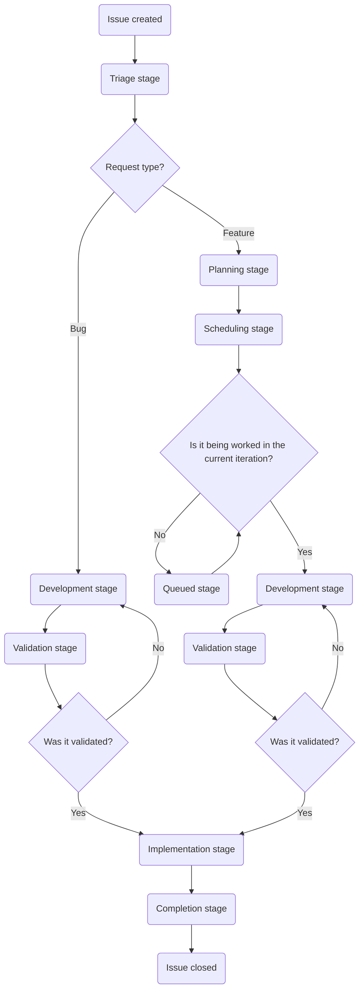

## 目的

Customer Support Operations の目的は、次のことを通じて GitLab が顧客に素晴らしい体験を提供できるようにすることです。

- Customer Support チームに知識、ツール、データを提供し、生産性を最適化して効率的に顧客の問題を解決できるようにする。
- 私たちの顧客や GitLab 全体に対してデータ、知識、インサイトを提供し、顧客の問題が発生する前に防止できるようにする。
- 社内外の顧客の双方に素晴らしい体験を届ける。

## チーム紹介

| 名前 | ロール |
|------|------|
| [Namo Tiwari](https://gitlab.com/namotiwari) | VP - Business Systems |
| [Jason Colyer](https://gitlab.com/jcolyer) | Fullstack Engineer, Customer Support Systems |
| [Dylan Tragjasi](https://gitlab.com/dtragjasi) | Senior Customer Support Systems Specialist |
| [Sarah Cole](https://gitlab.com/Secole) | Customer Support Systems Specialist |

## 私たちと協働する

私たちはお手伝いするためにいます。必要な内容に応じて、私たちに連絡する最適な方法を簡単に案内します。

🙋 **新規依頼または変更の依頼**

> **依頼する前に注意**: 各依頼タイプには、それを提出する権限を持つ特定のロールがあります。遅延を避けるため、まず適切な担当者と連絡を取ってください。適切なロール以外から提出された Issue はクローズされ、結局その担当者へ案内されることになります。

- **Global Support team の依頼**は、[SIG チーム](https://gitlab.com/support-innovation-group)のメンバーが[このテンプレート](https://gitlab.com/gitlab-com/gl-security/corp/cust-support-ops/issue-tracker/-/issues/new?issuable_template=Feature)を使用して提出してください。
- **US Government Support team の依頼**は、US Government Support の manager/director が[このテンプレート](https://gitlab.com/gitlab-com/gl-security/corp/cust-support-ops/issue-tracker/-/issues/new?issuable_template=Feature)を使用して提出してください。
- **Knowledge Base の更新（あらゆる Zendesk インスタンス）**は、Support の Senior Technical Program Manager が[このテンプレート](https://gitlab.com/gitlab-com/gl-security/corp/cust-support-ops/issue-tracker/-/issues/new?issuable_template=Feature)を使用して提出してください。
- **それ以外のすべて**は、依頼するチームの manager/director が[このテンプレート](https://gitlab.com/gitlab-com/gl-security/corp/cust-support-ops/issue-tracker/-/issues/new?issuable_template=Feature)を使用して提出してください。

🐛 **バグを見つけましたか？**

[このテンプレート](https://gitlab.com/gitlab-com/gl-security/corp/cust-support-ops/issue-tracker/-/issues/new?issuable_template=Bug)を使用して Issue を提出してください。報告にお時間を割いていただき感謝します。

💬 **その他**

Slack の [#support_operations](https://gitlab.enterprise.slack.com/archives/C018ZGZAMPD) で、私たちに直接連絡してください。いつでも喜んでお話しします。

## Issue フローチャート

