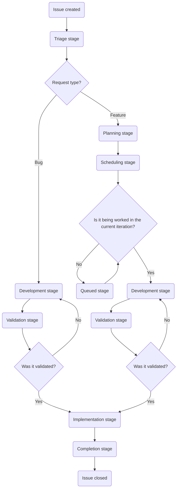

## 目的

カスタマーサポートオペレーションの目的は、GitLab が以下のことを通じて、お客様に喜んでいただける体験を提供できるようにすることです。

- カスタマーサポートチームに、生産性を最適化し、顧客の問題を効率的に解決するための知識、ツール、データを提供する。
- お客様、そしてより広範な GitLab に対して、顧客の問題が発生する前に予防するためのデータ、知識、洞察を提供する。
- 社内および社外の両方のお客様に、喜んでいただける体験を届ける。

## チームを紹介します

| 名前 | 役割 |
|------|------|
| [Namo Tiwari](https://gitlab.com/namotiwari) | VP - Business Systems |
| [Jason Colyer](https://gitlab.com/jcolyer) | Fullstack Engineer, Customer Support Systems |
| [Dylan Tragjasi](https://gitlab.com/dtragjasi) | Senior Customer Support Systems Specialist |
| [Sarah Cole](https://gitlab.com/Secole) | Customer Support Systems Specialist |

## 私たちと仕事をする

私たちはお手伝いするためにここにいます！必要なものに応じて、私たちに連絡を取る最良の方法のクイックガイドを以下に示します。

🙋 **新しいものや変更のリクエスト**

> **起票前のヒント**: 各リクエストタイプには、提出を許可された特定のロールがあります。遅延を避けるため、まず適切な担当者に連絡してください。適切なロール以外から提出された Issue はクローズされ、いずれにしてもその担当者へ案内されます！

- **Global Support チームのリクエスト** は、[SIG チーム](https://gitlab.com/support-innovation-group) のメンバーが [このテンプレート](https://gitlab.com/gitlab-com/gl-security/corp/cust-support-ops/issue-tracker/-/issues/new?issuable_template=Feature) を利用して提出してください
- **US Government Support チームのリクエスト** は、US Government Support のマネージャー / ディレクターが [このテンプレート](https://gitlab.com/gitlab-com/gl-security/corp/cust-support-ops/issue-tracker/-/issues/new?issuable_template=Feature) を利用して提出してください
- **ナレッジベースの更新 (任意の Zendesk インスタンス)** は、Support の Senior Technical Program Manager が [このテンプレート](https://gitlab.com/gitlab-com/gl-security/corp/cust-support-ops/issue-tracker/-/issues/new?issuable_template=Feature) を利用して提出してください
- **その他すべて** は、リクエストを行うチームのマネージャー / ディレクターが [このテンプレート](https://gitlab.com/gitlab-com/gl-security/corp/cust-support-ops/issue-tracker/-/issues/new?issuable_template=Feature) を利用して提出してください

🐛 **バグを見つけましたか?**

[このテンプレート](https://gitlab.com/gitlab-com/gl-security/corp/cust-support-ops/issue-tracker/-/issues/new?issuable_template=Bug) を利用して Issue を起票してください。報告するためにお時間を取っていただきありがとうございます！

💬 **その他?**

Slack の [#customer_support_systems](https://gitlab.enterprise.slack.com/archives/C018ZGZAMPD) で直接ご連絡ください。いつでも喜んでお話しします！

## Issue フローチャート

