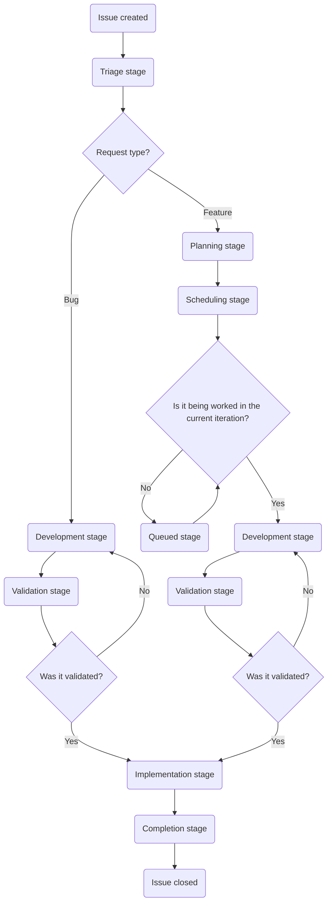

## 目的

カスタマーサポートオペレーションの目的は、GitLab が以下のことを通じて、お客様に喜んでいただける体験を提供できるようにすることです。

- カスタマーサポートチームに、生産性を最適化し、顧客の問題を効率的に解決するための知識、ツール、データを提供する。
- お客様、そしてより広範な GitLab に対して、顧客の問題が発生する前に予防するためのデータ、知識、洞察を提供する。
- 社内および社外の両方のお客様に、喜んでいただける体験を届ける。

## チームを紹介します

| 名前 | 役割 |
|------|------|
| [Namo Tiwari](https://gitlab.com/namotiwari) | VP - Business Systems |
| [Jason Colyer](https://gitlab.com/jcolyer) | Fullstack Engineer, Customer Support Systems |
| [Dylan Tragjasi](https://gitlab.com/dtragjasi) | Senior Customer Support Systems Specialist |
| [Sarah Cole](https://gitlab.com/Secole) | Customer Support Systems Specialist |

## 私たちと協力する

私たちはお手伝いするためにここにいます。必要な内容に応じて、私たちに連絡する最適な方法を簡単にご案内します。

🙋 **新しいものの要望や変更の要望**

> **提出前のご注意**: 各リクエストタイプには、提出を許可された特定のロールがあります。遅延を避けるため、まず適切な担当者と連絡を取ってください。適切なロール以外から提出された Issue はクローズされ、いずれにせよその担当者へ案内されます。

- **Global Support team のリクエスト**は、[SIG team](https://gitlab.com/support-innovation-group) のメンバーが[このテンプレート](https://gitlab.com/gitlab-com/gl-security/corp/cust-support-ops/issue-tracker/-/issues/new?issuable_template=Feature)を使って提出してください。
- **US Government Support team のリクエスト**は、US Government Support の manager/director が[このテンプレート](https://gitlab.com/gitlab-com/gl-security/corp/cust-support-ops/issue-tracker/-/issues/new?issuable_template=Feature)を使って提出してください。
- **Knowledge Base の更新（あらゆる Zendesk インスタンス）**は、Support の Senior Technical Program Manager が[このテンプレート](https://gitlab.com/gitlab-com/gl-security/corp/cust-support-ops/issue-tracker/-/issues/new?issuable_template=Feature)を使って提出してください。
- **その他すべて**は、リクエストするチームの manager/director が[このテンプレート](https://gitlab.com/gitlab-com/gl-security/corp/cust-support-ops/issue-tracker/-/issues/new?issuable_template=Feature)を使って提出してください。

🐛 **バグを見つけましたか？**

[このテンプレート](https://gitlab.com/gitlab-com/gl-security/corp/cust-support-ops/issue-tracker/-/issues/new?issuable_template=Bug)を使って Issue を提出してください。報告のために時間を割いていただき、ありがとうございます。

💬 **それ以外のことですか？**

Slack の [#support_operations](https://gitlab.enterprise.slack.com/archives/C018ZGZAMPD) で、お気軽に直接私たちに連絡してください。いつでも喜んでお話しします。

## Issue フローチャート

