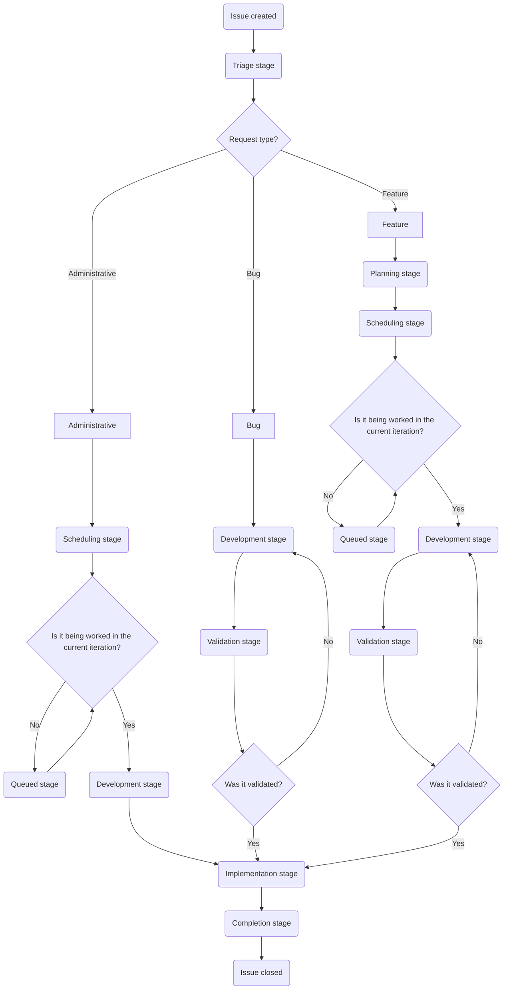

このページでは、Customer Support Operations チームにおける Issue 対応のワークフローを説明します。トリアージ、計画、開発、検証、実装を含め、Issue が作成から完了までに進むステージを取り上げます。

このワークフローを理解することで、チームメンバーは各ステージで何を期待すればよいか、誰が責任者か、Issue を前に進めるためにどのようなアクションが必要かを把握できます。

{}

インシデントも私たちが対応する Issue の一種ですが、独自の特別なフローで運用されます。詳細については [Incidents のドキュメント](/handbook/security/customer-support-operations/incidents/)を参照してください。

{}

## Issue のフローチャート

Issue の標準的な進行は次のようになります:



## 誰がどの Issue を起票できるか

- `Feature` の Issue は、リクエストの発生元／対象となるチームによって異なります:
  - Global Support チームからのものはすべて、[SIG チーム](https://gitlab.com/support-innovation-group)のメンバーが起票する必要があります
  - US Government Support チームからのものはすべて、US Government Support のマネージャーが起票する必要があります
  - Knowledge Base に関するものはすべて（いずれのインスタンスについても）、Support Senior Technical Program Manager が起票する必要があります
  - それ以外のものはすべて、リクエストを行うチームのマネージャーが起票する必要があります
- `Bug` の Issue は誰でも起票できます
- `Administrative` の Issue は、Customer Support Operations チームのみが起票してください
- `Incident` の Issue は、Customer Support Operations チームのみが起票してください

## ステージ

Issue で行うべき作業は、その Issue がどのステージにあるかに大きく依存します。Issue がステージからステージへ移動するにつれて、担当者は頻繁に変わる点に注意してください。

使用するステージのクイックリファレンスは次のとおりです:

| ステージ | リクエストタイプ | 主たる DRI | SLA 目標 |
|-------|--------------|-------------|------------|
| Triage | すべて | Dylan | 1〜2 日 |
| Planning | Bug、Feature | Jason | 5 日 |
| Scheduling | Feature、Administrative | Dylan と Jason | 週次 |
| Development | すべて | 場合により異なる | 1〜3 週間 |
| Validation | Bug、Feature | 場合により異なる | 3〜5 日 |
| Implementation | すべて | 場合により異なる | 3 日 |
| Completed | すべて | 場合により異なる | クローズまで 2 日 |

### Triage

{}

- 主たる DRI: Dylan
- 副次的 DRI: Alyssa
- SLA 目標: 1〜2 営業日
- このステージを使用するリクエストタイプ:
  - Administrative
  - Bug
  - Feature
- 目的
  - リクエストの非技術的な妥当性／実現可能性を判断する
  - 進める前に追加情報が必要かどうかを判断する
  - 必要な承認が揃っていることを確認する
  - 顧客タイプ、影響を受けるシステム、優先度、ロードマップとの整合性を示すラベルを追加する
- 主な活動
  - リクエスト者から必要な情報を収集する
  - ロードマップとの整合性と複雑さに基づいて承認を検証する
  - Planning ステージへ移動する、または進められない場合はクローズする
  - 元のリクエストに十分な詳細が提供されていない場合は Blocked ステージへ移動する

{}

ここで DRI は次のことを行います:

- リクエストから必要な情報を収集する（必要な場合）
- Issue を前に進められるかどうかを判断する
- Issue が妥当かどうかを判断する（正しい人物によって提出されているか、実現可能か、など）

その後、DRI は次のことを行う必要があります:

- Issue に[優先度ラベル](/handbook/security/customer-support-operations/gitlab/labels#priority-labels)が付いていることを確認する
- Issue に[顧客ラベル](/handbook/security/customer-support-operations/gitlab/labels#customer-labels)が付いていることを確認する
- Issue に[ロードマップラベル](/handbook/security/customer-support-operations/gitlab/labels#roadmap-labels)が付いていることを確認する（Issue がロードマップ項目に紐づいている場合）

これらが整ったら、DRI はリクエストタイプに応じて Issue を次のステージへ移動します:

- Administrative の Issue は [Scheduling ステージ](#scheduling)へ移動する
- Bug または Feature の Issue は [Planning ステージ](#planning)へ移動する

これは [quickactions](https://docs.gitlab.com/user/project/quick_actions/) を使って 1 つのコメントで行えます。例:

```plaintext
/label ~"Customer::Support"
/label ~"Priority::3"
/label ~"RequestType::Feature"
/label ~"roadmap_item"
/label ~"Stage::Planning"
```

また、次の[グループコメントテンプレート](https://gitlab.com/groups/gitlab-com/gl-security/corp/cust-support-ops/-/comment_templates)を使って、作業を補助する quickactions コメントを生成することもできます:

- [Triage -> Planning](https://gitlab.com/groups/gitlab-com/gl-security/corp/cust-support-ops/-/comment_templates/1000652)
- [Triage -> Scheduling](https://gitlab.com/groups/gitlab-com/gl-security/corp/cust-support-ops/-/comment_templates/1001112)
- [Triage -> Development](https://gitlab.com/groups/gitlab-com/gl-security/corp/cust-support-ops/-/comment_templates/1001111)

#### 不適切な人物によって起票されたリクエストのクローズ

Issue を起票することが許可されていない人物によって起票された場合（[誰がどの Issue を起票できるか](#who-can-file-what-issues)を参照）、その Issue はクローズする必要があります（また、リクエスト者には前に進めるためにどのようなアクションを取るべきかを案内します）。

これを補助するため、その場の状況に合った正しい[グループコメントテンプレート](https://gitlab.com/groups/gitlab-com/gl-security/corp/cust-support-ops/-/comment_templates)を使用してください:

- [Not approved -> Talk to SIG team](https://gitlab.com/groups/gitlab-com/gl-security/corp/cust-support-ops/-/comment_templates/2001174)
- [Not approved -> Talk to manager](https://gitlab.com/groups/gitlab-com/gl-security/corp/cust-support-ops/-/comment_templates/2001175)
- [Not approved -> Talk to Senior Technical Program Manager](https://gitlab.com/groups/gitlab-com/gl-security/corp/cust-support-ops/-/comment_templates/2001176)

これらを使用することで、Issue に関わる人物に誰と話すべきかを案内すると同時に、Issue を適切にクローズできます。

#### トリアージ中の Issue のクローズ

Issue を進められないと DRI が判断した場合、DRI は次のアクションを取ってください:

- 進められない理由を述べるコメントをする
- Issue の `status` を `Won't do` に設定する
- Issue をクローズする

これは [quickactions](https://docs.gitlab.com/user/project/quick_actions/) を使って 1 つのコメントで行えます。例:

```plaintext
Greetings,

After review of this issue, we have determined we will not be able to proceed on this issue.

This is due to <insert reasons here>.

Due to this, we will be closing this out. Should the above mentioned reasons be resolved, please create a **new** issue.

/status "Won't do" 
```

### Planning

{}

- 主たる DRI: Jason
- 副次的 DRI: Sarah
- SLA 目標: 5 営業日
- このステージを使用するリクエストタイプ:
  - Bug
  - Feature
- 目的
  - 技術的な妥当性／実現可能性を判断する
  - 追加情報が必要かどうかを判断する
  - 実装の計画を作成する
  - 作業量のおおよその見積もりを行う
- 主な活動
  - 詳細な計画を書く
  - ブロッカーを解消するためにリクエスト者と協働する
  - Issue のウェイトスコアを決定する
  - 完了したら Scheduling ステージへ移動する

{}

ここで DRI は次のことを行います:

- Issue の計画を書き起こす（そして Issue にコメントとして投稿する）
- リクエストの技術的な実現可能性を判断する
- 必要な作業期間のおおよその見積もりを行う（検証時間は除く）
- [RICE スコア](#rice-score)を決定する

その後、DRI は次のことを行う必要があります:

- Issue にウェイト値を追加する（[RICE スコア](#rice-score)を使用する）
- Issue にイテレーションとマイルストーンを追加する（Bug の Issue のみ）

これらが整ったら、DRI はリクエストタイプに応じて Issue を次のステージへ移動します:

- Bug の Issue は [Development ステージ](#development)へ移動する
- Feature の Issue は [Scheduling ステージ](#scheduling)へ移動する

また、次の[グループコメントテンプレート](https://gitlab.com/groups/gitlab-com/gl-security/corp/cust-support-ops/-/comment_templates)を使って、作業を補助する quickactions コメントを生成することもできます:

- [Planning -> Development](https://gitlab.com/groups/gitlab-com/gl-security/corp/cust-support-ops/-/comment_templates/1000755)
- [Planning -> Scheduling](https://gitlab.com/groups/gitlab-com/gl-security/corp/cust-support-ops/-/comment_templates/1000754)

#### RICE スコア

Customer Support Operations では、Feature の Issue に対して [RICE フレームワーク](/handbook/product/product-processes/#using-the-rice-framework)を修正したバージョンを使用しています。

私たちの修正版で取りうる値の内訳は次のとおりです:

| カテゴリ | 値 | スコア |
|----------|-------|:-----:|
| Reach | 顧客に影響する | 10 |
| | すべてのエージェントに影響する | 7 |
| | 1 つのリージョンのエージェントに影響する | 4 |
| | 小規模なエージェントグループに影響する | 2 |
| | 影響は最小限またはほぼなし | 1 |
| Impact | GitLab の収益に直接影響する | 3 |
| | サポートワークフローに大きく影響する | 2 |
| | サポートワークフローにわずかに影響する | 1 |
| | 影響は最小限またはほぼなし | 0.5 |
| Confidence | パーセンテージ | 場合により異なる |
| Effort | 数値 | 場合により異なる |

上記の値からスコアを取得し、次の式を使って RICE スコアを計算します:

(Reach × Impact × Confidence) / Effort

[この計算ツール](https://docs.google.com/spreadsheets/d/1SVIRUJ9UmmMSXl0-WZSBP2KueTzGxJfBH4zir61WTFY/edit?gid=0#gid=0)（GitLab の Google アカウントアクセスが必要）を使って、RICE スコアをすばやく生成できます。

#### 計画中の Issue のクローズ

Issue を進められないと DRI が判断した場合、DRI は次のアクションを取ってください:

- 進められない理由を述べるコメントをする
- Issue の `status` を `Won't do` に設定する
- Issue をクローズする

これは [quickactions](https://docs.gitlab.com/user/project/quick_actions/) を使って 1 つのコメントで行えます。例:

```plaintext
Greetings,

After review of this issue, we have determined we will not be able to proceed on this issue.

This is due to <insert reasons here>.

Due to this, we will be closing this out. Should the above mentioned reasons be resolved, please create a **new** issue.

/status "Won't do" 
```

### Scheduling

{}

- 主たる DRI: Dylan と Jason
- SLA 目標: 週次のサイクルで対応する（1 週間以内）
- このステージを使用するリクエストタイプ:
  - Feature
- 目的
  - リソース面での妥当性／実現可能性を判断する
  - イテレーションとマイルストーンを割り当てる
  - Development の DRI を割り当てる
- 主な活動
  - 開発のスケジュールを議論する（週次のサイクル）
  - Issue にイテレーションとマイルストーンを追加する
  - 現在のイテレーションの場合: Development ステージへ移動する
  - 将来のイテレーションの場合: Queued ステージへ移動する

{}

ここで DRI は変更の開発スケジュールについて議論します。これは週次のサイクルで行われます。

決定したら、DRI は Issue に対して次のことを行います:

- Issue にイテレーションを設定する
- Issue にマイルストーンを設定する
- 今後の Issue の DRI を設定する

その後、DRI は作業開始のスケジュールに応じて Issue を次のステージへ移動します:

- 作業開始のスケジュールが**現在の**イテレーションの場合、Issue は [Development ステージ](#development)へ移動する
- 作業開始のスケジュールが将来のイテレーションの場合、Issue は [Queued ステージ](#queued)へ移動する

また、次の[グループコメントテンプレート](https://gitlab.com/groups/gitlab-com/gl-security/corp/cust-support-ops/-/comment_templates)を使って、作業を補助する quickactions コメントを生成することもできます:

- [Scheduling -> Development](https://gitlab.com/groups/gitlab-com/gl-security/corp/cust-support-ops/-/comment_templates/1000757)
- [Scheduling -> Queued](https://gitlab.com/groups/gitlab-com/gl-security/corp/cust-support-ops/-/comment_templates/1000756)

### Queued

{}

- 主たる DRI: Dylan と Jason
- SLA 目標: 該当なし
- このステージを使用するリクエストタイプ:
  - Feature
- 目的
  - リクエストは準備が整っているが、割り当てられたイテレーションの開始を待っていることを示す
- 主な活動
  - イテレーションのスケジュールを監視する
  - イテレーションが開始したら: Development の DRI を割り当て、Development ステージへ移動する

{}

Issue はイテレーションが開始するまでここにとどまります。イテレーションが開始したら、DRI は Issue を [Development ステージ](#development)へ移動してください。

また、次の[グループコメントテンプレート](https://gitlab.com/groups/gitlab-com/gl-security/corp/cust-support-ops/-/comment_templates)を使って、作業を補助する quickactions コメントを生成することもできます:

- [Queued -> Development](https://gitlab.com/groups/gitlab-com/gl-security/corp/cust-support-ops/-/comment_templates/1000758)

### Development

{}

- 主たる DRI: 場合により異なる
- SLA 目標: 計画のスケジュールに基づく（通常 1〜3 週間）
- このステージを使用するリクエストタイプ:
  - Administrative
  - Bug
  - Feature
- 目的
  - ステージング／サンドボックスで変更を実装する
  - テストを実施する
  - 検証のために環境を準備する
- 主な活動
  - 適切な環境で変更を実装する
  - 実装をテストする
  - 検証を得るために Validation ステージへ移動する
    - 検証が不要な場合は代わりに Implementation ステージへ移動する

{}

このステージでは、DRI はテストと検証を可能にするために必要なセットアップを行います（通常はサンドボックス内で）。DRI はセットアップのために変更を行う際、何を行ったかを示すコメントを追加してください。決まったフォーマットを使う必要はありませんが、一般的な推奨は次のようなものです:

```plaintext
## Development notes

- Zendesk Global Sandbox
  - Triggers
    - Modified [Example trigger](LINK_TO_TRIGGER)
  - Ticket forms
    - Renamed form [Example form](LINK_TO_FORM) to `Modified Example form`
  - Webhooks
    - Created [New webhook](LINK_TO_WEBHOOK)

```

必要なセットアップをすべて完了したら、実施が必要なテストスイートを含むタスク項目を Issue に生成する必要があります。実施が必要な各テストについて、子タスク項目を作成してください。

各子タスク項目について:

- 件名／タイトルはテスト対象の名前にする（例として、SLA ポリシー `Priority Support - FRT` をテストする場合、件名／タイトルは `Priority Support - FRT` にする）
- 本文／説明には次の 3 つのセクションを含める:
  - `Prerequisites`: テストを実施するための前提条件
  - `Steps`: テストを行うための正確な手順
  - `Expected Result`: テストの期待される結果の詳細

<details>
<summary>「Support Readiness SLA」を使ったテスト項目の例</summary>

```plaintext

## Prerequisites

- A test ticket must exist that is open
- A test ticket must use the `Support Ops` form

## Steps

1. Login to [Zendesk Global's Sandbox](https://gitlab1707170878.zendesk.com/) using the end-user `will@example.com` (login details can be found [here](https://docs.google.com/spreadsheets/d/1g6lJ3AUS4EYqoBYzAdExp4v1dkzOb3GWKaMIoZikjts/edit?usp=sharing))
2. Create a new ticket using the [Support Ops form](https://gitlab1707170878.zendesk.com/hc/en-us/requests/new?ticket_form_id=12510630404508) with the following information
   - Subject: `Test from issue xxx`
   - Description: `Testing`
   - What type of product are you using: `GitLab.com`
   - Email associated with your subscription: `will@example.com`
   - Subscription number: `A-S123456789`
3. Note the ticket ID to help locate it later
4. Logout of [Zendesk Global's Sandbox](https://gitlab1707170878.zendesk.com/)
5. Login to [Zendesk Global's Sandbox](https://gitlab1707170878.zendesk.com/) as an agent account. If you do not have your own agent account, you can use `agent@example.com` (login details can be found [here](https://docs.google.com/spreadsheets/d/1g6lJ3AUS4EYqoBYzAdExp4v1dkzOb3GWKaMIoZikjts/edit?usp=sharing))
6. Locate the previously created ticket in Zendesk
7. Check the events of the ticket to confirm the SLA policy is set to `Support Readiness SLA`

## Expected Result

The ticket is using the SLA policy `Support Readiness SLA`
```

</details>

テストスイートのすべての子タスク項目を生成したら、親 Issue にそれを要約するコメントを追加してください。次のようなものです:

```plaintext
## QA Test Plan

The following child test issues were created for this MR:

- LINK_TO_CHILD_TASK_ITEM
- LINK_TO_CHILD_TASK_ITEM
- LINK_TO_CHILD_TASK_ITEM
- LINK_TO_CHILD_TASK_ITEM
- LINK_TO_CHILD_TASK_ITEM
```

{}

私たちは `CustSuppOps Zendesk Test Suite Generator` という名前の GitLab Duo エージェントを開発しました。このエージェントは、あなたが作業しているマージリクエスト（およびリンクされた Issue）を使って、テストスイートを生成してくれます。

使用方法:

1. マージリクエストを作成する（説明に親 Issue へのリンクを含めること）
1. ページ右上（プロフィールアイコンの下）の `Add new chat` をクリックする
1. `CustSuppOps Zendesk Test Suite Generator` エージェントを見つけてクリックする
1. チャットでエージェントにテストスイートの生成を依頼する

エージェントの実行中、エージェントは次のことを行います:

- 何を行い、何を確認しているか（および使用しているロジック）を述べる
- 子タスク項目の内容について承認を求める
- 親 Issue への要約コメントの追加について承認を求める
- 実行したすべてのアクションを要約する

作業しているプロジェクトで `CustSuppOps Zendesk Test Suite Generator` を実行できるかどうかを判断するには、該当する項目のハンドブックページを参照してください。

{}

完全なテストスイートを生成したら、テストを実施する必要があります（またはテストの実施について SIG チームに支援を依頼します）。

テストを実施する際は、子タスク項目をテストの結果と状態で更新してください。テストが失敗した場合は、気づいた点や変更が必要かどうかについてのメモやコメントを追加してください。テストが完了したら（成功でも失敗でも）、子タスク項目をクローズしてください。すばやく読み取りやすくするために、最終的なステータスを示すために子タスク項目の件名／タイトルを `:white_check_mark:` または `:x:` で編集しておくと役立ちます。

{}

テストが失敗した場合、修正がマージリクエストにプッシュされた後、（以前に実施したテストを含めて）まったく新しいテストスイートを実施する必要があります。これにより、テストスイートの完了後に変更が必要になっても、すべてが正常に動作する状態を保証できます。

{}

すべてのテストと開発が完了したら、Issue を次のステージへ移動する必要があります。使用する正確なステージは、対応している Issue のタイプによって異なります:

- Administrative の Issue は [Implementation ステージ](#implementation)へ移動する
  - 手動で行う場合は、新しいステージへ移動する際に必ずラベル `Validation::Skipped` を追加する
- Bug および Feature の Issue は [Validation ステージ](#validation)へ移動する

また、次の[グループコメントテンプレート](https://gitlab.com/groups/gitlab-com/gl-security/corp/cust-support-ops/-/comment_templates)を使って、新しいステージへの移動を補助する quickactions コメントを生成することもできます:

- [Development -> Validation](https://gitlab.com/groups/gitlab-com/gl-security/corp/cust-support-ops/-/comment_templates/1000759)
- [Development -> Implementation](https://gitlab.com/groups/gitlab-com/gl-security/corp/cust-support-ops/-/comment_templates/1000761)

### Validation

{}

- 主たる DRI: 場合により異なる
- SLA 目標: 場合により異なる（リクエスト者の都合と変更の複雑さに依存、通常 3〜5 営業日）
- このステージを使用するリクエストタイプ:
  - Bug
  - Feature
- 目的
  - リクエスト者の検証を得る
- 主な活動
  - リクエスト者から検証を得る（必要な場合）
  - 検証を受け取ったら Implementation ステージへ移動する

{}

ここで DRI は、セットアップされた内容が期待どおりであることを検証するよう、Issue のリクエスト者に依頼します。

これは、リクエスト者が変更を検証するために必要となりうるすべての情報を含めたうえで、検証を依頼するコメントをすることで行ってください。

これを補助する quickactions コメントを生成するために、[Request validation](https://gitlab.com/groups/gitlab-com/gl-security/corp/cust-support-ops/-/comment_templates/1001113) [グループコメントテンプレート](https://gitlab.com/groups/gitlab-com/gl-security/corp/cust-support-ops/-/comment_templates)を使用できます。

この時点で、Issue は検証者から検証ステータスを示すコメントを待ちます。あなたのアクションは、検証者の回答によって異なります:

- リクエスト者が変更を検証した場合:
  - ラベル `Validation::Received` を追加する
  - Issue を [Implementation ステージ](#implementation)へ移動する
- リクエスト者が変更を却下した場合:
  - ラベル `Validation::Rejected` を追加する
  - Issue を [Development ステージ](#development)へ移動する

また、次の[グループコメントテンプレート](https://gitlab.com/groups/gitlab-com/gl-security/corp/cust-support-ops/-/comment_templates)を使って、新しいステージへの移動を補助する quickactions コメントを生成することもできます:

- [Validation received](https://gitlab.com/groups/gitlab-com/gl-security/corp/cust-support-ops/-/comment_templates/1001114)
- [Validation rejected](https://gitlab.com/groups/gitlab-com/gl-security/corp/cust-support-ops/-/comment_templates/1001115)

### Implementation

{}

- 主たる DRI: 場合により異なる
- SLA 目標: 場合により異なる（実装される変更に依存、通常 3〜5 営業日）
- このステージを使用するリクエストタイプ:
  - Administrative
  - Bug
  - Feature
- 目的
  - 技術的なブループリントを生成する
  - 本番環境に変更を実装する／変更をマージする
  - デプロイ日を確認する
- 主な活動
  - MR リンクと変更の詳細を含む包括的な技術的ブループリントを作成する
  - MR またはその他の適切な方法で実装する
  - すべてのタスクが完了したら（デプロイ項目については MR がマージされたら）、Completed ステージへ移動する

{}

ここでは、技術的なブループリントを生成し、変更を実装します（MR をマージするか、システム内で直接変更を行うかのいずれか）。

技術的なブループリントは、変更されたすべての内容を詳細に網羅すべきです。ブループリントを見た人なら誰でも、あなたが行ったことを完璧に再現できるようにします。これは、作成したすべての MR にリンクすること、MR 以外で行った変更を詳述すること、などを意味します。

すべての実装タスクが完了したら（デプロイを使用する項目については、MR をマージすれば十分です）、Issue を [Completed ステージ](#completed)へ変更します。

### Completed

{}

- 主たる DRI: 場合により異なる
- SLA 目標: Issue をクローズするまで 2 営業日
- このステージを使用するリクエストタイプ:
  - Administrative
  - Bug
  - Feature
- 目的
  - すべての作業が完了したことを示す
- 主な活動
  - すべての本番環境の変更が完了しているか、デプロイ待ちの状態であることを確認する
  - Issue をクローズする

{}

DRI は、すべての作業が完了したこと（およびデプロイサイクルの一部である場合はいつ公開されるか）を示すコメントを追加し、その後 Issue をクローズします。

Issue をクローズする際は、必ず Issue の `status` を `Complete` に設定してください。

これは [quickactions](https://docs.gitlab.com/user/project/quick_actions/) を使って 1 つのコメントで行えます。例:

```plaintext
The work on this issue has been completed at this time.

As components of the changes are tied to scheduled deployments, it will be fully live 2026-02-01.

/label ~"Stage::Completed"
/status "Complete" 
```

また、次の[グループコメントテンプレート](https://gitlab.com/groups/gitlab-com/gl-security/corp/cust-support-ops/-/comment_templates)を使って、作業を補助する quickactions コメントを生成することもできます:

- [Close out a completed issue](https://gitlab.com/groups/gitlab-com/gl-security/corp/cust-support-ops/-/comment_templates/1001116)

### Blocked

{}

- 主たる DRI: Dylan と Jason
- SLA 目標: 該当なし
- 目的
  - Issue がブロックされていることを示す
  - ブロックの理由と直前のステージを記録する
  - ブロック状態を監視する
- 主な活動
  - ブロック状態を週次で監視する
  - ブロックが解除されたら: 直前のステージへ戻す

{}

これは、Issue の進行がすべてブロックされている場合に使用する特別なステージです。承認の欠落、ツールの調達待ち、などに関連する可能性があります。

DRI はこれらの Issue を毎週レビューし（計画サイクル中に）、更新が必要か、または「ブロック解除」できるかを判断します。

- すべてのブロック解除基準が満たされた場合、DRI は Issue を元々あったステージに戻します。
- 最後の更新から 1 週間が経過しても Issue がまだブロック解除できない場合、DRI は次のエスカレーションプロトコルに従います:
  - ブロック解除されないまま 1 週間: ブロック当事者に更新を求めて ping する
  - ブロック解除されないまま 2 週間: 前回 ping した人物のリーダーシップに更新を求めて ping する
  - ブロック解除されないまま 3 週間: 前回 ping した人物のリーダーシップに更新を求めて ping する
  - ブロック解除されないまま 4 週間:
    - 更新がないまま 4 週間ブロックされている旨のコメントを追加する
    - Issue をクローズする

エスカレーションプロトコルの例:

- 例 1: リクエスト者が Support Engineer の場合
  - 更新がないまま 1 週目、リクエスト者に ping する
  - 更新がないまま 2 週目、Support Manager に ping する
  - 更新がないまま 3 週目、Support Director に ping する
  - 更新がないまま 4 週目、Issue をクローズする
- 例 2: リクエスト者が Support Manager の場合
  - 更新がないまま 1 週目、リクエスト者に ping する
  - 更新がないまま 2 週目、Support Director に ping する
  - 更新がないまま 3 週目、VP of Support に ping する
  - 更新がないまま 4 週目、Issue をクローズする
- 例 3: リクエスト者が Support Director の場合
  - 更新がないまま 1 週目、リクエスト者に ping する
  - 更新がないまま 2 週目、VP of Support に ping する
  - 更新がないまま 3 週目、CTO に ping する
  - 更新がないまま 4 週目、Issue をクローズする

**Note:** これらのエスカレーション経路は標準的な組織階層を前提としています。具体的なブロック当事者のレポートライン構造に基づいて、必要に応じて調整してください。

#### Issue を Blocked ステージへ移動する

Issue を Blocked ステージへ移動するには、次のことを行います:

- Issue がブロックへ移動されることを示す
- Issue が現在あるステージをメモする（後で戻せるように）
- Issue のブロックを解除するために必要な基準をメモする
- 基準が満たされたときに取るべきアクションを示す

また、次の[グループコメントテンプレート](https://gitlab.com/groups/gitlab-com/gl-security/corp/cust-support-ops/-/comment_templates)を使って、作業を補助する quickactions コメントを生成することもできます:

- [Move issue to blocked stage](https://gitlab.com/groups/gitlab-com/gl-security/corp/cust-support-ops/-/comment_templates/1001117)

### Backlogged

{}

- 主たる DRI: Dylan と Jason
- SLA 目標: 該当なし
- 目的
  - Issue が未定の日付まで延期されていることを示す
  - 通常、優先度の低い CustSuppOps 向けのタスクに予約される
- 主な活動
  - 再開する準備が整ったら: 最も適切なステージへ戻す

{}

これは、Issue がバックログ化された場合に使用する特別なステージです。通常、これは対応したい意向はあるものの、ずっと先（次の 10 イテレーションを超える）または未定の将来の日付に処理されることを意味します。

DRI はこれらの Issue を毎週レビューし（計画サイクル中に）、スケジュールできるかどうかを判断します。

- スケジュールできる場合は、[Scheduling ステージ](#scheduling)へ移動する
- スケジュールできない場合は、Backlogged ステージにとどまる

## トラブルシューティング

### Issue が Issue ボードに表示されない

これは、Issue 自体にボードに必要なラベル（ステージラベル、顧客ラベルなど）が欠けていることを示します。

Issue を適切にトリアージできるよう、ラベル `Stage::Triage` を追加し、Dylan に割り当ててください。

### 必要な情報が欠けている

ワークフローの途中で必要な情報が欠けていることに気づいた場合:

1. 情報を求めるコメントを追加する
2. 遅延が 1 週間を超える場合は Blocked ステージへの移動を検討する
3. リクエスト者と関連する利害関係者をタグ付けする
