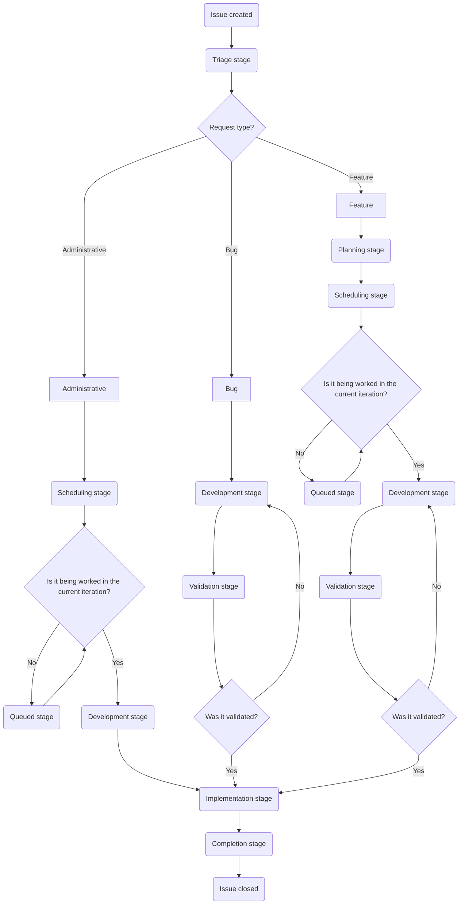

このページでは、カスタマーサポートオペレーションチームでの Issue 作業のワークフローについて説明します。トリアージ、計画、開発、検証、実装といった、Issue が作成から完了までに進む各ステージを取り上げます。

このワークフローを理解することで、チームメンバーは各ステージで何を期待すべきか、誰が責任を持つか、Issue を前進させるためにどのようなアクションが必要かを知ることができます。

{}

インシデントは私たちが作業する Issue の一種ではありますが、独自の特殊なフローで運用されます。詳細については、[インシデントのドキュメント](/handbook/security/customer-support-operations/incidents/) を参照してください。

{}

## Issue フローチャート

Issue の標準的な進行は次のようになります。



## 誰がどのような Issue を作成できるか {#who-can-file-what-issues}

- `Feature` Issue は、リクエストの発信元/関係するチームによって異なります。
  - グローバルサポートチームから来るものについては、[SIG team](https://gitlab.com/support-innovation-group) のメンバーである必要があります
  - 米国政府サポートチームから来るものについては、米国政府サポートのマネージャーが Issue を作成する必要があります。
  - ナレッジベース (任意のインスタンス) に関するものについては、サポートのシニアテクニカルプログラムマネージャーが Issue を作成する必要があります
  - その他のものについては、依頼するチームのマネージャーが作成する必要があります
- `Bug` Issue は誰でも作成できます
- `Administrative` Issue は、カスタマーサポートオペレーションチームのみが作成すべきです
- `Incident` Issue は、カスタマーサポートオペレーションチームのみが作成すべきです

## ステージ

Issue で行う作業は、Issue がどのステージにあるかに大きく依存します。Issue の担当者は、ステージからステージへ移動するにつれて頻繁に変わることに注意してください。

使用するステージのクイックリファレンス:

| ステージ | リクエストタイプ | 主要 DRI | SLA 目標 |
|-------|--------------|-------------|------------|
| トリアージ | すべて | Dylan | 1〜2 日 |
| 計画 | バグ、機能 | Jason | 5 日 |
| スケジューリング | 機能、管理 | Dylan & Jason | 毎週 |
| 開発 | すべて | 状況による | 1〜3 週間 |
| 検証 | バグ、機能 | 状況による | 3〜5 日 |
| 実装 | すべて | 状況による | 3 日 |
| 完了 | すべて | 状況による | クローズまで 2 日 |

### トリアージ {#triage}

{}

- 主要 DRI: Dylan
- 副次 DRI: Alyssa
- SLA 目標: 1〜2 営業日
- このステージを使用するリクエストタイプ:
  - 管理
  - バグ
  - 機能
- 目的
  - リクエストの非技術的な妥当性/実現可能性を判断する
  - 進める前に追加情報が必要かを判断する
  - 必要な承認が揃っているかを確認する
  - 顧客タイプ、影響を受けるシステム、優先度、ロードマップとの整合性のラベルを追加する
- 主要な活動
  - リクエスト元から必要な情報を収集する
  - ロードマップとの整合性と複雑性に基づいて承認を検証する
  - 計画ステージに移動するか、進められない場合はクローズする
  - 元のリクエストに十分な詳細が提供されていない場合はブロック済みステージに移動する

{}

ここで DRI は次のことを行います。

- リクエストから必要な情報を収集する (必要な場合)
- Issue を進められるかを判断する
- Issue が有効か (正しい人物によって提出されたか、実現可能かなど) を判断する

その後、DRI は次のことを行う必要があります。

- Issue に [優先度ラベル](/handbook/security/customer-support-operations/gitlab/labels#priority-labels) があることを確認する
- Issue に [顧客ラベル](/handbook/security/customer-support-operations/gitlab/labels#customer-labels) があることを確認する
- Issue に [ロードマップラベル](/handbook/security/customer-support-operations/gitlab/labels#roadmap-labels) があることを確認する (Issue がロードマップ項目に紐づいている場合)

これらが揃ったら、DRI はリクエストタイプに応じて Issue を次のステージに移動します。

- 管理 Issue の場合は、[スケジューリングステージ](#scheduling) に移動します
- バグまたは機能 Issue の場合は、[計画ステージ](#planning) に移動します

これは [クイックアクション](https://docs.gitlab.com/user/project/quick_actions/) を使用して 1 つのコメントで実行できます。次のように記述します。

```plaintext
/label ~"Customer::Support"
/label ~"Priority::3"
/label ~"RequestType::Feature"
/label ~"roadmap_item"
/label ~"Stage::Planning"
```

また、次の [グループコメントテンプレート](https://gitlab.com/groups/gitlab-com/gl-security/corp/cust-support-ops/-/comment_templates) を使用して、補助となるクイックアクションコメントを生成することもできます。

- [Triage -> Planning](https://gitlab.com/groups/gitlab-com/gl-security/corp/cust-support-ops/-/comment_templates/1000652)
- [Triage -> Scheduling](https://gitlab.com/groups/gitlab-com/gl-security/corp/cust-support-ops/-/comment_templates/1001112)
- [Triage -> Development](https://gitlab.com/groups/gitlab-com/gl-security/corp/cust-support-ops/-/comment_templates/1001111)

#### 不正な人物が作成したリクエストをクローズする

Issue の作成が許可されていない人物によって Issue が作成された場合 ([誰がどのような Issue を作成できるか](#who-can-file-what-issues) を参照)、Issue をクローズする必要があります (リクエスト元には進めるためにどのようなアクションを取るべきかを案内します)。

これを支援するために、状況に応じて正しい [グループコメントテンプレート](https://gitlab.com/groups/gitlab-com/gl-security/corp/cust-support-ops/-/comment_templates) を使用してください。

- [Not approved -> Talk to SIG team](https://gitlab.com/groups/gitlab-com/gl-security/corp/cust-support-ops/-/comment_templates/2001174)
- [Not approved -> Talk to manager](https://gitlab.com/groups/gitlab-com/gl-security/corp/cust-support-ops/-/comment_templates/2001175)
- [Not approved -> Talk to Senior Technical Program Manager](https://gitlab.com/groups/gitlab-com/gl-security/corp/cust-support-ops/-/comment_templates/2001176)

これらを使用すると、Issue 上の関係者に誰と話す必要があるかを案内し、Issue を適切にクローズすることができます。

#### トリアージ Issue をクローズする

DRI が Issue を進められないと判断した場合、DRI は次のアクションを取る必要があります。

- 進めない理由を説明するコメントをする
- Issue の `status` を `Won't do` に設定する
- Issue をクローズする

これは [クイックアクション](https://docs.gitlab.com/user/project/quick_actions/) を使用して 1 つのコメントで実行できます。次のように記述します。

```plaintext
Greetings,

After review of this issue, we have determined we will not be able to proceed on this issue.

This is due to <insert reasons here>.

Due to this, we will be closing this out. Should the above mentioned reasons be resolved, please create a **new** issue.

/status "Won't do" 
```

### 計画 {#planning}

{}

- 主要 DRI: Jason
- 副次 DRI: Sarah
- SLA 目標: 5 営業日
- このステージを使用するリクエストタイプ:
  - バグ
  - 機能
- 目的
  - 技術的な妥当性/実現可能性を判断する
  - 追加情報が必要かを判断する
  - 実装計画を作成する
  - ワークロードの大まかな見積もりを判断する
- 主要な活動
  - 詳細な計画を作成する
  - リクエスト元と協力してブロッカーを解決する
  - Issue のウェイトスコアを判断する
  - 完了したらスケジューリングステージに移動する

{}

ここで DRI は次のことを行います。

- Issue の計画を作成する (Issue にコメントとして投稿)
- リクエストの技術的な実現可能性を判断する
- 必要な作業期間の大まかな見積もりを判断する (検証時間を除く)
- [RICE スコア](#rice-score) を判断する

その後、DRI は次のことを行う必要があります。

- Issue にウェイト値を追加する ([RICE スコア](#rice-score) を使用)
- Issue にイテレーションとマイルストーンを追加する (バグ Issue のみ)

これらが揃ったら、DRI はリクエストタイプに応じて Issue を次のステージに移動します。

- バグ Issue の場合は、[開発ステージ](#development) に移動します
- 機能 Issue の場合は、[スケジューリングステージ](#scheduling) に移動します

また、次の [グループコメントテンプレート](https://gitlab.com/groups/gitlab-com/gl-security/corp/cust-support-ops/-/comment_templates) を使用して、補助となるクイックアクションコメントを生成することもできます。

- [Planning -> Development](https://gitlab.com/groups/gitlab-com/gl-security/corp/cust-support-ops/-/comment_templates/1000755)
- [Planning -> Scheduling](https://gitlab.com/groups/gitlab-com/gl-security/corp/cust-support-ops/-/comment_templates/1000754)

#### RICE スコア {#rice-score}

カスタマーサポートオペレーションは、機能 Issue に対して [RICE フレームワーク](/handbook/product/product-processes/#using-the-rice-framework) を独自に修正したバージョンを使用しています。

私たちが修正したバージョンの可能な値の内訳:

| カテゴリ | 値 | スコア |
|----------|-------|:-----:|
| Reach | 顧客に影響 | 10 |
| | すべてのエージェントに影響 | 7 |
| | エージェントの 1 リージョンに影響 | 4 |
| | エージェントの小グループに影響 | 2 |
| | 最小限または実質的に影響なし | 1 |
| Impact | GitLab の収益に直接影響 | 3 |
| | サポートワークフローに大きな影響 | 2 |
| | サポートワークフローに軽微な影響 | 1 |
| | 最小限または実質的に影響なし | 0.5 |
| Confidence | パーセンテージ | 状況による |
| Effort | 数値 | 状況による |

上記の値からスコアを取り、次の式を使用して RICE スコアを計算します。

(Reach × Impact × Confidence) / Effort

[このカリキュレーター](https://docs.google.com/spreadsheets/d/1SVIRUJ9UmmMSXl0-WZSBP2KueTzGxJfBH4zir61WTFY/edit?gid=0#gid=0) (GitLab Google アカウントアクセスが必要) を使用して、素早く RICE スコアを生成できます。

#### 計画 Issue をクローズする

DRI が Issue を進められないと判断した場合、DRI は次のアクションを取る必要があります。

- 進めない理由を説明するコメントをする
- Issue の `status` を `Won't do` に設定する
- Issue をクローズする

これは [クイックアクション](https://docs.gitlab.com/user/project/quick_actions/) を使用して 1 つのコメントで実行できます。次のように記述します。

```plaintext
Greetings,

After review of this issue, we have determined we will not be able to proceed on this issue.

This is due to <insert reasons here>.

Due to this, we will be closing this out. Should the above mentioned reasons be resolved, please create a **new** issue.

/status "Won't do" 
```

### スケジューリング {#scheduling}

{}

- 主要 DRI: Dylan と Jason
- SLA 目標: 毎週のケイデンスで対応 (1 週間以内)
- このステージを使用するリクエストタイプ:
  - 機能
- 目的
  - 帯域幅の妥当性/実現可能性を判断する
  - イテレーションとマイルストーンを割り当てる
  - 開発 DRI を割り当てる
- 主要な活動
  - 開発スケジュールを議論する (毎週のケイデンス)
  - Issue にイテレーションとマイルストーンを追加する
  - 現在のイテレーションの場合: 開発ステージに移動
  - 将来のイテレーションの場合: キュー済みステージに移動

{}

ここで DRI は変更の開発スケジュールを議論します。これは毎週のケイデンスで行われます。

判断したら、DRI は Issue で次のことを行います。

- Issue にイテレーションを設定する
- Issue にマイルストーンを設定する
- 今後の Issue 担当 DRI を設定する

その後、DRI は作業開始のスケジュールに応じて Issue を次のステージに移動します。

- 作業開始のスケジュールが **現在の** イテレーションである場合、Issue は [開発ステージ](#development) に移動します
- 作業開始のスケジュールが将来のイテレーションである場合、Issue は [キュー済みステージ](#queued) に移動します

また、次の [グループコメントテンプレート](https://gitlab.com/groups/gitlab-com/gl-security/corp/cust-support-ops/-/comment_templates) を使用して、補助となるクイックアクションコメントを生成することもできます。

- [Scheduling -> Development](https://gitlab.com/groups/gitlab-com/gl-security/corp/cust-support-ops/-/comment_templates/1000757)
- [Scheduling -> Queued](https://gitlab.com/groups/gitlab-com/gl-security/corp/cust-support-ops/-/comment_templates/1000756)

### キュー済み {#queued}

{}

- 主要 DRI: Dylan と Jason
- SLA 目標: N/A
- このステージを使用するリクエストタイプ:
  - 機能
- 目的
  - リクエストは準備完了だが、割り当てられたイテレーションの開始を待っていることを示す
- 主要な活動
  - イテレーションスケジュールを監視する
  - イテレーションが開始されたら: 開発 DRI を割り当て、開発ステージに移動

{}

Issue はイテレーションが開始されるまでここに留まります。イテレーションが開始されたら、DRI は Issue を [開発ステージ](#development) に移動する必要があります。

また、次の [グループコメントテンプレート](https://gitlab.com/groups/gitlab-com/gl-security/corp/cust-support-ops/-/comment_templates) を使用して、補助となるクイックアクションコメントを生成することもできます。

- [Queued -> Development](https://gitlab.com/groups/gitlab-com/gl-security/corp/cust-support-ops/-/comment_templates/1000758)

### 開発 {#development}

{}

- 主要 DRI: 状況による
- SLA 目標: 計画スケジュールに基づく (通常 1〜3 週間)
- このステージを使用するリクエストタイプ:
  - 管理
  - バグ
  - 機能
- 目的
  - ステージング/サンドボックスで変更を実装する
  - テストを実施する
  - 検証用の環境を準備する
- 主要な活動
  - 適切な環境で変更を実装する
  - 実装をテストする
  - 検証ステージに移動して検証を取得する
    - 検証が不要な場合は、代わりに実装ステージに移動する

{}

このステージでは、DRI はテストと検証を有効にするために必要なセットアップ (通常はサンドボックスで) を行います。DRI がセットアップに変更を加える際は、行ったことを示すコメントを追加する必要があります。決まったフォーマットはありませんが、一般的な推奨は次のようになります。

```plaintext
## Development notes

- Zendesk Global Sandbox
  - Triggers
    - Modified [Example trigger](LINK_TO_TRIGGER)
  - Ticket forms
    - Renamed form [Example form](LINK_TO_FORM) to `Modified Example form`
  - Webhooks
    - Created [New webhook](LINK_TO_WEBHOOK)

```

必要なセットアップをすべて行ったら、変更内容に基づいてテストスイートを実施する必要があります。テストスイートの正確な内容は Issue ごとに異なります。決まったフォーマットはありませんが、一般的な推奨は次のようになります。

```plaintext
## Test Suite

- Summary
  - Test done: xxx
  - Tests passed: xxx/xxx
  - Tests failed: xxx/xxx

<details>
<summary>Tests</summary>

- Description of test 1 to do
  - Ticket or artifact used: LINK_TO_ITEM
  - Expected results:
    - List
    - Of
    - Expectations
  - Status: :white_check_mark: :x:
- Description of test 2 to do
  - Ticket or artifact used: LINK_TO_ITEM
  - Expected results:
    - List
    - Of
    - Expectations
  - Status: :white_check_mark: :x:

</details>
```

テストが実施されるにつれ、テストの結果と状態を示すようにコメントを更新します。テストが失敗した場合は、気づいたことや変更が必要かどうかをノートまたはコメントに追加します。

{}

テストが失敗した場合、テストスイート全体 (以前に行ったテストを含む) を新たに実施する必要があります。これにより、テストスイートの完了後に変更を行う必要が生じても、すべてが正常に動作することを保証できます。

{}

すべてのテストと開発が完了したら、Issue を次のステージに移動する必要があります。使用する正確なステージは、作業中の Issue タイプによって異なります。

- 管理 Issue の場合は、[実装ステージ](#implementation) に移動します
  - これを手動で行う場合、新しいステージに移動する際に必ずラベル `Validation::Skipped` を追加してください
- バグおよび機能 Issue の場合は、[検証ステージ](#validation) に移動します

また、次の [グループコメントテンプレート](https://gitlab.com/groups/gitlab-com/gl-security/corp/cust-support-ops/-/comment_templates) を使用して、新しいステージへの移動を補助するクイックアクションコメントを生成することもできます。

- [Development -> Validation](https://gitlab.com/groups/gitlab-com/gl-security/corp/cust-support-ops/-/comment_templates/1000759)
- [Development -> Implementation](https://gitlab.com/groups/gitlab-com/gl-security/corp/cust-support-ops/-/comment_templates/1000761)

### 検証 {#validation}

{}

- 主要 DRI: 状況による
- SLA 目標: 状況による (リクエスト元の都合と変更の複雑さに依存、通常 3〜5 営業日)
- このステージを使用するリクエストタイプ:
  - バグ
  - 機能
- 目的
  - リクエスト元の検証を取得する
- 主要な活動
  - リクエスト元から検証を取得する (必要な場合)
  - 検証を受け取ったら実装ステージに移動する

{}

ここで DRI は、Issue のリクエスト元に対し、セットアップした内容が期待に合致するか検証するよう依頼します。

これは、リクエスト元に検証を依頼するコメントを行うことで実施します。リクエスト元が変更を検証するために必要なすべての情報を含めるようにしてください。

[Request validation](https://gitlab.com/groups/gitlab-com/gl-security/corp/cust-support-ops/-/comment_templates/1001113) [グループコメントテンプレート](https://gitlab.com/groups/gitlab-com/gl-security/corp/cust-support-ops/-/comment_templates) を使用して、これを補助するクイックアクションコメントを生成できます。

この時点で、Issue は検証者による検証ステータスを示すコメントを待ちます。あなたのアクションは、検証者から返ってきた内容によって異なります。

- リクエスト元が変更を検証した場合:
  - ラベル `Validation::Received` を追加する
  - Issue を [実装ステージ](#implementation) に移動する
- リクエスト元が変更を却下した場合:
  - ラベル `Validation::Rejected` を追加する
  - Issue を [開発ステージ](#development) に移動する

また、次の [グループコメントテンプレート](https://gitlab.com/groups/gitlab-com/gl-security/corp/cust-support-ops/-/comment_templates) を使用して、新しいステージへの移動を補助するクイックアクションコメントを生成することもできます。

- [Validation received](https://gitlab.com/groups/gitlab-com/gl-security/corp/cust-support-ops/-/comment_templates/1001114)
- [Validation rejected](https://gitlab.com/groups/gitlab-com/gl-security/corp/cust-support-ops/-/comment_templates/1001115)

### 実装 {#implementation}

{}

- 主要 DRI: 状況による
- SLA 目標: 状況による (実装する変更に依存、通常 3〜5 営業日)
- このステージを使用するリクエストタイプ:
  - 管理
  - バグ
  - 機能
- 目的
  - 技術設計図を作成する
  - 本番環境に変更を実装する/変更をマージする
  - デプロイメント日を確認する
- 主要な活動
  - MR リンクと変更詳細を含む包括的な技術設計図を作成する
  - MR またはその他の適切な方法で実装する
  - すべてのタスクが完了したら (デプロイメント項目については MR がマージされたら)、完了ステージに移動

{}

ここでは、技術設計図を作成し、(MR をマージするか、システムで直接変更を行うことで) 変更を実装します。

技術設計図には、変更されたすべての内容を詳細に記述するべきです。設計図を見れば、誰でもあなたが行ったことを完全に再現できるようにしておきます。これは、作成したすべての MR へのリンク、MR 以外で行った変更の詳細などを意味します。

すべての実装タスクが完了したら (デプロイメントを使用する項目については MR をマージすれば十分)、Issue を [完了ステージ](#completed) に変更します。

### 完了 {#completed}

{}

- 主要 DRI: 状況による
- SLA 目標: Issue クローズまで 2 営業日
- このステージを使用するリクエストタイプ:
  - 管理
  - バグ
  - 機能
- 目的
  - すべての作業が完了したことを示す
- 主要な活動
  - すべての本番環境変更が完了またはデプロイ待ちとなっていることを確認する
  - Issue をクローズする

{}

DRI は、すべての作業が完了したことを示すコメント (デプロイメントサイクルの一部であれば、いつ稼働するかの日付も) を追加し、Issue をクローズします。

Issue をクローズするときは、Issue の `status` を `Complete` に必ず設定してください。

これは [クイックアクション](https://docs.gitlab.com/user/project/quick_actions/) を使用して 1 つのコメントで実行できます。次のように記述します。

```plaintext
The work on this issue has been completed at this time.

As components of the changes are tied to scheduled deployments, it will be fully live 2026-02-01.

/label ~"Stage::Completed"
/status "Complete" 
```

また、次の [グループコメントテンプレート](https://gitlab.com/groups/gitlab-com/gl-security/corp/cust-support-ops/-/comment_templates) を使用して、補助となるクイックアクションコメントを生成することもできます。

- [Close out a completed issue](https://gitlab.com/groups/gitlab-com/gl-security/corp/cust-support-ops/-/comment_templates/1001116)

### ブロック済み {#blocked}

{}

- 主要 DRI: Dylan と Jason
- SLA 目標: N/A
- 目的
  - Issue がブロックされていることを示す
  - ブロックの理由と前のステージを記録する
  - ブロック状況を監視する
- 主要な活動
  - ブロック条件を毎週監視する
  - ブロック解除されたら: 前のステージに戻す

{}

これは、何かが Issue 上のすべての動きをブロックした場合に使用される特殊なステージです。これは、不足している承認、ツールの調達待ちなどに関連する可能性があります。

DRI は (計画ケイデンス中に) これらの Issue を毎週レビューして、更新が必要か、「ブロック解除」できるかを判断します。

- すべてのブロック解除基準が満たされている場合、DRI は Issue を元々あったステージに戻します。
- 前回の更新から 1 週間が経過し、Issue がまだブロック解除できない場合、DRI はエスカレーションプロトコルに従います。
  - ブロック解除されないまま 1 週間: ブロックしている当事者に更新を依頼する
  - ブロック解除されないまま 2 週間: 前回依頼した人物のリーダーシップに更新を依頼する
  - ブロック解除されないまま 3 週間: 前回依頼した人物のリーダーシップに更新を依頼する
  - ブロック解除されないまま 4 週間:
    - 4 週間更新なしでブロックされたままであることを示すコメントを追加する
    - Issue をクローズする

エスカレーションプロトコルの例:

- 例 1: リクエスト元がサポートエンジニアの場合
  - 更新なしの 1 週目、リクエスト元に依頼します
  - 更新なしの 2 週目、サポートマネージャーに依頼します
  - 更新なしの 3 週目、サポートディレクターに依頼します
  - 更新なしの 4 週目、Issue はクローズされます
- 例 2: リクエスト元がサポートマネージャーの場合
  - 更新なしの 1 週目、リクエスト元に依頼します
  - 更新なしの 2 週目、サポートディレクターに依頼します
  - 更新なしの 3 週目、サポートの VP に依頼します
  - 更新なしの 4 週目、Issue はクローズされます
- 例 3: リクエスト元がサポートディレクターの場合
  - 更新なしの 1 週目、リクエスト元に依頼します
  - 更新なしの 2 週目、サポートの VP に依頼します
  - 更新なしの 3 週目、CTO に依頼します
  - 更新なしの 4 週目、Issue はクローズされます

**注:** これらのエスカレーションパスは、標準的な組織階層を前提としています。特定のブロック当事者のレポートライン構造に基づいて必要に応じて調整してください。

#### Issue をブロック済みステージに移動する

Issue をブロック済みステージに移動するには、次のことを行います。

- Issue がブロック済みに移動されることを示す
- Issue が現在いるステージを記録する (戻せるように)
- Issue のブロックを解除するために必要な基準を記録する
- 基準が満たされたときに取るべきアクションを示す

また、次の [グループコメントテンプレート](https://gitlab.com/groups/gitlab-com/gl-security/corp/cust-support-ops/-/comment_templates) を使用して、補助となるクイックアクションコメントを生成することもできます。

- [Move issue to blocked stage](https://gitlab.com/groups/gitlab-com/gl-security/corp/cust-support-ops/-/comment_templates/1001117)

### バックログ {#backlogged}

{}

- 主要 DRI: Dylan と Jason
- SLA 目標: N/A
- 目的
  - Issue が未定の日付に延期されていることを示す
  - 通常、優先度の低い CustSuppOps 中心のタスクのために予約される
- 主要な活動
  - 再開準備が整ったら: 最も適切なステージに戻す

{}

これは、Issue がバックログ化された場合に使用される特殊なステージです。これは通常、作業する意図はあるが、遠い将来 (次の 10 イテレーションを超えて) または不明な将来の日付に対応されることを意味します。

DRI は (計画ケイデンス中に) これらの Issue を毎週レビューして、スケジュールできるかを判断します。

- スケジュールできる場合は、[スケジューリングステージ](#scheduling) に移動されます
- スケジュールできない場合は、バックログステージに留まります

## トラブルシューティング

### Issue が Issue ボードに表示されない

これは Issue 自体にボード用の必要なラベル (ステージラベル、顧客ラベルなど) が欠けていることを示しています。

ラベル `Stage::Triage` を追加し、Issue が適切にトリアージされるよう Dylan に割り当ててください。

### 必要な情報が欠けている

ワークフローの途中で必要な情報が欠けていることに気付いた場合:

1. 情報を依頼するコメントを追加する
2. 遅延が 1 週間を超える場合はブロック済みステージへの移動を検討する
3. リクエスト元と関係する利害関係者にタグを付ける
