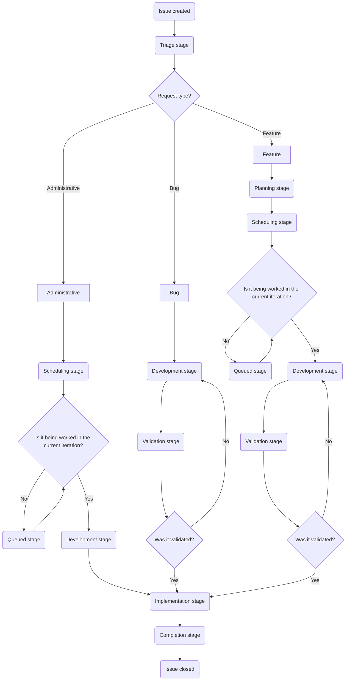

このページでは、カスタマーサポートオペレーションチームでの Issue 作業のワークフローについて説明します。トリアージ、計画、開発、検証、実装といった、Issue が作成から完了までに進む各ステージを取り上げます。

このワークフローを理解することで、チームメンバーは各ステージで何を期待すべきか、誰が責任を持つか、Issue を前進させるためにどのようなアクションが必要かを知ることができます。

{}

インシデントも私たちが対応する Issue の一種ですが、独自の特別なフローで運用されます。詳細は[インシデントのドキュメント](/handbook/security/customer-support-operations/incidents/)を参照してください。

{}

## Issue のフローチャート

Issue の標準的な進行は次のようになります。



## 誰がどの Issue を起票できるか

- `Feature` Issue は、リクエスト元／対象となるチームによって異なります。
  - グローバルサポートチームからのものは、[SIG チーム](https://gitlab.com/support-innovation-group)のメンバーが起票する必要があります
  - US Government Support チームからのものは、US Government Support のマネージャーが Issue を起票する必要があります。
  - （いずれのインスタンスでも）ナレッジベースに関するものは、Support Senior Technical Program Manager が Issue を起票する必要があります
  - それ以外のものは、リクエストを行うチームのマネージャーが起票する必要があります
- `Bug` Issue は誰でも起票できます
- `Administrative` Issue は、カスタマーサポートオペレーションチームのみが起票すべきです
- `Incident` Issue は、カスタマーサポートオペレーションチームのみが起票すべきです

## ステージ

Issue に対して行うべき作業は、その Issue が置かれているステージに大きく依存します。Issue がステージからステージへと移動するにつれて、担当者が頻繁に変わることに注意してください。

使用されるステージのクイックリファレンスは次のとおりです。

| Stage | Request Type | Primary DRI | SLA Target |
|-------|--------------|-------------|------------|
| Triage | All | Dylan | 1-2 days |
| Planning | Bug, Feature | Jason | 5 days |
| Scheduling | Feature, Administrative | Dylan & Jason | Weekly |
| Development | All | Varies | 1-3 weeks |
| Validation | Bug, Feature | Varies | 3-5 days |
| Implementation | All | Varies | 3 days |
| Completed | All | Varies | 2 days to close |

### Triage

{}

- Primary DRI: Dylan
- Secondary DRI: Alyssa
- SLA target: 1-2 business days
- Request types that use this stage:
  - Administrative
  - Bugs
  - Features
- Purpose
  - Determine non-technical validity/feasibility of request
  - Determine if more information is needed before proceeding
  - Verify required approvals are present
  - Add labels for customer type, system impacted, priority, and roadmap alignment
- Key activities
  - Gather necessary information from requester
  - Validate approvals based on roadmap alignment and complexity
  - Move to Planning stage or close if unable to proceed
  - Move to Blocked stage if insufficient detail has been provided in original request

{}

ここで DRI は次のことを行います。

- リクエストから必要な情報を収集する（必要な場合）
- Issue を前進させられるかどうかを判断する
- Issue が有効かどうか（正しい人物によって提出されたか、実現可能か、など）を判断する

それを行った後、DRI は次のことを行う必要があります。

- Issue に[優先度ラベル](/handbook/security/customer-support-operations/gitlab/labels#priority-labels)が付いていることを確認する
- Issue に[顧客ラベル](/handbook/security/customer-support-operations/gitlab/labels#customer-labels)が付いていることを確認する
- Issue に[ロードマップラベル](/handbook/security/customer-support-operations/gitlab/labels#roadmap-labels)が付いていることを確認する（Issue がロードマップ項目に紐付いている場合）

それが整ったら、DRI はリクエストの種類に応じて Issue を次のステージへ移動します。

- Administrative Issue の場合は、[Scheduling ステージ](#scheduling)へ移動します
- Bug または Feature Issue の場合は、[Planning ステージ](#planning)へ移動します

これは、次のように[クイックアクション](https://docs.gitlab.com/user/project/quick_actions/)を使って 1 つのコメントで行うことができます。

```plaintext
/label ~"Customer::Support"
/label ~"Priority::3"
/label ~"RequestType::Feature"
/label ~"roadmap_item"
/label ~"Stage::Planning"
```

作業を補助するクイックアクションコメントを生成するために、次の[グループコメントテンプレート](https://gitlab.com/groups/gitlab-com/gl-security/corp/cust-support-ops/-/comment_templates)を使うこともできます。

- [Triage -> Planning](https://gitlab.com/groups/gitlab-com/gl-security/corp/cust-support-ops/-/comment_templates/1000652)
- [Triage -> Scheduling](https://gitlab.com/groups/gitlab-com/gl-security/corp/cust-support-ops/-/comment_templates/1001112)
- [Triage -> Development](https://gitlab.com/groups/gitlab-com/gl-security/corp/cust-support-ops/-/comment_templates/1001111)

#### 不適切な人物が起票したリクエストのクローズ

Issue を起票することが許可されていない人物によって Issue が起票された場合（[誰がどの Issue を起票できるか](#who-can-file-what-issues)を参照）、その Issue はクローズする必要があります（また、前進するためにどのようなアクションを取るべきかをリクエスト者に案内します）。

これを補助するために、当該の状況に合わせて正しい[グループコメントテンプレート](https://gitlab.com/groups/gitlab-com/gl-security/corp/cust-support-ops/-/comment_templates)を使ってください。

- [Not approved -> Talk to SIG team](https://gitlab.com/groups/gitlab-com/gl-security/corp/cust-support-ops/-/comment_templates/2001174)
- [Not approved -> Talk to manager](https://gitlab.com/groups/gitlab-com/gl-security/corp/cust-support-ops/-/comment_templates/2001175)
- [Not approved -> Talk to Senior Technical Program Manager](https://gitlab.com/groups/gitlab-com/gl-security/corp/cust-support-ops/-/comment_templates/2001176)

これらを使うことで、Issue に関わる人々に誰と話す必要があるかを案内し、同時に Issue を適切にクローズできます。

#### Triage Issue のクローズ

DRI が Issue を前進させられないと判断した場合、DRI は次のアクションを取るべきです。

- なぜ前進しないのかを述べるコメントを投稿する
- Issue の `status` を `Won't do` に設定する
- Issue をクローズする

これは、次のように[クイックアクション](https://docs.gitlab.com/user/project/quick_actions/)を使って 1 つのコメントで行うことができます。

```plaintext
Greetings,

After review of this issue, we have determined we will not be able to proceed on this issue.

This is due to <insert reasons here>.

Due to this, we will be closing this out. Should the above mentioned reasons be resolved, please create a **new** issue.

/status "Won't do" 
```

### Planning

{}

- Primary DRI: Jason
- Secondary DRI: Sarah
- SLA target: 5 business days
- Request types that use this stage:
  - Bugs
  - Features
- Purpose
  - Determine technical validity/feasibility
  - Determine if more information is needed
  - Generate implementation gameplan
  - Determine rough estimate of workload
- Key activities
  - Write detailed gameplan
  - Work with requester to resolve blockers
  - Determine issue weight score
  - Move to Scheduling stage when complete

{}

ここで DRI は次のことを行います。

- Issue のゲームプランを作成する（そして Issue にコメントとして投稿する）
- リクエストの技術的な実現可能性を判断する
- （検証時間を除く）必要な作業期間のおおまかな見積もりを判断する
- [RICE スコア](#rice-score)を判断する

それを行った後、DRI は次のことを行う必要があります。

- Issue にウェイト値を追加する（[RICE スコア](#rice-score)を使う）
- Issue にイテレーションとマイルストーンを追加する（Bug Issue のみ）

それが整ったら、DRI はリクエストの種類に応じて Issue を次のステージへ移動します。

- Bug Issue の場合は、[Development ステージ](#development)へ移動します
- Feature Issue の場合は、[Scheduling ステージ](#scheduling)へ移動します

作業を補助するクイックアクションコメントを生成するために、次の[グループコメントテンプレート](https://gitlab.com/groups/gitlab-com/gl-security/corp/cust-support-ops/-/comment_templates)を使うこともできます。

- [Planning -> Development](https://gitlab.com/groups/gitlab-com/gl-security/corp/cust-support-ops/-/comment_templates/1000755)
- [Planning -> Scheduling](https://gitlab.com/groups/gitlab-com/gl-security/corp/cust-support-ops/-/comment_templates/1000754)

#### RICE スコア

カスタマーサポートオペレーションでは、Feature Issue に対して [RICE フレームワーク](/handbook/product/product-processes/#using-the-rice-framework)を改変したバージョンを使用しています。

私たちの改変バージョンで取りうる値の内訳は次のとおりです。

| Category | Value | Score |
|----------|-------|:-----:|
| Reach | Impacts customers | 10 |
| | Impacts all agents | 7 |
| | Impacts one region of agents | 4 |
| | Impacts a small group of agents | 2 |
| | Minimal or no real impact | 1 |
| Impact | Directly impacts GitLab's revenue | 3 |
| | Significant impact to support workflows | 2 |
| | Slight impact to support workflows | 1 |
| | Minimal or no real impact | 0.5 |
| Confidence | Percentage | Varies |
| Effort | Numeric | Varies |

上記の値からスコアを取得し、次の式を使って RICE スコアを計算します。

(Reach × Impact × Confidence) / Effort

[この計算機](https://docs.google.com/spreadsheets/d/1SVIRUJ9UmmMSXl0-WZSBP2KueTzGxJfBH4zir61WTFY/edit?gid=0#gid=0)（GitLab の Google アカウントアクセスが必要）を使うと、RICE スコアを素早く生成できます。

#### Planning Issue のクローズ

DRI が Issue を前進させられないと判断した場合、DRI は次のアクションを取るべきです。

- なぜ前進しないのかを述べるコメントを投稿する
- Issue の `status` を `Won't do` に設定する
- Issue をクローズする

これは、次のように[クイックアクション](https://docs.gitlab.com/user/project/quick_actions/)を使って 1 つのコメントで行うことができます。

```plaintext
Greetings,

After review of this issue, we have determined we will not be able to proceed on this issue.

This is due to <insert reasons here>.

Due to this, we will be closing this out. Should the above mentioned reasons be resolved, please create a **new** issue.

/status "Won't do" 
```

### Scheduling

{}

- Primary DRI: Dylan and Jason
- SLA target: Addressed on weekly cadence (within a week)
- Request types that use this stage:
  - Features
- Purpose
  - Determine bandwidth validity/feasibility
  - Assign iteration(s) and milestone(s)
  - Assign Development DRI
- Key activities
  - Discuss development timelines (weekly cadence)
  - Add iteration and milestone to issue
  - If current iteration: Move to Development stage
  - If future iteration: Move to Queued stage

{}

ここで DRI は、変更に向けた開発のタイムラインについて議論します。これは週次のペースで行われます。

決定したら、DRI は Issue に対して次のことを行います。

- Issue にイテレーションを設定する
- Issue にマイルストーンを設定する
- 今後の Issue の DRI を設定する

それを行った後、DRI は作業開始のタイムラインに応じて Issue を次のステージへ移動します。

- 作業開始のタイムラインが**現在の**イテレーションである場合、Issue は [Development ステージ](#development)へ移動します
- 作業開始のタイムラインが将来のイテレーションである場合、Issue は [Queued ステージ](#queued)へ移動します

作業を補助するクイックアクションコメントを生成するために、次の[グループコメントテンプレート](https://gitlab.com/groups/gitlab-com/gl-security/corp/cust-support-ops/-/comment_templates)を使うこともできます。

- [Scheduling -> Development](https://gitlab.com/groups/gitlab-com/gl-security/corp/cust-support-ops/-/comment_templates/1000757)
- [Scheduling -> Queued](https://gitlab.com/groups/gitlab-com/gl-security/corp/cust-support-ops/-/comment_templates/1000756)

### Queued

{}

- Primary DRI: Dylan and Jason
- SLA target: N/A
- Request types that use this stage:
  - Features
- Purpose
  - Indicate request is ready but waiting for assigned iteration to begin
- Key activities
  - Monitor iteration schedules
  - When iteration begins: Assign Development DRI and move to Development stage

{}

Issue は、そのイテレーションが開始するまでここに留まります。イテレーションが開始したら、DRI は Issue を [Development ステージ](#development)へ移動すべきです。

作業を補助するクイックアクションコメントを生成するために、次の[グループコメントテンプレート](https://gitlab.com/groups/gitlab-com/gl-security/corp/cust-support-ops/-/comment_templates)を使うこともできます。

- [Queued -> Development](https://gitlab.com/groups/gitlab-com/gl-security/corp/cust-support-ops/-/comment_templates/1000758)

### Development

{}

- Primary DRI: Varies
- SLA target: Based on gameplan timeline (typically 1-3 weeks)
- Request types that use this stage:
  - Administrative
  - Bugs
  - Features
- Purpose
  - Implement changes in staging/sandbox
  - Perform testing
  - Prepare environments for validation
- Key activities
  - Implement changes in appropriate environment
  - Test implementation
  - Move to Validation stage to get validation
    - Moves to Implementation stage instead if validation is not required

{}

このステージでは、DRI はテストと検証を可能にするために必要なセットアップを（通常はサンドボックスで）実施します。DRI はセットアップのための変更を加える際、何を行ったかを示すコメントを追加すべきです。使用しなければならない決まった形式はありませんが、一般的な推奨は次のようなものです。

```plaintext
## Development notes

- Zendesk Global Sandbox
  - Triggers
    - Modified [Example trigger](LINK_TO_TRIGGER)
  - Ticket forms
    - Renamed form [Example form](LINK_TO_FORM) to `Modified Example form`
  - Webhooks
    - Created [New webhook](LINK_TO_WEBHOOK)

```

必要なセットアップをすべて完了したら、実施する必要のあるテストスイートを含むタスク項目を Issue 上に生成する必要があります。実施する必要のあるテストごとに、子タスク項目を作成すべきです。

各子タスク項目について。

- 件名／タイトルは、テスト対象のものの名前にすべきです（一例として、SLA ポリシー `Priority Support - FRT` をテストする場合、件名／タイトルは `Priority Support - FRT` にすべきです）
- 本文／説明には、次の 3 つのセクションを含めるべきです。
  - `Prerequisites`: テスト実施のための前提条件
  - `Steps`: テストを行う正確な手順
  - `Expected Result`: テストの期待される結果の詳細

<details>
<summary>「Support Readiness SLA」を使ったテスト項目の例</summary>

```plaintext

## Prerequisites

- A test ticket must exist that is open
- A test ticket must use the `Support Ops` form

## Steps

1. Login to [Zendesk Global's Sandbox](https://gitlab1707170878.zendesk.com/) using the end-user `will@example.com` (login details can be found [here](https://docs.google.com/spreadsheets/d/1g6lJ3AUS4EYqoBYzAdExp4v1dkzOb3GWKaMIoZikjts/edit?usp=sharing))
2. Create a new ticket using the [Support Ops form](https://gitlab1707170878.zendesk.com/hc/en-us/requests/new?ticket_form_id=12510630404508) with the following information
   - Subject: `Test from issue xxx`
   - Description: `Testing`
   - What type of product are you using: `GitLab.com`
   - Email associated with your subscription: `will@example.com`
   - Subscription number: `A-S123456789`
3. Note the ticket ID to help locate it later
4. Logout of [Zendesk Global's Sandbox](https://gitlab1707170878.zendesk.com/)
5. Login to [Zendesk Global's Sandbox](https://gitlab1707170878.zendesk.com/) as an agent account. If you do not have your own agent account, you can use `agent@example.com` (login details can be found [here](https://docs.google.com/spreadsheets/d/1g6lJ3AUS4EYqoBYzAdExp4v1dkzOb3GWKaMIoZikjts/edit?usp=sharing))
6. Locate the previously created ticket in Zendesk
7. Check the events of the ticket to confirm the SLA policy is set to `Support Readiness SLA`

## Expected Result

The ticket is using the SLA policy `Support Readiness SLA`
```

</details>

テストスイート用のすべての子タスク項目を生成したら、親 Issue にそれを要約するコメントを追加します。次のような内容です。

```plaintext
## QA Test Plan

The following child test issues were created for this MR:

- LINK_TO_CHILD_TASK_ITEM
- LINK_TO_CHILD_TASK_ITEM
- LINK_TO_CHILD_TASK_ITEM
- LINK_TO_CHILD_TASK_ITEM
- LINK_TO_CHILD_TASK_ITEM
```

{}

私たちは `CustSuppOps Zendesk Test Suite Generator` という GitLab Duo エージェントを開発しました。このエージェントは、あなたが作業しているマージリクエスト（および紐付けられた Issue）を使って、テストスイートを生成します。

使うには。

1. マージリクエストを作成する（説明に親 Issue へのリンクを含めることを確認する）
1. ページ右上（プロフィールアイコンの下）の `Add new chat` をクリックする
1. `CustSuppOps Zendesk Test Suite Generator` エージェントを見つけてクリックする
1. チャットでエージェントにテストスイートの生成を依頼する

エージェントが実行されると、次のことを行います。

- 何を行い、何をチェックしているか（および使用しているロジック）を述べる
- 子タスク項目の内容について承認を求める
- 親 Issue への要約コメントの追加について承認を求める
- 実施したすべてのアクションを要約する

作業しているプロジェクトで `CustSuppOps Zendesk Test Suite Generator` を実行できるかどうかを判断するには、当該の項目に対応するハンドブックページを参照してください。

{}

完全なテストスイートを生成した後、テストを実施する必要があります（または、テスト実施について SIG チームに支援を求めます）。

テストが実施されるにつれて、テストの結果と状態で子タスク項目を更新します。テストが失敗した場合は、気づいたことや変更が必要かどうかについてメモやコメントを追加します。テストが完了したら（成功でも失敗でも）、子タスク項目をクローズすべきです。他の人がすぐに読み取れるよう、子タスク項目の件名／タイトルを `:white_check_mark:` または `:x:` で編集して最終ステータスを示すと役立ちます。

{}

テストが失敗した場合、マージリクエストに修正がプッシュされた後に、（以前に実施したテストも含めて）まったく新しいテストスイートを実施する必要があります。これにより、テストスイートの完了後に変更を加える必要が生じた場合でも、すべてが正常に動作することが保証されます。

{}

すべてのテストと開発が完了したら、Issue を次のステージへ移動する必要があります。使用する正確なステージは、対応している Issue の種類によって異なります。

- Administrative Issue の場合は、[Implementation ステージ](#implementation)へ移動します
  - これを手動で行う場合は、新しいステージへ移動する際にラベル `Validation::Skipped` を必ず追加してください
- Bug および Feature Issue の場合は、[Validation ステージ](#validation)へ移動します

新しいステージへの移動を補助するクイックアクションコメントを生成するために、次の[グループコメントテンプレート](https://gitlab.com/groups/gitlab-com/gl-security/corp/cust-support-ops/-/comment_templates)を使うこともできます。

- [Development -> Validation](https://gitlab.com/groups/gitlab-com/gl-security/corp/cust-support-ops/-/comment_templates/1000759)
- [Development -> Implementation](https://gitlab.com/groups/gitlab-com/gl-security/corp/cust-support-ops/-/comment_templates/1000761)

### Validation

{}

- Primary DRI: Varies
- SLA target: Varies (dependent on requester availability and change complexity, typically 3-5 business days)
- Request types that use this stage:
  - Bugs
  - Features
- Purpose
  - Obtain requester validation
- Key activities
  - Get validation from requester (if required)
  - Move to Implementation stage once validation is received

{}

ここで DRI は、Issue のリクエスト者に対して、セットアップされたものが期待と合致しているかを検証するよう依頼します。

これは、リクエストに検証を求めるコメントを投稿することで行うべきです。リクエスト者が変更を検証するために必要となりうるすべての情報を必ず含めてください。

[Request validation](https://gitlab.com/groups/gitlab-com/gl-security/corp/cust-support-ops/-/comment_templates/1001113) の[グループコメントテンプレート](https://gitlab.com/groups/gitlab-com/gl-security/corp/cust-support-ops/-/comment_templates)を使うと、これを補助するクイックアクションコメントを生成できます。

この時点で、Issue は検証者からの検証ステータスを示すコメントを待ちます。あなたのアクションは、彼らが返してきた内容によって異なります。

- リクエスト者が変更を検証した場合。
  - ラベル `Validation::Received` を追加する
  - Issue を [Implementation ステージ](#implementation)へ移動する
- リクエスト者が変更を却下した場合。
  - ラベル `Validation::Rejected` を追加する
  - Issue を [Development ステージ](#development)へ移動する

新しいステージへの移動を補助するクイックアクションコメントを生成するために、次の[グループコメントテンプレート](https://gitlab.com/groups/gitlab-com/gl-security/corp/cust-support-ops/-/comment_templates)を使うこともできます。

- [Validation received](https://gitlab.com/groups/gitlab-com/gl-security/corp/cust-support-ops/-/comment_templates/1001114)
- [Validation rejected](https://gitlab.com/groups/gitlab-com/gl-security/corp/cust-support-ops/-/comment_templates/1001115)

### Implementation

{}

- Primary DRI: Varies
- SLA target: Varies (dependent on changes being implemented, typically 3-5 business days)
- Request types that use this stage:
  - Administrative
  - Bugs
  - Features
- Purpose
  - Generate technical blueprint
  - Implement changes in production/merge changes
  - Confirm deployment dates
- Key activities
  - Create comprehensive technical blueprint with MR links and change details
  - Implement via MRs or other appropriate methods
  - Once all tasks completed (MR merged for deployment items), move to Completed stage

{}

ここでは、技術的なブループリントを生成し、変更を実装します（MR をマージするか、システム内で直接変更を加えるかのいずれか）。

技術的なブループリントは、変更されたすべてを詳細に説明すべきです。ブループリントを見た人が、あなたの行ったことを完全に再現できるようにします。これは、作成したすべての MR へのリンクを張ること、MR 以外で行った変更を詳述すること、などを意味します。

すべての実装タスクが完了したら（デプロイを使用する項目については、MR のマージで十分です）、Issue を [Completed ステージ](#completed)へ変更します。

### Completed

{}

- Primary DRI: Varies
- SLA target: 2 business days to close issue
- Request types that use this stage:
  - Administrative
  - Bugs
  - Features
- Purpose
  - Indicate all work is finished
- Key activities
  - Verify all production changes are complete or queued for deployment
  - Close the issue

{}

DRI は、すべての作業が完了したことを示すコメント（およびデプロイサイクルの一部である場合はどの日付で稼働するか）を追加し、その後 Issue をクローズします。

Issue をクローズする際は、Issue の `status` を `Complete` に必ず設定してください。

これは、次のように[クイックアクション](https://docs.gitlab.com/user/project/quick_actions/)を使って 1 つのコメントで行うことができます。

```plaintext
The work on this issue has been completed at this time.

As components of the changes are tied to scheduled deployments, it will be fully live 2026-02-01.

/label ~"Stage::Completed"
/status "Complete" 
```

作業を補助するクイックアクションコメントを生成するために、次の[グループコメントテンプレート](https://gitlab.com/groups/gitlab-com/gl-security/corp/cust-support-ops/-/comment_templates)を使うこともできます。

- [Close out a completed issue](https://gitlab.com/groups/gitlab-com/gl-security/corp/cust-support-ops/-/comment_templates/1001116)

### Blocked

{}

- Primary DRI: Dylan and Jason
- SLA target: N/A
- Purpose
  - Indicate issue is blocked
  - Document blocking reason and previous stage
  - Monitor block status
- Key activities
  - Monitor blocking condition weekly
  - When unblocked: Return to previous stage

{}

これは、何かが Issue のすべての移動をブロックした場合に使用される特別なステージです。これは、承認の不足、ツールの調達待ち、などに関連する可能性があります。

DRI は、これらの Issue を週次で（計画ペースの際に）レビューし、更新が必要か、または「ブロック解除」できるかを判断します。

- すべてのブロック解除基準が満たされた場合、DRI は Issue を元々あったステージへ戻します。
- 最後の更新から 1 週間が経過し、Issue がまだブロック解除できない場合、DRI はエスカレーションプロトコルに従います。
  - ブロック解除されないまま 1 週間: 更新を求めてブロックしている当事者に ping する
  - ブロック解除されないまま 2 週間: 直前に ping した人物のリーダーシップに更新を求めて ping する
  - ブロック解除されないまま 3 週間: 直前に ping した人物のリーダーシップに更新を求めて ping する
  - ブロック解除されないまま 4 週間:
    - 更新なしで 4 週間ブロックされていることを述べるコメントを追加する
    - Issue をクローズする

エスカレーションプロトコルの例。

- 例 1: リクエスト者が Support Engineer の場合
  - 更新なしの 1 週目、リクエスト者に ping します
  - 更新なしの 2 週目、Support Manager に ping します
  - 更新なしの 3 週目、Support Director に ping します
  - 更新なしの 4 週目、Issue はクローズされます
- 例 2: リクエスト者が Support Manager の場合
  - 更新なしの 1 週目、リクエスト者に ping します
  - 更新なしの 2 週目、Support Director に ping します
  - 更新なしの 3 週目、VP of Support に ping します
  - 更新なしの 4 週目、Issue はクローズされます
- 例 3: リクエスト者が Support Director の場合
  - 更新なしの 1 週目、リクエスト者に ping します
  - 更新なしの 2 週目、VP of Support に ping します
  - 更新なしの 3 週目、CTO に ping します
  - 更新なしの 4 週目、Issue はクローズされます

**Note:** これらのエスカレーションパスは、標準的な組織階層を前提としています。特定のブロックしている当事者のレポートライン構造に応じて、必要に応じて調整してください。

#### Issue を Blocked ステージへ移動する

Issue を Blocked ステージへ移動するには、次のことを行います。

- Issue がブロックへ移動されることを示す
- Issue が現在あるステージをメモする（戻せるように）
- Issue をブロック解除するために必要な基準をメモする
- 基準が満たされたときに取るべきアクションを示す

作業を補助するクイックアクションコメントを生成するために、次の[グループコメントテンプレート](https://gitlab.com/groups/gitlab-com/gl-security/corp/cust-support-ops/-/comment_templates)を使うこともできます。

- [Move issue to blocked stage](https://gitlab.com/groups/gitlab-com/gl-security/corp/cust-support-ops/-/comment_templates/1001117)

### Backlogged

{}

- Primary DRI: Dylan and Jason
- SLA target: N/A
- Purpose
  - Indicate issue is deferred to an unknown date
  - Generally reserved for lower priority, CustSuppOps oriented tasks
- Key activities
  - When ready to resume: Return to most appropriate stage

{}

これは、Issue がバックログ入りした場合に使用される特別なステージです。これは通常、対応したい意向はあるものの、はるか先の将来（次の 10 イテレーションを超える）または未定の将来の日付に対応するものであることを意味します。

DRI は、これらの Issue を週次で（計画ペースの際に）レビューし、スケジュールできるかどうかを判断します。

- スケジュールできる場合は、[Scheduling ステージ](#scheduling)へ移動します
- スケジュールできない場合は、Backlogged ステージに留まります

## トラブルシューティング

### Issue が Issue ボードに表示されない

これは、Issue 自体にボードに必要なラベル（ステージラベル、顧客ラベルなど）が欠けていることを示します。

ラベル `Stage::Triage` を追加し、Issue を適切にトリアージできるよう Dylan に割り当ててください。

### 必要な情報の欠落

ワークフローの途中で必要な情報が欠けていることに気づいた場合。

1. 情報を求めるコメントを追加する
2. 遅延が 1 週間を超える場合は、Blocked ステージへの移動を検討する
3. リクエスト者と関連するステークホルダーにタグを付ける
