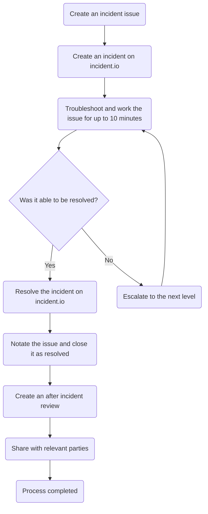
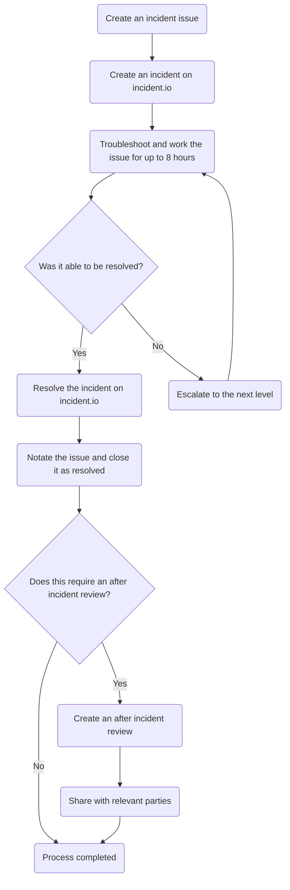

このガイドでは、Customer Support Operations がインシデント (10 分以内に解決できず、構造化された対応手順を要する問題) をどのように扱うかを説明します。

このドキュメントは、私たちのインシデント対応フレームワークを取り上げます。これには、インシデントの重大度の判定方法、エスカレーションのタイミングと方法、目標解決時間、ポストインシデントレビューの要件などが含まれます。プロセスは重大度に応じて 6〜8 ステージから構成されており、検出から解決までインシデントが一貫して管理されることを確保します。

## インシデントについて

### インシデントとは

Customer Support Operations チームの目的において、インシデントとは、迅速 (10 分以内) に解決できないイベント、問題、エラーのことです。これはバグ、システム変更、ユーザーレポートなどに起因する場合があります。

## エスカレーションレベル {#escalation-levels}

状況によっては、インシデントを十分迅速に解決できず、エスカレーションが必要になります。現在のエスカレーションレベルは以下のとおりです。

| レベル | アクション |
|:-----:|--------|
| 1 | チームチャンネルに支援を求めて投稿する |
| 2 | Customer Support Operations Specialist のオンコール担当をページングする |
| 3 | Fullstack Engineer, Customer Support Operations のオンコール担当をページングする |
| 4 | Customer Support Operations のリーダーシップにページングする |

注: インシデント対応を始めるときは技術的に「レベル 0」から始まります (そして必要に応じて上げていきます)。

より高いレベルにエスカレーションしようとして対象が応答できない場合は、次に高いレベルに移行してください。

{}

Customer Support Operations チームまたは Customer Support Operations チームの特定の人をページングする方法については、以下を参照してください。

- [Customer Support Operations のページング](/handbook/security/customer-support-operations/pagerduty/oncall/#paging-customer-support-operations)
- [特定の人をページングする](/handbook/security/customer-support-operations/pagerduty/oncall/#paging-a-specific-person)

{}

## 重大度 {#severity}

インシデントの重大度は、最高の [クリティカリティレベル](/handbook/security/customer-support-operations/criticalities/) と最高のインパクトレベルに依存します。これらを使い、以下の表から重大度レベルを判定できます。

|   | 顧客に影響あり | ワークフロー停止 | ワークフロー支障 | 不便 |
|---|:-----------------:|:----------------:|:------------------:|:-------------:|
| Mission Critical | 1 | 1 | 2 | 2 |
| Business Critical | 1 | 2 | 2 | 3 |
| Business Operational | 2 | 2 | 3 | 4 |
| Administrative | 3 | 3 | 4 | 4 |

## 解決時間 {#resolution-times}

インシデントを解決するために設定する時間は、その重大度に依存します。この時間は各エスカレーションの間隔も決定します。

| 重大度レベル | 目標解決時間 | エスカレーションタイミング |
|----------------|------------------------|------------------|
| Severity 1 | 1〜2 時間 | 10 分間解決しない場合 |
| Severity 2 | 2〜4 時間 | 30 分間解決しない場合 |
| Severity 3 | 24〜48 時間 | 8 時間解決しない場合 |
| Severity 4 | 48〜72 時間 | 24 時間解決しない場合 |

## インシデントの取り扱い

インシデントの取り扱いは 6〜8 ステージに分けられます。各重大度レベルでこれがどのような流れになるかを簡略化したフローを以下に示します。

Mission Critical アイテムのフローチャート

Business Critical アイテムのフローチャート

Business Operational アイテムのフローチャート

Administrative アイテムのフローチャート

### Stage 1 - 重大度を判定する

インシデントが発生して対応を始めたら、最初に行うべきことは最高の重大度レベルを判定することです。これは、影響を受けるすべてのシステム・アイテムを確認し、それぞれの [クリティカリティレベル](/handbook/security/customer-support-operations/criticalities/) とインパクトレベルを確認し、最高の [重大度値](#severity) を使うことで行います。スコープや低レベルのアイテム数に関係なく、常に最も高い重大度レベルが採用されます。

念のため、レベルの階層は以下のとおりです。

Severity 1 > Severity 2 > Severity 3 > Severity 4

最高の重大度レベルが分かったら、[Stage 2](#stage-2---create-an-issue) に進んでください。

### Stage 2 - Issue を作成する {#stage-2---create-an-issue}

すべてのインシデントについて、[Incident Issue テンプレート](https://gitlab.com/gitlab-com/gl-security/corp/cust-support-ops/issue-tracker/-/issues?issuable_template=Incident) を使って Issue を作成すべきです。最初に入力する情報は「完璧」である必要はありません。多くの場合、簡略化したタイトル ("Zendesk Triggers broken" など) と発生中のエラー/問題そのもので十分です。

Issue を作成したら、[Stage 3](#stage-3---create-an-incident-in-incidentio) に進んでください。

### Stage 3 - incident.io にインシデントを作成する {#stage-3---create-an-incident-in-incidentio}

Issue を作成した後、(私たちのステータスページに表示されるように) incident.io 経由でインシデントを公開する必要があります。手順:

1. [Status pages](https://app.incident.io/gitlab/status-pages) に移動します
1. インシデントを作成したいステータスページをクリックします
1. 右上の `Publish incident` をクリックします
1. 意味のある `Name` を入力します
1. インシデントの `Status` を設定します
   - Investigating: インシデントを報告
     - 通常はこれを開始点として使います
   - Identified: 問題が特定され、修正が行われている
   - Monitoring: 修正が実装され、状況を監視している
   - Resolved: すべて解決
1. インシデントの意味のある `Message` を設定します
   - ここにはインシデント Issue へのリンクを含めるべきです
1. `Affected components` への影響レベルを設定します (必要な値はインシデントの影響度によります)
   - No impact: インシデントはこのコンポーネントに影響しない
   - Degraded performance: コンポーネントは動作しているが標準的なパフォーマンス水準より低い
   - Partial outage: コンポーネントの大部分が動作していない
   - Full outage: コンポーネントが完全停止
1. `Review incident` をクリックします
1. すべての情報の正確性を確認します
1. `Publish incident` をクリックします

作成したら、[Stage 4](#stage-4---troubleshoot-the-incident) に進んでください。

### Stage 4 - インシデントのトラブルシューティング {#stage-4---troubleshoot-the-incident}

これでインシデント解決のために作業を進めます。Issue にも作業の進行に応じて十分なコメントを残すようにしてください。

進めている間、incident.io 上のインシデントにも定期的にアップデートを提供してください。一般的には、(まだ調査中であることを示すだけでも) 1 時間に 1 回は更新するようにしてください。

状況によっては、インシデントを十分迅速に解決できず、エスカレーションが必要になることがあります。エスカレーションレベル間の時間は、インシデントの重大度レベルに依存します ([解決時間](#resolution-times) を参照)。

そのため、現在の状態によって次のステージが決まります。

- 妥当な時間内で解決へ向かっているなら、解決するまでインシデント対応を続けてください。インシデントの原因を解決したら、[Stage 6](#stage-6---resolve-the-incident-in-incidentio) に進みます
- 次のレベルへエスカレーションが必要な場合、[Stage 5](#stage-5---escalate-the-incident) に進みます

### Stage 5 - インシデントをエスカレーションする {#stage-5---escalate-the-incident}

このステージでは、インシデントをエスカレーションします。誰にエスカレーションするかを判定するには、[エスカレーションレベル](#escalation-levels) を参照してください。

Issue にエスカレーションする旨 (およびエスカレーション先のレベル) を示すコメントを必ず追加してください。

次のレベルにエスカレーションし (対象が承認したら)、インシデントの DRI はエスカレーション先の対象に変わります。

エスカレーション先は [Stage 4](#stage-4---troubleshoot-the-incident) に戻ります。

### Stage 6 - incident.io でインシデントを解決する {#stage-6---resolve-the-incident-in-incidentio}

インシデント自体が解決したら、incident.io でも解決させる必要があります。手順:

1. (Okta 経由で) Incident.io にログインします
1. [Status pages](https://app.incident.io/gitlab/status-pages) に移動します
1. インシデントが掲載されているステータスページをクリックします
1. 対象のインシデントをクリックします
1. 右上のステータスバー (現在のステータスを表示) をクリックします
1. 新しい `Status` を選択します (`Resolved` であるべきです)
1. 意味のあるメッセージを入力します
1. `Review update` をクリックします
1. すべての情報の正確性を確認します
1. `Publish update` をクリックします

完了したら、[Stage 7](#stage-7---resolve-the-issue) に進んでください。

### Stage 7 - Issue を解決する {#stage-7---resolve-the-issue}

ここでは、先ほど作成した Issue を解決する必要があります。インシデントの根本原因を修正するために行ったことを詳述するコメントを必ず追加してください。

コメントを追加したら、Issue をクローズします。

以下の条件のいずれかに該当する場合、[Stage 8](#stage-8---after-incident-review) に進んでください。

- 最高の重大度レベルが Severity 1 だった
- 最高の重大度レベルが Severity 2 だった
- レベル 3 以上へのエスカレーションが必要だった

### Stage 8 - ポストインシデントレビュー {#stage-8---after-incident-review}

ここでは、[Customer Support Operations After Incident Reviews Google ドキュメント](https://docs.google.com/document/d/1aUEHYWa-RWpiUUM34yWGMxIYgFnL6qaCCXu954H5Zqo/edit?tab=t.72mh0ffa6o0f) (社内のみ) を使用します。

`Template` タブを複製し、すべて記入してください。何が必要かの例として、過去のドキュメントを参考にできます。

すべて記入したら、[#support_operations チャンネル](https://gitlab.enterprise.slack.com/archives/C018ZGZAMPD) に Slack 投稿を行い、Customer Support Operations のリーダーシップを CC (@ メンション) するようにしてください。
