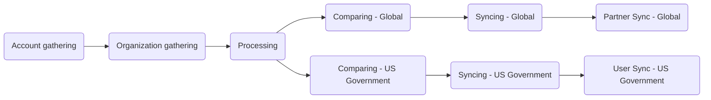

このガイドでは、Zendesk-Salesforce Sync を説明します。これは、顧客の organization とユーザーのデータを Salesforce（Single Source of Truth）から Zendesk へ同期する、自動化された毎時のプロセスです。この同期により、Zendesk 内で正確なサポートエンタイトルメント、適切な SLA の適用、最新の顧客メタデータが保証されます。

この同期は、GitLab CI/CD パイプラインを介して 9 つの連続したステージを通して実行されます。このドキュメントでは、同期がどのように機能するかを説明し、管理者向けのトラブルシューティングのガイダンスを提供します。

管理者は [管理者タスク](#administrator-tasks) セクションを確認してください。

{}

- デプロイメントタイプ: `Ad-hoc`
- プロジェクトリポジトリ:
  - [Salesforce Accounts](https://gitlab.com/gitlab-support-readiness/zd-sfdc-sync/salesforce-accounts)
  - [Zendesk Orgs](https://gitlab.com/gitlab-support-readiness/zd-sfdc-sync/zendesk-orgs)
  - [Processor](https://gitlab.com/gitlab-support-readiness/zd-sfdc-sync/processor)
  - [Global Org Compare](https://gitlab.com/gitlab-support-readiness/zd-sfdc-sync/global-org-compare)
  - [Zendesk Global Org Sync](https://gitlab.com/gitlab-support-readiness/zd-sfdc-sync/zendesk-global-org-sync)
  - [Partner Sync](https://gitlab.com/gitlab-support-readiness/zd-sfdc-sync/partner-sync)
  - [US Government Org Compare](https://gitlab.com/gitlab-support-readiness/zd-sfdc-sync/us-gov-org-compare)
  - [Zendesk US Government Org sync](https://gitlab.com/gitlab-support-readiness/zd-sfdc-sync/zendesk-us-government-org-sync)
  - [Zendesk US Government User Sync](https://gitlab.com/gitlab-support-readiness/zd-sfdc-sync/zendesk-us-gov-user-sync)
- 管理コンテンツリポジトリ:
  - [Zendesk Global Organization Entitlement Overrides](https://gitlab.com/gitlab-com/support/zendesk-global/organization-entitlement-overrides)

{}

## Zendesk-Salesforce Sync を理解する

### Zendesk-Salesforce Sync とは

Zendesk-Salesforce Sync は、顧客データを Salesforce から Zendesk へ同期する、相互に接続された 9 つの GitLab CI/CD プロジェクトの集合体です。この同期は次を扱います。

- **顧客の organization**: Zendesk Global と US Government の両方について、アカウントのメタデータ、サポートエンタイトルメント、サブスクリプションティア、ARR
- **パートナーの organization**: パートナーアカウント向けの別個の同期プロセス（Zendesk Global のみ）
- **ユーザーの関連付け**: Salesforce のコンタクトに基づくユーザーから organization への自動リンク（Zendesk US Government のみ）

この同期は毎時実行され、収集、処理、比較、同期という連続したステージを通してデータを処理します。

### Zendesk-Salesforce Sync の仕組み

Zendesk-Salesforce Sync は、すべての Zendesk 本番インスタンスを Salesforce と同期し続けるために「ステージ」で実行される、複雑なプロジェクト群です。このステージは次のようになっています。



#### Account gathering

<sup>ソースプロジェクト: [Salesforce Accounts](https://gitlab.com/gitlab-support-readiness/zd-sfdc-sync/salesforce-accounts)</sup>

これは、Zendesk-Salesforce Sync のプロセス全体を開始するステージです。ソースプロジェクト上のスケジュールパイプラインが、毎時 0 分（UTC）に実行されます（`0 * * * *`）。これは `bin/gather` スクリプトを使用し、次のことを行います。

- 次の SOQL クエリを使用して Salesforce アカウントのリストを取得します:
  <details>

  <summary>クリックして展開</summary>

  ```sql
  SELECT
    Account_ID_18__c,
    Name,
    CARR_This_Account__c,
    Type,
    Ultimate_Parent_Sales_Segment_Employees__c,
    Account_Owner_Calc__c,
    Technical_Account_Manager_Name__c,
    Restricted_Account__c,
    Solutions_Architect_Lookup__r.Name,
    Account_Demographics_Geo__c,
    Account_Demographics_Region__c,
    Latest_Sold_To_Contact__r.Email,
    Latest_Sold_To_Contact__r.Name,
    Partner_Track__c,
    Partners_Partner_Type__c,
    Support_Hold__c,
    Account_Risk_Level__c,
    Support_Instance__c,
    (
      SELECT
        Id,
        Name,
        Subscription_ID_18__c,
        Zuora__Status__c,
        Zuora__SubscriptionStartDate__c,
        Zuora__SubscriptionEndDate__c,
        Sold_To_Email__c
      FROM Zuora__Subscriptions__r
      WHERE
        Zuora__Status__c != 'Cancelled' AND
        Zuora__SubscriptionEndDate__c >= #{end_date}
    ),
    (
      SELECT
        Id,
        Name,
        Zuora__SubscriptionRatePlanChargeName__c,
        Zuora__Subscription__c,
        Zuora__EffectiveStartDate__c,
        Zuora__EffectiveEndDate__c,
        Zuora__Quantity__c
      FROM Zuora__R00N40000001lGjTEAU__r
      WHERE
        Subscription_Status__c != 'Cancelled' AND
        Zuora__EffectiveEndDate__c >= #{end_date}
    )
  FROM Account
  WHERE
    Type IN ('Customer', 'Former Customer')
  ```

  </details>

- 見つかったすべての Salesforce アカウントをアカウントオブジェクトにリマップします
  - `sales_segment` 属性は `Ultimate_Parent_Sales_Segment_Employees__c` の値から導出されます
    - 値がある場合はすべて小文字に設定します。値がない場合は `unknown` に設定します
  - `region` 属性は `Account_Demographics_Geo__c` と `Account_Demographics_Region__c` の値から導出されます。
    - `Account_Demographics_Geo__c` の値が `AMER`、`APJ`、`EMEA` のいずれかであれば、それを使用します。
    - それらのいずれの値でもない場合、`Account_Demographics_Region__c` の値が `AMER`、`APJ`、`EMEA` のいずれかであれば、それを使用します。
    - それらのいずれの値でもない場合、`nil` に設定します
  - `restricted` 属性は `Restricted_Account__c` の値から導出されます。
    - `Restricted_Account__c` の値が `Restricted Party` であれば `true` に設定します。そうでなければ `false` に設定します
  - `escalated` 属性は `Account_Risk_Level__c` の値から導出されます。
    - `Account_Risk_Level__c` の値が `At Risk - Escalated` であれば `true` に設定します。そうでなければ `false` に設定します
  - `exception` 属性は `Support_Instance__c` の値から導出されます。
    - `Support_Instance__c` の値が `federal-support` であれば `true` に設定します。そうでなければ `false` に設定します
  - `subs` 属性は `Zuora__Subscriptions__r` の値から導出されます
  - `charges` 属性は `Zuora__R00N40000001lGjTEAU__r` の値から導出されます
- リマップされた Salesforce アカウントを含むアーティファクトファイル（`data/salesforce_accounts.json`）を作成します

実行が完了すると、生成されたアーティファクトファイルは次のステージ [Organization gathering](#organization-gathering) に渡されます。

#### Organization gathering

<sup>ソースプロジェクト: [Zendesk Orgs](https://gitlab.com/gitlab-support-readiness/zd-sfdc-sync/zendesk-orgs)</sup>

このステージは、[Account gathering](#account-gathering) の完了時にトリガーされます。

これは 2 つのスクリプトを使用します。

- `bin/gather_global`
- `bin/gather_us_government`

正確な属性はスクリプトによって異なりますが、両方のスクリプトは一般的に同じように動作します。

- [List organizations](https://developer.zendesk.com/api-reference/ticketing/organizations/organizations/#list-organizations) API エンドポイントを使用して、そのインスタンスのすべての Zendesk organization を収集します
- 見つかったすべての organization をアカウントオブジェクトにマッピングします
- リマップされた organization を含むアーティファクトファイルを作成します
  - `bin/gather_global` の場合は `data/zendesk_global.json`
  - `bin/gather_us_government` の場合は `data/zendesk_usgov.json`

実行が完了すると、生成されたアーティファクトファイルと、[Account gathering](#account-gathering) で生成されたものが、次のステージ [Processing](#processing) に渡されます。

#### Processing

<sup>ソースプロジェクト: [Processor](https://gitlab.com/gitlab-support-readiness/zd-sfdc-sync/processor)</sup>

このステージは、[Organization gathering](#organization-gathering) の完了時にトリガーされます。これは（同期そのものに必要なすべての変換を行うため）ステージの中で最も複雑です。

これは `bin/processor` スクリプトを使用し、次のことを行います。

- 必要なデータをロードします
  - 管理コンテンツプロジェクト [Zendesk Global Organization Entitlement Overrides](https://gitlab.com/gitlab-com/support/zendesk-global/organization-entitlement-overrides) からオーバーライドファイルを取得します
  - `data/plans.yml` ファイルを読み込みます
  - アーティファクトファイルからデータを読み込みます
- 分析・操作されるデータの量が膨大なため、ルックアップ構造を生成します

  | 名前 | 説明 | オブジェクトタイプ |
  |------|-------------|-------------|
  | global_orgs_by_id | salesforce_id キーを使用して Hash に変換されたすべての Global organization | Hash |
  | usgov_orgs_by_id | salesforce_id キーを使用して Hash に変換されたすべての US Government organization | Hash |
  | partners_by_sfdc_id | すべてのパートナー organization の salesforce_id | Array |
  | overrides_by_id | salesforce_id キーを使用して Hash に変換されたすべてのオーバーライド | Hash |
  | plan_lookup | それぞれが整合するサブスクリプションタイプに紐づけられたすべての製品 charge name | Hash |
  | all_valid_plans | 任意のタイプのアカウントに紐づけられたすべての製品 charge name | Array |
  | usgov_plan_names_for_exceptions | 例外を持つ US Government アカウントに紐づけられたすべての製品 charge name | Array |
  | usgov_plan_names | 例外を持たない US Government アカウントに紐づけられたすべての製品 charge name | Array |
  | today | 今日の日付 | Date |
  | expired_end_date | 15 日前 | Date |
  | three_years_out | 3 年と 1 日前 | Date |

- 各アカウントの Global オブジェクトを判定します
  - Zendesk organization の属性に一致する Hash を作成します
  - 対応する Salesforce アカウントのすべてのサブスクリプションを分析します
    - まず、アカウントの US Government 例外設定に応じて、Global オブジェクトに適用されるサブスクリプションのみを選択することから始めます
    - 次に、各サブスクリプションを反復処理し、アカウントのサブスクリプションに紐づけられた製品 charge name に基づいて、オブジェクトのサブスクリプション値を判定します
  - すべての製品 charge の effective end date の最大値に基づいて `expiration_date` 値を設定します
  - アカウントにオーバーライドが記載されているか確認します（そしてそれに応じてオブジェクトを変更します）
  - オブジェクトの support_level を、最も高いレベルのサポートのものに設定します
    - Ultimate > Gold > Premium > Silver > Consumption Only > Custom > Community > Expired
  - オブジェクトの `support_level` が expired と表示されている場合を除き、オブジェクトの `type` を `customer` に設定します
  - オブジェクトの `support_level` が expired と表示されている場合、オブジェクトの `aar` を 0 に設定します
  - オブジェクトの `sub_ss_enterprise` が true の場合、`sub_ss_ase` 値を true に設定します
  - オブジェクトの `expiration_date` と、ルックアップオブジェクト `three_years_out` の値との関係を確認することで、アカウントを同期に含めるべきかどうかを判定します（前者が後者より小さい場合は含めません）
- 各アカウントの US Government オブジェクトを判定します
  - Zendesk organization の属性に一致する Hash を作成します
  - 対応する Salesforce アカウントのすべてのサブスクリプションを分析します
    - まず、アカウントの US Government 例外設定に応じて、US Government オブジェクトに適用されるサブスクリプションのみを選択することから始めます
    - 次に、各サブスクリプションを反復処理し、アカウントのサブスクリプションに紐づけられた製品 charge name に基づいて、オブジェクトのサブスクリプション値を判定します
  - すべての製品 charge の effective end date の最大値に基づいて `expiration_date` 値を設定します
  - アカウントにオーバーライドが記載されているか確認します（そしてそれに応じてオブジェクトを変更します）
  - オブジェクトの support_level を、最も高いレベルのサポートのものに設定します
    - Ultimate > Gold > Premium > Silver > Consumption Only > Custom > Community > Expired
  - オブジェクトの `support_level` が expired と表示されている場合を除き、オブジェクトの `type` を `customer` に設定します
  - オブジェクトの `support_level` が expired と表示されている場合、オブジェクトの `arr` を 0 に設定します
  - オブジェクトの `usgov_fedramp` の値が true の場合、オブジェクトの `sub_gitlab_dedicated` と `sub_usgov_24x7` を true に設定します
  - オブジェクトに対応するスケジュール（12x5 か 24x7）を設定します
  - オブジェクトの `expiration_date` と、ルックアップオブジェクト `three_years_out` の値との関係を確認することで、アカウントを同期に含めるべきかどうかを判定します（前者が後者より小さい場合は含めません）
- さまざまなオブジェクトからアーティファクトファイルを作成します。
  - Global オブジェクト用の `data/global_accounts.json`
  - US Government オブジェクト用の `data/usgov_accounts.json`

実行が完了すると、2 つの別個のステージがトリガーされます。

- [Comparing - Global](#comparing---global)。[Organization gathering](#organization-gathering) のアーティファクトファイルと `data/global_accounts.json` を渡します
- [Comparing - US Government](#comparing---us-government)。[Organization gathering](#organization-gathering) のアーティファクトファイルと `data/usgov_accounts.json` を渡します

#### Comparing - Global

<sup>ソースプロジェクト: [Global Org Compare](https://gitlab.com/gitlab-support-readiness/zd-sfdc-sync/global-org-compare)</sup>

このステージは、[Processing](#processing) の完了時にトリガーされます。

これは `bin/compare` スクリプトを使用し、次のことを行います。

- アーティファクトファイルからデータを読み込みます
- `salesforce_id`（Zendesk organization を organization オブジェクトに紐づけるフィールド）を統一フィールドとして使用し、すべてのデータを比較にかけて、3 つの配列を生成します。
  - `zendesk_only_objects`。一致する organization オブジェクトを持たない Zendesk organization に相当します
  - `ssot_only_objects`。一致する Zendesk organization を持たない organization オブジェクトに相当します
  - `different_objects`。一致する Zendesk organization を持つが、両者のデータが等しくない organization オブジェクトに相当します
- 次に、3 つのアーティファクトを生成します。
  - `data/global_updates.json`。`different_objects` の項目を含みます
  - `data/global_creates.json`。`ssot_only_objects` の項目から、`support_level` が `expired` のものを除いたものを含みます
  - `data/global_not_in_sync.json`。`zendesk_only_objects` の項目から、次を除いたものを含みます。
    - `type` が `alliance_partner`、`open_partner`、`select_partner` のもの
    - `protected_ids` 関数で定義された配列に含まれる `salesforce_id` を持つもの

実行が完了すると、生成されたアーティファクトファイルは次のステージ [Syncing - Global](#syncing---global) に渡されます。

#### Comparing - US Government

<sup>ソースプロジェクト: [US Government Org Compare](https://gitlab.com/gitlab-support-readiness/zd-sfdc-sync/us-gov-org-compare)</sup>

このステージは、[Processing](#processing) の完了時にトリガーされます。

これは `bin/compare` スクリプトを使用し、次のことを行います。

- アーティファクトファイルからデータを読み込みます
- `salesforce_id`（Zendesk organization を organization オブジェクトに紐づけるフィールド）を統一フィールドとして使用し、すべてのデータを比較にかけて、3 つの配列を生成します。
  - `zendesk_only_objects`。一致する organization オブジェクトを持たない Zendesk organization に相当します
  - `ssot_only_objects`。一致する Zendesk organization を持たない organization オブジェクトに相当します
  - `different_objects`。一致する Zendesk organization を持つが、両者のデータが等しくない organization オブジェクトに相当します
- 次に、3 つのアーティファクトを生成します。
  - `data/usgov_updates.json`。`different_objects` の項目を含みます
  - `data/usgov_creates.json`。`ssot_only_objects` の項目から、`support_level` が `expired` のものを除いたものを含みます
  - `data/usgov_not_in_sync.json`。`zendesk_only_objects` の項目から、次を除いたものを含みます。
    - `protected_ids` 関数で定義された配列に含まれる `salesforce_id` を持つもの

実行が完了すると、生成されたアーティファクトファイルは次のステージ [Syncing - US Government](#syncing---us-government) に渡されます。

#### Syncing - Global

<sup>ソースプロジェクト: [Zendesk Global Org Sync](https://gitlab.com/gitlab-support-readiness/zd-sfdc-sync/zendesk-global-org-sync)</sup>

このステージは、[Comparing - Global](#comparing---global) の完了時にトリガーされます。

これは `bin/sync` スクリプトを使用し、次のことを行います。

- アーティファクトファイルからデータを読み込みます
- `data/global_creates.json` アーティファクトファイルのオブジェクトのリストを反復処理し、次のことを行います。
  - Zendesk の [Create Organization](https://developer.zendesk.com/api-reference/ticketing/organizations/organizations/#create-organization) API エンドポイントを使用して organization を作成します
  - `sold_tos` 属性のユーザーを、新しく作成された organization に関連付けます
    - 関連付けられるユーザーがいない場合、[#support_operations Slack チャンネル](https://gitlab.enterprise.slack.com/archives/C018ZGZAMPD) に投稿が行われ、Customer Support Operations チームに通知されます
- `data/global_updates.json` アーティファクトファイルのオブジェクトをバッチ（API の制限により最大 100 個）に分割し、次のことを行います。
  - Zendesk の [Update Many Organizations](https://developer.zendesk.com/api-reference/ticketing/organizations/organizations/#update-many-organizations) API エンドポイントを使用して、更新ジョブを作成します（以前に判定された内容に一致するように更新するため）
- `data/global_not_in_sync.json` アーティファクトファイルのオブジェクトをバッチ（API の制限により最大 100 個）に分割し、次のことを行います。
  - Zendesk の [Update Many Organizations](https://developer.zendesk.com/api-reference/ticketing/organizations/organizations/#update-many-organizations) API エンドポイントを使用して、更新ジョブを作成します（削除対象としてマークするように更新するため）

実行が完了すると、次のステージ [Partner Sync - Global](#partner-sync---global) がトリガーされます。

#### Syncing - US Government

<sup>ソースプロジェクト: [Zendesk US Government Org sync](https://gitlab.com/gitlab-support-readiness/zd-sfdc-sync/zendesk-us-government-org-sync)</sup>

このステージは、[Comparing - US Government](#comparing---us-government) の完了時にトリガーされます。

これは `bin/sync` スクリプトを使用し、次のことを行います。

- アーティファクトファイルからデータを読み込みます
- `data/usgov_creates.json` アーティファクトファイルのオブジェクトのリストを反復処理し、次のことを行います。
  - Zendesk の [Create Organization](https://developer.zendesk.com/api-reference/ticketing/organizations/organizations/#create-organization) API エンドポイントを使用して organization を作成します
- `data/usgov_updates.json` アーティファクトファイルのオブジェクトをバッチ（API の制限により最大 100 個）に分割し、次のことを行います。
  - Zendesk の [Update Many Organizations](https://developer.zendesk.com/api-reference/ticketing/organizations/organizations/#update-many-organizations) API エンドポイントを使用して、更新ジョブを作成します（以前に判定された内容に一致するように更新するため）
- `data/usgov_not_in_sync.json` アーティファクトファイルのオブジェクトをバッチ（API の制限により最大 100 個）に分割し、次のことを行います。
  - Zendesk の [Update Many Organizations](https://developer.zendesk.com/api-reference/ticketing/organizations/organizations/#update-many-organizations) API エンドポイントを使用して、更新ジョブを作成します（削除対象としてマークするように更新するため）

実行が完了すると、次のステージ [User Sync - US Government](#user-sync---us-government) がトリガーされます。

#### Partner Sync - Global

<sup>ソースプロジェクト: [Partner Sync](https://gitlab.com/gitlab-support-readiness/zd-sfdc-sync/partner-sync)</sup>

このステージは、[Syncing - Global](#syncing---global) の完了時にトリガーされます。これは、Zendesk Global の観点から見た Zendesk-Salesforce Sync の最終ステージとして機能します。

このステージは複数スクリプトのプロセスです。

1. `bin/salesforce`。次のことを行います。
   - 次の SOQL クエリを使用して Salesforce アカウントのリストを取得します:
     <details>

     <summary>クリックして展開</summary>

     ```sql
     SELECT
       Account_ID_18__c,
       Name,
       Account_Owner_Calc__c,
       Technical_Account_Manager_Name__c,
       Restricted_Account__c,
       Solutions_Architect_Lookup__r.Name,
       Partner_Track__c,
       Support_Hold__c,
       Account_Risk_Level__c,
       Type,
       Partners_Partner_Status__c
     FROM Account
     WHERE
       Account_ID_18__c = 'REDACTED' OR
       (
         Type = 'Partner' AND
         Partners_Partner_Status__c IN ('Authorized') AND
         Partner_Track__c IN ('Open', 'Select')
       )
     ```

     </details>

   - 見つかったすべての Salesforce アカウントをアカウントオブジェクトにリマップします
     - `account_type` 属性は `Partner_Track__c` と `Account_ID_18__c` の値から導出されます。
       - `Account_ID_18__c` が特定の Salesforce アカウントの値である場合、`alliance_partner` に設定します
       - `Partner_Track__c` が `Open` の場合、`open_partner` に設定します
       - `Partner_Track__c` が `Select` の場合、`select_partner` に設定します
       - 以前に一致する条件がない場合、`nil` に設定します
     - `restricted_account` 属性は `Restricted_Account__c` の値から導出されます。
       - `Restricted_Account__c` の値が `Restricted Party` であれば `true` に設定します。そうでなければ `false` に設定します
     - `org_in_escalated_state` 属性は `Account_Risk_Level__c` の値から導出されます。
       - `Account_Risk_Level__c` の値が `At Risk - Escalated` であれば `true` に設定します。そうでなければ `false` に設定します
   - リマップされた Salesforce アカウントを含むアーティファクトファイル（`data/salesforce_accounts.json`）を作成します
1. `bin/zendesk`。次のことを行います。
   - [List organizations](https://developer.zendesk.com/api-reference/ticketing/organizations/organizations/#list-organizations) API エンドポイントを使用して、そのインスタンスのすべての Zendesk organization を収集します
   - パートナータイプ以外の organization（`account_type` が `alliance_partner`、`open_partner`、`select_partner` のいずれか）をフィルタで除外します
   - 残りのすべての organization を organization オブジェクトにマッピングします
   - リマップされた organization を含むアーティファクトファイル（`data/zendesk_orgs.json`）を作成します
1. `bin/compare`。次のことを行います。
   - アーティファクトファイルからデータを読み込みます
   - `salesforce_id`（Zendesk organization を organization オブジェクトに紐づけるフィールド）を統一フィールドとして使用し、すべてのデータを比較にかけて、3 つの配列を生成します。
     - `zendesk_only_objects`。一致する organization オブジェクトを持たない Zendesk organization に相当します
     - `ssot_only_objects`。一致する Zendesk organization を持たない organization オブジェクトに相当します
     - `different_objects`。一致する Zendesk organization を持つが、両者のデータが等しくない organization オブジェクトに相当します
   - 次に、3 つのアーティファクトを生成します。
     - `data/updates.json`。`different_objects` の項目を含みます
     - `data/creates.json`。`ssot_only_objects` の項目を含みます
     - `data/not_in_sync.json`。`zendesk_only_objects` の項目を含みます
1. `bin/sync`。次のことを行います。
   - アーティファクトファイルからデータを読み込みます
   - `data/creates.json` アーティファクトファイルのオブジェクトのリストを反復処理し、次のことを行います。
     - Zendesk の [Create Organization](https://developer.zendesk.com/api-reference/ticketing/organizations/organizations/#create-organization) API エンドポイントを使用して organization を作成します
   - `data/updates.json` アーティファクトファイルのオブジェクトをバッチ（API の制限により最大 100 個）に分割し、次のことを行います。
     - Zendesk の [Update Many Organizations](https://developer.zendesk.com/api-reference/ticketing/organizations/organizations/#update-many-organizations) API エンドポイントを使用して、更新ジョブを作成します（以前に判定された内容に一致するように更新するため）
   - `data/not_in_sync.json` アーティファクトファイルのオブジェクトをバッチ（API の制限により最大 100 個）に分割し、次のことを行います。
     - Zendesk の [Update Many Organizations](https://developer.zendesk.com/api-reference/ticketing/organizations/organizations/#update-many-organizations) API エンドポイントを使用して、更新ジョブを作成します（削除対象としてマークするように更新するため）

#### User Sync - US Government

<sup>ソースプロジェクト: [Zendesk US Government User Sync](https://gitlab.com/gitlab-support-readiness/zd-sfdc-sync/zendesk-us-gov-user-sync)</sup>

このステージは、[Syncing - US Government](#syncing---us-government) の完了時にトリガーされます。これは、Zendesk US Government の観点から見た Zendesk-Salesforce Sync の最終ステージとして機能します。

このステージは複数スクリプトのプロセスです。

1. `bin/zendesk_orgs_gather`。次のことを行います。
   - [List organizations](https://developer.zendesk.com/api-reference/ticketing/organizations/organizations/#list-organizations) API エンドポイントを使用して、そのインスタンスのすべての Zendesk organization を収集します
   - すべての organization を organization オブジェクトにマッピングします
   - リマップされた organization を含むアーティファクトファイル（`data/zendesk_orgs.json`）を作成します
1. `bin/zendesk_users_gather`。次のことを行います。
   - [List Users](https://developer.zendesk.com/api-reference/ticketing/users/users/#list-users) API エンドポイントを使用して、そのインスタンスのすべての Zendesk ユーザーを収集します
   - すべての保護されたユーザー（メールドメインが `gitlab.com` のもの、または当社が管理するエンドユーザーのメールアドレスのもの）をフィルタで除外します
   - すべてのユーザーをユーザーオブジェクトにマッピングします
   - リマップされたユーザーを含むアーティファクトファイル（`data/zendesk_users.json`）を作成します
1. `bin/salesforce`。次のことを行います。
   - `data/zendesk_orgs.json` アーティファクトファイルを読み込み、（SOQL の制限により）リストを 500 個ずつのチャンクに分割します。各チャンクは `salesforce_id` 値のみを含みます
   - 次の SOQL クエリを使用して Salesforce コンタクトのリストを取得します:
     <details>

     <summary>クリックして展開</summary>

     ```sql
     SELECT
       Name,
       Email,
       Account.Account_ID_18__c
     FROM Contact
     WHERE
       Inactive_Contact__c = false AND
       Role__c INCLUDES ('Gitlab Admin') AND
       Name != '' AND
       Email != '' AND
       Account.Account_ID_18__c IN (#{chunk.map { |i| "'#{i}'" }.join(',')})
     ```

     </details>

     - ここで `chunk` の部分は、各チャンク内の `salesforce_id` 値のリストです
   - 見つかったすべての Salesforce コンタクトをコンタクトにリマップします
     - `organization_id` 属性は、一致する Zendesk organization の `salesforce_id` 値の `id` 値から導出されます
   - 無効なコンタクトを削除します
     - `email` 値が欠落しているもの
     - 重複しているもの（`email` 値で一致するもの）
   - リマップされた Salesforce コンタクトを含むアーティファクトファイル（`data/salesforce_contacts.json`）を作成します
1. `bin/compare`。次のことを行います。
   - アーティファクトファイルからデータを読み込みます
   - `email`（Zendesk ユーザーをユーザーオブジェクトに紐づけるフィールド）を統一フィールドとして使用し、すべてのデータを比較にかけて、3 つの配列を生成します。
     - `zendesk_only_objects`。一致する organization オブジェクトを持たない Zendesk organization に相当します
     - `ssot_only_objects`。一致する Zendesk organization を持たない organization オブジェクトに相当します
     - `different_objects`。一致する Zendesk organization を持つが、両者のデータが等しくない organization オブジェクトに相当します
   - 次に、3 つのアーティファクトを生成します。
     - `data/updates.json`。`different_objects` の項目を含みます
     - `data/creates.json`。`ssot_only_objects` の項目を含みます
     - `data/not_in_sync.json`。`zendesk_only_objects` の項目を含みます
1. `bin/sync`。次のことを行います。
   - アーティファクトファイルからデータを読み込みます
   - `data/creates.json` アーティファクトファイルのオブジェクトのリストを反復処理し、次のことを行います。
     - Zendesk の [Create User](https://developer.zendesk.com/api-reference/ticketing/users/users/#create-user) API エンドポイントを使用してユーザーを作成します
   - `data/updates.json` アーティファクトファイルのオブジェクトをバッチ（API の制限により最大 100 個）に分割し、次のことを行います。
     - Zendesk の [Update Many Users](https://developer.zendesk.com/api-reference/ticketing/users/users/#update-many-users) API エンドポイントを使用して、更新ジョブを作成します（以前に判定された内容に一致するように更新するため）
   - `data/not_in_sync.json` アーティファクトファイルのオブジェクトをバッチ（API の制限により最大 100 個）に分割し、次のことを行います。
     - Zendesk の [Update Many Users](https://developer.zendesk.com/api-reference/ticketing/users/users/#update-many-users) API エンドポイントを使用して、更新ジョブを作成します（削除対象としてマークするように更新するため）

## 管理者タスク

{}

- このアクションには、Zendesk-Salesforce Sync プロジェクトへの `Developer` レベルのアクセスが必要です。

{}

### Zendesk-Salesforce Sync を変更する

{}

- これは対応するリクエスト issue（Feature Request、Administrative、Bug など）がある場合にのみ行うべきです。存在しない場合は、まず作成し（そして作業を行う前に標準プロセスを通し）ます。

{}

Zendesk-Salesforce Sync を変更するには、対応するプロジェクトリポジトリ（どれになるかは行う変更によります）で MR を作成する必要があります。行う正確な変更は、リクエスト自体によって異なります。

ピアがあなたの MR をレビューして承認した後、MR をマージできます。これは `Ad-hoc` デプロイメントタイプであるため、変更は次のスケジュール実行で使用されます。

#### どの変更がどこで発生するかのクイックリファレンス

- SKU の変更: 詳細については [SKU Mapping ドキュメント](/handbook/security/customer-support-operations/salesforce/skus) を参照してください
- エンタイトルメント計算の変更: 変更は [Processor](https://gitlab.com/gitlab-support-readiness/zd-sfdc-sync/processor) プロジェクトで発生します
- パイプラインスケジュールの変更: 変更は [Salesforce Accounts](https://gitlab.com/gitlab-support-readiness/zd-sfdc-sync/salesforce-accounts) プロジェクトで発生します
- オブジェクト属性の変更: 変更は _すべての_ プロジェクトで発生する可能性が高いです

## よくある問題とトラブルシューティング

### Runner エラー

これには、runner が完全に失敗する、タイムアウトするなどが含まれます。これらが発生した場合、取りうる対応は 2 つあります。

- 同期を最初から再起動する
- 次回の同期実行を待つ

問題が実行の早い段階（毎時の最初の 5 〜 10 分以内）で発生した場合は、再起動するのが許容できる方法です。それより後の場合は、次回の同期実行を待つべきです。

これが繰り返し発生するのを見かけた場合は、issue を起票して Fullstack Engineer に通知してください。

### 長時間実行されるジョブ

プロセス全体が 45 分を超えることは決してないはずです。長時間実行されるジョブに関するアラートが発生した場合、最善の手段は次のいずれかを行うことです。

- 古いほうのパイプラインをキャンセルする
- 新しいほうのパイプラインをキャンセルする

実行されたまま残されたほうがこれを処理でき（キャッシュは使用されていないため）、自己修正するはずです。

これが繰り返し発生するのを見かけた場合は、issue を起票して Fullstack Engineer に通知してください。

### データの不一致

これらは解決が複雑になりうるもので、計算の問題か、期待の問題かのいずれかです。実際にデータの不一致があるのか（すなわち計算の問題）、それとも単に期待の問題なのかを判断するには、ソース（Salesforce、Zendesk）のデータを慎重にレビューする必要があります。

- 計算の問題については、バグレポートを起票して Fullstack Engineer に通知してください。
- 期待の問題については、その差異と、なぜその値になるのかを説明してください。
  - その会話の結果、計算を変更したいということになった場合は、報告者に Feature Request の issue を起票してもらってください。

### スクリプトエラー

これに使用されるさまざまなスクリプトは、できるだけ多くの詳細を提供しようとする方法でコーディングされています。スクリプトエラーに遭遇したときは、まずそれが実際にスクリプトエラーなのか、それとも単にネットワークの問題（がスクリプトエラーを引き起こしている）なのかを結論づける必要があります。

最も確実な方法は、過去の同期実行とその次の実行を見ることです。本物のスクリプトエラーは毎回繰り返されます。毎回発生していないのであれば、それはネットワークの問題です。

- ネットワークの問題については、[Runner エラー](#runner-errors) を参照してください
- 本物のスクリプトエラーについては、issue を起票して Fullstack Engineer に通知してください
