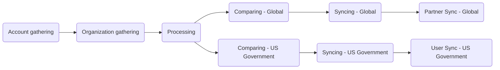

このガイドは、Salesforce（Single Source of Truth）から Zendesk へ顧客組織およびユーザーデータを毎時自動同期する Zendesk-Salesforce 同期について説明します。この同期により、正確なサポート権限、適切な SLA 適用、Zendesk における最新の顧客メタデータが保証されます。

同期は GitLab CI/CD パイプライン経由で 9 つの順次ステージを通じて実行されます。このドキュメントでは、同期の動作方法を説明し、管理者向けのトラブルシューティングガイダンスを提供します。

管理者は[管理者タスク](#administrator-tasks)セクションを確認してください。

{}

- デプロイメントタイプ: `Ad-hoc`
- プロジェクトリポジトリ:
  - [Salesforce Accounts](https://gitlab.com/gitlab-support-readiness/zd-sfdc-sync/salesforce-accounts)
  - [Zendesk Orgs](https://gitlab.com/gitlab-support-readiness/zd-sfdc-sync/zendesk-orgs)
  - [Processor](https://gitlab.com/gitlab-support-readiness/zd-sfdc-sync/processor)
  - [Global Org Compare](https://gitlab.com/gitlab-support-readiness/zd-sfdc-sync/global-org-compare)
  - [Zendesk Global Org Sync](https://gitlab.com/gitlab-support-readiness/zd-sfdc-sync/zendesk-global-org-sync)
  - [Partner Sync](https://gitlab.com/gitlab-support-readiness/zd-sfdc-sync/partner-sync)
  - [US Government Org Compare](https://gitlab.com/gitlab-support-readiness/zd-sfdc-sync/us-gov-org-compare)
  - [Zendesk US Government Org sync](https://gitlab.com/gitlab-support-readiness/zd-sfdc-sync/zendesk-us-government-org-sync)
  - [Zendesk US Government User Sync](https://gitlab.com/gitlab-support-readiness/zd-sfdc-sync/zendesk-us-gov-user-sync)
- マネージドコンテンツリポジトリ:
  - [Zendesk Global Organization Entitlement Overrides](https://gitlab.com/gitlab-com/support/zendesk-global/organization-entitlement-overrides)

{}

## Zendesk-Salesforce 同期の理解 {#understanding-the-zendesk-salesforce-sync}

### Zendesk-Salesforce 同期とは {#what-is-the-zendesk-salesforce-sync}

Zendesk-Salesforce 同期は、Salesforce から Zendesk へ顧客データを同期する 9 つの相互接続された GitLab CI/CD プロジェクトのコレクションです。同期は以下を扱います。

- **顧客組織**: Zendesk Global と US Government 両方のアカウントメタデータ、サポート権限、サブスクリプションティア、ARR
- **パートナー組織**: パートナーアカウント向けの個別同期プロセス（Zendesk Global のみ）
- **ユーザー関連付け**: Salesforce 連絡先に基づく自動ユーザー-組織リンク（Zendesk US Government のみ）

同期は毎時実行され、データを順次のステージ（収集、処理、比較、同期）で処理します。

### Zendesk-Salesforce 同期はどのように動作するか {#how-does-zendesk-salesforce-sync-work}

Zendesk-Salesforce 同期は、すべての Zendesk 本番インスタンスを Salesforce と同期し続けるために「ステージ」で実行される複雑なプロジェクトセットです。このステージは以下のようになります。



#### アカウント収集 {#account-gathering}

<sup>ソースプロジェクト: [Salesforce Accounts](https://gitlab.com/gitlab-support-readiness/zd-sfdc-sync/salesforce-accounts)</sup>

これは Zendesk-Salesforce 同期のプロセス全体を開始するステージです。ソースプロジェクトのスケジュールパイプラインが毎時 0 分 UTC（`0 * * * *`）に実行されます。これは `bin/gather` スクリプトを使用し、以下を行います。

- 以下の SOQL クエリを使用して Salesforce アカウントのリストを取得:
  <details>

  <summary>クリックして展開</summary>

  ```sql
  SELECT
    Account_ID_18__c,
    Name,
    CARR_This_Account__c,
    Type,
    Ultimate_Parent_Sales_Segment_Employees__c,
    Account_Owner_Calc__c,
    Technical_Account_Manager_Name__c,
    Restricted_Account__c,
    Solutions_Architect_Lookup__r.Name,
    Account_Demographics_Geo__c,
    Account_Demographics_Region__c,
    Latest_Sold_To_Contact__r.Email,
    Latest_Sold_To_Contact__r.Name,
    Partner_Track__c,
    Partners_Partner_Type__c,
    Support_Hold__c,
    Account_Risk_Level__c,
    Support_Instance__c,
    (
      SELECT
        Id,
        Name,
        Subscription_ID_18__c,
        Zuora__Status__c,
        Zuora__SubscriptionStartDate__c,
        Zuora__SubscriptionEndDate__c,
        Sold_To_Email__c
      FROM Zuora__Subscriptions__r
      WHERE
        Zuora__Status__c != 'Cancelled' AND
        Zuora__SubscriptionEndDate__c >= #{end_date}
    ),
    (
      SELECT
        Id,
        Name,
        Zuora__SubscriptionRatePlanChargeName__c,
        Zuora__Subscription__c,
        Zuora__EffectiveStartDate__c,
        Zuora__EffectiveEndDate__c,
        Zuora__Quantity__c
      FROM Zuora__R00N40000001lGjTEAU__r
      WHERE
        Subscription_Status__c != 'Cancelled' AND
        Zuora__EffectiveEndDate__c >= #{end_date}
    )
  FROM Account
  WHERE
    Type IN ('Customer', 'Former Customer')
  ```

  </details>

- 見つかったすべての Salesforce アカウントをアカウントオブジェクトに再マッピング
  - `sales_segment` 属性は `Ultimate_Parent_Sales_Segment_Employees__c` の値から派生
    - 値があればすべて小文字に設定。値がなければ `unknown` に設定
  - `region` 属性は `Account_Demographics_Geo__c` および `Account_Demographics_Region__c` の値から派生:
    - `Account_Demographics_Geo__c` が `AMER`、`APJ`、または `EMEA` の場合はその値を使用
    - そうでない場合、`Account_Demographics_Region__c` が `AMER`、`APJ`、または `EMEA` の場合はその値を使用
    - そうでない場合、`nil` に設定
  - `restricted` 属性は `Restricted_Account__c` の値から派生:
    - `Restricted_Account__c` の値が `Restricted Party` の場合は `true`。そうでない場合は `false` に設定
  - `escalated` 属性は `Account_Risk_Level__c` の値から派生:
    - `Account_Risk_Level__c` の値が `At Risk - Escalated` の場合は `true`。そうでない場合は `false` に設定
  - `exception` 属性は `Support_Instance__c` の値から派生:
    - `Support_Instance__c` の値が `federal-support` の場合は `true`。そうでない場合は `false` に設定
  - `subs` 属性は `Zuora__Subscriptions__r` の値から派生
  - `charges` 属性は `Zuora__R00N40000001lGjTEAU__r` の値から派生
- 再マッピングされた Salesforce アカウントを含むアーティファクトファイル（`data/salesforce_accounts.json`）を作成

実行が終わった後、生成されたアーティファクトファイルは次のステージ、[組織収集](#organization-gathering)に渡されます。

#### 組織収集 {#organization-gathering}

<sup>ソースプロジェクト: [Zendesk Orgs](https://gitlab.com/gitlab-support-readiness/zd-sfdc-sync/zendesk-orgs)</sup>

このステージは[アカウント収集](#account-gathering)の完了時にトリガーされます。

これは 2 つのスクリプトを使用します。

- `bin/gather_global`
- `bin/gather_us_government`

正確な属性はスクリプトによって異なりますが、両方のスクリプトは同じ一般的な方法で動作します。

- インスタンスのすべての Zendesk 組織を [List organizations](https://developer.zendesk.com/api-reference/ticketing/organizations/organizations/#list-organizations) API エンドポイントを使用して収集
- 見つかったすべての組織をアカウントオブジェクトにマッピング
- 再マッピングされた組織を含むアーティファクトファイルを作成
  - `bin/gather_global` の場合は `data/zendesk_global.json`
  - `bin/gather_us_government` の場合は `data/zendesk_usgov.json`

実行が終わった後、生成されたアーティファクトファイルと[アカウント収集](#account-gathering)で生成されたものが、次のステージ、[処理](#processing)に渡されます。

#### 処理 {#processing}

<sup>ソースプロジェクト: [Processor](https://gitlab.com/gitlab-support-readiness/zd-sfdc-sync/processor)</sup>

このステージは[組織収集](#organization-gathering)の完了時にトリガーされます。これはステージで最も複雑です（同期自体に必要なすべての変換を行うため）。

これは `bin/processor` スクリプトを使用し、以下を行います。

- 必要なデータを読み込み
  - マネージドコンテンツプロジェクト [Zendesk Global Organization Entitlement Overrides](https://gitlab.com/gitlab-com/support/zendesk-global/organization-entitlement-overrides) からオーバーライドファイルを取得
  - `data/plans.yml` ファイルを読み込み
  - アーティファクトファイルからデータを読み込み
- 分析および操作されるデータの量が膨大なため、ルックアップ構造を生成

  | 名前 | 説明 | オブジェクトタイプ |
  |------|-------------|-------------|
  | global_orgs_by_id | salesforce_id キーを使用して Hash に変換されたすべての Global 組織 | Hash |
  | usgov_orgs_by_id | salesforce_id キーを使用して Hash に変換されたすべての US Government 組織 | Hash |
  | partners_by_sfdc_id | すべてのパートナー組織の salesforce_id | Array |
  | overrides_by_id | salesforce_id キーを使用して Hash に変換されたすべてのオーバーライド | Hash |
  | plan_lookup | 整列するサブスクリプションタイプに紐づくすべての製品請求名 | Hash |
  | all_valid_plans | あらゆるタイプのアカウントに紐づくすべての製品請求名 | Array |
  | usgov_plan_names_for_exceptions | 例外のある US Government アカウントに紐づくすべての製品請求名 | Array |
  | usgov_plan_names | 例外のない US Government アカウントに紐づくすべての製品請求名 | Array |
  | today | 今日の日付 | Date |
  | expired_end_date | 15 日前 | Date |
  | three_years_out | 3 年と 1 日前 | Date |

- 各アカウントの Global オブジェクトを判定
  - Zendesk 組織属性に一致する Hash を作成
  - 対応する Salesforce アカウントのすべてのサブスクリプションを分析
    - アカウントの US Government 例外設定に応じて、Global オブジェクトに適用されるサブスクリプションのみを選択して開始
    - 次に各サブスクリプションを反復処理し、アカウントのサブスクリプションに紐づく製品請求名に基づいてオブジェクトのサブスクリプション値を判定
  - すべての製品請求の有効終了日の最大値に基づいて `expiration_date` 値を設定
  - アカウントにオーバーライドがリストされているか確認（その場合はオブジェクトを変更）
  - オブジェクトの support_level を最高レベルのサポートに設定
    - Ultimate > Gold > Premium > Silver > Consumption Only > Custom > Community > Expired
  - オブジェクトが `support_level` を expired として表示していない限り、オブジェクトの `type` を `customer` に設定
  - オブジェクトが `support_level` を expired として表示している場合、オブジェクトの `aar` を 0 に設定
  - オブジェクトの `sub_ss_enterprise` が true の場合、オブジェクトの `sub_ss_ase` 値を true に設定
  - オブジェクトの `expiration_date` とルックアップオブジェクト `three_years_out` の値の関係をチェックして、アカウントを同期に含めるかを判定（小さければ含めない）
- 各アカウントの US Government オブジェクトを判定
  - Zendesk 組織属性に一致する Hash を作成
  - 対応する Salesforce アカウントのすべてのサブスクリプションを分析
    - アカウントの US Government 例外設定に応じて、US Government オブジェクトに適用されるサブスクリプションのみを選択して開始
    - 次に各サブスクリプションを反復処理し、アカウントのサブスクリプションに紐づく製品請求名に基づいてオブジェクトのサブスクリプション値を判定
  - すべての製品請求の有効終了日の最大値に基づいて `expiration_date` 値を設定
  - アカウントにオーバーライドがリストされているか確認（その場合はオブジェクトを変更）
  - オブジェクトの support_level を最高レベルのサポートに設定
    - Ultimate > Gold > Premium > Silver > Consumption Only > Custom > Community > Expired
  - オブジェクトが `support_level` を expired として表示していない限り、オブジェクトの `type` を `customer` に設定
  - オブジェクトが `support_level` を expired として表示している場合、オブジェクトの `arr` を 0 に設定
  - オブジェクトの `usgov_fedramp` の値が true の場合、オブジェクトの `sub_gitlab_dedicated` および `sub_usgov_24x7` を true に設定
  - オブジェクトに対応するスケジュール（12x5 vs 24x7）を設定
  - オブジェクトの `expiration_date` とルックアップオブジェクト `three_years_out` の値の関係をチェックして、アカウントを同期に含めるかを判定（小さければ含めない）
- 各種オブジェクトからアーティファクトファイルを作成:
  - Global オブジェクト用に `data/global_accounts.json`
  - US Government オブジェクト用に `data/usgov_accounts.json`

実行が終わった後、2 つの個別のステージがトリガーされます。

- [比較 - Global](#comparing---global)、[組織収集](#organization-gathering)からのアーティファクトファイルと `data/global_accounts.json` を渡す
- [比較 - US Government](#comparing---us-government)、[組織収集](#organization-gathering)からのアーティファクトファイルと `data/usgov_accounts.json` を渡す

#### 比較 - Global {#comparing---global}

<sup>ソースプロジェクト: [Global Org Compare](https://gitlab.com/gitlab-support-readiness/zd-sfdc-sync/global-org-compare)</sup>

このステージは[処理](#processing)の完了時にトリガーされます。

これは `bin/compare` スクリプトを使用し、以下を行います。

- アーティファクトファイルからデータを読み込み
- すべてのデータを `salesforce_id` を統一フィールド（Zendesk 組織を組織オブジェクトに紐付けるもの）として比較に通し、3 つの配列を生成:
  - `zendesk_only_objects`: 一致する組織オブジェクトのない Zendesk 組織と等価
  - `ssot_only_objects`: 一致する Zendesk 組織のない組織オブジェクトと等価
  - `different_objects`: 一致する Zendesk 組織を持つが、その 2 つのデータが等しくない組織オブジェクトと等価
- 次に 3 つのアーティファクトを生成:
  - `data/global_updates.json`: `different_objects` の項目を含む
  - `data/global_creates.json`: `ssot_only_objects` の項目から `support_level` が `expired` のものを除いたものを含む
  - `data/global_not_in_sync.json`: `zendesk_only_objects` の項目から以下を除いたものを含む:
    - `type` が `alliance_partner`、`open_partner`、または `select_partner` のもの
    - `protected_ids` 関数で定義された配列に含まれる `salesforce_id` を持つもの

実行が終わった後、生成されたアーティファクトファイルは次のステージ、[同期 - Global](#syncing---global)に渡されます。

#### 比較 - US Government {#comparing---us-government}

<sup>ソースプロジェクト: [US Government Org Compare](https://gitlab.com/gitlab-support-readiness/zd-sfdc-sync/us-gov-org-compare)</sup>

このステージは[処理](#processing)の完了時にトリガーされます。

これは `bin/compare` スクリプトを使用し、以下を行います。

- アーティファクトファイルからデータを読み込み
- すべてのデータを `salesforce_id` を統一フィールド（Zendesk 組織を組織オブジェクトに紐付けるもの）として比較に通し、3 つの配列を生成:
  - `zendesk_only_objects`: 一致する組織オブジェクトのない Zendesk 組織と等価
  - `ssot_only_objects`: 一致する Zendesk 組織のない組織オブジェクトと等価
  - `different_objects`: 一致する Zendesk 組織を持つが、その 2 つのデータが等しくない組織オブジェクトと等価
- 次に 3 つのアーティファクトを生成:
  - `data/usgov_updates.json`: `different_objects` の項目を含む
  - `data/usgov_creates.json`: `ssot_only_objects` の項目から `support_level` が `expired` のものを除いたものを含む
  - `data/usgov_not_in_sync.json`: `zendesk_only_objects` の項目から以下を除いたものを含む:
    - `protected_ids` 関数で定義された配列に含まれる `salesforce_id` を持つもの

実行が終わった後、生成されたアーティファクトファイルは次のステージ、[同期 - US Government](#syncing---us-government)に渡されます。

#### 同期 - Global {#syncing---global}

<sup>ソースプロジェクト: [Zendesk Global Org Sync](https://gitlab.com/gitlab-support-readiness/zd-sfdc-sync/zendesk-global-org-sync)</sup>

このステージは[比較 - Global](#comparing---global)の完了時にトリガーされます。

これは `bin/sync` スクリプトを使用し、以下を行います。

- アーティファクトファイルからデータを読み込み
- `data/global_creates.json` アーティファクトファイルからのオブジェクトリストを反復処理し、以下を行う:
  - Zendesk [Create Organization](https://developer.zendesk.com/api-reference/ticketing/organizations/organizations/#create-organization) API エンドポイントを使用して組織を作成
  - `sold_tos` 属性のユーザーを新しく作成された組織に関連付け
    - 関連付けるユーザーがいない場合、[#support_operations Slack チャンネル](https://gitlab.enterprise.slack.com/archives/C018ZGZAMPD)に投稿し、Customer Support Operations チームに通知
- `data/global_updates.json` アーティファクトファイルからのオブジェクトをバッチ（API 制限により最大 100）に分割し、以下を行う:
  - Zendesk [Update Many Organizations](https://developer.zendesk.com/api-reference/ticketing/organizations/organizations/#update-many-organizations) API エンドポイントを使用して更新ジョブを作成（以前判定された通りに更新するため）
- `data/global_not_in_sync.json` アーティファクトファイルからのオブジェクトをバッチ（API 制限により最大 100）に分割し、以下を行う:
  - Zendesk [Update Many Organizations](https://developer.zendesk.com/api-reference/ticketing/organizations/organizations/#update-many-organizations) API エンドポイントを使用して更新ジョブを作成（削除マークを付けるため）

実行が終わった後、次のステージ、[Partner Sync - Global](#partner-sync---global)がトリガーされます。

#### 同期 - US Government {#syncing---us-government}

<sup>ソースプロジェクト: [Zendesk US Government Org sync](https://gitlab.com/gitlab-support-readiness/zd-sfdc-sync/zendesk-us-government-org-sync)</sup>

このステージは[比較 - US Government](#comparing---us-government)の完了時にトリガーされます。

これは `bin/sync` スクリプトを使用し、以下を行います。

- アーティファクトファイルからデータを読み込み
- `data/usgov_creates.json` アーティファクトファイルからのオブジェクトリストを反復処理し、以下を行う:
  - Zendesk [Create Organization](https://developer.zendesk.com/api-reference/ticketing/organizations/organizations/#create-organization) API エンドポイントを使用して組織を作成
- `data/usgov_updates.json` アーティファクトファイルからのオブジェクトをバッチ（API 制限により最大 100）に分割し、以下を行う:
  - Zendesk [Update Many Organizations](https://developer.zendesk.com/api-reference/ticketing/organizations/organizations/#update-many-organizations) API エンドポイントを使用して更新ジョブを作成（以前判定された通りに更新するため）
- `data/usgov_not_in_sync.json` アーティファクトファイルからのオブジェクトをバッチ（API 制限により最大 100）に分割し、以下を行う:
  - Zendesk [Update Many Organizations](https://developer.zendesk.com/api-reference/ticketing/organizations/organizations/#update-many-organizations) API エンドポイントを使用して更新ジョブを作成（削除マークを付けるため）

実行が終わった後、次のステージ、[User Sync - US Government](#user-sync---us-government)がトリガーされます。

#### Partner Sync - Global {#partner-sync---global}

<sup>ソースプロジェクト: [Partner Sync](https://gitlab.com/gitlab-support-readiness/zd-sfdc-sync/partner-sync)</sup>

このステージは[同期 - Global](#syncing---global)の完了時にトリガーされます。Zendesk Global の観点から Zendesk-Salesforce 同期の最終ステージとして機能します。

このステージはマルチスクリプトプロセスです。

1. `bin/salesforce`、以下を行います:
   - 以下の SOQL クエリを使用して Salesforce アカウントのリストを取得:
     <details>

     <summary>クリックして展開</summary>

     ```sql
     SELECT
       Account_ID_18__c,
       Name,
       Account_Owner_Calc__c,
       Technical_Account_Manager_Name__c,
       Restricted_Account__c,
       Solutions_Architect_Lookup__r.Name,
       Partner_Track__c,
       Support_Hold__c,
       Account_Risk_Level__c,
       Type,
       Partners_Partner_Status__c
     FROM Account
     WHERE
       Account_ID_18__c = 'REDACTED' OR
       (
         Type = 'Partner' AND
         Partners_Partner_Status__c IN ('Authorized') AND
         Partner_Track__c IN ('Open', 'Select')
       )
     ```

     </details>

   - 見つかったすべての Salesforce アカウントをアカウントオブジェクトに再マッピング
     - `account_type` 属性は `Partner_Track__c` および `Account_ID_18__c` の値から派生:
       - `Account_ID_18__c` が特定の Salesforce アカウントの値の場合は `alliance_partner` に設定
       - `Partner_Track__c` が `Open` の場合は `open_partner` に設定
       - `Partner_Track__c` が `Select` の場合は `select_partner` に設定
       - 上記のいずれにも一致しない場合は `nil` に設定
     - `restricted_account` 属性は `Restricted_Account__c` の値から派生:
       - `Restricted_Account__c` の値が `Restricted Party` の場合は `true`。そうでない場合は `false` に設定
     - `org_in_escalated_state` 属性は `Account_Risk_Level__c` の値から派生:
       - `Account_Risk_Level__c` の値が `At Risk - Escalated` の場合は `true`。そうでない場合は `false` に設定
   - 再マッピングされた Salesforce アカウントを含むアーティファクトファイル（`data/salesforce_accounts.json`）を作成
1. `bin/zendesk`、以下を行います:
   - インスタンスのすべての Zendesk 組織を [List organizations](https://developer.zendesk.com/api-reference/ticketing/organizations/organizations/#list-organizations) API エンドポイントを使用して収集
   - 非パートナータイプの組織（`account_type` が `alliance_partner`、`open_partner`、または `select_partner` 以外）をフィルタリング
   - 残りすべての組織を組織オブジェクトにマッピング
   - 再マッピングされた組織を含むアーティファクトファイル（`data/zendesk_orgs.json`）を作成
1. `bin/compare`、以下を行います:
   - アーティファクトファイルからデータを読み込み
   - すべてのデータを `salesforce_id` を統一フィールド（Zendesk 組織を組織オブジェクトに紐付けるもの）として比較に通し、3 つの配列を生成:
     - `zendesk_only_objects`: 一致する組織オブジェクトのない Zendesk 組織と等価
     - `ssot_only_objects`: 一致する Zendesk 組織のない組織オブジェクトと等価
     - `different_objects`: 一致する Zendesk 組織を持つが、その 2 つのデータが等しくない組織オブジェクトと等価
   - 次に 3 つのアーティファクトを生成:
     - `data/updates.json`: `different_objects` の項目を含む
     - `data/creates.json`: `ssot_only_objects` の項目を含む
     - `data/not_in_sync.json`: `zendesk_only_objects` の項目を含む
1. `bin/sync`、以下を行います:
   - アーティファクトファイルからデータを読み込み
   - `data/creates.json` アーティファクトファイルからのオブジェクトリストを反復処理し、以下を行う:
     - Zendesk [Create Organization](https://developer.zendesk.com/api-reference/ticketing/organizations/organizations/#create-organization) API エンドポイントを使用して組織を作成
   - `data/updates.json` アーティファクトファイルからのオブジェクトをバッチ（API 制限により最大 100）に分割し、以下を行う:
     - Zendesk [Update Many Organizations](https://developer.zendesk.com/api-reference/ticketing/organizations/organizations/#update-many-organizations) API エンドポイントを使用して更新ジョブを作成（以前判定された通りに更新するため）
   - `data/not_in_sync.json` アーティファクトファイルからのオブジェクトをバッチ（API 制限により最大 100）に分割し、以下を行う:
     - Zendesk [Update Many Organizations](https://developer.zendesk.com/api-reference/ticketing/organizations/organizations/#update-many-organizations) API エンドポイントを使用して更新ジョブを作成（削除マークを付けるため）

#### User Sync - US Government {#user-sync---us-government}

<sup>ソースプロジェクト: [Zendesk US Government User Sync](https://gitlab.com/gitlab-support-readiness/zd-sfdc-sync/zendesk-us-gov-user-sync)</sup>

このステージは[同期 - US Government](#syncing---us-government)の完了時にトリガーされます。Zendesk US Government の観点から Zendesk-Salesforce 同期の最終ステージとして機能します。

このステージはマルチスクリプトプロセスです。

1. `bin/zendesk_orgs_gather`、以下を行います:
   - インスタンスのすべての Zendesk 組織を [List organizations](https://developer.zendesk.com/api-reference/ticketing/organizations/organizations/#list-organizations) API エンドポイントを使用して収集
   - すべての組織を組織オブジェクトにマッピング
   - 再マッピングされた組織を含むアーティファクトファイル（`data/zendesk_orgs.json`）を作成
1. `bin/zendesk_users_gather`、以下を行います:
   - インスタンスのすべての Zendesk ユーザーを [List Users](https://developer.zendesk.com/api-reference/ticketing/users/users/#list-users) API エンドポイントを使用して収集
   - すべての保護されたユーザー（`gitlab.com` のメールドメインまたは制御されたエンドユーザーのメールアドレスを持つもの）をフィルタリング
   - すべてのユーザーをユーザーオブジェクトにマッピング
   - 再マッピングされたユーザーを含むアーティファクトファイル（`data/zendesk_users.json`）を作成
1. `bin/salesforce`、以下を行います:
   - アーティファクトファイル `data/zendesk_orgs.json` を読み込み、`salesforce_id` 値のみを含む 500 のチャンク（SOQL 制限のため）にリストを分割
   - 以下の SOQL クエリを使用して Salesforce 連絡先のリストを取得:
     <details>

     <summary>クリックして展開</summary>

     ```sql
     SELECT
       Name,
       Email,
       Account.Account_ID_18__c
     FROM Contact
     WHERE
       Inactive_Contact__c = false AND
       Role__c INCLUDES ('Gitlab Admin') AND
       Name != '' AND
       Email != '' AND
       Account.Account_ID_18__c IN (#{chunk.map { |i| "'#{i}'" }.join(',')})
     ```

     </details>

     - `chunk` 部分は各チャンク内の `salesforce_id` 値のリスト
   - 見つかったすべての Salesforce 連絡先を連絡先に再マッピング
     - `organization_id` 属性は、一致する Zendesk 組織の `salesforce_id` 値の `id` 値から派生
   - 無効な連絡先を削除
     - `email` 値が欠けているもの
     - 重複（`email` 値で一致）
   - 再マッピングされた Salesforce 連絡先を含むアーティファクトファイル（`data/salesforce_contacts.json`）を作成
1. `bin/compare`、以下を行います:
   - アーティファクトファイルからデータを読み込み
   - すべてのデータを `email` を統一フィールド（Zendesk ユーザーをユーザーオブジェクトに紐付けるもの）として比較に通し、3 つの配列を生成:
     - `zendesk_only_objects`: 一致する組織オブジェクトのない Zendesk 組織と等価
     - `ssot_only_objects`: 一致する Zendesk 組織のない組織オブジェクトと等価
     - `different_objects`: 一致する Zendesk 組織を持つが、その 2 つのデータが等しくない組織オブジェクトと等価
   - 次に 3 つのアーティファクトを生成:
     - `data/updates.json`: `different_objects` の項目を含む
     - `data/creates.json`: `ssot_only_objects` の項目を含む
     - `data/not_in_sync.json`: `zendesk_only_objects` の項目を含む
1. `bin/sync`、以下を行います:
   - アーティファクトファイルからデータを読み込み
   - `data/creates.json` アーティファクトファイルからのオブジェクトリストを反復処理し、以下を行う:
     - Zendesk [Create User](https://developer.zendesk.com/api-reference/ticketing/users/users/#create-user) API エンドポイントを使用してユーザーを作成
   - `data/updates.json` アーティファクトファイルからのオブジェクトをバッチ（API 制限により最大 100）に分割し、以下を行う:
     - Zendesk [Update Many Users](https://developer.zendesk.com/api-reference/ticketing/users/users/#update-many-users) API エンドポイントを使用して更新ジョブを作成（以前判定された通りに更新するため）
   - `data/not_in_sync.json` アーティファクトファイルからのオブジェクトをバッチ（API 制限により最大 100）に分割し、以下を行う:
     - Zendesk [Update Many Users](https://developer.zendesk.com/api-reference/ticketing/users/users/#update-many-users) API エンドポイントを使用して更新ジョブを作成（削除マークを付けるため）

## 管理者タスク {#administrator-tasks}

{}

- このアクションには Zendesk-Salesforce 同期プロジェクトへの `Developer` レベルのアクセスが必要です。

{}

### Zendesk-Salesforce 同期の変更 {#modifying-the-zendesk-salesforce-sync}

{}

- これは対応するリクエスト Issue（機能リクエスト、管理、バグなど）がある場合のみ実施してください。存在しない場合は、まず作成し（標準プロセスを通してから対応）してください。

{}

Zendesk-Salesforce 同期を変更するには、対応するプロジェクトリポジトリ（変更内容によりどれかが異なります）で MR を作成する必要があります。実際の変更内容はリクエスト自体によります。

ピアレビューと承認の後、MR をマージできます。これは `Ad-hoc` デプロイメントタイプであるため、変更は次回のスケジュール実行時に使用されます。

#### どこで変更が発生するかのクイックリファレンス {#quick-reference-on-what-changes-occur-where}

- SKU 変更: 詳細は[SKU マッピングのドキュメント](/handbook/security/customer-support-operations/salesforce/skus)を参照
- 権限計算の変更: 変更は [Processor](https://gitlab.com/gitlab-support-readiness/zd-sfdc-sync/processor) プロジェクトで発生
- パイプラインスケジュールの変更: 変更は [Salesforce Accounts](https://gitlab.com/gitlab-support-readiness/zd-sfdc-sync/salesforce-accounts) プロジェクトで発生
- オブジェクト属性の変更: 変更は _すべての_ プロジェクトで発生する可能性が高い

## よくある問題とトラブルシューティング {#common-issues-and-troubleshooting}

### Runner エラー {#runner-errors}

これには Runner の完全な失敗、タイムアウトなどが含まれます。これらが発生した場合、2 つの対処があります。

- 同期を最初から再起動
- 次の同期実行を待つ

実行の早い時間帯（時間の最初の 5-10 分以内）に問題が発生した場合は、再起動が許容できる方法です。それ以降であれば、次の同期実行を待つべきです。

これが繰り返し発生する場合は、Fullstack Engineer に通知する Issue を起票してください。

### 長時間実行ジョブ {#long-running-jobs}

完全なプロセスは 45 分を超えるべきではありません。長時間実行ジョブのアラートが発生した場合、最善の動きは以下のいずれかです。

- 古いパイプラインをキャンセル
- 新しいパイプラインをキャンセル

残された方は処理可能（キャッシュが使用されていないため）で、自己修正するはずです。

これが繰り返し発生する場合は、Fullstack Engineer に通知する Issue を起票してください。

### データ不一致 {#data-mismatches}

これらは解決が複雑になる可能性があり、計算の問題か期待の問題のどちらかです。実際にデータの不一致（つまり計算の問題）か、単に期待の問題かを判断するためには、ソース（Salesforce、Zendesk）のデータを慎重にレビューする必要があります。

- 計算の問題の場合は、Fullstack Engineer に通知するバグレポートを起票してください。
- 期待の問題の場合は、違いとなぜそれがその値であるかを説明してください。
  - その会話の結果として計算を変更したいという要望が出れば、報告者に機能リクエスト Issue を起票させてください。

### スクリプトエラー {#script-errors}

これに使用される各種スクリプトは、できるだけ多くの詳細を提供できるようにコード化されています。スクリプトエラーが発生した場合、まず実際にスクリプトエラーなのか、単にネットワークの問題（スクリプトエラーを引き起こしている）なのかを判断する必要があります。

最も簡単な確認方法は、過去の同期実行とその後の実行を見ることです。本物のスクリプトエラーは毎回繰り返されます。毎回発生していない場合は、ネットワークの問題です。

- ネットワークの問題の場合は、[Runner エラー](#runner-errors)を参照
- 本物のスクリプトエラーの場合は、Fullstack Engineer に通知する Issue を起票してください
