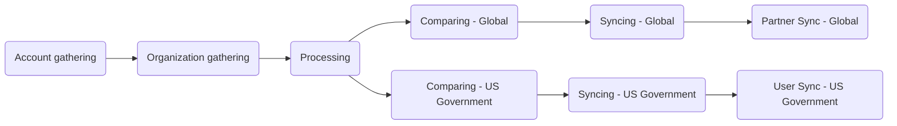

このガイドでは、Zendesk-Salesforce Sync について説明します。これは、Salesforce（信頼できる唯一の情報源）から Zendesk へ、顧客の organization およびユーザーデータを毎時自動で同期するプロセスです。この同期により、Zendesk における正確なサポート権限、適切な SLA の適用、最新の顧客メタデータが保証されます。

この同期は、GitLab CI/CD パイプラインを介して 9 つの連続したステージで実行されます。このドキュメントでは、同期の仕組みを説明し、管理者向けのトラブルシューティングガイダンスを提供します。

管理者は[管理者向けタスク](#administrator-tasks)セクションを確認してください。

{}

- デプロイタイプ: `Ad-hoc`
- プロジェクトリポジトリ:
  - [Salesforce Accounts](https://gitlab.com/gitlab-support-readiness/zd-sfdc-sync/salesforce-accounts)
  - [Zendesk Orgs](https://gitlab.com/gitlab-support-readiness/zd-sfdc-sync/zendesk-orgs)
  - [Processor](https://gitlab.com/gitlab-support-readiness/zd-sfdc-sync/processor)
  - [Global Org Compare](https://gitlab.com/gitlab-support-readiness/zd-sfdc-sync/global-org-compare)
  - [Zendesk Global Org Sync](https://gitlab.com/gitlab-support-readiness/zd-sfdc-sync/zendesk-global-org-sync)
  - [Partner Sync](https://gitlab.com/gitlab-support-readiness/zd-sfdc-sync/partner-sync)
  - [US Government Org Compare](https://gitlab.com/gitlab-support-readiness/zd-sfdc-sync/us-gov-org-compare)
  - [Zendesk US Government Org sync](https://gitlab.com/gitlab-support-readiness/zd-sfdc-sync/zendesk-us-government-org-sync)
  - [Zendesk US Government User Sync](https://gitlab.com/gitlab-support-readiness/zd-sfdc-sync/zendesk-us-gov-user-sync)
- マネージドコンテンツリポジトリ:
  - [Zendesk Global Organization Entitlement Overrides](https://gitlab.com/gitlab-com/support/zendesk-global/organization-entitlement-overrides)

{}

## Zendesk-Salesforce Sync を理解する

### Zendesk-Salesforce Sync とは

Zendesk-Salesforce Sync は、Salesforce から Zendesk へ顧客データを同期する、相互に接続された 9 つの GitLab CI/CD プロジェクトの集合体です。この同期では次を扱います。

- **顧客 organization**: Zendesk Global と US Government の両方について、アカウントメタデータ、サポート権限、サブスクリプションのティア、ARR
- **パートナー organization**: パートナーアカウント向けの個別の同期プロセス（Zendesk Global のみ）
- **ユーザーの関連付け**: Salesforce のコンタクトに基づくユーザーと organization の自動的なリンク付け（Zendesk US Government のみ）

この同期は毎時実行され、収集、処理、比較、同期という連続したステージを通じてデータを処理します。

### Zendesk-Salesforce Sync の仕組み

Zendesk-Salesforce Sync は、すべての Zendesk 本番インスタンスを Salesforce と同期した状態に保つために「ステージ」で実行される、複雑な一連のプロジェクトです。このステージは次のようになっています。



#### Account gathering

<sup>ソースプロジェクト: [Salesforce Accounts](https://gitlab.com/gitlab-support-readiness/zd-sfdc-sync/salesforce-accounts)</sup>

これは、Zendesk-Salesforce Sync のプロセス全体を開始するステージです。ソースプロジェクトのスケジュールされたパイプラインが、毎時 0 分の UTC（`0 * * * *`）に実行されます。これは `bin/gather` スクリプトを使用し、次の処理を行います。

- 次の SOQL クエリを使用して Salesforce アカウントの一覧を取得します
  <details>

  <summary>クリックして展開</summary>

  ```sql
  SELECT
    Account_ID_18__c,
    Name,
    CARR_This_Account__c,
    Type,
    Ultimate_Parent_Sales_Segment_Employees__c,
    Account_Owner_Calc__c,
    Technical_Account_Manager_Name__c,
    Restricted_Account__c,
    Solutions_Architect_Lookup__r.Name,
    Account_Demographics_Geo__c,
    Account_Demographics_Region__c,
    Latest_Sold_To_Contact__r.Email,
    Latest_Sold_To_Contact__r.Name,
    Partner_Track__c,
    Partners_Partner_Type__c,
    Support_Hold__c,
    Account_Risk_Level__c,
    Support_Instance__c,
    (
      SELECT
        Id,
        Name,
        Subscription_ID_18__c,
        Zuora__Status__c,
        Zuora__SubscriptionStartDate__c,
        Zuora__SubscriptionEndDate__c,
        Sold_To_Email__c
      FROM Zuora__Subscriptions__r
      WHERE
        Zuora__Status__c != 'Cancelled' AND
        Zuora__SubscriptionEndDate__c >= #{end_date}
    ),
    (
      SELECT
        Id,
        Name,
        Zuora__SubscriptionRatePlanChargeName__c,
        Zuora__Subscription__c,
        Zuora__EffectiveStartDate__c,
        Zuora__EffectiveEndDate__c,
        Zuora__Quantity__c
      FROM Zuora__R00N40000001lGjTEAU__r
      WHERE
        Subscription_Status__c != 'Cancelled' AND
        Zuora__EffectiveEndDate__c >= #{end_date}
    )
  FROM Account
  WHERE
    Type IN ('Customer', 'Former Customer')
  ```

  </details>

- 見つかったすべての Salesforce アカウントをアカウントオブジェクトに再マッピングします
  - `sales_segment` 属性は `Ultimate_Parent_Sales_Segment_Employees__c` の値から導出されます
    - 値がある場合はすべて小文字に設定します。値がない場合は `unknown` に設定します
  - `region` 属性は `Account_Demographics_Geo__c` と `Account_Demographics_Region__c` の値から導出されます。
    - `Account_Demographics_Geo__c` の値が `AMER`、`APJ`、または `EMEA` の場合は、その値を使用します。
    - それらの値のいずれでもない場合は、`Account_Demographics_Region__c` の値が `AMER`、`APJ`、または `EMEA` であればその値を使用します。
    - それらの値のいずれでもない場合は、`nil` に設定します
  - `restricted` 属性は `Restricted_Account__c` の値から導出されます。
    - `Restricted_Account__c` の値が `Restricted Party` の場合は `true` に設定します。それ以外の場合は `false` に設定します
  - `escalated` 属性は `Account_Risk_Level__c` の値から導出されます。
    - `Account_Risk_Level__c` の値が `At Risk - Escalated` の場合は `true` に設定します。それ以外の場合は `false` に設定します
  - `exception` 属性は `Support_Instance__c` の値から導出されます。
    - `Support_Instance__c` の値が `federal-support` の場合は `true` に設定します。それ以外の場合は `false` に設定します
  - `subs` 属性は `Zuora__Subscriptions__r` の値から導出されます
  - `charges` 属性は `Zuora__R00N40000001lGjTEAU__r` の値から導出されます
- 再マッピングされた Salesforce アカウントを含むアーティファクトファイル（`data/salesforce_accounts.json`）を作成します

実行が完了すると、生成されたアーティファクトファイルは次のステージである [Organization gathering](#organization-gathering)に渡されます。

#### Organization gathering

<sup>ソースプロジェクト: [Zendesk Orgs](https://gitlab.com/gitlab-support-readiness/zd-sfdc-sync/zendesk-orgs)</sup>

このステージは、[Account gathering](#account-gathering)の完了時にトリガーされます。

これは 2 つのスクリプトを使用します。

- `bin/gather_global`
- `bin/gather_us_government`

正確な属性はスクリプトによって異なりますが、両方のスクリプトは基本的に同じように動作します。

- [List organizations](https://developer.zendesk.com/api-reference/ticketing/organizations/organizations/#list-organizations) API エンドポイントを使用して、インスタンスのすべての Zendesk organization を収集します
- 見つかったすべての organization をアカウントオブジェクトにマッピングします
- 再マッピングされた organization を含むアーティファクトファイルを作成します
  - `bin/gather_global` の場合は `data/zendesk_global.json`
  - `bin/gather_us_government` の場合は `data/zendesk_usgov.json`

実行が完了すると、生成されたアーティファクトファイルと、[Account gathering](#account-gathering)で生成されたファイルが、次のステージである [Processing](#processing)に渡されます。

#### Processing

<sup>ソースプロジェクト: [Processor](https://gitlab.com/gitlab-support-readiness/zd-sfdc-sync/processor)</sup>

このステージは、[Organization gathering](#organization-gathering)の完了時にトリガーされます。同期自体に必要なすべての変換を行うため、最も複雑なステージです。

これは `bin/processor` スクリプトを使用し、次の処理を行います。

- 必要なデータを読み込みます
  - マネージドコンテンツプロジェクト [Zendesk Global Organization Entitlement Overrides](https://gitlab.com/gitlab-com/support/zendesk-global/organization-entitlement-overrides) からオーバーライドファイルを取得します
  - `data/plans.yml` ファイルを読み込みます
  - アーティファクトファイルからデータを読み込みます
- 分析・操作されるデータが膨大であるため、ルックアップ構造を生成します

  | 名前 | 説明 | オブジェクトタイプ |
  |------|-------------|-------------|
  | global_orgs_by_id | すべての Global organization を salesforce_id キーを使用して Hash に変換したもの | Hash |
  | usgov_orgs_by_id | すべての US Government organization を salesforce_id キーを使用して Hash に変換したもの | Hash |
  | partners_by_sfdc_id | すべてのパートナー organization の salesforce_id | Array |
  | overrides_by_id | すべてのオーバーライドを salesforce_id キーを使用して Hash に変換したもの | Hash |
  | plan_lookup | すべての製品チャージ名を、それが対応するサブスクリプションタイプに紐付けたもの | Hash |
  | all_valid_plans | あらゆるタイプのアカウントに紐付くすべての製品チャージ名 | Array |
  | usgov_plan_names_for_exceptions | 例外を持つ US Government アカウントに紐付くすべての製品チャージ名 | Array |
  | usgov_plan_names | 例外を持たない US Government アカウントに紐付くすべての製品チャージ名 | Array |
  | today | 今日の日付 | Date |
  | expired_end_date | 15 日前 | Date |
  | three_years_out | 3 年と 1 日前 | Date |

- 各アカウントの Global オブジェクトを決定します
  - Zendesk organization の属性に対応する Hash を作成します
  - 対応する Salesforce アカウントのすべてのサブスクリプションを分析します
    - まず、アカウントの US Government 例外設定に応じて Global オブジェクトに適用されるサブスクリプションのみを選択します
    - 次に各サブスクリプションを反復処理し、アカウントのサブスクリプションに紐付く製品チャージ名に基づいてオブジェクトのサブスクリプション値を決定します
  - すべての製品チャージの有効終了日の最大値に基づいて `expiration_date` の値を設定します
  - アカウントに対してオーバーライドが記載されているかをチェックします（そしてそれに応じてオブジェクトを修正します）
  - オブジェクトの support_level を、最も高いサポートレベルに設定します
    - Ultimate > Gold > Premium > Silver > Consumption Only > Custom > Community > Expired
  - オブジェクトが expired の `support_level` を持つと示されていない限り、オブジェクトの `type` を `customer` に設定します
  - オブジェクトが expired の `support_level` を持つと示されている場合は、オブジェクトの `aar` を 0 に設定します
  - オブジェクトの `sub_ss_enterprise` が true の場合は、`sub_ss_ase` の値を true に設定します
  - オブジェクトの `expiration_date` とルックアップオブジェクト `three_years_out` の値との関係をチェックすることで、そのアカウントを同期に含めるべきかどうかを判定します（前者が後者より小さい場合は含めません）
- 各アカウントの US Government オブジェクトを決定します
  - Zendesk organization の属性に対応する Hash を作成します
  - 対応する Salesforce アカウントのすべてのサブスクリプションを分析します
    - まず、アカウントの US Government 例外設定に応じて US Government オブジェクトに適用されるサブスクリプションのみを選択します
    - 次に各サブスクリプションを反復処理し、アカウントのサブスクリプションに紐付く製品チャージ名に基づいてオブジェクトのサブスクリプション値を決定します
  - すべての製品チャージの有効終了日の最大値に基づいて `expiration_date` の値を設定します
  - アカウントに対してオーバーライドが記載されているかをチェックします（そしてそれに応じてオブジェクトを修正します）
  - オブジェクトの support_level を、最も高いサポートレベルに設定します
    - Ultimate > Gold > Premium > Silver > Consumption Only > Custom > Community > Expired
  - オブジェクトが expired の `support_level` を持つと示されていない限り、オブジェクトの `type` を `customer` に設定します
  - オブジェクトが expired の `support_level` を持つと示されている場合は、オブジェクトの `arr` を 0 に設定します
  - オブジェクトの `usgov_fedramp` の値が true の場合は、オブジェクトの `sub_gitlab_dedicated` と `sub_usgov_24x7` を true に設定します
  - オブジェクトに対応するスケジュールを設定します（12x5 か 24x7 か）
  - オブジェクトの `expiration_date` とルックアップオブジェクト `three_years_out` の値との関係をチェックすることで、そのアカウントを同期に含めるべきかどうかを判定します（前者が後者より小さい場合は含めません）
- さまざまなオブジェクトからアーティファクトファイルを作成します。
  - Global オブジェクト向けの `data/global_accounts.json`
  - US Government オブジェクト向けの `data/usgov_accounts.json`

実行が完了すると、2 つの個別のステージがトリガーされます。

- [Comparing - Global](#comparing---global)。[Organization gathering](#organization-gathering)からのアーティファクトファイルと `data/global_accounts.json` を渡します
- [Comparing - US Government](#comparing---us-government)。[Organization gathering](#organization-gathering)からのアーティファクトファイルと `data/usgov_accounts.json` を渡します

#### Comparing - Global

<sup>ソースプロジェクト: [Global Org Compare](https://gitlab.com/gitlab-support-readiness/zd-sfdc-sync/global-org-compare)</sup>

このステージは、[Processing](#processing)の完了時にトリガーされます。

これは `bin/compare` スクリプトを使用し、次の処理を行います。

- アーティファクトファイルからデータを読み込みます
- `salesforce_id`（Zendesk organization と organization オブジェクトを紐付けるフィールド）を統一フィールドとして使用し、すべてのデータを比較にかけて 3 つの配列を生成します。
  - `zendesk_only_objects`。一致する organization オブジェクトがない Zendesk organization に相当します
  - `ssot_only_objects`。一致する Zendesk organization がない organization オブジェクトに相当します
  - `different_objects`。一致する Zendesk organization があるが、両者のデータが等しくない organization オブジェクトに相当します
- 続いて 3 つのアーティファクトを生成します。
  - `data/global_updates.json`。`different_objects` 内の項目を含みます
  - `data/global_creates.json`。`ssot_only_objects` 内の項目から、`support_level` が `expired` のものを除いたものを含みます
  - `data/global_not_in_sync.json`。`zendesk_only_objects` 内の項目から、次を除いたものを含みます。
    - `type` が `alliance_partner`、`open_partner`、または `select_partner` のもの
    - `protected_ids` 関数で定義された配列に含まれる `salesforce_id` を持つもの

実行が完了すると、生成されたアーティファクトファイルは次のステージである [Syncing - Global](#syncing---global)に渡されます。

#### Comparing - US Government

<sup>ソースプロジェクト: [US Government Org Compare](https://gitlab.com/gitlab-support-readiness/zd-sfdc-sync/us-gov-org-compare)</sup>

このステージは、[Processing](#processing)の完了時にトリガーされます。

これは `bin/compare` スクリプトを使用し、次の処理を行います。

- アーティファクトファイルからデータを読み込みます
- `salesforce_id`（Zendesk organization と organization オブジェクトを紐付けるフィールド）を統一フィールドとして使用し、すべてのデータを比較にかけて 3 つの配列を生成します。
  - `zendesk_only_objects`。一致する organization オブジェクトがない Zendesk organization に相当します
  - `ssot_only_objects`。一致する Zendesk organization がない organization オブジェクトに相当します
  - `different_objects`。一致する Zendesk organization があるが、両者のデータが等しくない organization オブジェクトに相当します
- 続いて 3 つのアーティファクトを生成します。
  - `data/usgov_updates.json`。`different_objects` 内の項目を含みます
  - `data/usgov_creates.json`。`ssot_only_objects` 内の項目から、`support_level` が `expired` のものを除いたものを含みます
  - `data/usgov_not_in_sync.json`。`zendesk_only_objects` 内の項目から、次を除いたものを含みます。
    - `protected_ids` 関数で定義された配列に含まれる `salesforce_id` を持つもの

実行が完了すると、生成されたアーティファクトファイルは次のステージである [Syncing - US Government](#syncing---us-government)に渡されます。

#### Syncing - Global

<sup>ソースプロジェクト: [Zendesk Global Org Sync](https://gitlab.com/gitlab-support-readiness/zd-sfdc-sync/zendesk-global-org-sync)</sup>

このステージは、[Comparing - Global](#comparing---global)の完了時にトリガーされます。

これは `bin/sync` スクリプトを使用し、次の処理を行います。

- アーティファクトファイルからデータを読み込みます
- `data/global_creates.json` アーティファクトファイルのオブジェクトの一覧を反復処理し、次を行います。
  - Zendesk の [Create Organization](https://developer.zendesk.com/api-reference/ticketing/organizations/organizations/#create-organization) API エンドポイントを使用して organization を作成します
  - `sold_tos` 属性のユーザーを、新しく作成された organization に関連付けます
    - ユーザーを関連付けられなかった場合は、Customer Support Operations チームに通知するために [#support_operations Slack チャンネル](https://gitlab.enterprise.slack.com/archives/C018ZGZAMPD)に投稿が行われます
- `data/global_updates.json` アーティファクトファイルのオブジェクトを（API の制限により最大 100 件の）バッチに分割し、次を行います。
  - Zendesk の [Update Many Organizations](https://developer.zendesk.com/api-reference/ticketing/organizations/organizations/#update-many-organizations) API エンドポイントを使用して更新ジョブを作成します（事前に決定された内容に合わせて更新するため）
- `data/global_not_in_sync.json` アーティファクトファイルのオブジェクトを（API の制限により最大 100 件の）バッチに分割し、次を行います。
  - Zendesk の [Update Many Organizations](https://developer.zendesk.com/api-reference/ticketing/organizations/organizations/#update-many-organizations) API エンドポイントを使用して更新ジョブを作成します（削除対象としてマークするために更新するため）

実行が完了すると、次のステージである [Partner Sync - Global](#partner-sync---global)がトリガーされます。

#### Syncing - US Government

<sup>ソースプロジェクト: [Zendesk US Government Org sync](https://gitlab.com/gitlab-support-readiness/zd-sfdc-sync/zendesk-us-government-org-sync)</sup>

このステージは、[Comparing - US Government](#comparing---us-government)の完了時にトリガーされます。

これは `bin/sync` スクリプトを使用し、次の処理を行います。

- アーティファクトファイルからデータを読み込みます
- `data/usgov_creates.json` アーティファクトファイルのオブジェクトの一覧を反復処理し、次を行います。
  - Zendesk の [Create Organization](https://developer.zendesk.com/api-reference/ticketing/organizations/organizations/#create-organization) API エンドポイントを使用して organization を作成します
- `data/usgov_updates.json` アーティファクトファイルのオブジェクトを（API の制限により最大 100 件の）バッチに分割し、次を行います。
  - Zendesk の [Update Many Organizations](https://developer.zendesk.com/api-reference/ticketing/organizations/organizations/#update-many-organizations) API エンドポイントを使用して更新ジョブを作成します（事前に決定された内容に合わせて更新するため）
- `data/usgov_not_in_sync.json` アーティファクトファイルのオブジェクトを（API の制限により最大 100 件の）バッチに分割し、次を行います。
  - Zendesk の [Update Many Organizations](https://developer.zendesk.com/api-reference/ticketing/organizations/organizations/#update-many-organizations) API エンドポイントを使用して更新ジョブを作成します（削除対象としてマークするために更新するため）

実行が完了すると、次のステージである [User Sync - US Government](#user-sync---us-government)がトリガーされます。

#### Partner Sync - Global

<sup>ソースプロジェクト: [Partner Sync](https://gitlab.com/gitlab-support-readiness/zd-sfdc-sync/partner-sync)</sup>

このステージは、[Syncing - Global](#syncing---global)の完了時にトリガーされます。Zendesk Global の観点から見た Zendesk-Salesforce Sync の最終ステージとして機能します。

このステージは複数スクリプトのプロセスです。

1. `bin/salesforce`。次の処理を行います。
   - 次の SOQL クエリを使用して Salesforce アカウントの一覧を取得します
     <details>

     <summary>クリックして展開</summary>

     ```sql
     SELECT
       Account_ID_18__c,
       Name,
       Account_Owner_Calc__c,
       Technical_Account_Manager_Name__c,
       Restricted_Account__c,
       Solutions_Architect_Lookup__r.Name,
       Partner_Track__c,
       Support_Hold__c,
       Account_Risk_Level__c,
       Type,
       Partners_Partner_Status__c
     FROM Account
     WHERE
       Account_ID_18__c = 'REDACTED' OR
       (
         Type = 'Partner' AND
         Partners_Partner_Status__c IN ('Authorized') AND
         Partner_Track__c IN ('Open', 'Select')
       )
     ```

     </details>

   - 見つかったすべての Salesforce アカウントをアカウントオブジェクトに再マッピングします
     - `account_type` 属性は `Partner_Track__c` と `Account_ID_18__c` の値から導出されます。
       - `Account_ID_18__c` が特定の Salesforce アカウントの値である場合は `alliance_partner` に設定します
       - `Partner_Track__c` が `Open` の場合は `open_partner` に設定します
       - `Partner_Track__c` が `Select` の場合は `select_partner` に設定します
       - 上記の一致する基準がない場合は `nil` に設定します
     - `restricted_account` 属性は `Restricted_Account__c` の値から導出されます。
       - `Restricted_Account__c` の値が `Restricted Party` の場合は `true` に設定します。それ以外の場合は `false` に設定します
     - `org_in_escalated_state` 属性は `Account_Risk_Level__c` の値から導出されます。
       - `Account_Risk_Level__c` の値が `At Risk - Escalated` の場合は `true` に設定します。それ以外の場合は `false` に設定します
   - 再マッピングされた Salesforce アカウントを含むアーティファクトファイル（`data/salesforce_accounts.json`）を作成します
1. `bin/zendesk`。次の処理を行います。
   - [List organizations](https://developer.zendesk.com/api-reference/ticketing/organizations/organizations/#list-organizations) API エンドポイントを使用して、インスタンスのすべての Zendesk organization を収集します
   - パートナータイプ以外の organization（`account_type` が `alliance_partner`、`open_partner`、または `select_partner` のいずれか）を除外します
   - 残りのすべての organization を organization オブジェクトにマッピングします
   - 再マッピングされた organization を含むアーティファクトファイル（`data/zendesk_orgs.json`）を作成します
1. `bin/compare`。次の処理を行います。
   - アーティファクトファイルからデータを読み込みます
   - `salesforce_id`（Zendesk organization と organization オブジェクトを紐付けるフィールド）を統一フィールドとして使用し、すべてのデータを比較にかけて 3 つの配列を生成します。
     - `zendesk_only_objects`。一致する organization オブジェクトがない Zendesk organization に相当します
     - `ssot_only_objects`。一致する Zendesk organization がない organization オブジェクトに相当します
     - `different_objects`。一致する Zendesk organization があるが、両者のデータが等しくない organization オブジェクトに相当します
   - 続いて 3 つのアーティファクトを生成します。
     - `data/updates.json`。`different_objects` 内の項目を含みます
     - `data/creates.json`。`ssot_only_objects` 内の項目を含みます
     - `data/not_in_sync.json`。`zendesk_only_objects` 内の項目を含みます
1. `bin/sync`。次の処理を行います。
   - アーティファクトファイルからデータを読み込みます
   - `data/creates.json` アーティファクトファイルのオブジェクトの一覧を反復処理し、次を行います。
     - Zendesk の [Create Organization](https://developer.zendesk.com/api-reference/ticketing/organizations/organizations/#create-organization) API エンドポイントを使用して organization を作成します
   - `data/updates.json` アーティファクトファイルのオブジェクトを（API の制限により最大 100 件の）バッチに分割し、次を行います。
     - Zendesk の [Update Many Organizations](https://developer.zendesk.com/api-reference/ticketing/organizations/organizations/#update-many-organizations) API エンドポイントを使用して更新ジョブを作成します（事前に決定された内容に合わせて更新するため）
   - `data/not_in_sync.json` アーティファクトファイルのオブジェクトを（API の制限により最大 100 件の）バッチに分割し、次を行います。
     - Zendesk の [Update Many Organizations](https://developer.zendesk.com/api-reference/ticketing/organizations/organizations/#update-many-organizations) API エンドポイントを使用して更新ジョブを作成します（削除対象としてマークするために更新するため）

#### User Sync - US Government

<sup>ソースプロジェクト: [Zendesk US Government User Sync](https://gitlab.com/gitlab-support-readiness/zd-sfdc-sync/zendesk-us-gov-user-sync)</sup>

このステージは、[Syncing - US Government](#syncing---us-government)の完了時にトリガーされます。Zendesk US Government の観点から見た Zendesk-Salesforce Sync の最終ステージとして機能します。

このステージは複数スクリプトのプロセスです。

1. `bin/zendesk_orgs_gather`。次の処理を行います。
   - [List organizations](https://developer.zendesk.com/api-reference/ticketing/organizations/organizations/#list-organizations) API エンドポイントを使用して、インスタンスのすべての Zendesk organization を収集します
   - すべての organization を organization オブジェクトにマッピングします
   - 再マッピングされた organization を含むアーティファクトファイル（`data/zendesk_orgs.json`）を作成します
1. `bin/zendesk_users_gather`。次の処理を行います。
   - [List Users](https://developer.zendesk.com/api-reference/ticketing/users/users/#list-users) API エンドポイントを使用して、インスタンスのすべての Zendesk ユーザーを収集します
   - すべての保護されたユーザー（メールドメインが `gitlab.com` のもの、または管理対象のエンドユーザーのメールアドレスを持つもの）を除外します
   - すべてのユーザーをユーザーオブジェクトにマッピングします
   - 再マッピングされたユーザーを含むアーティファクトファイル（`data/zendesk_users.json`）を作成します
1. `bin/salesforce`。次の処理を行います。
   - アーティファクトファイル `data/zendesk_orgs.json` を読み込み、`salesforce_id` の値のみを含む 500 件単位のチャンク（SOQL の制限による）に一覧を分割します
   - 次の SOQL クエリを使用して Salesforce コンタクトの一覧を取得します
     <details>

     <summary>クリックして展開</summary>

     ```sql
     SELECT
       Name,
       Email,
       Account.Account_ID_18__c
     FROM Contact
     WHERE
       Inactive_Contact__c = false AND
       Role__c INCLUDES ('Gitlab Admin') AND
       Name != '' AND
       Email != '' AND
       Account.Account_ID_18__c IN (#{chunk.map { |i| "'#{i}'" }.join(',')})
     ```

     </details>

     - `chunk` の部分は、各チャンク内の `salesforce_id` の値の一覧です
   - 見つかったすべての Salesforce コンタクトをコンタクトに再マッピングします
     - `organization_id` 属性は、`salesforce_id` の値が一致する Zendesk organization の `id` の値から導出されます
   - 無効なコンタクトを削除します
     - `email` の値がないもの
     - 重複するもの（`email` の値で一致）
   - 再マッピングされた Salesforce コンタクトを含むアーティファクトファイル（`data/salesforce_contacts.json`）を作成します
1. `bin/compare`。次の処理を行います。
   - アーティファクトファイルからデータを読み込みます
   - `email`（Zendesk ユーザーとユーザーオブジェクトを紐付けるフィールド）を統一フィールドとして使用し、すべてのデータを比較にかけて 3 つの配列を生成します。
     - `zendesk_only_objects`。一致する organization オブジェクトがない Zendesk organization に相当します
     - `ssot_only_objects`。一致する Zendesk organization がない organization オブジェクトに相当します
     - `different_objects`。一致する Zendesk organization があるが、両者のデータが等しくない organization オブジェクトに相当します
   - 続いて 3 つのアーティファクトを生成します。
     - `data/updates.json`。`different_objects` 内の項目を含みます
     - `data/creates.json`。`ssot_only_objects` 内の項目を含みます
     - `data/not_in_sync.json`。`zendesk_only_objects` 内の項目を含みます
1. `bin/sync`。次の処理を行います。
   - アーティファクトファイルからデータを読み込みます
   - `data/creates.json` アーティファクトファイルのオブジェクトの一覧を反復処理し、次を行います。
     - Zendesk の [Create User](https://developer.zendesk.com/api-reference/ticketing/users/users/#create-user) API エンドポイントを使用してユーザーを作成します
   - `data/updates.json` アーティファクトファイルのオブジェクトを（API の制限により最大 100 件の）バッチに分割し、次を行います。
     - Zendesk の [Update Many Users](https://developer.zendesk.com/api-reference/ticketing/users/users/#update-many-users) API エンドポイントを使用して更新ジョブを作成します（事前に決定された内容に合わせて更新するため）
   - `data/not_in_sync.json` アーティファクトファイルのオブジェクトを（API の制限により最大 100 件の）バッチに分割し、次を行います。
     - Zendesk の [Update Many Users](https://developer.zendesk.com/api-reference/ticketing/users/users/#update-many-users) API エンドポイントを使用して更新ジョブを作成します（削除対象としてマークするために更新するため）

## 管理者向けタスク

{}

- このアクションには、Zendesk-Salesforce Sync プロジェクトへの `Developer` レベルのアクセス権が必要です。

{}

### Zendesk-Salesforce Sync を修正する

{}

- これは、該当するリクエスト issue（Feature Request、Administrative、Bug など）がある場合にのみ行うべきです。存在しない場合は、まず作成し（そして対応する前に標準のプロセスを通すようにしてください）。

{}

Zendesk-Salesforce Sync を修正するには、該当するプロジェクトリポジトリ（どれになるかは行う変更によって異なります）で MR を作成する必要があります。実際に行う変更は、リクエスト自体によって異なります。

ピアが MR をレビューして承認した後、MR をマージできます。これは `Ad-hoc` デプロイタイプであるため、変更は次回のスケジュール実行で使用されます。

#### どこにどの変更が発生するかのクイックリファレンス

- SKU の変更: 詳細については [SKU Mapping documentation](/handbook/security/customer-support-operations/salesforce/skus)を参照してください
- 権限計算の変更: 修正は [Processor](https://gitlab.com/gitlab-support-readiness/zd-sfdc-sync/processor) プロジェクトで発生します
- パイプラインスケジュールの修正: 修正は [Salesforce Accounts](https://gitlab.com/gitlab-support-readiness/zd-sfdc-sync/salesforce-accounts) プロジェクトで発生します
- オブジェクト属性の修正: 修正は _すべての_ プロジェクトで発生する可能性があります

## よくある問題とトラブルシューティング

### Runner エラー

これには、ランナーの完全な失敗やタイムアウトなどが含まれます。これらが発生した場合、取りうる対応は 2 つあります。

- 同期を最初から再起動する
- 同期の次回実行を待つ

問題が実行の早い段階（毎時の最初の 5 〜 10 分以内）で発生した場合は、再起動することは許容される対応です。それより遅い場合は、同期の次回実行を待つべきです。

これが繰り返し発生する場合は、Fullstack Engineer に通知するために issue を提出してください。

### 長時間実行されるジョブ

プロセス全体が 45 分を超えることは決してないはずです。長時間実行ジョブに関するアラートが発生した場合の最善の対応は、次のいずれかを行うことです。

- 古い方のパイプラインをキャンセルする
- 新しい方のパイプラインをキャンセルする

残った方が（キャッシュは使用されていないため）これを処理でき、自己修正するはずです。

これが繰り返し発生する場合は、Fullstack Engineer に通知するために issue を提出してください。

### データの不一致

これらは、計算の問題か期待値の問題のいずれかであるため、解決が複雑になることがあります。実際にデータの不一致（つまり計算の問題）があるのか、それとも単に期待値の問題なのかを判断するには、ソース（Salesforce、Zendesk）のデータを慎重にレビューする必要があります。

- 計算の問題の場合は、Fullstack Engineer に通知するためにバグレポートを提出してください。
- 期待値の問題の場合は、差異とその値である理由を説明してください。
  - その議論の結果、計算を変更したいという要望に至った場合は、報告者に feature request の issue を提出してもらってください。

### スクリプトエラー

これに使用されるさまざまなスクリプトは、可能な限り詳細な情報を提供しようとする方法でコーディングされています。スクリプトエラーに遭遇した場合は、まずそれが実際にスクリプトエラーなのか、それとも単にネットワークの問題（がスクリプトエラーを引き起こしているの）なのかを判断する必要があります。

最も確実な方法は、過去の同期の実行とその後の実行を確認することです。真のスクリプトエラーは毎回繰り返されます。毎回発生していない場合は、ネットワークの問題です。

- ネットワークの問題の場合は、[Runner エラー](#runner-errors)を参照してください
- 真のスクリプトエラーの場合は、Fullstack Engineer に通知するために issue を提出してください
