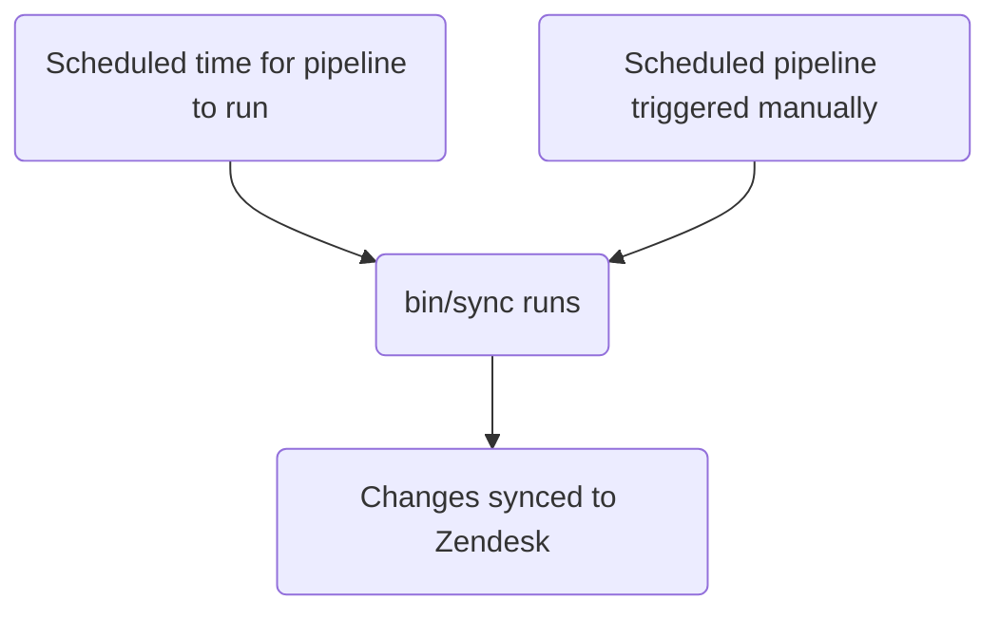

このガイドでは、GitLab における Zendesk オートメーションの作成、編集、管理方法について説明します。管理者は[管理者タスク](#administrator-tasks)セクションを確認してください。

エージェントが手動で適用する[マクロ](../macros/)や、チケットイベントで即座に発火するトリガーとは異なり、オートメーションは時間ベースのスケジュールで実行されます。

{}

- デプロイメントタイプ: `Standard`
- 同期リポジトリ
  - [Zendesk Global](https://gitlab.com/gitlab-support-readiness/zendesk-global/automations)
  - [Zendesk US Government](https://gitlab.com/gitlab-support-readiness/zendesk-us-government/automations)
- 管理コンテンツリポジトリ
  - [Zendesk Global](https://gitlab.com/gitlab-com/support/zendesk-global/automations)
  - [Zendesk US Government](https://gitlab.com/gitlab-com/support/zendesk-us-government/automations)

{}

## オートメーションを理解する

### オートメーションとは

[Zendesk](https://support.zendesk.com/hc/en-us/articles/4408832701850-About-automations-and-how-they-work) によると:

> オートメーションはトリガーに似ています。両者ともチケットのプロパティを変更し、オプションで顧客やエージェントにメール通知を送信する条件とアクションを定義するためです。両者の違いは、オートメーションはチケットが作成または更新された直後ではなく、チケットのプロパティが設定または更新された後に時間イベントが発生したときに実行されることです。

簡単に言えば、オートメーションは即座に実行されないトリガーです。イベントベースではなく時間ベースです。

### Zendesk でオートメーションが実行されるタイミング

公式には、Zendesk のオートメーションは 1 時間に 1 回実行されます。正確なタイミングは確定的ではありませんが、私たちの Zendesk の使用経験では、これはインスタンスのタイムゾーンで毎時の開始時（5 分程度以内）に発生することが示されています。

### オートメーションは条件ロジックを使用する

オートメーションは条件ロジックを使用します:

- `all`: 配列内のすべての条件が true である必要があります（AND ロジック）
- `any`: 少なくとも 1 つの条件が true である必要があります（OR ロジック）
- 1 つのセットだけ、または両方のセットを使用できます（ただし少なくとも 1 つのセットを使用する必要があります）

### 私たちのオートメーションの管理方法

Zendesk は UI を通じてオートメーションを完全に管理する方法を提供していますが、私たちはよりバージョン管理されたメソドロジーを採用しています。これにより、定められたレビュープロセス、必要に応じたロールバック実行などが可能になります。

そのため、私たちは同期リポジトリと管理コンテンツリポジトリを利用しています。

### 同期リポジトリの仕組み

同期リポジトリのワークフローは以下のプロセスに従います:



#### 人間が読みやすい置換

{}

- YAML ファイル経由でオートメーションを作成/編集する `administrators` にのみ適用されます

{}

現在、同期リポジトリは、人間が読みやすい項目から「Zendesk」相当の項目への、さまざまな項目の置換を実行できます。これには次のものが含まれます:

| 人間が読みやすい項目 | Zendesk フィールド項目 | 条件/アクションの場所 | 注 |
|---------------------|--------------------|-----------------|-------|
| `'Brand: XXX'` | `brand_id` | `value` | `XXX` をブランドの `name` に置き換えます |
| `'Field: XXX'` | `custom_fields_xxx` | `field` | `XXX` をチケットフィールドの `title` に置き換えます |
| `'Group: XXX'` | `group_id` | `value` | `XXX` をグループの `name` に置き換えます |
| `'XXX'` | `role` | `value` | `XXX` をロールタイプの `name` または依頼者のメールアドレスに置き換えます |
| `'Form: XXX'` | `ticket_form_id` | `value` | `XXX` をチケットフォームの `name` に置き換えます |
| `'Schedule: XXX'` | `set_schedule` | `value` | `XXX` をスケジュールの `name` に置き換えます |
| `'Schedule: XXX'` | `schedule_id` | `value` | `XXX` をスケジュールの `name` に置き換えます |
| `'XXX'` | `organization_id` | `value` | `XXX` を組織の `salesforce_id` 属性に置き換えます |
| `'XXX'` | `assignee_id` | `value` | `XXX` をエージェントのメールアドレスに置き換えます |
| `'XXX'` | `satisfaction_reason_code` | `value` | `XXX` を満足度理由の `name` に置き換えます |
| `'XXX'` | `via_id` | `value` | `XXX` を via タイプの `name` に置き換えます |
| `'XXX'` | `requester_role` | `value` | `XXX` を依頼者ロールタイプの `name` に置き換えます |
| `'Target: XXX'` | `notification_target` | `value` | `XXX` をターゲットの `name` に置き換えます |
| `'Webhook: XXX'` | `notification_webhook` | `value` | `XXX` を Webhook の `name` に置き換えます |

例として、`Preferred Region for Support` フィールドの値を `AMER` に変更するオートメーションを作成したい場合は、置換を使用して次のようにします:

```yaml
- field: 'Field: Preferred Region for Support'
  value: 'AMER'
```

別の例として、チケットのフォームが `SaaS` フォームではないかをチェックする条件が必要な場合は、次のようにします:

```yaml
- field: 'ticket_form_id'
  operator: 'is_not'
  value: 'Form: SaaS'
```

#### 同期リポジトリで MR を作成する場合 {#when-creating-mrs-in-the-sync-repo}

同期リポジトリで MR が作成されると、（`bin/compare` スクリプト経由で）比較アクションが実行されます。これは次のことを行います:

1. 管理コンテンツリポジトリのクローンを実行します
1. Zendesk インスタンスからすべてのオートメーション、ブランド、グループ、満足度理由、スケジュール、ターゲット、チケットフィールド、チケットフォーム、Webhook を取得します
1. 同期リポジトリ内のすべての YAML ファイルをレビューして、オートメーションオブジェクトを生成します
   - 同期リポジトリのファイルに次の問題がいずれも存在しないことを確認するためにもチェックします:
     - タイトルが欠けている
     - `active` 属性が `false` のファイルが `active` フォルダにない
     - `active` 属性が `true` のファイルが `inactive` フォルダにない
     - `title` 属性の重複した使用がある
     - `contains_managed_content` 属性が `true` のファイルが、対応する管理コンテンツファイルを持っている
     - `contains_managed_webhook` 属性が `true` のファイルが、対応する管理コンテンツファイルを持っている
1. すべての YAML ファイルからのオートメーションオブジェクトを、対応する Zendesk アイテム（属性 `title` および `previous_title` の値をチェックして判定）と比較します
   - 存在しない場合、後で使用するために変数に作成オブジェクトを格納します
   - 存在するが属性値が異なる場合、後で使用するために変数に更新オブジェクトを格納します
1. 比較レポートを出力します

#### Zendesk への同期

同期リポジトリは、プロジェクトのスケジュールパイプラインが実行される（正しいタイミングまたは手動で実行される）と同期タスクを実行します。

いずれかのアクションが発生すると、同期は[比較アクション](#when-creating-mrs-in-the-sync-repo)を実行し、生成されたオブジェクトを使用して、必要な Zendesk エンドポイントにヒットするループを介して、必要な作成と更新を実行します:

- [Creates](https://developer.zendesk.com/api-reference/ticketing/business-rules/automations/#create-automation)
- [Updates](https://developer.zendesk.com/api-reference/ticketing/business-rules/automations/#update-automation)

#### 孤立した管理コンテンツファイルのレポート

2 月、5 月、8 月、11 月の 1 日に、[スケジュールパイプライン](https://docs.gitlab.com/ci/pipelines/schedules/)により、同期リポジトリは Support リーダーシップチームがすべての孤立した管理コンテンツファイルをレビューするための Issue を作成します。

これは同期リポジトリの `bin/find_orphaned_files` スクリプト経由で行われ、次のことを行います:

1. 管理コンテンツリポジトリのクローンを実行します
1. 管理コンテンツリポジトリの `active` および `inactive` フォルダ内のすべてのファイルをレビューして、`state`（つまり `active` または `inactive`）、`path`、`title` を判定します
1. 同期リポジトリ自体の `active` および `inactive` フォルダ内のすべてのファイルをレビューして、次のことを判定します:
   - ファイルが管理コンテンツファイルを使用しているか
   - 管理コンテンツファイルがあるか
1. 同期リポジトリのファイルなしで管理コンテンツファイルが見つかった場合、それを Customer Support リーダーシップにレポートする Issue を作成します

## 管理者以外の立場でオートメーションを作成する

オートメーションの作成については、[Feature Request issue](https://gitlab.com/gitlab-com/gl-security/corp/cust-support-ops/issue-tracker/-/issues/new?description_template=Feature) を作成してください（Customer Support Operations チームによる手動対応が必要なため）。

## 管理者以外の立場でオートメーションを編集する

### オートメーションで使用するコメントの文言を変更する

オートメーション内のコメントの文言を編集するには、管理コンテンツリポジトリの対応するファイルを変更します。`master` ブランチにマージされると、次のデプロイメントサイクルで取り込まれて Zendesk にデプロイされます。

### オートメーションで使用するペイロードを変更する

オートメーション内のペイロード（管理 Webhook を使用しているもの）を編集するには、管理コンテンツリポジトリの対応するファイルを変更します。`master` ブランチにマージされると、次のデプロイメントサイクルで取り込まれて Zendesk にデプロイされます。

### タイトル、コメント以外の文言アクションなどを変更する

オートメーションの他の項目を変更するには、[Feature Request issue](https://gitlab.com/gitlab-com/gl-security/corp/cust-support-ops/issue-tracker/-/issues/new?description_template=Feature) を作成してください（Customer Support Operations チームによる手動対応が必要なため）。

## 管理者以外の立場でオートメーションを非アクティブ化する

オートメーションの非アクティブ化を依頼するには、[Feature Request issue](https://gitlab.com/gitlab-com/gl-security/corp/cust-support-ops/issue-tracker/-/issues/new?description_template=Feature) を作成してください（Customer Support Operations チームによる手動対応が必要なため）。

## 管理者タスク {#administrator-tasks}

{}

- このセクションのすべての項目には、Zendesk への `Administrator` レベルのアクセスが必要です。

{}

### オートメーションの使用情報を確認する

オートメーションの使用情報を確認するには:

1. Zendesk インスタンスの管理パネルに移動します
1. `Objects and rules > Business rules > Automations` に移動します
1. 「Add automation」ボタンの左側のアイコンをクリックします（AZ が入った円のように見えます）
1. 表示したい使用列をクリックします

### オートメーションを作成する

{}

- これは、対応する Issue（Feature Request、Administrative、Bug 等）がある場合にのみ実施してください。存在しない場合は、まず Issue を作成し（標準プロセスに従って処理されるのを待ってから）作業してください。
- 管理コンテンツファイルを使用するオートメーションを作成する場合は、先に当該管理コンテンツファイルを作成する必要があります。

{}

オートメーションを作成するには、同期リポジトリで MR を作成する必要があります。具体的な変更内容は、依頼自体に依存します。利用可能な開始テンプレートは以下のとおりです:

```yaml
---
title: 'Your::Title::Here'
previous_title: 'Your::Title::Here'
description: 'Your description here'
active: true
position: 1 # Integer representing automation position
actions:
- field: 'the_action_to_perform'
  value: 'the_value_to_use'
conditions:
  all:
  - field: 'the_action_to_perform'
    operator: 'the_operator_to_use'
    value: 'the_value_to_use'
  any:
  - field: 'the_action_to_perform'
    operator: 'the_operator_to_use'
    value: 'the_value_to_use'
contains_managed_content: false
contains_managed_email: false
contains_managed_webhook: false
```

ピアによるレビューと承認の後、MR をマージできます。次のデプロイメントが行われる際に、Zendesk に同期されます。

### オートメーションを編集する

{}

- これは、対応する Issue（Feature Request、Administrative、Bug 等）がある場合にのみ実施してください。存在しない場合は、まず Issue を作成し（標準プロセスに従って処理されるのを待ってから）作業してください。
- オートメーションの `contains_managed_content` または `contains_managed_webhook` 属性を `false` から `true` に変更する場合は、先に当該管理コンテンツファイルを作成する必要があります。
- オートメーションの `contains_managed_content` または `contains_managed_webhook` 属性を `true` から `false` に変更する場合は、対応する管理コンテンツファイルを削除するためのフォローアップ MR を作成してください。

{}

オートメーションを編集するには、同期リポジトリで MR を作成する必要があります。具体的な変更内容は、依頼自体に依存します。

ピアによるレビューと承認の後、MR をマージできます。次のデプロイメントが行われる際に、Zendesk に同期されます。

#### オートメーションのタイトルを変更する

オートメーションのタイトルを変更する必要がある場合は、現在の値を `previous_title` 属性にコピーしてから `title` 属性を変更します。これにより、同期処理が対象のオートメーションを引き続き特定して更新できます。

### オートメーションを非アクティブ化する

{}

- これは、対応する Issue（Feature Request、Administrative、Bug 等）がある場合にのみ実施してください。存在しない場合は、まず Issue を作成し（標準プロセスに従って処理されるのを待ってから）作業してください。
- オートメーションが管理コンテンツファイルを使用していた場合（つまり、YAML ファイルの `contains_managed_content` または `contains_managed_webhook` 属性が以前 `true` に設定されていた場合）、おそらく管理コンテンツリポジトリ内の対応するファイルも `active` から `inactive` の場所に移動する必要があります。

{}

オートメーションを非アクティブ化するには、同期リポジトリで MR を作成する必要があります。この MR では、対応するオートメーションの YAML ファイルに対して次の操作を行うべきです:

1. ファイルを `active` から `inactive` パスに移動します
1. `active` 属性の値を `false` に変更します
1. `actions` の値を次のように変更します:
   - Zendesk Global の場合:

     ```yaml
     - field: 'current_tags'
       value: 'missing_brand'
     ```

   - Zendesk US Government の場合:

     ```yaml
     - field: 'current_tags'
       value: 'missing_brand'
     ```

1. `conditions` の値を次のように変更します:
   - Zendesk Global の場合:

     ```yaml
       all:
       - field: 'brand_id'
         operator: 'is_not'
         value: 'GitLab Support'
       - field: 'brand_id'
         operator: 'is_not'
         value: 'GitLab - Internal'
       - field: 'current_tags'
         operator: 'not_includes'
         value: 'missing_brand'
       - field: 'status'
         operator: 'is_not'
         value: 'closed'
       any: []
     ```

   - Zendesk US Government の場合:

     ```yaml
       all:
       - field: 'brand_id'
         operator: 'is_not'
         value: 'GitLab'
       - field: 'brand_id'
         operator: 'is_not'
         value: 'GitLab - Internal'
       - field: 'current_tags'
         operator: 'not_includes'
         value: 'missing_brand'
       - field: 'status'
         operator: 'is_not'
         value: 'closed'
       any: []
     ```

1. `contains_managed_content` 属性の値を `false` に変更します
1. `contains_managed_webhook` 属性の値を `false` に変更します

ピアによるレビューと承認の後、MR をマージできます。次のデプロイメントが行われる際に、Zendesk に同期されます。

### オートメーションを削除する

{}

- オートメーションが非アクティブ化されている場合のみ削除できます。
- これは、対応する Issue（Feature Request、Administrative、Bug 等）がある場合にのみ実施してください。存在しない場合は、まず Issue を作成し（標準プロセスに従って処理されるのを待ってから）作業してください。
- オートメーションを削除する場合は、おそらく同期リポジトリと管理コンテンツリポジトリからもファイルを削除する必要があります。

{}

同期リポジトリは削除を実行しないため、これは Zendesk 自体で行う必要があります。

オートメーションを削除するには:

1. Zendesk インスタンスの管理ダッシュボードに移動します
   - [Zendesk Global (production)](https://gitlab.zendesk.com/admin/home)
   - [Zendesk Global (sandbox)](https://gitlab1707170878.zendesk.com/admin/home)
   - [Zendesk US Government (production)](https://gitlab-federal-support.zendesk.com/admin/home)
   - [Zendesk US Government (sandbox)](https://gitlabfederalsupport1585318082.zendesk.com/admin/home)
1. `Objects and rules > Business rules > Automations` に移動します
   - [Zendesk Global](https://gitlab.zendesk.com/admin/objects-rules/rules/automations)
   - [Zendesk Global (sandbox)](https://gitlab1707170878.zendesk.com/admin/objects-rules/rules/automations)
   - [Zendesk US Government](https://gitlab-federal-support.zendesk.com/admin/objects-rules/rules/automations)
   - [Zendesk US Government (sandbox)](https://gitlabfederalsupport1585318082.zendesk.com/admin/objects-rules/rules/automations)
1. 削除したいオートメーションを見つけ、（`Inactive` タブで）名前をクリックします
1. ページの下部までスクロールします
1. `Submit` ボタンの隣のドロップダウンをクリックします
1. `Delete` をクリックします
1. `Submit` をクリックして変更を送信します

### 例外デプロイメントを実行する

オートメーションの例外デプロイメントを実行するには、対象のオートメーション同期プロジェクトに移動し、スケジュールパイプラインのページに移動して、同期項目の再生ボタンをクリックします。これにより、オートメーションの同期ジョブがトリガーされます。

## よくある問題とトラブルシューティング

### マージ後にオートメーションの変更が反映されない

オートメーションは `Standard` デプロイメントタイプに従うため、通常のデプロイメントサイクル（または例外デプロイメントが行われたとき）にのみデプロイされます。
