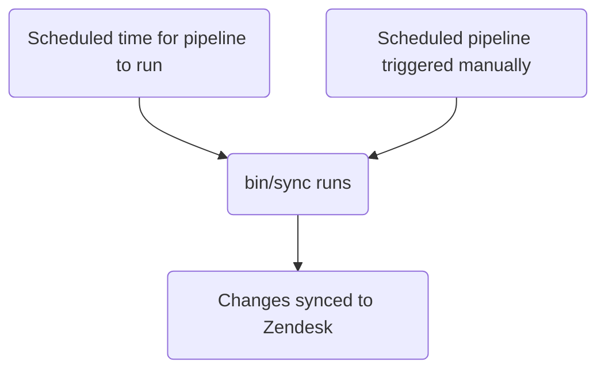

このガイドでは、GitLab で Zendesk のオートメーションを作成、編集、管理する方法を説明します。管理者は [管理者タスク](#administrator-tasks) のセクションを確認してください。

エージェントが手動で適用する [マクロ](../macros/) や、チケットのイベント時に即座に発火するトリガーとは異なり、オートメーションは時間ベースのスケジュールで実行されます。

{}

- デプロイタイプ: `Standard`
- Sync repos
  - [Zendesk Global](https://gitlab.com/gitlab-support-readiness/zendesk-global/automations)
  - [Zendesk US Government](https://gitlab.com/gitlab-support-readiness/zendesk-us-government/automations)
- Managed content repos
  - [Zendesk Global](https://gitlab.com/gitlab-com/support/zendesk-global/automations)
  - [Zendesk US Government](https://gitlab.com/gitlab-com/support/zendesk-us-government/automations)
- `CustSuppOps Zendesk Test Suite Generator` が有効

{}

## オートメーションを理解する

### オートメーションとは

[Zendesk](https://support.zendesk.com/hc/en-us/articles/4408832701850-About-automations-and-how-they-work) によると:

> オートメーションは、いずれもチケットのプロパティを変更し、オプションで顧客やエージェントにメール通知を送信する条件とアクションを定義するという点で、トリガーに似ています。両者が異なる点は、オートメーションがチケットの作成・更新の直後ではなく、チケットのプロパティが設定または更新された後に時間イベントが発生したときに実行されることです。

よりシンプルに言えば、オートメーションは即座には実行されないトリガーです。イベントベースではなく時間ベースです。

### Zendesk でオートメーションが実行されるタイミング

公式には、Zendesk のオートメーションは 1 時間に 1 回実行されます。正確なタイミングは確定したものではありませんが、私たちの Zendesk の利用では、インスタンスのタイムゾーンで毎時の最初（おおむね 5 分以内）にこれが発生することが確認されています。

### オートメーションは条件ロジックを使用する

オートメーションは条件ロジックを使用します:

- `all`: 配列内の **すべて** の条件が真でなければならない（AND ロジック）
- `any`: 配列内の **少なくとも 1 つ** の条件が真でなければならない（OR ロジック）
- どちらか一方のセットのみ、または両方のセットを使用できます（ただし少なくとも 1 つのセットは使用しなければなりません）

### オートメーションの管理方法

Zendesk は UI 経由でオートメーションを管理する完全な手段を提供していますが、私たちはよりバージョン管理された方法論を採用しています。これにより、定められたレビュープロセスや、必要に応じたロールバックの実行などが可能になります。

そのため、私たちは sync repos と managed content repos を活用しています。

### sync repo の仕組み

sync repo のワークフローは次のプロセスに従います:



#### 人間が読める形式の置換

{}

- YAML ファイル経由でオートメーションを作成・編集する `administrators` にのみ適用されます

{}

現在、sync repo はさまざまな項目を、人間が読める形式の項目から「Zendesk」の同等項目へ置換できます。これには以下が含まれます:

| 人間が読める項目 | Zendesk フィールド項目 | 条件/アクションの場所 | 備考 |
|---------------------|--------------------|-----------------|-------|
| `'Brand: XXX'` | `brand_id` | `value` | `XXX` をブランドの `name` に置き換える |
| `'Field: XXX'` | `custom_fields_xxx` | `field` | `XXX` をチケットフィールドの `title` に置き換える |
| `'Group: XXX'` | `group_id` | `value` | `XXX` をグループの `name` に置き換える |
| `'XXX'` | `role` | `value` | `XXX` をロールタイプの `name` または依頼者のメールアドレスに置き換える |
| `'Form: XXX'` | `ticket_form_id` | `value` | `XXX` をチケットフォームの `name` に置き換える |
| `'Schedule: XXX'` | `set_schedule` | `value` | `XXX` をスケジュールの `name` に置き換える |
| `'Schedule: XXX'` | `schedule_id` | `value` | `XXX` をスケジュールの `name` に置き換える |
| `'XXX'` | `organization_id` | `value` | `XXX` を組織の `salesforce_id` 属性に置き換える |
| `'XXX'` | `assignee_id` | `value` | `XXX` をエージェントのメールアドレスに置き換える |
| `'XXX'` | `satisfaction_reason_code` | `value` | `XXX` を満足度理由の `name` に置き換える |
| `'XXX'` | `via_id` | `value` | `XXX` を via タイプの `name` に置き換える |
| `'XXX'` | `requester_role` | `value` | `XXX` を依頼者ロールタイプの `name` に置き換える |
| `'Target: XXX'` | `notification_target` | `value` | `XXX` をターゲットの `name` に置き換える |
| `'Webhook: XXX'` | `notification_webhook` | `value` | `XXX` を webhook の `name` に置き換える |

例として、オートメーションで `Preferred Region for Support` フィールドの値を `AMER` に変更したい場合は、置換を使用するために次のように記述します:

```yaml
- field: 'Field: Preferred Region for Support'
  value: 'AMER'
```

別の例として、チケットのフォームが `SaaS` フォームではないことをチェックする条件が必要な場合は、次のように記述します:

```yaml
- field: 'ticket_form_id'
  operator: 'is_not'
  value: 'Form: SaaS'
```

#### sync repo で MR を作成するとき

sync repo で MR が作成されると、（`bin/compare` スクリプト経由で）compare アクションが実行され、次の処理が行われます:

1. managed content repo のクローンを実行する
1. Zendesk インスタンスからすべてのオートメーション、ブランド、グループ、満足度理由、スケジュール、ターゲット、チケットフィールド、チケットフォーム、webhook を取得する
1. sync repo 内のすべての YAML ファイルをレビューしてオートメーションオブジェクトを生成する
   - また、sync repo のファイルに以下の問題が存在しないことを確認する:
     - title が欠落している
     - `active` 属性が `false` のファイルが `active` フォルダーにない
     - `active` 属性が `true` のファイルが `inactive` フォルダーにない
     - `title` 属性の重複した使用がない
     - `contains_managed_content` 属性が `true` のファイルに対応する managed content ファイルがある
     - `contains_managed_webhook` 属性が `true` のファイルに対応する managed content ファイルがある
1. YAML ファイルのすべてのオートメーションオブジェクトを、マッチする Zendesk 項目と比較する（`title` および `previous_title` 属性の値をチェックして判定する）
   - 存在しない場合は、後で使用するために create オブジェクトを変数に格納する
   - 存在するが属性値が異なる場合は、後で使用するために update オブジェクトを変数に格納する
1. 比較レポートを出力する

#### Zendesk への同期

sync repo は、プロジェクトのスケジュールされたパイプラインが実行されたとき（正しいタイミングまたは手動実行のいずれか）に同期タスクを実行します。

いずれかのアクションが発生すると、同期は [compare アクション](#when-creating-mrs-in-the-sync-repo) を実行し、その後生成されたオブジェクトを使用して、必要な Zendesk エンドポイントにアクセスするループ経由で必要な作成・更新を実行します:

- [Creates](https://developer.zendesk.com/api-reference/ticketing/business-rules/automations/#create-automation)
- [Updates](https://developer.zendesk.com/api-reference/ticketing/business-rules/automations/#update-automation)

#### 孤立した managed content ファイルの報告

2 月、5 月、8 月、11 月の 1 日に、[スケジュールされたパイプライン](https://docs.gitlab.com/ci/pipelines/schedules/) が、サポートリーダーシップチームがすべての孤立した managed content ファイルをレビューするための Issue を sync repo に作成させます。

これは sync repo の `bin/find_orphaned_files` スクリプト経由で行われ、次の処理を実行します:

1. managed content repo のクローンを実行する
1. managed content repo の `active` および `inactive` フォルダー内のすべてのファイルをレビューして、`state`（つまり `active` または `inactive`）、`path`、`title` を判定する
1. sync repo 自体の `active` および `inactive` フォルダー内のすべてのファイルをレビューして、以下を判定する:
   - そのファイルが managed content ファイルを使用しているか
   - managed content ファイルが存在するか
1. sync repo ファイルのない managed content ファイルを見つけた場合は、それを Customer Support リーダーシップに報告する Issue を作成する

## 管理者以外がオートメーションを作成する

オートメーションの作成については、[Feature Request issue](https://gitlab.com/gitlab-com/gl-security/corp/cust-support-ops/issue-tracker/-/issues/new?description_template=Feature) を作成してください（Customer Support Operations チームによる手動対応が必要となるため）。

## 管理者以外がオートメーションを編集する

### オートメーションで使用されているコメント文言の変更

オートメーション内のコメント文言を編集するには、managed content repo の対応するファイルを修正します。`master` ブランチにマージされた後、次のデプロイサイクルで取り込まれ、Zendesk にデプロイされます。

### オートメーションで使用されているペイロードの変更

オートメーション内のペイロード（managed webhook を使用しているもの）を編集するには、managed content repo の対応するファイルを修正します。`master` ブランチにマージされた後、次のデプロイサイクルで取り込まれ、Zendesk にデプロイされます。

### title、コメント以外の文言アクションなどの変更

オートメーション内のその他のものを変更するには、[Feature Request issue](https://gitlab.com/gitlab-com/gl-security/corp/cust-support-ops/issue-tracker/-/issues/new?description_template=Feature) を作成してください（Customer Support Operations チームによる手動対応が必要となるため）。

## 管理者以外がオートメーションを無効化する

オートメーションの無効化を依頼するには、[Feature Request issue](https://gitlab.com/gitlab-com/gl-security/corp/cust-support-ops/issue-tracker/-/issues/new?description_template=Feature) を作成してください（Customer Support Operations チームによる手動対応が必要となるため）。

## 管理者タスク

{}

- このセクションのすべての項目には、Zendesk への `Administrator` レベルのアクセスが必要です。

{}

### オートメーションの使用状況情報を確認する

オートメーションの使用状況情報を確認するには:

1. Zendesk インスタンスの管理パネルに移動する
1. `Objects and rules > Business rules > Automations` に移動する
1. 「Add automation」ボタンの左にあるアイコン（AZ が入った円のように見える）をクリックする
1. 表示したい使用状況の列をクリックする

### オートメーションを作成する

{}

- これは対応するリクエスト Issue（Feature Request、Administrative、Bug など）がある場合にのみ実施してください。存在しない場合は、まず作成し、対応する前に標準プロセスを通してください。
- managed content ファイルを使用するオートメーションを作成する場合は、先にその managed content ファイルを作成しなければなりません。

{}

オートメーションを作成するには、sync repo で MR を作成する必要があります。実際に行う変更はリクエスト自体によって異なります。利用できる開始用テンプレートは次のとおりです:

```yaml
---
title: 'Your::Title::Here'
previous_title: 'Your::Title::Here'
description: 'Your description here'
active: true
position: 1 # Integer representing automation position
actions:
- field: 'the_action_to_perform'
  value: 'the_value_to_use'
conditions:
  all:
  - field: 'the_action_to_perform'
    operator: 'the_operator_to_use'
    value: 'the_value_to_use'
  any:
  - field: 'the_action_to_perform'
    operator: 'the_operator_to_use'
    value: 'the_value_to_use'
contains_managed_content: false
contains_managed_email: false
contains_managed_webhook: false
```

ピアがあなたの MR をレビューして承認した後、MR をマージできます。次のデプロイが発生したときに、Zendesk に同期されます。

### オートメーションを編集する

{}

- これは対応するリクエスト Issue（Feature Request、Administrative、Bug など）がある場合にのみ実施してください。存在しない場合は、まず作成し、対応する前に標準プロセスを通してください。
- オートメーションの `contains_managed_content` または `contains_managed_webhook` 属性を `false` から `true` に変更する場合は、先にその managed content ファイルを作成しなければなりません。
- オートメーションの `contains_managed_content` または `contains_managed_webhook` 属性を `true` から `false` に変更する場合は、対応する managed content ファイルを削除するためのフォローアップ MR を作成してください。

{}

オートメーションを編集するには、sync repo で MR を作成する必要があります。実際に行う変更はリクエスト自体によって異なります。

ピアがあなたの MR をレビューして承認した後、MR をマージできます。次のデプロイが発生したときに、Zendesk に同期されます。

#### オートメーションの title を変更する

オートメーションの title を変更する必要がある場合は、現在の値を `previous_title` 属性にコピーしてから `title` 属性を変更します。これにより、同期が対象のオートメーションを引き続き見つけて更新できます。

### オートメーションを無効化する

{}

- これは対応するリクエスト Issue（Feature Request、Administrative、Bug など）がある場合にのみ実施してください。存在しない場合は、まず作成し、対応する前に標準プロセスを通してください。
- オートメーションが managed content ファイルを使用していた場合（つまり YAML ファイルの `contains_managed_content` または `contains_managed_webhook` 属性が以前 `true` に設定されていた場合）、managed content repo で対応するファイルを `active` から `inactive` の場所に移動する必要が生じる可能性が高いです。

{}

オートメーションを無効化するには、sync repo で MR を作成する必要があります。この MR では、対応するオートメーションの YAML ファイルに対して次の処理を行ってください:

1. ファイルを `active` から `inactive` のパスに移動する
1. `active` 属性の値を `false` に変更する
1. `actions` の値を次のように変更する:
   - Zendesk Global の場合:

     ```yaml
     - field: 'current_tags'
       value: 'missing_brand'
     ```

   - Zendesk US Government の場合:

     ```yaml
     - field: 'current_tags'
       value: 'missing_brand'
     ```

1. `conditions` の値を次のように変更する:
   - Zendesk Global の場合:

     ```yaml
       all:
       - field: 'brand_id'
         operator: 'is_not'
         value: 'GitLab Support'
       - field: 'brand_id'
         operator: 'is_not'
         value: 'GitLab - Internal'
       - field: 'current_tags'
         operator: 'not_includes'
         value: 'missing_brand'
       - field: 'status'
         operator: 'is_not'
         value: 'closed'
       any: []
     ```

   - Zendesk US Government の場合:

     ```yaml
       all:
       - field: 'brand_id'
         operator: 'is_not'
         value: 'GitLab'
       - field: 'brand_id'
         operator: 'is_not'
         value: 'GitLab - Internal'
       - field: 'current_tags'
         operator: 'not_includes'
         value: 'missing_brand'
       - field: 'status'
         operator: 'is_not'
         value: 'closed'
       any: []
     ```

1. `contains_managed_content` 属性の値を `false` に変更する
1. `contains_managed_webhook` 属性の値を `false` に変更する

ピアがあなたの MR をレビューして承認した後、MR をマージできます。次のデプロイが発生したときに、Zendesk に同期されます。

### オートメーションを削除する

{}

- オートメーションは無効化されている場合のみ削除できます。
- これは対応するリクエスト Issue（Feature Request、Administrative、Bug など）がある場合にのみ実施してください。存在しない場合は、まず作成し、対応する前に標準プロセスを通してください。
- オートメーションを削除する場合、sync repo と managed content repo の両方からファイルを削除する必要が生じる可能性が高いです。

{}

sync repo は削除を実行しないため、これは Zendesk 自体で行う必要があります。

オートメーションを削除するには:

1. Zendesk インスタンスの管理ダッシュボードに移動する
   - [Zendesk Global (production)](https://gitlab.zendesk.com/admin/home)
   - [Zendesk Global (sandbox)](https://gitlab1707170878.zendesk.com/admin/home)
   - [Zendesk US Government (production)](https://gitlab-federal-support.zendesk.com/admin/home)
   - [Zendesk US Government (sandbox)](https://gitlabfederalsupport1585318082.zendesk.com/admin/home)
1. `Objects and rules > Business rules > Automations` に移動する
   - [Zendesk Global](https://gitlab.zendesk.com/admin/objects-rules/rules/automations)
   - [Zendesk Global (sandbox)](https://gitlab1707170878.zendesk.com/admin/objects-rules/rules/automations)
   - [Zendesk US Government](https://gitlab-federal-support.zendesk.com/admin/objects-rules/rules/automations)
   - [Zendesk US Government (sandbox)](https://gitlabfederalsupport1585318082.zendesk.com/admin/objects-rules/rules/automations)
1. 削除したいオートメーションを見つけ、その名前をクリックする（`Inactive` タブ内）
1. ページの一番下までスクロールする
1. `Submit` ボタンの隣のドロップダウンをクリックする
1. `Delete` をクリックする
1. `Submit` をクリックして変更を送信する

### 例外デプロイを実行する

オートメーションの例外デプロイを実行するには、対象のオートメーション sync プロジェクトに移動し、スケジュールされたパイプラインのページに移動して、sync 項目の再生ボタンをクリックします。これにより、オートメーションの同期ジョブがトリガーされます。

## よくある問題とトラブルシューティング

### マージ後にオートメーションの変更が反映されない

オートメーションは `Standard` のデプロイタイプに従うため、通常のデプロイサイクル中（または例外デプロイが実施されたとき）にのみデプロイされます。
