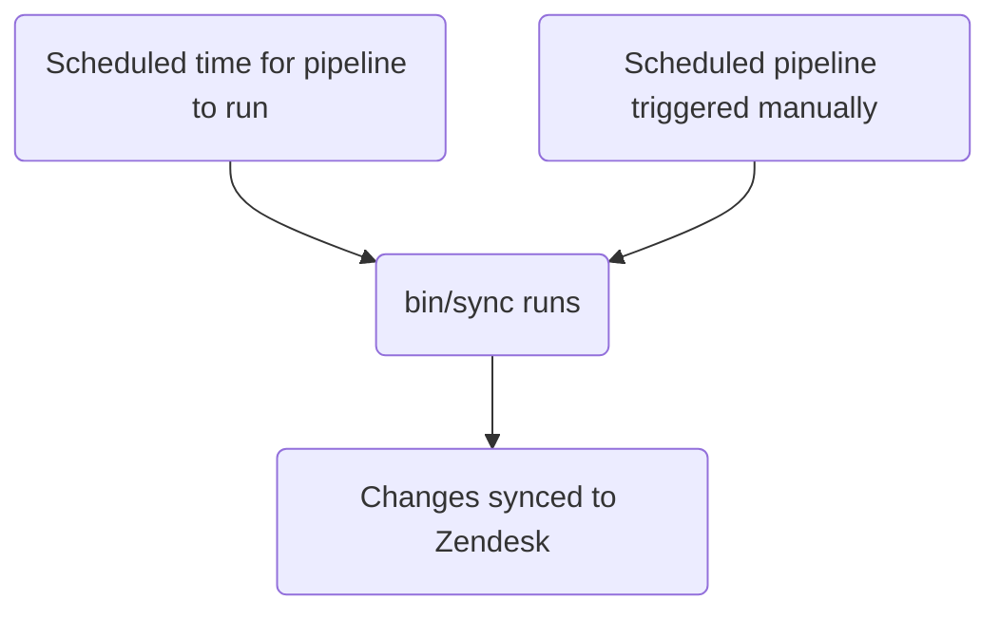

このガイドでは、GitLab における Zendesk オートメーションの作成、編集、管理方法について説明します。管理者は [管理者タスク](#administrator-tasks) セクションを確認してください。

エージェントが手動で適用する [マクロ](../macros/) や、チケットイベントで即座に発火するトリガーとは異なり、オートメーションは時間ベースのスケジュールで実行されます。

{}

- デプロイタイプ: `Standard`
- 同期リポジトリ
  - [Zendesk Global](https://gitlab.com/gitlab-support-readiness/zendesk-global/automations)
  - [Zendesk US Government](https://gitlab.com/gitlab-support-readiness/zendesk-us-government/automations)
- 管理コンテンツリポジトリ
  - [Zendesk Global](https://gitlab.com/gitlab-com/support/zendesk-global/automations)
  - [Zendesk US Government](https://gitlab.com/gitlab-com/support/zendesk-us-government/automations)
- `CustSuppOps Zendesk Test Suite Generator` を有効化

{}

## オートメーションを理解する

### オートメーションとは

[Zendesk](https://support.zendesk.com/hc/en-us/articles/4408832701850-About-automations-and-how-they-work) によると:

> オートメーションはトリガーと似ています。どちらも条件とアクションを定義し、チケットのプロパティを変更したり、必要に応じて顧客やエージェントにメール通知を送ったりします。異なる点は、オートメーションはチケットが作成・更新された直後ではなく、チケットのプロパティが設定・更新された後に時間イベントが発生したときに実行されることです。

よりシンプルに言えば、オートメーションは即座には実行されないトリガーです。イベントベースではなく時間ベースなのです。

### Zendesk でオートメーションが実行されるタイミング

公式には、Zendesk のオートメーションは 1 時間に 1 回実行されます。正確なタイミングは固定されていませんが、私たちの Zendesk の利用実績では、インスタンスのタイムゾーンにおける各時刻の開始時（おおむね 5 分以内）に実行されることがわかっています。

### オートメーションは条件ロジックを使用する

オートメーションは条件ロジックを使用します:

- `all`: 配列内の条件が **すべて** true でなければならない（AND ロジック）
- `any`: 配列内の **少なくとも 1 つ** の条件が true でなければならない（OR ロジック）
- どちらか一方のセットのみ、または両方のセットを使用できます（ただし少なくとも 1 つのセットを使用する必要があります）

### オートメーションの管理方法

Zendesk は UI を通じてオートメーションを管理する完全な方法を提供していますが、私たちはより厳密にバージョン管理された方法論を採用しています。これにより、定められたレビュープロセスや、必要に応じたロールバックの実行などが可能になります。

そのため、私たちは同期リポジトリと管理コンテンツリポジトリを利用しています。

### 同期リポジトリの仕組み

同期リポジトリのワークフローは次のプロセスに従います:



#### 人間が読める形式の置換

{}

- YAML ファイルを通じてオートメーションを作成・編集する `administrators` にのみ適用されます

{}

現在、同期リポジトリは、さまざまな項目を人間が読める形式の項目から「Zendesk」の相当する項目へと置換できます。これには次のものが含まれます:

| 人間が読める項目 | Zendesk フィールド項目 | 条件/アクションの位置 | 備考 |
|---------------------|--------------------|-----------------|-------|
| `'Brand: XXX'` | `brand_id` | `value` | `XXX` をブランドの `name` に置き換える |
| `'Field: XXX'` | `custom_fields_xxx` | `field` | `XXX` をチケットフィールドの `title` に置き換える |
| `'Group: XXX'` | `group_id` | `value` | `XXX` をグループの `name` に置き換える |
| `'XXX'` | `role` | `value` | `XXX` をロールタイプの `name` またはリクエスターのメールアドレスに置き換える |
| `'Form: XXX'` | `ticket_form_id` | `value` | `XXX` をチケットフォームの `name` に置き換える |
| `'Schedule: XXX'` | `set_schedule` | `value` | `XXX` をスケジュールの `name` に置き換える |
| `'Schedule: XXX'` | `schedule_id` | `value` | `XXX` をスケジュールの `name` に置き換える |
| `'XXX'` | `organization_id` | `value` | `XXX` を組織の `salesforce_id` 属性に置き換える |
| `'XXX'` | `assignee_id` | `value` | `XXX` をエージェントのメールアドレスに置き換える |
| `'XXX'` | `satisfaction_reason_code` | `value` | `XXX` を満足度理由の `name` に置き換える |
| `'XXX'` | `via_id` | `value` | `XXX` を経由タイプの `name` に置き換える |
| `'XXX'` | `requester_role` | `value` | `XXX` をリクエスターロールタイプの `name` に置き換える |
| `'Target: XXX'` | `notification_target` | `value` | `XXX` をターゲットの `name` に置き換える |
| `'Webhook: XXX'` | `notification_webhook` | `value` | `XXX` を Webhook の `name` に置き換える |

例として、フィールド `Preferred Region for Support` の値を `AMER` に変更するオートメーションが必要な場合、置換を使用するには次のようにします:

```yaml
- field: 'Field: Preferred Region for Support'
  value: 'AMER'
```

別の例として、チケットのフォームが `SaaS` フォームではないかどうかをチェックする条件が必要な場合は、次のようにします:

```yaml
- field: 'ticket_form_id'
  operator: 'is_not'
  value: 'Form: SaaS'
```

#### 同期リポジトリで MR を作成するとき

同期リポジトリで MR が作成されると、（`bin/compare` スクリプトを通じて）比較アクションが実行され、次のことが行われます:

1. 管理コンテンツリポジトリのクローンを実行する
1. Zendesk インスタンスからすべてのオートメーション、ブランド、グループ、満足度理由、スケジュール、ターゲット、チケットフィールド、チケットフォーム、Webhook を取得する
1. 同期リポジトリ内のすべての YAML ファイルをレビューしてオートメーションオブジェクトを生成する
   - また、同期リポジトリのファイルに次のいずれの問題も存在しないことを確認します:
     - タイトルが欠落している
     - `active` 属性が `false` のファイルが `active` フォルダにない
     - `active` 属性が `true` のファイルが `inactive` フォルダにない
     - `title` 属性が重複して使用されている
     - `contains_managed_content` 属性が `true` のファイルに対応する管理コンテンツファイルがある
     - `contains_managed_webhook` 属性が `true` のファイルに対応する管理コンテンツファイルがある
1. YAML ファイルのすべてのオートメーションオブジェクトを、対応する Zendesk 項目（属性 `title` と `previous_title` の値をチェックして判定）と比較する
   - 存在しない場合は、後で使用するために作成オブジェクトを変数に格納します
   - 存在するが属性値が異なる場合は、後で使用するために更新オブジェクトを変数に格納します
1. 比較レポートを出力する

#### Zendesk への同期

同期リポジトリは、プロジェクトのスケジュールパイプラインが実行されたとき（正しいタイミングで、または手動で実行されたとき）に同期タスクを実行します。

いずれかのアクションが発生すると、同期は [比較アクション](#when-creating-mrs-in-the-sync-repo) を実行し、生成されたオブジェクトを使用して、必要な Zendesk エンドポイントにアクセスするループを通じて必要な作成と更新を実行します:

- [作成](https://developer.zendesk.com/api-reference/ticketing/business-rules/automations/#create-automation)
- [更新](https://developer.zendesk.com/api-reference/ticketing/business-rules/automations/#update-automation)

#### 孤立した管理コンテンツファイルの報告

2 月、5 月、8 月、11 月の 1 日に、[スケジュールパイプライン](https://docs.gitlab.com/ci/pipelines/schedules/) によって同期リポジトリが、サポートリーダーシップチームがすべての孤立した管理コンテンツファイルをレビューするための Issue を作成します。

これは同期リポジトリ内の `bin/find_orphaned_files` スクリプトを通じて行われ、次のことが行われます:

1. 管理コンテンツリポジトリのクローンを実行する
1. 管理コンテンツリポジトリの `active` および `inactive` フォルダ内のすべてのファイルをレビューして、`state`（すなわち `active` または `inactive`）、`path`、`title` を判定する
1. 同期リポジトリ自体の `active` および `inactive` フォルダ内のすべてのファイルをレビューして、次のことを判定する:
   - ファイルが管理コンテンツファイルを使用しているか
   - 管理コンテンツファイルが存在するか
1. 同期リポジトリのファイルがない管理コンテンツファイルを発見した場合、それを Customer Support リーダーシップに報告する Issue を作成する

## 管理者以外としてオートメーションを作成する

オートメーションの作成については、[Feature Request Issue](https://gitlab.com/gitlab-com/gl-security/corp/cust-support-ops/issue-tracker/-/issues/new?description_template=Feature) を作成してください（Customer Support Operations チームによる手動の対応が必要となるため）。

## 管理者以外としてオートメーションを編集する

### オートメーションで使用するコメント文言を変更する

オートメーション内のコメント文言を編集するには、管理コンテンツリポジトリ内の対応するファイルを変更します。`master` ブランチにマージされると、次のデプロイサイクルで取り込まれ、Zendesk にデプロイされます。

### オートメーションで使用するペイロードを変更する

オートメーション内の（管理 Webhook を使用している）ペイロードを編集するには、管理コンテンツリポジトリ内の対応するファイルを変更します。`master` ブランチにマージされると、次のデプロイサイクルで取り込まれ、Zendesk にデプロイされます。

### タイトル、コメント以外の文言アクションなどを変更する

オートメーション内のその他のものを変更するには、[Feature Request Issue](https://gitlab.com/gitlab-com/gl-security/corp/cust-support-ops/issue-tracker/-/issues/new?description_template=Feature) を作成してください（Customer Support Operations チームによる手動の対応が必要となるため）。

## 管理者以外としてオートメーションを無効化する

オートメーションの無効化をリクエストするには、[Feature Request Issue](https://gitlab.com/gitlab-com/gl-security/corp/cust-support-ops/issue-tracker/-/issues/new?description_template=Feature) を作成してください（Customer Support Operations チームによる手動の対応が必要となるため）。

## 管理者タスク

{}

- このセクションのすべての項目には Zendesk への `Administrator` レベルのアクセスが必要です。

{}

### オートメーションの使用状況情報を確認する

オートメーションの使用状況情報を確認するには:

1. Zendesk インスタンスの管理パネルに移動する
1. `Objects and rules > Business rules > Automations` に移動する
1. 「Add automation」ボタンの左側にあるアイコン（AZ の入った円のように見えます）をクリックする
1. 確認したい使用状況の列をクリックする

### オートメーションを作成する

{}

- これは対応するリクエスト Issue（Feature Request、Administrative、Bug など）がある場合にのみ行うべきです。存在しない場合は、まず作成してください（そして対応に取りかかる前に標準プロセスを通してください）。
- 管理コンテンツファイルを使用するオートメーションを作成する場合は、まずその管理コンテンツファイルを作成する必要があります。

{}

オートメーションの作成には、同期リポジトリで MR を作成する必要があります。実際に行う変更はリクエスト自体によって異なります。使用できる開始テンプレートは次のとおりです:

```yaml
---
title: 'Your::Title::Here'
previous_title: 'Your::Title::Here'
description: 'Your description here'
active: true
position: 1 # Integer representing automation position
actions:
- field: 'the_action_to_perform'
  value: 'the_value_to_use'
conditions:
  all:
  - field: 'the_action_to_perform'
    operator: 'the_operator_to_use'
    value: 'the_value_to_use'
  any:
  - field: 'the_action_to_perform'
    operator: 'the_operator_to_use'
    value: 'the_value_to_use'
contains_managed_content: false
contains_managed_email: false
contains_managed_webhook: false
```

ピアが MR をレビューして承認した後、MR をマージできます。次のデプロイが発生すると、Zendesk に同期されます。

### オートメーションを編集する

{}

- これは対応するリクエスト Issue（Feature Request、Administrative、Bug など）がある場合にのみ行うべきです。存在しない場合は、まず作成してください（そして対応に取りかかる前に標準プロセスを通してください）。
- オートメーションの `contains_managed_content` または `contains_managed_webhook` 属性を `false` から `true` に変更する場合は、まずその管理コンテンツファイルを作成する必要があります。
- オートメーションの `contains_managed_content` または `contains_managed_webhook` 属性を `true` から `false` に変更する場合は、対応する管理コンテンツファイルを削除するためのフォローアップ MR を作成すべきです。

{}

オートメーションを編集するには、同期リポジトリで MR を作成する必要があります。実際に行う変更はリクエスト自体によって異なります。

ピアが MR をレビューして承認した後、MR をマージできます。次のデプロイが発生すると、Zendesk に同期されます。

#### オートメーションのタイトルを変更する

オートメーションのタイトルを変更する必要がある場合は、現在の値を `previous_title` 属性にコピーしてから `title` 属性を変更します。これにより、同期が更新対象のオートメーションを引き続き特定できるようになります。

### オートメーションを無効化する

{}

- これは対応するリクエスト Issue（Feature Request、Administrative、Bug など）がある場合にのみ行うべきです。存在しない場合は、まず作成してください（そして対応に取りかかる前に標準プロセスを通してください）。
- オートメーションが管理コンテンツファイルを使用していた場合（すなわち YAML ファイル内の `contains_managed_content` または `contains_managed_webhook` 属性が以前に `true` に設定されていた場合）、管理コンテンツリポジトリ内の対応するファイルも `active` から `inactive` の場所に移動する必要があるでしょう。

{}

オートメーションを無効化するには、同期リポジトリで MR を作成する必要があります。この MR で、対応するオートメーションの YAML ファイルに対して次のことを行ってください:

1. ファイルを `active` から `inactive` のパスに移動する
1. `active` 属性の値を `false` に変更する
1. `actions` の値を次のように変更する:
   - Zendesk Global の場合:

     ```yaml
     - field: 'current_tags'
       value: 'missing_brand'
     ```

   - Zendesk US Government の場合:

     ```yaml
     - field: 'current_tags'
       value: 'missing_brand'
     ```

1. `conditions` の値を次のように変更する:
   - Zendesk Global の場合:

     ```yaml
       all:
       - field: 'brand_id'
         operator: 'is_not'
         value: 'GitLab Support'
       - field: 'brand_id'
         operator: 'is_not'
         value: 'GitLab - Internal'
       - field: 'current_tags'
         operator: 'not_includes'
         value: 'missing_brand'
       - field: 'status'
         operator: 'is_not'
         value: 'closed'
       any: []
     ```

   - Zendesk US Government の場合:

     ```yaml
       all:
       - field: 'brand_id'
         operator: 'is_not'
         value: 'GitLab'
       - field: 'brand_id'
         operator: 'is_not'
         value: 'GitLab - Internal'
       - field: 'current_tags'
         operator: 'not_includes'
         value: 'missing_brand'
       - field: 'status'
         operator: 'is_not'
         value: 'closed'
       any: []
     ```

1. `contains_managed_content` 属性の値を `false` に変更する
1. `contains_managed_webhook` 属性の値を `false` に変更する

ピアが MR をレビューして承認した後、MR をマージできます。次のデプロイが発生すると、Zendesk に同期されます。

### オートメーションを削除する

{}

- オートメーションを削除できるのは、それが無効化されている場合のみです。
- これは対応するリクエスト Issue（Feature Request、Administrative、Bug など）がある場合にのみ行うべきです。存在しない場合は、まず作成してください（そして対応に取りかかる前に標準プロセスを通してください）。
- オートメーションを削除する場合は、同期リポジトリと管理コンテンツリポジトリからもファイルを削除する必要があるでしょう。

{}

同期リポジトリは削除を実行しないため、Zendesk 自体を通じてこれを行う必要があります。

オートメーションを削除するには:

1. Zendesk インスタンスの管理ダッシュボードに移動する
   - [Zendesk Global (production)](https://gitlab.zendesk.com/admin/home)
   - [Zendesk Global (sandbox)](https://gitlab1707170878.zendesk.com/admin/home)
   - [Zendesk US Government (production)](https://gitlab-federal-support.zendesk.com/admin/home)
   - [Zendesk US Government (sandbox)](https://gitlabfederalsupport1585318082.zendesk.com/admin/home)
1. `Objects and rules > Business rules > Automations` に移動する
   - [Zendesk Global](https://gitlab.zendesk.com/admin/objects-rules/rules/automations)
   - [Zendesk Global (sandbox)](https://gitlab1707170878.zendesk.com/admin/objects-rules/rules/automations)
   - [Zendesk US Government](https://gitlab-federal-support.zendesk.com/admin/objects-rules/rules/automations)
   - [Zendesk US Government (sandbox)](https://gitlabfederalsupport1585318082.zendesk.com/admin/objects-rules/rules/automations)
1. 削除したいオートメーションを（`Inactive` タブで）特定して名前をクリックする
1. ページの一番下までスクロールする
1. `Submit` ボタンの横にあるドロップダウンをクリックする
1. `Delete` をクリックする
1. `Submit` をクリックして変更を送信する

### 例外デプロイを実行する

オートメーションの例外デプロイを実行するには、該当するオートメーションの同期プロジェクトに移動し、スケジュールパイプラインのページに移動して、同期項目の再生ボタンをクリックします。これによりオートメーションの同期ジョブがトリガーされます。

## よくある問題とトラブルシューティング

### マージ後にオートメーションの変更が反映されない

オートメーションは `Standard` デプロイタイプに従うため、通常のデプロイサイクル中（または例外デプロイが行われたとき）にのみデプロイされます。
