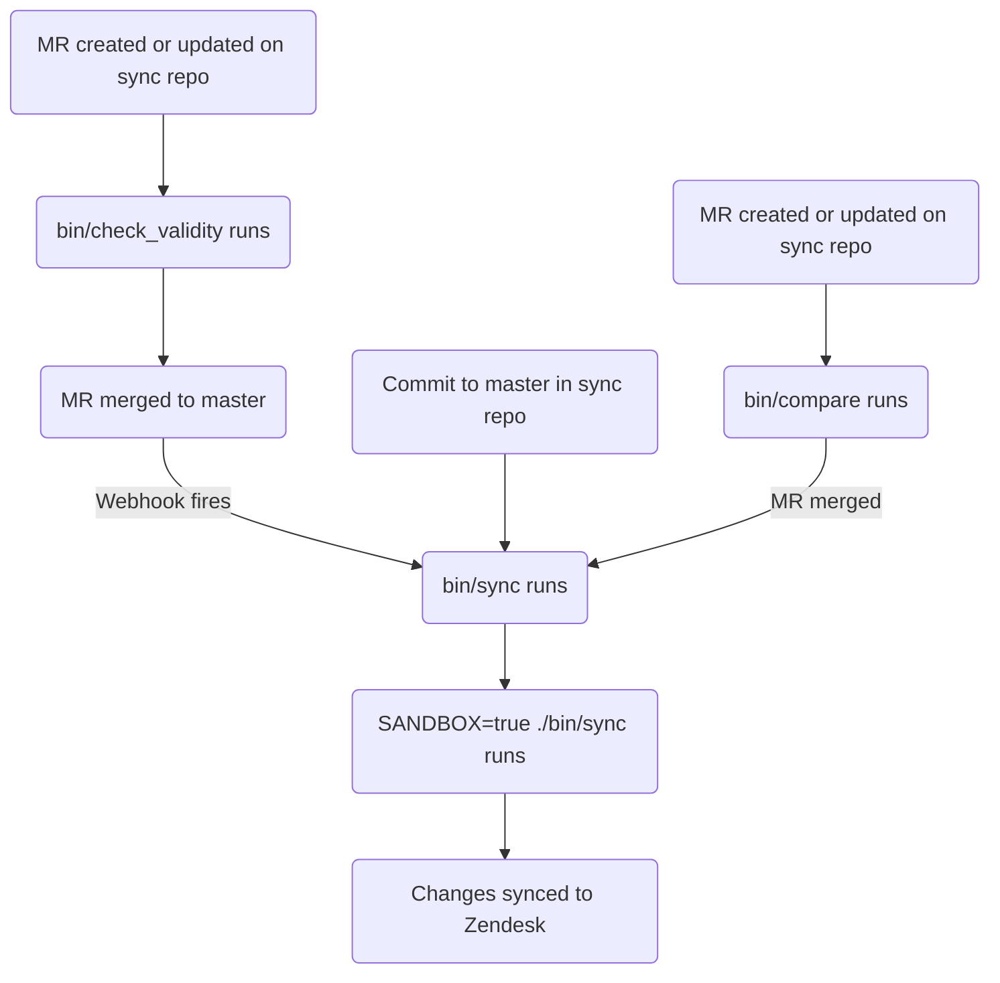

このガイドでは、GitLab における Zendesk 記事の作成・編集・管理方法について説明します。記事の管理に関する情報を探しているサポートエージェントは、[Global Knowledge Base](/handbook/support/knowledge-base/) を参照してください。管理者は [管理者タスク](#administrator-tasks) のセクションを確認してください。

{}

- デプロイタイプ: `Ad-hoc`
- 同期リポジトリ
  - [Zendesk Global](https://gitlab.com/gitlab-support-readiness/zendesk-global/articles)
  - [Zendesk US Government](https://gitlab.com/gitlab-support-readiness/zendesk-us-government/articles)
- 管理コンテンツリポジトリ: [Articles](https://gitlab.com/gitlab-com/support/articles)

{}

## 記事を理解する

### 記事とは

記事は、Zendesk ナレッジセンター内で情報を含むナレッジベース項目です。含まれる情報は多様ですが、一般的にはトラブルシューティング情報や詳細なセットアップガイド等です。

現在、これらは主に Customer Support チームによって作成・管理されています。

ナレッジセンターは 3 階層の構造を使用します:

- **カテゴリ** (最上位) - 主要なトピック領域を整理。[カテゴリページ](/handbook/security/customer-support-operations/zendesk/knowledge-center/categories) でドキュメント化
- **セクション** (中間レベル) - カテゴリを関連グループに細分化。[セクションページ](/handbook/security/customer-support-operations/zendesk/knowledge-center/sections) でドキュメント化
- **記事** (コンテンツレベル) - 個々のヘルプ記事。本ページでドキュメント化

### プレースメントとは

プレースメントは、記事がナレッジセンター内のどのセクションに表示されるかを決定します。1 つの記事には複数のプレースメントを持たせることができ、これによって異なるセクションに同時に表示できます。

**重要:** 各プレースメントは Zendesk 内で記事の重複を作成します。記事は同じコンテンツを共有しますが、異なるセクションに別個のオブジェクトとして存在します。1 つのプレースメントへの変更は、その記事のすべてのプレースメントに影響します。

### 記事の管理方法

Zendesk は UI から記事をフルに管理する方法を提供していますが、私たちはよりバージョン管理されたメソドロジーを採用しています。これによって、定型化されたレビュープロセスや、必要に応じたロールバック等が可能になります。

そのため、私たちは同期リポジトリと管理コンテンツリポジトリを利用しています。

### 同期リポジトリの仕組み

同期リポジトリのワークフローは以下のプロセスに従います:

#### 管理コンテンツリポジトリで {#in-the-managed-content-repo}

管理コンテンツリポジトリでマージリクエストが作成または更新されると、CI/CD 経由で `bin/check_validity` スクリプトが実行されます。このスクリプトは以下を行います:

- 拡張子 `.md` で終わるすべてのファイルをループし、以下を行う
  - ファイル名が `README.md` の場合はイテレーションをスキップ
  - ファイルをフロントマターファイルとしてオブジェクトにパースする
    - フロントマターファイルとしてパースできない場合、ファイル名とエラー文字列を変数に格納し、次のイテレーションに進む
  - オブジェクトがメタデータを持っているかチェックする
    - メタデータを含まない場合、ファイル名とエラー文字列を変数に格納し、次のイテレーションに進む
  - 必須属性ごとにチェックする (問題があればファイル名とエラー文字列を変数に格納する):
    - `title`
      - String であることをチェック
    - `previous_title`
      - String であることをチェック
    - `category`
      - String であることをチェック
      - 許可されたカテゴリであることをチェック
        - カテゴリの一覧については [Current categories in use](/handbook/security/customer-support-operations/zendesk/knowledge-center/categories#current-categories-in-use) を参照
    - `section`
      - String であることをチェック
      - 許可されたセクションであることをチェック
        - セクションの一覧については [Current sections in use](/handbook/security/customer-support-operations/zendesk/knowledge-center/sections#current-sections-in-use) を参照
    - `author`
      - String であることをチェック
    - `tags`
      - Array であることをチェック
    - `labels`
      - Array であることをチェック
    - `instances`
      - Array であることをチェック
      - 許可されたインスタンスであることをチェック
        - `Global`
        - `Global Sandbox`
        - `US Government`
        - `US Government Sandbox`
      - 少なくとも 1 つのインスタンスがリストされていることをチェック
    - `public`
      - Boolean であることをチェック
    - `convert_markdown`
      - Boolean であることをチェック
  - タイトルを `titles` 変数に格納する (後でチェックするため)
- `titles` 変数の内容に重複したタイトルがないかチェックする
  - 見つかった場合、重複リストを変数に格納する
- `errors` 変数 (上記すべてのチェックで問題を格納するために使用) に問題がないかチェックする
  - `errors` に値がある場合、それらを出力し、終了コード 1 で終了する

デフォルトブランチへのコミットが行われた時 (たとえばマージリクエストがマージされた時)、2 つの [GitLab webhook](https://docs.gitlab.com/user/project/integrations/webhooks/) が発火し、同期リポジトリの CI/CD パイプラインがトリガーされます。

#### 同期リポジトリで

{}

- 同期リポジトリのすべての CI/CD ジョブは、Support Team YAML files プロジェクトと管理コンテンツプロジェクトのクローンから始まります。
- 管理コンテンツリポジトリでマージリクエストが作成または更新されると、CI/CD 経由で `bin/check_validity` スクリプトが実行されます。これは記事メタデータがマージ可能かを検証し、同期リポジトリでよりスムーズな同期プロセスを可能にします。検証内容の詳細については、[管理コンテンツリポジトリで](#in-the-managed-content-repo) を参照してください。

{}

同期リポジトリでマージリクエストが作成または更新されると、`./bin/compare` スクリプトが (本番とサンドボックス環境の両方で) 実行され、以下を行います:

- すべての Zendesk 記事 (とその翻訳) の一覧を取得する
- すべての Zendesk カテゴリの一覧を取得する
- すべての Zendesk セクションの一覧を取得する
- すべての Zendesk ブランドの一覧を取得する
- すべての Zendesk コンテンツタグの一覧を取得する
- すべての Zendesk 記事ラベルの一覧を取得する
- すべての Zendesk 権限グループの一覧を取得する
- 管理コンテンツリポジトリの拡張子 `.md` で終わるすべてのファイルをループし、以下を行う:
  - ファイル名が `README.md` の場合はイテレーションをスキップ
  - ファイル名のパスに `/Templates/` が含まれる場合はイテレーションをスキップ
  - ファイルをフロントマターファイルとしてオブジェクトにパースする
  - ファイルを分析して以下を判定する:
    - 使用すべき対応するコンテンツタグ
      - 存在しない場合、作成オブジェクトを格納する
    - タイトルの更新が発生しているか:
      - `title` 属性が管理コンテンツファイルの `title` 値に一致する既存の Zendesk 記事を検索する
      - Zendesk 記事が存在しない場合、`title` 属性が管理コンテンツファイルの `previous_title` 値に一致する Zendesk 記事が存在するか再チェックする
        - 存在する場合、タイトル更新が発生していることを格納する (後で特定できるように)
    - 記事ラベルをループして作成が必要かを判定する
  - 後の比較で使用するためのリポジトリ記事オブジェクトを作成する
- すべてのリポジトリ記事オブジェクトをループし、以下を行う:
  - 一致する Zendesk 記事を見つける
    - 存在しない場合、作成オブジェクトを格納する
  - リポジトリ記事オブジェクトのメタデータ値と Zendesk 記事のメタデータ値を比較する
    - 違いが見つかった場合、記事更新オブジェクトを格納する
  - リポジトリ記事オブジェクトの翻訳と Zendesk 記事の翻訳を比較する
    - 違いが見つかった場合、翻訳更新オブジェクトを格納する
- 以下について報告する:
  - 必要なコンテンツタグの作成
  - 必要な記事ラベルの作成
  - 必要な記事の作成
  - 必要な記事の更新
  - 必要な翻訳の更新

{}

マージリクエストの CI/CD パイプラインで手動ジョブを実行して、サンドボックス環境用に `bin/sync` スクリプトをトリガーできます (これは任意ですが、検証目的に有用です)。

{}

CI/CD パイプラインがトリガーされる (管理コンテンツリポジトリからの [GitLab webhook](https://docs.gitlab.com/user/project/integrations/webhooks/) 経由で) か、デフォルトブランチへのコミットが行われた (マージリクエストがマージされた時など) と、`bin/sync` スクリプトが実行され、以下を行います:

- `bin/compare` スクリプトと同じタスクを行う
  - コンテンツタグ作成の必要性を格納する代わりに、[Zendesk API](https://developer.zendesk.com/api-reference/help_center/help-center-api/content_tags/#create-content-tag) 経由で作成する
  - 実行終了時にレポートを行わない
- 必要なラベルを [Zendesk API](https://developer.zendesk.com/api-reference/help_center/help-center-api/article_labels/#create-label) を使用して作成する
- 必要な記事を [Zendesk API](https://developer.zendesk.com/api-reference/help_center/help-center-api/articles/#create-article) を使用して作成する
- 必要なすべての記事のメタデータ値を [Zendesk API](https://developer.zendesk.com/api-reference/help_center/help-center-api/articles/#update-article) を使用して更新する
- 必要なすべての記事の翻訳を [Zendesk API](https://developer.zendesk.com/api-reference/help_center/help-center-api/translations/#update-translation) を使用して更新する

### 記事の削除をリクエストする

記事の削除をリクエストするには、まず記事の管理コンテンツファイルを変更する必要があります (記事の再作成を防ぐため)。

- 特定の Zendesk インスタンスから記事を削除する場合は、記事の管理コンテンツファイルを変更し、対応する Zendesk インスタンスを `instances` 属性から削除します
- すべての Zendesk インスタンスから記事を削除する場合は、記事の管理コンテンツファイルを削除します

それが完了したら、[Feature Request issue](https://gitlab.com/gitlab-com/gl-security/corp/cust-support-ops/issue-tracker/-/issues/new?description_template=Feature) を作成してください (Customer Support Operations チームによる手動対応が必要なため)。

### 記事からプレースメントの削除をリクエストする

記事からプレースメントの削除をリクエストするには、[Feature Request issue](https://gitlab.com/gitlab-com/gl-security/corp/cust-support-ops/issue-tracker/-/issues/new?description_template=Feature) を作成してください (Customer Support Operations チームによる手動対応が必要なため)。

## 管理者タスク {#administrator-tasks}

{}

- このセクションのすべての項目は Zendesk への `Administrator` レベルのアクセスを必要とします。

{}

### 記事を新しい場所に移動する

{}

- これはドキュメンテーション目的のみです。記事を新しいセクションに移動する必要がある場合は、管理コンテンツファイル経由で行うべきです。

{}

記事を別の場所に移動するには:

1. セクションを含むカテゴリにアクセスします
1. 記事が現在ある下のセクション名をクリックします
1. 該当する記事を見つけ、記事の右にある 3 つの縦のドットをクリックします
1. `Move to` をクリックします
1. 記事を移動したい場所を選択します
1. `Move` をクリックします

### 記事からプレースメントを削除する

{}

- これは恒久的なアクションです。元に戻すことはできません。注意してください。
- 対応するリクエスト Issue (Feature Request) が存在する場合のみ実施してください。存在しない場合は、まず Issue を作成し、標準プロセスを通してから着手してください。

{}

ごくまれに、記事からプレースメントの削除をリクエストされることがあります。これは以下によって行います:

1. [ナレッジセンターにアクセスする](../knowledge-center/#accessing-the-knowledge-center)
1. 該当する記事を見つけてタイトルをクリックします (エディタを開きます)
1. エディタの右側にある `Placements` パネルで削除するプレースメントを見つけます
1. 3 つの縦のドットをクリックします
1. `Delete` をクリックします
1. 削除を確認するために `Delete placement` をクリックします

## 一般的な問題とトラブルシューティング

これは生きたセクションで、必要に応じて項目が追加されていきます。

### マージ後に記事の変更が反映されない

同期は通常、完全に実行されるのに 5〜10 分かかります。その後、ブラウザで Zendesk をハードリフレッシュして変更を確認してください。
