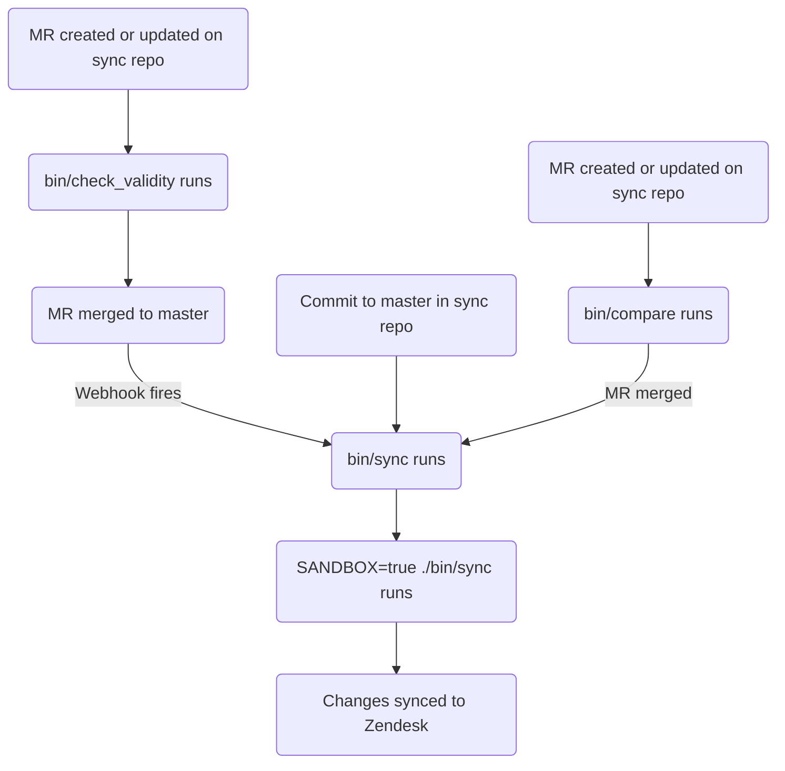

このガイドでは、GitLab における Zendesk の記事を作成、編集、管理する方法を説明します。記事の管理に関する情報を探しているサポートエージェントの方は、[Global Knowledge Base](/handbook/support/knowledge-base/)を参照してください。管理者は[管理者向けタスク](#administrator-tasks)セクションを確認してください。

{}

- デプロイタイプ: `Ad-hoc`
- 同期リポジトリ
  - [Zendesk Global](https://gitlab.com/gitlab-support-readiness/zendesk-global/articles)
  - [Zendesk US Government](https://gitlab.com/gitlab-support-readiness/zendesk-us-government/articles)
- マネージドコンテンツリポジトリ: [Articles](https://gitlab.com/gitlab-com/support/articles)

{}

## 記事を理解する

### 記事とは

記事 (Article) とは、Zendesk のナレッジセンター内にある、情報を含むナレッジベースの項目です。含まれる情報は多岐にわたりますが、一般的にはトラブルシューティング情報や詳細なセットアップガイドなどです。

現在、記事は主に Customer Support チームによって作成・管理されています。

ナレッジセンターは 3 階層の構造を採用しています。

- **カテゴリ (Categories)**（最上位）- 主要なトピック領域を整理します。[categories ページ](/handbook/security/customer-support-operations/zendesk/knowledge-center/categories)に記載されています
- **セクション (Sections)**（中間層）- カテゴリを関連するグループに細分化します。[sections ページ](/handbook/security/customer-support-operations/zendesk/knowledge-center/sections)に記載されています
- **記事 (Articles)**（コンテンツ層）- 個々のヘルプ記事です。このページに記載されています

### 配置 (Placement) とは

配置 (Placement) は、ナレッジセンター内で記事がどのセクションに表示されるかを決定します。1 つの記事は複数の配置を持つことができ、それによって複数のセクションに同時に表示できます。

**重要:** 各配置は Zendesk 内に記事の複製を作成します。これらの記事は同じコンテンツを共有しますが、異なるセクション内の別々のオブジェクトとして存在します。1 つの配置に対する変更は、その記事のすべての配置に影響します。

### 記事の管理方法

Zendesk は UI を介して記事を管理する完全な手段を提供していますが、私たちはよりバージョン管理された方法論を採用しています。これにより、定められたレビュープロセスや、必要に応じたロールバックの実行などが可能になります。

そのため、私たちは同期リポジトリとマネージドコンテンツリポジトリを利用しています。

### 同期リポジトリの仕組み

同期リポジトリのワークフローは次のプロセスに従います。

#### マネージドコンテンツリポジトリ内での処理

マネージドコンテンツリポジトリでマージリクエストが作成または更新されると、`bin/check_validity` スクリプトが CI/CD を介して実行されます。このスクリプトは次の処理を行います。

- `.md` 拡張子で終わるすべてのファイルをループ処理し、次を行います
  - ファイル名が `README.md` の場合は、その反復処理をスキップします
  - ファイルをフロントマターファイルとしてオブジェクトにパースします
    - フロントマターファイルとしてパースできない場合は、ファイル名とエラー文字列を変数に保存し、次の反復処理に進みます
  - オブジェクトがメタデータを持つかどうかをチェックします
    - メタデータを含まない場合は、ファイル名とエラー文字列を変数に保存し、次の反復処理に進みます
  - 必須の各属性に対してチェックを行います（問題があった場合は、ファイル名とエラー文字列を変数に保存します）。
    - `title`
      - String であることをチェックします
    - `previous_title`
      - String であることをチェックします
    - `category`
      - String であることをチェックします
      - 許可されたカテゴリであることをチェックします
        - カテゴリの一覧は [Current categories in use](/handbook/security/customer-support-operations/zendesk/knowledge-center/categories#current-categories-in-use)を参照してください
    - `section`
      - String であることをチェックします
      - 許可されたセクションであることをチェックします
        - セクションの一覧は [Current sections in use](/handbook/security/customer-support-operations/zendesk/knowledge-center/sections#current-sections-in-use)を参照してください
    - `author`
      - String であることをチェックします
    - `tags`
      - Array であることをチェックします
    - `labels`
      - Array であることをチェックします
    - `instances`
      - Array であることをチェックします
      - 許可されたインスタンスであることをチェックします
        - `Global`
        - `Global Sandbox`
        - `US Government`
        - `US Government Sandbox`
      - 少なくとも 1 つのインスタンスが記載されていることをチェックします
    - `public`
      - Boolean であることをチェックします
    - `convert_markdown`
      - Boolean であることをチェックします
  - title を `titles` 変数に保存します（後でチェックするため）
- `titles` 変数の内容について、使用されている重複したタイトルがないかをチェックします
  - 見つかった場合は、重複の一覧を変数に保存します
- `errors` 変数（上記のすべてのチェックで問題を保存するために使用）に問題がないかをチェックします
  - `errors` に値がある場合は、それらを出力し、終了コード 1 で終了します

デフォルトブランチへのコミットが行われると（マージリクエストがマージされたときなど）、2 つの [GitLab webhook](https://docs.gitlab.com/user/project/integrations/webhooks/)が発火し、同期リポジトリで CI/CD パイプラインがトリガーされます。

#### 同期リポジトリ内での処理

{}

- 同期リポジトリのすべての CI/CD ジョブは、Support Team YAML ファイルプロジェクトとマネージドコンテンツプロジェクトのクローンから開始されます。
- マネージドコンテンツリポジトリでマージリクエストが作成または更新されると、`bin/check_validity` スクリプトが CI/CD を介して実行されます。これにより、マージを許可する前に記事のメタデータが検証され、同期リポジトリでのよりスムーズな同期プロセスが可能になります。検証される内容の詳細については、[マネージドコンテンツリポジトリ内での処理](#in-the-managed-content-repo)を参照してください。

{}

同期リポジトリでマージリクエストが作成または更新されると、`./bin/compare` スクリプトが（本番環境とサンドボックス環境の両方に対して）実行され、次の処理を行います。

- すべての Zendesk 記事（およびその翻訳）の一覧を取得します
- すべての Zendesk カテゴリの一覧を取得します
- すべての Zendesk セクションの一覧を取得します
- すべての Zendesk ブランドの一覧を取得します
- すべての Zendesk コンテンツタグの一覧を取得します
- すべての Zendesk 記事ラベルの一覧を取得します
- すべての Zendesk 権限グループの一覧を取得します
- マネージドコンテンツリポジトリ内の `.md` 拡張子で終わるすべてのファイルをループ処理し、次を行います。
  - ファイル名が `README.md` の場合は、その反復処理をスキップします
  - ファイルのパスに `/Templates/` が含まれる場合は、その反復処理をスキップします
  - ファイルをフロントマターファイルとしてオブジェクトにパースします
  - ファイルを分析して、次を判定します。
    - 使用すべき該当するコンテンツタグ
      - 存在しない場合は、作成オブジェクトを保存します
    - タイトルの更新が発生しているかどうか:
      - マネージドコンテンツファイルの `title` 値と一致する `title` 属性を持つ既存の Zendesk 記事を探します
      - Zendesk 記事が存在しない場合は、マネージドコンテンツファイルの `previous_title` 値と一致する `title` 属性を持つ Zendesk 記事が存在するかを再チェックします
        - 存在する場合は、タイトルの更新が発生していることを保存します（後でその記事を特定できるようにするため）
    - 記事ラベルをループ処理して、作成が必要かどうかを判定します
  - 後の比較で使用するためのリポジトリ記事オブジェクトを作成します
- すべてのリポジトリ記事オブジェクトをループ処理し、次を行います。
  - 一致する Zendesk 記事を特定します
    - 存在しない場合は、作成オブジェクトを保存します
  - リポジトリ記事オブジェクトのメタデータ値を Zendesk 記事のメタデータ値と比較します
    - 差分が見つかった場合は、記事更新オブジェクトを保存します
  - リポジトリ記事オブジェクトの翻訳を Zendesk 記事の翻訳と比較します
    - 差分が見つかった場合は、翻訳更新オブジェクトを保存します
- 続いて、次の項目についてレポートします。
  - 作成が必要なコンテンツタグ
  - 作成が必要な記事ラベル
  - 作成が必要な記事
  - 更新が必要な記事
  - 更新が必要な翻訳

{}

マージリクエストの CI/CD パイプラインでは、サンドボックス環境向けに `bin/sync` スクリプトをトリガーする手動ジョブを実行できます（これは任意ですが、検証目的に役立ちます）。

{}

（マネージドコンテンツリポジトリからの [GitLab webhook](https://docs.gitlab.com/user/project/integrations/webhooks/) によって）CI/CD パイプラインがトリガーされるか、デフォルトブランチへのコミットが行われると（マージリクエストがマージされたときなど）、`bin/sync` スクリプトが実行され、次の処理を行います。

- `bin/compare` スクリプトと同じタスクを実行します
  - コンテンツタグの作成が必要であることを保存する代わりに、[Zendesk API](https://developer.zendesk.com/api-reference/help_center/help-center-api/content_tags/#create-content-tag) を介してそれらを作成します
  - 実行の最後にレポートは行いません
- 必要なラベルを [Zendesk API](https://developer.zendesk.com/api-reference/help_center/help-center-api/article_labels/#create-label) を使用して作成します
- 必要な記事を [Zendesk API](https://developer.zendesk.com/api-reference/help_center/help-center-api/articles/#create-article) を使用して作成します
- 必要なすべての記事のメタデータ値を [Zendesk API](https://developer.zendesk.com/api-reference/help_center/help-center-api/articles/#update-article) を使用して更新します
- 必要なすべての記事の翻訳を [Zendesk API](https://developer.zendesk.com/api-reference/help_center/help-center-api/translations/#update-translation) を使用して更新します

### 記事の削除をリクエストする

記事の削除をリクエストするには、まず記事のマネージドコンテンツファイルを修正する必要があります（記事の再作成を防ぐため）。

- 特定の Zendesk インスタンスから記事を削除する場合は、記事のマネージドコンテンツファイルを修正して、該当する Zendesk インスタンスを `instances` 属性から削除します
- すべての Zendesk インスタンスから記事を削除する場合は、記事のマネージドコンテンツファイルを削除します

それが完了したら、[Feature Request issue](https://gitlab.com/gitlab-com/gl-security/corp/cust-support-ops/issue-tracker/-/issues/new?description_template=Feature) を作成してください（Customer Support Operations チームによる手動の対応が必要なため）。

### 記事からの配置の削除をリクエストする

記事から配置を削除することをリクエストするには、[Feature Request issue](https://gitlab.com/gitlab-com/gl-security/corp/cust-support-ops/issue-tracker/-/issues/new?description_template=Feature) を作成してください（Customer Support Operations チームによる手動の対応が必要なため）。

## 管理者向けタスク

{}

- このセクションのすべての項目には、Zendesk への `Administrator` レベルのアクセス権が必要です。

{}

### 記事を新しい場所に移動する

{}

- これはドキュメント化のみを目的としたものです。記事を新しいセクションに移動する必要がある場合は、マネージドコンテンツファイルを介して行うべきです。

{}

記事を別の場所に移動するには、次のようにします。

1. セクションを含むカテゴリにアクセスします
1. 記事が現在配置されているセクションの名前をクリックします
1. 該当する記事を特定し、記事の右側にある縦に並んだ 3 つの点をクリックします
1. `Move to` をクリックします
1. 記事の移動先となる場所を選択します
1. `Move` をクリックします

### 記事から配置を削除する

{}

- これは恒久的なアクションです。元に戻すことはできません。慎重に行ってください。
- これは、該当するリクエスト issue（Feature Request）が存在する場合にのみ行うべきです。存在しない場合は、まず作成し（そして対応する前に標準のプロセスを通すようにしてください）。

{}

ごくまれに、記事から配置を削除するようリクエストされることがあります。これは次のようにして行います。

1. [ナレッジセンターにアクセスする](../knowledge-center/#accessing-the-knowledge-center)
1. 該当する記事を特定し、タイトルをクリックします（エディタを開くため）
1. エディタの右側にある `Placements` パネルで、削除する配置を特定します
1. 縦に並んだ 3 つの点をクリックします
1. `Delete` をクリックします
1. `Delete placement` をクリックして削除を確定します

## よくある問題とトラブルシューティング

これは、必要に応じて項目が追加されていく生きたセクションです。

### マージ後に記事の変更が反映されない

通常、同期が完全に実行されるまでには 5 〜 10 分かかります。その時間が経過したら、ブラウザで Zendesk をハードリフレッシュしてください（その後、変更がないか確認します）。
