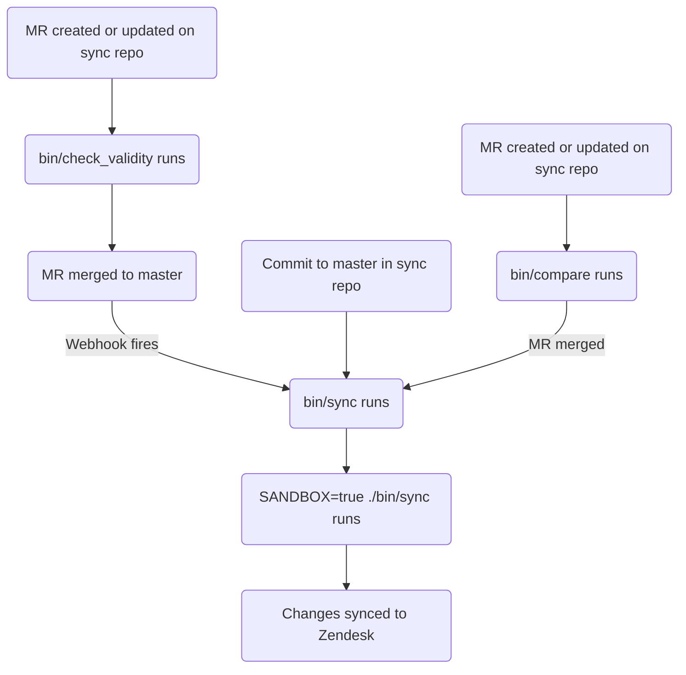

このガイドでは、GitLab における Zendesk 記事の作成、編集、管理方法を扱います。記事の管理に関する情報を探しているサポートエージェントの方は、[Global Knowledge Base](/handbook/support/knowledge-base/) を参照してください。管理者は [管理者タスク](#administrator-tasks) セクションを確認してください。

{}

- デプロイメントタイプ: `Ad-hoc`
- 同期リポジトリ
  - [Zendesk Global](https://gitlab.com/gitlab-support-readiness/zendesk-global/articles)
  - [Zendesk US Government](https://gitlab.com/gitlab-support-readiness/zendesk-us-government/articles)
- 管理コンテンツリポジトリ: [Articles](https://gitlab.com/gitlab-com/support/articles)

{}

## 記事を理解する

### 記事とは

記事は、Zendesk ナレッジセンター内のナレッジベース項目であり、情報を含んでいます。その中の情報は多岐にわたりますが、一般的にはトラブルシューティング情報や詳細なセットアップガイドなどです。

現在、これらは主に Customer Support チームによって作成・管理されています。

ナレッジセンターは 3 階層の構造を使用しています。

- **Categories**（最上位レベル） - 主要なトピック領域を整理します。[categories ページ](/handbook/security/customer-support-operations/zendesk/knowledge-center/categories) に記載されています
- **Sections**（中間レベル） - カテゴリを関連するグループに細分します。[sections ページ](/handbook/security/customer-support-operations/zendesk/knowledge-center/sections) に記載されています
- **Articles**（コンテンツレベル） - 個々のヘルプ記事です。このページに記載されています

### placement とは

placement は、記事がナレッジセンター内のどのセクションに表示されるかを決定します。1 つの記事は複数の placement を持つことができ、これにより異なるセクションに同時に表示できます。

**重要:** 各 placement は、Zendesk 内に記事の複製を作成します。これらの記事は同じコンテンツを共有しますが、異なるセクション内に別々のオブジェクトとして存在します。1 つの placement への変更は、その記事のすべての placement に影響します。

### 記事をどのように管理するか

Zendesk は UI を介した記事管理の完全な手段を提供していますが、私たちはより版管理されたメソドロジーを採用しています。これにより、定められたレビュープロセスや、必要に応じたロールバックの実行などが可能になります。

そのため、私たちは同期リポジトリと管理コンテンツリポジトリを利用します。

### 同期リポジトリの仕組み

同期リポジトリのワークフローは次のプロセスに従います。

#### 管理コンテンツリポジトリ内

管理コンテンツリポジトリでマージリクエストが作成または更新されると、CI/CD を介して `bin/check_validity` スクリプトが実行されます。このスクリプトは次のことを行います。

- 拡張子 `.md` で終わるすべてのファイルをループし、次のことを行います
  - ファイル名が `README.md` の場合、そのイテレーションをスキップします
  - ファイルをフロントマターファイルとしてオブジェクトにパースします
    - フロントマターファイルとしてパースできない場合、ファイル名とエラー文字列を変数に格納し、次のイテレーションに進みます
  - オブジェクトがメタデータを持っているか確認します
    - メタデータを含まない場合、ファイル名とエラー文字列を変数に格納し、次のイテレーションに進みます
  - 必須の各属性に対してチェックを行います（問題があれば、ファイル名とエラー文字列を変数に格納します）。
    - `title`
      - String であることを確認します
    - `previous_title`
      - String であることを確認します
    - `category`
      - String であることを確認します
      - 許可されたカテゴリであることを確認します
        - カテゴリの一覧については [Current categories in use](/handbook/security/customer-support-operations/zendesk/knowledge-center/categories#current-categories-in-use) を参照してください
    - `section`
      - String であることを確認します
      - 許可されたセクションであることを確認します
        - セクションの一覧については [Current sections in use](/handbook/security/customer-support-operations/zendesk/knowledge-center/sections#current-sections-in-use) を参照してください
    - `author`
      - String であることを確認します
    - `tags`
      - Array であることを確認します
    - `labels`
      - Array であることを確認します
    - `instances`
      - Array であることを確認します
      - 許可されたインスタンスであることを確認します
        - `Global`
        - `Global Sandbox`
        - `US Government`
        - `US Government Sandbox`
      - 少なくとも 1 つのインスタンスが記載されていることを確認します
    - `public`
      - Boolean であることを確認します
    - `convert_markdown`
      - Boolean であることを確認します
  - title を `titles` 変数に格納します（後でチェックするため）
- `titles` 変数の内容に、使用中の重複するタイトルがないか確認します
  - 見つかった場合、重複のリストを変数に格納します
- `errors` 変数（上記のすべてのチェックで問題を格納するために使用）に問題がないか確認します
  - `errors` に値がある場合、それらを出力し、終了コード 1 で終了します

デフォルトブランチにコミットが行われると（マージリクエストがマージされたときなど）、2 つの [GitLab Webhook](https://docs.gitlab.com/user/project/integrations/webhooks/) が発火し、同期リポジトリの CI/CD パイプラインがトリガーされます。

#### 同期リポジトリ内

{}

- 同期リポジトリのすべての CI/CD ジョブは、Support Team YAML files プロジェクトと管理コンテンツプロジェクトをクローンすることから始まります。
- 管理コンテンツリポジトリでマージリクエストが作成または更新されると、CI/CD を介して `bin/check_validity` スクリプトが実行されます。これにより、マージを許可する前に記事のメタデータが検証され、同期リポジトリでの同期プロセスがよりスムーズになります。何が検証されるかの詳細については、[管理コンテンツリポジトリ内](#in-the-managed-content-repo) を参照してください。

{}

同期リポジトリでマージリクエストが作成または更新されると、`./bin/compare` スクリプトが（本番環境とサンドボックス環境の両方に対して）実行され、次のことを行います。

- すべての Zendesk 記事（およびその翻訳）のリストを取得します
- すべての Zendesk カテゴリのリストを取得します
- すべての Zendesk セクションのリストを取得します
- すべての Zendesk ブランドのリストを取得します
- すべての Zendesk コンテンツタグのリストを取得します
- すべての Zendesk 記事ラベルのリストを取得します
- すべての Zendesk 権限グループのリストを取得します
- 管理コンテンツリポジトリ内の拡張子 `.md` で終わるすべてのファイルをループし、次のことを行います。
  - ファイル名が `README.md` の場合、そのイテレーションをスキップします
  - ファイルパスに `/Templates/` が含まれる場合、そのイテレーションをスキップします
  - ファイルをフロントマターファイルとしてオブジェクトにパースします
  - ファイルを分析して次を判定します。
    - 使用すべき対応するコンテンツタグ
      - 存在しない場合、作成オブジェクトを格納します
    - タイトルの更新が発生しているか:
      - 管理コンテンツファイルの `title` 値に一致する `title` 属性を持つ既存の Zendesk 記事を探します
      - Zendesk 記事が存在しない場合、管理コンテンツファイルの `previous_title` 値に一致する `title` 属性を持つ Zendesk 記事が存在するか再確認します
        - 存在する場合、タイトルの更新が発生していることを格納します（後で記事を特定する方法がわかるように）
    - 記事ラベルをループし、作成が必要かどうかを判定します
  - 後の比較で使用するリポジトリ記事オブジェクトを作成します
- すべてのリポジトリ記事オブジェクトをループし、次のことを行います。
  - 一致する Zendesk 記事を特定します
    - 存在しない場合、作成オブジェクトを格納します
  - リポジトリ記事オブジェクトのメタデータ値を Zendesk 記事のメタデータ値と比較します
    - 差異が見つかった場合、記事更新オブジェクトを格納します
  - リポジトリ記事オブジェクトの翻訳を Zendesk 記事の翻訳と比較します
    - 差異が見つかった場合、翻訳更新オブジェクトを格納します
- 次について報告します。
  - 必要なコンテンツタグの作成
  - 必要な記事ラベルの作成
  - 必要な記事の作成
  - 必要な記事の更新
  - 必要な翻訳の更新

{}

マージリクエストの CI/CD パイプラインで手動ジョブを実行し、サンドボックス環境向けに `bin/sync` スクリプトをトリガーできます（これは任意ですが、検証目的で有用です）。

{}

（管理コンテンツリポジトリからの [GitLab Webhook](https://docs.gitlab.com/user/project/integrations/webhooks/) を介して）CI/CD パイプラインがトリガーされるか、デフォルトブランチにコミットが行われると（マージリクエストがマージされたときなど）、`bin/sync` スクリプトが実行され、次のことを行います。

- `bin/compare` スクリプトと同じタスクを行います
  - コンテンツタグを作成する必要性を格納する代わりに、[Zendesk API](https://developer.zendesk.com/api-reference/help_center/help-center-api/content_tags/#create-content-tag) を介してそれらを作成します
  - 実行の最後にレポートは行いません
- [Zendesk API](https://developer.zendesk.com/api-reference/help_center/help-center-api/article_labels/#create-label) を使用して、必要なラベルを作成します
- [Zendesk API](https://developer.zendesk.com/api-reference/help_center/help-center-api/articles/#create-article) を使用して、必要な記事を作成します
- [Zendesk API](https://developer.zendesk.com/api-reference/help_center/help-center-api/articles/#update-article) を使用して、必要なすべての記事のメタデータ値を更新します
- [Zendesk API](https://developer.zendesk.com/api-reference/help_center/help-center-api/translations/#update-translation) を使用して、必要なすべての記事の翻訳を更新します

### 記事の削除をリクエストする

記事の削除をリクエストするには、まず記事の管理コンテンツファイルを変更する必要があります（記事の再作成を防ぐため）。

- 特定の Zendesk インスタンスから記事を削除する場合は、記事の管理コンテンツファイルを変更し、`instances` 属性から該当する Zendesk インスタンスを削除します
- すべての Zendesk インスタンスから記事を削除する場合は、記事の管理コンテンツファイルを削除します

それが完了したら、[Feature Request issue](https://gitlab.com/gitlab-com/gl-security/corp/cust-support-ops/issue-tracker/-/issues/new?description_template=Feature) を作成してください（Customer Support Operations チームによる手動での対応が必要になるためです）。

### 記事からの placement の削除をリクエストする

記事からの placement の削除をリクエストするには、[Feature Request issue](https://gitlab.com/gitlab-com/gl-security/corp/cust-support-ops/issue-tracker/-/issues/new?description_template=Feature) を作成してください（Customer Support Operations チームによる手動での対応が必要になるためです）。

## 管理者タスク

{}

- このセクションのすべての項目には、Zendesk への `Administrator` レベルのアクセスが必要です。

{}

### 記事を新しい場所に移動する

{}

- これはドキュメント目的のみです。記事を新しいセクションに移動する必要がある場合は、管理コンテンツファイルを介して行ってください。

{}

記事を別の場所に移動するには:

1. セクションを含むカテゴリにアクセスします
1. 記事が現在配置されているセクションの名前をクリックします
1. 該当する記事を見つけ、記事の右側にある縦の 3 点ドットをクリックします
1. `Move to` をクリックします
1. 記事を移動したい場所を選択します
1. `Move` をクリックします

### 記事から placement を削除する

{}

- これは恒久的なアクションです。元に戻すことはできません。慎重に行ってください。
- これは対応するリクエスト issue（Feature Request）がある場合にのみ行うべきです。存在しない場合は、まず作成し（そして標準プロセスを通してから作業を行い）ます。

{}

ごく稀に、記事から placement を削除するよう依頼されることがあります。これは次の手順で行います。

1. [ナレッジセンターにアクセスする](../knowledge-center/#accessing-the-knowledge-center)
1. 該当する記事を見つけ、タイトルをクリックします（エディタを開くため）
1. エディタの右側にある `Placements` パネルで、削除する placement を見つけます
1. 縦の 3 点ドットをクリックします
1. `Delete` をクリックします
1. `Delete placement` をクリックして削除を確定します

## よくある問題とトラブルシューティング

これは、必要に応じて項目が追加されていく生きたセクションです。

### マージ後に記事の変更が表示されない

通常、同期が完全に実行されるには 5 〜 10 分必要です。その時間が経過したら、ブラウザで Zendesk をハードリフレッシュしてください（その後、変更を確認します）。
