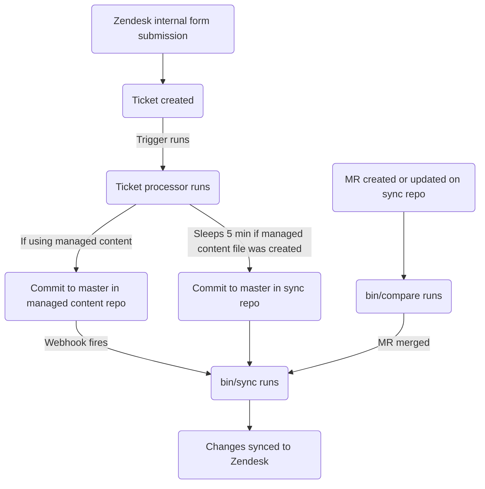

このガイドでは、GitLab における Zendesk マクロの作成・編集・管理方法について説明します。シンプルなマクロを作成しようとするサポートエージェントは、[非管理者としてマクロを作成する](#creating-a-macro-as-a-non-admin)を参照してください。管理者は[管理者タスク](#administrator-tasks)のセクションを確認してください。

{}

- デプロイタイプ: `Ad-hoc`
- 同期リポジトリ
  - [Zendesk Global](https://gitlab.com/gitlab-support-readiness/zendesk-global/macros)
  - [Zendesk US Government](https://gitlab.com/gitlab-support-readiness/zendesk-us-government/macros)
- マネージドコンテンツリポジトリ
  - [Zendesk Global](https://gitlab.com/gitlab-com/support/zendesk-global/macros)
  - [Zendesk US Government](https://gitlab.com/gitlab-com/support/zendesk-us-government/macros)

{}

## マクロを理解する

### マクロとは

[Zendesk](https://support.zendesk.com/hc/en-us/articles/4408844187034-Creating-macros-for-repetitive-ticket-responses-and-actions) によると次のとおりです。

> マクロとは、エージェントがチケットを作成または更新する際に手動で適用できる、あらかじめ用意された応答またはアクションです。マクロには、チケットのプロパティを更新できるアクションが含まれます。
>
> トリガーや自動化とは異なり、マクロにはアクションのみが含まれ、条件は含まれません。マクロを適用すべきかどうかを判断するためにチケットを自動的に評価する仕組みがないため、条件は使用されません。エージェントがチケットを評価し、必要に応じて手動でマクロを適用します。

### マクロのカテゴリ分け

Zendesk のマクロにはカテゴリ分けがありますが、UI では分かりにくくなっています。代わりに、カテゴリ分けはマクロ自体の名前に基づいて決定されます。基本的に、各語句のグループがマクロのドロップダウンセレクター内で一種の「フォルダ」になります。Zendesk が現在使用している区切り文字は 2 つのコロン（`::`）です。

### シンプルマクロとアドバンスドマクロ

シンプルマクロとは、次のものだけを変更するマクロです。

- チケットの割り当て（またはその削除）
- チケットへのタグの追加
- チケットへの公開コメントまたは非公開コメントの追加
- チケットのステータスの変更

マクロがこれらの項目以外の何かを行う場合、現時点では「アドバンスド」とみなされます。

### Zendesk でマクロを使用する

チケットにマクロを適用する方法は 2 つあります。

- スラッシュコマンド経由
- マクロ選択ドロップダウン経由

詳細については、[Zendesk のドキュメント](https://support.zendesk.com/hc/en-us/articles/4408887656602-Using-macros-to-update-tickets)を参照してください。

### マクロの管理方法

Zendesk は UI 経由でマクロを管理する完全な方法を提供していますが、私たちはよりバージョン管理されたやり方を採用しています。これにより、決まったレビュープロセスや、必要に応じてロールバックを実行する機能などが可能になります。

そのため、私たちは Zendesk の内部フォーム、同期リポジトリ、マネージドコンテンツリポジトリを利用しています。

### 同期リポジトリの仕組み

同期リポジトリのワークフローは次のプロセスに従います。



#### 人間可読の置換

{}

- YAML ファイル経由でマクロを作成・編集する `administrators` にのみ適用されます。

{}

現在、同期リポジトリは、さまざまな項目を人間可読の項目から「Zendesk」相当の項目へ置換できます。これには次のものが含まれます。

| 人間可読の項目 | Zendesk フィールド項目 | アクションの場所 | 備考 |
|---------------------|--------------------|-----------------|-------|
| `'Brand: XXX'` | `brand_id` | `value` | `XXX` をブランドの `name` に置き換えます |
| `'Field: XXX'` | `custom_fields_xxx` | `field` | `XXX` をチケットフィールドの `title` に置き換えます |
| `'Group: XXX'` | `group_id` | `value` | `XXX` をグループの `name` に置き換えます |
| `'XXX'` | `role` | `value` | `XXX` をロールタイプの `name`、または依頼者のメールアドレスに置き換えます |
| `'Form: XXX'` | `ticket_form_id` | `value` | `XXX` をチケットフォームの `name` に置き換えます |
| `'Schedule: XXX'` | `set_schedule` | `value` | `XXX` をスケジュールの `name` に置き換えます |
| `'Schedule: XXX'` | `schedule_id` | `value` | `XXX` をスケジュールの `name` に置き換えます |
| `'XXX'` | `organization_id` | `value` | `XXX` を組織の `salesforce_id` 属性に置き換えます |
| `'XXX'` | `assignee_id` | `value` | `XXX` をエージェントのメールアドレスに置き換えます |
| `'XXX'` | `satisfaction_reason_code` | `value` | `XXX` を満足度理由の `name` に置き換えます |
| `'XXX'` | `via_id` | `value` | `XXX` を via タイプの `name` に置き換えます |
| `'XXX'` | `requester_role` | `value` | `XXX` を依頼者ロールタイプの `name` に置き換えます |

例として、`Preferred Region for Support` フィールドの値を `AMER` に変更するマクロが必要な場合、置換を使用するには次のようにします。

```yaml
- field: 'Field: Preferred Region for Support'
  value: 'AMER'
```

#### 同期リポジトリで MR を作成するとき

同期リポジトリで MR が作成されると、（`bin/compare` スクリプト経由で）比較アクションが実行され、次の処理が行われます。

1. マネージドコンテンツリポジトリのクローンを実行します
1. Zendesk インスタンスからすべてのブランド、チケットフィールド、チケットフォーム、グループ、スケジュール、満足度理由、マクロを取得します
1. 同期リポジトリ内のすべての YAML ファイルをレビューしてマクロオブジェクトを生成します
   - また、同期リポジトリのファイルに次の問題が存在しないことを確認します。
     - title が欠落している
     - `active` 属性が `false` のファイルが `active` フォルダ内に存在しない
     - `active` 属性が `true` のファイルが `inactive` フォルダ内に存在しない
     - `title` 属性が重複して使用されている
     - `contains_managed_content` 属性が `true` のファイルに対応するマネージドコンテンツファイルが存在する
1. YAML ファイルのすべてのマクロオブジェクトを、対応する Zendesk 項目（`title` および `previous_title` 属性の値を確認して特定）と比較します
   - 存在しない場合は、後で使用するために作成オブジェクトを変数に格納します
   - 存在するが属性値が異なる場合は、後で使用するために更新オブジェクトを変数に格納します
1. 比較レポートを出力します

#### Zendesk への同期

同期リポジトリは、次の 2 つのイベントのいずれかが発生したときに同期タスクを実行します。

- マネージドコンテンツリポジトリが[プロジェクト webhook](https://docs.gitlab.com/user/project/integrations/webhooks/) 経由でシグナルを送信する（マネージドコンテンツリポジトリの `master` ブランチでコミットが発生したときにそうするよう設定されています）
- 同期リポジトリの `master` ブランチでコミットが発生する

いずれかのアクションが発生すると、同期は[比較アクション](#when-creating-mrs-in-the-sync-repo)を実行し、その後、生成されたオブジェクトを使用して、必要な Zendesk エンドポイントへのループによって必要な作成と更新を行います。

- [作成](https://developer.zendesk.com/api-reference/ticketing/business-rules/macros/#create-macro)
- [更新](https://developer.zendesk.com/api-reference/ticketing/business-rules/macros/#update-macro)

#### 孤立したマネージドコンテンツファイルの報告

2 月、5 月、8 月、11 月の 1 日に、[スケジュールパイプライン](https://docs.gitlab.com/ci/pipelines/schedules/)が同期リポジトリに対し、サポートリーダーシップチームがすべての孤立したマネージドコンテンツファイルをレビューするための Issue を作成させます。

これは同期リポジトリの `bin/find_orphaned_files` スクリプト経由で行われ、次の処理を行います。

1. マネージドコンテンツリポジトリのクローンを実行します
1. マネージドコンテンツリポジトリの `active` フォルダと `inactive` フォルダ内のすべてのファイルをレビューし、`state`（つまり `active` または `inactive`）、`path`、`title` を判定します
1. 同期リポジトリ自体の `active` フォルダと `inactive` フォルダ内のすべてのファイルをレビューし、次を判定します。
   - そのファイルがマネージドコンテンツファイルを使用しているか
   - マネージドコンテンツファイルが存在するか
1. 同期リポジトリのファイルがないマネージドコンテンツファイルを見つけた場合、それを Customer Support リーダーシップに報告する Issue を作成します

## 非管理者としてマクロを作成する {#creating-a-macro-as-a-non-admin}

### シンプルマクロ

[シンプルマクロ](#simple-vs-advanced-macros)を作成してもらうには、お使いのインスタンス用の Zendesk 内部フォームを利用します。

- [Zendesk Global](https://gitlab-internal.zendesk.com/hc/en-us/requests/new?ticket_form_id=22784239213084&tf_22783439650716=custsuppops_ir_category_create_macro)
- [Zendesk US Government](https://gitlab-federal-internal.zendesk.com/hc/en-us/requests/new?ticket_form_id=41826926738708&tf_41825819758484=custsuppops_ir_category_create_macro)

フォームに記入してリクエストを送信すると、[チケットプロセッサ](/handbook/security/customer-support-operations/zendesk/tickets/processor)が提供された情報を使用してシンプルマクロを作成します。

マクロにマネージドコンテンツファイルが必要であり（つまり、マクロがコメントを行う場合）、まだ存在しない場合は、マネージドコンテンツリポジトリにファイルが作成されます。

### アドバンスドマクロ

[アドバンスドマクロ](#simple-vs-advanced-macros)の作成については、まず [SIG チーム](https://gitlab.com/support-innovation-group)のメンバーに相談し、[このテンプレート](https://gitlab.com/gitlab-com/gl-security/corp/cust-support-ops/issue-tracker/-/issues/new?issuable_template=Feature)を使用して Customer Support Operations チームに Issue を提出してもらってください（Customer Support Operations チームによる手動対応が必要になるためです）。

## 非管理者としてマクロを編集する

### マクロで使用されるコメントの文面を変更する {#changing-the-comment-wording-used-in-a-macro}

マクロのコメントの文面を編集するには、マネージドコンテンツリポジトリの対応するファイルを変更します。`master` ブランチにマージされると、（同期リポジトリ経由で）Zendesk インスタンスに同期されます。

### タイトル、制限、コメント以外の文面アクションなどの変更

マクロのその他の項目を変更するには、まず [SIG チーム](https://gitlab.com/support-innovation-group)のメンバーに相談し、[このテンプレート](https://gitlab.com/gitlab-com/gl-security/corp/cust-support-ops/issue-tracker/-/issues/new?issuable_template=Feature)を使用して Customer Support Operations チームに Issue を提出してもらってください（Customer Support Operations チームによる手動対応が必要になるためです）。

## 非管理者としてマクロを無効化する

マクロの無効化をリクエストするには、まず [SIG チーム](https://gitlab.com/support-innovation-group)のメンバーに相談し、[このテンプレート](https://gitlab.com/gitlab-com/gl-security/corp/cust-support-ops/issue-tracker/-/issues/new?issuable_template=Feature)を使用して Customer Support Operations チームに Issue を提出してもらってください（Customer Support Operations チームによる手動対応が必要になるためです）。

## 管理者タスク {#administrator-tasks}

{}

- このセクションのすべての項目は、Zendesk への `Administrator` レベルのアクセスを必要とします。

{}

### マクロの使用状況情報を確認する

マクロの使用状況情報を確認するには、次のようにします。

1. Zendesk インスタンスの管理パネルに移動します
1. `Workspaces > Agent tools > Macros` に進みます
1. マクロのリストの一番右にあるアイコン（3 つの縦長の長方形のように見えます）をクリックします
1. 確認したい使用状況の列をクリックします

### マクロを作成する

{}

- これは、対応するリクエスト Issue（機能リクエスト、Administrative、Bug など）がある場合にのみ行ってください。存在しない場合は、まず作成してください（そして作業する前に標準プロセスを通してください）。
- マネージドコンテンツファイルを使用するマクロを作成する場合は、先に該当するマネージドコンテンツファイルを作成する必要があります。

{}

[シンプルマクロ](#simple-vs-advanced-macros)を作成する場合は、[シンプルマクロ](#simple-macros)を参照してください。

[アドバンスドマクロ](#simple-vs-advanced-macros)の作成には、同期リポジトリで MR を作成する必要があります。実際に行う変更はリクエスト自体に依存します。使用できる出発点となるテンプレートは次のとおりです。

```yaml
---
title: 'Your::Title::Here'
previous_title: 'Your::Title::Here'
description: 'Your description here'
active: true
actions:
- field: 'the_action_to_perform'
  value: 'the_value_to_use'
restriction: null
contains_managed_content: false
```

ピアが MR をレビューして承認した後、MR をマージできます（これにより変更が Zendesk インスタンスに同期されます）。

### マクロを編集する

{}

- これは、対応するリクエスト Issue（機能リクエスト、Administrative、Bug など）がある場合にのみ行ってください。存在しない場合は、まず作成してください（そして作業する前に標準プロセスを通してください）。
- マクロの `contains_managed_content` 属性を `false` から `true` に変更する場合は、先に該当するマネージドコンテンツファイルを作成する必要があります。
- マクロの `contains_managed_content` 属性を `true` から `false` に変更する場合は、対応するマネージドコンテンツファイルを削除するフォローアップ MR を作成してください。

{}

マクロのコメントの文面のみを変更する場合は、[マクロで使用されるコメントの文面を変更する](#changing-the-comment-wording-used-in-a-macro)を参照してください。

その他の変更については、同期リポジトリで MR を作成する必要があります。実際に行う変更はリクエスト自体に依存します。

ピアが MR をレビューして承認した後、MR をマージできます（これにより変更が Zendesk インスタンスに同期されます）。

#### マクロのタイトルを変更する

マクロのタイトルを変更する必要がある場合は、現在の値を `previous_title` 属性にコピーしてから `title` 属性を変更します。これにより、同期が更新対象のマクロを引き続き特定できるようになります。

### マクロを無効化する

{}

- これは、対応するリクエスト Issue（機能リクエスト、Administrative、Bug など）がある場合にのみ行ってください。存在しない場合は、まず作成してください（そして作業する前に標準プロセスを通してください）。
- マクロがマネージドコンテンツファイルを使用していた場合（つまり、YAML ファイルの `contains_managed_content` 属性が以前 `true` に設定されていた場合）、マネージドコンテンツリポジトリで対応するファイルを `active` から `inactive` の場所に移動する必要もあるでしょう。

{}

マクロを無効化するには、同期リポジトリで MR を作成する必要があります。この MR では、対応するマクロの YAML ファイルに対して次の処理を行ってください。

1. ファイルを `active` から `inactive` のパスに移動します
1. `active` 属性の値を `false` に変更します
1. `actions` の値を次のように変更します。
   - Zendesk Global の場合:

     ```yaml
     - field: 'brand_id'
       value: 'GitLab Support'
     ```

   - Zendesk US Government の場合:

     ```yaml
     - field: 'brand_id'
       value: 'GitLab'
     ```

1. `contains_managed_content` 属性の値を `false` に変更します

ピアが MR をレビューして承認した後、MR をマージできます（これにより変更が Zendesk インスタンスに同期されます）。

### マクロを削除する

{}

- マクロは無効化されている場合にのみ削除できます。
- これは、対応するリクエスト Issue（機能リクエスト、Administrative、Bug など）がある場合にのみ行ってください。存在しない場合は、まず作成してください（そして作業する前に標準プロセスを通してください）。
- マクロを削除する際は、同期リポジトリとマネージドコンテンツリポジトリからもファイルを削除する必要があるでしょう。

{}

同期リポジトリは削除を実行しないため、これは Zendesk 自体で行う必要があります。

マクロを削除するには、次のようにします。

1. Zendesk インスタンスの管理ダッシュボードに移動します
   - [Zendesk Global（本番）](https://gitlab.zendesk.com/admin/home)
   - [Zendesk Global（サンドボックス）](https://gitlab1707170878.zendesk.com/admin/home)
   - [Zendesk US Government（本番）](https://gitlab-federal-support.zendesk.com/admin/home)
   - [Zendesk US Government（サンドボックス）](https://gitlabfederalsupport1585318082.zendesk.com/admin/home)
1. `Workspaces > Agent tools > Macros` に進みます
   - [Zendesk Global](https://gitlab.zendesk.com/admin/workspaces/agent-workspace/macros)
   - [Zendesk Global（サンドボックス）](https://gitlab1707170878.zendesk.com/admin/workspaces/agent-workspace/macros)
   - [Zendesk US Government](https://gitlab-federal-support.zendesk.com/admin/workspaces/agent-workspace/macros)
   - [Zendesk US Government（サンドボックス）](https://gitlabfederalsupport1585318082.zendesk.com/admin/workspaces/agent-workspace/macros)
1. 削除したいマクロを見つけて名前をクリックします
1. `Actions` ボタンをクリックします
1. `Delete` をクリックします
1. 確認ボックスで `Delete macro` をクリックします

## よくある問題とトラブルシューティング

### マージ後にマクロの変更が表示されない

同期は通常、完全に実行されるまで 5 〜 10 分かかります。その時間が経過したら、ブラウザで Zendesk をハードリフレッシュしてください（その後、変更を確認します）。
