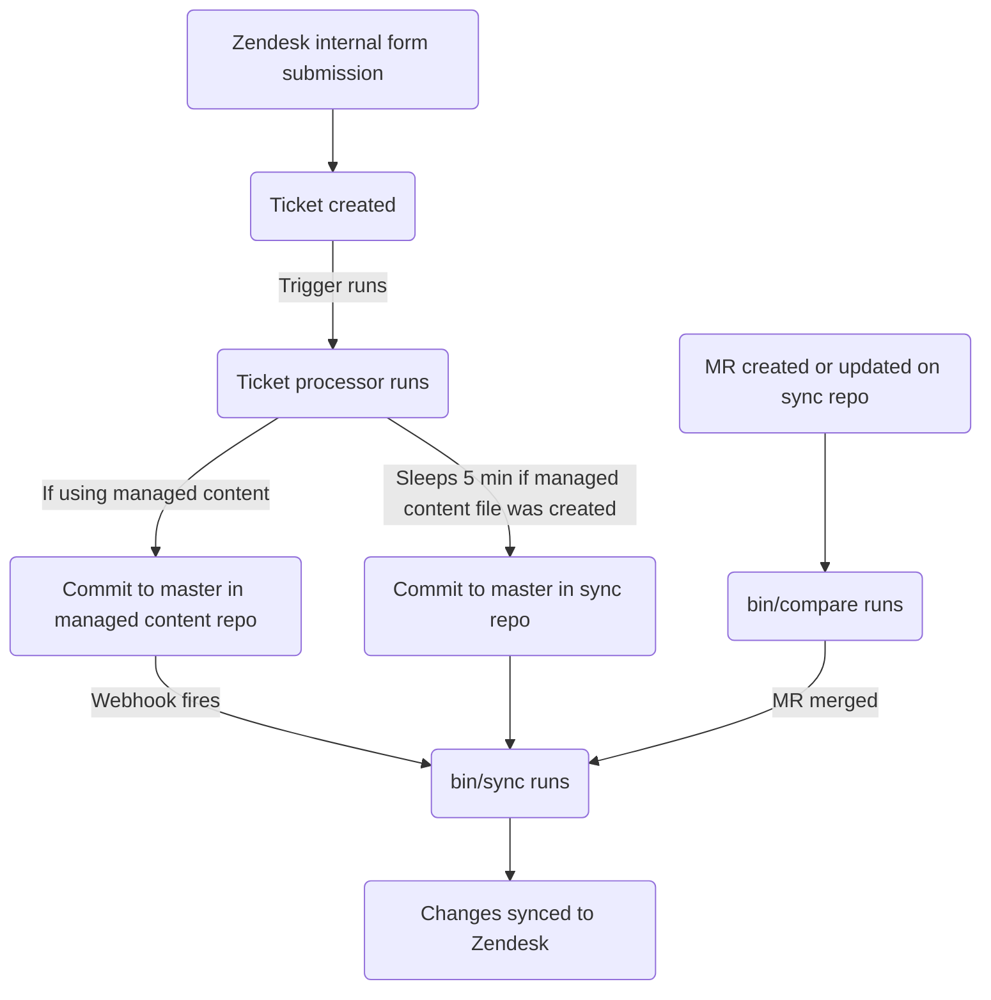

このガイドでは、GitLab における Zendesk マクロの作成・編集・管理方法について説明します。シンプルなマクロを作成しようとするサポートエージェントは、[非管理者としてマクロを作成する](#creating-a-macro-as-a-non-admin) を参照してください。管理者は [管理者タスク](#administrator-tasks) のセクションを確認してください。

{}

- デプロイタイプ: `Ad-hoc`
- 同期リポジトリ
  - [Zendesk Global](https://gitlab.com/gitlab-support-readiness/zendesk-global/macros)
  - [Zendesk US Government](https://gitlab.com/gitlab-support-readiness/zendesk-us-government/macros)
- 管理コンテンツリポジトリ
  - [Zendesk Global](https://gitlab.com/gitlab-com/support/zendesk-global/macros)
  - [Zendesk US Government](https://gitlab.com/gitlab-com/support/zendesk-us-government/macros)

{}

## マクロを理解する

### マクロとは

[Zendesk](https://support.zendesk.com/hc/en-us/articles/4408844187034-Creating-macros-for-repetitive-ticket-responses-and-actions) によると:

> A macro is a prepared response or action that an agent can manually apply when they are creating or updating tickets. Macros contain actions that can update ticket properties.
>
> Unlike triggers and automations, macros only contain actions, not conditions. Conditions aren't used because nothing is automatically evaluating tickets to determine if a macro should be applied. Agents evaluate tickets and apply macros manually as needed.

### マクロのカテゴリ化

Zendesk のマクロにはカテゴリ化がありますが、UI 上では明確ではありません。代わりに、カテゴリ化はマクロの名前自体に基づいて決定されます。基本的に、語のグループそれぞれがマクロのドロップダウンセレクター内で「フォルダ」のようなものになります。Zendesk が現在使用している区切り文字は 2 つのコロン (`::`) です。

### シンプル vs. アドバンスドマクロ {#simple-vs-advanced-macros}

シンプルマクロとは、以下のみを変更するマクロです:

- チケット割り当て (またはその解除)
- チケットへのタグ追加
- チケットへのパブリックまたはプライベートコメントの追加
- チケットのステータス変更

これらの項目以外を行うマクロは、現時点で「アドバンスド」とみなされます。

### Zendesk でマクロを使用する

マクロをチケットに適用するには 2 つの方法があります:

- スラッシュコマンド経由
- マクロ選択ドロップダウン経由

詳細については [Zendesk のドキュメント](https://support.zendesk.com/hc/en-us/articles/4408887656602-Using-macros-to-update-tickets) を参照してください。

### マクロの管理方法

Zendesk は UI からマクロをフルに管理する方法を提供していますが、私たちはよりバージョン管理されたメソドロジーを採用しています。これによって、定型化されたレビュープロセスや、必要に応じたロールバック等が可能になります。

そのため、Zendesk の内部フォーム、同期リポジトリ、管理コンテンツリポジトリを利用しています。

### 同期リポジトリの仕組み

同期リポジトリのワークフローは以下のプロセスに従います:



#### 人間が読みやすい置換

{}

- YAML ファイル経由でマクロを作成/編集する `administrators` にのみ適用されます

{}

現在、同期リポジトリは、人間が読める項目から「Zendesk」相当の項目へと、さまざまな項目の置換を実行できます。これには以下が含まれます:

| 人間が読める項目 | Zendesk のフィールド項目 | アクション場所 | 注記 |
|------------------|-------------------------|----------------|------|
| `'Brand: XXX'` | `brand_id` | `value` | `XXX` をブランドの `name` に置き換える |
| `'Field: XXX'` | `custom_fields_xxx` | `field` | `XXX` をチケットフィールドの `title` に置き換える |
| `'Group: XXX'` | `group_id` | `value` | `XXX` をグループの `name` に置き換える |
| `'XXX'` | `role` | `value` | `XXX` をロールタイプの `name`、または要求者のメールアドレスに置き換える |
| `'Form: XXX'` | `ticket_form_id` | `value` | `XXX` をチケットフォームの `name` に置き換える |
| `'Schedule: XXX'` | `set_schedule` | `value` | `XXX` をスケジュールの `name` に置き換える |
| `'Schedule: XXX'` | `schedule_id` | `value` | `XXX` をスケジュールの `name` に置き換える |
| `'XXX'` | `organization_id` | `value` | `XXX` を組織の `salesforce_id` 属性に置き換える |
| `'XXX'` | `assignee_id` | `value` | `XXX` をエージェントのメールアドレスに置き換える |
| `'XXX'` | `satisfaction_reason_code` | `value` | `XXX` を満足度理由の `name` に置き換える |
| `'XXX'` | `via_id` | `value` | `XXX` を via タイプの `name` に置き換える |
| `'XXX'` | `requester_role` | `value` | `XXX` を要求者ロールタイプの `name` に置き換える |

例として、フィールド `Preferred Region for Support` の値を `AMER` に変更するマクロが欲しい場合、以下のように置換を使用します:

```yaml
- field: 'Field: Preferred Region for Support'
  value: 'AMER'
```

#### 同期リポジトリで MR を作成するとき {#when-creating-mrs-in-the-sync-repo}

同期リポジトリで MR が作成されると、(`bin/compare` スクリプト経由で) 比較アクションが実行され、以下が行われます:

1. 管理コンテンツリポジトリのクローンを実行する
1. Zendesk インスタンスからすべてのブランド、チケットフィールド、チケットフォーム、グループ、スケジュール、満足度理由、マクロを取得する
1. 同期リポジトリ内のすべての YAML ファイルをレビューしてマクロオブジェクトを生成する
   - また、同期リポジトリのファイルに以下の問題がないかも確認する:
     - タイトルが欠けている
     - `active` 属性が `false` のファイルが `active` フォルダにない
     - `active` 属性が `true` のファイルが `inactive` フォルダにない
     - `title` 属性が重複していない
     - `contains_managed_content` 属性が `true` のファイルに対応する管理コンテンツファイルがある
1. すべてのマクロオブジェクトを一致する Zendesk 項目と比較する (`title` と `previous_title` 属性の値を確認することで判定)
   - 存在しなければ、後で使用するために create オブジェクトを変数に格納する
   - 存在するが属性値が異なれば、後で使用するために update オブジェクトを変数に格納する
1. 比較レポートを出力する

#### Zendesk への同期

同期リポジトリは、以下 2 つのイベントのいずれかが発生した時に同期タスクを実施します:

- 管理コンテンツリポジトリが [プロジェクト webhook](https://docs.gitlab.com/user/project/integrations/webhooks/) (管理コンテンツリポジトリの `master` ブランチにコミットが発生した時に動作するよう設定) 経由で信号を送る
- 同期リポジトリの `master` ブランチにコミットが発生する

いずれかのアクションが発生すると、同期は [比較アクション](#when-creating-mrs-in-the-sync-repo) を実行し、その後生成されたオブジェクトを使用して、必要な Zendesk エンドポイントを叩くループ経由で必要な作成と更新を行います:

- [Creates](https://developer.zendesk.com/api-reference/ticketing/business-rules/macros/#create-macro)
- [Updates](https://developer.zendesk.com/api-reference/ticketing/business-rules/macros/#update-macro)

#### 孤立した管理コンテンツファイルの報告

2 月、5 月、8 月、11 月の 1 日に、[スケジュールパイプライン](https://docs.gitlab.com/ci/pipelines/schedules/) によって同期リポジトリが、サポートリーダーシップチームがすべての孤立した管理コンテンツファイルをレビューするための Issue を作成します。

これは同期リポジトリの `bin/find_orphaned_files` スクリプト経由で行われ、以下を実行します:

1. 管理コンテンツリポジトリのクローンを実行する
1. 管理コンテンツリポジトリの `active` および `inactive` フォルダ内のすべてのファイルをレビューして、`state` (つまり `active` または `inactive`、`path`、`title`) を判定する
1. 同期リポジトリ自体の `active` および `inactive` フォルダ内のすべてのファイルをレビューして、以下を判定する:
   - ファイルが管理コンテンツファイルを使用しているか
   - 管理コンテンツファイルが存在するか
1. 同期リポジトリのファイルが無い管理コンテンツファイルを見つけた場合、Customer Support リーダーシップに報告する Issue を作成する

## 非管理者としてマクロを作成する {#creating-a-macro-as-a-non-admin}

### シンプルマクロ {#simple-macros}

[シンプルマクロ](#simple-vs-advanced-macros) を作成してもらうには、自身のインスタンスの Zendesk 内部フォームを使用します:

- [Zendesk Global](https://gitlab-internal.zendesk.com/hc/en-us/requests/new?ticket_form_id=22784239213084&tf_22783439650716=custsuppops_ir_category_create_macro)
- [Zendesk US Government](https://gitlab-federal-internal.zendesk.com/hc/en-us/requests/new?ticket_form_id=41826926738708&tf_41825819758484=custsuppops_ir_category_create_macro)

フォームに入力してリクエストが送信されると、[ticket processor](/handbook/security/customer-support-operations/zendesk/tickets/processor) が提供された情報を使用してシンプルマクロを作成します。

マクロに管理コンテンツファイルが必要 (つまりマクロがコメントを行う) で、まだ存在しない場合は、管理コンテンツリポジトリにファイルが作成されます。

### アドバンスドマクロ

[アドバンスドマクロ](#simple-vs-advanced-macros) の作成については、まず [SIG team](https://gitlab.com/support-innovation-group) のメンバーに相談し、[このテンプレート](https://gitlab.com/gitlab-com/gl-security/corp/cust-support-ops/issue-tracker/-/issues/new?issuable_template=Feature) を使用して Customer Support Operations チームに Issue を提出してもらってください (Customer Support Operations チームによる手動対応が必要なため)。

## 非管理者としてマクロを編集する

### マクロで使用するコメントの表現を変更する {#changing-the-comment-wording-used-in-a-macro}

マクロのコメント表現を編集するには、管理コンテンツリポジトリの対応するファイルを変更します。`master` ブランチにマージされると、(同期リポジトリ経由で) Zendesk インスタンスに同期されます。

### タイトル、制限、コメント以外の表現アクション等を変更する

マクロの他の何かを変更するには、まず [SIG team](https://gitlab.com/support-innovation-group) のメンバーに相談し、[このテンプレート](https://gitlab.com/gitlab-com/gl-security/corp/cust-support-ops/issue-tracker/-/issues/new?issuable_template=Feature) を使用して Customer Support Operations チームに Issue を提出してもらってください (Customer Support Operations チームによる手動対応が必要なため)。

## 非管理者としてマクロを非アクティブ化する

マクロの非アクティブ化を要求するには、まず [SIG team](https://gitlab.com/support-innovation-group) のメンバーに相談し、[このテンプレート](https://gitlab.com/gitlab-com/gl-security/corp/cust-support-ops/issue-tracker/-/issues/new?issuable_template=Feature) を使用して Customer Support Operations チームに Issue を提出してもらってください (Customer Support Operations チームによる手動対応が必要なため)。

## 管理者タスク {#administrator-tasks}

{}

- このセクションのすべての項目は Zendesk への `Administrator` レベルのアクセスを必要とします。

{}

### マクロの利用情報を確認する

マクロの利用情報を確認するには:

1. Zendesk インスタンスの管理パネルに移動します
1. `Workspaces > Agent tools > Macros` に移動します
1. マクロリストの右端のアイコン (3 つの縦長の長方形) をクリックします
1. 表示したい利用列をクリックします

### マクロを作成する

{}

- 対応するリクエスト Issue (Feature Request、Administrative、Bug 等) が存在する場合のみ実施してください。存在しない場合は、まず Issue を作成し、標準プロセスを通してから着手してください。
- 管理コンテンツファイルを使用するマクロを作成する場合は、先に管理コンテンツファイルを作成しておく必要があります。

{}

[シンプルマクロ](#simple-vs-advanced-macros) を作成する場合は、[シンプルマクロ](#simple-macros) を参照してください。

[アドバンスドマクロ](#simple-vs-advanced-macros) を作成するには、同期リポジトリで MR を作成する必要があります。具体的な変更内容はリクエスト次第です。利用できる開始テンプレートは以下です:

```yaml
---
title: 'Your::Title::Here'
previous_title: 'Your::Title::Here'
description: 'Your description here'
active: true
actions:
- field: 'the_action_to_perform'
  value: 'the_value_to_use'
restriction: null
contains_managed_content: false
```

ピアがレビューして MR を承認した後、MR をマージできます (これにより変更が Zendesk インスタンスに同期されます)。

### マクロを編集する

{}

- 対応するリクエスト Issue (Feature Request、Administrative、Bug 等) が存在する場合のみ実施してください。存在しない場合は、まず Issue を作成し、標準プロセスを通してから着手してください。
- マクロの `contains_managed_content` 属性を `false` から `true` に変更する場合、先に管理コンテンツファイルを作成する必要があります。
- マクロの `contains_managed_content` 属性を `true` から `false` に変更する場合、対応する管理コンテンツファイルを削除するフォローアップ MR を作成すべきです。

{}

マクロのコメントの表現のみを変更する場合は、[マクロで使用するコメントの表現を変更する](#changing-the-comment-wording-used-in-a-macro) を参照してください。

それ以外については、同期リポジトリで MR を作成する必要があります。具体的な変更内容はリクエスト次第です。

ピアがレビューして MR を承認した後、MR をマージできます (これにより変更が Zendesk インスタンスに同期されます)。

#### マクロのタイトルを変更する

マクロのタイトルを変更する必要がある場合、現在の値を `previous_title` 属性にコピーしてから `title` 属性を変更します。これにより、同期処理が引き続き対象のマクロを特定して更新できます。

### マクロを非アクティブ化する

{}

- 対応するリクエスト Issue (Feature Request、Administrative、Bug 等) が存在する場合のみ実施してください。存在しない場合は、まず Issue を作成し、標準プロセスを通してから着手してください。
- マクロが管理コンテンツファイルを使用していた場合 (つまり YAML ファイルの `contains_managed_content` 属性が以前 `true` に設定されていた場合)、おそらく管理コンテンツリポジトリの対応するファイルを `active` から `inactive` の場所に移動する必要もあります。

{}

マクロを非アクティブ化するには、同期リポジトリで MR を作成する必要があります。この MR では、対応するマクロの YAML ファイルに対して以下を行ってください:

1. ファイルを `active` パスから `inactive` パスに移動する
1. `active` 属性の値を `false` に変更する
1. `actions` の値を以下に変更する:
   - Zendesk Global の場合:

     ```yaml
     - field: 'brand_id'
       value: 'GitLab Support'
     ```

   - Zendesk US Government の場合:

     ```yaml
     - field: 'brand_id'
       value: 'GitLab'
     ```

1. `contains_managed_content` 属性の値を `false` に変更する

ピアがレビューして MR を承認した後、MR をマージできます (これにより変更が Zendesk インスタンスに同期されます)。

### マクロを削除する

{}

- マクロは非アクティブ化されている場合のみ削除できます。
- 対応するリクエスト Issue (Feature Request、Administrative、Bug 等) が存在する場合のみ実施してください。存在しない場合は、まず Issue を作成し、標準プロセスを通してから着手してください。
- マクロを削除する際は、おそらく同期リポジトリと管理コンテンツリポジトリからもファイルを削除する必要があります。

{}

同期リポジトリは削除を行わないため、これは Zendesk 自体から行う必要があります。

マクロを削除するには:

1. Zendesk インスタンスの管理ダッシュボードに移動します
   - [Zendesk Global (本番)](https://gitlab.zendesk.com/admin/home)
   - [Zendesk Global (サンドボックス)](https://gitlab1707170878.zendesk.com/admin/home)
   - [Zendesk US Government (本番)](https://gitlab-federal-support.zendesk.com/admin/home)
   - [Zendesk US Government (サンドボックス)](https://gitlabfederalsupport1585318082.zendesk.com/admin/home)
1. `Workspaces > Agent tools > Macros` に移動します
   - [Zendesk Global](https://gitlab.zendesk.com/admin/workspaces/agent-workspace/macros)
   - [Zendesk Global (サンドボックス)](https://gitlab1707170878.zendesk.com/admin/workspaces/agent-workspace/macros)
   - [Zendesk US Government](https://gitlab-federal-support.zendesk.com/admin/workspaces/agent-workspace/macros)
   - [Zendesk US Government (サンドボックス)](https://gitlabfederalsupport1585318082.zendesk.com/admin/workspaces/agent-workspace/macros)
1. 削除したいマクロを見つけて名前をクリックします
1. `Actions` ボタンをクリックします
1. `Delete` をクリックします
1. 確認ボックスで `Delete macro` をクリックします

## 一般的な問題とトラブルシューティング

### マージ後にマクロの変更が反映されない

同期は通常、完全に実行されるのに 5〜10 分かかります。その後、ブラウザで Zendesk をハードリフレッシュして変更を確認してください。
