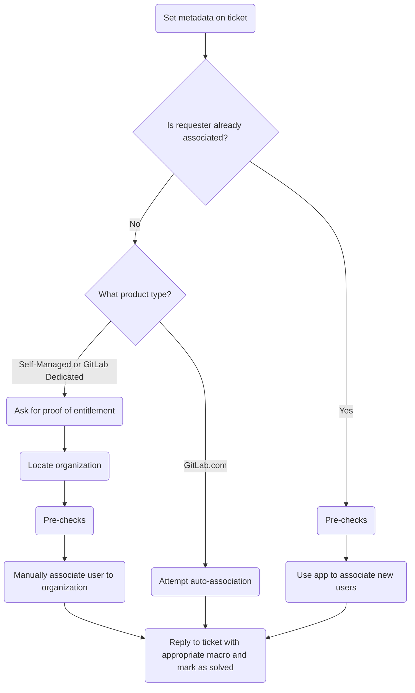

このガイドでは、GitLab で組織関連付けをどのように行うかを説明します。

{}

- デプロイタイプ: `Ad-hoc`
- **注**: このページは Zendesk Global にのみ適用されます。Zendesk US Government では組織関連付けは [Zendesk-Salesforce sync](/handbook/security/customer-support-operations/zendesk-salesforce-sync/) を介して行われるためです
- **注**: ユーザーが自分自身の関連付けを必要とし、_かつ_ 他のユーザーの関連付けも依頼することはよくあります。最初にリクエスト者に焦点を当ててください（その方が他のユーザーの追加が簡単になります）。

{}

## Understanding organization association

### What is organization association

組織関連付けとは、Zendesk ユーザーを組織に結びつけるプロセスです。

## The process for association

非常に一般化されたプロセスは次のようになります:



### Step 1: Set metadata on the ticket

進める前に、チケットのメタデータが入力され、適切に設定されていることを確認する必要があります。通常のフォーム送信でほとんどのメタデータはカバーされるため、特に注目すべきはチケットフィールド `Support Ops Problem Type`（これを `Manage my organization's contacts` に設定すべきです）です。

入力したら、チケットに更新を送信して保存されることを確認します。

これを行ったら、[Step 2](#step-2-check-if-pre-authorized) に進みます。

### Step 2: Check if pre-authorized

ユーザーがすでに組織に関連付けられている場合、組織のサポート連絡先を管理する事前承認を受けている可能性が高いです。そのため、この場合のプロセスははるかに単純です:

1. [Pre-checks](#pre-checks) を実行します
1. 組織に追加するメールのリストをカンマ区切りのリストで収集します
   - 例: `alice@example.com, bob@example.com, charlie@example.com`
1. Support Ops Super App を開きます
1. `Associate User` をクリックします
1. メールのリストを入力ボックスに入れます
1. `Associate` ボタンをクリックします
1. アプリの出力で成功を確認します
1. 変更が完了したことを顧客に返信します（チケットのステータスを `Solved` に設定することを忘れないでください）

すでに関連付けられていない場合は、[Step 3](#step-3-determine-product-type) に進みます。

### Step 3: Determine product type

ここからの手順はプロダクトタイプによって異なるため、それを知る必要があります。ユーザーがすでに必要な情報を提供している場合は、それを使って次に取るべきステップを判断します:

- プロダクトタイプが GitLab.com の場合は、[Step 4](#step-4-attempt-auto-association) に進みます
- プロダクトタイプが Self-Managed または GitLab Dedicated の場合は、[Step 5](#step-5-ask-for-entitlement-information) に進みます

提供されていない場合は、チケットに返信してユーザーにエンタイトルメントの証明を求めます。

### Step 4: Attempt auto-association

**注**: アプリが自動的に [Pre-checks](#pre-checks) を行います。

GitLab.com のサブスクリプションを購入した組織の場合、プロセスははるかに単純です:

1. Support Ops Super App を開きます
1. `Attempt Association` をクリックします
1. `Attempt auto-association` ボタンをクリックします

これにより、ユーザーを自動関連付けできるかどうかを確認するさまざまなチェックが実行されます。結果はアプリに表示されます。

関連付けられた場合は、変更が完了したことを顧客に返信します（チケットのステータスを `Solved` に設定することを忘れないでください）。

関連付けに失敗した場合は、それがアプリの問題なのか、エンタイトルメントチェックに失敗したのかを判断します:

- アプリの問題については、[Common issues and troubleshooting](#common-issues-and-troubleshooting) を参照してください。
- エンタイトルメントチェックに失敗した場合は、トップレベルの有料ネームスペースのオーナーではない旨を示すマクロで返信を送信します。

### Step 5: Ask for entitlement information

**注**: 対象のユーザーは _会社_ のメールを使用している必要があります。汎用的なもの（Gmail、Yahoo など）を使用している場合は、先に進めません。

次にエンタイトルメント情報を求める必要があります。Self-Managed および GitLab Dedicated ユーザーの場合、これはさまざまな方法で提供されます:

- リクエスト者はサブスクリプションのライセンス ID を提供できます
- リクエスト者はサブスクリプションのクラウドアクティベーションコードを提供できます
- リクエスト者はサブスクリプションの raw ライセンスファイルを提供できます
- リクエスト者はライセンス使用状況のエクスポート CSV ファイルを提供できます

何を提供してもらうかによって次のステップが決まります:

- ライセンス ID の場合は、[Step 6](#step-6-locate-the-license-from-an-id) に進みます
- クラウドアクティベーションコードの場合は、[Step 7](#step-7-locate-the-cloud-activation) に進みます
- raw ライセンスファイルの場合は、[Step 8](#step-8-locate-the-license-from-the-key) に進みます
- ライセンス使用状況のエクスポート CSV ファイルの場合は、ファイルを開いてライセンスキーの値を取得します。その後 [Step 8](#step-8-locate-the-license-from-the-key) に進みます

### Step 6: Locate the license from an ID

ID からライセンスを見つけるには:

1. Okta を介して [Customers portal admin panel](https://customers.gitlab.com/admin) にログインします
1. [Licenses ページ](https://customers.gitlab.com/admin/license)に移動します
1. URL の末尾に `/xxxx` を追加します（`xxxx` をライセンス ID に置き換えます）

開いているライセンスの URL をメモしておきます（後でノートに必要になります）。

**注**: クラウドアクティベーションがトライアルであることを示している場合（`Trial` の値が `Yes`）、それは有効なクラウドアクティベーションではありません（そしてユーザーはエンタイトルメントチェックに合格していません）。これが発生した場合は、トライアルであり有効な有料サブスクリプションではない旨をユーザーに伝えます。

このページから、`Zuora subscription name` の値を取得し、[Step 9](#step-9-locate-the-order) に進みます。

### Step 7: Locate the cloud activation

クラウドアクティベーションを見つけるには:

1. Okta を介して [Customers portal admin panel](https://customers.gitlab.com/admin) にログインします
1. URL を `https://customers.gitlab.com/admin/cloud_activation?query=XXXX` に変更します（`XXXX` をクラウドアクティベーションコードに置き換えます）
1. 見つかったクラウドアクティベーションの表示ボタン（円の中の `i` のように見えます）をクリックします

開いているクラウドアクティベーションの URL をメモしておきます（後でノートに必要になります）。

**注**: クラウドアクティベーションがトライアルであることを示している場合（`Trial` の値が `Yes`）、それは有効なクラウドアクティベーションではありません（そしてユーザーはエンタイトルメントチェックに合格していません）。これが発生した場合は、トライアルであり有効な有料サブスクリプションではない旨をユーザーに伝えます。

このページから、`Subscription name` の値を取得し、[Step 9](#step-9-locate-the-order) に進みます。

### Step 8: Locate the license from the key

キーからライセンスを見つけるには:

1. Okta を介して [Customers portal admin panel](https://customers.gitlab.com/admin) にログインします
1. [Licenses ページ](https://customers.gitlab.com/admin/license)に移動します
1. `Validate License` をクリックします
1. キーをテキストエリアに貼り付けます
1. `Validate` ボタンをクリックします

このページから、オブジェクトの `id` 属性の値をコピーし、[Step 6](#step-6-locate-the-license-from-an-id) に進みます。

### Step 9: Locate the order

（サブスクリプション名から）注文を見つけるには:

1. Okta を介して [Customers portal admin panel](https://customers.gitlab.com/admin) にログインします
1. [Orders ページ](https://customers.gitlab.com/admin/order)に移動します
1. ページ右上の `Add filter` をクリックします
1. `Subscription name` をクリックします
1. `Subscription name` ボタンの右にあるドロップダウンを `Contains` に変更します
1. （前のステップでコピーした）サブスクリプション名を入力ボックスに入れます
1. キーボードの `Enter` または `Return` を押します
1. 見つかった注文の表示ボタン（円の中の `i` のように見えます）をクリックします

開いている注文の URL をメモしておきます（後でノートに必要になります）。

このページから、`Billing account` までスクロールし、リンクをクリックして [Step 10](#step-10-get-billing-account-information) に進みます。

### Step 10: Get billing account information

開いている請求アカウントの URL をメモしておきます（後でノートに必要になります）。

以下の値をコピーします:

- `Salesforce account`
- `Sold to`

この時点で、[Step 11](#step-11-locate-the-organization) に進むために必要なすべての情報が揃っています。

### Step 11: Locate the organization

ここでは、`Salesforce account` の値を使って組織を見つける必要があります。これから組織を見つける方法は、値の文字数によって異なります:

- 15 文字の値の場合は、`sfdc_short_id:xxx`（`xxx` を値に置き換えます）で Zendesk 検索を行います
- 18 文字の値の場合は、`salesforce_id:xxx`（`xxx` を値に置き換えます）で Zendesk 検索を行います

見つけた組織の URL をメモし（後でノートに必要になります）、[Step 12](#step-12-validate-information) に進みます。

**注** 組織が見つからない場合は、[No organization found](#no-organization-found) を参照してください。

### Step 12: Validate information

ここでは、入手したすべての情報を確認して、ユーザーがエンタイトルメントチェックに合格したかどうかを判断する必要があります。確認すべき重要な点:

- ライセンス/クラウドアクティベーションはトライアル用でしたか?
  - トライアル用のライセンス/クラウドアクティベーションがトライアル用だった場合、エンタイトルメントチェックに合格していません。
- 請求アカウントの `Sold to` の値は、ユーザーがチケットを起票したときに提供したものと一致しますか?
  - 一致しない場合、エンタイトルメントチェックに合格していません。

調査結果と収集したすべての情報をまとめた内部ノートを追加します。次のようになるはずです:

<details>
<summary>ライセンスを使用する場合</summary>

```plaintext
- License: LINK_TO_LICENSE
- Order: LINK_TO_ORDER
- Billing account: LINK_TO_BILLING_ACCOUNT
- Sold-to: SOLD_TO_EMAIL
- Salesforce ID: SALESFORCE_ACCOUNT_ID
- Organization: LINK_TO_ORGANIZATION
```

</details>
<details>
<summary>クラウドアクティベーションを使用する場合</summary>

```plaintext
- Cloud activation: LINK_TO_CLOUD_ACTIVATION
- Order: LINK_TO_ORDER
- Billing account: LINK_TO_BILLING_ACCOUNT
- Sold-to: SOLD_TO_EMAIL
- Salesforce ID: SALESFORCE_ACCOUNT_ID
- Organization: LINK_TO_ORGANIZATION
```

</details>

ここからどう進むかは、ユーザーがエンタイトルメントチェックに合格したかどうかによって異なります:

- エンタイトルメントチェックに失敗した場合は、内部コメントに検証失敗の理由が含まれていることを確認し、ノートを投稿して、ユーザーにそれに応じて返信します。
- エンタイトルメントチェックに合格した場合は、内部ノートを追加して [Step 13](#step-13-manually-associate-the-user) に進みます。

### Step 13: Manually associate the user

ここまで完了したら、ユーザーを関連付ける必要があります。これを行うには:

- 組織の名前をコピーします
- Zendesk のユーザーのページに移動します
- `Organization` エリアに値を貼り付けます
- 表示された候補の中から一致する組織名をクリックします

その後、変更が完了したことを顧客に返信します（チケットのステータスを `Solved` に設定することを忘れないでください）。

## Removing associated users

関連付けられたユーザーが他の関連付けられたユーザーの削除を要求した場合、これを Zendesk で手動で行う必要があります。これを行うには:

1. 削除対象のユーザーに移動します
1. ユーザーの `Notes` 属性に以下を追加します:

   > De-associated as per LINK

   - `LINK` を作業中のチケットリンクに置き換えます
1. `Organization` の下の値をクリックします
1. ハイフン（つまり `-`）を入力します
1. 空の値（`-` のように見えます）をクリックします

その後、変更が完了したことを顧客に返信します（チケットのステータスを `Solved` に設定することを忘れないでください）。

## Pre-checks

ユーザーを組織に関連付ける前に、必ず以下を確認してください:

- ユーザーを組織に関連付けることで、組織が 30 のサポート連絡先の上限を超えないこと
- リクエストを進めるべきでないことを示す組織のノート/詳細がないこと

これらのチェックのいずれかに失敗した場合、先に進むことはできません。チェックに失敗したときの対処方法については、[Common issues and troubleshooting](#common-issues-and-troubleshooting) を参照してください。

## Common issues and troubleshooting

これは、必要に応じて項目が追加されていく生きたセクションです。

### Attempt auto-association app fails to locate organization

Attempt Association アプリが正しい Salesforce アカウントまたは組織を見つけられなかった場合は、手動で見つける必要があります。

これを行うには:

1. `GitLab Super App` に移動します
1. `User Lookup` をクリックします
1. `Search` ボタンをクリックします
1. `Group memberships` の下の出力を確認します
1. オーナーであるトップレベルの有料ネームスペースを見つけてコピーします
1. `Support Ops Super App` に移動します
1. `Namespace Lookup` をクリックします
1. ネームスペースを入力フィールドに貼り付けます
1. `Search` ボタンをクリックします
1. 出力を確認して、正しい Salesforce アカウント（`Salesforce info` の下）を見つけます
1. `salesforce_id:xxx`（`xxx` を値に置き換えます）で Zendesk 検索を行います
1. 見つかった組織を使って [ユーザーを手動で関連付けます](#step-13-manually-associate-the-user)

それらのいずれかが失敗した場合は、何が起きているかを示す内部ノートを作成し、レビューのためにチケットを Customer Support Operations, Fullstack Engineer に割り当てます。

### Association would cause organization to surpass the 30 contact limit

組織にユーザーを追加すると 30 連絡先の上限を超える場合は、問題を示す返信をユーザーに送る必要があります。確認できるよう、現在関連付けられているユーザーのリストを必ず含めてください。

問題を修正するためにどのような変更を行うべきか顧客が返信してきたら、プロセスで通常行うように進めます。

### Organization has notes or details saying not to proceed

これはケースバイケースで異なります。疑わしい場合は、何が起きているかを示す内部ノートを作成し、レビューのためにチケットを Customer Support Operations, Fullstack Engineer に割り当てます。

### No organization found

Salesforce アカウントは見つかったが組織が見つからなかった場合、GitLab が使用する同期メカニズムのいずれかに問題が発生したことを意味する可能性があります。

- Salesforce アカウントにサブスクリプションがない（またはサブスクリプションにプロダクトチャージがない）場合、Zuora<>Salesforce の同期に問題が発生した可能性が高いです。再同期を強制することで修正できる場合があります。これを行うには:
  1. Salesforce の Billing Account に移動します
  1. ページ右上（Edit と Clone ボタンの右）の下向きキャレットをクリックします
  1. Sync Data from ZBilling をクリックします
  1. 数分待ってから、Salesforce Account のサブスクリプションを再確認します
     - すべて修正されているように見える場合は、ZD<>SFDC の同期が組織を作成するまで 1 〜 2 時間待つ必要があります。待っている間に、何が起きたかについての内部ノートを追加し、自分自身に割り当て、1 〜 2 時間後にチケットを再確認します。
     - すべてが修正されていないように見える場合は、以下の `For anything else` の項目を使用します
- それ以外のすべての場合は、何が起きているかを示す内部ノートを作成し、レビューのためにチケットを Customer Support Operations, Fullstack Engineer に割り当てます
