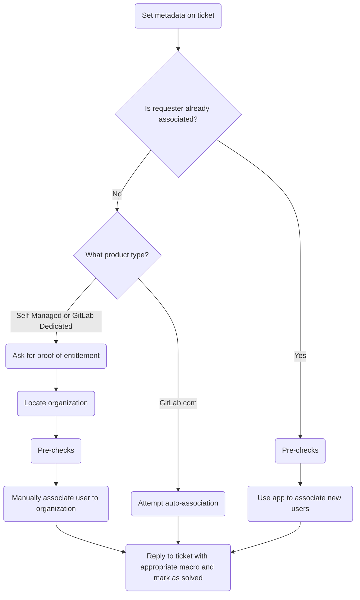

このガイドでは、GitLab における組織関連付けの実施方法について説明します。

{}

- デプロイメントタイプ: `Ad-hoc`
- **注意**: このページは Zendesk Global にのみ適用されます。Zendesk US Government では組織関連付けは [Zendesk-Salesforce sync](/handbook/security/customer-support-operations/zendesk-salesforce-sync/) 経由で行われるためです
- **注意**: ユーザーが関連付けを必要とし、_かつ_他のユーザーの関連付けも依頼することはよくあります。まず依頼者に焦点を当ててください (これにより他のユーザーの追加が簡素化されます)。

{}

## 組織関連付けを理解する

### 組織関連付けとは

組織関連付けは、Zendesk ユーザーを組織に紐づけるプロセスです。

## 関連付けのプロセス

非常に一般化されたプロセスは以下のようになります:



### Step 1: チケットにメタデータを設定する

進める前に、チケットのメタデータが設定され適切に投入されていることを確認する必要があります。通常のフォーム送信ではほとんどのメタデータがカバーされるため、特に焦点を当てるべきはチケットフィールド `Support Ops Problem Type` です (これは `Manage my organization's contacts` に設定すべきです)。

投入したら、チケットの更新を送信して保存されていることを確認します。

その後、[Step 2](#step-2-check-if-pre-authorized) に進んでください。

### Step 2: 事前認証されているか確認する {#step-2-check-if-pre-authorized}

ユーザーがすでに組織に関連付けられている場合、組織のサポート連絡先を管理する事前認証がされている可能性が高いです。そのため、このプロセスははるかにシンプルです:

1. [事前チェック](#pre-checks) を実行
1. 組織に追加するメールのリストをカンマ区切りで集める
   - 例: `alice@example.com, bob@example.com, charlie@example.com`
1. Support Ops Super App を開く
1. `Associate User` をクリック
1. 入力ボックスにメールのリストを入力
1. `Associate` ボタンをクリック
1. アプリの出力で成功を確認
1. 顧客に変更が完了したことを返信 (チケットのステータスを `Solved` に設定すること)

すでに関連付けられていない場合は、[Step 3](#step-3-determine-product-type) に進んでください。

### Step 3: 製品タイプを判別する {#step-3-determine-product-type}

ここからのステップは製品タイプによって異なるため、それを把握する必要があります。ユーザーがすでに必要な情報を提供している場合、それを使って次のステップを判断します:

- 製品タイプが GitLab.com の場合は、[Step 4](#step-4-attempt-auto-association) に進む
- 製品タイプが Self-Managed または GitLab Dedicated の場合は、[Step 5](#step-5-ask-for-entitlement-information) に進む

提供されていない場合は、エンタイトルメントの証明を求めるよう、チケットに返信してください。

### Step 4: 自動関連付けを試みる {#step-4-attempt-auto-association}

**注意**: アプリは [事前チェック](#pre-checks) を自動的に行います。

GitLab.com サブスクリプションを購入した組織については、プロセスははるかにシンプルです:

1. Support Ops Super App を開く
1. `Attempt Association` をクリック
1. `Attempt auto-association` ボタンをクリック

これにより、ユーザーが自動関連付けできるかどうかをチェックする様々な確認が行われます。結果はアプリで表示されます。

関連付けされた場合、顧客に変更が完了したことを返信してください (チケットのステータスを `Solved` に設定すること)。

関連付けに失敗した場合、アプリの問題かエンタイトルメントチェックに失敗したかを判断します:

- アプリの問題については、[よくある問題とトラブルシューティング](#common-issues-and-troubleshooting) を参照してください。
- エンタイトルメントチェックに失敗した場合は、トップレベルの有料ネームスペースのオーナーではないことを示すマクロで返信を送ってください。

### Step 5: エンタイトルメント情報を求める {#step-5-ask-for-entitlement-information}

**注意**: 対象のユーザーは_会社_メールを使用している必要があります。汎用的なもの (Gmail、Yahoo など) を使用している場合、進めることはできません。

次にエンタイトルメント情報を求める必要があります。Self-Managed と GitLab Dedicated ユーザーの場合、これは様々な方法で提供されます:

- 依頼者は自分のサブスクリプションのライセンス ID を提供できる
- 依頼者は自分のサブスクリプションのクラウドアクティベーションコードを提供できる
- 依頼者は自分のサブスクリプションの生のライセンスファイルを提供できる
- 依頼者はライセンス使用エクスポート CSV ファイルを提供できる

提供されたものによって、次のステップが決まります:

- ライセンス ID の場合は、[Step 6](#step-6-locate-the-license-from-an-id) に進む
- クラウドアクティベーションコードの場合は、[Step 7](#step-7-locate-the-cloud-activation) に進む
- 生のライセンスファイルの場合は、[Step 8](#step-8-locate-the-license-from-the-key) に進む
- ライセンス使用エクスポート CSV ファイルの場合は、ファイルを開いてライセンスキー値を取得し、[Step 8](#step-8-locate-the-license-from-the-key) に進む

### Step 6: ID からライセンスを見つける {#step-6-locate-the-license-from-an-id}

ID からライセンスを見つけるには:

1. Okta 経由で [Customers ポータル管理パネル](https://customers.gitlab.com/admin) にログイン
1. [Licenses ページ](https://customers.gitlab.com/admin/license) に移動
1. URL の最後に `/xxxx` を追加 (`xxxx` をライセンス ID に置換)

ライセンス URL をメモしておきます (後でメモのために必要になります)。

**注意**: クラウドアクティベーションがトライアルであると表示される場合 (`Trial` の値が `Yes`)、それは有効なクラウドアクティベーションではありません (そしてユーザーはエンタイトルメントチェックに合格していません)。これが発生した場合、ユーザーにトライアルであり有効な有料サブスクリプションではないことを伝えてください。

このページから、`Zuora subscription name` の値を取得し、[Step 9](#step-9-locate-the-order) に進んでください。

### Step 7: クラウドアクティベーションを見つける {#step-7-locate-the-cloud-activation}

クラウドアクティベーションを見つけるには:

1. Okta 経由で [Customers ポータル管理パネル](https://customers.gitlab.com/admin) にログイン
1. URL を `https://customers.gitlab.com/admin/cloud_activation?query=XXXX` に変更 (`XXXX` をクラウドアクティベーションコードに置換)
1. 見つかったクラウドアクティベーションの表示ボタンをクリック (円の中の `i` のように見えます)

クラウドアクティベーションの URL をメモしておきます (後でメモのために必要になります)。

**注意**: クラウドアクティベーションがトライアルであると表示される場合 (`Trial` の値が `Yes`)、それは有効なクラウドアクティベーションではありません (そしてユーザーはエンタイトルメントチェックに合格していません)。これが発生した場合、ユーザーにトライアルであり有効な有料サブスクリプションではないことを伝えてください。

このページから、`Subscription name` の値を取得し、[Step 9](#step-9-locate-the-order) に進んでください。

### Step 8: キーからライセンスを見つける {#step-8-locate-the-license-from-the-key}

キーからライセンスを見つけるには:

1. Okta 経由で [Customers ポータル管理パネル](https://customers.gitlab.com/admin) にログイン
1. [Licenses ページ](https://customers.gitlab.com/admin/license) に移動
1. `Validate License` をクリック
1. キーをテキストエリアに貼り付け
1. `Validate` ボタンをクリック

このページから、オブジェクトの `id` 属性の値をコピーして、[Step 6](#step-6-locate-the-license-from-an-id) に進んでください。

### Step 9: 注文を見つける {#step-9-locate-the-order}

(サブスクリプション名から) 注文を見つけるには:

1. Okta 経由で [Customers ポータル管理パネル](https://customers.gitlab.com/admin) にログイン
1. [Orders ページ](https://customers.gitlab.com/admin/order) に移動
1. ページの右上にある `Add filter` をクリック
1. `Subscription name` をクリック
1. `Subscription name` ボタンの右にあるドロップダウンを `Contains` に変更
1. (前のステップでコピーした) サブスクリプション名を入力ボックスに入れる
1. キーボードの `Enter` または `Return` を押す
1. 見つかった注文の表示ボタンをクリック (円の中の `i` のように見えます)

注文の URL をメモしておきます (後でメモのために必要になります)。

このページから、`Billing account` までスクロールダウンしてリンクをクリックし、[Step 10](#step-10-get-billing-account-information) に進んでください。

### Step 10: 請求アカウント情報を取得する {#step-10-get-billing-account-information}

請求アカウントの URL をメモしておきます (後でメモのために必要になります)。

以下の値をコピーします:

- `Salesforce account`
- `Sold to`

この時点で、[Step 11](#step-11-locate-the-organization) に進むのに必要なすべての情報を持っています。

### Step 11: 組織を見つける {#step-11-locate-the-organization}

ここでは、`Salesforce account` の値を使って組織を見つける必要があります。これからの検索方法は値の文字長に依存します:

- 15 文字の値の場合、Zendesk 検索 `sfdc_short_id:xxx` を行う (`xxx` を値に置換)
- 18 文字の値の場合、Zendesk 検索 `salesforce_id:xxx` を行う (`xxx` を値に置換)

見つかった組織 URL をメモして (後でメモのために必要になります)、[Step 12](#step-12-validate-information) に進んでください。

**注意** 組織が見つからない場合、[組織が見つからない](#no-organization-found) を参照してください。

### Step 12: 情報を検証する {#step-12-validate-information}

ここでは、ユーザーがエンタイトルメントチェックに合格したかどうかを判断するために、持っているすべての情報を確認する必要があります。確認すべき重要事項:

- ライセンス / クラウドアクティベーションはトライアル用だったか?
  - ライセンス / クラウドアクティベーションがトライアル用だった場合、エンタイトルメントチェックに合格していません。
- 請求アカウントの `Sold to` 値はチケット作成時にユーザーが提供したものと一致するか?
  - 一致しない場合、エンタイトルメントチェックに合格していません。

調査結果と収集したすべての情報をまとめた内部メモを追加します。以下のようになるはずです:

<details>
<summary>ライセンスを使用する場合</summary>

```plaintext
- License: LINK_TO_LICENSE
- Order: LINK_TO_ORDER
- Billing account: LINK_TO_BILLING_ACCOUNT
- Sold-to: SOLD_TO_EMAIL
- Salesforce ID: SALESFORCE_ACCOUNT_ID
- Organization: LINK_TO_ORGANIZATION
```

</details>
<details>
<summary>クラウドアクティベーションを使用する場合</summary>

```plaintext
- Cloud activation: LINK_TO_CLOUD_ACTIVATION
- Order: LINK_TO_ORDER
- Billing account: LINK_TO_BILLING_ACCOUNT
- Sold-to: SOLD_TO_EMAIL
- Salesforce ID: SALESFORCE_ACCOUNT_ID
- Organization: LINK_TO_ORGANIZATION
```

</details>

ここからどう進めるかは、ユーザーがエンタイトルメントチェックに合格したかどうかに依存します:

- エンタイトルメントチェックに失敗した場合、内部コメントに検証失敗の理由を含めて投稿し、それに応じてユーザーに返信してください。
- エンタイトルメントチェックに合格した場合、内部メモを追加して [Step 13](#step-13-manually-associate-the-user) に進みます。

### Step 13: 手動でユーザーを関連付ける {#step-13-manually-associate-the-user}

すべて完了したら、ユーザーを関連付ける必要があります。これを行うには:

- 組織名をコピー
- Zendesk のユーザーページに移動
- `Organization` エリアに値を貼り付け
- 表示される一致する組織名をクリック

その後、顧客に変更が完了したことを返信してください (チケットのステータスを `Solved` に設定すること)

## 関連付け済みユーザーの削除

関連付け済みのユーザーが他の関連付け済みのユーザーを削除するよう依頼した場合、Zendesk で手動で行う必要があります。これを行うには:

1. 削除対象のユーザーに移動
1. ユーザーの `Notes` 属性に以下を追加:

   > De-associated as per LINK

   - `LINK` を作業中のチケットリンクに置換
1. `Organization` 下の値をクリック
1. ハイフン (例: `-`) を入力
1. 空の値をクリック (`-` のように見えます)

その後、顧客に変更が完了したことを返信してください (チケットのステータスを `Solved` に設定すること)

## 事前チェック {#pre-checks}

ユーザーを組織に関連付ける前に、常に以下を確認してください:

- 組織にユーザーを関連付けても、組織が 30 サポート連絡先制限を超えないこと
- リクエストを進めてはならないことを示す組織メモ / 詳細がないこと

これらのチェックのいずれかが失敗した場合、進めることはできません。チェックが失敗した場合の対処については [よくある問題とトラブルシューティング](#common-issues-and-troubleshooting) を参照してください。

## よくある問題とトラブルシューティング {#common-issues-and-troubleshooting}

このセクションは必要に応じて項目が追加されていく生きたセクションです。

### Attempt auto-association アプリが組織を見つけられない

Attempt Association アプリが正しい Salesforce アカウントまたは組織を見つけることに失敗した場合、手動で見つける必要があります。

これを行うには:

1. `GitLab Super App` に移動
1. `User Lookup` をクリック
1. `Search` ボタンをクリック
1. `Group memberships` 下の出力を確認
1. オーナーであるトップレベルの有料ネームスペースを見つけてコピー
1. `Support Ops Super App` に移動
1. `Namespace Lookup` をクリック
1. ネームスペースを入力フィールドに貼り付け
1. `Search` ボタンをクリック
1. 出力を確認して正しい Salesforce アカウントを見つける (`Salesforce info` 下)
1. Zendesk 検索 `salesforce_id:xxx` を行う (`xxx` を値に置換)
1. 見つかった組織を使って [手動でユーザーを関連付ける](#step-13-manually-associate-the-user)

これらのいずれかが失敗した場合、何が起こっているかを示す内部メモを作成し、確認のため Customer Support Operations の Fullstack Engineer にチケットを割り当ててください。

### 関連付けにより組織が 30 連絡先制限を超える場合

組織にさらにユーザーを追加すると 30 連絡先制限を超える場合、問題を伝えるためにユーザーに返信する必要があります。確認のため、現在の関連付け済みユーザーのリストを必ず含めてください。

問題を修正するための変更内容を顧客が返信したら、通常通りプロセスを進めてください。

### 組織のメモまたは詳細に進めないよう書かれている場合

これはケースバイケースで異なります。疑わしい場合は、何が起こっているかを示す内部メモを作成し、確認のため Customer Support Operations の Fullstack Engineer にチケットを割り当ててください。

### 組織が見つからない {#no-organization-found}

Salesforce アカウントは見つかったが、組織が見つからない場合、GitLab が使用する sync メカニズムの 1 つに問題があった可能性があります。

- Salesforce アカウントにサブスクリプションがない (またはサブスクリプションに製品料金がない) 場合、Zuora<>Salesforce sync で問題が発生した可能性があります。再同期を強制することで修正できる場合があります。これを行うには:
  1. Salesforce で請求アカウントに移動
  1. ページの右上にある下キャレットをクリック (Edit と Clone ボタンの右)
  1. Sync Data from ZBilling をクリック
  1. 数分待ち、その後 Salesforce アカウントのサブスクリプションを再確認
     - すべて修正されたように見える場合、ZD<>SFDC sync が組織を作成するまで 1〜2 時間待つ必要があります。待っている間、何が起こったかについての内部メモを追加し、自分自身に割り当て、1〜2 時間後にチケットを再確認してください。
     - すべて修正されたように見えない場合、以下の `その他のすべて` の箇条書きを使用してください
- その他のすべての場合、何が起こっているかを示す内部メモを作成し、確認のため Customer Support Operations の Fullstack Engineer にチケットを割り当ててください
