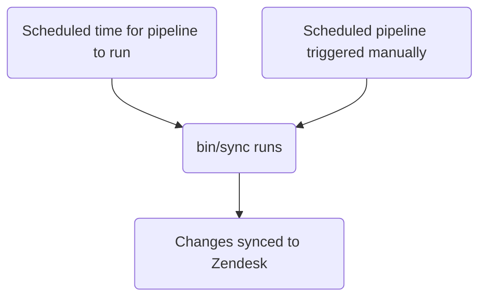

このガイドでは、GitLab における Zendesk のチケットフィールドの作成、編集、管理方法について説明します。管理者は[管理者タスク](#administrator-tasks)セクションを確認してください。

{}

- デプロイタイプ: `Standard`
- 同期リポジトリ
  - [Zendesk Global](https://gitlab.com/gitlab-support-readiness/zendesk-global/tickets/forms-and-fields)
  - [Zendesk US Government](https://gitlab.com/gitlab-support-readiness/zendesk-us-government/tickets/forms-and-fields)
- `CustSuppOps Zendesk Test Suite Generator` が有効

{}
{}

- これは [チケットフォーム](/handbook/security/customer-support-operations/zendesk/tickets/forms) と **非常に** 密接に結びついています。特に _同じ_ 同期リポジトリで動作するためです
- これは Zendesk Global の [動的コンテンツ](/handbook/security/customer-support-operations/zendesk/dynamic-content/) と **非常に** 密接に結びついています

{}

## チケットフィールドを理解する

### チケットフィールドとは

チケットフィールドは、チケットフォームを構成する個々のコンポーネントです。特定の情報を尋ねるようにカスタマイズでき、チケットのメタデータの生成に役立ちます。

[Zendesk](https://support.zendesk.com/hc/en-us/articles/4408886739098-About-ticket-fields) によると、チケットフィールドには 2 種類あります。

> - 標準チケットフィールド - エージェントがチケット内で目にする、あらかじめ定義されたフィールド。チケット共有などの追加の Zendesk Support 機能を有効化すると、追加の標準フィールドがチケットページに追加されます。一部の（すべてではない）標準フィールドは無効化および再有効化できます。
> [標準チケットフィールドの完全な一覧](https://support.zendesk.com/hc/en-us/articles/4408886739098-About-ticket-fields#topic_drw_ft1_3nb) を参照してください。
> - カスタムチケットフィールド - サポートをリクエストしている人から追加の情報を集めるために、標準チケットフィールドに加えて作成されるフィールド。たとえば、製品名やモデル番号を選択するよう促すカスタムフィールドを追加できます。
> [カスタムチケットフィールドタイプの完全な一覧](https://support.zendesk.com/hc/en-us/articles/4408838961562) を参照してください。

### チケットフィールドの管理方法

Zendesk は UI を介してチケットフィールドを管理する完全な方法を提供していますが、私たちはよりバージョン管理されたメソドロジーを採用しています。これにより、一定のレビュープロセスや、必要に応じたロールバックの実行などが可能になります。

そのため、私たちは同期リポジトリを利用しています。

### 同期リポジトリの仕組み

同期リポジトリのワークフローは次のプロセスに従います。



### チケットフィールドのタイプ

GitLab で最もよく使うタイプは次のとおりです。

| 名前 | API タイプ値 | 用途 | 使用例 |
|------|----------------|---------|------------------|
| Checkbox | `checkbox` | 単一の true/false オプション | "BPO Ticket" |
| Date | `date` | 日付の選択用 | "Due date" |
| Decimal | `decimal` | 小数を使う数値用 | "ARR associated" |
| Drop-down | `tagger` | 1 つの選択を許可するドロップダウン用 | "Product Category" |
| Multi-line | `textarea` | 複数行が必要な自由記述フィールド用 | "Troubleshooting notes" |
| Multi-select | `multiselect` | 複数の選択を許可するドロップダウン用 | "Areas impacted" |
| Numeric | `integer` | 小数を使わない数値用 | "GitLab.com user ID" |
| Regex | `regexp` | 正規表現による検証が必要なテキスト形式のフィールド用 | "Salesforce account ID" |
| Text | `text` | 自由記述フィールド用 | "GitLab issue link" |

完全な一覧については、[Zendesk のドキュメント](https://support.zendesk.com/hc/en-us/articles/4408838961562-About-custom-fields-and-custom-field-types) を参照してください

#### チケットフィールドのオプションに関する注意

`Drop-down` および `Multi-select` フィールドタイプには、フィールド上にカスタムオプションが存在します。

カスタムオプションを持つチケットフィールドでは、`::` をセパレータとして使うことで、それらをまとめて「グループ化」または「スコープ化」できます。

例として、次のオプションがあったとします。

- Red
- Blue
- Mars
- Venus

そして、似た項目（Colors と Planets）をグループ化したい場合は、次のようにします。

- `Colors::Red`
- `Colors::Blue`
- `Planets::Mars`
- `Planets::Venus`

これにより、最初は 2 つのオプション（`Colors` と `Planets`）を表示するドロップダウンになります。いずれかのオプションをクリックすると、そのグループのオプションが表示され、選択可能になります。

**グループ化前:**

- Red
- Blue
- Mars
- Venus

**グループ化後:**

- Colors ▼
  - Red
  - Blue
- Planets ▼
  - Mars
  - Venus

## 管理者以外がチケットフィールドを作成する

チケットフィールドの作成については、[Feature Request の Issue](https://gitlab.com/gitlab-com/gl-security/corp/cust-support-ops/issue-tracker/-/issues/new?description_template=Feature) を作成してください（Customer Support Operations チームによる手動での対応が必要になるためです）。

## 管理者以外がチケットフィールドを編集する

チケットフィールドの変更については、[Feature Request の Issue](https://gitlab.com/gitlab-com/gl-security/corp/cust-support-ops/issue-tracker/-/issues/new?description_template=Feature) を作成してください（Customer Support Operations チームによる手動での対応が必要になるためです）。

## 管理者以外がチケットフィールドを無効化する

チケットフィールドの無効化をリクエストするには、[Feature Request の Issue](https://gitlab.com/gitlab-com/gl-security/corp/cust-support-ops/issue-tracker/-/issues/new?description_template=Feature) を作成してください（Customer Support Operations チームによる手動での対応が必要になるためです）。

## 管理者タスク

{}

- このセクションのすべての項目には、Zendesk への `Administrator` レベルのアクセス権が必要です。

{}

### チケットフィールドの表示

Zendesk でチケットフィールドを表示するには:

1. Zendesk インスタンスの管理パネルに移動します
   - [Zendesk Global (production)](https://gitlab.zendesk.com/admin/home)
   - [Zendesk Global (sandbox)](https://gitlab1707170878.zendesk.com/admin/home)
   - [Zendesk US Government (production)](https://gitlab-federal-support.zendesk.com/admin/home)
   - [Zendesk US Government (sandbox)](https://gitlabfederalsupport1585318082.zendesk.com/admin/home)
1. `Objects and rules > Tickets > Fields` に移動します
   - [Zendesk Global](https://gitlab.zendesk.com/admin/objects-rules/tickets/ticket-fields)
   - [Zendesk Global (sandbox)](https://gitlab1707170878.zendesk.com/admin/objects-rules/tickets/ticket-fields)
   - [Zendesk US Government](https://gitlab-federal-support.zendesk.com/admin/objects-rules/tickets/ticket-fields)
   - [Zendesk US Government (sandbox)](https://gitlabfederalsupport1585318082.zendesk.com/admin/objects-rules/tickets/ticket-fields)

注: アクティブでないユーザーフィールドを表示したい場合は、`Filter` ボタンをクリックしてアクティブフィルターを変更する必要があるかもしれません

### チケットフィールドの作成

{}

- これは、対応するリクエスト Issue（Feature Request、Administrative、Bug など）がある場合にのみ行ってください。存在しない場合は、まず作成し（そして対応に着手する前に標準プロセスを通してから）行ってください。

{}

チケットフィールドの作成には、同期リポジトリで MR を作成する必要があります。具体的にどのような変更を加えるかは、リクエスト自体によって決まります。具体的な内容は、チケットフィールドのタイプによって異なる場合があります。

**注:** よく使われるフィールドタイプのテンプレートを示します。その他のタイプ（date、decimal、textarea、multiselect、regexp）については、`type` 属性をそれに応じて変更し、タイプ固有の要件については [Zendesk のフィールドドキュメント](https://support.zendesk.com/hc/en-us/articles/4408838961562-About-custom-fields-and-custom-field-types) を参照してください。

**ヒント:** 以下の各フィールドタイプをクリックすると、そのテンプレートが表示されます。

<details>
<summary>checkbox</summary>

```yaml
---
title: 'Your Title Here'
previous_title: 'Your Title Here'
title_in_portal: 'Title shown to customers'
raw_title_in_portal: 'Title shown to customers' # Dynamic content placeholder can be used here
description: 'Your description for end-users here'
raw_description: 'Your description for end-users here' # Dynamic content placeholder can be used here
agent_description: 'Your description for agents here'
active: true
type: 'checkbox'
position: 9999 # Standard position value for all custom fields
required: true # If true, agents must enter a value in the field to change the ticket status to solved
regexp_for_validation: null # Always null unless "regexp"
collapsed_for_agents: false # If true, the field is shown to agents by default. If false, the field is hidden alongside infrequently used fields. Classic interface only
visible_in_portal: true # Whether this field is visible to end users in Help Center
editable_in_portal: true # Whether this field is editable by end users in Help Center
required_in_portal: true # If true, end users must enter a value in the field to create the request
tag: 'tag_to_add_when_checked' # Added onto the user when the checkbox is checked
removable: true # Always true unless a system field
custom_field_options: null # Always null unless "dropdown" or "multiselect"
```

</details>
<details>
<summary>text</summary>

```yaml
---
title: 'Your Title Here'
previous_title: 'Your Title Here'
title_in_portal: 'Title shown to customers'
raw_title_in_portal: 'Title shown to customers' # Dynamic content placeholder can be used here
description: 'Your description for end-users here'
raw_description: 'Your description for end-users here' # Dynamic content placeholder can be used here
agent_description: 'Your description for agents here'
active: true
type: 'text'
position: 9999 # Standard position value for all custom fields
required: true # If true, agents must enter a value in the field to change the ticket status to solved
regexp_for_validation: null # Always null unless "regexp"
collapsed_for_agents: false # If true, the field is shown to agents by default. If false, the field is hidden alongside infrequently used fields. Classic interface only
visible_in_portal: true # Whether this field is visible to end users in Help Center
editable_in_portal: true # Whether this field is editable by end users in Help Center
required_in_portal: true # If true, end users must enter a value in the field to create the request
tag: null # Added onto the user when the checkbox is checked, use null when not a checkbox
removable: true # Always true unless a system field
custom_field_options: null # Always null unless "dropdown" or "multiselect"
```

</details>
<details>
<summary>integer</summary>

```yaml
---
title: 'Your Title Here'
previous_title: 'Your Title Here'
title_in_portal: 'Title shown to customers'
raw_title_in_portal: 'Title shown to customers' # Dynamic content placeholder can be used here
description: 'Your description for end-users here'
raw_description: 'Your description for end-users here' # Dynamic content placeholder can be used here
agent_description: 'Your description for agents here'
active: true
type: 'integer'
position: 9999 # Standard position value for all custom fields
required: true # If true, agents must enter a value in the field to change the ticket status to solved
regexp_for_validation: null # Always null unless "regexp"
collapsed_for_agents: false # If true, the field is shown to agents by default. If false, the field is hidden alongside infrequently used fields. Classic interface only
visible_in_portal: true # Whether this field is visible to end users in Help Center
editable_in_portal: true # Whether this field is editable by end users in Help Center
required_in_portal: true # If true, end users must enter a value in the field to create the request
tag: null # Added onto the user when the checkbox is checked, use null when not a checkbox
removable: true # Always true unless a system field
custom_field_options: null # Always null unless "dropdown" or "multiselect"
```

</details>
<details>
<summary>dropdown</summary>

```yaml
---
title: 'Your Title Here'
previous_title: 'Your Title Here'
title_in_portal: 'Title shown to customers'
raw_title_in_portal: 'Title shown to customers' # Dynamic content placeholder can be used here
description: 'Your description for end-users here'
raw_description: 'Your description for end-users here' # Dynamic content placeholder can be used here
agent_description: 'Your description for agents here'
active: true
type: 'tagger'
position: 9999 # Standard position value for all custom fields
required: true # If true, agents must enter a value in the field to change the ticket status to solved
regexp_for_validation: null # Always null unless "regexp"
collapsed_for_agents: false # If true, the field is shown to agents by default. If false, the field is hidden alongside infrequently used fields. Classic interface only
visible_in_portal: true # Whether this field is visible to end users in Help Center
editable_in_portal: true # Whether this field is editable by end users in Help Center
required_in_portal: true # If true, end users must enter a value in the field to create the request
tag: null # Added onto the user when the checkbox is checked, use null when not a checkbox
removable: true # Always true unless a system field
custom_field_options: # Always null unless "dropdown" or "multiselect"
- name: 'Name of option'
  raw_name: 'Name of option' # Dynamic content placeholder can be used here
  value: 'tag_option_uses'
  default: false # If the option should be pre-selected
- name: 'Name of option 2'
  raw_name: 'Name of option 2' # Dynamic content placeholder can be used here
  value: 'tag_option_uses_2'
  default: false # If the option should be pre-selected
```

</details>

ピアが MR をレビューして承認したら、MR をマージできます。次回のデプロイが行われると、Zendesk に同期されます。

#### チケットフォームに関する注意

{}

**鶏が先か卵が先かの問題:** チケットフォームの MR がまだ存在しないフィールドを参照している場合、検証は失敗します。この場合、以下の手順を使ってまず Zendesk でフィールドを手動作成し、その後でフォームの MR を進めてください。

{}

1. Zendesk インスタンスの管理パネルに移動します
   - [Zendesk Global (production)](https://gitlab.zendesk.com/admin/home)
   - [Zendesk Global (sandbox)](https://gitlab1707170878.zendesk.com/admin/home)
   - [Zendesk US Government (production)](https://gitlab-federal-support.zendesk.com/admin/home)
   - [Zendesk US Government (sandbox)](https://gitlabfederalsupport1585318082.zendesk.com/admin/home)
1. `Objects and rules > Tickets > Fields` に移動します
   - [Zendesk Global](https://gitlab.zendesk.com/admin/objects-rules/tickets/ticket-fields)
   - [Zendesk Global (sandbox)](https://gitlab1707170878.zendesk.com/admin/objects-rules/tickets/ticket-fields)
   - [Zendesk US Government](https://gitlab-federal-support.zendesk.com/admin/objects-rules/tickets/ticket-fields)
   - [Zendesk US Government (sandbox)](https://gitlabfederalsupport1585318082.zendesk.com/admin/objects-rules/tickets/ticket-fields)
1. `Add field` ボタン（右上）をクリックします
1. 作成するフィールドタイプを選択します
1. フィールド情報を入力します（タイプによって異なります）
1. `Save` ボタン（右下）をクリックします

### チケットフィールドの編集

{}

- これは、対応するリクエスト Issue（Feature Request、Administrative、Bug など）がある場合にのみ行ってください。存在しない場合は、まず作成し（そして対応に着手する前に標準プロセスを通してから）行ってください。

{}

チケットフィールドを編集するには、同期リポジトリで MR を作成する必要があります。具体的にどのような変更を加えるかは、リクエスト自体によって決まります。

ピアが MR をレビューして承認したら、MR をマージできます。次回のデプロイが行われると、Zendesk に同期されます。

#### チケットフィールドのタイトルの変更

チケットフィールドのタイトルを変更する必要がある場合は、現在の値を `previous_title` 属性にコピーしてから、`title` 属性を変更します。これにより、同期処理が更新対象のチケットフィールドを引き続き特定できるようになります。

### チケットフィールドの無効化

{}

- これは、対応するリクエスト Issue（Feature Request、Administrative、Bug など）がある場合にのみ行ってください。存在しない場合は、まず作成し（そして対応に着手する前に標準プロセスを通してから）行ってください。

{}

チケットフィールドを無効化するには、同期リポジトリで MR を作成する必要があります。この MR では、対応するアクションに対して次のことを行う必要があります。

1. ファイルを `active` フォルダから `inactive` フォルダへ移動します
1. `active` 属性の値を `false` に変更します

ピアが MR をレビューして承認したら、MR をマージできます。次回のデプロイが行われると、Zendesk に同期されます。

### チケットフィールドの削除

{}

- これは、対応するリクエスト Issue（Feature Request、Administrative、Bug など）がある場合にのみ行ってください。存在しない場合は、まず作成し（そして対応に着手する前に標準プロセスを通してから）行ってください。
- フォーム、トリガー、自動化などで使用されていないフィールドのみを削除できます。

{}

同期リポジトリは削除を実行しないため、これは Zendesk 自体で行う必要があります。

チケットフィールドを削除するには:

1. Zendesk インスタンスの管理ダッシュボードに移動します
   - [Zendesk Global (production)](https://gitlab.zendesk.com/admin/home)
   - [Zendesk Global (sandbox)](https://gitlab1707170878.zendesk.com/admin/home)
   - [Zendesk US Government (production)](https://gitlab-federal-support.zendesk.com/admin/home)
   - [Zendesk US Government (sandbox)](https://gitlabfederalsupport1585318082.zendesk.com/admin/home)
1. `Objects and rules > Tickets > Fields` に移動します
   - [Zendesk Global](https://gitlab.zendesk.com/admin/objects-rules/tickets/ticket-fields)
   - [Zendesk Global (sandbox)](https://gitlab1707170878.zendesk.com/admin/objects-rules/tickets/ticket-fields)
   - [Zendesk US Government](https://gitlab-federal-support.zendesk.com/admin/objects-rules/tickets/ticket-fields)
   - [Zendesk US Government (sandbox)](https://gitlabfederalsupport1585318082.zendesk.com/admin/objects-rules/tickets/ticket-fields)
1. 削除したいチケットフィールドを見つけ、その名前をクリックします
   - `Filter` ボタンをクリックしてアクティブフィルターを変更する必要があるかもしれません
1. ページ右上の `Actions` をクリックします
1. `Delete` をクリックします
1. ポップアップで `Delete` をクリックして変更を送信します

### 例外デプロイの実行

{}

- これはチケットフォームとチケットフィールドの両方に適用されます

{}

チケットフィールドの例外デプロイを実行するには、該当するチケットフィールド同期プロジェクトに移動し、スケジュール済みパイプラインのページに行き、その同期項目の再生ボタンをクリックします。これにより、チケットフィールドの同期ジョブがトリガーされます。

## よくある問題とトラブルシューティング

### マージ後にチケットフィールドの変更が反映されない

チケットフィールドは `Standard` デプロイタイプに従うため、通常のデプロイサイクル中（または例外デプロイが行われたとき）にのみデプロイされます
