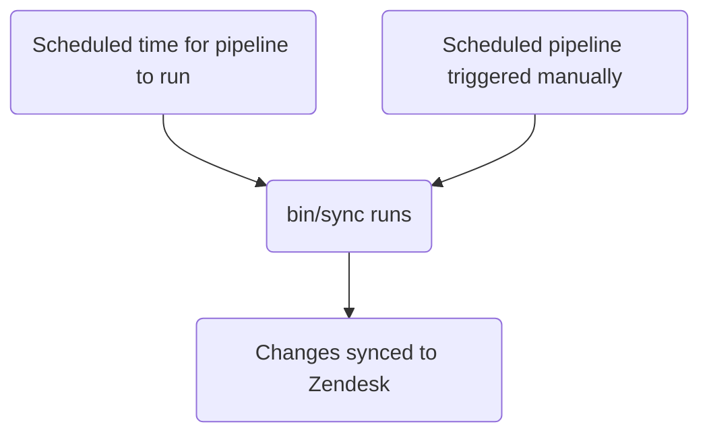

このガイドでは、GitLab における Zendesk のチケットフィールドの作成、編集、管理方法について説明します。管理者は[管理者タスク](#administrator-tasks)セクションを確認してください。

{}

- デプロイタイプ: `Standard`
- 同期リポジトリ
  - [Zendesk Global](https://gitlab.com/gitlab-support-readiness/zendesk-global/tickets/forms-and-fields)
  - [Zendesk US Government](https://gitlab.com/gitlab-support-readiness/zendesk-us-government/tickets/forms-and-fields)
- `CustSuppOps Zendesk Test Suite Generator` 有効

{}
{}

- これは [チケットフォーム](/handbook/security/customer-support-operations/zendesk/tickets/forms) と **非常に** 密接に結びついています。特に _同じ_ 同期リポジトリで動作するためです
- これは Zendesk Global の [動的コンテンツ](/handbook/security/customer-support-operations/zendesk/dynamic-content/) と **非常に** 密接に結びついています

{}

## チケットフィールドを理解する

### チケットフィールドとは

チケットフィールドは、チケットフォームを構成する個別のコンポーネントです。特定の情報を求めたり、チケットメタデータの生成を支援したりするためにカスタマイズできます。

[Zendesk](https://support.zendesk.com/hc/en-us/articles/4408886739098-About-ticket-fields) によると、チケットフィールドには 2 種類あります。

> - 標準チケットフィールド - エージェントがチケットで見る事前定義されたフィールド。チケット共有など追加の Zendesk Support 機能を有効にすると、追加の標準フィールドがチケットページに追加されます。一部の標準フィールドは非アクティブ化および再アクティブ化できます（すべてではない）。
[標準チケットフィールドの完全なリスト](https://support.zendesk.com/hc/en-us/articles/4408886739098-About-ticket-fields#topic_drw_ft1_3nb)を参照してください。
> - カスタムチケットフィールド - サポートを依頼している人から追加情報を集めるために、標準チケットフィールドに加えて作成されます。例えば、製品名やモデル番号を選択するように求めるカスタムフィールドを追加できます。
[カスタムチケットフィールドタイプの完全なリスト](https://support.zendesk.com/hc/en-us/articles/4408838961562)を参照してください。

### チケットフィールドの管理方法

Zendesk は UI を通じてチケットフィールドを完全に管理する方法を提供していますが、私たちはよりバージョン管理されたメソドロジーを採用しています。これにより、定められたレビュープロセスや、必要に応じてロールバックを行う能力などが得られます。

そのため、同期リポジトリを利用しています。

### 同期リポジトリの仕組み

同期リポジトリのワークフローは以下のプロセスに従います。



### チケットフィールドのタイプ

GitLab で最もよく使うタイプは以下のとおりです。

| 名前 | API type 値 | 用途 | 使用例 |
|------|----------------|---------|------------------|
| Checkbox | `checkbox` | 単一の true/false オプション | "BPO Ticket" |
| Date | `date` | 日付選択用 | "Due date" |
| Decimal | `decimal` | 小数を含む数値用 | "ARR associated" |
| Drop-down | `tagger` | 1 つの選択を許可するドロップダウン用 | "Product Category" |
| Multi-line | `textarea` | 複数行が必要なフリースタイルフィールド用 | "Troubleshooting notes" |
| Multi-select | `multiselect` | 複数の選択を許可するドロップダウン用 | "Areas impacted" |
| Numeric | `integer` | 小数を含まない数値用 | "GitLab.com user ID" |
| Regex | `regexp` | 正規表現の検証が必要なテキストスタイルフィールド用 | "Salesforce account ID" |
| Text | `text` | フリースタイルフィールド用 | "GitLab issue link" |

完全なリストについては、[Zendesk のドキュメント](https://support.zendesk.com/hc/en-us/articles/4408838961562-About-custom-fields-and-custom-field-types)を参照してください。

#### チケットフィールドオプションに関する注意

`Drop-down` および `Multi-select` フィールドタイプには、フィールド上にカスタムオプションが存在します。

カスタムオプションのあるチケットフィールドでは、`::` を区切り文字として使用することで「グループ化」または「スコープ化」できます。

例えば、以下のオプションがあるとします。

- Red
- Blue
- Mars
- Venus

そして同類のアイテム（Colors と Planets）をグループ化したい場合、以下のようにします。

- `Colors::Red`
- `Colors::Blue`
- `Planets::Mars`
- `Planets::Venus`

その結果、ドロップダウンには最初に 2 つのオプション（`Colors` と `Planets`）が表示されます。いずれかのオプションがクリックされると、そのグループのオプションが表示され、選択可能になります。

**グループ化前:**

- Red
- Blue
- Mars
- Venus

**グループ化後:**

- Colors ▼
  - Red
  - Blue
- Planets ▼
  - Mars
  - Venus

## 管理者ではない者がチケットフィールドを作成する

チケットフィールドの作成については、[Feature Request の Issue](https://gitlab.com/gitlab-com/gl-security/corp/cust-support-ops/issue-tracker/-/issues/new?description_template=Feature) を作成してください（カスタマーサポートオペレーションチームによる手動対応が必要となるため）。

## 管理者ではない者がチケットフィールドを編集する

チケットフィールドの変更については、[Feature Request の Issue](https://gitlab.com/gitlab-com/gl-security/corp/cust-support-ops/issue-tracker/-/issues/new?description_template=Feature) を作成してください（カスタマーサポートオペレーションチームによる手動対応が必要となるため）。

## 管理者ではない者がチケットフィールドを非アクティブ化する

チケットフィールドの非アクティブ化を依頼するには、[Feature Request の Issue](https://gitlab.com/gitlab-com/gl-security/corp/cust-support-ops/issue-tracker/-/issues/new?description_template=Feature) を作成してください（カスタマーサポートオペレーションチームによる手動対応が必要となるため）。

## 管理者タスク {#administrator-tasks}

{}

- このセクションのすべての項目は、Zendesk への `Administrator` レベルのアクセスが必要です。

{}

### チケットフィールドを表示する

Zendesk でチケットフィールドを表示するには:

1. Zendesk インスタンスの管理パネルに移動
   - [Zendesk Global (production)](https://gitlab.zendesk.com/admin/home)
   - [Zendesk Global (sandbox)](https://gitlab1707170878.zendesk.com/admin/home)
   - [Zendesk US Government (production)](https://gitlab-federal-support.zendesk.com/admin/home)
   - [Zendesk US Government (sandbox)](https://gitlabfederalsupport1585318082.zendesk.com/admin/home)
1. `Objects and rules > Tickets > Fields` に移動
   - [Zendesk Global](https://gitlab.zendesk.com/admin/objects-rules/tickets/ticket-fields)
   - [Zendesk Global (sandbox)](https://gitlab1707170878.zendesk.com/admin/objects-rules/tickets/ticket-fields)
   - [Zendesk US Government](https://gitlab-federal-support.zendesk.com/admin/objects-rules/tickets/ticket-fields)
   - [Zendesk US Government (sandbox)](https://gitlabfederalsupport1585318082.zendesk.com/admin/objects-rules/tickets/ticket-fields)

注意: 非アクティブのユーザーフィールドを表示したい場合は、`Filter` ボタンをクリックしてアクティブフィルターを変更する必要がある場合があります。

### チケットフィールドを作成する

{}

- これは対応する依頼 Issue（Feature Request、Administrative、Bug など）が存在する場合にのみ実行してください。存在しない場合は、まず作成して標準プロセスを通してから対応してください。

{}

チケットフィールドを作成するには、同期リポジトリで MR を作成する必要があります。具体的な変更内容は依頼自体によって異なります。具体的な内容はチケットフィールドのタイプによって異なる場合があります。

**注意:** 一般的なフィールドタイプ向けのテンプレートを示します。その他のタイプ（date、decimal、textarea、multiselect、regexp）については、`type` 属性をそれに応じて変更し、タイプ固有の要件については [Zendesk フィールドのドキュメント](https://support.zendesk.com/hc/en-us/articles/4408838961562-About-custom-fields-and-custom-field-types)を参照してください。

**ヒント:** 以下の各フィールドタイプをクリックすると、そのテンプレートが表示されます。

<details>
<summary>checkbox</summary>

```yaml
---
title: 'Your Title Here'
previous_title: 'Your Title Here'
title_in_portal: 'Title shown to customers'
raw_title_in_portal: 'Title shown to customers' # Dynamic content placeholder can be used here
description: 'Your description for end-users here'
raw_description: 'Your description for end-users here' # Dynamic content placeholder can be used here
agent_description: 'Your description for agents here'
active: true
type: 'checkbox'
position: 9999 # Standard position value for all custom fields
required: true # If true, agents must enter a value in the field to change the ticket status to solved
regexp_for_validation: null # Always null unless "regexp"
collapsed_for_agents: false # If true, the field is shown to agents by default. If false, the field is hidden alongside infrequently used fields. Classic interface only
visible_in_portal: true # Whether this field is visible to end users in Help Center
editable_in_portal: true # Whether this field is editable by end users in Help Center
required_in_portal: true # If true, end users must enter a value in the field to create the request
tag: 'tag_to_add_when_checked' # Added onto the user when the checkbox is checked
removable: true # Always true unless a system field
custom_field_options: null # Always null unless "dropdown" or "multiselect"
```

</details>
<details>
<summary>text</summary>

```yaml
---
title: 'Your Title Here'
previous_title: 'Your Title Here'
title_in_portal: 'Title shown to customers'
raw_title_in_portal: 'Title shown to customers' # Dynamic content placeholder can be used here
description: 'Your description for end-users here'
raw_description: 'Your description for end-users here' # Dynamic content placeholder can be used here
agent_description: 'Your description for agents here'
active: true
type: 'text'
position: 9999 # Standard position value for all custom fields
required: true # If true, agents must enter a value in the field to change the ticket status to solved
regexp_for_validation: null # Always null unless "regexp"
collapsed_for_agents: false # If true, the field is shown to agents by default. If false, the field is hidden alongside infrequently used fields. Classic interface only
visible_in_portal: true # Whether this field is visible to end users in Help Center
editable_in_portal: true # Whether this field is editable by end users in Help Center
required_in_portal: true # If true, end users must enter a value in the field to create the request
tag: null # Added onto the user when the checkbox is checked, use null when not a checkbox
removable: true # Always true unless a system field
custom_field_options: null # Always null unless "dropdown" or "multiselect"
```

</details>
<details>
<summary>integer</summary>

```yaml
---
title: 'Your Title Here'
previous_title: 'Your Title Here'
title_in_portal: 'Title shown to customers'
raw_title_in_portal: 'Title shown to customers' # Dynamic content placeholder can be used here
description: 'Your description for end-users here'
raw_description: 'Your description for end-users here' # Dynamic content placeholder can be used here
agent_description: 'Your description for agents here'
active: true
type: 'integer'
position: 9999 # Standard position value for all custom fields
required: true # If true, agents must enter a value in the field to change the ticket status to solved
regexp_for_validation: null # Always null unless "regexp"
collapsed_for_agents: false # If true, the field is shown to agents by default. If false, the field is hidden alongside infrequently used fields. Classic interface only
visible_in_portal: true # Whether this field is visible to end users in Help Center
editable_in_portal: true # Whether this field is editable by end users in Help Center
required_in_portal: true # If true, end users must enter a value in the field to create the request
tag: null # Added onto the user when the checkbox is checked, use null when not a checkbox
removable: true # Always true unless a system field
custom_field_options: null # Always null unless "dropdown" or "multiselect"
```

</details>
<details>
<summary>dropdown</summary>

```yaml
---
title: 'Your Title Here'
previous_title: 'Your Title Here'
title_in_portal: 'Title shown to customers'
raw_title_in_portal: 'Title shown to customers' # Dynamic content placeholder can be used here
description: 'Your description for end-users here'
raw_description: 'Your description for end-users here' # Dynamic content placeholder can be used here
agent_description: 'Your description for agents here'
active: true
type: 'tagger'
position: 9999 # Standard position value for all custom fields
required: true # If true, agents must enter a value in the field to change the ticket status to solved
regexp_for_validation: null # Always null unless "regexp"
collapsed_for_agents: false # If true, the field is shown to agents by default. If false, the field is hidden alongside infrequently used fields. Classic interface only
visible_in_portal: true # Whether this field is visible to end users in Help Center
editable_in_portal: true # Whether this field is editable by end users in Help Center
required_in_portal: true # If true, end users must enter a value in the field to create the request
tag: null # Added onto the user when the checkbox is checked, use null when not a checkbox
removable: true # Always true unless a system field
custom_field_options: # Always null unless "dropdown" or "multiselect"
- name: 'Name of option'
  raw_name: 'Name of option' # Dynamic content placeholder can be used here
  value: 'tag_option_uses'
  default: false # If the option should be pre-selected
- name: 'Name of option 2'
  raw_name: 'Name of option 2' # Dynamic content placeholder can be used here
  value: 'tag_option_uses_2'
  default: false # If the option should be pre-selected
```

</details>

ピアによるレビューと承認後、MR をマージできます。次のデプロイ時に、Zendesk に同期されます。

#### チケットフォームに関する注意

{}

**鶏と卵の問題:** チケットフォームの MR が、まだ存在しないフィールドを参照している場合、検証は失敗します。この場合、以下の手順を使用して、まず Zendesk でフィールドを手動作成してから、フォーム MR を進めてください。

{}

1. Zendesk インスタンスの管理パネルに移動
   - [Zendesk Global (production)](https://gitlab.zendesk.com/admin/home)
   - [Zendesk Global (sandbox)](https://gitlab1707170878.zendesk.com/admin/home)
   - [Zendesk US Government (production)](https://gitlab-federal-support.zendesk.com/admin/home)
   - [Zendesk US Government (sandbox)](https://gitlabfederalsupport1585318082.zendesk.com/admin/home)
1. `Objects and rules > Tickets > Fields` に移動
   - [Zendesk Global](https://gitlab.zendesk.com/admin/objects-rules/tickets/ticket-fields)
   - [Zendesk Global (sandbox)](https://gitlab1707170878.zendesk.com/admin/objects-rules/tickets/ticket-fields)
   - [Zendesk US Government](https://gitlab-federal-support.zendesk.com/admin/objects-rules/tickets/ticket-fields)
   - [Zendesk US Government (sandbox)](https://gitlabfederalsupport1585318082.zendesk.com/admin/objects-rules/tickets/ticket-fields)
1. `Add field` ボタン（右上）をクリック
1. 作成するフィールドタイプを選択
1. フィールド情報を記入（タイプによって異なる）
1. `Save` ボタン（右下）をクリック

### チケットフィールドを編集する

{}

- これは対応する依頼 Issue（Feature Request、Administrative、Bug など）が存在する場合にのみ実行してください。存在しない場合は、まず作成して標準プロセスを通してから対応してください。

{}

チケットフィールドを編集するには、同期リポジトリで MR を作成する必要があります。具体的な変更内容は依頼自体によって異なります。

ピアによるレビューと承認後、MR をマージできます。次のデプロイ時に、Zendesk に同期されます。

#### チケットフィールドのタイトルを変更する

チケットフィールドのタイトルを変更する必要がある場合、現在の値を `previous_title` 属性にコピーしてから `title` 属性を変更します。これにより、同期は更新対象のチケットフィールドを引き続き特定できます。

### チケットフィールドを非アクティブ化する

{}

- これは対応する依頼 Issue（Feature Request、Administrative、Bug など）が存在する場合にのみ実行してください。存在しない場合は、まず作成して標準プロセスを通してから対応してください。

{}

チケットフィールドを非アクティブ化するには、同期リポジトリで MR を作成する必要があります。この MR では、対応するアクションに対して以下を行います。

1. ファイルを `active` フォルダから `inactive` フォルダに移動
1. `active` 属性の値を `false` に変更

ピアによるレビューと承認後、MR をマージできます。次のデプロイ時に、Zendesk に同期されます。

### チケットフィールドを削除する

{}

- これは対応する依頼 Issue（Feature Request、Administrative、Bug など）が存在する場合にのみ実行してください。存在しない場合は、まず作成して標準プロセスを通してから対応してください。
- フォーム、トリガー、オートメーションなどで使用されていないフィールドのみ削除できます。

{}

同期リポジトリは削除を実行しないため、これは Zendesk 自体経由で行う必要があります。

チケットフィールドを削除するには:

1. Zendesk インスタンスの管理ダッシュボードに移動
   - [Zendesk Global (production)](https://gitlab.zendesk.com/admin/home)
   - [Zendesk Global (sandbox)](https://gitlab1707170878.zendesk.com/admin/home)
   - [Zendesk US Government (production)](https://gitlab-federal-support.zendesk.com/admin/home)
   - [Zendesk US Government (sandbox)](https://gitlabfederalsupport1585318082.zendesk.com/admin/home)
1. `Objects and rules > Tickets > Fields` に移動
   - [Zendesk Global](https://gitlab.zendesk.com/admin/objects-rules/tickets/ticket-fields)
   - [Zendesk Global (sandbox)](https://gitlab1707170878.zendesk.com/admin/objects-rules/tickets/ticket-fields)
   - [Zendesk US Government](https://gitlab-federal-support.zendesk.com/admin/objects-rules/tickets/ticket-fields)
   - [Zendesk US Government (sandbox)](https://gitlabfederalsupport1585318082.zendesk.com/admin/objects-rules/tickets/ticket-fields)
1. 削除するチケットフィールドを見つけて名前をクリック
   - `Filter` ボタンをクリックしてアクティブフィルターを変更する必要がある場合があります
1. ページ右上の `Actions` をクリック
1. `Delete` をクリック
1. ポップアップの `Delete` をクリックして変更を送信

### 例外デプロイを実施する

{}

- これはチケットフォームとチケットフィールドの両方に適用されます

{}

チケットフィールドの例外デプロイを実施するには、対象のチケットフィールド同期プロジェクトに移動し、スケジュールパイプラインのページに移動して、同期項目の再生ボタンをクリックします。これによりチケットフィールドの同期ジョブがトリガーされます。

## よくある問題とトラブルシューティング

### マージ後にチケットフィールドの変更が見えない

チケットフィールドは `Standard` デプロイタイプに従うため、通常のデプロイサイクル中（または例外デプロイが実施された場合）にのみデプロイされます。
