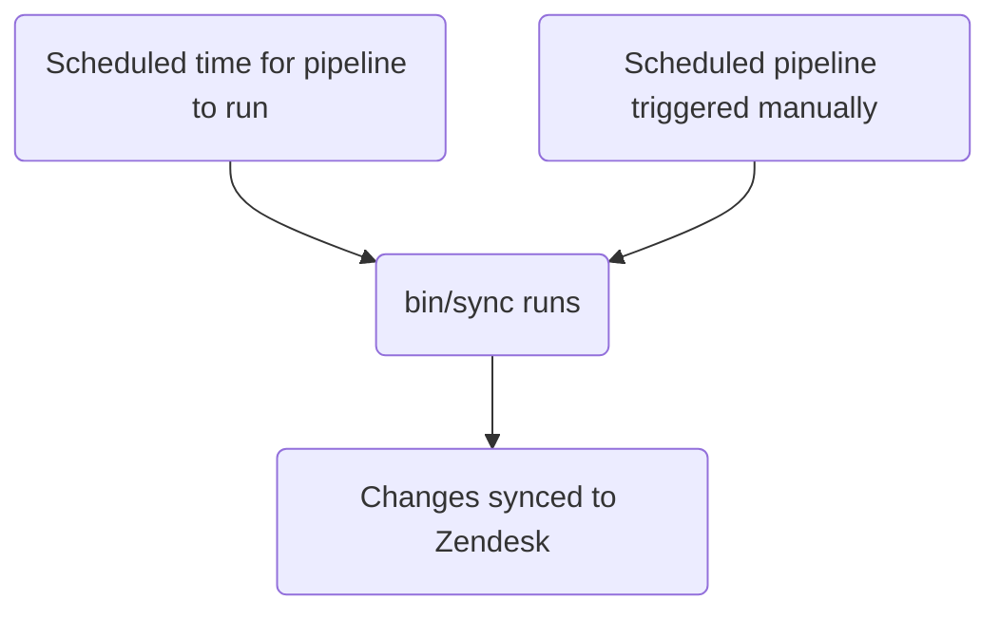

このガイドでは、GitLab における Zendesk チケットフォームの作成、編集、管理の方法を説明します。管理者の方は、[管理者向けタスク](#administrator-tasks)のセクションを確認してください。

{}

- デプロイタイプ: `Standard`
- 同期リポジトリ
  - [Zendesk Global](https://gitlab.com/gitlab-support-readiness/zendesk-global/tickets/forms-and-fields)
  - [Zendesk US Government](https://gitlab.com/gitlab-support-readiness/zendesk-us-government/tickets/forms-and-fields)
- `CustSuppOps Zendesk Test Suite Generator` 有効

{}
{}

- これは[チケットフィールド](/handbook/security/customer-support-operations/zendesk/tickets/fields)と **非常に** 密接に結びついています。特に _同じ_ 同期リポジトリで動作するためです
- これは Zendesk Global の[ダイナミックコンテンツ](/handbook/security/customer-support-operations/zendesk/dynamic-content/)と **非常に** 密接に結びついています

{}

## チケットフォームを理解する

### チケットフォームとは何か

チケットフォームとは、ユーザーがチケットを作成する際に（Web UI を使用する場合に）利用するフォームです。フォーム上の回答は、その後チケットのメタデータに変換されます。

これらは次の 2 種類のいずれかに分類されます:

- Public - エージェントとエンドユーザーの両方が閲覧できる
- Internal - エージェントのみが閲覧できる

### チケットフォームの管理方法

Zendesk は UI 経由でチケットフォームを管理する完全な方法を提供していますが、私たちはよりバージョン管理されたメソドロジーを採用しています。これにより、定められたレビュープロセス、必要に応じたロールバックの実行などが可能になります。

そのため、私たちは同期リポジトリを利用しています。

### 同期リポジトリの仕組み

同期リポジトリのワークフローは次のプロセスに従います:



### チケットフォームは条件ロジックを使用する

チケットフォームは条件を使用してフィールドを動的に表示・非表示にできます:

- `end_user_conditions`: エンドユーザーが自身の選択に基づいて表示するフィールドを制御します
- `agent_conditions`: エージェントが表示するフィールドと、それらが必須となるタイミングを制御します

親フィールドが特定の値を持つ場合、子フィールドが表示されます（そして任意で必須化されます）。例: 「Product Category が 'GitLab.com' の場合、'GitLab.com User ID' フィールドを表示する」

チケットフォームは条件を使用しなくても _構いません_。条件がない場合、フォームデータに記載されたすべてのフィールドが表示されます。

これは、チケットフォームに _条件付き必須化_ を設定する方法でもあります。

UI では、エンドユーザー条件の形式は次のとおりです:

> TICKET_FIELD の値が VALUE の場合、LIST_OF_TICKET_FIELDS を表示する

`LIST_OF_TICKET_FIELDS` 内の各項目には、何らかの形でそのチケットフィールド項目を必須化するオプションがあります。

この 2 種類のバックエンドは類似していますが、必須化の定義に主要な違いがあります。

#### エンドユーザー条件

エンドユーザー条件のバックエンド値の形式は次のとおりです:

```yaml
- parent_field_id: 'Field title'
  value: 'tag_or_value_used_by_field'
  child_fields:
  - id: 'Field title 2'
    is_required: true
```

これを分解すると:

- `parent_field_id` は、値をチェックする対象の `field` です
- `value` は、チェックする `field` の値です
- `child_fields` は表示するフィールドのリストで、各項目には次のものがあります:
  - `id` は表示するフィールドです
  - `is_required` は、新たに表示されるフィールドが送信時に必須かどうかを示します

#### エージェント条件

エージェント条件のバックエンド値の形式は、次の 2 つの形式のいずれかです:

```yaml
- parent_field_id: 'Field title'
  value: 'tag_or_value_used_by_field'
  child_fields:
  - id: 'Field title 2'
    is_required: true
    required_on_statuses:
      type: 'ALL_STATUSES'
```

```yaml
- parent_field_id: 'Field title'
  value: 'tag_or_value_used_by_field'
  child_fields:
  - id: 'Field title 2'
    is_required: true
    required_on_statuses:
      type: 'SOME_STATUSES'
      statuses:
      - 'pending'
      - 'hold'
      - 'solved'
```

これを分解すると:

- `parent_field_id` は、値をチェックする対象の `field` です
- `value` は、チェックする `field` の値です
- `child_fields` は表示するフィールドのリストで、各項目には次のものがあります:
  - `id` は表示するフィールドです
  - `is_required` は、新たに表示されるフィールドが何らかの形で必須かどうかを示します

違いを決定するのは、新しいフィールドが _必須_ かどうかと、どのような形で必須となるかです:

- すべてのステータスで必須化する場合:

  ```yaml
  - id: 'Field title 2'
    is_required: true
    required_on_statuses:
      type: 'ALL_STATUSES'
  ```

- どのステータスでも必須化しない場合（すなわち必須化しない）:

  ```yaml
  - id: 'Field title 2'
    is_required: true
    required_on_statuses:
      type: 'NO_STATUSES'
  ```

- 特定のステータスでのみ必須化する場合:

  ```yaml
  - id: 'Field title 2'
    is_required: true
    required_on_statuses:
      type: 'SOME_STATUSES'
      statuses:
      - 'list'
      - 'of'
      - 'statuses'
  ```

## 非管理者がチケットフォームを作成する

チケットフォームの作成については、[機能リクエスト Issue](https://gitlab.com/gitlab-com/gl-security/corp/cust-support-ops/issue-tracker/-/issues/new?description_template=Feature) を作成してください（Customer Support Operations チームによる手動の対応が必要なため）。

## 非管理者がチケットフォームを編集する

チケットフォームの変更については、[機能リクエスト Issue](https://gitlab.com/gitlab-com/gl-security/corp/cust-support-ops/issue-tracker/-/issues/new?description_template=Feature) を作成してください（Customer Support Operations チームによる手動の対応が必要なため）。

## 非管理者がチケットフォームを無効化する

チケットフォームの無効化をリクエストするには、[機能リクエスト Issue](https://gitlab.com/gitlab-com/gl-security/corp/cust-support-ops/issue-tracker/-/issues/new?description_template=Feature) を作成してください（Customer Support Operations チームによる手動の対応が必要なため）。

## 人間が読める形式の置換

{}

- `administrators` が YAML ファイル経由でチケットフォームを作成・編集する場合にのみ適用されます

{}

現在、同期リポジトリは、チケットフィールドとブランドについて、人間が読める形式（すなわちチケットフィールドの `title` 属性）からの置換を実行できます。

つまり、`Preferred Region for Support` という値を見つけた場合、そのタイトルを持つチケットフィールドを見つけ出し、それが含まれていたチケットフォーム属性に必要なテキストへと変換することがわかります。ブランドについても同様です（ただし `name` 属性を使用します）。

## 現在のフォーム

### Zendesk Global の現在のフォーム

| 内部名 | 公開名 | 表示範囲 | エンタイトルメント必須？ | 直接リンク |
|---------------|-------------|------------|:---------------------:|-------------|
| SaaS | Support for GitLab.com | Public | Y | [リンク](https://support.gitlab.com/hc/en-us/requests/new?ticket_form_id=334447) |
| 2FA Removal | 2FA Reset | Public | Y | [リンク](https://support.gitlab.com/hc/en-us/requests/new?ticket_form_id=18469327708956) |
| SaaS Account | GitLab.com user accounts and login issues | Public | N | [リンク](https://support.gitlab.com/hc/en-us/requests/new?ticket_form_id=360000803379) |
| Self-Managed | Support for a self-managed GitLab instance | Public | Y | [リンク](https://support.gitlab.com/hc/en-us/requests/new?ticket_form_id=426148) |
| GitLab Dedicated | Support for GitLab Dedicated instances | Public | Y | [リンク](https://support.gitlab.com/hc/en-us/requests/new?ticket_form_id=4414917877650) |
| L&R | Subscription, License or Customers Portal Problems | Public | N | [リンク](https://support.gitlab.com/hc/en-us/requests/new?ticket_form_id=360000071293) |
| Billing | Billing inquiries/refunds | Public | N | [リンク](https://support.gitlab.com/hc/en-us/requests/new?ticket_form_id=360000258393) |
| Alliance Partners | Support for alliance partners | Public | Y | [リンク](https://support.gitlab.com/hc/en-us/requests/new?ticket_form_id=360001172559) |
| Support Ops | Support portal related matters | Public | N | [リンク](https://support.gitlab.com/hc/en-us/requests/new?ticket_form_id=360001801419) |
| Emergencies | File an emergency request | Public | N | [リンク](https://support.gitlab.com/hc/en-us/requests/new?ticket_form_id=360001264259) |
| Support Internal Request | | Internal | N | |
| GitLab Incidents | | Internal | N | |
| Customer Support Internal Requests | Customer Support Internal Requests | Internal | N | [リンク](https://gitlab-internal.zendesk.com/hc/en-us/requests/new?ticket_form_id=22783651259548) |
| L&R Support Internal Requests | L&R Support Internal Requests | Internal | N | [リンク](https://gitlab-internal.zendesk.com/hc/en-us/requests/new?ticket_form_id=22783840298780) |
| CustSuppOps Support Internal Requests | CustSuppOps Support Internal Requests | Internal | N | [リンク](https://gitlab-internal.zendesk.com/hc/en-us/requests/new?ticket_form_id=22784239213084) |

### Zendesk US Government の現在のフォーム

| 内部名 | 公開名 | 表示範囲 | エンタイトルメント必須？ | 直接リンク |
|---------------|-------------|------------|:---------------------:|-------------|
| Support | Technical Support Requests | Public | Y | [リンク](https://federal-support.gitlab.com/hc/en-us/requests/new?ticket_form_id=360000446511) |
| GitLab Dedicated | GitLab Dedicated Technical Support Requests | Public | Y | [リンク](https://federal-support.gitlab.com/hc/en-us/requests/new?ticket_form_id=26347526042004) |
| Upgrade Assistance | Upgrade Planning Assistance Request | Public | Y | [リンク](https://federal-support.gitlab.com/hc/en-us/requests/new?ticket_form_id=360001434131) |
| Support Ops | Support portal related matters | Public | Y | [リンク](https://federal-support.gitlab.com/hc/en-us/requests/new?ticket_form_id=360001421052) |
| L&R | License, Subscription, and Renewals Request | Public | Y | [リンク](https://federal-support.gitlab.com/hc/en-us/requests/new?ticket_form_id=360001421072) |
| Emergency | Emergency Support Request | Public | Y | [リンク](https://federal-support.gitlab.com/hc/en-us/requests/new?ticket_form_id=360001421112) |
| License Issue | | Internal | N | |
| L&R Support Internal Requests | L&R Support Internal Requests | Internal | N | [リンク](https://gitlab-federal-internal.zendesk.com/hc/en-us/requests/new?ticket_form_id=41826474429588) |
| CustSuppOps Support Internal Requests | CustSuppOps Support Internal Requests | Internal | N | [リンク](https://gitlab-federal-internal.zendesk.com/hc/en-us/requests/new?ticket_form_id=41826926738708) |

## 管理者向けタスク

{}

- このセクションのすべての項目には、Zendesk への `Administrator` レベルのアクセスが必要です。

{}

### チケットフォームの表示

Zendesk でチケットフォームを表示するには:

1. Zendesk インスタンスの管理パネルに移動します
   - [Zendesk Global（本番）](https://gitlab.zendesk.com/admin/home)
   - [Zendesk Global（サンドボックス）](https://gitlab1707170878.zendesk.com/admin/home)
   - [Zendesk US Government（本番）](https://gitlab-federal-support.zendesk.com/admin/home)
   - [Zendesk US Government（サンドボックス）](https://gitlabfederalsupport1585318082.zendesk.com/admin/home)
1. `Objects and rules > Tickets > forms` に移動します
   - [Zendesk Global](https://gitlab.zendesk.com/admin/objects-rules/tickets/ticket-forms)
   - [Zendesk Global（サンドボックス）](https://gitlab1707170878.zendesk.com/admin/objects-rules/tickets/ticket-forms)
   - [Zendesk US Government](https://gitlab-federal-support.zendesk.com/admin/objects-rules/tickets/ticket-forms)
   - [Zendesk US Government（サンドボックス）](https://gitlabfederalsupport1585318082.zendesk.com/admin/objects-rules/tickets/ticket-forms)

注: 非アクティブなチケットフォームを表示したい場合は、`Filter` ボタンをクリックしてアクティブフィルターを変更する必要がある場合があります

### チケットフォームの作成

{}

- これは、対応するリクエスト Issue（機能リクエスト、管理、バグなど）がある場合にのみ行うべきです。存在しない場合は、まずそれを作成してください（そして作業を行う前に標準プロセスを通過させてください）。

{}

チケットフォームを作成するには、同期リポジトリで MR を作成する必要があります。具体的な変更内容はリクエスト自体によって異なります。出発点として使用できるテンプレートは次のとおりです:

```yaml
---
name: 'Your form name here'
previous_name: 'Your form name here'
display_name: 'Customer visible name'
raw_display_name: 'Customer visible name' # Dynamic content placeholder can be used here
active: true
position: 1 # Integer representing ticket form position
ticket_field_ids:
- 'Field title'
- 'Field title 2'
- 'Field title 3'
- 'Field title 4'
default: false # Is the form the default form for this account
in_all_brands: false # Is the form available for use in all brands on this account (should always be false)
restricted_brand_ids:
- 'Brand name'
end_user_conditions:
- parent_field_id: 'Field title'
  value: 'tag_or_value_used_by_field'
  child_fields:
  - id: 'Field title 2'
    is_required: true
  - id: 'Field title 3'
    is_required: false
agent_conditions:
- parent_field_id: 'Field title'
  value: 'tag_or_value_used_by_field'
  child_fields:
  - id: 'Field title 2'
    is_required: true
    required_on_statuses:
      type: 'ALL_STATUSES'
  - id: 'Field title 3'
    is_required: true
    required_on_statuses:
      type: 'NO_STATUSES'
  - id: 'Field title 4'
    is_required: true
    required_on_statuses:
      type: 'SOME_STATUSES'
      statuses:
      - 'pending'
      - 'hold'
      - 'solved'
```

チケットフォームをゼロから作成するのは非常に複雑になり得るため、迷った場合は同期リポジトリの既存のものを有効な例として使用してください。

ピアが MR をレビューして承認した後、MR をマージできます。次回のデプロイが発生すると、Zendesk に同期されます。

### チケットフォームの編集

{}

- これは、対応するリクエスト Issue（機能リクエスト、管理、バグなど）がある場合にのみ行うべきです。存在しない場合は、まずそれを作成してください（そして作業を行う前に標準プロセスを通過させてください）。

{}

チケットフォームを編集するには、同期リポジトリで MR を作成する必要があります。具体的な変更内容はリクエスト自体によって異なります。

ピアが MR をレビューして承認した後、MR をマージできます。次回のデプロイが発生すると、Zendesk に同期されます。

#### チケットフォームの名前の変更

チケットフォームのタイトルを変更する必要がある場合は、現在の値を `previous_name` 属性にコピーしてから `name` 属性を変更します。これにより、同期が更新対象のチケットフォームを引き続き見つけられるようになります。

### チケットフォームの無効化

{}

- これは、対応するリクエスト Issue（機能リクエスト、管理、バグなど）がある場合にのみ行うべきです。存在しない場合は、まずそれを作成してください（そして作業を行う前に標準プロセスを通過させてください）。

{}

チケットフォームを無効化するには、同期リポジトリで MR を作成する必要があります。この MR では、対応するチケットフォームの YAML ファイルに対して次の処理を行ってください:

1. ファイルを `active` から `inactive` のパスに移動します
1. `active` 属性の値を `false` に変更します
1. `ticket_field_ids` の値を次のように変更します:

   ```yaml
   - 'Status'
   - 'Group'
   - 'Assignee'
   - 'Ticket status'
   - 'Subject'
   - 'Description'
   ```

1. `end_user_conditions` の値を空の配列（すなわち `[]`）に変更します
1. `agent_conditions` の値を空の配列（すなわち `[]`）に変更します

ピアが MR をレビューして承認した後、MR をマージできます。次回のデプロイが発生すると、Zendesk に同期されます。

### チケットフォームの削除

{}

- チケットフォームは無効化されている場合にのみ削除できます。
- これは、対応するリクエスト Issue（機能リクエスト、管理、バグなど）がある場合にのみ行うべきです。存在しない場合は、まずそれを作成してください（そして作業を行う前に標準プロセスを通過させてください）。

{}

同期リポジトリは削除を実行しないため、これは Zendesk 自体で行う必要があります。

チケットフォームを削除するには:

1. Zendesk インスタンスの管理パネルに移動します
   - [Zendesk Global（本番）](https://gitlab.zendesk.com/admin/home)
   - [Zendesk Global（サンドボックス）](https://gitlab1707170878.zendesk.com/admin/home)
   - [Zendesk US Government（本番）](https://gitlab-federal-support.zendesk.com/admin/home)
   - [Zendesk US Government（サンドボックス）](https://gitlabfederalsupport1585318082.zendesk.com/admin/home)
1. `Objects and rules > Tickets > forms` に移動します
   - [Zendesk Global](https://gitlab.zendesk.com/admin/objects-rules/tickets/ticket-forms)
   - [Zendesk Global（サンドボックス）](https://gitlab1707170878.zendesk.com/admin/objects-rules/tickets/ticket-forms)
   - [Zendesk US Government](https://gitlab-federal-support.zendesk.com/admin/objects-rules/tickets/ticket-forms)
   - [Zendesk US Government（サンドボックス）](https://gitlabfederalsupport1585318082.zendesk.com/admin/objects-rules/tickets/ticket-forms)
1. フィルターを `Inactive` に変更します
1. 削除したいチケットフォームを見つけて、その名前をクリックします
1. 縦に並んだ 3 つの点（チケットフォームデータの右上）をクリックします
1. `Delete` をクリックします
1. `Delete` をクリックして変更を送信します

### 例外デプロイの実行

{}

- これはチケットフォームとチケットフィールドの両方に適用されます

{}

チケットフォームの例外デプロイを実行するには、対象のチケットフォーム同期プロジェクトに移動し、スケジュールパイプラインのページに行き、同期項目の再生ボタンをクリックします。これにより、チケットフォームの同期ジョブがトリガーされます。

## よくある問題とトラブルシューティング

### マージ後にチケットフォームの変更が反映されない

チケットフォームは `Standard` デプロイタイプに従うため、通常のデプロイサイクル中（または例外デプロイが行われたとき）にのみデプロイされます。
