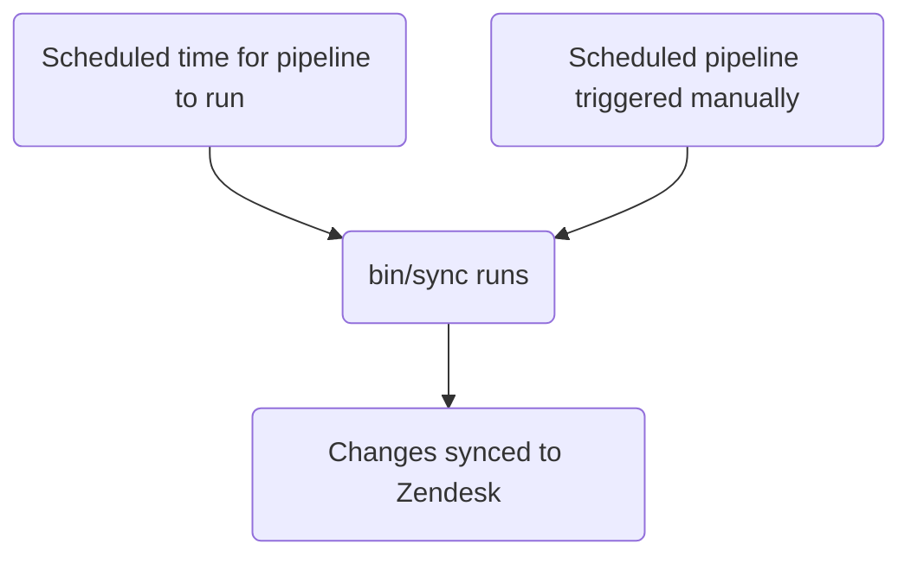

このガイドでは、GitLab で Zendesk のチケットフォームを作成、編集、管理する方法について説明します。管理者は [管理者タスク](#administrator-tasks) セクションをレビューしてください。

{}

- デプロイタイプ: `Standard`
- 同期リポジトリ
  - [Zendesk Global](https://gitlab.com/gitlab-support-readiness/zendesk-global/tickets/forms-and-fields)
  - [Zendesk US Government](https://gitlab.com/gitlab-support-readiness/zendesk-us-government/tickets/forms-and-fields)
- `CustSuppOps Zendesk Test Suite Generator` 有効

{}
{}

- これは [チケットフィールド](/handbook/security/customer-support-operations/zendesk/tickets/fields) と **非常に** 密接に結びついています。特に、_同じ_ 同期リポジトリで実行されるためです
- これは Zendesk Global の [Dynamic content](/handbook/security/customer-support-operations/zendesk/dynamic-content/) と **非常に** 密接に結びついています

{}

## チケットフォームを理解する

### チケットフォームとは

チケットフォームは、（Web UI を使う際に）ユーザーがチケットを作成するために利用するフォームです。これらは、フォーム上の回答をチケットメタデータに変換します。

これらは次の 2 つのタイプのいずれかに分類されます。

- Public - エージェントとエンドユーザーの両方が見られることを意味します
- Internal - エージェントのみが見られることを意味します

### チケットフォームの管理方法

Zendesk は UI 経由でチケットフォームを管理する完全な方法を提供していますが、私たちはよりバージョン管理された手法を採用しています。これにより、決まったレビュープロセスや、必要に応じてロールバックを実行する能力などが得られます。

そのため、私たちは同期リポジトリを利用しています。

### 同期リポジトリの仕組み

同期リポジトリのワークフローは次のプロセスに従います。



### チケットフォームは条件ロジックを使用する

チケットフォームは、条件を使ってフィールドを動的に表示/非表示にできます。

- `end_user_conditions`: エンドユーザーの選択に基づいて、エンドユーザーが見るフィールドを制御します
- `agent_conditions`: エージェントが見るフィールドと、それらがいつ必須になるかを制御します

親フィールドが特定の値を持つと、子フィールドが表示されます（オプションで必須にもできます）。例: 「Product Category が 'GitLab.com' の場合、'GitLab.com User ID' フィールドを表示する」

チケットフォームは必ずしも条件を使う _必要_ はありません。条件がない場合、フォームデータに記載されたすべてのフィールドが表示されます。

これは、チケットフォームに _条件付きの必須要件_ を設定する方法でもあります。

UI では、エンドユーザー条件の形式は次のとおりです。

> TICKET_FIELD の値が VALUE の場合、LIST_OF_TICKET_FIELDS を表示する

`LIST_OF_TICKET_FIELDS` の各項目には、そのチケットフィールド項目を何らかの形で必須にするオプションがあります。

この 2 つのタイプのバックエンドは類似していますが、必須要件の定義に重要な違いがあります。

#### エンドユーザー条件

エンドユーザー条件のバックエンド値の形式は次のとおりです。

```yaml
- parent_field_id: 'Field title'
  value: 'tag_or_value_used_by_field'
  child_fields:
  - id: 'Field title 2'
    is_required: true
```

これを分解すると次のようになります。

- `parent_field_id` は値をチェックする対象の `field` です
- `value` はチェックする `field` の値です
- `child_fields` は表示するフィールドのリストで、各項目は次を持ちます。
  - `id` は表示するフィールドです
  - `is_required` は、新しく表示されるフィールドが送信に必須かどうかを示します

#### エージェント条件

エージェント条件のバックエンド値の形式は、次の 2 つの形式のいずれかです。

```yaml
- parent_field_id: 'Field title'
  value: 'tag_or_value_used_by_field'
  child_fields:
  - id: 'Field title 2'
    is_required: true
    required_on_statuses:
      type: 'ALL_STATUSES'
```

```yaml
- parent_field_id: 'Field title'
  value: 'tag_or_value_used_by_field'
  child_fields:
  - id: 'Field title 2'
    is_required: true
    required_on_statuses:
      type: 'SOME_STATUSES'
      statuses:
      - 'pending'
      - 'hold'
      - 'solved'
```

これを分解すると次のようになります。

- `parent_field_id` は値をチェックする対象の `field` です
- `value` はチェックする `field` の値です
- `child_fields` は表示するフィールドのリストで、各項目は次を持ちます。
  - `id` は表示するフィールドです
  - `is_required` は、新しく表示されるフィールドが何らかの形で必須かどうかを示します

違いを決定するのは、新しいフィールドが _必須_ かどうかと、それがどのような形で必須になるかです。

- すべてのステータスで必須にする場合:

  ```yaml
  - id: 'Field title 2'
    is_required: true
    required_on_statuses:
      type: 'ALL_STATUSES'
  ```

- どのステータスでも必須にしない場合（つまり必須にしない）:

  ```yaml
  - id: 'Field title 2'
    is_required: true
    required_on_statuses:
      type: 'NO_STATUSES'
  ```

- 特定のステータスのみで必須にする場合:

  ```yaml
  - id: 'Field title 2'
    is_required: true
    required_on_statuses:
      type: 'SOME_STATUSES'
      statuses:
      - 'list'
      - 'of'
      - 'statuses'
  ```

## 管理者以外としてチケットフォームを作成する

チケットフォームの作成については、[Feature Request issue](https://gitlab.com/gitlab-com/gl-security/corp/cust-support-ops/issue-tracker/-/issues/new?description_template=Feature) を作成してください（Customer Support Operations チームによる手作業の対応が必要になるためです）。

## 管理者以外としてチケットフォームを編集する

チケットフォームの変更については、[Feature Request issue](https://gitlab.com/gitlab-com/gl-security/corp/cust-support-ops/issue-tracker/-/issues/new?description_template=Feature) を作成してください（Customer Support Operations チームによる手作業の対応が必要になるためです）。

## 管理者以外としてチケットフォームを無効化する

チケットフォームの無効化をリクエストするには、[Feature Request issue](https://gitlab.com/gitlab-com/gl-security/corp/cust-support-ops/issue-tracker/-/issues/new?description_template=Feature) を作成してください（Customer Support Operations チームによる手作業の対応が必要になるためです）。

## 人間が読める置換

{}

- YAML ファイル経由でチケットフォームを作成/編集する `administrators` にのみ適用されます

{}

現在、同期リポジトリは、人間が読める形式（つまりチケットフィールドの `title` 属性）からチケットフィールドとブランドの置換を実行できます。

そのため、`Preferred Region for Support` という値を見つけた場合、そのタイトルを持つチケットフィールドを探し出し、それが含まれていたチケットフォーム属性に必要なテキストに変換する方法を知っています。ブランドについても同様です（ただし、ブランドは `name` 属性を使います）。

## 現在のフォーム

### Zendesk Global の現在のフォーム

| Internal name | Public name | Visibility | Entitlement required? | Direct Link |
|---------------|-------------|------------|:---------------------:|-------------|
| SaaS | Support for GitLab.com | Public | Y | [Link](https://support.gitlab.com/hc/en-us/requests/new?ticket_form_id=334447) |
| 2FA Removal | 2FA Reset | Public | Y | [Link](https://support.gitlab.com/hc/en-us/requests/new?ticket_form_id=18469327708956) |
| SaaS Account | GitLab.com user accounts and login issues | Public | N | [Link](https://support.gitlab.com/hc/en-us/requests/new?ticket_form_id=360000803379) |
| Self-Managed | Support for a self-managed GitLab instance | Public | Y | [Link](https://support.gitlab.com/hc/en-us/requests/new?ticket_form_id=426148) |
| GitLab Dedicated | Support for GitLab Dedicated instances | Public | Y | [Link](https://support.gitlab.com/hc/en-us/requests/new?ticket_form_id=4414917877650) |
| L&R | Subscription, License or Customers Portal Problems | Public | N | [Link](https://support.gitlab.com/hc/en-us/requests/new?ticket_form_id=360000071293) |
| Billing | Billing inquiries/refunds | Public | N | [Link](https://support.gitlab.com/hc/en-us/requests/new?ticket_form_id=360000258393) |
| Alliance Partners | Support for alliance partners | Public | Y | [Link](https://support.gitlab.com/hc/en-us/requests/new?ticket_form_id=360001172559) |
| Support Ops | Support portal related matters | Public | N | [Link](https://support.gitlab.com/hc/en-us/requests/new?ticket_form_id=360001801419) |
| Emergencies | File an emergency request | Public | N | [Link](https://support.gitlab.com/hc/en-us/requests/new?ticket_form_id=360001264259) |
| Support Internal Request | | Internal | N | |
| GitLab Incidents | | Internal | N | |
| Customer Support Internal Requests | Customer Support Internal Requests | Internal | N | [Link](https://gitlab-internal.zendesk.com/hc/en-us/requests/new?ticket_form_id=22783651259548) |
| L&R Support Internal Requests | L&R Support Internal Requests | Internal | N | [Link](https://gitlab-internal.zendesk.com/hc/en-us/requests/new?ticket_form_id=22783840298780) |
| CustSuppOps Support Internal Requests | CustSuppOps Support Internal Requests | Internal | N | [Link](https://gitlab-internal.zendesk.com/hc/en-us/requests/new?ticket_form_id=22784239213084) |

### Zendesk US Government の現在のフォーム

| Internal name | Public name | Visibility | Entitlement required? | Direct Link |
|---------------|-------------|------------|:---------------------:|-------------|
| Support | Technical Support Requests | Public | Y | [Link](https://federal-support.gitlab.com/hc/en-us/requests/new?ticket_form_id=360000446511) |
| GitLab Dedicated | GitLab Dedicated Technical Support Requests | Public | Y | [Link](https://federal-support.gitlab.com/hc/en-us/requests/new?ticket_form_id=26347526042004) |
| Upgrade Assistance | Upgrade Planning Assistance Request | Public | Y | [Link](https://federal-support.gitlab.com/hc/en-us/requests/new?ticket_form_id=360001434131) |
| Support Ops | Support portal related matters | Public | Y | [Link](https://federal-support.gitlab.com/hc/en-us/requests/new?ticket_form_id=360001421052) |
| L&R | License, Subscription, and Renewals Request | Public | Y | [Link](https://federal-support.gitlab.com/hc/en-us/requests/new?ticket_form_id=360001421072) |
| Emergency | Emergency Support Request | Public | Y | [Link](https://federal-support.gitlab.com/hc/en-us/requests/new?ticket_form_id=360001421112) |
| License Issue | | Internal | N | |
| L&R Support Internal Requests | L&R Support Internal Requests | Internal | N | [Link](https://gitlab-federal-internal.zendesk.com/hc/en-us/requests/new?ticket_form_id=41826474429588) |
| CustSuppOps Support Internal Requests | CustSuppOps Support Internal Requests | Internal | N | [Link](https://gitlab-federal-internal.zendesk.com/hc/en-us/requests/new?ticket_form_id=41826926738708) |

## 管理者タスク

{}

- このセクションのすべての項目には、Zendesk への `Administrator` レベルのアクセス権が必要です。

{}

### チケットフォームの閲覧

Zendesk でチケットフォームを閲覧するには、次の手順を実行します。

1. Zendesk インスタンスの管理パネルに移動します
   - [Zendesk Global (production)](https://gitlab.zendesk.com/admin/home)
   - [Zendesk Global (sandbox)](https://gitlab1707170878.zendesk.com/admin/home)
   - [Zendesk US Government (production)](https://gitlab-federal-support.zendesk.com/admin/home)
   - [Zendesk US Government (sandbox)](https://gitlabfederalsupport1585318082.zendesk.com/admin/home)
1. `Objects and rules > Tickets > forms` に移動します
   - [Zendesk Global](https://gitlab.zendesk.com/admin/objects-rules/tickets/ticket-forms)
   - [Zendesk Global (sandbox)](https://gitlab1707170878.zendesk.com/admin/objects-rules/tickets/ticket-forms)
   - [Zendesk US Government](https://gitlab-federal-support.zendesk.com/admin/objects-rules/tickets/ticket-forms)
   - [Zendesk US Government (sandbox)](https://gitlabfederalsupport1585318082.zendesk.com/admin/objects-rules/tickets/ticket-forms)

注: 非アクティブなチケットフォームを閲覧したい場合は、`Filter` ボタンをクリックしてアクティブフィルターを変更する必要があるかもしれません

### チケットフォームの作成

{}

- これは対応するリクエスト Issue（Feature Request、Administrative、Bug など）がある場合にのみ行うべきです。存在しない場合は、まず作成してください（そして対応する前に標準プロセスを通してください）。

{}

チケットフォームを作成するには、同期リポジトリで MR を作成する必要があります。具体的な変更内容は、リクエスト自体によって異なります。使える出発点となるテンプレートは次のとおりです。

```yaml
---
name: 'Your form name here'
previous_name: 'Your form name here'
display_name: 'Customer visible name'
raw_display_name: 'Customer visible name' # Dynamic content placeholder can be used here
active: true
position: 1 # Integer representing ticket form position
ticket_field_ids:
- 'Field title'
- 'Field title 2'
- 'Field title 3'
- 'Field title 4'
default: false # Is the form the default form for this account
in_all_brands: false # Is the form available for use in all brands on this account (should always be false)
restricted_brand_ids:
- 'Brand name'
end_user_conditions:
- parent_field_id: 'Field title'
  value: 'tag_or_value_used_by_field'
  child_fields:
  - id: 'Field title 2'
    is_required: true
  - id: 'Field title 3'
    is_required: false
agent_conditions:
- parent_field_id: 'Field title'
  value: 'tag_or_value_used_by_field'
  child_fields:
  - id: 'Field title 2'
    is_required: true
    required_on_statuses:
      type: 'ALL_STATUSES'
  - id: 'Field title 3'
    is_required: true
    required_on_statuses:
      type: 'NO_STATUSES'
  - id: 'Field title 4'
    is_required: true
    required_on_statuses:
      type: 'SOME_STATUSES'
      statuses:
      - 'pending'
      - 'hold'
      - 'solved'
```

チケットフォームをゼロから作成するのは非常に複雑になることがあるため、迷った場合は同期リポジトリにある既存のものを実用的な例として使ってください。

ピアがあなたの MR をレビューして承認したら、MR をマージできます。次のデプロイが発生すると、Zendesk に同期されます。

### チケットフォームの編集

{}

- これは対応するリクエスト Issue（Feature Request、Administrative、Bug など）がある場合にのみ行うべきです。存在しない場合は、まず作成してください（そして対応する前に標準プロセスを通してください）。

{}

チケットフォームを編集するには、同期リポジトリで MR を作成する必要があります。具体的な変更内容は、リクエスト自体によって異なります。

ピアがあなたの MR をレビューして承認したら、MR をマージできます。次のデプロイが発生すると、Zendesk に同期されます。

#### チケットフォームの名前を変更する

チケットフォームのタイトルを変更する必要がある場合は、現在の値を `previous_name` 属性にコピーしてから `name` 属性を変更します。これにより、同期は依然として対象のチケットフォームを探し出して更新できます。

### チケットフォームの無効化

{}

- これは対応するリクエスト Issue（Feature Request、Administrative、Bug など）がある場合にのみ行うべきです。存在しない場合は、まず作成してください（そして対応する前に標準プロセスを通してください）。

{}

チケットフォームを無効化するには、同期リポジトリで MR を作成する必要があります。この MR では、対応するチケットフォームの YAML ファイルに対して次のことを行うべきです。

1. ファイルを `active` パスから `inactive` パスへ移動します
1. `active` 属性の値を `false` に変更します
1. `ticket_field_ids` の値を次のように変更します。

   ```yaml
   - 'Status'
   - 'Group'
   - 'Assignee'
   - 'Ticket status'
   - 'Subject'
   - 'Description'
   ```

1. `end_user_conditions` の値を空の配列（つまり `[]`）に変更します
1. `agent_conditions` の値を空の配列（つまり `[]`）に変更します

ピアがあなたの MR をレビューして承認したら、MR をマージできます。次のデプロイが発生すると、Zendesk に同期されます。

### チケットフォームの削除

{}

- チケットフォームは、無効化されている場合にのみ削除できます。
- これは対応するリクエスト Issue（Feature Request、Administrative、Bug など）がある場合にのみ行うべきです。存在しない場合は、まず作成してください（そして対応する前に標準プロセスを通してください）。

{}

同期リポジトリは削除を実行しないため、これは Zendesk 自体で行う必要があります。

チケットフォームを削除するには、次の手順を実行します。

1. Zendesk インスタンスの管理パネルに移動します
   - [Zendesk Global (production)](https://gitlab.zendesk.com/admin/home)
   - [Zendesk Global (sandbox)](https://gitlab1707170878.zendesk.com/admin/home)
   - [Zendesk US Government (production)](https://gitlab-federal-support.zendesk.com/admin/home)
   - [Zendesk US Government (sandbox)](https://gitlabfederalsupport1585318082.zendesk.com/admin/home)
1. `Objects and rules > Tickets > forms` に移動します
   - [Zendesk Global](https://gitlab.zendesk.com/admin/objects-rules/tickets/ticket-forms)
   - [Zendesk Global (sandbox)](https://gitlab1707170878.zendesk.com/admin/objects-rules/tickets/ticket-forms)
   - [Zendesk US Government](https://gitlab-federal-support.zendesk.com/admin/objects-rules/tickets/ticket-forms)
   - [Zendesk US Government (sandbox)](https://gitlabfederalsupport1585318082.zendesk.com/admin/objects-rules/tickets/ticket-forms)
1. フィルターを `Inactive` に変更します
1. 削除したいチケットフォームを探し、その名前をクリックします
1. （チケットフォームデータの右上にある）縦に並んだ 3 つの点をクリックします
1. `Delete` をクリックします
1. `Delete` をクリックして変更を送信します

### 例外デプロイの実行

{}

- これはチケットフォームとチケットフィールドの両方に適用されます

{}

チケットフォームの例外デプロイを実行するには、対象のチケットフォーム同期プロジェクトに移動し、スケジュール済みパイプラインのページに行き、同期項目の再生ボタンをクリックします。これにより、チケットフォームの同期ジョブがトリガーされます。

## よくある問題とトラブルシューティング

### マージ後にチケットフォームの変更が反映されない

チケットフォームは `Standard` デプロイタイプに従うため、通常のデプロイサイクル中（または例外デプロイが行われたとき）にのみデプロイされます。
