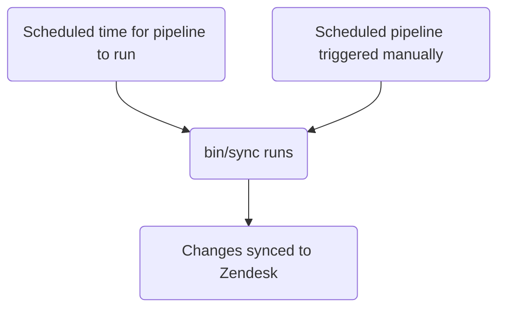

このガイドでは、GitLab における Zendesk のチケットフォームの作成、編集、管理方法について説明します。管理者は[管理者タスク](#administrator-tasks)セクションを確認してください。

{}

- デプロイタイプ: `Standard`
- 同期リポジトリ
  - [Zendesk Global](https://gitlab.com/gitlab-support-readiness/zendesk-global/tickets/forms-and-fields)
  - [Zendesk US Government](https://gitlab.com/gitlab-support-readiness/zendesk-us-government/tickets/forms-and-fields)
- `CustSuppOps Zendesk Test Suite Generator` 有効

{}
{}

- これは [チケットフィールド](/handbook/security/customer-support-operations/zendesk/tickets/fields) と **非常に** 密接に結びついています。特に _同じ_ 同期リポジトリで動作するためです
- これは Zendesk Global の [動的コンテンツ](/handbook/security/customer-support-operations/zendesk/dynamic-content/) と **非常に** 密接に結びついています

{}

## チケットフォームを理解する

### チケットフォームとは

チケットフォームは、ユーザーがチケットを作成する際に使用するフォームです（Web UI 使用時）。これらはフォーム上の応答をチケットメタデータに変換します。

これらは以下の 2 つのタイプのいずれかに分類されます。

- Public - エージェントとエンドユーザーの両方が閲覧可能
- Internal - エージェントのみが閲覧可能

### チケットフォームの管理方法

Zendesk は UI を通じてチケットフォームを完全に管理する方法を提供していますが、私たちはよりバージョン管理されたメソドロジーを採用しています。これにより、定められたレビュープロセスや、必要に応じてロールバックを行う能力などが得られます。

そのため、同期リポジトリを利用しています。

### 同期リポジトリの仕組み

同期リポジトリのワークフローは以下のプロセスに従います。



### チケットフォームは条件論理を使用する

チケットフォームは条件を使用してフィールドを動的に表示/非表示できます。

- `end_user_conditions`: エンドユーザーが選択内容に基づいて見るフィールドを制御
- `agent_conditions`: エージェントが見るフィールドと、それらが必須となるタイミングを制御

親フィールドが特定の値を持つ場合、子フィールドが表示されます（オプションで必須にもできます）。例: 「Product Category が 'GitLab.com' の場合、'GitLab.com User ID' フィールドを表示」

チケットフォームは条件を使用する _必要は_ ありません。条件なしの場合、フォームデータに記載されているすべてのフィールドが表示されます。

これは _条件付き必須_ をチケットフォーム上に設定する方法でもあります。

UI では、エンドユーザー条件のフォーマットは以下のとおりです。

> TICKET_FIELD の値が VALUE の場合、LIST_OF_TICKET_FIELDS を表示

`LIST_OF_TICKET_FIELDS` の各項目には、何らかの方法でチケットフィールドアイテムを必須にするオプションがあります。

2 つのタイプのバックエンドは類似しており、要件定義に主要な違いがあります。

#### エンドユーザー条件

エンドユーザー条件のバックエンド値のフォーマットは以下のとおりです。

```yaml
- parent_field_id: 'Field title'
  value: 'tag_or_value_used_by_field'
  child_fields:
  - id: 'Field title 2'
    is_required: true
```

これを分解すると:

- `parent_field_id` は値をチェックする `field`
- `value` はチェックしている `field` の値
- `child_fields` は表示するフィールドのリストで、各項目には:
  - `id` は表示するフィールド
  - `is_required` は新しく表示されるフィールドが提出に必須かどうかを示す

#### エージェント条件

エージェント条件のバックエンド値のフォーマットは、以下の 2 つのフォーマットのいずれかです。

```yaml
- parent_field_id: 'Field title'
  value: 'tag_or_value_used_by_field'
  child_fields:
  - id: 'Field title 2'
    is_required: true
    required_on_statuses:
      type: 'ALL_STATUSES'
```

```yaml
- parent_field_id: 'Field title'
  value: 'tag_or_value_used_by_field'
  child_fields:
  - id: 'Field title 2'
    is_required: true
    required_on_statuses:
      type: 'SOME_STATUSES'
      statuses:
      - 'pending'
      - 'hold'
      - 'solved'
```

これを分解すると:

- `parent_field_id` は値をチェックする `field`
- `value` はチェックしている `field` の値
- `child_fields` は表示するフィールドのリストで、各項目には:
  - `id` は表示するフィールド
  - `is_required` は新しく表示されるフィールドが何らかの方法で必須かどうかを示す

違いを決定するのは、新しいフィールドが _必須_ かどうかと、どのような方法で必須かです。

- すべてのステータスで必須にする場合:

  ```yaml
  - id: 'Field title 2'
    is_required: true
    required_on_statuses:
      type: 'ALL_STATUSES'
  ```

- どのステータスでも必須にしない場合（つまり必須にしない）:

  ```yaml
  - id: 'Field title 2'
    is_required: true
    required_on_statuses:
      type: 'NO_STATUSES'
  ```

- 特定のステータスでのみ必須にする場合:

  ```yaml
  - id: 'Field title 2'
    is_required: true
    required_on_statuses:
      type: 'SOME_STATUSES'
      statuses:
      - 'list'
      - 'of'
      - 'statuses'
  ```

## 管理者ではない者がチケットフォームを作成する

チケットフォームの作成については、[Feature Request の Issue](https://gitlab.com/gitlab-com/gl-security/corp/cust-support-ops/issue-tracker/-/issues/new?description_template=Feature) を作成してください（カスタマーサポートオペレーションチームによる手動対応が必要となるため）。

## 管理者ではない者がチケットフォームを編集する

チケットフォームの変更については、[Feature Request の Issue](https://gitlab.com/gitlab-com/gl-security/corp/cust-support-ops/issue-tracker/-/issues/new?description_template=Feature) を作成してください（カスタマーサポートオペレーションチームによる手動対応が必要となるため）。

## 管理者ではない者がチケットフォームを非アクティブ化する

チケットフォームの非アクティブ化を依頼するには、[Feature Request の Issue](https://gitlab.com/gitlab-com/gl-security/corp/cust-support-ops/issue-tracker/-/issues/new?description_template=Feature) を作成してください（カスタマーサポートオペレーションチームによる手動対応が必要となるため）。

## 人間が読める形式の置換

{}

- これは YAML ファイル経由でチケットフォームを作成・編集する `administrators` にのみ適用されます

{}

現在、同期リポジトリはチケットフィールドとブランドの人間が読める形式（つまりチケットフィールドの `title` 属性）からの置換を実行できます。

そのため、`Preferred Region for Support` という値を見つけた場合、そのタイトルのチケットフィールドを特定し、その配下にあったチケットフォーム属性の必要なテキストに変換することを認識します。ブランドについても同じです（ただし `name` 属性を使用）。

## 現在のフォーム

### Zendesk Global の現在のフォーム

| 内部名 | パブリック名 | 可視性 | エンタイトルメント必須? | 直接リンク |
|---------------|-------------|------------|:---------------------:|-------------|
| SaaS | Support for GitLab.com | Public | Y | [Link](https://support.gitlab.com/hc/en-us/requests/new?ticket_form_id=334447) |
| 2FA Removal | 2FA Reset | Public | Y | [Link](https://support.gitlab.com/hc/en-us/requests/new?ticket_form_id=18469327708956) |
| SaaS Account | GitLab.com user accounts and login issues | Public | N | [Link](https://support.gitlab.com/hc/en-us/requests/new?ticket_form_id=360000803379) |
| Self-Managed | Support for a self-managed GitLab instance | Public | Y | [Link](https://support.gitlab.com/hc/en-us/requests/new?ticket_form_id=426148) |
| GitLab Dedicated | Support for GitLab Dedicated instances | Public | Y | [Link](https://support.gitlab.com/hc/en-us/requests/new?ticket_form_id=4414917877650) |
| L&R | Subscription, License or Customers Portal Problems | Public | N | [Link](https://support.gitlab.com/hc/en-us/requests/new?ticket_form_id=360000071293) |
| Billing | Billing inquiries/refunds | Public | N | [Link](https://support.gitlab.com/hc/en-us/requests/new?ticket_form_id=360000258393) |
| Alliance Partners | Support for alliance partners | Public | Y | [Link](https://support.gitlab.com/hc/en-us/requests/new?ticket_form_id=360001172559) |
| Support Ops | Support portal related matters | Public | N | [Link](https://support.gitlab.com/hc/en-us/requests/new?ticket_form_id=360001801419) |
| Emergencies | File an emergency request | Public | N | [Link](https://support.gitlab.com/hc/en-us/requests/new?ticket_form_id=360001264259) |
| Support Internal Request | | Internal | N | |
| GitLab Incidents | | Internal | N | |
| Customer Support Internal Requests | Customer Support Internal Requests | Internal | N | [Link](https://gitlab-internal.zendesk.com/hc/en-us/requests/new?ticket_form_id=22783651259548) |
| L&R Support Internal Requests | L&R Support Internal Requests | Internal | N | [Link](https://gitlab-internal.zendesk.com/hc/en-us/requests/new?ticket_form_id=22783840298780) |
| CustSuppOps Support Internal Requests | CustSuppOps Support Internal Requests | Internal | N | [Link](https://gitlab-internal.zendesk.com/hc/en-us/requests/new?ticket_form_id=22784239213084) |

### Zendesk US Government の現在のフォーム

| 内部名 | パブリック名 | 可視性 | エンタイトルメント必須? | 直接リンク |
|---------------|-------------|------------|:---------------------:|-------------|
| Support | Technical Support Requests | Public | Y | [Link](https://federal-support.gitlab.com/hc/en-us/requests/new?ticket_form_id=360000446511) |
| GitLab Dedicated | GitLab Dedicated Technical Support Requests | Public | Y | [Link](https://federal-support.gitlab.com/hc/en-us/requests/new?ticket_form_id=26347526042004) |
| Upgrade Assistance | Upgrade Planning Assistance Request | Public | Y | [Link](https://federal-support.gitlab.com/hc/en-us/requests/new?ticket_form_id=360001434131) |
| Support Ops | Support portal related matters | Public | Y | [Link](https://federal-support.gitlab.com/hc/en-us/requests/new?ticket_form_id=360001421052) |
| L&R | License, Subscription, and Renewals Request | Public | Y | [Link](https://federal-support.gitlab.com/hc/en-us/requests/new?ticket_form_id=360001421072) |
| Emergency | Emergency Support Request | Public | Y | [Link](https://federal-support.gitlab.com/hc/en-us/requests/new?ticket_form_id=360001421112) |
| License Issue | | Internal | N | |
| L&R Support Internal Requests | L&R Support Internal Requests | Internal | N | [Link](https://gitlab-federal-internal.zendesk.com/hc/en-us/requests/new?ticket_form_id=41826474429588) |
| CustSuppOps Support Internal Requests | CustSuppOps Support Internal Requests | Internal | N | [Link](https://gitlab-federal-internal.zendesk.com/hc/en-us/requests/new?ticket_form_id=41826926738708) |

## 管理者タスク {#administrator-tasks}

{}

- このセクションのすべての項目は、Zendesk への `Administrator` レベルのアクセスが必要です。

{}

### チケットフォームを表示する

Zendesk でチケットフォームを表示するには:

1. Zendesk インスタンスの管理パネルに移動
   - [Zendesk Global (production)](https://gitlab.zendesk.com/admin/home)
   - [Zendesk Global (sandbox)](https://gitlab1707170878.zendesk.com/admin/home)
   - [Zendesk US Government (production)](https://gitlab-federal-support.zendesk.com/admin/home)
   - [Zendesk US Government (sandbox)](https://gitlabfederalsupport1585318082.zendesk.com/admin/home)
1. `Objects and rules > Tickets > forms` に移動
   - [Zendesk Global](https://gitlab.zendesk.com/admin/objects-rules/tickets/ticket-forms)
   - [Zendesk Global (sandbox)](https://gitlab1707170878.zendesk.com/admin/objects-rules/tickets/ticket-forms)
   - [Zendesk US Government](https://gitlab-federal-support.zendesk.com/admin/objects-rules/tickets/ticket-forms)
   - [Zendesk US Government (sandbox)](https://gitlabfederalsupport1585318082.zendesk.com/admin/objects-rules/tickets/ticket-forms)

注意: 非アクティブのチケットフォームを表示したい場合は、`Filter` ボタンをクリックしてアクティブフィルターを変更する必要がある場合があります。

### チケットフォームを作成する

{}

- これは対応する依頼 Issue（Feature Request、Administrative、Bug など）が存在する場合にのみ実行してください。存在しない場合は、まず作成して標準プロセスを通してから対応してください。

{}

チケットフォームを作成するには、同期リポジトリで MR を作成する必要があります。具体的な変更内容は依頼自体によって異なります。使用できる開始テンプレートは以下のとおりです。

```yaml
---
name: 'Your form name here'
previous_name: 'Your form name here'
display_name: 'Customer visible name'
raw_display_name: 'Customer visible name' # Dynamic content placeholder can be used here
active: true
position: 1 # Integer representing ticket form position
ticket_field_ids:
- 'Field title'
- 'Field title 2'
- 'Field title 3'
- 'Field title 4'
default: false # Is the form the default form for this account
in_all_brands: false # Is the form available for use in all brands on this account (should always be false)
restricted_brand_ids:
- 'Brand name'
end_user_conditions:
- parent_field_id: 'Field title'
  value: 'tag_or_value_used_by_field'
  child_fields:
  - id: 'Field title 2'
    is_required: true
  - id: 'Field title 3'
    is_required: false
agent_conditions:
- parent_field_id: 'Field title'
  value: 'tag_or_value_used_by_field'
  child_fields:
  - id: 'Field title 2'
    is_required: true
    required_on_statuses:
      type: 'ALL_STATUSES'
  - id: 'Field title 3'
    is_required: true
    required_on_statuses:
      type: 'NO_STATUSES'
  - id: 'Field title 4'
    is_required: true
    required_on_statuses:
      type: 'SOME_STATUSES'
      statuses:
      - 'pending'
      - 'hold'
      - 'solved'
```

チケットフォームはゼロから作成するのは非常に複雑な場合があるため、疑わしい場合は同期リポジトリの既存のものを実用的な例として使用してください。

ピアによるレビューと承認後、MR をマージできます。次のデプロイ時に、Zendesk に同期されます。

### チケットフォームを編集する

{}

- これは対応する依頼 Issue（Feature Request、Administrative、Bug など）が存在する場合にのみ実行してください。存在しない場合は、まず作成して標準プロセスを通してから対応してください。

{}

チケットフォームを編集するには、同期リポジトリで MR を作成する必要があります。具体的な変更内容は依頼自体によって異なります。

ピアによるレビューと承認後、MR をマージできます。次のデプロイ時に、Zendesk に同期されます。

#### チケットフォームの名前を変更する

チケットフォームのタイトルを変更する必要がある場合、現在の値を `previous_name` 属性にコピーしてから `name` 属性を変更します。これにより、同期は更新対象のチケットフォームを引き続き特定できます。

### チケットフォームを非アクティブ化する

{}

- これは対応する依頼 Issue（Feature Request、Administrative、Bug など）が存在する場合にのみ実行してください。存在しない場合は、まず作成して標準プロセスを通してから対応してください。

{}

チケットフォームを非アクティブ化するには、同期リポジトリで MR を作成する必要があります。この MR では、対応するチケットフォームの YAML ファイルに対して以下を行います。

1. ファイルを `active` から `inactive` パスに移動
1. `active` 属性の値を `false` に変更
1. `ticket_field_ids` の値を以下に変更:

   ```yaml
   - 'Status'
   - 'Group'
   - 'Assignee'
   - 'Ticket status'
   - 'Subject'
   - 'Description'
   ```

1. `end_user_conditions` の値を空の配列（つまり `[]`）に変更
1. `agent_conditions` の値を空の配列（つまり `[]`）に変更

ピアによるレビューと承認後、MR をマージできます。次のデプロイ時に、Zendesk に同期されます。

### チケットフォームを削除する

{}

- 非アクティブ化されているチケットフォームのみ削除できます。
- これは対応する依頼 Issue（Feature Request、Administrative、Bug など）が存在する場合にのみ実行してください。存在しない場合は、まず作成して標準プロセスを通してから対応してください。

{}

同期リポジトリは削除を実行しないため、これは Zendesk 自体経由で行う必要があります。

チケットフォームを削除するには:

1. Zendesk インスタンスの管理パネルに移動
   - [Zendesk Global (production)](https://gitlab.zendesk.com/admin/home)
   - [Zendesk Global (sandbox)](https://gitlab1707170878.zendesk.com/admin/home)
   - [Zendesk US Government (production)](https://gitlab-federal-support.zendesk.com/admin/home)
   - [Zendesk US Government (sandbox)](https://gitlabfederalsupport1585318082.zendesk.com/admin/home)
1. `Objects and rules > Tickets > forms` に移動
   - [Zendesk Global](https://gitlab.zendesk.com/admin/objects-rules/tickets/ticket-forms)
   - [Zendesk Global (sandbox)](https://gitlab1707170878.zendesk.com/admin/objects-rules/tickets/ticket-forms)
   - [Zendesk US Government](https://gitlab-federal-support.zendesk.com/admin/objects-rules/tickets/ticket-forms)
   - [Zendesk US Government (sandbox)](https://gitlabfederalsupport1585318082.zendesk.com/admin/objects-rules/tickets/ticket-forms)
1. フィルターを `Inactive` に変更
1. 削除するチケットフォームを見つけてその名前をクリック
1. 縦の 3 つの点（チケットフォームデータの右上）をクリック
1. `Delete` をクリック
1. `Delete` をクリックして変更を送信

### 例外デプロイを実施する

{}

- これはチケットフォームとチケットフィールドの両方に適用されます

{}

チケットフォームの例外デプロイを実施するには、対象のチケットフォーム同期プロジェクトに移動し、スケジュールパイプラインのページに移動して、同期項目の再生ボタンをクリックします。これによりチケットフォームの同期ジョブがトリガーされます。

## よくある問題とトラブルシューティング

### マージ後にチケットフォームの変更が見えない

チケットフォームは `Standard` デプロイタイプに従うため、通常のデプロイサイクル中（または例外デプロイが実施された場合）にのみデプロイされます。
