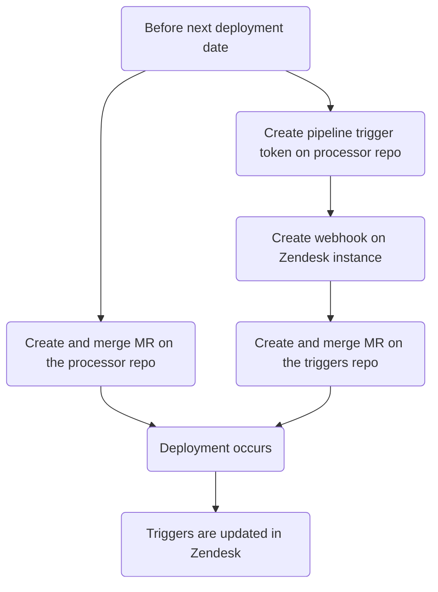
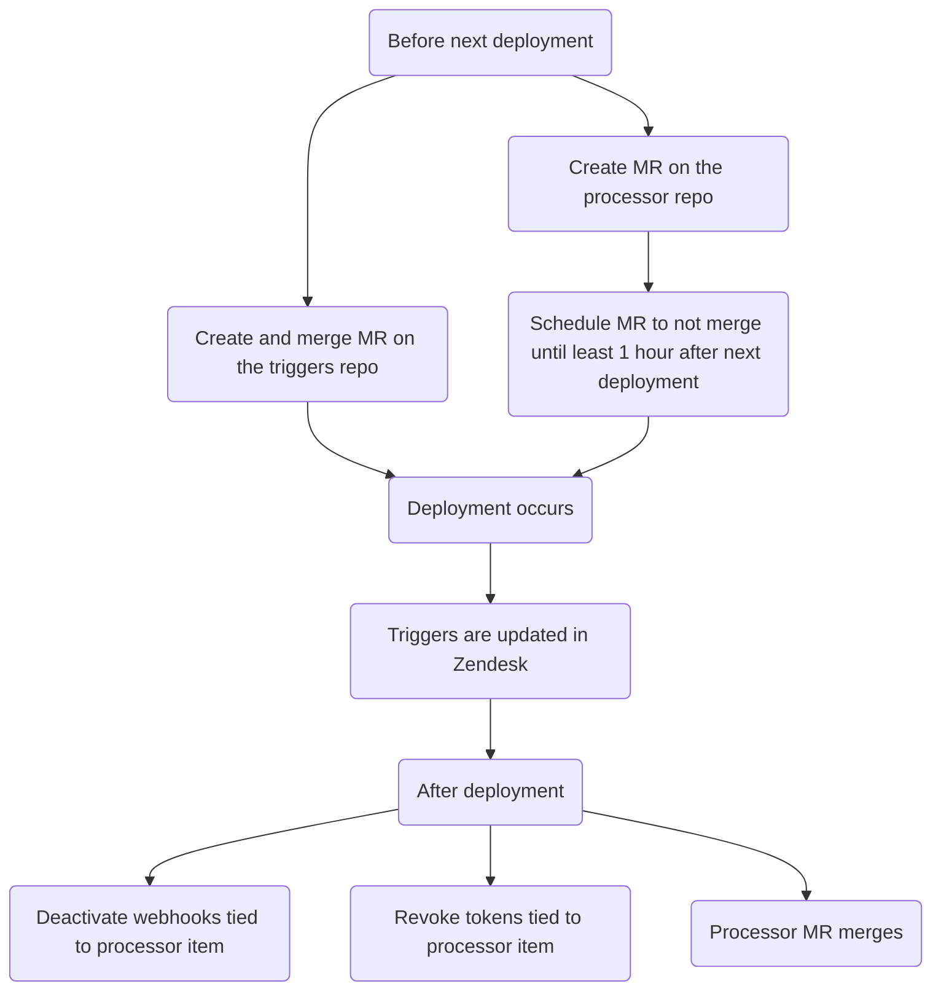

このガイドでは、Zendesk のチケットプロセッサ（特定のトリガーに基づいてチケットに対するカスタムアクションを実行する自動化システム）について説明します。利用可能なプロセッサタイプ、およびプロセッサ項目の作成、変更、削除方法をドキュメント化します。

{}

- デプロイタイプ: `Ad-hoc`
- 同期リポジトリ
  - [Zendesk Global](https://gitlab.com/gitlab-support-readiness/zendesk-global/tickets/processor)
  - [Zendesk US Government](https://gitlab.com/gitlab-support-readiness/zendesk-us-government/tickets/processor)

{}

## チケットプロセッサを理解する

### チケットプロセッサとは

チケットプロセッサは、CI/CD パイプラインのトリガーを介して起動される、私たちが gitlab.com に保存しているスクリプト群です。チケットに対してさまざまなカスタムアクションを実行できます。

### Zendesk Global のプロセッサ項目

#### 2FA の削除

[gitlab-com/support/support-team-meta#6663](https://gitlab.com/gitlab-com/support/support-team-meta/-/issues/6663) で導入

これはリクエスト自体をチェックして適格性のステータスを判定します。判定結果に応じて、チケットにタグを追加します（対応する Zendesk トリガーが発火します）。

- リクエスト元自身の 2FA を削除するリクエストの場合:
  - ユーザーがそのリクエストのサポート利用資格を持っている場合、タグ `2fa_challenge_questions` が追加されます（そしてプロセスは終了します）
  - ユーザーがそのリクエストのサポート利用資格を持っていない場合、タグ `2fa_user_not_entitled` が追加されます（そしてプロセスは終了します）
- 別のユーザーの 2FA を削除するリクエストの場合:
  - 以下の条件をチェックします
    - リクエスト元はそのリクエストのサポート利用資格を持っているか?
    - リクエスト元のメールアドレスのドメインが、対象ユーザーのメールアドレスのドメインと完全に一致しているか?
    - リクエスト元は gitlab.com アカウントを持っているか?
    - 対象ユーザーは gitlab.com アカウントを持っているか?
    - リクエスト元はトップレベルの有料 namespace の `Owner` であるか?
    - 対象ユーザーはそのトップレベルの有料 namespace 配下のメンバーであるか?
  - すべてのチェックに合格した場合、タグ `2fa_snippet_verification` が追加されます（そしてプロセスは終了します）
  - いずれかのチェックに失敗した場合、タグ `2fa_owner_not_entitled` が追加されます（そしてプロセスは終了します）

#### アカウントのブロック

[gitlab-com/support/support-ops/zendesk-global/trigger!264](https://gitlab.com/gitlab-com/support/support-ops/zendesk-global/triggers/-/merge_requests/264) で導入

これは gitlab.com ユーザーのアカウントステータスをチェックします。ステータスに応じて、異なるアクションが発生します。

- ユーザーが存在しない場合...
  - アカウントが存在しないことを伝える公開返信がユーザーに送信されます
  - `Ticket Stage` の値が `FRT` に設定されます
  - チケットのステータスが `Pending` に設定されます
- ユーザーがブロックされていない場合...
  - アカウントが実際にはブロックされていないことを伝える公開返信がユーザーに送信されます
  - `Ticket Stage` の値が `FRT` に設定されます
  - チケットのステータスが `Pending` に設定されます
- ユーザーが禁輸ポリシーによりブロックされている場合...
  - 禁輸ポリシーによりブロックされたことを伝える公開返信がユーザーに送信されます。あわせて、それを解決するための次のステップも伝えます。
  - `Ticket Stage` の値が `FRT` に設定されます
  - チケットのステータスが `Solved` に設定されます
- ユーザーがブロックされている（ただし禁輸ポリシーによるものではない）場合...
  - [T&S アカウント復帰プロジェクト](https://gitlab.com/gitlab-com/gl-security/security-operations/trust-and-safety/TS_Operations/account-reinstatements) 内に Issue が作成されます
  - 次に従うべきステップを SE に示す内部返信がチケットに追加されます

#### ASE の更新

[gitlab-com/gl-security/corp/cust-support-ops/issue-tracker#623](https://gitlab.com/gitlab-com/gl-security/corp/cust-support-ops/issue-tracker/-/issues/623) で導入

これは（`bin/ase_update` スクリプトを使用して）組織への Assigned Support Engineer (ASE) の追加または削除を処理します。

このスクリプトは次のように動作します。

- 組織が存在する場合:
  - ASE の追加／変更で、ユーザー ID が有効な場合:
    - 組織の `assigned_se` 属性をそのユーザーの ID を使うように変更します
    - タスクが完了したことを伝えるコメントをチケットに追加します（そしてチケットをクローズします）
  - ASE の削除の場合:
    - 組織の `assigned_se` 属性を空の値に変更します
    - タスクが完了したことを伝えるコメントをチケットに追加します（そしてチケットをクローズします）
  - ASE の追加で、指定されたユーザー ID が無効な場合、その旨をリクエスト元に伝えるコメントをチケットに追加します（そしてチケットをクローズします）
- 組織が存在しない場合、その旨をリクエスト元に伝えるコメントをチケットに追加します（そしてチケットをクローズします）

#### Collaboration ID

[gitlab-com/gl-security/corp/cust-support-ops/issue-tracker#623](https://gitlab.com/gitlab-com/gl-security/corp/cust-support-ops/issue-tracker/-/issues/623) で導入

これは（`bin/collab_ids` スクリプトを使用して）組織へのコラボレーションプロジェクト ID の追加または削除を処理します。

このスクリプトは次のように動作します。

- 組織が存在する場合:
  - コラボレーションプロジェクトの追加／変更の場合:
    - 組織の `am_project_id` 属性をそのプロジェクトの ID を使うように変更します
    - タスクが完了したことを伝えるコメントをチケットに追加します（そしてチケットをクローズします）
  - コラボレーションプロジェクトの削除の場合:
    - 組織の `am_project_id` 属性を空の値に変更します
    - タスクが完了したことを伝えるコメントをチケットに追加します（そしてチケットをクローズします）
- 組織が存在しない場合、その旨をリクエスト元に伝えるコメントをチケットに追加します（そしてチケットをクローズします）

#### マクロの作成

[gitlab-com/gl-security/corp/cust-support-ops/issue-tracker#705](https://gitlab.com/gitlab-com/gl-security/corp/cust-support-ops/issue-tracker/-/issues/705) で導入

これは（`bin/create_macro` スクリプトを使用して）Zendesk インスタンスへの [シンプルなマクロ](../macros/#simple-vs-advanced-macros) の追加を処理します。

このスクリプトは次のように動作します。

- マクロがコメントを作成するものである場合、既存の管理対象コンテンツファイルが存在するかをチェックします（存在しない場合は管理対象コンテンツファイルを作成します）
- マクロ用リポジトリに YAML ファイルを作成します（これにより Zendesk の同期がトリガーされ、マクロが作成されます）
- タスクが完了したことを確認するコメントをチケットに追加します（そしてチケットをクローズします）。

#### 代理でのチケット作成

[gitlab-com/gl-security/corp/cust-support-ops/issue-tracker#706](https://gitlab.com/gitlab-com/gl-security/corp/cust-support-ops/issue-tracker/-/issues/706) で導入

これは（`bin/create_on_behalf` スクリプトを使用して）顧客や見込み顧客などの代理でチケットを作成するリクエストを処理します。

このスクリプトは次のように動作します。

- リクエストの情報を読み取り、（`Support Internal Request` フォームを使用して）ユーザーの代理で新しいチケットを作成します
- 元の内部リクエストチケットを、新しく作成されたエンドユーザーチケットへ（内部コメントとして）マージし、内部リクエストチケットの添付ファイルが新しく作成されたエンドユーザーチケットに添付されるようにします

#### メール送信抑制 (Email Suppressions)

[gitlab-com/support/support-ops/zendesk-global/trigger!264](https://gitlab.com/gitlab-com/support/support-ops/zendesk-global/triggers/-/merge_requests/264) で導入

これは Mailgun 内にメール送信抑制が存在するかをチェックします。チェック結果に応じて、異なるアクションが発生します。

- 送信抑制が存在する場合...
  - Mailgun 内で見つかった送信抑制が削除されます
  - 送信抑制が見つかり削除されたことを伝える内部返信がチケットに追加されます。これには当該送信抑制のコード、エラー、タイムスタンプが含まれます
  - 送信抑制が見つかって削除されたこと、およびユーザーが取るべき次のステップを伝える公開返信がユーザーに送信されます。
  - チケットのステータスが `Solved` に設定されます
- 送信抑制が存在しない場合...
  - 送信抑制が見つからなかったこと、および取れる次のステップを伝える公開返信がユーザーに送信されます。あわせて、それを解決するための次のステップも伝えます。
  - `Ticket Stage` の値が `FRT` に設定されます
  - チケットのステータスが `Pending` に設定されます

#### Link Tagger

Zendesk Global へは [gitlab-com/support/support-ops/support-ops-project#998](https://gitlab.com/gitlab-com/support/support-ops/support-ops-project/-/issues/998)、Zendesk US Government へは [gitlab-com/gl-security/corp/cust-support-ops/issue-tracker#841](https://gitlab.com/gitlab-com/gl-security/corp/cust-support-ops/issue-tracker/-/work_items/841) で導入

これは渡されたコメント（公開かつエージェントが作成したもの）について、チケットにタグ付けしたいさまざまな種類の項目をチェックします。現在の項目の種類（とそれに基づいて追加されるタグ）は次のとおりです。

- gitlab.com の Issue リンクを含む
  - `gitlab_issue_link` タグが追加されます
  - `CUSTOMPATH_issues_IID` タグが追加されます（Global のみ）
    - `CUSTOMPATH` はプロジェクトのスラッグ、`IID` は Issue ID です
    - 例: プロジェクト jcolyer/most_amazing_project_ever の Issue 5 へのリンクは次のようになります: `jcolyer_most_amazing_project_ever_issues_5`
  - `issue~CUSTOMPATH_IID`
    - `CUSTOMPATH` はプロジェクトのスラッグ、`IID` は Issue ID です
    - 例: プロジェクト jcolyer/most_amazing_project_ever の Issue 5 へのリンクは次のようになります: `issue~jcolyer_most_amazing_project_ever_issues_5`
  - `issue_PROJECTID_IID`（Global のみ）
    - `PROJECTID` はプロジェクトの ID、`IID` は Issue ID です
    - 例: プロジェクト jcolyer/most_amazing_project_ever（プロジェクト ID 123）の Issue 5 へのリンクは次のようになります: `issue_123_5`
- gitlab.com のマージリクエストリンクを含む
  - `gitlab_merge_request_link` タグが追加されます
  - `CUSTOM_PATH_merge_requests_IID` タグが追加されます（Global のみ）
    - `CUSTOMPATH` はプロジェクトのスラッグ、`IID` はマージリクエスト ID です
    - 例: プロジェクト jcolyer/most_amazing_project_ever のマージリクエスト 27 へのリンクは次のようになります: `jcolyer_most_amazing_project_ever_merge_requests_27`
  - `mergerequest~CUSTOMPATH_IID`
    - `CUSTOMPATH` はプロジェクトのスラッグ、`IID` は Issue ID です
    - 例: プロジェクト jcolyer/most_amazing_project_ever のマージリクエスト 27 へのリンクは次のようになります: `mergerequest~jcolyer_most_amazing_project_ever_27`
  - `mergerequest_PROJECTID_IID`（Global のみ）
    - `PROJECTID` はプロジェクトの ID、`IID` はマージリクエスト ID です
    - 例: プロジェクト jcolyer/most_amazing_project_ever（プロジェクト ID 123）のマージリクエスト 27 へのリンクは次のようになります: `mergerequest_123_27`
- gitlab.com のエピックリンクを含む
  - `gitlab_epic_link` タグが追加されます
  - `CUSTOMPATH_epic_IID` タグが追加されます（Global のみ）
    - `CUSTOMPATH` はプロジェクトのスラッグ、`IID` はエピック ID です
    - 例: プロジェクト jcolyer/most_amazing_project_ever のエピック 10 へのリンクは次のようになります: `jcolyer_most_amazing_project_ever_epic_10`
  - `epic~CUSTOMPATH_IID`
    - `CUSTOMPATH` はプロジェクトのスラッグ、`IID` はエピック ID です
    - 例: プロジェクト jcolyer/most_amazing_project_ever のエピック 10 へのリンクは次のようになります: `epic~jcolyer_most_amazing_project_ever_10`
  - `epic_PROJECTID_IID`（Global のみ）
    - `PROJECTID` はプロジェクトの ID、`IID` はエピック ID です
    - 例: プロジェクト jcolyer/most_amazing_project_ever（プロジェクト ID 123）のエピック 10 へのリンクは次のようになります: `epic_123_10`
- docs.gitlab.com のリンクを含む
  - `docs_link` タグが追加されます
- handbook.gitlab.com のリンクを含む
  - `hb_link` タグが追加されます
- KB 記事のリンクを含む
  - `kb_link` タグが追加されます
- エージェントが通話を提案したことを示すテキストを含む
  - `agent_offered_call` タグが追加されます
  - 使用される検索語:
    - `calendly.com`
    - `gitlab.zoom.us`
    - `gitlabmtgs.webex.com`
    - `teams.microsoft.com`

#### Namespace の利用可能性

[gitlab-com/gl-security/corp/cust-support-ops/issue-tracker#578](https://gitlab.com/gitlab-com/gl-security/corp/cust-support-ops/issue-tracker/-/issues/578) で導入

これは（`bin/namespace_availability` スクリプトを介して）namespace が利用可能かどうかのチェックを処理します。本質的には、これは [Namesquatting](#namesquatting) プロセスの、より簡易な（かつ顧客には見えない）バージョンです。

このスクリプトは次のように動作します。

- namespace が存在するかをチェックします
  - 存在しない場合、その旨を伝えるコメントをチケットに追加し（そしてチケットをクローズし）、プロセスを停止します
- namespace が有料プランを使用しているかをチェックします
  - 使用している場合、namespace は利用できない旨を伝えるコメントをチケットに追加し（そしてチケットをクローズし）、プロセスを停止します
- namespace の種類をチェックします
  - `user` namespace の場合:
    - ユーザーが確認済みで、作成されてから 90 日未満かどうかをチェックします
      - そうである場合、利用可能 _かもしれない_ 旨を伝えるコメントをチケットに追加し（そしてチケットをクローズし）、プロセスを停止します
    - 最後のサインインが過去 2 年以内かどうかをチェックします
      - そうである場合、namespace は利用できない旨を伝えるコメントをチケットに追加し（そしてチケットをクローズし）、プロセスを停止します
    - それ以外のすべての場合、利用可能 _かもしれない_ 旨を伝えるコメントをチケットに追加し（そしてチケットをクローズし）、プロセスを停止します
  - `group` namespace の場合:
    - そのグループ配下に過去 2 年以内に更新されたプロジェクトがあるかをチェックします
      - ある場合、利用可能 _かもしれない_ 旨を伝えるコメントをチケットに追加し（そしてチケットをクローズし）、プロセスを停止します
    - それ以外のすべての場合、利用可能 _かもしれない_ 旨を伝えるコメントをチケットに追加し（そしてチケットをクローズし）、プロセスを停止します

#### Namesquatting

[gitlab-com/support/support-ops/zendesk-global/trigger!264](https://gitlab.com/gitlab-com/support/support-ops/zendesk-global/triggers/-/merge_requests/264) で導入

これは、与えられた namespace が私たちのさまざまな基準に基づいて解放対象として適格かどうかをチェックします。チェック結果によって、発生するアクションが決まります。

- リクエスト元が無料ユーザーの場合...
  - これらのリクエストは有料の顧客のみが対象である旨を伝える公開返信がユーザーに送信されます。
  - `Ticket Stage` の値が `FRT` に設定されます
- namespace が無効な場合...
  - 該当する namespace が見つからなかった旨を伝える公開返信がユーザーに送信されます。
  - `Ticket Stage` の値が `FRT` に設定されます
- namespace が適格でない場合...
  - その namespace は現時点では解放の対象ではない旨を伝える公開返信がユーザーに送信されます。
  - `Ticket Stage` の値が `FRT` に設定されます
- namespace が適格 _かもしれない_ 場合...
  - その namespace は現在の所有者に連絡した後でなければ解放できない旨を伝える内部返信がチケットに追加されます。見つかった所有者のメールアドレスが列挙されます。
  - `Ticket Stage` の値が `FRT` に設定されます
- namespace が適格 **である** 場合...
  - その namespace は即時の解放対象として適格である旨を伝える内部返信がチケットに追加されます。
  - `Ticket Stage` の値が `FRT` に設定されます

#### Organization Notes

[gitlab-com/support/support-ops/zendesk-global/trigger!264](https://gitlab.com/gitlab-com/support/support-ops/zendesk-global/triggers/-/merge_requests/264) で導入

これは、チケットのリクエスト元が所属する組織から導き出した情報に基づいて、チケットに内部メモを追加します。これは最大 3 種類の異なる内部メモを作成する可能性があります。

- 組織のメモから導かれるもので、以下を含むことがあります...
  - 組織がエスカレーション状態にあることについてのメッセージ
  - パートナーのトラブルシューティング情報
  - 組織の一般的な情報
  - その組織で最近起票された緊急チケット
  - 組織がコラボレーションプロジェクトを持っているか
  - 組織が連絡先管理プロジェクトを使用しているか
  - Support Operations のメモ（Zendesk 内の組織そのものにある Notes/Details フィールドから導出）
  - Support のメモ（[Zendesk Global Organizations プロジェクト](https://gitlab.com/gitlab-com/support/zendesk-global/organizations) から導出）
- 組織のサポート利用資格情報を詳しく示すもの
  - 組織が期限切れ、または優先見込み顧客の場合のみ
- 組織が GitLab Dedicated であることについてのもの

Support のメモファイルが存在しない場合、これはその組織用のメモファイルも作成します。

#### STAR

[gitlab-com/support/support-ops/support-ops-project#957](https://gitlab.com/gitlab-com/support/support-ops/support-ops-project/-/issues/957) で導入

これはチケットタグ `star_submitted` をチケットに追加します。

### Zendesk US Government のプロセッサ項目

以下の項目は Zendesk Global と同一に動作します。

- [ASE の更新](#ase-update)
- [Collaboration ID](#collaboration-ids)
- [マクロの作成](#create-macro)
- [Link tagger](#link-tagger)

#### Organization Notes

[gitlab-support-readiness/zendesk-us-government/triggers@c573f55c](https://gitlab.com/gitlab-support-readiness/zendesk-us-government/triggers/-/commit/c573f55c1f4bc241c49567e56f409e7d593692cd) で導入

これは、チケットのリクエスト元が所属する組織から導き出した情報に基づいて、チケットに内部メモを追加します。これは最大 3 種類の異なる内部メモを作成する可能性があります。

- 組織のメモから導かれるもので、以下を含むことがあります...
  - 組織の一般的な情報
  - その組織で最近起票された緊急チケット
  - 組織がコラボレーションプロジェクトを持っているか
  - Support Operations のメモ（Zendesk 内の組織そのものにある Notes/Details フィールドから導出）
- 組織のサポート利用資格情報と猶予期間情報を詳しく示すもの
  - 組織が期限切れの場合のみ
- 組織が GitLab Dedicated であることについてのもの

## 管理者タスク

### 新しいプロセッサ項目の作成

{}

- これは、対応するリクエスト Issue（Feature Request、Administrative、Bug など）がある場合にのみ行ってください。存在しない場合は、まず作成し（そして対応に着手する前に標準プロセスを通してから）行ってください。

{}

チケットプロセッサに項目を追加するには、複数のステップからなるプロセスを実行する必要があります。

1. チケットプロセッサのリポジトリへ MR を作成します。この MR では:
   - その項目に紐づくスクリプトを作成します
   - その項目のエントリを `.gitlab-ci.yml` ファイルに追加します
   - その項目のエントリを `README.md` ファイルに追加します
   - `README.md` ファイルに示されているファイルツリーを更新します
1. その項目用のパイプライントリガートークンを作成します（webhook で使用します）
1. 対応する Zendesk インスタンスで、その項目用の [webhook を作成します](/handbook/security/customer-support-operations/zendesk/webhooks/#creating-a-webhook)
1. 対応する Zendesk インスタンスのトリガーリポジトリへ MR を作成します。この MR では:
   - そのプロセッサ項目に紐づくトリガーを作成します

そのため、全体のフローは次のようになります。

#### サンドボックスに関する考慮事項

Zendesk のサンドボックスでテストを行う必要があるため、ステップ 4 に着手する前にステップ 1 〜 3 を完了しておく必要があります。

### チケットプロセッサの変更

{}

- これは、対応するリクエスト Issue（Feature Request、Administrative、Bug など）がある場合にのみ行ってください。存在しない場合は、まず作成し（そして対応に着手する前に標準プロセスを通してから）行ってください。

{}

プロセッサ項目を編集するには、同期リポジトリで MR を作成する必要があります。具体的にどのような変更を加えるかは、リクエスト自体によって決まります。

ピアが MR をレビューして承認したら、MR をマージできます。次回のデプロイが行われると、Zendesk に同期されます。

### プロセッサ項目の削除

{}

- これは、対応するリクエスト Issue（Feature Request、Administrative、Bug など）がある場合にのみ行ってください。存在しない場合は、まず作成し（そして対応に着手する前に標準プロセスを通してから）行ってください。

{}

チケットプロセッサから項目を削除するには、複数のステップからなるプロセスを実行する必要があります。

1. チケットプロセッサのリポジトリへ MR を作成します。この MR では:
   - その項目に紐づくスクリプトを削除します
   - その項目のエントリを `.gitlab-ci.yml` ファイルから削除します
   - その項目のエントリを `README.md` ファイルから削除します
   - `README.md` ファイルに示されているファイルツリーを更新します
1. 対応する Zendesk インスタンスのトリガーリポジトリへ MR を作成します。この MR では:
   - そのプロセッサ項目に紐づくトリガーを無効化します
1. 対応する Zendesk インスタンスから、その項目に紐づく [webhook を無効化します](/handbook/security/customer-support-operations/zendesk/webhooks/#deactivating-a-webhook)
1. その項目に紐づくパイプライントリガートークン（webhook で使用しているもの）を無効化します

プロセッサは `Ad-hoc` デプロイであるため、MR スケジューリングを使用する必要があります。そのため、全体のフローは次のようになります。

## よくある問題とトラブルシューティング

これは生きたセクションであり、必要に応じて項目が追加されていきます。
